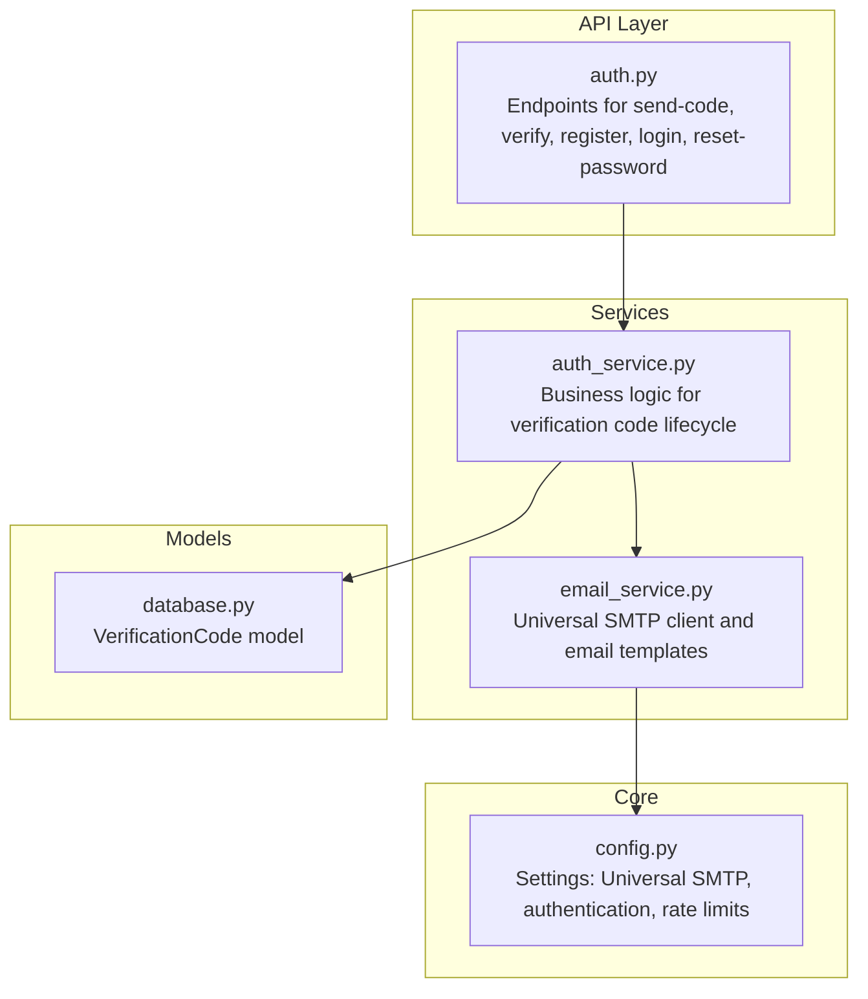
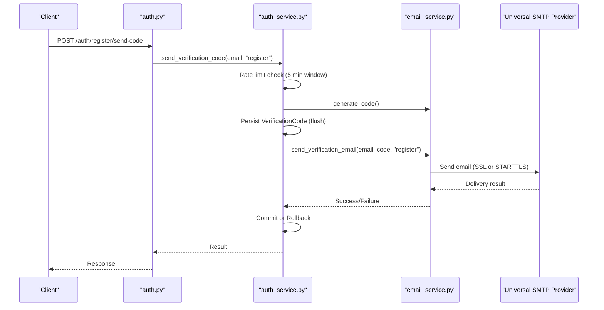
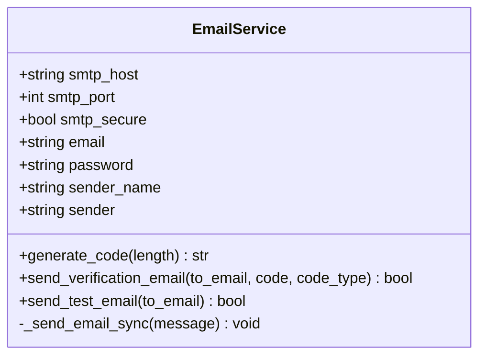
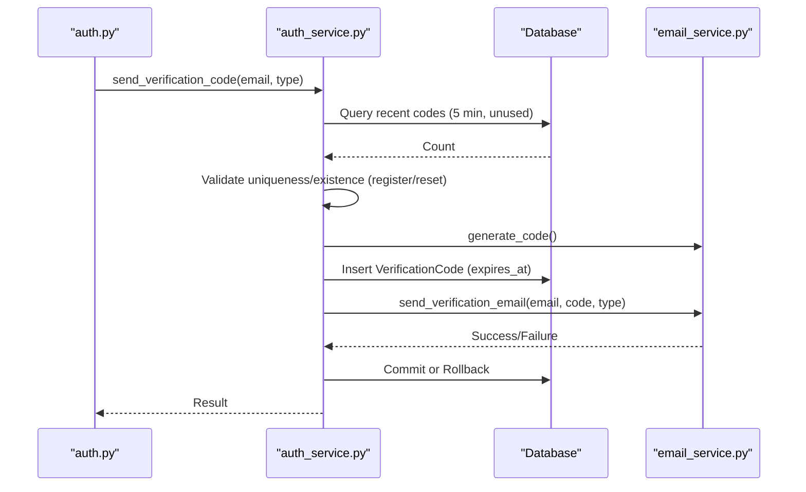
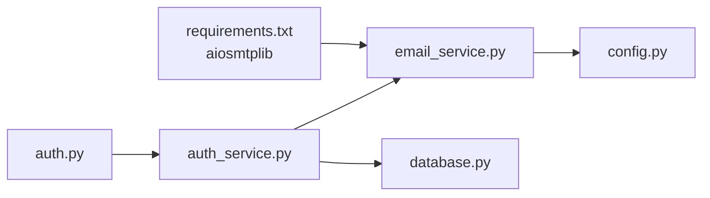

# Email Service

<cite>
**Referenced Files in This Document**
- [email_service.py](file://backend/app/services/email_service.py)
- [auth_service.py](file://backend/app/services/auth_service.py)
- [auth.py](file://backend/app/api/v1/auth.py)
- [config.py](file://backend/app/core/config.py)
- [database.py](file://backend/app/models/database.py)
- [auth.py](file://backend/app/schemas/auth.py)
- [requirements.txt](file://backend/requirements.txt)
- [test_email_service.py](file://backend/tests/test_email_service.py)
- [test_smtp.py](file://backend/test_smtp.py)
</cite>

## Update Summary
**Changes Made**
- Updated SMTP configuration from QQ-specific fields to universal SMTP fields (smtp_host, smtp_port, smtp_secure, smtp_email, smtp_password, smtp_sender_name)
- Enhanced authentication mechanism with display name support through email_sender property
- Updated email templates and sender formatting to support customizable sender names
- Revised troubleshooting guide to reflect new SMTP configuration requirements
- Updated all code examples and configuration references to use new universal SMTP approach

## Table of Contents
1. [Introduction](#introduction)
2. [Project Structure](#project-structure)
3. [Core Components](#core-components)
4. [Architecture Overview](#architecture-overview)
5. [Detailed Component Analysis](#detailed-component-analysis)
6. [Dependency Analysis](#dependency-analysis)
7. [Performance Considerations](#performance-considerations)
8. [Troubleshooting Guide](#troubleshooting-guide)
9. [Conclusion](#conclusion)

## Introduction
This document provides comprehensive documentation for the email service implementation, focusing on universal SMTP integration, email templating, verification code generation, and notification delivery. The system has been refactored from QQ-specific configuration to a universal SMTP-based approach, supporting any SMTP provider with enhanced authentication and sender formatting capabilities. It covers the methods for sending verification emails, password reset emails, test emails, and generating verification codes. It also documents SMTP configuration, rate limiting, error handling, retry mechanisms, email validation, and security considerations for reliable email delivery across different SMTP providers.

## Project Structure
The email service is implemented as a dedicated service module and integrated with authentication and API layers. The configuration is now centralized via universal SMTP settings with enhanced authentication and sender formatting capabilities, and the database stores verification codes with expiration and usage tracking.

**Diagram sources**
- [auth.py:1-446](file://backend/app/api/v1/auth.py#L1-L446)
- [auth_service.py:1-358](file://backend/app/services/auth_service.py#L1-L358)
- [email_service.py:1-228](file://backend/app/services/email_service.py#L1-L228)
- [config.py:1-125](file://backend/app/core/config.py#L1-L125)
- [database.py:47-70](file://backend/app/models/database.py#L47-L70)

**Section sources**
- [auth.py:1-446](file://backend/app/api/v1/auth.py#L1-L446)
- [auth_service.py:1-358](file://backend/app/services/auth_service.py#L1-L358)
- [email_service.py:1-228](file://backend/app/services/email_service.py#L1-L228)
- [config.py:1-125](file://backend/app/core/config.py#L1-L125)
- [database.py:1-70](file://backend/app/models/database.py#L1-L70)

## Core Components
- **EmailService**: Provides asynchronous and synchronous SMTP transport with universal SMTP support, template rendering for verification emails, and a test email method. It supports any SMTP provider with SSL (port 465) or STARTTLS (port 587) based on configuration, enhanced with display name support for sender formatting.
- **AuthService**: Orchestrates verification code generation, rate limiting, database persistence, and email dispatch. It ensures transaction safety by writing the verification record before sending the email and rolling back on failure.
- **Configuration**: Centralized settings for universal SMTP host/port, SSL mode, email credentials, sender display names, verification code expiration, and rate limits.
- **Database Model**: VerificationCode tracks email, code, type, expiration, and usage state.
- **API Endpoints**: Expose send-code, verify, register, login, and reset-password flows that integrate with the email service.

Key methods to document:
- EmailService.send_verification_email(to_email, code, code_type)
- EmailService.send_test_email(to_email)
- EmailService.generate_code(length)
- AuthService.send_verification_code(db, email, code_type)
- AuthService.verify_code(db, email, code, code_type)

**Section sources**
- [email_service.py:25-228](file://backend/app/services/email_service.py#L25-L228)
- [auth_service.py:16-141](file://backend/app/services/auth_service.py#L16-L141)
- [config.py:39-71](file://backend/app/core/config.py#L39-L71)
- [database.py:47-70](file://backend/app/models/database.py#L47-L70)
- [auth.py:25-446](file://backend/app/api/v1/auth.py#L25-L446)

## Architecture Overview
The email service architecture integrates FastAPI endpoints, an authentication service, and a dedicated email service with universal SMTP support. The email service encapsulates SMTP transport and templating with enhanced authentication capabilities, while the authentication service manages rate limiting, database transactions, and verification lifecycle.

**Diagram sources**
- [auth.py:25-53](file://backend/app/api/v1/auth.py#L25-L53)
- [auth_service.py:19-97](file://backend/app/services/auth_service.py#L19-L97)
- [email_service.py:48-154](file://backend/app/services/email_service.py#L48-L154)

## Detailed Component Analysis

### EmailService
**Updated** Complete refactoring from QQ-specific configuration to universal SMTP-based approach with enhanced authentication and sender formatting.

Responsibilities:
- Generate numeric verification codes of configurable length.
- Render subject and body templates for registration, login, and password reset.
- Send emails asynchronously using aiosmtplib if available, otherwise fall back to synchronous smtplib in a thread pool.
- Support SSL (port 465) and STARTTLS (port 587) based on configuration with universal SMTP provider compatibility.

Key methods:
- generate_code(length): Static method to produce a numeric code.
- send_verification_email(to_email, code, code_type): Asynchronously sends a templated email based on code_type.
- send_test_email(to_email): Sends a system test email.

**SMTP Configuration**:
- Host, port, and secure mode are loaded from universal SMTP settings.
- Credentials are the SMTP email address and password/authorization code.
- Enhanced sender formatting with display names through email_sender property.

Rate limiting and retries:
- The email service does not implement internal retries. Retries should be handled at the caller level (e.g., API or service layer) if needed.

Templating:
- Three templates are supported: register, reset, and login. Each has a distinct subject and body with expiration notice and brand signature.

Security considerations:
- Uses SSL or STARTTLS based on settings.
- Credentials are stored in environment-backed settings.
- UTF-8 content is used for proper internationalization.
- Enhanced authentication with display name support for professional sender formatting.

Error handling:
- Exceptions during SMTP send are caught and surfaced as False. Logging prints the error message.

Integration points:
- Used by AuthService for sending verification emails.
- Exposed via API endpoint for testing.

**Section sources**
- [email_service.py:25-228](file://backend/app/services/email_service.py#L25-L228)
- [config.py:39-71](file://backend/app/core/config.py#L39-L71)

#### Class Diagram

**Diagram sources**
- [email_service.py:25-228](file://backend/app/services/email_service.py#L25-L228)

### AuthService
Responsibilities:
- Enforce rate limiting: maximum number of requests per 5-minute window.
- Validate email existence for register/reset flows.
- Generate verification codes via EmailService.
- Persist verification records with expiration timestamps.
- Send emails and handle commit/rollback semantics around email dispatch.

Key methods:
- send_verification_code(db, email, code_type): Orchestrates rate limiting, validation, code generation, persistence, and email dispatch.
- verify_code(db, email, code, code_type): Validates code against the latest unexpired, unused record.

Database model:
- VerificationCode stores email, code, type, expires_at, used, and timestamps.

Integration with EmailService:
- Calls EmailService.generate_code() and EmailService.send_verification_email().

**Section sources**
- [auth_service.py:16-141](file://backend/app/services/auth_service.py#L16-L141)
- [database.py:47-70](file://backend/app/models/database.py#L47-L70)

#### Sequence Diagram: Verification Code Lifecycle

**Diagram sources**
- [auth_service.py:19-97](file://backend/app/services/auth_service.py#L19-L97)
- [email_service.py:36-46](file://backend/app/services/email_service.py#L36-L46)
- [email_service.py:48-154](file://backend/app/services/email_service.py#L48-L154)

### API Endpoints
Endpoints that utilize the email service:
- POST /auth/register/send-code: Sends registration verification code.
- POST /auth/register/verify: Verifies registration code (without registering).
- POST /auth/register: Registers user after verifying code.
- POST /auth/login/send-code: Sends login verification code.
- POST /auth/login: Logs in using verification code.
- POST /auth/reset-password/send-code: Sends password reset verification code.
- POST /auth/reset-password: Resets password after verifying code.
- GET /auth/test-email: Tests email delivery.

Validation:
- Pydantic schemas enforce email format and field constraints.

**Section sources**
- [auth.py:25-446](file://backend/app/api/v1/auth.py#L25-L446)
- [auth.py:10-96](file://backend/app/schemas/auth.py#L10-L96)

## Dependency Analysis
External dependencies:
- aiosmtplib: Enables asynchronous SMTP transport for universal SMTP providers.
- smtplib: Provides synchronous SMTP transport fallback.
- pydantic-settings: Loads environment variables into typed settings with enhanced configuration management.

Internal dependencies:
- EmailService depends on Settings for universal SMTP and email credentials.
- AuthService depends on EmailService for code generation and email sending, and on VerificationCode model for persistence.
- API endpoints depend on AuthService for business logic.

**Diagram sources**
- [requirements.txt:18-20](file://backend/requirements.txt#L18-L20)
- [email_service.py:14-33](file://backend/app/services/email_service.py#L14-L33)
- [config.py:39-71](file://backend/app/core/config.py#L39-L71)
- [auth_service.py:10-13](file://backend/app/services/auth_service.py#L10-L13)
- [database.py:47-70](file://backend/app/models/database.py#L47-L70)
- [auth.py:18-21](file://backend/app/api/v1/auth.py#L18-L21)

**Section sources**
- [requirements.txt:1-26](file://backend/requirements.txt#L1-L26)
- [email_service.py:14-33](file://backend/app/services/email_service.py#L14-L33)
- [auth_service.py:10-13](file://backend/app/services/auth_service.py#L10-L13)
- [database.py:47-70](file://backend/app/models/database.py#L47-L70)
- [auth.py:18-21](file://backend/app/api/v1/auth.py#L18-L21)

## Performance Considerations
- Asynchronous SMTP: When aiosmtplib is available, email sending is non-blocking and scales better under concurrent load with universal SMTP provider support.
- Thread pool fallback: When aiosmtplib is unavailable, synchronous smtplib runs in a thread pool to avoid blocking the event loop.
- Rate limiting: Built-in throttling reduces SMTP traffic and prevents abuse.
- UTF-8 content: Ensures proper rendering of international characters in templates.
- Universal provider compatibility: Supports any SMTP provider with configurable authentication and sender formatting.

## Troubleshooting Guide
**Updated** Comprehensive troubleshooting guide reflecting universal SMTP configuration changes.

Common SMTP issues and resolutions:
- Missing aiosmtplib: The service falls back to synchronous smtplib. Install aiosmtplib for optimal performance with universal SMTP providers.
- SSL vs STARTTLS mismatch: Ensure smtp_secure matches the configured port (SSL for 465, STARTTLS for 587).
- Universal SMTP authentication: Use the SMTP email address and password/authorization code as configured in universal settings.
- Rate limiting errors: Requests exceeding the 5-minute cap are rejected; reduce frequency or adjust settings.
- Email validation failures: Ensure the email conforms to the validated schema format.
- Sender formatting issues: Verify smtp_sender_name is properly configured for display name formatting.

**SMTP Provider Configuration Examples**:
- **Gmail**: smtp_host="smtp.gmail.com", smtp_port=465, smtp_secure=True, smtp_email="your@gmail.com", smtp_password="your-app-password"
- **Outlook/Hotmail**: smtp_host="smtp-mail.outlook.com", smtp_port=587, smtp_secure=False, smtp_email="your@outlook.com", smtp_password="your-password"
- **QQ Mail**: smtp_host="smtp.qq.com", smtp_port=465, smtp_secure=True, smtp_email="your@qq.com", smtp_password="your-auth-code"
- **163/126 Mail**: smtp_host="smtp.163.com", smtp_port=465, smtp_secure=True, smtp_email="your@163.com", smtp_password="your-auth-code"

Operational checks:
- Use the test endpoint to validate SMTP configuration with any universal SMTP provider.
- Review logs for SMTP exceptions printed during send attempts.
- Verify sender formatting displays proper display name in email clients.

**Section sources**
- [email_service.py:16-22](file://backend/app/services/email_service.py#L16-L22)
- [email_service.py:120-154](file://backend/app/services/email_service.py#L120-L154)
- [auth.py:419-446](file://backend/app/api/v1/auth.py#L419-L446)
- [config.py:39-71](file://backend/app/core/config.py#L39-L71)
- [test_smtp.py:1-52](file://backend/test_smtp.py#L1-L52)

## Conclusion
The email service provides a robust, universal solution for sending verification and notification emails using any SMTP provider. The system has been successfully refactored from QQ-specific configuration to a universal SMTP-based approach with enhanced authentication mechanisms and sender formatting capabilities. It integrates cleanly with the authentication service and API layer, offering strong defaults for rate limiting, validation, and error handling. By leveraging asynchronous SMTP when available and falling back gracefully, it balances performance and reliability across different SMTP providers. Proper configuration of universal SMTP settings and adherence to rate limits ensure dependable email delivery for registration, login, and password reset workflows with professional sender formatting support.