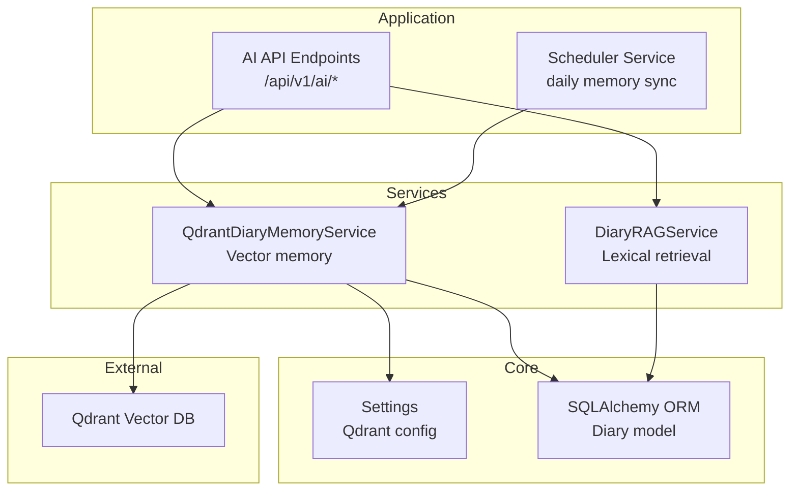
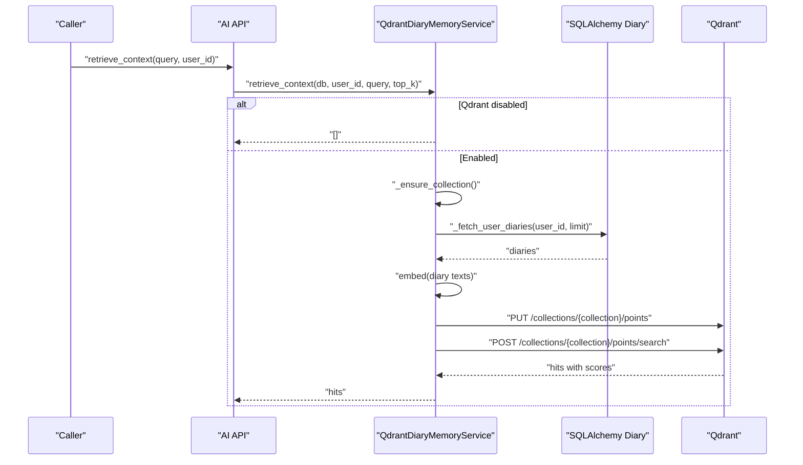
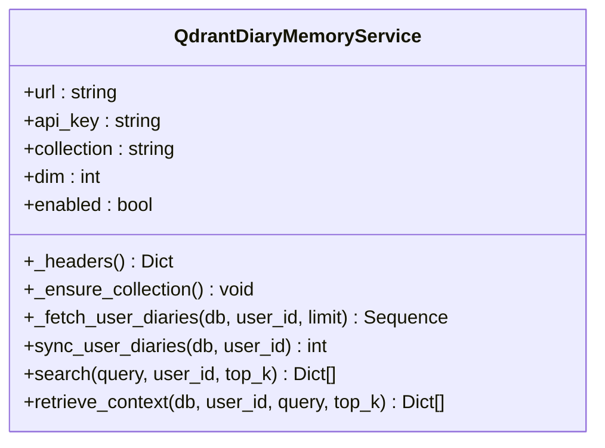
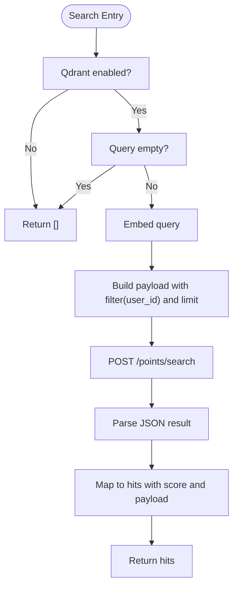
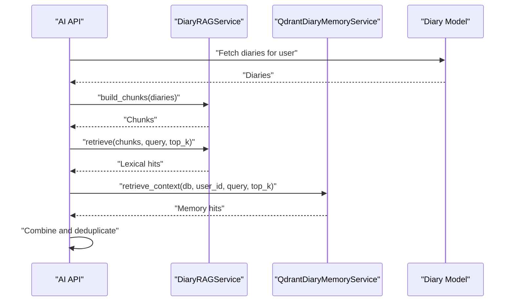
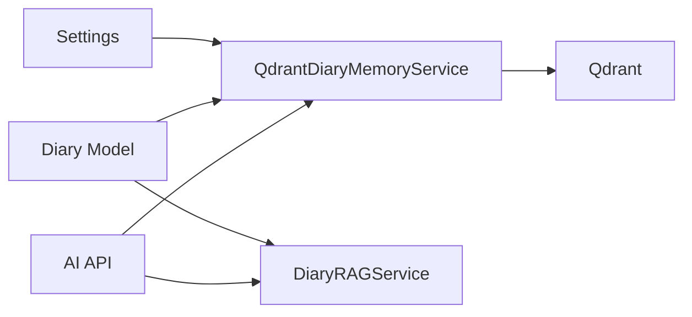

# Qdrant Memory Service

<cite>
**Referenced Files in This Document**
- [qdrant_memory_service.py](file://backend/app/services/qdrant_memory_service.py)
- [rag_service.py](file://backend/app/services/rag_service.py)
- [config.py](file://backend/app/core/config.py)
- [diary.py](file://backend/app/models/diary.py)
- [ai.py](file://backend/app/api/v1/ai.py)
- [scheduler_service.py](file://backend/app/services/scheduler_service.py)
- [main.py](file://backend/main.py)
</cite>

## Table of Contents
1. [Introduction](#introduction)
2. [Project Structure](#project-structure)
3. [Core Components](#core-components)
4. [Architecture Overview](#architecture-overview)
5. [Detailed Component Analysis](#detailed-component-analysis)
6. [Dependency Analysis](#dependency-analysis)
7. [Performance Considerations](#performance-considerations)
8. [Troubleshooting Guide](#troubleshooting-guide)
9. [Conclusion](#conclusion)

## Introduction
This document describes the Qdrant memory service that powers vector-based memory retrieval for user diaries. It covers vector database integration, embedding generation, semantic search, and memory management. It also explains how the service integrates with the RAG pipeline and the broader application lifecycle, including configuration, collection management, vector indexing, search optimization, and performance tuning.

## Project Structure
The Qdrant memory service is implemented as a dedicated service module and integrates with:
- Configuration management for Qdrant connection and vector dimension
- Diary model for retrieving user entries
- RAG service for complementary lexical retrieval
- API endpoints for higher-level analysis workflows
- Scheduler service for periodic memory maintenance

**Diagram sources**
- [qdrant_memory_service.py:45-188](file://backend/app/services/qdrant_memory_service.py#L45-L188)
- [rag_service.py:147-360](file://backend/app/services/rag_service.py#L147-L360)
- [config.py:72-88](file://backend/app/core/config.py#L72-L88)
- [diary.py:29-64](file://backend/app/models/diary.py#L29-L64)
- [ai.py:267-403](file://backend/app/api/v1/ai.py#L267-L403)
- [scheduler_service.py:76-134](file://backend/app/services/scheduler_service.py#L76-L134)

**Section sources**
- [qdrant_memory_service.py:1-188](file://backend/app/services/qdrant_memory_service.py#L1-L188)
- [config.py:72-88](file://backend/app/core/config.py#L72-L88)
- [diary.py:29-64](file://backend/app/models/diary.py#L29-L64)
- [ai.py:267-403](file://backend/app/api/v1/ai.py#L267-L403)
- [scheduler_service.py:76-134](file://backend/app/services/scheduler_service.py#L76-L134)

## Core Components
- QdrantDiaryMemoryService: Manages Qdrant collection creation, vector embedding, upsert, and semantic search for user diaries.
- DiaryRAGService: Provides lexical chunking and BM25-based retrieval for complementary semantic coverage.
- Settings: Centralized configuration for Qdrant URL, API key, collection name, and vector dimension.
- Diary model: Provides structured access to user diary entries for memory synchronization.

Key methods and responsibilities:
- initialize_qdrant_client(): Construct client from settings and headers.
- create_collection_if_not_exists(): Ensure Qdrant collection exists with configured vector size and distance metric.
- upsert_vectors(): Embed diary text into vectors and upload points with payload metadata.
- search_similar_vectors(): Compute query embedding and perform cosine-similarity search with user filter.
- manage_memory_collections(): Orchestrate synchronization and retrieval via retrieve_context().

**Section sources**
- [qdrant_memory_service.py:45-188](file://backend/app/services/qdrant_memory_service.py#L45-L188)
- [config.py:72-88](file://backend/app/core/config.py#L72-L88)
- [diary.py:29-64](file://backend/app/models/diary.py#L29-L64)

## Architecture Overview
The memory service operates as an asynchronous HTTP client to Qdrant, embedding text using a lightweight hashing strategy and storing diary metadata alongside vectors. Retrieval filters by user ID and returns ranked matches with scores and payload fields.

**Diagram sources**
- [qdrant_memory_service.py:62-131](file://backend/app/services/qdrant_memory_service.py#L62-L131)
- [qdrant_memory_service.py:133-186](file://backend/app/services/qdrant_memory_service.py#L133-L186)
- [diary.py:85-92](file://backend/app/models/diary.py#L85-L92)

**Section sources**
- [qdrant_memory_service.py:62-186](file://backend/app/services/qdrant_memory_service.py#L62-L186)
- [ai.py:267-403](file://backend/app/api/v1/ai.py#L267-L403)

## Detailed Component Analysis

### QdrantDiaryMemoryService
Responsibilities:
- Initialize client from settings (URL, API key, collection, dimension).
- Ensure collection existence with vector size and Cosine distance.
- Sync user diaries to Qdrant by embedding title+content and uploading points with payload.
- Search similar vectors for a query with user-scoped filtering.
- Retrieve context by syncing then searching.

Embedding strategy:
- Tokenization supports English words and Chinese characters.
- Hash-based vectorization with L2 normalization to unit vectors.
- Point IDs combine user_id and diary_id for uniqueness.

Search optimization:
- Limits results to a bounded range and requests payload.
- Filters by user_id to avoid cross-user retrieval.
- Returns structured hits with scores and diary metadata.

Memory management:
- Synchronization fetches recent diaries and upserts vectors.
- Retrieval context ensures data freshness by syncing before search.

**Diagram sources**
- [qdrant_memory_service.py:45-188](file://backend/app/services/qdrant_memory_service.py#L45-L188)

**Section sources**
- [qdrant_memory_service.py:45-188](file://backend/app/services/qdrant_memory_service.py#L45-L188)

### Embedding Generation and Vector Indexing
- Tokenization: Lowercased tokens with regex patterns for English and Chinese.
- Hash embedding: MD5-based hashing distributes token contributions across vector dimensions; L2 normalization yields unit vectors.
- Payload fields: user_id, diary_id, diary_date, title, snippet, emotion_tags, importance_score.
- Collection creation: Sets vector size and Cosine distance for similarity scoring.

Batch processing:
- Synchronization batches diary embeddings and uploads as points.
- Search accepts a single query vector and returns top-k nearest neighbors.

**Section sources**
- [qdrant_memory_service.py:19-42](file://backend/app/services/qdrant_memory_service.py#L19-L42)
- [qdrant_memory_service.py:62-83](file://backend/app/services/qdrant_memory_service.py#L62-L83)
- [qdrant_memory_service.py:85-131](file://backend/app/services/qdrant_memory_service.py#L85-L131)

### Semantic Search Implementation
- Query embedding: Same hash-based strategy as documents.
- Filtered search: Restrict results to the requesting user.
- Ranking: Cosine similarity score returned by Qdrant; normalized to four decimals in results.

**Diagram sources**
- [qdrant_memory_service.py:133-173](file://backend/app/services/qdrant_memory_service.py#L133-L173)

**Section sources**
- [qdrant_memory_service.py:133-173](file://backend/app/services/qdrant_memory_service.py#L133-L173)

### Integration with RAG Service
- Lexical retrieval: DiaryRAGService builds chunks from diary summaries and raw content, applies BM25 and temporal/emotional weighting.
- Hybrid retrieval: The AI analysis endpoint composes evidence from both lexical and memory-based retrieval.
- Deduplication: Jaccard-based deduplication reduces redundant evidence.

**Diagram sources**
- [rag_service.py:147-360](file://backend/app/services/rag_service.py#L147-L360)
- [qdrant_memory_service.py:175-186](file://backend/app/services/qdrant_memory_service.py#L175-L186)
- [ai.py:267-403](file://backend/app/api/v1/ai.py#L267-L403)

**Section sources**
- [rag_service.py:147-360](file://backend/app/services/rag_service.py#L147-L360)
- [ai.py:267-403](file://backend/app/api/v1/ai.py#L267-L403)

### Memory Management and Lifecycle
- Periodic sync: Scheduler scans users with recent diaries and triggers memory updates.
- On-demand sync: retrieve_context() ensures vectors are up-to-date before search.
- Freshness guarantees: Recent diary limits and user-scoped filters maintain relevance.

**Section sources**
- [scheduler_service.py:76-134](file://backend/app/services/scheduler_service.py#L76-L134)
- [qdrant_memory_service.py:175-186](file://backend/app/services/qdrant_memory_service.py#L175-L186)

## Dependency Analysis
- QdrantDiaryMemoryService depends on:
  - Settings for Qdrant URL, API key, collection, and vector dimension.
  - SQLAlchemy Diary model for fetching user entries.
  - httpx for asynchronous HTTP communication with Qdrant.
- DiaryRAGService depends on:
  - Diary model data for chunking and weighting.
  - Internal tokenization and BM25 scoring logic.
- AI API endpoints depend on:
  - Both Qdrant memory and RAG services for evidence retrieval.

**Diagram sources**
- [config.py:72-88](file://backend/app/core/config.py#L72-L88)
- [qdrant_memory_service.py:45-51](file://backend/app/services/qdrant_memory_service.py#L45-L51)
- [diary.py:29-64](file://backend/app/models/diary.py#L29-L64)
- [rag_service.py:147-186](file://backend/app/services/rag_service.py#L147-L186)
- [ai.py:267-403](file://backend/app/api/v1/ai.py#L267-L403)

**Section sources**
- [config.py:72-88](file://backend/app/core/config.py#L72-L88)
- [qdrant_memory_service.py:45-51](file://backend/app/services/qdrant_memory_service.py#L45-L51)
- [diary.py:29-64](file://backend/app/models/diary.py#L29-L64)
- [rag_service.py:147-186](file://backend/app/services/rag_service.py#L147-L186)
- [ai.py:267-403](file://backend/app/api/v1/ai.py#L267-L403)

## Performance Considerations
- Vector dimension: Ensure qdrant_vector_dim matches the embedding dimension to avoid mismatches.
- Batch upsert: Upsert multiple points per request to reduce network overhead.
- Limit search results: Constrain top_k to balance latency and recall.
- Payload size: Keep payload fields concise; only include necessary metadata.
- Network timeouts: Tune client timeouts for Qdrant operations.
- Tokenization cost: Pre-tokenize and reuse token sets where feasible.
- Index distance: Cosine distance is appropriate for normalized vectors; ensure consistent preprocessing.

[No sources needed since this section provides general guidance]

## Troubleshooting Guide
Common issues and resolutions:
- Qdrant disabled: If URL or API key are missing, the service returns empty results. Verify settings.
- Empty query: Queries must be non-empty; otherwise, no search is performed.
- Collection not found: The service attempts to create the collection with configured vector size and distance; ensure credentials and permissions are valid.
- Network errors: Inspect timeouts and connectivity; wrap calls with retry logic if needed.
- Dimension mismatch: If embedding dimension differs from collection vector size, upsert/search will fail.
- Payload filtering: Ensure user_id is present in payload and correctly indexed for filtering.

**Section sources**
- [qdrant_memory_service.py:52-54](file://backend/app/services/qdrant_memory_service.py#L52-L54)
- [qdrant_memory_service.py:133-137](file://backend/app/services/qdrant_memory_service.py#L133-L137)
- [qdrant_memory_service.py:62-83](file://backend/app/services/qdrant_memory_service.py#L62-L83)
- [config.py:72-88](file://backend/app/core/config.py#L72-L88)

## Conclusion
The Qdrant memory service provides efficient, user-scoped semantic search over diary content by combining a lightweight hash-based embedding strategy with Qdrant’s vector indexing and cosine similarity. It integrates seamlessly with the RAG pipeline and the AI analysis workflows, ensuring timely and relevant memory-driven insights. Proper configuration, dimension alignment, and careful payload design are essential for reliable operation and optimal performance.