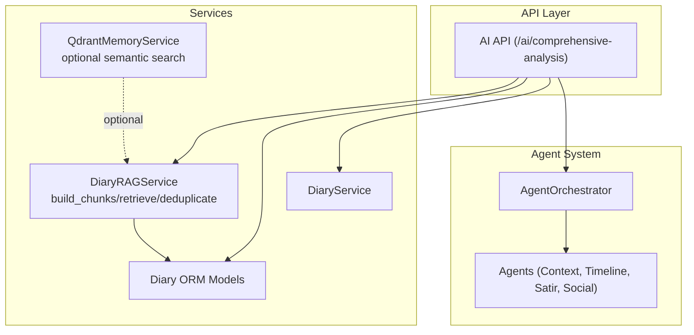
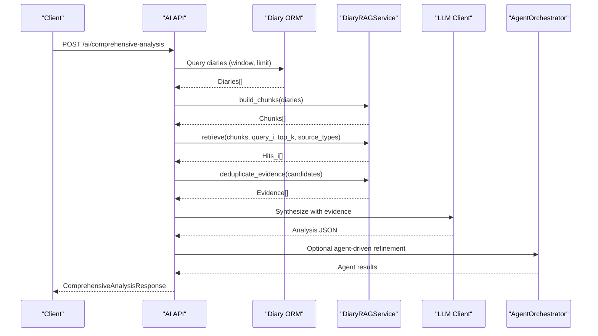
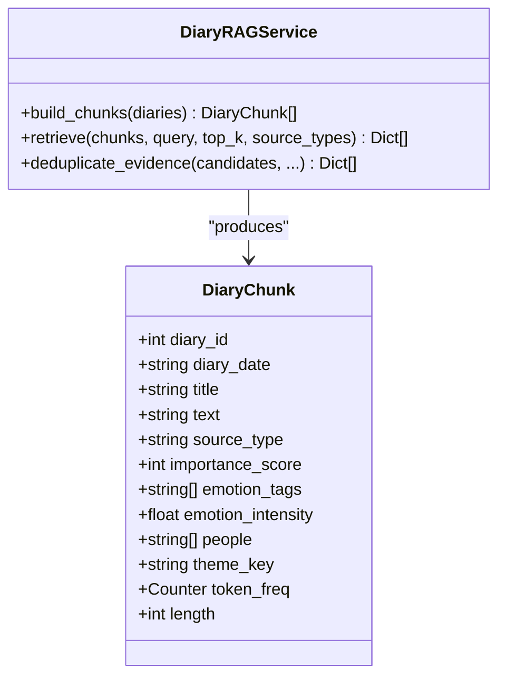
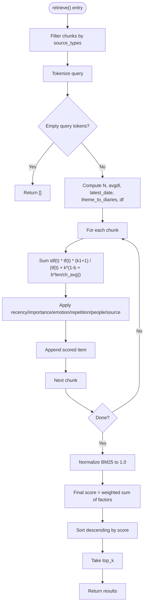
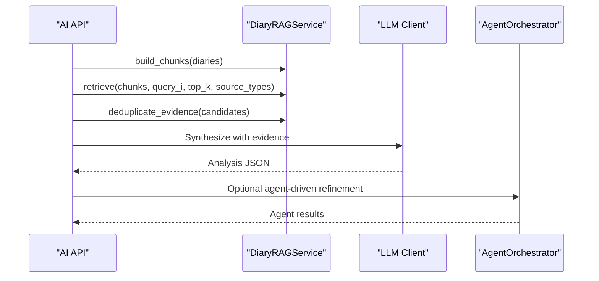
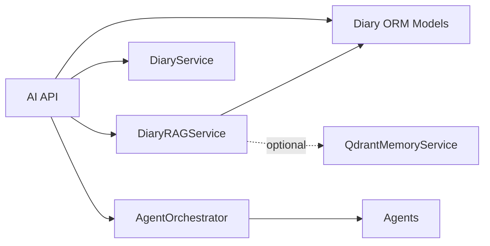

# RAG Service

<cite>
**Referenced Files in This Document**
- [rag_service.py](file://backend/app/services/rag_service.py)
- [ai.py](file://backend/app/api/v1/ai.py)
- [diary.py](file://backend/app/models/diary.py)
- [diary_service.py](file://backend/app/services/diary_service.py)
- [qdrant_memory_service.py](file://backend/app/services/qdrant_memory_service.py)
- [orchestrator.py](file://backend/app/agents/orchestrator.py)
- [agent_impl.py](file://backend/app/agents/agent_impl.py)
- [state.py](file://backend/app/agents/state.py)
</cite>

## Table of Contents
1. [Introduction](#introduction)
2. [Project Structure](#project-structure)
3. [Core Components](#core-components)
4. [Architecture Overview](#architecture-overview)
5. [Detailed Component Analysis](#detailed-component-analysis)
6. [Dependency Analysis](#dependency-analysis)
7. [Performance Considerations](#performance-considerations)
8. [Troubleshooting Guide](#troubleshooting-guide)
9. [Conclusion](#conclusion)
10. [Appendices](#appendices)

## Introduction
This document explains the Retrieval-Augmented Generation (RAG) service powering lightweight lexical retrieval over user diaries. It covers the BM25-based retrieval, diary chunking strategies, evidence deduplication, hybrid scoring, and integration with the agent system for AI analysis workflows. It also documents the RAG pipeline exposed via the API, parameter tuning guidelines, performance optimization, memory management, and future directions for semantic search integration.

## Project Structure
The RAG service is implemented as a standalone service and integrated into the AI analysis pipeline. The key modules are:
- RAG service: builds chunks, retrieves with BM25 plus lexical weighting, and deduplicates evidence
- API: orchestrates RAG for user-level comprehensive analysis
- Agent system: consumes RAG results to inform multi-agent analysis
- Supporting services: Qdrant memory service for optional semantic search

**Diagram sources**
- [ai.py:267-403](file://backend/app/api/v1/ai.py#L267-L403)
- [rag_service.py:147-359](file://backend/app/services/rag_service.py#L147-L359)
- [diary.py:29-64](file://backend/app/models/diary.py#L29-L64)
- [diary_service.py:66-105](file://backend/app/services/diary_service.py#L66-L105)
- [qdrant_memory_service.py:45-188](file://backend/app/services/qdrant_memory_service.py#L45-L188)
- [orchestrator.py:18-176](file://backend/app/agents/orchestrator.py#L18-L176)

**Section sources**
- [ai.py:267-403](file://backend/app/api/v1/ai.py#L267-L403)
- [rag_service.py:147-359](file://backend/app/services/rag_service.py#L147-L359)
- [diary.py:29-64](file://backend/app/models/diary.py#L29-L64)
- [diary_service.py:66-105](file://backend/app/services/diary_service.py#L66-L105)
- [qdrant_memory_service.py:45-188](file://backend/app/services/qdrant_memory_service.py#L45-L188)
- [orchestrator.py:18-176](file://backend/app/agents/orchestrator.py#L18-L176)

## Core Components
- DiaryRAGService: Implements chunk building, BM25 retrieval with lexical weighting, and evidence deduplication.
- API endpoint: Aggregates multiple RAG queries, merges results, deduplicates, and feeds them into downstream analysis.
- Agent system: Consumes RAG evidence to guide multi-agent psychological analysis and social content generation.

Key responsibilities:
- Chunking: Builds both “summary” and “raw” chunks from diary entries.
- Retrieval: BM25 with IDF/TDF normalization, plus recency, importance, emotion intensity, repetition penalty, people hit bonus, and source bonus.
- Deduplication: Jaccard-based fingerprinting with limits per diary and per reason category.
- Integration: API composes evidence and passes it to LLMs for synthesis.

**Section sources**
- [rag_service.py:147-359](file://backend/app/services/rag_service.py#L147-L359)
- [ai.py:267-403](file://backend/app/api/v1/ai.py#L267-L403)
- [agent_impl.py:92-484](file://backend/app/agents/agent_impl.py#L92-L484)

## Architecture Overview
The RAG pipeline integrates with the AI analysis workflow as follows:
- API fetches recent diaries for a user window
- RAG builds chunks and runs multiple targeted queries (emotional trends, continuity, turning points, growth cues, relationships)
- Results are deduplicated and ranked
- Evidence is passed to LLMs for synthesis and to agents for multi-layered analysis

**Diagram sources**
- [ai.py:267-403](file://backend/app/api/v1/ai.py#L267-L403)
- [rag_service.py:147-359](file://backend/app/services/rag_service.py#L147-L359)
- [orchestrator.py:27-131](file://backend/app/agents/orchestrator.py#L27-L131)

## Detailed Component Analysis

### DiaryRAGService
Implements:
- Chunk building: summary and raw chunks with tokenization, frequency counting, and theme keys
- Retrieval: BM25 scoring with recency, importance, emotion intensity, repetition penalty, people hit, and source bonus
- Deduplication: Jaccard similarity over token sets with configurable caps

Key methods and behaviors:
- build_chunks(): Produces DiaryChunk objects for summaries and raw text slices
- retrieve(): Filters by source type, computes BM25, normalizes, and applies weighted ranking
- deduplicate_evidence(): Limits per-diary and per-reason, and removes near-duplicate snippets

**Diagram sources**
- [rag_service.py:15-29](file://backend/app/services/rag_service.py#L15-L29)
- [rag_service.py:147-359](file://backend/app/services/rag_service.py#L147-L359)

**Section sources**
- [rag_service.py:147-359](file://backend/app/services/rag_service.py#L147-L359)

### BM25 Algorithm Implementation
- Tokenization supports English words and Chinese characters
- BM25 parameters: k1=1.5, b=0.75
- IDF computed per term across chunks
- TF normalized by document length and BM25 denominator
- Final score normalized by max BM25 score among scored chunks

Scoring factors:
- BM25 normalized weight
- Recency decay (exp(-days_ago/45))
- Importance (normalized 0..1)
- Emotion intensity (normalized 0..1)
- Repetition penalty (based on theme-to-diary cardinality)
- People hit bonus (presence of people in query)
- Source bonus (summary vs raw)

**Diagram sources**
- [rag_service.py:210-317](file://backend/app/services/rag_service.py#L210-L317)

**Section sources**
- [rag_service.py:210-317](file://backend/app/services/rag_service.py#L210-L317)

### Diary Chunking Strategies
- Summary chunks: constructed from daily metadata and content preview
- Raw chunks: split by sentence/paragraph boundaries with overlap to preserve context
- Tokenization: lowercased, English alphanumerics and underscores, Chinese characters
- Theme key: derived from title, emotion tags, and people to penalize repeated themes

Optimization tips:
- Adjust max_len and overlap to balance granularity and coherence
- Prefer summary chunks for topical coverage and raw chunks for precise facts

**Section sources**
- [rag_service.py:147-208](file://backend/app/services/rag_service.py#L147-L208)

### Evidence Deduplication
- Sort by score descending
- Enforce limits:
  - max_total: total picks
  - max_per_diary: per-diary cap
  - per_reason_limit: per-reason category cap
- Fingerprinting: Jaccard similarity of token sets against previously accepted fingerprints
- Threshold defaults to 0.72

Tuning:
- Increase similarity_threshold to reduce redundancy at cost of recall
- Relax per_reason_limit to allow richer categories

**Section sources**
- [rag_service.py:319-356](file://backend/app/services/rag_service.py#L319-L356)

### Hybrid Scoring Mechanisms
- Lexical-first BM25 with recency and importance
- Additional lexical signals: emotion intensity, repetition penalty, people hit, and source bonus
- Final score is a weighted linear combination of the above

Parameter tuning:
- Weights reflect domain priorities; adjust to emphasize recency, emotion, or lexical matches
- k1 and b influence term saturation and length normalization

**Section sources**
- [rag_service.py:286-297](file://backend/app/services/rag_service.py#L286-L297)

### Semantic Search Integration
- QdrantMemoryService provides optional semantic search over hashed embeddings
- Can complement BM25 by capturing paraphrases and latent semantics
- Retrieval context method synchronizes user diaries and performs vector search

Integration approach:
- Run BM25 retrieval first, then optionally augment with Qdrant hits
- Merge and rerank using the same final score formula

**Section sources**
- [qdrant_memory_service.py:45-188](file://backend/app/services/qdrant_memory_service.py#L45-L188)

### API Integration and Agent Workflow
- API endpoint aggregates diaries, builds chunks, runs targeted queries, deduplicates, and synthesizes results
- Agents consume evidence to perform multi-layer psychological analysis and social content generation
- Evidence is included in the final response for interpretability

**Diagram sources**
- [ai.py:267-403](file://backend/app/api/v1/ai.py#L267-L403)
- [orchestrator.py:27-131](file://backend/app/agents/orchestrator.py#L27-L131)

**Section sources**
- [ai.py:267-403](file://backend/app/api/v1/ai.py#L267-L403)
- [agent_impl.py:92-484](file://backend/app/agents/agent_impl.py#L92-L484)
- [state.py:10-45](file://backend/app/agents/state.py#L10-L45)

## Dependency Analysis
- API depends on DiaryRAGService and Diary ORM models
- RAG service depends on internal helpers (tokenization, splitting, date parsing)
- Agent orchestrator depends on agents and state management
- Optional semantic search depends on Qdrant service

**Diagram sources**
- [ai.py:267-403](file://backend/app/api/v1/ai.py#L267-L403)
- [rag_service.py:147-359](file://backend/app/services/rag_service.py#L147-L359)
- [diary.py:29-64](file://backend/app/models/diary.py#L29-L64)
- [diary_service.py:66-105](file://backend/app/services/diary_service.py#L66-L105)
- [orchestrator.py:18-176](file://backend/app/agents/orchestrator.py#L18-L176)
- [qdrant_memory_service.py:45-188](file://backend/app/services/qdrant_memory_service.py#L45-L188)

**Section sources**
- [ai.py:267-403](file://backend/app/api/v1/ai.py#L267-L403)
- [rag_service.py:147-359](file://backend/app/services/rag_service.py#L147-L359)
- [diary.py:29-64](file://backend/app/models/diary.py#L29-L64)
- [diary_service.py:66-105](file://backend/app/services/diary_service.py#L66-L105)
- [orchestrator.py:18-176](file://backend/app/agents/orchestrator.py#L18-L176)
- [qdrant_memory_service.py:45-188](file://backend/app/services/qdrant_memory_service.py#L45-L188)

## Performance Considerations
- Tokenization and chunking costs scale with diary volume and length; precompute token frequencies during chunk building
- BM25 loop is O(N_chunks × N_query_terms); keep queries concise and avoid overly broad terms
- Deduplication uses Jaccard similarity; tune similarity_threshold to balance speed and quality
- Recency and repetition computations are linear in number of chunks; consider caching where appropriate
- Memory footprint dominated by chunk lists and scored candidate arrays; cap top_k and max_total to bound memory
- Optional Qdrant search adds latency; batch and reuse vectors when feasible

[No sources needed since this section provides general guidance]

## Troubleshooting Guide
Common issues and remedies:
- Empty or low-quality results
  - Verify query tokens are non-empty after tokenization
  - Ensure diaries exist for the selected window and are properly indexed
- Overfit to recent entries
  - Adjust recency decay constant and increase importance/emotion weights if needed
- Redundant or repetitive evidence
  - Lower similarity_threshold or tighten per_reason_limit
- Slow retrieval
  - Reduce top_k, max_total, or source_types filter
  - Pre-filter diaries by date range and importance
- Misaligned people hit bonus
  - Review people extraction logic and query normalization to lowercase

**Section sources**
- [rag_service.py:210-356](file://backend/app/services/rag_service.py#L210-L356)

## Conclusion
The RAG service provides a robust, interpretable, and efficient retrieval mechanism tailored for diary analysis. By combining BM25 with lexical heuristics and strict deduplication, it yields high-quality, non-redundant evidence for synthesis and agent-driven analysis. Optional semantic search integration offers complementary coverage for paraphrases and latent topics. With careful parameter tuning and performance controls, it scales to real-time user-level analysis while maintaining clarity and interpretability.

[No sources needed since this section summarizes without analyzing specific files]

## Appendices

### Parameter Tuning Guidelines
- BM25 parameters
  - k1: increase to favor higher-term counts; decrease to reduce saturation
  - b: increase to penalize long documents more; decrease for lenient length normalization
- Ranking weights
  - Adjust relative weights to emphasize recency, importance, emotion, repetition, people hit, or source bonus
- Deduplication
  - similarity_threshold: 0.72 default; raise to reduce duplication, lower to increase recall
  - max_total, max_per_diary, per_reason_limit: tune to balance diversity and coverage
- Chunking
  - max_len and overlap: balance granularity and coherence; larger overlap improves continuity

**Section sources**
- [rag_service.py:241-242](file://backend/app/services/rag_service.py#L241-L242)
- [rag_service.py:286-297](file://backend/app/services/rag_service.py#L286-L297)
- [rag_service.py:319-356](file://backend/app/services/rag_service.py#L319-L356)

### Example RAG Processing Pipelines
- User-level comprehensive analysis
  - Fetch diaries for the analysis window
  - Build chunks (summary + raw)
  - Run targeted queries (emotional trends, continuity, turning points, growth cues, relationships)
  - Merge and deduplicate evidence
  - Pass evidence to LLM for synthesis and to agents for multi-layer analysis

**Section sources**
- [ai.py:267-403](file://backend/app/api/v1/ai.py#L267-L403)
- [rag_service.py:147-359](file://backend/app/services/rag_service.py#L147-L359)