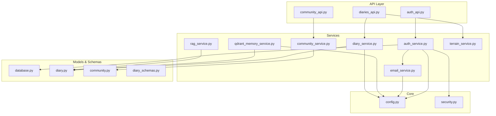
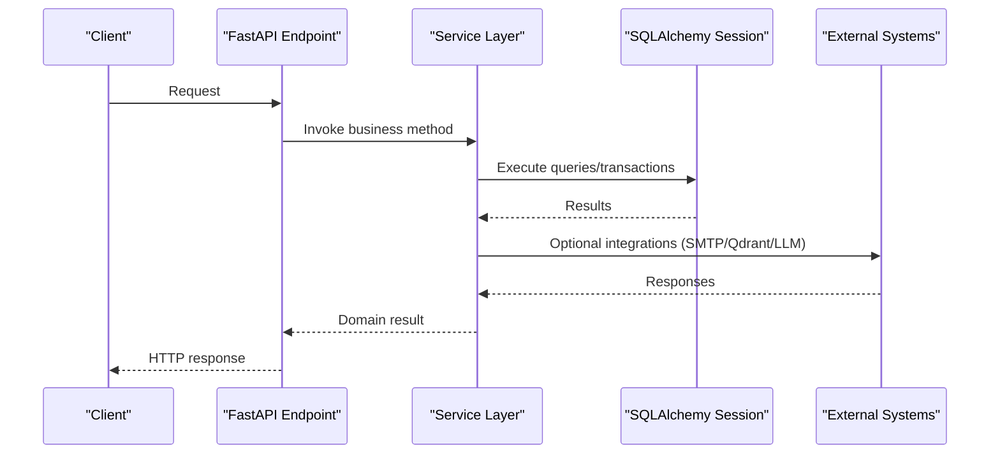
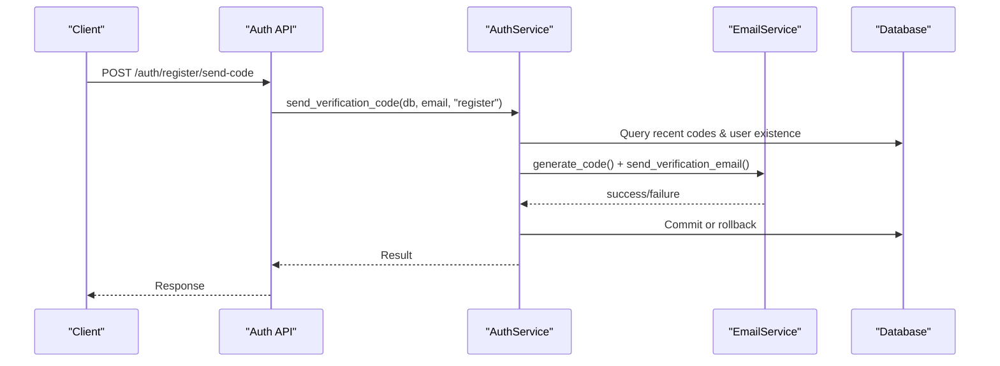
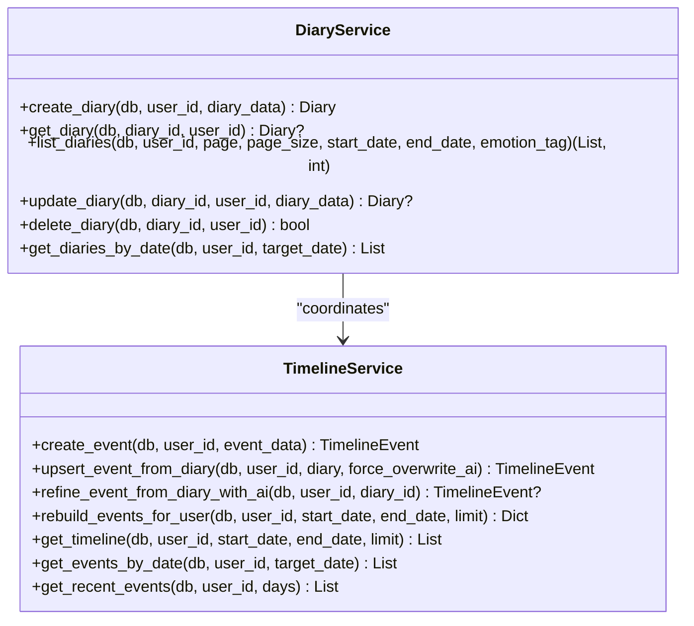
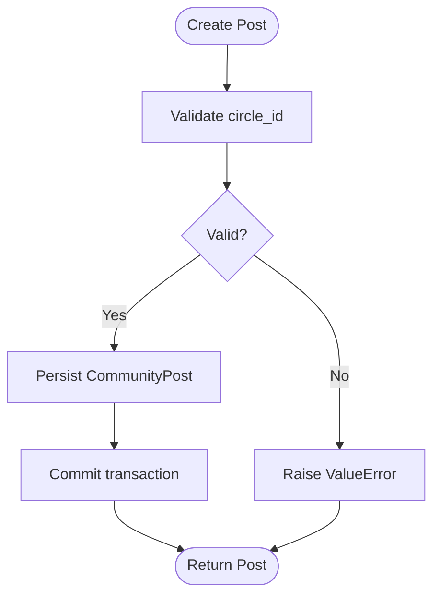
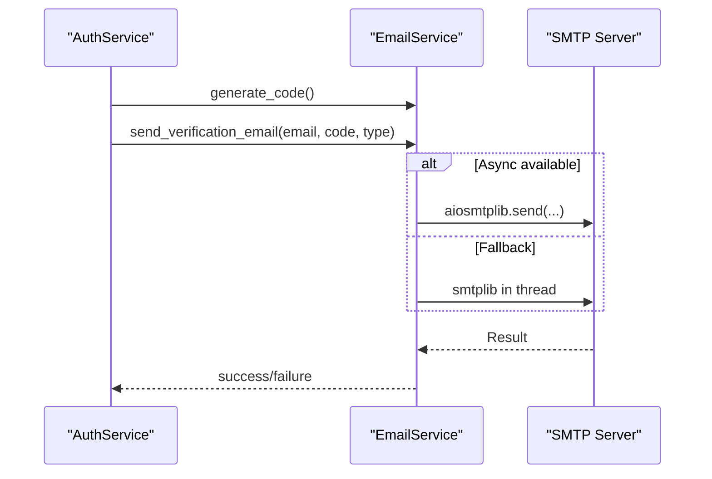
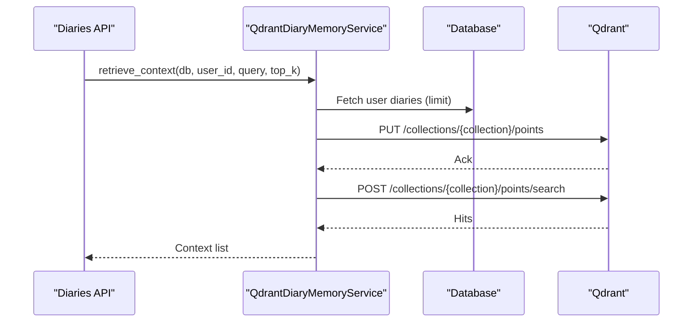
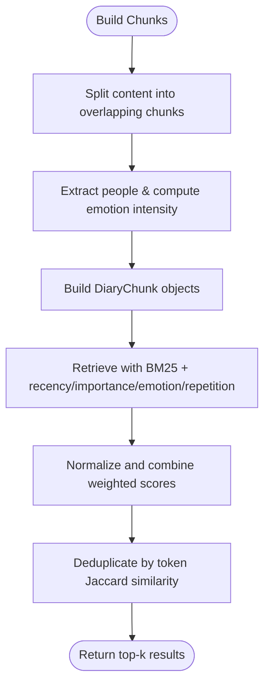
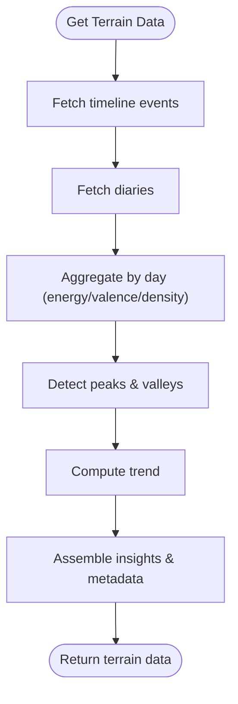
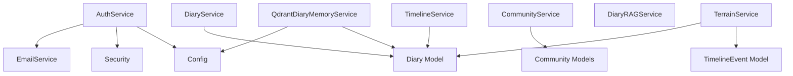

# Service Layer Implementation

<cite>
**Referenced Files in This Document**
- [auth_service.py](file://backend/app/services/auth_service.py)
- [diary_service.py](file://backend/app/services/diary_service.py)
- [community_service.py](file://backend/app/services/community_service.py)
- [email_service.py](file://backend/app/services/email_service.py)
- [qdrant_memory_service.py](file://backend/app/services/qdrant_memory_service.py)
- [rag_service.py](file://backend/app/services/rag_service.py)
- [terrain_service.py](file://backend/app/services/terrain_service.py)
- [config.py](file://backend/app/core/config.py)
- [security.py](file://backend/app/core/security.py)
- [database.py](file://backend/app/models/database.py)
- [diary.py](file://backend/app/models/diary.py)
- [community.py](file://backend/app/models/community.py)
- [diary_schemas.py](file://backend/app/schemas/diary.py)
- [auth_api.py](file://backend/app/api/v1/auth.py)
- [diaries_api.py](file://backend/app/api/v1/diaries.py)
- [community_api.py](file://backend/app/api/v1/community.py)
</cite>

## Table of Contents
1. [Introduction](#introduction)
2. [Project Structure](#project-structure)
3. [Core Components](#core-components)
4. [Architecture Overview](#architecture-overview)
5. [Detailed Component Analysis](#detailed-component-analysis)
6. [Dependency Analysis](#dependency-analysis)
7. [Performance Considerations](#performance-considerations)
8. [Troubleshooting Guide](#troubleshooting-guide)
9. [Conclusion](#conclusion)

## Introduction
This document provides comprehensive service layer documentation for the 映记 application's business logic. It covers authentication, diary management, community features, email delivery, Retrieval-Augmented Generation (RAG), vector memory storage, and terrain analytics services. Each service class is analyzed with its methods, dependencies, integration patterns, parameter validation, error handling, transaction management, and inter-service communication.

## Project Structure
The service layer resides under backend/app/services and integrates with FastAPI endpoints, SQLAlchemy models, Pydantic schemas, and shared configuration/security utilities. Services encapsulate domain logic and coordinate with external systems (SMTP, LLM, Qdrant).

**Diagram sources**
- [auth_api.py:1-316](file://backend/app/api/v1/auth.py#L1-L316)
- [diaries_api.py:1-501](file://backend/app/api/v1/diaries.py#L1-L501)
- [community_api.py:1-324](file://backend/app/api/v1/community.py#L1-L324)
- [auth_service.py:1-358](file://backend/app/services/auth_service.py#L1-L358)
- [diary_service.py:1-637](file://backend/app/services/diary_service.py#L1-L637)
- [community_service.py:1-415](file://backend/app/services/community_service.py#L1-L415)
- [email_service.py:1-226](file://backend/app/services/email_service.py#L1-L226)
- [qdrant_memory_service.py:1-190](file://backend/app/services/qdrant_memory_service.py#L1-L190)
- [rag_service.py:1-360](file://backend/app/services/rag_service.py#L1-L360)
- [terrain_service.py:1-360](file://backend/app/services/terrain_service.py#L1-L360)
- [database.py:1-70](file://backend/app/models/database.py#L1-L70)
- [diary.py:1-186](file://backend/app/models/diary.py#L1-L186)
- [community.py:1-176](file://backend/app/models/community.py#L1-L176)
- [diary_schemas.py:1-101](file://backend/app/schemas/diary.py#L1-L101)
- [config.py:1-105](file://backend/app/core/config.py#L1-L105)
- [security.py:1-92](file://backend/app/core/security.py#L1-L92)

**Section sources**
- [auth_service.py:1-358](file://backend/app/services/auth_service.py#L1-L358)
- [diary_service.py:1-637](file://backend/app/services/diary_service.py#L1-L637)
- [community_service.py:1-415](file://backend/app/services/community_service.py#L1-L415)
- [email_service.py:1-226](file://backend/app/services/email_service.py#L1-L226)
- [qdrant_memory_service.py:1-190](file://backend/app/services/qdrant_memory_service.py#L1-L190)
- [rag_service.py:1-360](file://backend/app/services/rag_service.py#L1-L360)
- [terrain_service.py:1-360](file://backend/app/services/terrain_service.py#L1-L360)
- [config.py:1-105](file://backend/app/core/config.py#L1-L105)
- [security.py:1-92](file://backend/app/core/security.py#L1-L92)
- [database.py:1-70](file://backend/app/models/database.py#L1-L70)
- [diary.py:1-186](file://backend/app/models/diary.py#L1-L186)
- [community.py:1-176](file://backend/app/models/community.py#L1-L176)
- [diary_schemas.py:1-101](file://backend/app/schemas/diary.py#L1-L101)
- [auth_api.py:1-316](file://backend/app/api/v1/auth.py#L1-L316)
- [diaries_api.py:1-501](file://backend/app/api/v1/diaries.py#L1-L501)
- [community_api.py:1-324](file://backend/app/api/v1/community.py#L1-L324)

## Core Components
This section introduces the principal service classes and their roles:
- Authentication Service: Handles user registration, login via code/password, password reset, and JWT token creation.
- Diary Service: Manages diary CRUD operations and timeline event processing.
- Community Service: Implements post/comment/collection/like/view workflows.
- Email Service: Sends verification emails via SMTP with async/sync fallback.
- Qdrant Memory Service: Syncs user diaries to Qdrant and performs semantic search.
- RAG Service: Performs BM25-based retrieval with temporal/emotional weighting.
- Terrain Service: Aggregates timeline events into emotional terrain analytics.

**Section sources**
- [auth_service.py:16-358](file://backend/app/services/auth_service.py#L16-L358)
- [diary_service.py:66-637](file://backend/app/services/diary_service.py#L66-L637)
- [community_service.py:13-415](file://backend/app/services/community_service.py#L13-L415)
- [email_service.py:25-226](file://backend/app/services/email_service.py#L25-L226)
- [qdrant_memory_service.py:45-190](file://backend/app/services/qdrant_memory_service.py#L45-L190)
- [rag_service.py:147-360](file://backend/app/services/rag_service.py#L147-L360)
- [terrain_service.py:166-360](file://backend/app/services/terrain_service.py#L166-L360)

## Architecture Overview
The service layer follows a clean architecture pattern:
- API handlers depend on services, not models directly.
- Services depend on SQLAlchemy sessions and models for persistence.
- Services integrate with external systems via configuration-driven clients.
- Security utilities handle hashing and JWT operations.

**Diagram sources**
- [auth_api.py:25-125](file://backend/app/api/v1/auth.py#L25-L125)
- [diaries_api.py:55-78](file://backend/app/api/v1/diaries.py#L55-L78)
- [community_api.py:39-56](file://backend/app/api/v1/community.py#L39-L56)
- [auth_service.py:19-97](file://backend/app/services/auth_service.py#L19-L97)
- [diary_service.py:69-105](file://backend/app/services/diary_service.py#L69-L105)
- [community_service.py:36-57](file://backend/app/services/community_service.py#L36-L57)
- [email_service.py:48-154](file://backend/app/services/email_service.py#L48-L154)
- [qdrant_memory_service.py:94-131](file://backend/app/services/qdrant_memory_service.py#L94-L131)
- [rag_service.py:147-360](file://backend/app/services/rag_service.py#L147-L360)
- [terrain_service.py:169-227](file://backend/app/services/terrain_service.py#L169-L227)

## Detailed Component Analysis

### Authentication Service
Responsibilities:
- Generate and send verification codes via email.
- Validate codes against database constraints (rate limiting, expiry).
- Register users with password hashing.
- Authenticate users via code or password.
- Reset passwords after code verification.
- Create JWT access tokens.

Key Methods and Signatures:
- send_verification_code(db, email, code_type) -> Tuple[bool, str]
- verify_code(db, email, code, code_type) -> Tuple[bool, str]
- register(db, email, password, code, username=None) -> Tuple[bool, str, Optional[User]]
- login(db, email, code) -> Tuple[bool, str, Optional[User]]
- login_with_password(db, email, password) -> Tuple[bool, str, Optional[User]]
- reset_password(db, email, code, new_password) -> Tuple[bool, str]
- create_token(user) -> str

Validation and Error Handling:
- Rate limiting enforced per email/type/time window.
- Validation of email existence for register/reset.
- Expiry checks for verification codes.
- User activation checks during login.
- Transaction boundaries around code generation and commit/rollback for email failures.

Integration Patterns:
- Uses EmailService for sending codes.
- Uses Security utilities for password hashing and JWT creation.
- Reads configuration for limits and expiry.

**Diagram sources**
- [auth_api.py:25-53](file://backend/app/api/v1/auth.py#L25-L53)
- [auth_service.py:19-97](file://backend/app/services/auth_service.py#L19-L97)
- [email_service.py:48-154](file://backend/app/services/email_service.py#L48-L154)
- [database.py:47-70](file://backend/app/models/database.py#L47-L70)

**Section sources**
- [auth_service.py:16-358](file://backend/app/services/auth_service.py#L16-L358)
- [auth_api.py:25-125](file://backend/app/api/v1/auth.py#L25-L125)
- [security.py:16-92](file://backend/app/core/security.py#L16-L92)
- [config.py:52-60](file://backend/app/core/config.py#L52-L60)

### Diary Service
Responsibilities:
- CRUD operations for Diaries.
- Timeline event management (creation, updates, AI refinement).
- Timeline reconstruction and discovery.
- Event aggregation and filtering.

Key Classes and Methods:
- DiaryService
  - create_diary(db, user_id, diary_data) -> Diary
  - get_diary(db, diary_id, user_id) -> Optional[Diary]
  - list_diaries(db, user_id, page, page_size, start_date, end_date, emotion_tag) -> Tuple[List[Diary], int]
  - update_diary(db, diary_id, user_id, diary_data) -> Optional[Diary]
  - delete_diary(db, diary_id, user_id) -> bool
  - get_diaries_by_date(db, user_id, target_date) -> List[Diary]
- TimelineService
  - create_event(db, user_id, event_data) -> TimelineEvent
  - upsert_event_from_diary(db, user_id, diary, force_overwrite_ai=False) -> TimelineEvent
  - refine_event_from_diary_with_ai(db, user_id, diary_id) -> Optional[TimelineEvent]
  - rebuild_events_for_user(db, user_id, start_date, end_date, limit) -> Dict
  - get_timeline(db, user_id, start_date, end_date, limit) -> List[TimelineEvent]
  - get_events_by_date(db, user_id, target_date) -> List[TimelineEvent]
  - get_recent_events(db, user_id, days) -> List[TimelineEvent]

Validation and Error Handling:
- Parameter validation via Pydantic schemas (DiaryCreate/Update).
- Cross-user isolation enforced in timeline queries.
- Defensive checks for diary_id ownership before creating events.
- Graceful fallbacks for AI refinement failures.

Transaction Management:
- Each operation runs within a single AsyncSession transaction boundary.
- Commit/refresh performed on successful writes.

**Diagram sources**
- [diary_service.py:66-637](file://backend/app/services/diary_service.py#L66-L637)
- [diary_schemas.py:9-101](file://backend/app/schemas/diary.py#L9-L101)
- [diary.py:29-100](file://backend/app/models/diary.py#L29-L100)

**Section sources**
- [diary_service.py:66-637](file://backend/app/services/diary_service.py#L66-L637)
- [diaries_api.py:55-193](file://backend/app/api/v1/diaries.py#L55-L193)
- [diary_schemas.py:9-101](file://backend/app/schemas/diary.py#L9-L101)
- [diary.py:29-100](file://backend/app/models/diary.py#L29-L100)

### Community Service
Responsibilities:
- Manage CommunityPosts: CRUD, pagination, filtering by circle.
- Handle comments: creation, listing, nested replies, soft deletion.
- Manage likes and collections with uniqueness constraints.
- Track view history with deduplication.
- Build enriched responses for API exposure.

Key Methods and Signatures:
- get_circles(db) -> List[dict]
- create_post(db, user_id, circle_id, content, images=None, is_anonymous=False) -> CommunityPost
- get_post(db, post_id) -> Optional[CommunityPost]
- list_posts(db, circle_id=None, page, page_size) -> Tuple[List[CommunityPost], int]
- list_user_posts(db, user_id, page, page_size) -> Tuple[List[CommunityPost], int]
- update_post(db, post_id, user_id, content=None, images=None) -> Optional[CommunityPost]
- delete_post(db, post_id, user_id) -> bool
- create_comment(db, post_id, user_id, content, parent_id=None, is_anonymous=False) -> PostComment
- list_comments(db, post_id) -> Tuple[List[PostComment], int]
- delete_comment(db, comment_id, user_id) -> bool
- toggle_like(db, post_id, user_id) -> bool
- is_liked(db, post_id, user_id) -> bool
- toggle_collect(db, post_id, user_id) -> bool
- is_collected(db, post_id, user_id) -> bool
- list_collected_posts(db, user_id, page, page_size) -> Tuple[List[CommunityPost], int]
- record_view(db, post_id, user_id) -> None
- list_view_history(db, user_id, page, page_size) -> Tuple[List[dict], int]
- build_post_response(db, post, current_user_id=None) -> dict
- build_comment_response(db, comment) -> dict

Validation and Error Handling:
- Circle ID validation against predefined list.
- Ownership checks for updates/deletes.
- Anonymous posts cannot be edited.
- Soft deletes for posts/comments.
- Deduplication in view history using subqueries.

**Diagram sources**
- [community_service.py:36-57](file://backend/app/services/community_service.py#L36-L57)
- [community.py:23-57](file://backend/app/models/community.py#L23-L57)

**Section sources**
- [community_service.py:13-415](file://backend/app/services/community_service.py#L13-L415)
- [community_api.py:39-155](file://backend/app/api/v1/community.py#L39-L155)
- [community.py:13-176](file://backend/app/models/community.py#L13-L176)

### Email Service
Responsibilities:
- Generate random verification codes.
- Send verification emails via SMTP with async or sync fallback.
- Support SSL/TLS configurations.
- Provide test email functionality.

Key Methods and Signatures:
- generate_code(length=6) -> str
- send_verification_email(to_email, code, code_type="register") -> bool
- send_test_email(to_email) -> bool

Implementation Notes:
- Attempts to use aiosmtplib for async SMTP; falls back to smtplib in a thread pool.
- Reads SMTP credentials and settings from configuration.
- Returns boolean success/failure; logs exceptions.

**Diagram sources**
- [email_service.py:25-226](file://backend/app/services/email_service.py#L25-L226)
- [auth_service.py:19-97](file://backend/app/services/auth_service.py#L19-L97)
- [config.py:39-51](file://backend/app/core/config.py#L39-L51)

**Section sources**
- [email_service.py:25-226](file://backend/app/services/email_service.py#L25-L226)
- [config.py:39-51](file://backend/app/core/config.py#L39-L51)

### Qdrant Memory Service
Responsibilities:
- Sync user diaries to Qdrant collection with vector embeddings.
- Perform semantic search constrained by user_id.
- Ensure collection exists with configured dimension and distance metric.

Key Methods and Signatures:
- sync_user_diaries(db, user_id) -> int
- search(query, user_id, top_k) -> List[Dict]
- retrieve_context(db, user_id, query, top_k) -> List[Dict]

Embedding Strategy:
- Tokenization for English words and Chinese characters.
- Hash-based vectorization with cosine-normalized vectors.
- Payload includes diary metadata for filtering and scoring.

**Diagram sources**
- [qdrant_memory_service.py:94-186](file://backend/app/services/qdrant_memory_service.py#L94-L186)
- [diaries_api.py:55-78](file://backend/app/api/v1/diaries.py#L55-L78)
- [config.py:72-88](file://backend/app/core/config.py#L72-L88)

**Section sources**
- [qdrant_memory_service.py:45-190](file://backend/app/services/qdrant_memory_service.py#L45-L190)
- [config.py:72-88](file://backend/app/core/config.py#L72-L88)

### RAG Service
Responsibilities:
- Split diary content into chunks with overlap.
- Extract people mentions and estimate emotion intensity.
- Compute BM25-like scores with recency, importance, repetition, and people hit bonuses.
- Deduplicate evidence based on token similarity and constraints.

Key Methods and Signatures:
- build_chunks(diaries) -> List[DiaryChunk]
- retrieve(chunks, query, top_k, source_types) -> List[Dict]
- deduplicate_evidence(candidates, max_total, max_per_diary, per_reason_limit, similarity_threshold) -> List[Dict]

Processing Logic:
- Tokenization supports English and Chinese.
- Theme keys derived from title/tags/people for repetition control.
- Weighted scoring combines lexical matching with temporal/emotional factors.

**Diagram sources**
- [rag_service.py:147-360](file://backend/app/services/rag_service.py#L147-L360)

**Section sources**
- [rag_service.py:147-360](file://backend/app/services/rag_service.py#L147-L360)

### Terrain Service
Responsibilities:
- Aggregate timeline events and diaries into daily energy/valence/density metrics.
- Detect peaks and valleys in energy curves.
- Compute simple linear trend.
- Produce insights and metadata for visualization.

Key Methods and Signatures:
- get_terrain_data(db, user_id, days, end_date=None) -> Dict
- _fetch_events(db, user_id, start_date, end_date) -> List[TimelineEvent]
- _fetch_diaries(db, user_id, start_date, end_date) -> List[Diary]
- _aggregate_by_day(events, diaries, start_date, end_date) -> List[Dict]

Processing Logic:
- Emotion valence mapping to [-1, 1].
- Peaks detected by local maxima with thresholds.
- Valleys detected as contiguous low-energy segments.
- Trend computed by comparing halves of the series.

**Diagram sources**
- [terrain_service.py:169-227](file://backend/app/services/terrain_service.py#L169-L227)

**Section sources**
- [terrain_service.py:166-360](file://backend/app/services/terrain_service.py#L166-L360)

## Dependency Analysis
Service dependencies and coupling:
- Services depend on SQLAlchemy sessions and models for persistence.
- Authentication service depends on EmailService and Security utilities.
- Diary service coordinates with TimelineService and optionally calls AI clients.
- QdrantMemoryService depends on configuration for endpoint and credentials.
- RAG service is self-contained with internal tokenization and scoring.
- Terrain service aggregates from timeline and diary models.

**Diagram sources**
- [auth_service.py:10-13](file://backend/app/services/auth_service.py#L10-L13)
- [email_service.py:25-34](file://backend/app/services/email_service.py#L25-L34)
- [security.py:1-14](file://backend/app/core/security.py#L1-L14)
- [config.py:1-105](file://backend/app/core/config.py#L1-L105)
- [diary_service.py:11-13](file://backend/app/services/diary_service.py#L11-L13)
- [diary.py:29-100](file://backend/app/models/diary.py#L29-L100)
- [community_service.py:9-10](file://backend/app/services/community_service.py#L9-L10)
- [community.py:23-176](file://backend/app/models/community.py#L23-L176)
- [qdrant_memory_service.py:45-51](file://backend/app/services/qdrant_memory_service.py#L45-L51)
- [rag_service.py:147-360](file://backend/app/services/rag_service.py#L147-L360)
- [terrain_service.py:166-227](file://backend/app/services/terrain_service.py#L166-L227)

**Section sources**
- [auth_service.py:10-13](file://backend/app/services/auth_service.py#L10-L13)
- [email_service.py:25-34](file://backend/app/services/email_service.py#L25-L34)
- [security.py:1-14](file://backend/app/core/security.py#L1-L14)
- [config.py:1-105](file://backend/app/core/config.py#L1-L105)
- [diary_service.py:11-13](file://backend/app/services/diary_service.py#L11-L13)
- [diary.py:29-100](file://backend/app/models/diary.py#L29-L100)
- [community_service.py:9-10](file://backend/app/services/community_service.py#L9-L10)
- [community.py:23-176](file://backend/app/models/community.py#L23-L176)
- [qdrant_memory_service.py:45-51](file://backend/app/services/qdrant_memory_service.py#L45-L51)
- [rag_service.py:147-360](file://backend/app/services/rag_service.py#L147-L360)
- [terrain_service.py:166-227](file://backend/app/services/terrain_service.py#L166-L227)

## Performance Considerations
- Asynchronous I/O: Services operate with AsyncSession; ensure database connections are pooled appropriately.
- Batch operations: Qdrant synchronization batches points; tune batch sizes for throughput.
- Indexing: Ensure database indexes on frequently filtered columns (user_id, dates, email).
- Caching: Consider caching frequently accessed user data and community counts.
- AI calls: Offload AI refinement to background tasks to avoid blocking requests.
- Pagination: Use offset/limit carefully; consider keyset pagination for large datasets.

## Troubleshooting Guide
Common issues and resolutions:
- Email delivery failures: Verify SMTP settings and credentials; check async vs sync fallback logs.
- Verification code rate limiting: Respect configured limits; monitor frequency of requests.
- Authentication errors: Validate user activation status and password hash correctness.
- Timeline isolation: Ensure diary_id ownership checks prevent cross-user access.
- Qdrant connectivity: Confirm endpoint, API key, and collection configuration; handle transient network errors gracefully.
- RAG deduplication: Adjust similarity threshold and per-diary limits to balance relevance and diversity.

**Section sources**
- [email_service.py:120-154](file://backend/app/services/email_service.py#L120-L154)
- [auth_service.py:36-51](file://backend/app/services/auth_service.py#L36-L51)
- [diary_service.py:301-314](file://backend/app/services/diary_service.py#L301-L314)
- [qdrant_memory_service.py:179-185](file://backend/app/services/qdrant_memory_service.py#L179-L185)

## Conclusion
The 映记 service layer cleanly separates business logic from API and persistence concerns. Each service encapsulates domain-specific workflows, integrates with external systems via configuration, and maintains robust validation and error handling. The architecture supports scalability through asynchronous operations, modular design, and clear separation of responsibilities across authentication, diary management, community features, email delivery, semantic memory, RAG, and terrain analytics.