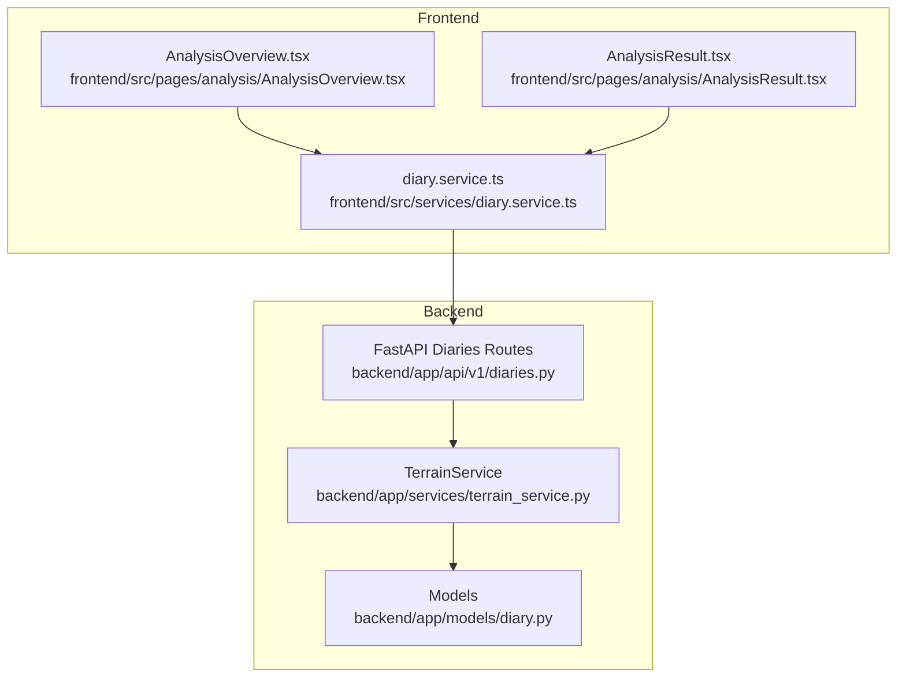
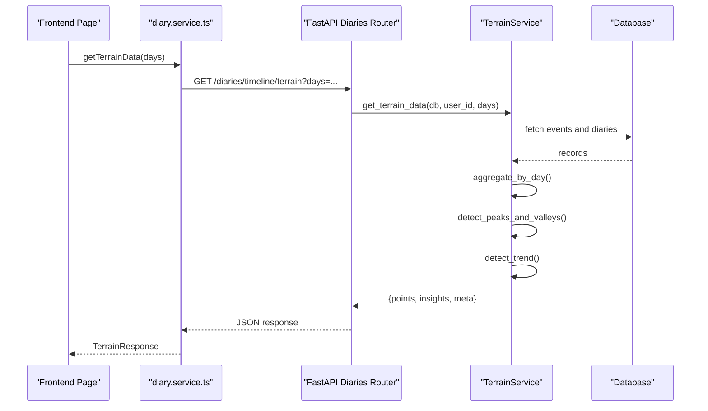
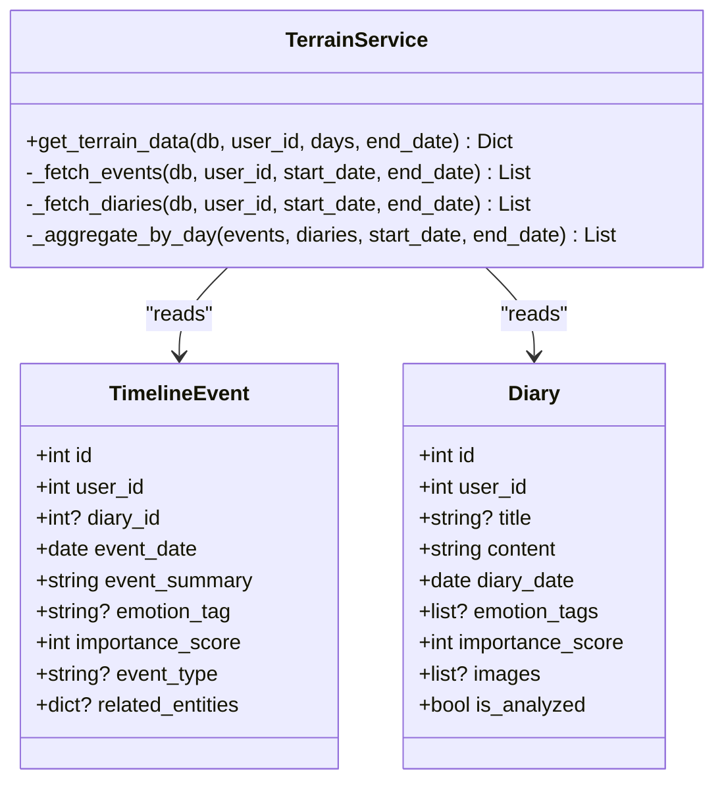
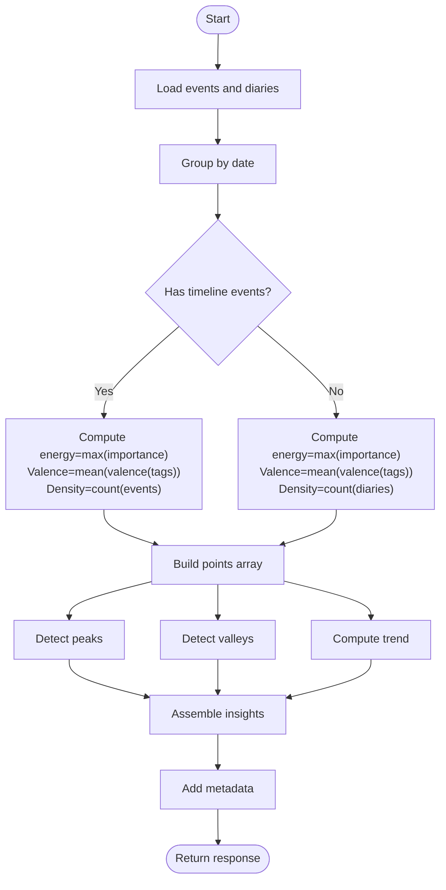
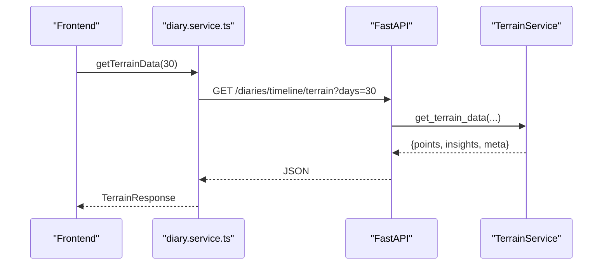

# Terrain Service

<cite>
**Referenced Files in This Document**
- [terrain_service.py](file://backend/app/services/terrain_service.py)
- [diary.py](file://backend/app/models/diary.py)
- [diaries.py](file://backend/app/api/v1/diaries.py)
- [diary.service.ts](file://frontend/src/services/diary.service.ts)
- [AnalysisOverview.tsx](file://frontend/src/pages/analysis/AnalysisOverview.tsx)
- [AnalysisResult.tsx](file://frontend/src/pages/analysis/AnalysisResult.tsx)
- [rag_service.py](file://backend/app/services/rag_service.py)
- [qdrant_memory_service.py](file://backend/app/services/qdrant_memory_service.py)
</cite>

## Table of Contents
1. [Introduction](#introduction)
2. [Project Structure](#project-structure)
3. [Core Components](#core-components)
4. [Architecture Overview](#architecture-overview)
5. [Detailed Component Analysis](#detailed-component-analysis)
6. [Dependency Analysis](#dependency-analysis)
7. [Performance Considerations](#performance-considerations)
8. [Troubleshooting Guide](#troubleshooting-guide)
9. [Conclusion](#conclusion)
10. [Appendices](#appendices)

## Introduction
This document explains the terrain service implementation that powers the emotional terrain visualization. It covers data ingestion from timeline events and diaries, aggregation into daily points, peak/valley detection, trend analysis, and the integration with FastAPI endpoints and the frontend. It also documents validation, transformation pipelines, error handling, and performance considerations. The service is central to the “growth center” and “analysis” features, enabling users to understand long-term emotional patterns and identify turning points.

## Project Structure
The terrain service lives in the backend services layer and integrates with the diary models, FastAPI routes, and frontend services. The frontend consumes the terrain endpoint via a dedicated diary service wrapper.

**Diagram sources**
- [terrain_service.py:166-360](file://backend/app/services/terrain_service.py#L166-L360)
- [diary.py:29-99](file://backend/app/models/diary.py#L29-L99)
- [diaries.py:328-343](file://backend/app/api/v1/diaries.py#L328-L343)
- [diary.service.ts:86-92](file://frontend/src/services/diary.service.ts#L86-L92)
- [AnalysisOverview.tsx:15-26](file://frontend/src/pages/analysis/AnalysisOverview.tsx#L15-L26)
- [AnalysisResult.tsx:54-78](file://frontend/src/pages/analysis/AnalysisResult.tsx#L54-L78)

**Section sources**
- [terrain_service.py:166-360](file://backend/app/services/terrain_service.py#L166-L360)
- [diary.py:29-99](file://backend/app/models/diary.py#L29-L99)
- [diaries.py:328-343](file://backend/app/api/v1/diaries.py#L328-L343)
- [diary.service.ts:86-92](file://frontend/src/services/diary.service.ts#L86-L92)
- [AnalysisOverview.tsx:15-26](file://frontend/src/pages/analysis/AnalysisOverview.tsx#L15-L26)
- [AnalysisResult.tsx:54-78](file://frontend/src/pages/analysis/AnalysisResult.tsx#L54-L78)

## Core Components
- TerrainService: Orchestrates fetching, aggregation, analysis, and insight generation.
- Data models: TimelineEvent and Diary define the inputs for terrain computation.
- API route: Exposes GET /diaries/timeline/terrain to serve terrain data.
- Frontend service: Provides getTerrainData() to call the backend endpoint.
- Supporting services: RAG and Qdrant memory services support broader analysis workflows but are separate from terrain.

Key responsibilities:
- Fetch timeline events and diaries for a date window.
- Aggregate into daily points with energy, valence, density, and event lists.
- Detect peaks and valleys in energy.
- Compute a simple linear trend.
- Return structured insights and metadata.

**Section sources**
- [terrain_service.py:166-360](file://backend/app/services/terrain_service.py#L166-L360)
- [diary.py:29-99](file://backend/app/models/diary.py#L29-L99)
- [diaries.py:328-343](file://backend/app/api/v1/diaries.py#L328-L343)
- [diary.service.ts:86-92](file://frontend/src/services/diary.service.ts#L86-L92)

## Architecture Overview
The terrain service sits between the API layer and the persistence layer. The frontend calls the API via a typed service, which delegates to the backend service. The backend service queries the database, transforms the data, and returns a structured response.

**Diagram sources**
- [diary.service.ts:86-92](file://frontend/src/services/diary.service.ts#L86-L92)
- [diaries.py:328-343](file://backend/app/api/v1/diaries.py#L328-L343)
- [terrain_service.py:169-227](file://backend/app/services/terrain_service.py#L169-L227)
- [terrain_service.py:229-264](file://backend/app/services/terrain_service.py#L229-L264)
- [terrain_service.py:266-355](file://backend/app/services/terrain_service.py#L266-L355)

## Detailed Component Analysis

### TerrainService
The service encapsulates the end-to-end workflow for terrain data generation.

- Inputs: Async database session, user identifier, days window, optional end date.
- Outputs: Dictionary containing points, insights, and metadata.

Processing pipeline:
1. Window calculation: derive start/end dates.
2. Fetch events: timeline events owned by the user within the window, optionally linked to user’s diaries.
3. Fetch diaries: user’s diaries within the window.
4. Aggregate by day: combine events and diaries per calendar day into points with:
   - energy: maximum importance score among events/diaries for that day
   - valence: average valence of emotion tags (mapped via a valence table)
   - density: number of events/diaries on that day
   - events: list of event-like items with summary, emotion tag, importance, type, and source label
5. Peaks and valleys: detect local peaks and continuous low-value valleys.
6. Trend: compute a simple ascending/descending/stable classification.
7. Metadata: include date range, totals, and counts.

Validation and transformation:
- Emotion tag normalization and fuzzy matching via a valence map.
- Graceful handling of missing data (None values) during aggregation and analysis.
- Rounded valence to two decimals for readability.

Error handling:
- The service itself does not raise exceptions; it returns None for missing metrics and empty lists for no data.
- API layer handles 404/400 semantics for missing resources.

Integration:
- Exposed via FastAPI route GET /diaries/timeline/terrain.
- Consumed by frontend diary service getTerrainData().

**Diagram sources**
- [terrain_service.py:166-360](file://backend/app/services/terrain_service.py#L166-L360)
- [diary.py:67-99](file://backend/app/models/diary.py#L67-L99)
- [diary.py:29-61](file://backend/app/models/diary.py#L29-L61)

**Section sources**
- [terrain_service.py:166-360](file://backend/app/services/terrain_service.py#L166-L360)
- [diary.py:29-99](file://backend/app/models/diary.py#L29-L99)

### Data Validation and Transformation Pipelines
- Emotion valence mapping: normalize and fuzzily match emotion tags to a continuous -1..+1 scale.
- Aggregation logic:
  - Prefer timeline events when present; otherwise fall back to diary-derived signals.
  - Compute energy as the maximum importance score per day.
  - Compute valence as the mean of valence scores; round to two decimals.
  - Density equals the number of contributing items.
- Peaks and valleys:
  - Peaks: local maxima exceeding a threshold.
  - Valleys: contiguous segments under a threshold; single-day valleys labeled differently.
- Trend:
  - Compare average energy in first vs. second half of the window.

**Diagram sources**
- [terrain_service.py:266-355](file://backend/app/services/terrain_service.py#L266-L355)
- [terrain_service.py:59-123](file://backend/app/services/terrain_service.py#L59-L123)
- [terrain_service.py:145-162](file://backend/app/services/terrain_service.py#L145-L162)

**Section sources**
- [terrain_service.py:43-54](file://backend/app/services/terrain_service.py#L43-L54)
- [terrain_service.py:266-355](file://backend/app/services/terrain_service.py#L266-L355)
- [terrain_service.py:59-123](file://backend/app/services/terrain_service.py#L59-L123)
- [terrain_service.py:145-162](file://backend/app/services/terrain_service.py#L145-L162)

### API Integration Patterns
- Route: GET /diaries/timeline/terrain with days query parameter.
- Service call: terrain_service.get_terrain_data(db, user_id, days).
- Response shape: points[], insights{peaks, valleys, trend, trend_description}, meta{start_date, end_date, total_events, days_with_data, total_days}.
- Frontend consumption: diary.service.getTerrainData() returns TerrainResponse.

**Diagram sources**
- [diaries.py:328-343](file://backend/app/api/v1/diaries.py#L328-L343)
- [diary.service.ts:86-92](file://frontend/src/services/diary.service.ts#L86-L92)

**Section sources**
- [diaries.py:328-343](file://backend/app/api/v1/diaries.py#L328-L343)
- [diary.service.ts:86-92](file://frontend/src/services/diary.service.ts#L86-L92)

### Frontend Integration Examples
- AnalysisOverview.tsx: triggers comprehensive analysis with a selected window (30/90/180 days) and displays results.
- AnalysisResult.tsx: handles individual diary analysis and shows related UI; terrain data is fetched via diary.service.getTerrainData().
- diary.service.ts: exposes getTerrainData() to call the backend endpoint.

Common integration scenarios:
- Load recent terrain data for a fixed window (e.g., last 30 days).
- Combine terrain insights with growth daily insights or other analysis endpoints.
- Render terrain charts and summaries in analysis pages.

**Section sources**
- [AnalysisOverview.tsx:15-26](file://frontend/src/pages/analysis/AnalysisOverview.tsx#L15-L26)
- [AnalysisResult.tsx:54-78](file://frontend/src/pages/analysis/AnalysisResult.tsx#L54-L78)
- [diary.service.ts:86-92](file://frontend/src/services/diary.service.ts#L86-L92)

## Dependency Analysis
- Internal dependencies:
  - TerrainService depends on TimelineEvent and Diary ORM models.
  - API route depends on TerrainService instance.
  - Frontend service depends on FastAPI route.
- External dependencies:
  - SQLAlchemy for async ORM operations.
  - FastAPI for routing and dependency injection.
  - No external ML libraries are used for terrain analysis; it is deterministic and lightweight.

**Diagram sources**
- [diaries.py:328-343](file://backend/app/api/v1/diaries.py#L328-L343)
- [terrain_service.py:166-360](file://backend/app/services/terrain_service.py#L166-L360)
- [diary.py:29-99](file://backend/app/models/diary.py#L29-L99)
- [diary.service.ts:86-92](file://frontend/src/services/diary.service.ts#L86-L92)

**Section sources**
- [diaries.py:328-343](file://backend/app/api/v1/diaries.py#L328-L343)
- [terrain_service.py:166-360](file://backend/app/services/terrain_service.py#L166-L360)
- [diary.py:29-99](file://backend/app/models/diary.py#L29-L99)
- [diary.service.ts:86-92](file://frontend/src/services/diary.service.ts#L86-L92)

## Performance Considerations
- Query efficiency:
  - Two targeted queries for events and diaries with appropriate filters and ordering.
  - Subquery for diary ownership ensures correctness without extra joins.
- Aggregation cost:
  - Single pass over the date range with dictionary lookups for grouping.
  - O(N) over the number of days in the window plus events/diaries.
- Analysis cost:
  - Peak/valley detection scans the points array once for peaks and once for valleys.
  - Trend comparison computes averages over roughly half the window.
- Recommendations:
  - Keep window sizes reasonable (e.g., ≤ 365 days) to avoid large payloads.
  - Consider caching repeated requests for the same window if needed.
  - Ensure proper indexing on date and user_id fields in the database.

[No sources needed since this section provides general guidance]

## Troubleshooting Guide
- Empty or sparse data:
  - If a day has no events or diaries, energy/valence are None; the frontend should handle None gracefully.
- Missing emotion tags:
  - get_valence() falls back to neutral valence for unknown or fuzzy-matched tags.
- API errors:
  - The route returns 404 if a requested resource is not found elsewhere in the API; the terrain route itself does not raise exceptions.
- Trend stability:
  - With insufficient data points, trend may be “stable” with a descriptive message.

**Section sources**
- [terrain_service.py:43-54](file://backend/app/services/terrain_service.py#L43-L54)
- [terrain_service.py:145-162](file://backend/app/services/terrain_service.py#L145-L162)
- [diaries.py:328-343](file://backend/app/api/v1/diaries.py#L328-L343)

## Conclusion
The terrain service provides a robust, deterministic pipeline to transform diary and timeline data into actionable emotional terrain insights. Its clean separation of concerns—data fetching, aggregation, analysis, and response shaping—enables reliable integration with the API and frontend. By combining peak/valley detection with a simple trend classifier, it supports meaningful self-reflection and growth tracking.

[No sources needed since this section summarizes without analyzing specific files]

## Appendices

### API Definition: Get Terrain Data
- Endpoint: GET /api/v1/diaries/timeline/terrain
- Query parameters:
  - days: integer, default 30, range 7–365
- Response fields:
  - points: array of daily entries with date, energy, valence, density, events
  - insights: peaks, valleys, trend, trend_description
  - meta: start_date, end_date, total_events, days_with_data, total_days

**Section sources**
- [diaries.py:328-343](file://backend/app/api/v1/diaries.py#L328-L343)

### Related Services and Workflows
- RAG service: Provides chunking and retrieval for broader analysis contexts; not part of terrain computation.
- Qdrant memory service: Vector-based memory synchronization and search; not used by terrain.

**Section sources**
- [rag_service.py:147-360](file://backend/app/services/rag_service.py#L147-L360)
- [qdrant_memory_service.py:45-190](file://backend/app/services/qdrant_memory_service.py#L45-L190)