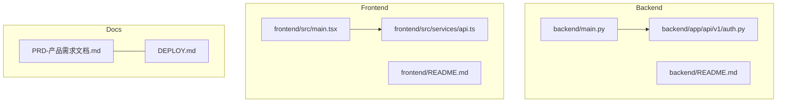
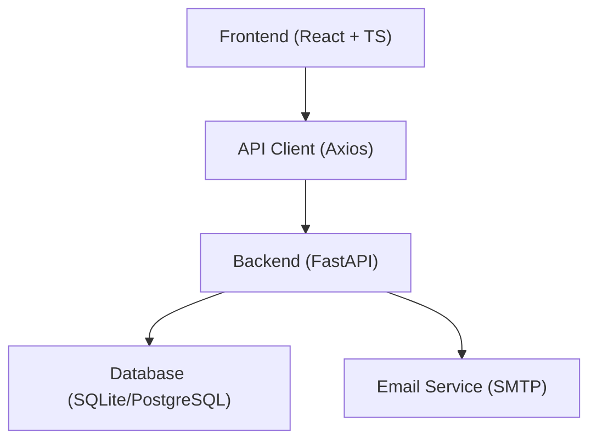

# Contributing Guidelines

<cite>
**Referenced Files in This Document**
- [DEPLOY.md](file://DEPLOY.md)
- [PRD-产品需求文档.md](file://PRD-产品需求文档.md)
- [backend/README.md](file://backend/README.md)
- [frontend/README.md](file://frontend/README.md)
- [backend/main.py](file://backend/main.py)
- [backend/app/api/v1/auth.py](file://backend/app/api/v1/auth.py)
- [backend/pytest.ini](file://backend/pytest.ini)
- [backend/tests/conftest.py](file://backend/tests/conftest.py)
- [backend/requirements.txt](file://backend/requirements.txt)
- [frontend/package.json](file://frontend/package.json)
- [frontend/tsconfig.json](file://frontend/tsconfig.json)
- [frontend/tailwind.config.js](file://frontend/tailwind.config.js)
- [frontend/src/services/api.ts](file://frontend/src/services/api.ts)
- [frontend/src/main.tsx](file://frontend/src/main.tsx)
</cite>

## Table of Contents
1. [Introduction](#introduction)
2. [Project Structure](#project-structure)
3. [Core Components](#core-components)
4. [Architecture Overview](#architecture-overview)
5. [Development Workflow](#development-workflow)
6. [Branching Strategy](#branching-strategy)
7. [Code Review Process](#code-review-process)
8. [Testing Requirements](#testing-requirements)
9. [Code Style Guidelines](#code-style-guidelines)
10. [Issue Reporting and Templates](#issue-reporting-and-templates)
11. [Feature Request Procedure](#feature-request-procedure)
12. [Pull Request Workflow](#pull-request-workflow)
13. [Commit Message Standards](#commit-message-standards)
14. [Documentation Requirements](#documentation-requirements)
15. [Community Guidelines](#community-guidelines)
16. [Communication Channels](#communication-channels)
17. [Maintainer Responsibilities](#maintainer-responsibilities)
18. [Release Process and Versioning](#release-process-and-versioning)
19. [Backward Compatibility Policy](#backward-compatibility-policy)
20. [Security Vulnerability Reporting](#security-vulnerability-reporting)
21. [Troubleshooting Guide](#troubleshooting-guide)
22. [Conclusion](#conclusion)

## Introduction
This document provides comprehensive contributing guidelines for the Yinji smart diary application. It covers development workflow, branching strategy, code review, testing, code style, issue reporting, pull request process, commit standards, documentation, community and maintainer responsibilities, release and versioning, backward compatibility, and security reporting. The project consists of a FastAPI backend and a React + TypeScript frontend, integrated via API endpoints and shared schemas.

## Project Structure
The repository is organized into:
- backend: FastAPI application with modular API routers, services, models, schemas, and tests
- frontend: React 18 + TypeScript application with Vite, shadcn/ui, Zustand, and Tailwind CSS
- docs: Product and feature documentation
- deployment and operational artifacts

**Diagram sources**
- [backend/main.py:1-119](file://backend/main.py#L1-L119)
- [backend/app/api/v1/auth.py:1-316](file://backend/app/api/v1/auth.py#L1-L316)
- [frontend/src/main.tsx:1-12](file://frontend/src/main.tsx#L1-L12)
- [frontend/src/services/api.ts:1-43](file://frontend/src/services/api.ts#L1-L43)
- [PRD-产品需求文档.md:1-262](file://PRD-产品需求文档.md#L1-L262)
- [DEPLOY.md:1-400](file://DEPLOY.md#L1-L400)

**Section sources**
- [backend/README.md:1-160](file://backend/README.md#L1-L160)
- [frontend/README.md:1-228](file://frontend/README.md#L1-L228)
- [PRD-产品需求文档.md:1-262](file://PRD-产品需求文档.md#L1-L262)

## Core Components
- Backend FastAPI app with lifecycle management, CORS configuration, modular routers, and static file serving for uploads
- Authentication endpoints supporting email verification and JWT-based sessions
- Frontend React application with Axios client, token-based auth interceptor, and routing
- Testing infrastructure for backend (pytest) and frontend (Vitest)

Key implementation references:
- Backend app initialization and router registration: [backend/main.py:42-87](file://backend/main.py#L42-L87)
- Authentication endpoints: [backend/app/api/v1/auth.py:25-316](file://backend/app/api/v1/auth.py#L25-L316)
- Frontend API client and interceptors: [frontend/src/services/api.ts:1-43](file://frontend/src/services/api.ts#L1-L43)
- Frontend entry point: [frontend/src/main.tsx:1-12](file://frontend/src/main.tsx#L1-L12)
- Backend pytest configuration: [backend/pytest.ini:1-28](file://backend/pytest.ini#L1-L28)
- Frontend Vitest and lint scripts: [frontend/package.json:6-12](file://frontend/package.json#L6-L12)

**Section sources**
- [backend/main.py:42-87](file://backend/main.py#L42-L87)
- [backend/app/api/v1/auth.py:25-316](file://backend/app/api/v1/auth.py#L25-L316)
- [frontend/src/services/api.ts:1-43](file://frontend/src/services/api.ts#L1-L43)
- [frontend/src/main.tsx:1-12](file://frontend/src/main.tsx#L1-L12)
- [backend/pytest.ini:1-28](file://backend/pytest.ini#L1-L28)
- [frontend/package.json:6-12](file://frontend/package.json#L6-L12)

## Architecture Overview
High-level architecture shows the frontend communicating with backend APIs, which in turn manage database operations and external services.

**Diagram sources**
- [frontend/src/services/api.ts:1-43](file://frontend/src/services/api.ts#L1-L43)
- [backend/main.py:42-87](file://backend/main.py#L42-L87)
- [backend/README.md:7-12](file://backend/README.md#L7-L12)

**Section sources**
- [frontend/src/services/api.ts:1-43](file://frontend/src/services/api.ts#L1-L43)
- [backend/main.py:42-87](file://backend/main.py#L42-L87)
- [backend/README.md:7-12](file://backend/README.md#L7-L12)

## Development Workflow
- Backend development: virtual environment, uvicorn reload, API docs via Swagger UI and ReDoc
- Frontend development: Vite dev server, build, preview, and static hosting
- Deployment: Docker compose recommended; manual systemd/nginx supported
- Environment variables: backend .env; frontend .env.local

References:
- Backend quick start and API docs: [backend/README.md:14-63](file://backend/README.md#L14-L63)
- Frontend development and build: [frontend/README.md:37-64](file://frontend/README.md#L37-L64)
- Deployment steps and configurations: [DEPLOY.md:21-149](file://DEPLOY.md#L21-L149)

**Section sources**
- [backend/README.md:14-63](file://backend/README.md#L14-L63)
- [frontend/README.md:37-64](file://frontend/README.md#L37-L64)
- [DEPLOY.md:21-149](file://DEPLOY.md#L21-L149)

## Branching Strategy
Recommended branching model:
- main: production-ready code
- develop: integration of features (if used)
- feature/<issue-number>-short-description: per-feature branches
- hotfix/<issue-number>-description: urgent fixes

Merge via pull requests with review and passing checks.

[No sources needed since this section provides general guidance]

## Code Review Process
- All contributions require at least one maintainer review
- Ensure CI passes (tests, linting)
- Reviewer feedback should be addressed within 3 business days
- Approved PRs can be merged after addressing comments

[No sources needed since this section provides general guidance]

## Testing Requirements
Backend:
- pytest configuration supports markers for unit, integration, and asyncio tests
- Tests located under backend/tests with conftest plugin registration

Frontend:
- Vitest configured for unit tests
- Linting enforced via ESLint TypeScript rules

References:
- Backend pytest.ini: [backend/pytest.ini:1-28](file://backend/pytest.ini#L1-L28)
- Backend tests conftest: [backend/tests/conftest.py:1-29](file://backend/tests/conftest.py#L1-L29)
- Frontend package.json scripts: [frontend/package.json:6-12](file://frontend/package.json#L6-L12)

**Section sources**
- [backend/pytest.ini:1-28](file://backend/pytest.ini#L1-L28)
- [backend/tests/conftest.py:1-29](file://backend/tests/conftest.py#L1-L29)
- [frontend/package.json:6-12](file://frontend/package.json#L6-L12)

## Code Style Guidelines
Python (backend):
- Use type hints consistently
- Follow PEP 8; organize imports and keep modules cohesive
- Keep functions small and focused; avoid global state

FastAPI endpoints:
- Use Pydantic models for request/response schemas
- Validate inputs early; raise appropriate HTTP exceptions
- Add descriptive summaries and docstrings for routes

References:
- Backend API router example: [backend/app/api/v1/auth.py:25-125](file://backend/app/api/v1/auth.py#L25-L125)
- Backend main app: [backend/main.py:42-87](file://backend/main.py#L42-L87)

TypeScript and React (frontend):
- Strict TypeScript configuration enabled
- Use ESLint and Prettier via provided scripts
- Prefer functional components and hooks; maintain single responsibility

References:
- Frontend tsconfig strictness: [frontend/tsconfig.json:18-21](file://frontend/tsconfig.json#L18-L21)
- Frontend package.json lint/test scripts: [frontend/package.json:6-12](file://frontend/package.json#L6-L12)
- Frontend Tailwind color palette and animations: [frontend/tailwind.config.js:20-82](file://frontend/tailwind.config.js#L20-L82)

**Section sources**
- [backend/app/api/v1/auth.py:25-125](file://backend/app/api/v1/auth.py#L25-L125)
- [backend/main.py:42-87](file://backend/main.py#L42-L87)
- [frontend/tsconfig.json:18-21](file://frontend/tsconfig.json#L18-L21)
- [frontend/package.json:6-12](file://frontend/package.json#L6-L12)
- [frontend/tailwind.config.js:20-82](file://frontend/tailwind.config.js#L20-L82)

## Issue Reporting and Templates
- Use GitHub Issues for bugs and enhancements
- Include environment details, reproduction steps, expected vs actual behavior
- Attach screenshots/logs when relevant

[No sources needed since this section provides general guidance]

## Feature Request Procedure
- Open a GitHub Issue labeled “enhancement” or “feature”
- Reference the PRD and related documentation
- Discuss scope, impact, and timeline with maintainers
- Track progress via linked pull requests

[No sources needed since this section provides general guidance]

## Pull Request Workflow
- Target branch: main for patches; feature branches for new features
- PR title should summarize change; include issue number if applicable
- Description should explain motivation, changes, and testing performed
- Ensure all checks pass and reviews approved

[No sources needed since this section provides general guidance]

## Commit Message Standards
- Use imperative mood: “Add feature”, “Fix bug”
- Limit subject line length; reference issue numbers
- Separate subject from body with blank line
- Reference PR/Issue in body if needed

[No sources needed since this section provides general guidance]

## Documentation Requirements
- Update backend README if major API changes occur
- Update frontend README if build/runtime changes occur
- Update product documentation (PRD) for functional changes
- Keep inline code comments concise and meaningful

References:
- Backend README: [backend/README.md:1-160](file://backend/README.md#L1-L160)
- Frontend README: [frontend/README.md:1-228](file://frontend/README.md#L1-L228)
- PRD: [PRD-产品需求文档.md:1-262](file://PRD-产品需求文档.md#L1-L262)

**Section sources**
- [backend/README.md:1-160](file://backend/README.md#L1-L160)
- [frontend/README.md:1-228](file://frontend/README.md#L1-L228)
- [PRD-产品需求文档.md:1-262](file://PRD-产品需求文档.md#L1-L262)

## Community Guidelines
- Be respectful and inclusive
- Stay on topic; avoid spam and self-promotion
- Use English for public communications
- Report harassment or abuse to maintainers

[No sources needed since this section provides general guidance]

## Communication Channels
- GitHub Issues for bugs and features
- GitHub Discussions for general questions and ideas
- Email support channel as documented in deployment guide

Reference:
- Support contact: [DEPLOY.md:390-396](file://DEPLOY.md#L390-L396)

**Section sources**
- [DEPLOY.md:390-396](file://DEPLOY.md#L390-L396)

## Maintainer Responsibilities
- Review PRs promptly and provide constructive feedback
- Ensure tests and linting pass
- Merge approved PRs after verification
- Triage issues and assign labels/priorities
- Maintain changelog and release notes

[No sources needed since this section provides general guidance]

## Release Process and Versioning
Versioning:
- Follow semantic versioning (MAJOR.MINOR.PATCH)
- MAJOR for incompatible API changes
- MINOR for new features/backward-compatible changes
- PATCH for bug fixes

Release workflow:
- Cut release branch from main
- Update version in backend requirements and frontend package.json
- Build and test artifacts
- Publish Docker images and static site if applicable
- Announce release with highlights

References:
- Backend requirements version pins: [backend/requirements.txt:1-26](file://backend/requirements.txt#L1-L26)
- Frontend package version: [frontend/package.json:4](file://frontend/package.json#L4)

**Section sources**
- [backend/requirements.txt:1-26](file://backend/requirements.txt#L1-L26)
- [frontend/package.json:4](file://frontend/package.json#L4)

## Backward Compatibility Policy
- Respect existing API endpoints and response shapes
- Deprecate features with migration guides before removal
- Provide clear upgrade instructions in release notes

[No sources needed since this section provides general guidance]

## Security Vulnerability Reporting
- Do not open public issues for vulnerabilities
- Contact maintainers privately via email
- Expect acknowledgment within 48 hours and patch timeline within 7–14 days
- Public disclosure after patch release

Reference:
- Support contact: [DEPLOY.md:390-396](file://DEPLOY.md#L390-L396)

**Section sources**
- [DEPLOY.md:390-396](file://DEPLOY.md#L390-L396)

## Troubleshooting Guide
Common backend issues:
- QQ email sending failures: verify SMTP settings and authorization code
- Database initialization errors: remove local DB file and restart
- JWT verification failures: check SECRET_KEY and token validity

Common frontend issues:
- Port conflicts: adjust Vite server port
- API failures: verify VITE_API_BASE_URL and backend availability
- UI library styles missing: reinstall Tailwind and related dependencies

References:
- Backend README troubleshooting: [backend/README.md:139-156](file://backend/README.md#L139-L156)
- Frontend README troubleshooting: [frontend/README.md:200-220](file://frontend/README.md#L200-L220)
- Deployment troubleshooting: [DEPLOY.md:355-389](file://DEPLOY.md#L355-L389)

**Section sources**
- [backend/README.md:139-156](file://backend/README.md#L139-L156)
- [frontend/README.md:200-220](file://frontend/README.md#L200-L220)
- [DEPLOY.md:355-389](file://DEPLOY.md#L355-L389)

## Conclusion
These guidelines standardize contribution practices across the backend and frontend, ensuring consistent quality, security, and collaboration. Follow the workflow, review, testing, and style guidelines to streamline contributions and releases.