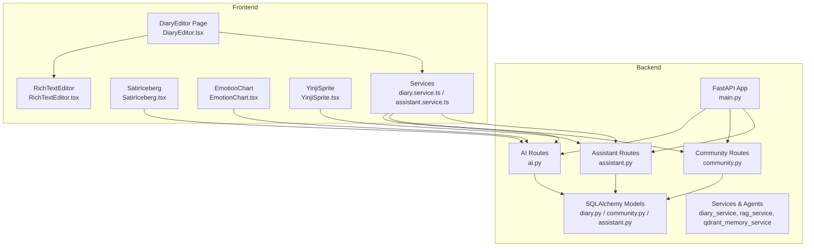
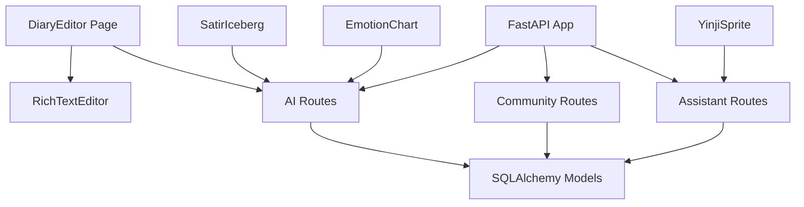
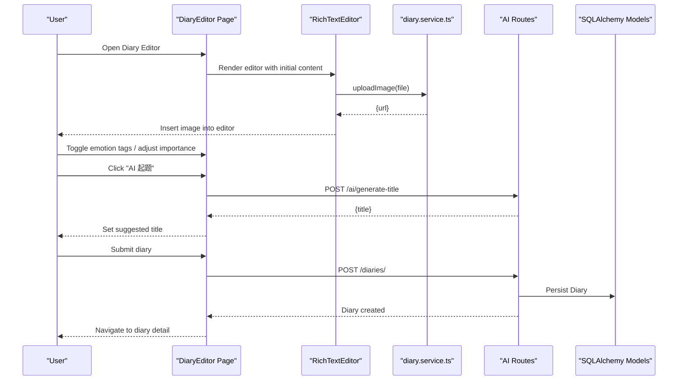
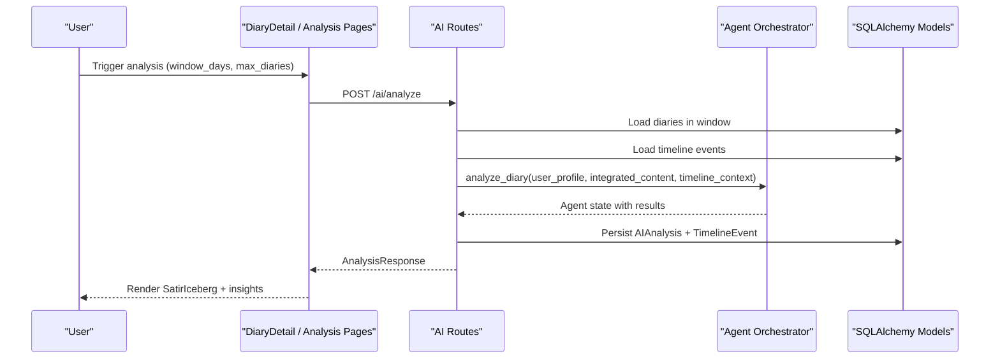
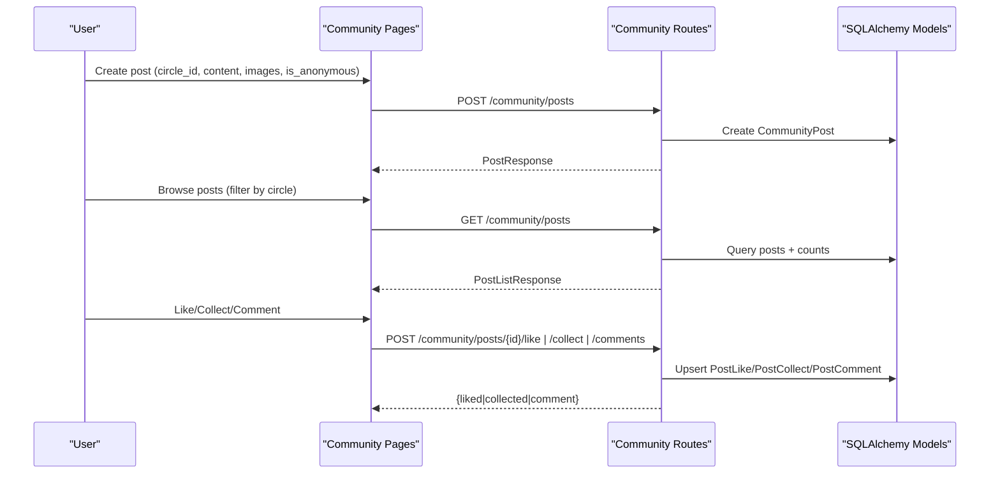
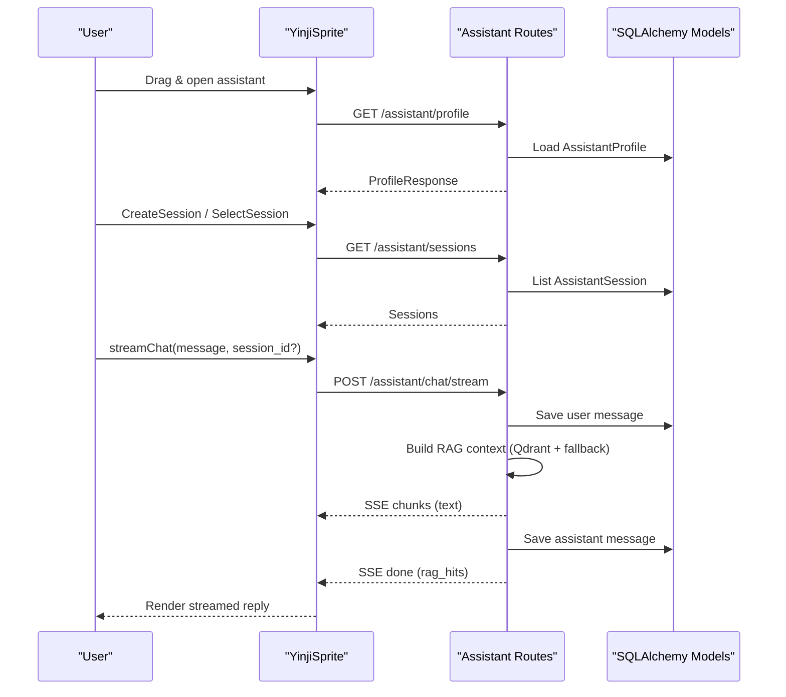
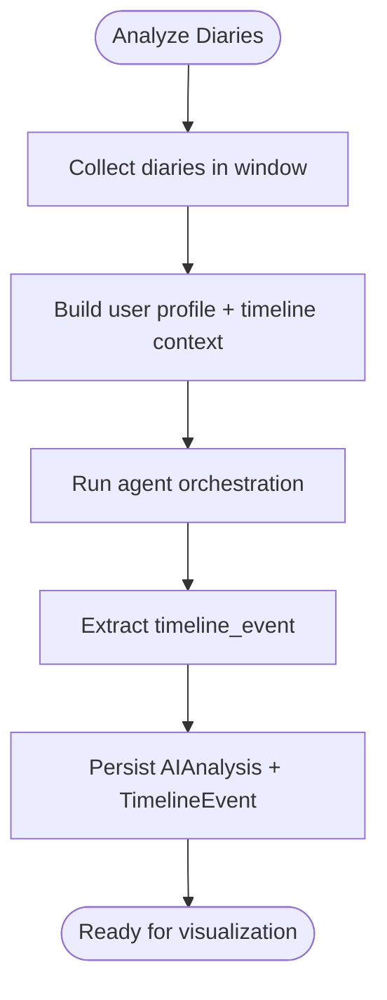
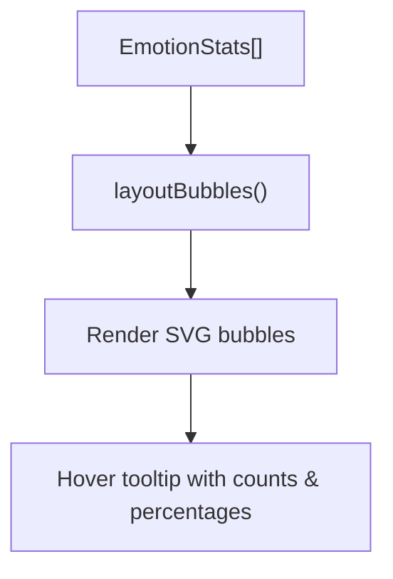
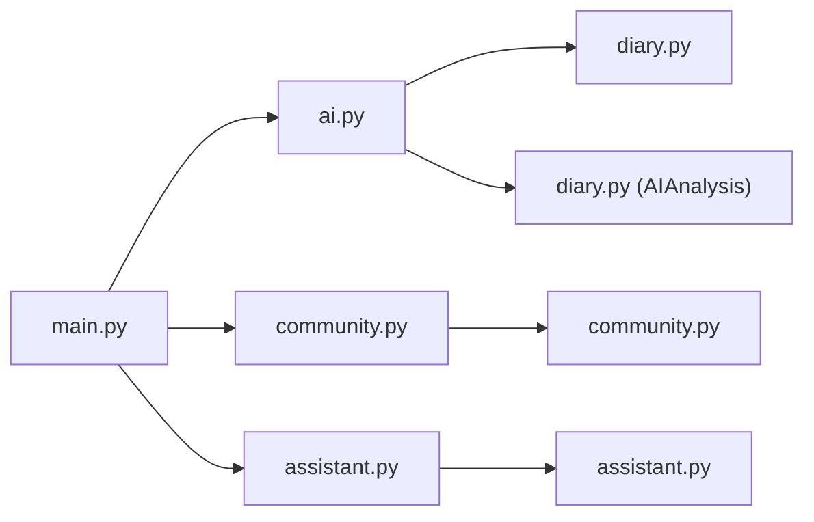

# Core Features

<cite>
**Referenced Files in This Document**
- [main.py](file://backend/main.py)
- [diary.py](file://backend/app/models/diary.py)
- [community.py](file://backend/app/models/community.py)
- [assistant.py](file://backend/app/models/assistant.py)
- [ai.py](file://backend/app/api/v1/ai.py)
- [community.py](file://backend/app/api/v1/community.py)
- [assistant.py](file://backend/app/api/v1/assistant.py)
- [ai.py](file://backend/app/schemas/ai.py)
- [community.py](file://backend/app/schemas/community.py)
- [RichTextEditor.tsx](file://frontend/src/components/editor/RichTextEditor.tsx)
- [DiaryEditor.tsx](file://frontend/src/pages/diaries/DiaryEditor.tsx)
- [SatirIceberg.tsx](file://frontend/src/pages/analysis/SatirIceberg.tsx)
- [EmotionChart.tsx](file://frontend/src/components/common/EmotionChart.tsx)
- [YinjiSprite.tsx](file://frontend/src/components/assistant/YinjiSprite.tsx)
- [diary.service.ts](file://frontend/src/services/diary.service.ts)
- [assistant.service.ts](file://frontend/src/services/assistant.service.ts)
</cite>

## Table of Contents
1. [Introduction](#introduction)
2. [Project Structure](#project-structure)
3. [Core Components](#core-components)
4. [Architecture Overview](#architecture-overview)
5. [Detailed Component Analysis](#detailed-component-analysis)
6. [Dependency Analysis](#dependency-analysis)
7. [Performance Considerations](#performance-considerations)
8. [Troubleshooting Guide](#troubleshooting-guide)
9. [Conclusion](#conclusion)
10. [Appendices](#appendices)

## Introduction
This document explains the core features of the 映记 application, focusing on the smart diary system, AI psychological analysis, community platform, personal assistant, timeline management, and data visualization. It covers implementation details, user workflows, and integration patterns across the backend (FastAPI) and frontend (React) stacks.

## Project Structure
The application follows a layered architecture:
- Backend: FastAPI application with modular routers for authentication, diaries, AI analysis, users, community, and assistant. SQLAlchemy models define domain entities. Services encapsulate business logic. Agents orchestrate LLM workflows.
- Frontend: React SPA with TypeScript, organized by pages, components, services, and stores. It integrates rich text editing, AI-assisted writing, visualization, and streaming assistant chat.

**Diagram sources**
- [main.py:31-76](file://backend/main.py#L31-L76)
- [ai.py:31](file://backend/app/api/v1/ai.py#L31)
- [community.py:20](file://backend/app/api/v1/community.py#L20)
- [assistant.py:26](file://backend/app/api/v1/assistant.py#L26)
- [diary.py:29-186](file://backend/app/models/diary.py#L29-L186)
- [community.py:23-176](file://backend/app/models/community.py#L23-L176)
- [assistant.py:13-78](file://backend/app/models/assistant.py#L13-L78)
- [RichTextEditor.tsx:282-383](file://frontend/src/components/editor/RichTextEditor.tsx#L282-L383)
- [DiaryEditor.tsx:40-368](file://frontend/src/pages/diaries/DiaryEditor.tsx#L40-L368)
- [SatirIceberg.tsx:10-216](file://frontend/src/pages/analysis/SatirIceberg.tsx#L10-L216)
- [EmotionChart.tsx:158-269](file://frontend/src/components/common/EmotionChart.tsx#L158-L269)
- [YinjiSprite.tsx:20-529](file://frontend/src/components/assistant/YinjiSprite.tsx#L20-L529)
- [diary.service.ts:14-112](file://frontend/src/services/diary.service.ts#L14-L112)
- [assistant.service.ts](file://frontend/src/services/assistant.service.ts)

**Section sources**
- [main.py:31-108](file://backend/main.py#L31-L108)

## Core Components
- Smart Diary System: Rich text editor with Markdown shortcuts, image upload, emotion tagging, and importance scoring. Backend persists diaries and extracts timeline events; frontend provides guided prompts and AI title suggestions.
- AI Psychological Analysis: Multi-day analysis, RAG-powered synthesis, Satir Iceberg model, and social content generation. Results are cached and retrievable.
- Community Platform: Anonymous posting, content discovery via circles, comments, likes, collections, and browsing history.
- Personal Assistant: Chat widget with session management, streaming responses, and memory retrieval from diary history.
- Timeline Management: Event extraction, visualization, and trend analysis across dates.
- Data Visualization: Mood bubble chart and insights dashboard components.

**Section sources**
- [diary.py:29-186](file://backend/app/models/diary.py#L29-L186)
- [ai.py:31-902](file://backend/app/api/v1/ai.py#L31-L902)
- [community.py:23-176](file://backend/app/models/community.py#L23-L176)
- [assistant.py:13-78](file://backend/app/models/assistant.py#L13-L78)
- [RichTextEditor.tsx:282-383](file://frontend/src/components/editor/RichTextEditor.tsx#L282-L383)
- [DiaryEditor.tsx:40-368](file://frontend/src/pages/diaries/DiaryEditor.tsx#L40-L368)
- [SatirIceberg.tsx:10-216](file://frontend/src/pages/analysis/SatirIceberg.tsx#L10-L216)
- [EmotionChart.tsx:158-269](file://frontend/src/components/common/EmotionChart.tsx#L158-L269)
- [YinjiSprite.tsx:20-529](file://frontend/src/components/assistant/YinjiSprite.tsx#L20-L529)

## Architecture Overview
The backend exposes REST APIs grouped by feature domains. Each domain integrates with services and agents to orchestrate LLM workflows and persistence. The frontend consumes these APIs through typed service wrappers and renders interactive UIs.

**Diagram sources**
- [main.py:31-76](file://backend/main.py#L31-L76)
- [ai.py:31-902](file://backend/app/api/v1/ai.py#L31-L902)
- [community.py:20-324](file://backend/app/api/v1/community.py#L20-L324)
- [assistant.py:26-389](file://backend/app/api/v1/assistant.py#L26-L389)
- [diary.py:29-186](file://backend/app/models/diary.py#L29-L186)
- [community.py:23-176](file://backend/app/models/community.py#L23-L176)
- [assistant.py:13-78](file://backend/app/models/assistant.py#L13-L78)
- [DiaryEditor.tsx:40-368](file://frontend/src/pages/diaries/DiaryEditor.tsx#L40-L368)
- [RichTextEditor.tsx:282-383](file://frontend/src/components/editor/RichTextEditor.tsx#L282-L383)
- [SatirIceberg.tsx:10-216](file://frontend/src/pages/analysis/SatirIceberg.tsx#L10-L216)
- [EmotionChart.tsx:158-269](file://frontend/src/components/common/EmotionChart.tsx#L158-L269)
- [YinjiSprite.tsx:20-529](file://frontend/src/components/assistant/YinjiSprite.tsx#L20-L529)

## Detailed Component Analysis

### Smart Diary System
- Rich text editing: Lexical-based editor with Markdown shortcuts, slash commands, toolbar, and image insertion. Images are uploaded via the diary service and inserted as nodes.
- Image upload: Frontend uploads to backend endpoint; URLs are embedded in the editor and persisted with diary content.
- Emotion tagging and importance: UI toggles preset emotions; importance slider stored with diary.
- AI title suggestion: Endpoint generates concise titles based on content.
- Daily guidance: Endpoint returns personalized questions derived from recent entries.

**Diagram sources**
- [DiaryEditor.tsx:40-368](file://frontend/src/pages/diaries/DiaryEditor.tsx#L40-L368)
- [RichTextEditor.tsx:282-383](file://frontend/src/components/editor/RichTextEditor.tsx#L282-L383)
- [diary.service.ts:14-112](file://frontend/src/services/diary.service.ts#L14-L112)
- [ai.py:83-126](file://backend/app/api/v1/ai.py#L83-L126)
- [diary.py:29-65](file://backend/app/models/diary.py#L29-L65)

**Section sources**
- [RichTextEditor.tsx:282-383](file://frontend/src/components/editor/RichTextEditor.tsx#L282-L383)
- [DiaryEditor.tsx:40-368](file://frontend/src/pages/diaries/DiaryEditor.tsx#L40-L368)
- [diary.service.ts:14-112](file://frontend/src/services/diary.service.ts#L14-L112)
- [ai.py:83-126](file://backend/app/api/v1/ai.py#L83-L126)
- [diary.py:29-65](file://backend/app/models/diary.py#L29-L65)

### AI Psychological Analysis
- Multi-day analysis: Aggregates diaries within a window, builds user context, retrieves timeline events, and executes agent orchestration. Results include timeline event, Satir analysis, therapeutic response, and social posts.
- RAG synthesis: Builds chunks from diary content and performs hybrid retrieval (raw + summary) weighted by recency/importance/emotion.
- Satir Iceberg model: Dedicated endpoint returns structured layers (behavior, emotion, cognition, beliefs, core self).
- Social content generation: Generates social media-style posts using user samples and context.

**Diagram sources**
- [ai.py:406-639](file://backend/app/api/v1/ai.py#L406-L639)
- [ai.py:713-767](file://backend/app/api/v1/ai.py#L713-L767)
- [ai.py:770-800](file://backend/app/api/v1/ai.py#L770-L800)
- [diary.py:102-133](file://backend/app/models/diary.py#L102-L133)
- [SatirIceberg.tsx:10-216](file://frontend/src/pages/analysis/SatirIceberg.tsx#L10-L216)

**Section sources**
- [ai.py:267-404](file://backend/app/api/v1/ai.py#L267-L404)
- [ai.py:406-639](file://backend/app/api/v1/ai.py#L406-L639)
- [ai.py:713-767](file://backend/app/api/v1/ai.py#L713-L767)
- [ai.py:770-800](file://backend/app/api/v1/ai.py#L770-L800)
- [diary.py:102-133](file://backend/app/models/diary.py#L102-L133)
- [SatirIceberg.tsx:10-216](file://frontend/src/pages/analysis/SatirIceberg.tsx#L10-L216)

### Community Platform
- Anonymous posting: Posts and comments support anonymous mode; authors are hidden when enabled.
- Content discovery: Posts filtered by circle, paginated, and enriched with like/comment/collect counts and current user actions.
- Interactions: Like, collect, and comment workflows with permission checks and uniqueness constraints.
- Media: Community image upload with size/type restrictions.

**Diagram sources**
- [community.py:20-324](file://backend/app/api/v1/community.py#L20-L324)
- [community.py:23-176](file://backend/app/models/community.py#L23-L176)
- [community.py:10-124](file://backend/app/schemas/community.py#L10-L124)

**Section sources**
- [community.py:20-324](file://backend/app/api/v1/community.py#L20-L324)
- [community.py:23-176](file://backend/app/models/community.py#L23-L176)
- [community.py:10-124](file://backend/app/schemas/community.py#L10-L124)

### Personal Assistant
- Chat widget: Draggable floating assistant with session list, message history, and real-time streaming.
- Session management: Create, archive, clear, and switch sessions; titles auto-update from first user message.
- Memory retrieval: Uses Qdrant semantic retrieval and falls back to local RAG over diary history.
- Voice integration: Not implemented in the referenced code; audio input/output would require additional client-side libraries and backend transcription/LLM audio capabilities.

**Diagram sources**
- [YinjiSprite.tsx:20-529](file://frontend/src/components/assistant/YinjiSprite.tsx#L20-L529)
- [assistant.py:26-389](file://backend/app/api/v1/assistant.py#L26-L389)
- [assistant.py:13-78](file://backend/app/models/assistant.py#L13-L78)

**Section sources**
- [YinjiSprite.tsx:20-529](file://frontend/src/components/assistant/YinjiSprite.tsx#L20-L529)
- [assistant.py:26-389](file://backend/app/api/v1/assistant.py#L26-L389)
- [assistant.py:13-78](file://backend/app/models/assistant.py#L13-L78)

### Timeline Management System
- Event extraction: After analysis, backend creates or updates a TimelineEvent linked to the target diary, capturing emotion, importance, and related entities.
- Visualization: Frontend can fetch recent/trend events and render them in a timeline view.
- Trend analysis: Aggregated stats and terrain-like metrics are exposed via dedicated endpoints.

**Diagram sources**
- [ai.py:406-639](file://backend/app/api/v1/ai.py#L406-L639)
- [diary.py:67-99](file://backend/app/models/diary.py#L67-L99)

**Section sources**
- [ai.py:406-639](file://backend/app/api/v1/ai.py#L406-L639)
- [diary.py:67-99](file://backend/app/models/diary.py#L67-L99)

### Data Visualization Components
- Mood bubble chart: Renders emotion frequency as overlapping bubbles with color-coded semantics and collision-aware layout.
- Insights dashboard: Composed of emotion chart and other analytics; data endpoints provided by diary service.

**Diagram sources**
- [EmotionChart.tsx:96-154](file://frontend/src/components/common/EmotionChart.tsx#L96-L154)
- [EmotionChart.tsx:158-269](file://frontend/src/components/common/EmotionChart.tsx#L158-L269)

**Section sources**
- [EmotionChart.tsx:158-269](file://frontend/src/components/common/EmotionChart.tsx#L158-L269)
- [diary.service.ts:78-92](file://frontend/src/services/diary.service.ts#L78-L92)

## Dependency Analysis
- Backend routing: Central app registers routers for auth, diaries, AI, users, community, and assistant. CORS is configured globally.
- Models: Diary, TimelineEvent, AIAnalysis, SocialPostSample, CommunityPost, PostComment, PostLike, PostCollect, PostView, AssistantProfile, AssistantSession, AssistantMessage define domain entities and relationships.
- Services and agents: AI routes depend on services for diary operations and RAG/Qdrant memory; assistant routes integrate LLM streaming and memory retrieval.

**Diagram sources**
- [main.py:48-76](file://backend/main.py#L48-L76)
- [ai.py:26-29](file://backend/app/api/v1/ai.py#L26-L29)
- [community.py:10-18](file://backend/app/api/v1/community.py#L10-L18)
- [assistant.py:19-24](file://backend/app/api/v1/assistant.py#L19-L24)
- [diary.py:29-186](file://backend/app/models/diary.py#L29-L186)
- [community.py:23-176](file://backend/app/models/community.py#L23-L176)
- [assistant.py:13-78](file://backend/app/models/assistant.py#L13-L78)

**Section sources**
- [main.py:48-76](file://backend/main.py#L48-L76)
- [ai.py:26-29](file://backend/app/api/v1/ai.py#L26-L29)
- [community.py:10-18](file://backend/app/api/v1/community.py#L10-L18)
- [assistant.py:19-24](file://backend/app/api/v1/assistant.py#L19-L24)

## Performance Considerations
- Asynchronous processing: AI analysis endpoints support background tasks; current implementation runs synchronously for simplicity.
- Retrieval limits: Queries cap returned items (e.g., top_k, max diaries) to control latency and cost.
- Caching: AI analysis results are cached per diary to avoid recomputation.
- Streaming: Assistant chat uses Server-Sent Events to progressively render responses.

[No sources needed since this section provides general guidance]

## Troubleshooting Guide
- Health check: Root and health endpoints confirm app and DB connectivity.
- Error handling: API endpoints raise HTTP exceptions with descriptive details; frontend displays toast notifications.
- CORS: Cross-origin requests are permitted per settings; ensure frontend origin matches configured origins.

**Section sources**
- [main.py:79-95](file://backend/main.py#L79-L95)
- [ai.py:92-125](file://backend/app/api/v1/ai.py#L92-L125)
- [community.py:167-178](file://backend/app/api/v1/community.py#L167-L178)
- [assistant.py:384-386](file://backend/app/api/v1/assistant.py#L384-L386)

## Conclusion
映记整合了智能日记、AI心理分析、社区互动、个人助理与可视化洞察，形成闭环的成长支持体系。前端通过富文本编辑与可视化组件提升体验，后端以模块化路由与服务支撑复杂分析与交互。

[No sources needed since this section summarizes without analyzing specific files]

## Appendices
- API summaries:
  - AI: /ai/generate-title, /ai/daily-guidance, /ai/comprehensive-analysis, /ai/analyze, /ai/analyze-async, /ai/analyses, /ai/result/{diary_id}, /ai/satir-analysis, /ai/social-posts, /ai/social-style-samples, /ai/social-style-samples (PUT)
  - Community: /community/posts, /community/posts/{id}, /community/posts/{id} (PUT/DELETE), /community/posts/{id}/comments, /community/comments/{id} (DELETE), /community/posts/{id}/like, /community/posts/{id}/collect, /community/collections, /community/history, /community/upload-image, /community/circles
  - Assistant: /assistant/profile (GET/PUT), /assistant/sessions (GET/POST/DELETE), /assistant/sessions/{id}/messages (GET), /assistant/sessions/{id}/clear (POST), /assistant/chat/stream (POST)

**Section sources**
- [ai.py:83-800](file://backend/app/api/v1/ai.py#L83-L800)
- [community.py:39-324](file://backend/app/api/v1/community.py#L39-L324)
- [assistant.py:122-389](file://backend/app/api/v1/assistant.py#L122-L389)