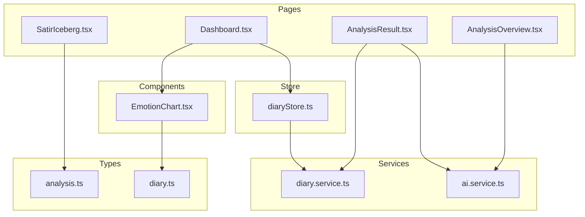
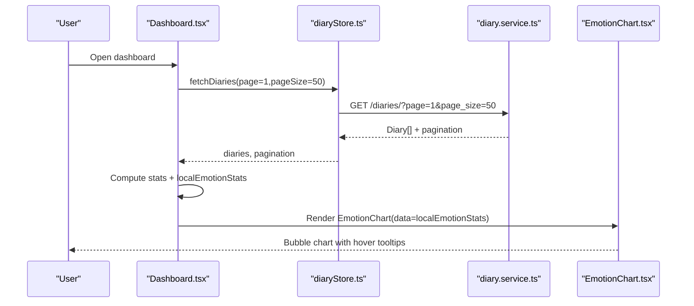
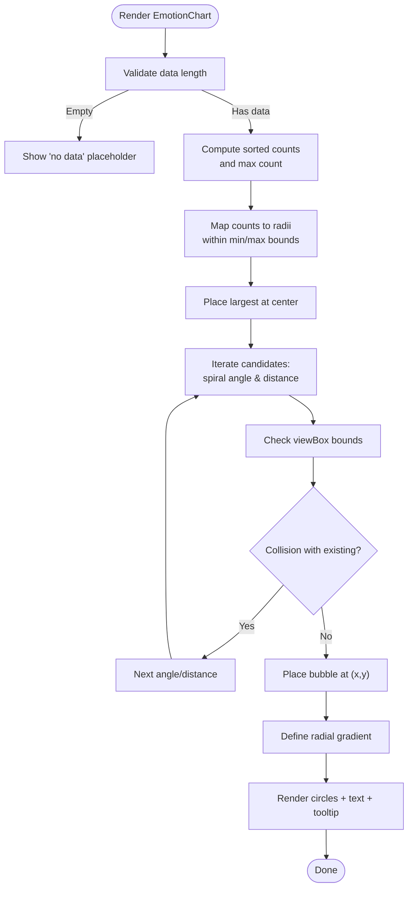
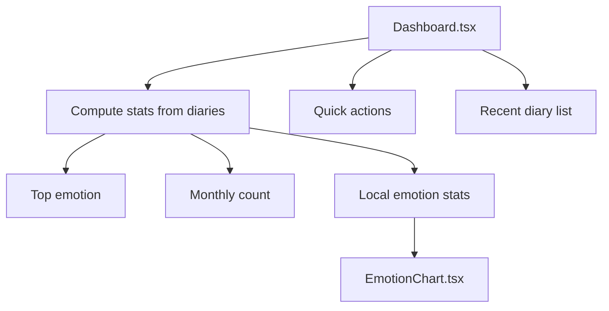
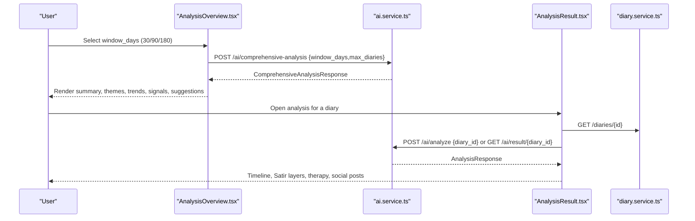
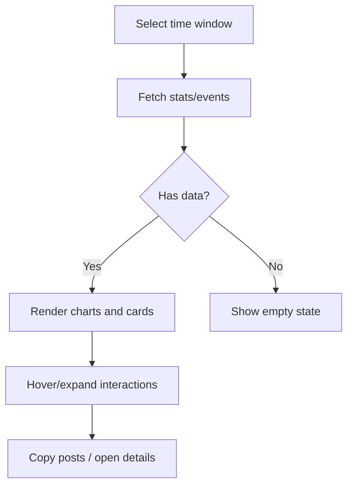
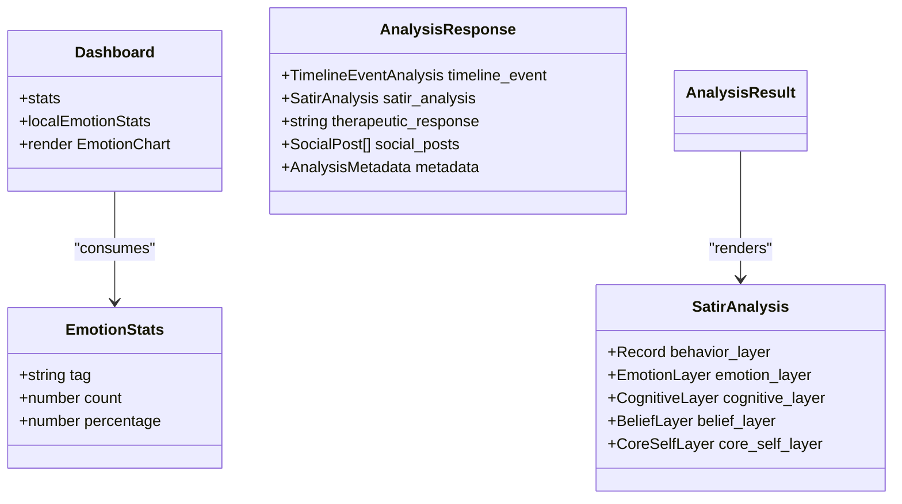
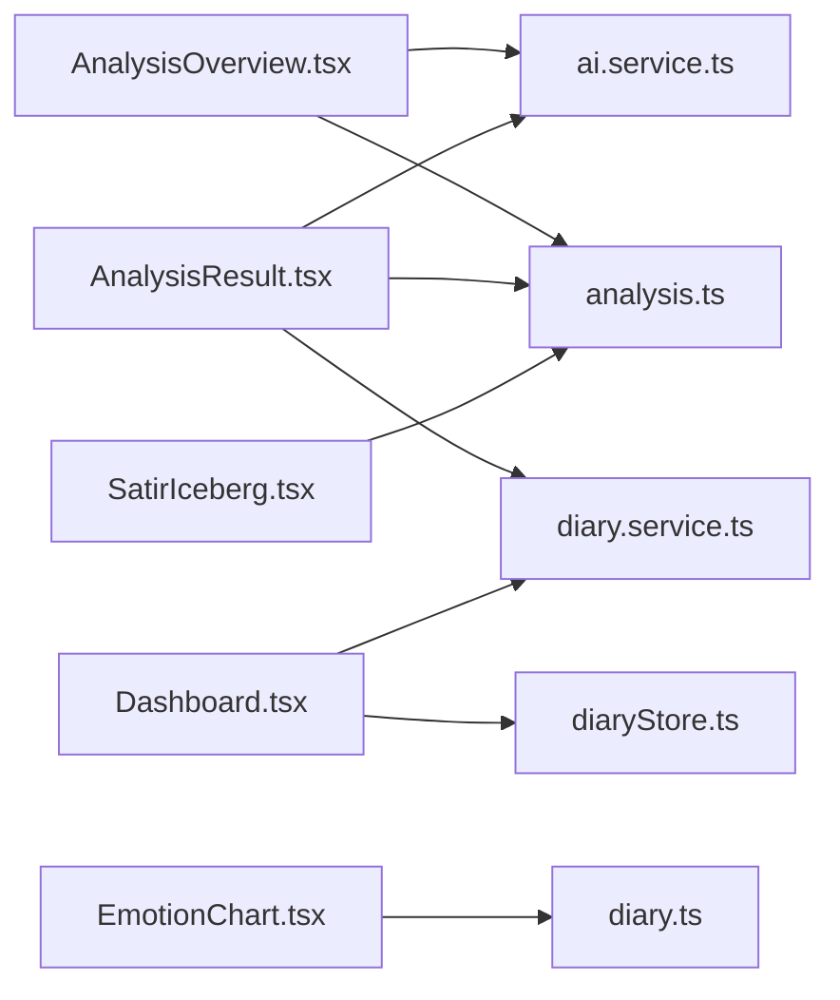
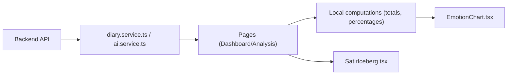
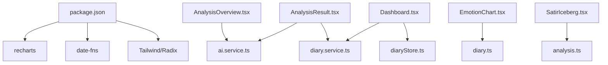

# Data Visualization

<cite>
**Referenced Files in This Document**
- [EmotionChart.tsx](file://frontend/src/components/common/EmotionChart.tsx)
- [Dashboard.tsx](file://frontend/src/pages/dashboard/Dashboard.tsx)
- [AnalysisOverview.tsx](file://frontend/src/pages/analysis/AnalysisOverview.tsx)
- [AnalysisResult.tsx](file://frontend/src/pages/analysis/AnalysisResult.tsx)
- [SatirIceberg.tsx](file://frontend/src/pages/analysis/SatirIceberg.tsx)
- [diary.service.ts](file://frontend/src/services/diary.service.ts)
- [ai.service.ts](file://frontend/src/services/ai.service.ts)
- [diaryStore.ts](file://frontend/src/store/diaryStore.ts)
- [analysis.ts](file://frontend/src/types/analysis.ts)
- [diary.ts](file://frontend/src/types/diary.ts)
- [package.json](file://frontend/package.json)
</cite>

## Table of Contents
1. [Introduction](#introduction)
2. [Project Structure](#project-structure)
3. [Core Components](#core-components)
4. [Architecture Overview](#architecture-overview)
5. [Detailed Component Analysis](#detailed-component-analysis)
6. [Dependency Analysis](#dependency-analysis)
7. [Performance Considerations](#performance-considerations)
8. [Troubleshooting Guide](#troubleshooting-guide)
9. [Conclusion](#conclusion)

## Introduction
This document explains the Data Visualization feature for mood tracking and behavioral insights. It covers:
- Emotion chart components using SVG-based bubble layouts for mood distribution
- Dashboard layout and KPI cards for personal insights
- Statistical reporting system for diary patterns and trends
- Interactive visualization components enabling time-range and filter exploration
- Integration between analysis results and visual presentation
- Responsive design considerations for charts across screen sizes
- Frontend component architecture, data formatting, and user interaction
- Data transformation pipeline from raw analysis results to visual representations
- Performance optimizations for large datasets and real-time updates

## Project Structure
The visualization feature spans several frontend modules:
- Pages: dashboard overview, analysis overview, individual analysis results, and psychological model visualization
- Services: API clients for diary analytics and AI analysis
- Store: centralized state for diary lists and emotion statistics
- Types: shared TypeScript interfaces for analysis and diary data
- Components: reusable emotion bubble chart and UI primitives

**Diagram sources**
- [Dashboard.tsx:1-323](file://frontend/src/pages/dashboard/Dashboard.tsx#L1-L323)
- [AnalysisOverview.tsx:1-119](file://frontend/src/pages/analysis/AnalysisOverview.tsx#L1-L119)
- [AnalysisResult.tsx:1-410](file://frontend/src/pages/analysis/AnalysisResult.tsx#L1-L410)
- [SatirIceberg.tsx:1-216](file://frontend/src/pages/analysis/SatirIceberg.tsx#L1-L216)
- [diary.service.ts:1-112](file://frontend/src/services/diary.service.ts#L1-L112)
- [ai.service.ts:1-112](file://frontend/src/services/ai.service.ts#L1-L112)
- [diaryStore.ts:1-164](file://frontend/src/store/diaryStore.ts#L1-L164)
- [analysis.ts:1-142](file://frontend/src/types/analysis.ts#L1-L142)
- [diary.ts:1-128](file://frontend/src/types/diary.ts#L1-L128)
- [EmotionChart.tsx:1-269](file://frontend/src/components/common/EmotionChart.tsx#L1-L269)

**Section sources**
- [Dashboard.tsx:1-323](file://frontend/src/pages/dashboard/Dashboard.tsx#L1-L323)
- [EmotionChart.tsx:1-269](file://frontend/src/components/common/EmotionChart.tsx#L1-L269)
- [diary.service.ts:1-112](file://frontend/src/services/diary.service.ts#L1-L112)
- [ai.service.ts:1-112](file://frontend/src/services/ai.service.ts#L1-L112)
- [diaryStore.ts:1-164](file://frontend/src/store/diaryStore.ts#L1-L164)
- [analysis.ts:1-142](file://frontend/src/types/analysis.ts#L1-L142)
- [diary.ts:1-128](file://frontend/src/types/diary.ts#L1-L128)

## Core Components
- EmotionChart: An SVG-based bubble chart that renders emotion distributions with color mapping, dynamic sizing, and hover interactions. It computes a force-directed layout and radial gradients per emotion.
- Dashboard: Displays KPIs (total entries, monthly entries, top emotion) and a live emotion bubble chart derived from recent diary entries.
- AnalysisOverview: Initiates comprehensive analysis over configurable windows and presents themes, trends, signals, and suggestions.
- AnalysisResult: Presents single-diary analysis results including timeline events, Satir Iceberg layers, therapeutic responses, and social posts.
- SatirIceberg: A layered visualization of psychological layers with expandable cards and intensity indicators.
- Services and Store: Provide emotion statistics, timeline events, and analysis results; manage loading and error states.

**Section sources**
- [EmotionChart.tsx:1-269](file://frontend/src/components/common/EmotionChart.tsx#L1-L269)
- [Dashboard.tsx:1-323](file://frontend/src/pages/dashboard/Dashboard.tsx#L1-L323)
- [AnalysisOverview.tsx:1-119](file://frontend/src/pages/analysis/AnalysisOverview.tsx#L1-L119)
- [AnalysisResult.tsx:1-410](file://frontend/src/pages/analysis/AnalysisResult.tsx#L1-L410)
- [SatirIceberg.tsx:1-216](file://frontend/src/pages/analysis/SatirIceberg.tsx#L1-L216)
- [diary.service.ts:1-112](file://frontend/src/services/diary.service.ts#L1-L112)
- [diaryStore.ts:1-164](file://frontend/src/store/diaryStore.ts#L1-L164)

## Architecture Overview
The visualization architecture integrates UI pages, state management, and service APIs to deliver interactive insights.

**Diagram sources**
- [Dashboard.tsx:33-66](file://frontend/src/pages/dashboard/Dashboard.tsx#L33-L66)
- [diaryStore.ts:50-74](file://frontend/src/store/diaryStore.ts#L50-L74)
- [diary.service.ts:21-31](file://frontend/src/services/diary.service.ts#L21-L31)
- [EmotionChart.tsx:158-268](file://frontend/src/components/common/EmotionChart.tsx#L158-L268)

**Section sources**
- [Dashboard.tsx:33-66](file://frontend/src/pages/dashboard/Dashboard.tsx#L33-L66)
- [diaryStore.ts:50-74](file://frontend/src/store/diaryStore.ts#L50-L74)
- [diary.service.ts:21-31](file://frontend/src/services/diary.service.ts#L21-L31)
- [EmotionChart.tsx:158-268](file://frontend/src/components/common/EmotionChart.tsx#L158-L268)

## Detailed Component Analysis

### EmotionChart Component
- Purpose: Visualize emotion frequency and percentages as scalable bubbles with color-coded semantics.
- Data model: Accepts EmotionStats array with tag, count, and percentage.
- Color mapping: Uses a curated palette keyed by emotion names; includes fallback and fuzzy matching.
- Layout algorithm: Centers the largest emotion, arranges others in a spiral pattern with collision avoidance; radius scales with count.
- Interactions: Hover highlights with glow and tooltip showing tag, count, and percentage.
- Rendering: SVG with radial gradients per emotion; responsive container with constrained width/height.

**Diagram sources**
- [EmotionChart.tsx:96-154](file://frontend/src/components/common/EmotionChart.tsx#L96-L154)
- [EmotionChart.tsx:158-268](file://frontend/src/components/common/EmotionChart.tsx#L158-L268)

**Section sources**
- [EmotionChart.tsx:1-269](file://frontend/src/components/common/EmotionChart.tsx#L1-L269)

### Dashboard Layout and KPIs
- KPIs: Total entries, monthly entries, and top emotion computed from recent diary entries.
- Local emotion stats: Aggregated emotion tag counts and percentages for the last 30 days.
- Visualization: EmotionChart rendered below KPIs with a descriptive header.
- Navigation and actions: Quick-access buttons to write, browse, growth center, and comprehensive analysis.

**Diagram sources**
- [Dashboard.tsx:37-66](file://frontend/src/pages/dashboard/Dashboard.tsx#L37-L66)
- [Dashboard.tsx:254-264](file://frontend/src/pages/dashboard/Dashboard.tsx#L254-L264)
- [EmotionChart.tsx:158-268](file://frontend/src/components/common/EmotionChart.tsx#L158-L268)

**Section sources**
- [Dashboard.tsx:1-323](file://frontend/src/pages/dashboard/Dashboard.tsx#L1-L323)

### Statistical Reporting System
- Data sources:
  - Emotion statistics: fetched via diary service with a days parameter.
  - Timeline events: recent or range-based queries for event density and trends.
  - Comprehensive analysis: multi-diary RAG-based insights with themes, trends, signals, and suggestions.
- Presentation:
  - AnalysisOverview: time-window selection, loading states, and structured sections for summary, themes, trends, signals, turning points, and suggestions.
  - AnalysisResult: single-diary breakdown including timeline event, Satir layers, therapeutic response, and social posts.

**Diagram sources**
- [AnalysisOverview.tsx:15-26](file://frontend/src/pages/analysis/AnalysisOverview.tsx#L15-L26)
- [ai.service.ts:44-47](file://frontend/src/services/ai.service.ts#L44-L47)
- [AnalysisResult.tsx:33-78](file://frontend/src/pages/analysis/AnalysisResult.tsx#L33-L78)
- [diary.service.ts:33-48](file://frontend/src/services/diary.service.ts#L33-L48)

**Section sources**
- [AnalysisOverview.tsx:1-119](file://frontend/src/pages/analysis/AnalysisOverview.tsx#L1-L119)
- [AnalysisResult.tsx:1-410](file://frontend/src/pages/analysis/AnalysisResult.tsx#L1-L410)
- [ai.service.ts:1-112](file://frontend/src/services/ai.service.ts#L1-L112)
- [diary.service.ts:1-112](file://frontend/src/services/diary.service.ts#L1-L112)

### Interactive Visualization Components
- Time-range exploration:
  - Dashboard: computes stats over a fixed window (last 30 days) for local emotion stats.
  - AnalysisOverview: allows selecting window_days for comprehensive analysis.
- Filters:
  - Diary listing supports emotion_tag filtering via service parameters.
  - Timeline queries support date range and daily filters.
- User interactions:
  - EmotionChart hover states and tooltips.
  - Expandable SatirIceberg layers with content toggles.
  - Copy-to-clipboard for social posts with feedback.

**Diagram sources**
- [Dashboard.tsx:37-66](file://frontend/src/pages/dashboard/Dashboard.tsx#L37-L66)
- [AnalysisOverview.tsx:15-26](file://frontend/src/pages/analysis/AnalysisOverview.tsx#L15-L26)
- [diary.service.ts:21-31](file://frontend/src/services/diary.service.ts#L21-L31)
- [diary.service.ts:64-76](file://frontend/src/services/diary.service.ts#L64-L76)

**Section sources**
- [Dashboard.tsx:37-66](file://frontend/src/pages/dashboard/Dashboard.tsx#L37-L66)
- [AnalysisOverview.tsx:15-26](file://frontend/src/pages/analysis/AnalysisOverview.tsx#L15-L26)
- [diary.service.ts:21-31](file://frontend/src/services/diary.service.ts#L21-L31)
- [diary.service.ts:64-76](file://frontend/src/services/diary.service.ts#L64-L76)

### Integration Between Analysis Results and Visual Presentation
- EmotionChart consumes EmotionStats arrays derived from:
  - Local computation in Dashboard (recent diaries)
  - Backend emotion statistics endpoint
- AnalysisResult composes multiple visual blocks:
  - Timeline event summary and tags
  - SatirIceberg layers with nested content
  - Therapeutic response and social posts with version/style metadata
- Data types define consistent structures for seamless rendering.

**Diagram sources**
- [diary.ts:59-63](file://frontend/src/types/diary.ts#L59-L63)
- [Dashboard.tsx:37-66](file://frontend/src/pages/dashboard/Dashboard.tsx#L37-L66)
- [analysis.ts:133-141](file://frontend/src/types/analysis.ts#L133-L141)
- [analysis.ts:91-97](file://frontend/src/types/analysis.ts#L91-L97)

**Section sources**
- [diary.ts:59-63](file://frontend/src/types/diary.ts#L59-L63)
- [Dashboard.tsx:37-66](file://frontend/src/pages/dashboard/Dashboard.tsx#L37-L66)
- [analysis.ts:133-141](file://frontend/src/types/analysis.ts#L133-L141)
- [analysis.ts:91-97](file://frontend/src/types/analysis.ts#L91-L97)

### Responsive Design Considerations
- EmotionChart:
  - Fixed intrinsic size with a responsive container; SVG viewBox ensures crisp rendering at various widths.
  - Dynamic font sizes and bubble radii adapt to available space.
- Dashboard:
  - Grid-based KPI cards and quick-action buttons adapt across breakpoints.
  - Lists and cards use padding and spacing tuned for mobile and desktop.
- SatirIceberg:
  - Layer widths decrease progressively to form a visual pyramid; content remains readable with collapsible sections.

**Section sources**
- [EmotionChart.tsx:158-180](file://frontend/src/components/common/EmotionChart.tsx#L158-L180)
- [Dashboard.tsx:220-252](file://frontend/src/pages/dashboard/Dashboard.tsx#L220-L252)
- [SatirIceberg.tsx:89-120](file://frontend/src/pages/analysis/SatirIceberg.tsx#L89-L120)

### Frontend Component Architecture
- Pages orchestrate data fetching and render domain-specific views.
- Services encapsulate API endpoints for diaries and AI analysis.
- Store centralizes state for lists and stats with loading/error handling.
- Types define contracts for data exchange and rendering.

**Diagram sources**
- [AnalysisOverview.tsx:1-119](file://frontend/src/pages/analysis/AnalysisOverview.tsx#L1-L119)
- [AnalysisResult.tsx:1-410](file://frontend/src/pages/analysis/AnalysisResult.tsx#L1-L410)
- [Dashboard.tsx:1-323](file://frontend/src/pages/dashboard/Dashboard.tsx#L1-L323)
- [ai.service.ts:1-112](file://frontend/src/services/ai.service.ts#L1-L112)
- [diary.service.ts:1-112](file://frontend/src/services/diary.service.ts#L1-L112)
- [diaryStore.ts:1-164](file://frontend/src/store/diaryStore.ts#L1-L164)
- [EmotionChart.tsx:1-269](file://frontend/src/components/common/EmotionChart.tsx#L1-L269)
- [diary.ts:1-128](file://frontend/src/types/diary.ts#L1-L128)
- [analysis.ts:1-142](file://frontend/src/types/analysis.ts#L1-L142)
- [SatirIceberg.tsx:1-216](file://frontend/src/pages/analysis/SatirIceberg.tsx#L1-L216)

**Section sources**
- [AnalysisOverview.tsx:1-119](file://frontend/src/pages/analysis/AnalysisOverview.tsx#L1-L119)
- [AnalysisResult.tsx:1-410](file://frontend/src/pages/analysis/AnalysisResult.tsx#L1-L410)
- [Dashboard.tsx:1-323](file://frontend/src/pages/dashboard/Dashboard.tsx#L1-L323)
- [ai.service.ts:1-112](file://frontend/src/services/ai.service.ts#L1-L112)
- [diary.service.ts:1-112](file://frontend/src/services/diary.service.ts#L1-L112)
- [diaryStore.ts:1-164](file://frontend/src/store/diaryStore.ts#L1-L164)
- [EmotionChart.tsx:1-269](file://frontend/src/components/common/EmotionChart.tsx#L1-L269)
- [diary.ts:1-128](file://frontend/src/types/diary.ts#L1-L128)
- [analysis.ts:1-142](file://frontend/src/types/analysis.ts#L1-L142)
- [SatirIceberg.tsx:1-216](file://frontend/src/pages/analysis/SatirIceberg.tsx#L1-L216)

### Data Transformation Pipeline
- From raw analysis to visuals:
  - Fetch: Pages call services to retrieve emotion stats and analysis results.
  - Transform: Dashboard computes totals, monthly counts, and emotion percentages locally.
  - Render: EmotionChart receives normalized EmotionStats; SatirIceberg consumes structured analysis objects.
- Consistency: Types enforce field contracts across the pipeline.

**Diagram sources**
- [diary.service.ts:78-84](file://frontend/src/services/diary.service.ts#L78-L84)
- [ai.service.ts:44-47](file://frontend/src/services/ai.service.ts#L44-L47)
- [Dashboard.tsx:37-66](file://frontend/src/pages/dashboard/Dashboard.tsx#L37-L66)
- [EmotionChart.tsx:158-268](file://frontend/src/components/common/EmotionChart.tsx#L158-L268)
- [SatirIceberg.tsx:1-216](file://frontend/src/pages/analysis/SatirIceberg.tsx#L1-L216)

**Section sources**
- [diary.service.ts:78-84](file://frontend/src/services/diary.service.ts#L78-L84)
- [ai.service.ts:44-47](file://frontend/src/services/ai.service.ts#L44-L47)
- [Dashboard.tsx:37-66](file://frontend/src/pages/dashboard/Dashboard.tsx#L37-L66)
- [EmotionChart.tsx:158-268](file://frontend/src/components/common/EmotionChart.tsx#L158-L268)
- [SatirIceberg.tsx:1-216](file://frontend/src/pages/analysis/SatirIceberg.tsx#L1-L216)

## Dependency Analysis
- External libraries:
  - Recharts: present in dependencies; however, the emotion bubble chart is implemented with pure SVG in EmotionChart.tsx.
  - date-fns: used for formatting dates in analysis results.
  - Tailwind and Radix UI: used for styling and UI primitives.
- Internal dependencies:
  - Pages depend on services and store.
  - Components depend on types for shape safety.
  - No circular dependencies observed among the analyzed modules.

**Diagram sources**
- [package.json:14-36](file://frontend/package.json#L14-L36)
- [AnalysisOverview.tsx:1-119](file://frontend/src/pages/analysis/AnalysisOverview.tsx#L1-L119)
- [AnalysisResult.tsx:1-410](file://frontend/src/pages/analysis/AnalysisResult.tsx#L1-L410)
- [Dashboard.tsx:1-323](file://frontend/src/pages/dashboard/Dashboard.tsx#L1-L323)
- [diary.service.ts:1-112](file://frontend/src/services/diary.service.ts#L1-L112)
- [ai.service.ts:1-112](file://frontend/src/services/ai.service.ts#L1-L112)
- [diaryStore.ts:1-164](file://frontend/src/store/diaryStore.ts#L1-L164)
- [EmotionChart.tsx:1-269](file://frontend/src/components/common/EmotionChart.tsx#L1-L269)
- [diary.ts:1-128](file://frontend/src/types/diary.ts#L1-L128)
- [analysis.ts:1-142](file://frontend/src/types/analysis.ts#L1-L142)
- [SatirIceberg.tsx:1-216](file://frontend/src/pages/analysis/SatirIceberg.tsx#L1-L216)

**Section sources**
- [package.json:14-36](file://frontend/package.json#L14-L36)
- [AnalysisOverview.tsx:1-119](file://frontend/src/pages/analysis/AnalysisOverview.tsx#L1-L119)
- [AnalysisResult.tsx:1-410](file://frontend/src/pages/analysis/AnalysisResult.tsx#L1-L410)
- [Dashboard.tsx:1-323](file://frontend/src/pages/dashboard/Dashboard.tsx#L1-L323)
- [diary.service.ts:1-112](file://frontend/src/services/diary.service.ts#L1-L112)
- [ai.service.ts:1-112](file://frontend/src/services/ai.service.ts#L1-L112)
- [diaryStore.ts:1-164](file://frontend/src/store/diaryStore.ts#L1-L164)
- [EmotionChart.tsx:1-269](file://frontend/src/components/common/EmotionChart.tsx#L1-L269)
- [diary.ts:1-128](file://frontend/src/types/diary.ts#L1-L128)
- [analysis.ts:1-142](file://frontend/src/types/analysis.ts#L1-L142)
- [SatirIceberg.tsx:1-216](file://frontend/src/pages/analysis/SatirIceberg.tsx#L1-L216)

## Performance Considerations
- EmotionChart:
  - Computationally lightweight: sorting and layout occur on small datasets (emotion counts).
  - Memoization: layout recomputes only when data changes.
  - SVG rendering: efficient for static shapes; avoid frequent reflows by minimizing DOM updates.
- Dashboard:
  - Limits fetched diaries to a reasonable page size to keep computations fast.
  - Local aggregation avoids repeated network requests for stats.
- Analysis pages:
  - Async analysis tasks can be polled or handled via server-side caching; UI should reflect progress and errors.
- Recommendations:
  - Debounce time-range selections to prevent rapid re-fetches.
  - Virtualize long lists (timeline events) if datasets grow large.
  - Lazy-load heavy analysis results to improve initial load performance.

[No sources needed since this section provides general guidance]

## Troubleshooting Guide
- No emotion data:
  - EmotionChart displays a neutral placeholder when input data is empty.
- Loading states:
  - Dashboard shows a spinner while fetching diaries; pages display loading spinners during analysis.
- Errors:
  - Services and pages set error messages; UI surfaces actionable feedback and retry actions.
- Clipboard operations:
  - Fallback implementation ensures copying works even without secure contexts.

**Section sources**
- [EmotionChart.tsx:166-172](file://frontend/src/components/common/EmotionChart.tsx#L166-L172)
- [Dashboard.tsx:86-92](file://frontend/src/pages/dashboard/Dashboard.tsx#L86-L92)
- [AnalysisResult.tsx:21-26](file://frontend/src/pages/analysis/AnalysisResult.tsx#L21-L26)
- [AnalysisResult.tsx:96-117](file://frontend/src/pages/analysis/AnalysisResult.tsx#L96-L117)

## Conclusion
The Data Visualization feature combines a custom SVG-based emotion bubble chart with dashboard KPIs and comprehensive analysis pages. It leverages typed data contracts, efficient local computations, and clear separation of concerns across pages, services, and store. While Recharts is included as a dependency, the emotion visualization is implemented independently for precise control over layout and responsiveness. The architecture supports interactive exploration via time windows and filters, integrates seamlessly with backend analysis results, and maintains performance through targeted optimizations.