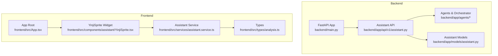
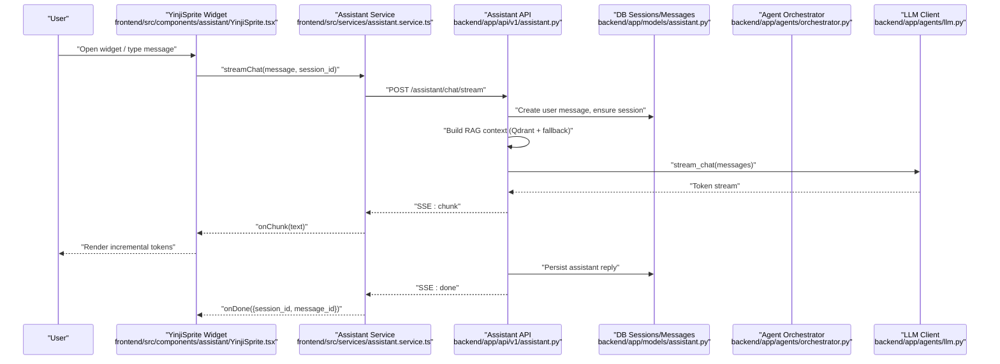
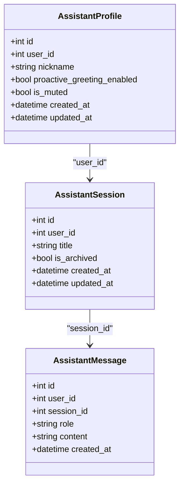
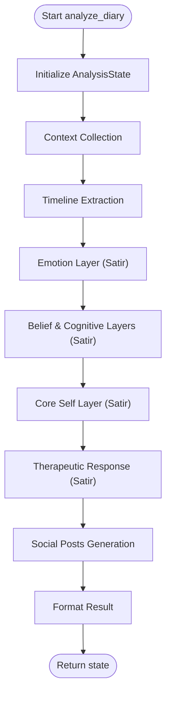
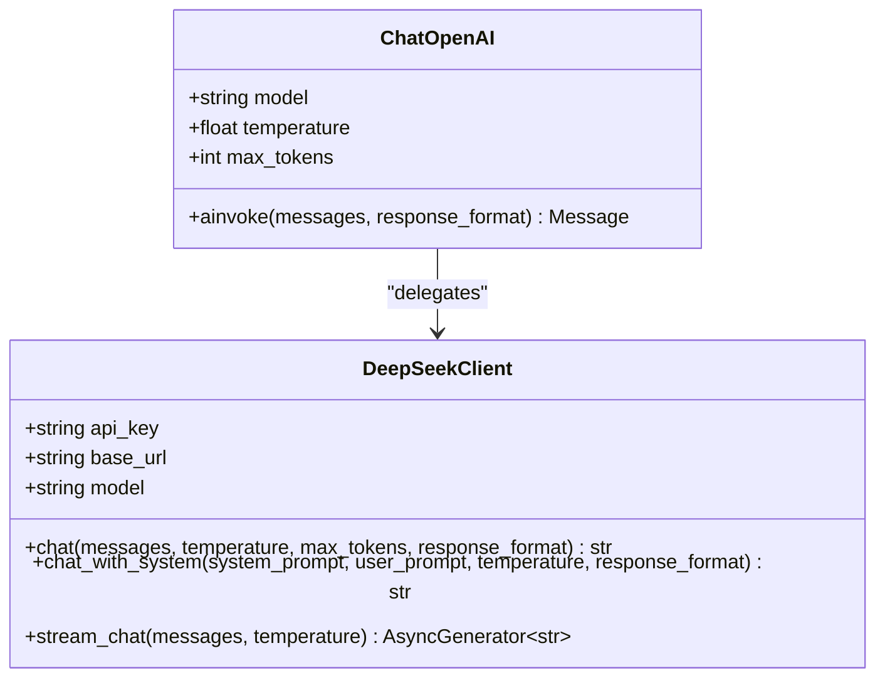
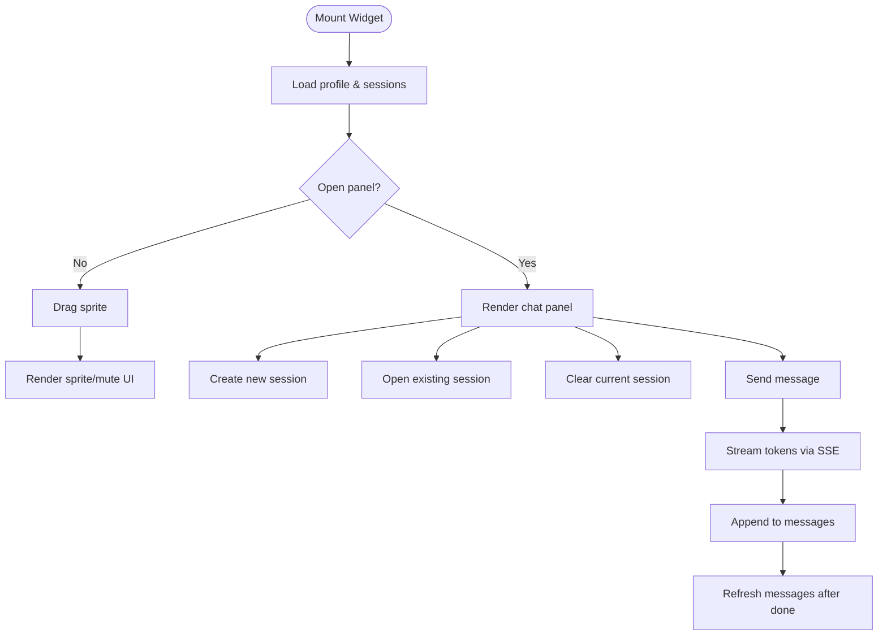
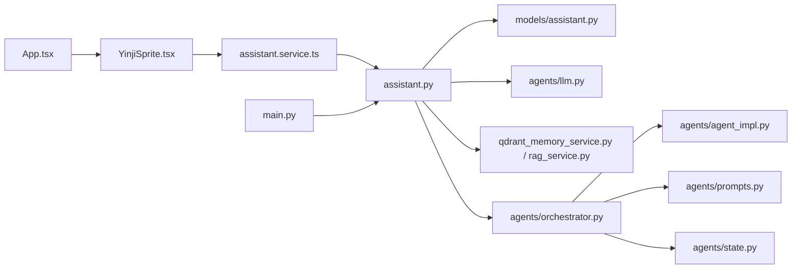

# Personal Assistant

<cite>
**Referenced Files in This Document**
- [main.py](file://backend/main.py)
- [assistant.py](file://backend/app/api/v1/assistant.py)
- [llm.py](file://backend/app/agents/llm.py)
- [orchestrator.py](file://backend/app/agents/orchestrator.py)
- [agent_impl.py](file://backend/app/agents/agent_impl.py)
- [prompts.py](file://backend/app/agents/prompts.py)
- [state.py](file://backend/app/agents/state.py)
- [assistant.py](file://backend/app/models/assistant.py)
- [YinjiSprite.tsx](file://frontend/src/components/assistant/YinjiSprite.tsx)
- [assistant.service.ts](file://frontend/src/services/assistant.service.ts)
- [App.tsx](file://frontend/src/App.tsx)
- [analysis.ts](file://frontend/src/types/analysis.ts)
</cite>

## Table of Contents
1. [Introduction](#introduction)
2. [Project Structure](#project-structure)
3. [Core Components](#core-components)
4. [Architecture Overview](#architecture-overview)
5. [Detailed Component Analysis](#detailed-component-analysis)
6. [Dependency Analysis](#dependency-analysis)
7. [Performance Considerations](#performance-considerations)
8. [Troubleshooting Guide](#troubleshooting-guide)
9. [Conclusion](#conclusion)
10. [Appendices](#appendices)

## Introduction
This document describes the Personal Assistant feature centered around a floating AI chat widget and a multi-agent orchestration system. It covers:
- Interactive chat experience with real-time streaming responses via server-sent events
- Session management with persistent conversations and context preservation
- Personality customization and conversational style
- Agent orchestration coordinating specialized assistants for contextual analysis, therapeutic insights, and social content generation
- Frontend component architecture and user interaction patterns
- Backend agent system, prompt engineering strategies, and conversation flow management
- Integration with other system features and the assistant’s role in the overall user experience

## Project Structure
The Personal Assistant spans both backend and frontend:
- Backend FastAPI app registers assistant endpoints and integrates with agent orchestration and LLM clients
- Frontend renders a floating “Yinji Sprite” chat widget with a draggable panel, session list, and message history
- Assistant-related models define profiles, sessions, and messages persisted in the database

**Diagram sources**
- [main.py:78-80](file://backend/main.py#L78-L80)
- [assistant.py:26](file://backend/app/api/v1/assistant.py#L26)
- [YinjiSprite.tsx:3](file://frontend/src/components/assistant/YinjiSprite.tsx#L3)
- [assistant.service.ts:1](file://frontend/src/services/assistant.service.ts#L1)

**Section sources**
- [main.py:78-80](file://backend/main.py#L78-L80)
- [assistant.py:26](file://backend/app/api/v1/assistant.py#L26)
- [YinjiSprite.tsx:3](file://frontend/src/components/assistant/YinjiSprite.tsx#L3)
- [assistant.service.ts:1](file://frontend/src/services/assistant.service.ts#L1)

## Core Components
- Floating chat widget (Yinji Sprite): draggable, resizable panel with session list, message history, and input area
- Assistant API: profile/session/message CRUD, and a streaming chat endpoint
- Agent orchestration: multi-step workflow across context collection, timeline extraction, therapeutic analysis, and social content generation
- LLM client: DeepSeek-compatible client supporting synchronous and streaming completions
- Assistant models: profiles, sessions, and messages persisted in the database

**Section sources**
- [YinjiSprite.tsx:20](file://frontend/src/components/assistant/YinjiSprite.tsx#L20)
- [assistant.py:26](file://backend/app/api/v1/assistant.py#L26)
- [orchestrator.py:18](file://backend/app/agents/orchestrator.py#L18)
- [llm.py:13](file://backend/app/agents/llm.py#L13)
- [assistant.py](file://backend/app/models/assistant.py#L13)

## Architecture Overview
The assistant integrates a streaming chat flow with RAG-enhanced context retrieval and a multi-agent pipeline for deeper analysis.

**Diagram sources**
- [YinjiSprite.tsx:300-335](file://frontend/src/components/assistant/YinjiSprite.tsx#L300-L335)
- [assistant.service.ts:69-125](file://frontend/src/services/assistant.service.ts#L69-L125)
- [assistant.py:277-387](file://backend/app/api/v1/assistant.py#L277-L387)
- [llm.py:94-143](file://backend/app/agents/llm.py#L94-L143)

## Detailed Component Analysis

### Backend: Assistant API and Models
- Profiles: per-user nickname, muting, and initialization state
- Sessions: conversation threads with titles and archival
- Messages: typed entries (user/assistant/system) stored with timestamps
- Streaming chat: builds system/user prompts, retrieves RAG context, streams tokens, persists replies, and emits SSE events

**Diagram sources**
- [assistant.py:13-77](file://backend/app/models/assistant.py#L13-L77)

**Section sources**
- [assistant.py:26](file://backend/app/api/v1/assistant.py#L26)
- [assistant.py:122-157](file://backend/app/api/v1/assistant.py#L122-L157)
- [assistant.py:160-218](file://backend/app/api/v1/assistant.py#L160-L218)
- [assistant.py:221-274](file://backend/app/api/v1/assistant.py#L221-L274)
- [assistant.py:277-387](file://backend/app/api/v1/assistant.py#L277-L387)
- [assistant.py:13-77](file://backend/app/models/assistant.py#L13-L77)

### Backend: Agent Orchestration and Prompts
- Orchestrator coordinates four agents: Context Collector, Timeline Manager, Satir Therapist (multi-step), and Social Content Creator
- State carries inputs, context, layers of analysis, timeline event, social posts, and metadata
- Prompts define roles, tasks, and output formats for each agent

**Diagram sources**
- [orchestrator.py:27-171](file://backend/app/agents/orchestrator.py#L27-L171)
- [state.py:10-45](file://backend/app/agents/state.py#L10-L45)
- [prompts.py:7-244](file://backend/app/agents/prompts.py#L7-L244)

**Section sources**
- [orchestrator.py:18-171](file://backend/app/agents/orchestrator.py#L18-L171)
- [state.py:10-45](file://backend/app/agents/state.py#L10-L45)
- [prompts.py:7-244](file://backend/app/agents/prompts.py#L7-L244)

### Backend: LLM Client and Compatibility
- DeepSeek-compatible client supports synchronous and streaming chat
- Provides wrappers to emulate LangChain’s ChatOpenAI interface for agent components
- Temperature and response format controls are exposed

**Diagram sources**
- [llm.py:13-220](file://backend/app/agents/llm.py#L13-L220)

**Section sources**
- [llm.py:13-220](file://backend/app/agents/llm.py#L13-L220)

### Frontend: Chat Widget and Interaction Patterns
- Floating “Yinji Sprite” with draggable positioning and optional mute state
- Chat panel with session tabs, message history, and input area
- Streaming UI updates via SSE parsing and optimistic rendering
- Session lifecycle: create, open, clear, archive

**Diagram sources**
- [YinjiSprite.tsx:45-108](file://frontend/src/components/assistant/YinjiSprite.tsx#L45-L108)
- [YinjiSprite.tsx:232-279](file://frontend/src/components/assistant/YinjiSprite.tsx#L232-L279)
- [YinjiSprite.tsx:281-335](file://frontend/src/components/assistant/YinjiSprite.tsx#L281-L335)
- [assistant.service.ts:69-125](file://frontend/src/services/assistant.service.ts#L69-L125)

**Section sources**
- [YinjiSprite.tsx:20-545](file://frontend/src/components/assistant/YinjiSprite.tsx#L20-L545)
- [assistant.service.ts:1-128](file://frontend/src/services/assistant.service.ts#L1-L128)
- [App.tsx:234](file://frontend/src/App.tsx#L234)

### Personality Customization and Conversational Styles
- Assistant profile supports nickname and muting
- Conversational style is influenced by user MBTI and nickname injected into the system prompt
- Social content generation adapts to user-defined social style and catchphrases

**Section sources**
- [assistant.py:122-157](file://backend/app/api/v1/assistant.py#L122-L157)
- [assistant.py:328-341](file://backend/app/api/v1/assistant.py#L328-L341)
- [prompts.py:168-208](file://backend/app/agents/prompts.py#L168-L208)

### Voice Integration and Speech-to-Text
- No explicit voice-to-text or audio synthesis endpoints were identified in the assistant API
- The streaming chat relies on text input and SSE token delivery
- If voice features are desired, integrate a browser Web Speech API or external STT/TTS service and extend the frontend widget accordingly

[No sources needed since this section provides general guidance]

### Real-Time Streaming Responses Using Server-Sent Events
- Backend emits structured SSE events: meta (session/message ids), chunk (token text), done (finalization), error (failure)
- Frontend parses event lines, dispatches callbacks, and updates the UI incrementally

**Section sources**
- [assistant.py:343-387](file://backend/app/api/v1/assistant.py#L343-L387)
- [assistant.service.ts:69-125](file://frontend/src/services/assistant.service.ts#L69-L125)

### Session Management and Conversation Flow
- Sessions are created automatically when a chat request lacks a session_id
- Titles are derived from the first user message if not set
- Messages are persisted after completion and refreshed on done
- RAG context is built from semantic memory and local diaries

**Section sources**
- [assistant.py:287-301](file://backend/app/api/v1/assistant.py#L287-L301)
- [assistant.py:312-326](file://backend/app/api/v1/assistant.py#L312-L326)
- [assistant.py:358-374](file://backend/app/api/v1/assistant.py#L358-L374)

### Backend Agent System and Prompt Engineering
- Agents use specialized prompts and temperatures tuned for analytical vs creative tasks
- JSON response formatting is enforced for structured outputs
- Error handling includes graceful degradation with default/fallback results

**Section sources**
- [agent_impl.py:25-68](file://backend/app/agents/agent_impl.py#L25-L68)
- [agent_impl.py:92-142](file://backend/app/agents/agent_impl.py#L92-L142)
- [agent_impl.py:144-202](file://backend/app/agents/agent_impl.py#L144-L202)
- [agent_impl.py:205-394](file://backend/app/agents/agent_impl.py#L205-L394)
- [agent_impl.py:396-483](file://backend/app/agents/agent_impl.py#L396-L483)
- [prompts.py:7-244](file://backend/app/agents/prompts.py#L7-L244)

## Dependency Analysis
- Backend FastAPI mounts assistant routes and includes routers for auth, diaries, AI analysis, users, and community
- Assistant API depends on:
  - Assistant models for persistence
  - LLM client for streaming completions
  - RAG services for context retrieval
- Frontend depends on:
  - Assistant service for SSE-based chat
  - Types for analysis and assistant entities

**Diagram sources**
- [main.py:78-80](file://backend/main.py#L78-L80)
- [assistant.py:26](file://backend/app/api/v1/assistant.py#L26)
- [YinjiSprite.tsx:3](file://frontend/src/components/assistant/YinjiSprite.tsx#L3)
- [assistant.service.ts:1](file://frontend/src/services/assistant.service.ts#L1)

**Section sources**
- [main.py:78-80](file://backend/main.py#L78-L80)
- [assistant.py:26](file://backend/app/api/v1/assistant.py#L26)

## Performance Considerations
- Streaming reduces perceived latency by rendering tokens incrementally
- RAG context retrieval prioritizes semantic search and falls back to local chunks to balance accuracy and speed
- Agent orchestration batches steps with structured prompts and JSON formatting to minimize retries
- Frontend optimizes rendering by appending tokens and refreshing messages after completion

[No sources needed since this section provides general guidance]

## Troubleshooting Guide
Common issues and remedies:
- Streaming stalls or empty responses:
  - Verify SSE parsing and ensure the response body is readable
  - Confirm network connectivity and API availability
- Session not found:
  - Ensure session_id belongs to the current user
  - Recreate session if missing
- Assistant replies malformed:
  - Check JSON formatting expectations in agent prompts
  - Validate response_format and temperature settings
- Widget not appearing:
  - Confirm authentication state and that the widget is mounted in the app root

**Section sources**
- [assistant.service.ts:69-125](file://frontend/src/services/assistant.service.ts#L69-L125)
- [assistant.py:295-301](file://backend/app/api/v1/assistant.py#L295-L301)
- [agent_impl.py:25-68](file://backend/app/agents/agent_impl.py#L25-L68)
- [App.tsx:234](file://frontend/src/App.tsx#L234)

## Conclusion
The Personal Assistant combines a friendly floating chat interface with a robust backend orchestration system. It preserves conversation context, personalizes tone and style, and delivers real-time streaming responses. The modular agent design enables future extensions for richer analysis and content generation, while the frontend widget offers an intuitive, always-available companion for users.

[No sources needed since this section summarizes without analyzing specific files]

## Appendices

### API Definitions: Assistant Endpoints
- GET /api/v1/assistant/profile
  - Description: Get assistant profile (nickname, muting, initialization)
  - Response: AssistantProfileResponse
- PUT /api/v1/assistant/profile
  - Description: Update assistant profile
  - Request: AssistantProfileUpdateRequest
  - Response: AssistantProfileResponse
- GET /api/v1/assistant/sessions
  - Description: List active sessions
  - Response: List of AssistantSessionResponse
- POST /api/v1/assistant/sessions
  - Description: Create a new session
  - Request: CreateSessionRequest
  - Response: AssistantSessionResponse
- DELETE /api/v1/assistant/sessions/{session_id}
  - Description: Archive a session
- GET /api/v1/assistant/sessions/{session_id}/messages
  - Description: Retrieve messages in a session
  - Response: List of AssistantMessageResponse
- POST /api/v1/assistant/sessions/{session_id}/clear
  - Description: Clear messages in a session
- POST /api/v1/assistant/chat/stream
  - Description: Stream chat with RAG context
  - Request: ChatStreamRequest
  - Response: text/event-stream with events: meta, chunk, done, error

**Section sources**
- [assistant.py:122-157](file://backend/app/api/v1/assistant.py#L122-L157)
- [assistant.py:160-218](file://backend/app/api/v1/assistant.py#L160-L218)
- [assistant.py:221-274](file://backend/app/api/v1/assistant.py#L221-L274)
- [assistant.py:277-387](file://backend/app/api/v1/assistant.py#L277-L387)

### Frontend Types: Assistant Entities
- AssistantProfile: nickname, proactive greeting flag, mute flag, initialized flag
- AssistantSession: id, title, timestamps
- AssistantMessage: id, role, content, timestamps
- StreamCallbacks: onMeta, onChunk, onDone, onError

**Section sources**
- [assistant.service.ts:3-29](file://frontend/src/services/assistant.service.ts#L3-L29)
- [analysis.ts:3-142](file://frontend/src/types/analysis.ts#L3-L142)