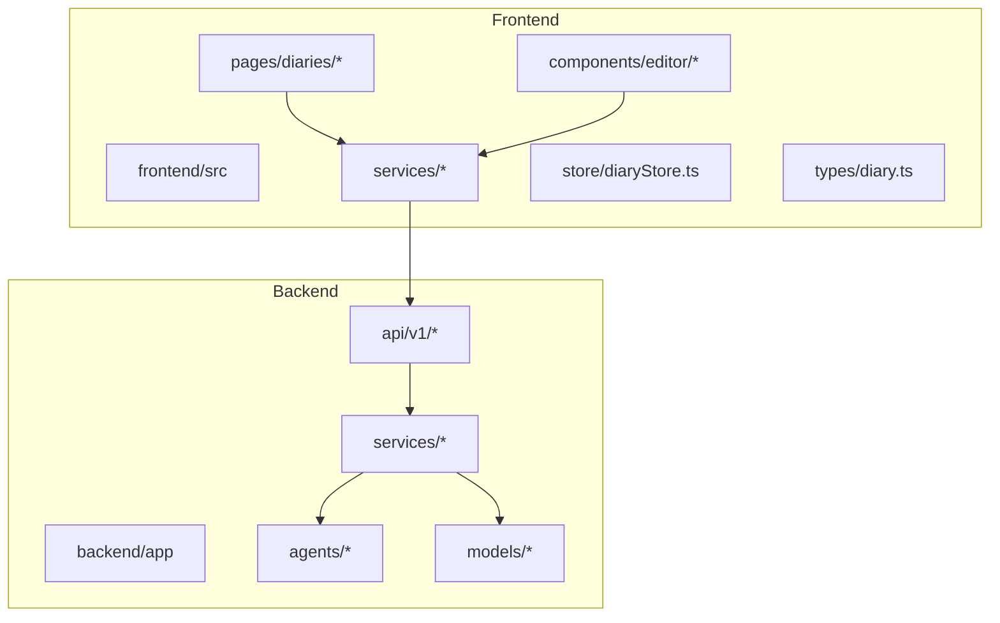
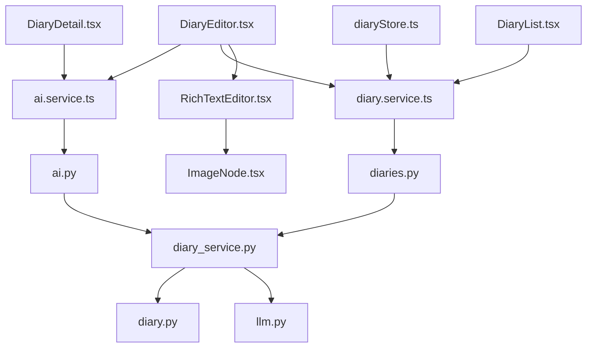
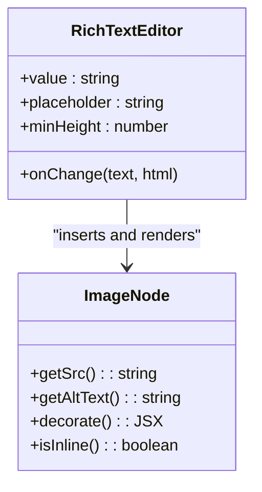
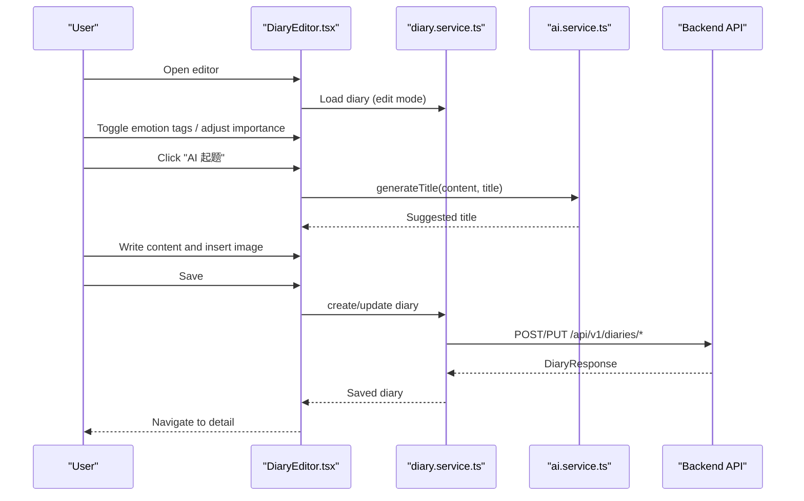
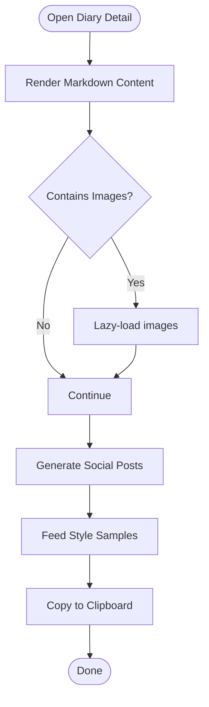
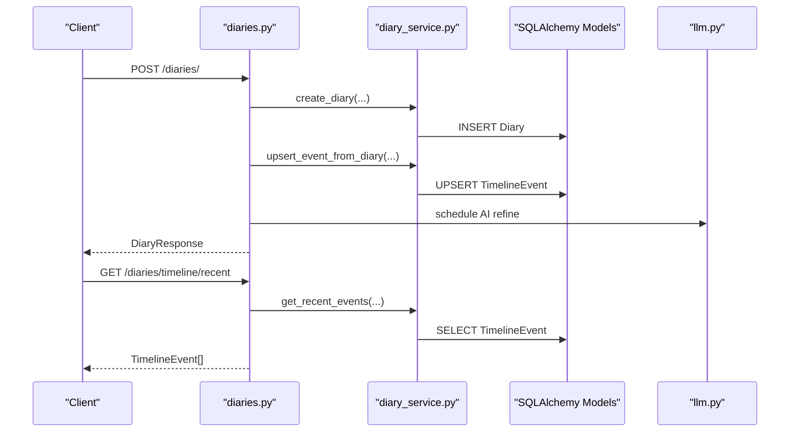
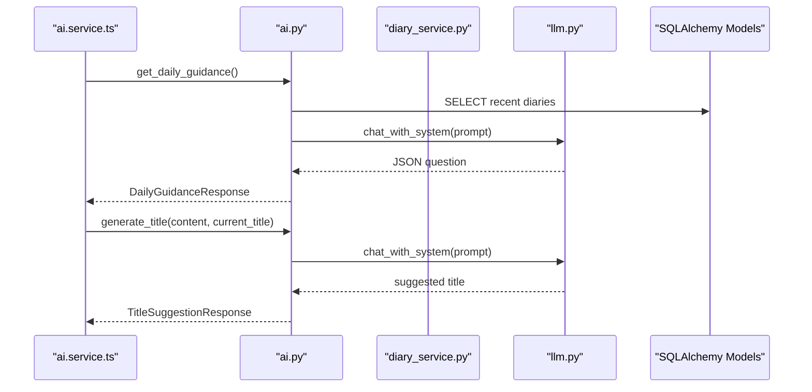
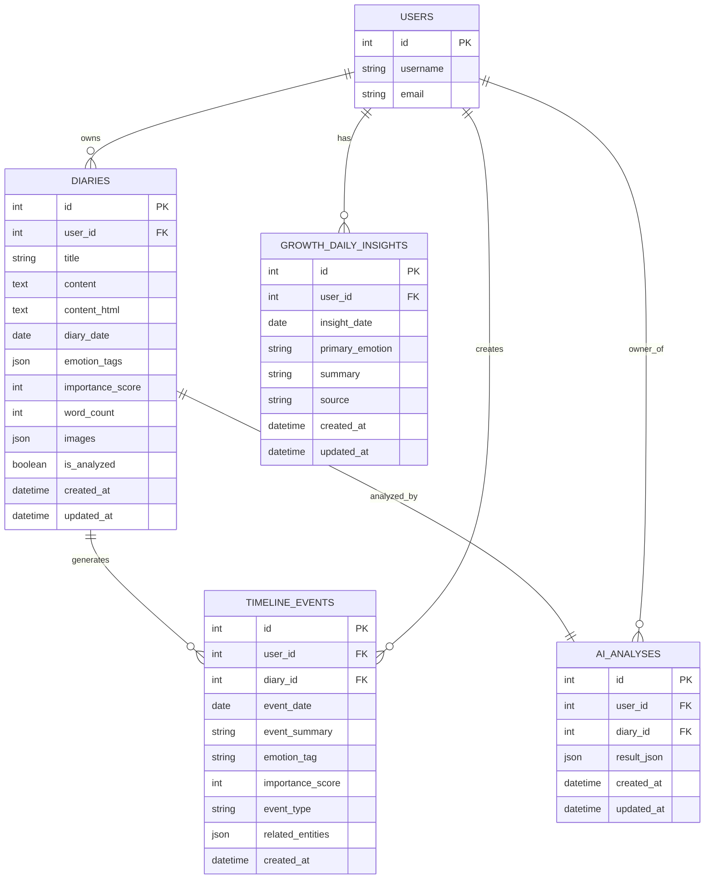
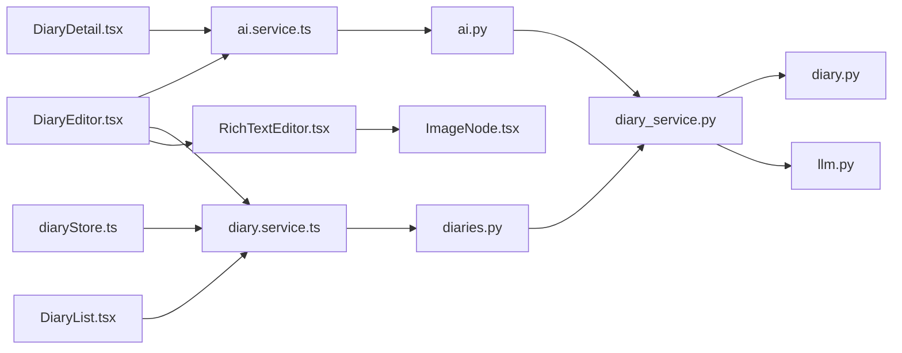

# Smart Diary System

<cite>
**Referenced Files in This Document**
- [RichTextEditor.tsx](file://frontend/src/components/editor/RichTextEditor.tsx)
- [ImageNode.tsx](file://frontend/src/components/editor/ImageNode.tsx)
- [DiaryEditor.tsx](file://frontend/src/pages/diaries/DiaryEditor.tsx)
- [DiaryDetail.tsx](file://frontend/src/pages/diaries/DiaryDetail.tsx)
- [DiaryList.tsx](file://frontend/src/pages/diaries/DiaryList.tsx)
- [diary.service.ts](file://frontend/src/services/diary.service.ts)
- [ai.service.ts](file://frontend/src/services/ai.service.ts)
- [diaryStore.ts](file://frontend/src/store/diaryStore.ts)
- [diary.ts](file://frontend/src/types/diary.ts)
- [diaries.py](file://backend/app/api/v1/diaries.py)
- [ai.py](file://backend/app/api/v1/ai.py)
- [diary_service.py](file://backend/app/services/diary_service.py)
- [llm.py](file://backend/app/agents/llm.py)
- [diary.py](file://backend/app/models/diary.py)
</cite>

## Table of Contents
1. [Introduction](#introduction)
2. [Project Structure](#project-structure)
3. [Core Components](#core-components)
4. [Architecture Overview](#architecture-overview)
5. [Detailed Component Analysis](#detailed-component-analysis)
6. [Dependency Analysis](#dependency-analysis)
7. [Performance Considerations](#performance-considerations)
8. [Troubleshooting Guide](#troubleshooting-guide)
9. [Conclusion](#conclusion)
10. [Appendices](#appendices)

## Introduction
The Smart Diary System is a modern, AI-enhanced journaling platform that combines a powerful rich text editor with advanced AI features for mood tracking, sentiment analysis, collaborative-like timelines, and social content generation. Built with a React frontend and FastAPI backend, it emphasizes user privacy, performance, and accessibility while delivering a warm, psychological-friendly writing experience.

Key capabilities:
- Rich text editing with Lexical, supporting Markdown shortcuts, headings, lists, links, and inline images
- Media insertion via local upload with image preview and lazy loading
- Emotion tagging for mood tracking and sentiment-aware insights
- AI-powered writing assistance: daily guided questions, title generation, and social post suggestions
- Timeline construction from diary entries with AI refinement
- CRUD operations, timeline queries, and robust data persistence
- Responsive and accessible UI with thoughtful interactions

## Project Structure
The system follows a clear separation of concerns:
- Frontend (React + TypeScript): Pages, components, services, stores, and types define the user-facing features
- Backend (FastAPI + SQLAlchemy): API endpoints, services, agents, and models manage data and AI workflows

**Diagram sources**
- [diaries.py:1-501](file://backend/app/api/v1/diaries.py#L1-L501)
- [ai.py:1-902](file://backend/app/api/v1/ai.py#L1-L902)
- [diary_service.py:1-637](file://backend/app/services/diary_service.py#L1-L637)
- [llm.py:1-220](file://backend/app/agents/llm.py#L1-L220)
- [diary.py:1-186](file://backend/app/models/diary.py#L1-L186)
- [DiaryEditor.tsx:1-368](file://frontend/src/pages/diaries/DiaryEditor.tsx#L1-L368)
- [RichTextEditor.tsx:1-383](file://frontend/src/components/editor/RichTextEditor.tsx#L1-L383)
- [diary.service.ts:1-112](file://frontend/src/services/diary.service.ts#L1-L112)
- [diaryStore.ts:1-164](file://frontend/src/store/diaryStore.ts#L1-L164)
- [diary.ts:1-128](file://frontend/src/types/diary.ts#L1-L128)

**Section sources**
- [diaries.py:1-501](file://backend/app/api/v1/diaries.py#L1-L501)
- [ai.py:1-902](file://backend/app/api/v1/ai.py#L1-L902)
- [diary_service.py:1-637](file://backend/app/services/diary_service.py#L1-L637)
- [llm.py:1-220](file://backend/app/agents/llm.py#L1-L220)
- [diary.py:1-186](file://backend/app/models/diary.py#L1-L186)
- [DiaryEditor.tsx:1-368](file://frontend/src/pages/diaries/DiaryEditor.tsx#L1-L368)
- [RichTextEditor.tsx:1-383](file://frontend/src/components/editor/RichTextEditor.tsx#L1-L383)
- [diary.service.ts:1-112](file://frontend/src/services/diary.service.ts#L1-L112)
- [diaryStore.ts:1-164](file://frontend/src/store/diaryStore.ts#L1-L164)
- [diary.ts:1-128](file://frontend/src/types/diary.ts#L1-L128)

## Core Components
- RichTextEditor (Lexical): Provides a polished writing experience with toolbar, Markdown shortcuts, slash commands, and image insertion
- ImageNode: Custom decorator node for rendering images inline with lazy loading and responsive sizing
- DiaryEditor: Full-page editor with emotion tags, importance scoring, AI title generation, and guided questions
- DiaryDetail: Renders formatted markdown content, supports social post generation, and style sampling
- DiaryList: Paginated list with emotion filtering and delete actions
- Services: Frontend services for diary and AI operations; backend API endpoints and services orchestrate persistence and AI
- Stores: Zustand store for managing diary state, pagination, and timeline data
- Types: Strongly typed interfaces for diaries, timeline events, terrain insights, and growth daily insights

**Section sources**
- [RichTextEditor.tsx:1-383](file://frontend/src/components/editor/RichTextEditor.tsx#L1-L383)
- [ImageNode.tsx:1-87](file://frontend/src/components/editor/ImageNode.tsx#L1-L87)
- [DiaryEditor.tsx:1-368](file://frontend/src/pages/diaries/DiaryEditor.tsx#L1-L368)
- [DiaryDetail.tsx:1-442](file://frontend/src/pages/diaries/DiaryDetail.tsx#L1-L442)
- [DiaryList.tsx:1-211](file://frontend/src/pages/diaries/DiaryList.tsx#L1-L211)
- [diary.service.ts:1-112](file://frontend/src/services/diary.service.ts#L1-L112)
- [ai.service.ts:1-112](file://frontend/src/services/ai.service.ts#L1-L112)
- [diaryStore.ts:1-164](file://frontend/src/store/diaryStore.ts#L1-L164)
- [diary.ts:1-128](file://frontend/src/types/diary.ts#L1-L128)

## Architecture Overview
The system integrates a React frontend with a FastAPI backend. The frontend communicates with backend APIs through dedicated services. AI features are powered by a configurable LLM client, and data is persisted using SQLAlchemy models.

**Diagram sources**
- [DiaryEditor.tsx:1-368](file://frontend/src/pages/diaries/DiaryEditor.tsx#L1-L368)
- [DiaryDetail.tsx:1-442](file://frontend/src/pages/diaries/DiaryDetail.tsx#L1-L442)
- [DiaryList.tsx:1-211](file://frontend/src/pages/diaries/DiaryList.tsx#L1-L211)
- [RichTextEditor.tsx:1-383](file://frontend/src/components/editor/RichTextEditor.tsx#L1-L383)
- [ImageNode.tsx:1-87](file://frontend/src/components/editor/ImageNode.tsx#L1-L87)
- [diary.service.ts:1-112](file://frontend/src/services/diary.service.ts#L1-L112)
- [ai.service.ts:1-112](file://frontend/src/services/ai.service.ts#L1-L112)
- [diaryStore.ts:1-164](file://frontend/src/store/diaryStore.ts#L1-L164)
- [diaries.py:1-501](file://backend/app/api/v1/diaries.py#L1-L501)
- [ai.py:1-902](file://backend/app/api/v1/ai.py#L1-L902)
- [diary_service.py:1-637](file://backend/app/services/diary_service.py#L1-L637)
- [llm.py:1-220](file://backend/app/agents/llm.py#L1-L220)
- [diary.py:1-186](file://backend/app/models/diary.py#L1-L186)

## Detailed Component Analysis

### Rich Text Editor (Lexical)
The editor is built on Lexical with plugins for rich text, history, Markdown shortcuts, and change tracking. It supports:
- Formatting: bold, italic
- Structural elements: headings, quotes, code blocks, lists, links
- Inline images via a custom ImageNode
- Slash command menu for quick actions
- Real-time conversion to markdown and HTML for persistence and rendering

**Diagram sources**
- [RichTextEditor.tsx:252-383](file://frontend/src/components/editor/RichTextEditor.tsx#L252-L383)
- [ImageNode.tsx:1-87](file://frontend/src/components/editor/ImageNode.tsx#L1-L87)

**Section sources**
- [RichTextEditor.tsx:1-383](file://frontend/src/components/editor/RichTextEditor.tsx#L1-L383)
- [ImageNode.tsx:1-87](file://frontend/src/components/editor/ImageNode.tsx#L1-L87)

### Diary Editor Workflow
The editor page orchestrates:
- Loading existing diary for edit mode
- Managing emotion tags and importance score
- Generating titles via AI
- Uploading images through the editor’s image picker
- Persisting to backend and navigating to detail view

**Diagram sources**
- [DiaryEditor.tsx:1-368](file://frontend/src/pages/diaries/DiaryEditor.tsx#L1-L368)
- [diary.service.ts:1-112](file://frontend/src/services/diary.service.ts#L1-L112)
- [ai.service.ts:1-112](file://frontend/src/services/ai.service.ts#L1-L112)
- [diaries.py:55-193](file://backend/app/api/v1/diaries.py#L55-L193)

**Section sources**
- [DiaryEditor.tsx:1-368](file://frontend/src/pages/diaries/DiaryEditor.tsx#L1-L368)
- [diary.service.ts:1-112](file://frontend/src/services/diary.service.ts#L1-L112)
- [ai.service.ts:1-112](file://frontend/src/services/ai.service.ts#L1-L112)
- [diaries.py:55-193](file://backend/app/api/v1/diaries.py#L55-L193)

### Diary Detail Rendering and Social Posts
The detail page renders markdown content with headings, emphasis, and inline images. It also supports generating social posts and feeding style samples to improve post quality.

**Diagram sources**
- [DiaryDetail.tsx:1-442](file://frontend/src/pages/diaries/DiaryDetail.tsx#L1-L442)
- [ai.service.ts:1-112](file://frontend/src/services/ai.service.ts#L1-L112)

**Section sources**
- [DiaryDetail.tsx:1-442](file://frontend/src/pages/diaries/DiaryDetail.tsx#L1-L442)
- [ai.service.ts:1-112](file://frontend/src/services/ai.service.ts#L1-L112)

### Diary CRUD and Timeline Queries
Backend endpoints support:
- Creating, updating, deleting, and listing diaries with pagination and filters
- Retrieving diaries by date
- Uploading images with size/type validation
- Building and querying timeline events with AI refinement
- Computing growth insights and terrain metrics

**Diagram sources**
- [diaries.py:55-334](file://backend/app/api/v1/diaries.py#L55-L334)
- [diary_service.py:66-637](file://backend/app/services/diary_service.py#L66-L637)
- [llm.py:1-220](file://backend/app/agents/llm.py#L1-L220)
- [diary.py:29-186](file://backend/app/models/diary.py#L29-L186)

**Section sources**
- [diaries.py:55-334](file://backend/app/api/v1/diaries.py#L55-L334)
- [diary_service.py:66-637](file://backend/app/services/diary_service.py#L66-L637)
- [llm.py:1-220](file://backend/app/agents/llm.py#L1-L220)
- [diary.py:29-186](file://backend/app/models/diary.py#L29-L186)

### AI Writing Assistance
The AI endpoints provide:
- Daily personalized guidance questions
- Title generation with context-aware suggestions
- Comprehensive user-level analysis (RAG-based)
- Social post generation with style samples
- Asynchronous analysis scheduling

**Diagram sources**
- [ai.service.ts:1-112](file://frontend/src/services/ai.service.ts#L1-L112)
- [ai.py:128-207](file://backend/app/api/v1/ai.py#L128-L207)
- [diary_service.py:66-637](file://backend/app/services/diary_service.py#L66-L637)
- [llm.py:1-220](file://backend/app/agents/llm.py#L1-L220)

**Section sources**
- [ai.service.ts:1-112](file://frontend/src/services/ai.service.ts#L1-L112)
- [ai.py:128-207](file://backend/app/api/v1/ai.py#L128-L207)
- [diary_service.py:66-637](file://backend/app/services/diary_service.py#L66-L637)
- [llm.py:1-220](file://backend/app/agents/llm.py#L1-L220)

### Database Schema and Relationships
The system uses relational models with JSON fields for flexible arrays and strong foreign key constraints.

**Diagram sources**
- [diary.py:29-186](file://backend/app/models/diary.py#L29-L186)

**Section sources**
- [diary.py:1-186](file://backend/app/models/diary.py#L1-L186)

## Dependency Analysis
- Frontend-to-backend coupling is minimal and explicit via typed services and API routes
- Backend services encapsulate business logic and delegate AI tasks to agents
- The editor depends on Lexical and custom ImageNode; the detail page depends on markdown rendering utilities
- State management is centralized in the diary store, reducing prop drilling and improving maintainability

**Diagram sources**
- [RichTextEditor.tsx:1-383](file://frontend/src/components/editor/RichTextEditor.tsx#L1-L383)
- [ImageNode.tsx:1-87](file://frontend/src/components/editor/ImageNode.tsx#L1-L87)
- [DiaryEditor.tsx:1-368](file://frontend/src/pages/diaries/DiaryEditor.tsx#L1-L368)
- [DiaryDetail.tsx:1-442](file://frontend/src/pages/diaries/DiaryDetail.tsx#L1-L442)
- [DiaryList.tsx:1-211](file://frontend/src/pages/diaries/DiaryList.tsx#L1-L211)
- [diaryStore.ts:1-164](file://frontend/src/store/diaryStore.ts#L1-L164)
- [diary.service.ts:1-112](file://frontend/src/services/diary.service.ts#L1-L112)
- [ai.service.ts:1-112](file://frontend/src/services/ai.service.ts#L1-L112)
- [diaries.py:1-501](file://backend/app/api/v1/diaries.py#L1-L501)
- [ai.py:1-902](file://backend/app/api/v1/ai.py#L1-L902)
- [diary_service.py:1-637](file://backend/app/services/diary_service.py#L1-L637)
- [llm.py:1-220](file://backend/app/agents/llm.py#L1-L220)
- [diary.py:1-186](file://backend/app/models/diary.py#L1-L186)

**Section sources**
- [diaries.py:1-501](file://backend/app/api/v1/diaries.py#L1-L501)
- [ai.py:1-902](file://backend/app/api/v1/ai.py#L1-L902)
- [diary_service.py:1-637](file://backend/app/services/diary_service.py#L1-L637)
- [llm.py:1-220](file://backend/app/agents/llm.py#L1-L220)
- [diary.py:1-186](file://backend/app/models/diary.py#L1-L186)
- [DiaryEditor.tsx:1-368](file://frontend/src/pages/diaries/DiaryEditor.tsx#L1-L368)
- [RichTextEditor.tsx:1-383](file://frontend/src/components/editor/RichTextEditor.tsx#L1-L383)
- [diary.service.ts:1-112](file://frontend/src/services/diary.service.ts#L1-L112)
- [diaryStore.ts:1-164](file://frontend/src/store/diaryStore.ts#L1-L164)
- [diary.ts:1-128](file://frontend/src/types/diary.ts#L1-L128)

## Performance Considerations
- Lazy loading images in the editor and detail views reduces initial payload and improves perceived performance
- Markdown conversion and HTML generation occur on change; debouncing or throttling can be considered for heavy edits
- Pagination and filtering in diary listing reduce network overhead
- AI requests are asynchronous where possible; consider background tasks for long-running operations
- Database queries use indexes on user_id, diary_date, and emotion_tags for efficient filtering

[No sources needed since this section provides general guidance]

## Troubleshooting Guide
Common issues and resolutions:
- Image upload failures: Verify file type and size limits; check upload directory permissions
- Empty or malformed AI responses: Ensure proper JSON formatting and fallback logic
- Timeline events not appearing: Confirm user isolation and diary ownership checks
- State inconsistencies: Use the store’s error handling and clear methods

**Section sources**
- [diaries.py:215-249](file://backend/app/api/v1/diaries.py#L215-L249)
- [ai.py:34-65](file://backend/app/api/v1/ai.py#L34-L65)
- [diary_service.py:281-637](file://backend/app/services/diary_service.py#L281-L637)
- [diaryStore.ts:1-164](file://frontend/src/store/diaryStore.ts#L1-L164)

## Conclusion
The Smart Diary System delivers a cohesive, accessible, and AI-enhanced journaling experience. Its modular architecture, robust data models, and thoughtful UI components enable users to write freely, reflect deeply, and gain meaningful insights over time. The integration of rich text editing, emotion tagging, and AI-assisted writing makes it a powerful tool for personal growth and self-awareness.

[No sources needed since this section summarizes without analyzing specific files]

## Appendices

### API Reference: Diaries
- Create diary: POST /api/v1/diaries/
- Get diary list: GET /api/v1/diaries/?page=&page_size=&start_date=&end_date=&emotion_tag=
- Get diary: GET /api/v1/diaries/{id}
- Update diary: PUT /api/v1/diaries/{id}
- Delete diary: DELETE /api/v1/diaries/{id}
- Get diaries by date: GET /api/v1/diaries/date/{target_date}
- Upload image: POST /api/v1/diaries/upload-image
- Get recent timeline: GET /api/v1/diaries/timeline/recent?days=
- Get timeline by range: GET /api/v1/diaries/timeline/range?start_date=&end_date=&limit=
- Get timeline by date: GET /api/v1/diaries/timeline/date/{target_date}
- Rebuild timeline: POST /api/v1/diaries/timeline/rebuild?days=
- Get terrain data: GET /api/v1/diaries/timeline/terrain?days=
- Get growth daily insight: GET /api/v1/diaries/growth/daily-insight?target_date=

**Section sources**
- [diaries.py:55-501](file://backend/app/api/v1/diaries.py#L55-L501)

### API Reference: AI
- Generate title: POST /api/v1/ai/generate-title
- Get daily guidance: GET /api/v1/ai/daily-guidance
- Get social style samples: GET /api/v1/ai/social-style-samples
- Save social style samples: PUT /api/v1/ai/social-style-samples
- Comprehensive analysis: POST /api/v1/ai/comprehensive-analysis
- Analyze (async): POST /api/v1/ai/analyze-async
- Get analyses: GET /api/v1/ai/analyses
- Get analysis result: GET /api/v1/ai/result/{diary_id}

**Section sources**
- [ai.py:83-800](file://backend/app/api/v1/ai.py#L83-L800)

### Frontend Services
- Diary service: create, list, get, update, delete, getByDate, getRecentTimeline, getTimelineByRange, getTimelineByDate, getEmotionStats, getTerrainData, getGrowthDailyInsight, uploadImage
- AI service: analyze, analyzeAsync, satirAnalysis, generateSocialPosts, comprehensiveAnalysis, getDailyGuidance, getSocialStyleSamples, saveSocialStyleSamples, getAnalyses, getResultByDiary, getModelInfo, generateTitle

**Section sources**
- [diary.service.ts:1-112](file://frontend/src/services/diary.service.ts#L1-L112)
- [ai.service.ts:1-112](file://frontend/src/services/ai.service.ts#L1-L112)