# Timeline Management

<cite>
**Referenced Files in This Document**
- [Timeline.tsx](file://frontend/src/pages/timeline/Timeline.tsx)
- [diary_service.py](file://backend/app/services/diary_service.py)
- [terrain_service.py](file://backend/app/services/terrain_service.py)
- [diary.py](file://backend/app/models/diary.py)
- [diary.py (schemas)](file://backend/app/schemas/diary.py)
- [diaries.py](file://backend/app/api/v1/diaries.py)
- [rebuild_timeline_events.py](file://backend/scripts/rebuild_timeline_events.py)
- [agent_impl.py](file://backend/app/agents/agent_impl.py)
- [prompts.py](file://backend/app/agents/prompts.py)
- [diary.ts (types)](file://frontend/src/types/diary.ts)
</cite>

## Table of Contents
1. [Introduction](#introduction)
2. [Project Structure](#project-structure)
3. [Core Components](#core-components)
4. [Architecture Overview](#architecture-overview)
5. [Detailed Component Analysis](#detailed-component-analysis)
6. [Dependency Analysis](#dependency-analysis)
7. [Performance Considerations](#performance-considerations)
8. [Troubleshooting Guide](#troubleshooting-guide)
9. [Conclusion](#conclusion)
10. [Appendices](#appendices)

## Introduction
Timeline Management transforms raw diary entries into a structured, visual timeline of meaningful life events. It provides:
- Automatic event extraction from diary content via AI agents
- Aggregated emotional terrain visualization (energy, valence, density)
- Interactive calendar and trend charts with event clustering and key moment markers
- Importance scoring to highlight significant moments
- Trend analysis to identify behavioral patterns and shifts
- Historical review and growth insights for personal reflection and growth tracking

## Project Structure
The feature spans frontend React components and backend Python services:
- Frontend: Timeline page renders the calendar, trend chart, keyword cards, and event details
- Backend: Services orchestrate event creation, aggregation, and terrain computation; APIs expose endpoints for timeline data and terrain
- Agents: Extract structured events from diary content
- Models/Schemas: Define data structures for timeline events and growth insights
- Scripts: Legacy data migration and rebuilding

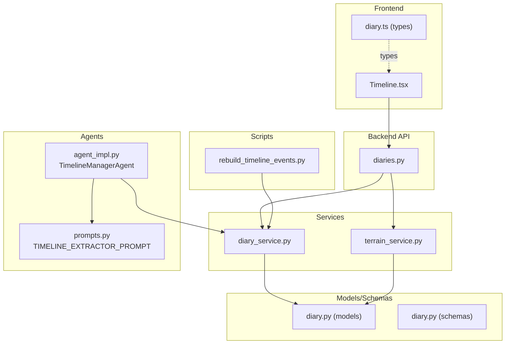

**Diagram sources**
- [Timeline.tsx:116-656](file://frontend/src/pages/timeline/Timeline.tsx#L116-L656)
- [diaries.py:271-352](file://backend/app/api/v1/diaries.py#L271-L352)
- [diary_service.py:281-637](file://backend/app/services/diary_service.py#L281-L637)
- [terrain_service.py:166-360](file://backend/app/services/terrain_service.py#L166-L360)
- [agent_impl.py:144-203](file://backend/app/agents/agent_impl.py#L144-L203)
- [prompts.py:33-57](file://backend/app/agents/prompts.py#L33-L57)
- [diary.py:67-186](file://backend/app/models/diary.py#L67-L186)
- [diary.py (schemas):75-101](file://backend/app/schemas/diary.py#L75-L101)
- [rebuild_timeline_events.py:19-59](file://backend/scripts/rebuild_timeline_events.py#L19-L59)
- [diary.ts (types):75-127](file://frontend/src/types/diary.ts#L75-L127)

**Section sources**
- [Timeline.tsx:116-656](file://frontend/src/pages/timeline/Timeline.tsx#L116-L656)
- [diaries.py:271-352](file://backend/app/api/v1/diaries.py#L271-L352)
- [diary_service.py:281-637](file://backend/app/services/diary_service.py#L281-L637)
- [terrain_service.py:166-360](file://backend/app/services/terrain_service.py#L166-L360)
- [agent_impl.py:144-203](file://backend/app/agents/agent_impl.py#L144-L203)
- [prompts.py:33-57](file://backend/app/agents/prompts.py#L33-L57)
- [diary.py:67-186](file://backend/app/models/diary.py#L67-L186)
- [diary.py (schemas):75-101](file://backend/app/schemas/diary.py#L75-L101)
- [rebuild_timeline_events.py:19-59](file://backend/scripts/rebuild_timeline_events.py#L19-L59)
- [diary.ts (types):75-127](file://frontend/src/types/diary.ts#L75-L127)

## Core Components
- Frontend Timeline Page
  - Renders a calendar grid with mood rings, trend chart with key-event markers, keyword cards, and selected-day details
  - Implements interactive navigation (month picker, day click, chart click)
  - Computes derived metrics (energy, valence, density) and highlights significant jumps
- Backend Timeline Service
  - Creates and updates timeline events from diary entries
  - Supports AI refinement of extracted events
  - Provides rebuilding for legacy data migration
- Backend Terrain Service
  - Aggregates events and diaries by day into energy/valence/density points
  - Detects peaks, valleys, and trends
- AI Event Extraction Agent
  - Uses a structured prompt to extract event_summary, emotion_tag, importance_score, event_type, and related entities
- Data Models and Schemas
  - TimelineEvent, Diary, GrowthDailyInsight define the persistence model
  - Pydantic schemas validate and serialize requests/responses

**Section sources**
- [Timeline.tsx:116-656](file://frontend/src/pages/timeline/Timeline.tsx#L116-L656)
- [diary_service.py:281-637](file://backend/app/services/diary_service.py#L281-L637)
- [terrain_service.py:166-360](file://backend/app/services/terrain_service.py#L166-L360)
- [agent_impl.py:144-203](file://backend/app/agents/agent_impl.py#L144-L203)
- [diary.py:67-186](file://backend/app/models/diary.py#L67-L186)
- [diary.py (schemas):75-101](file://backend/app/schemas/diary.py#L75-L101)

## Architecture Overview
The system follows a layered architecture:
- API layer exposes endpoints for timeline retrieval and terrain generation
- Service layer encapsulates business logic for event creation, aggregation, and rebuilding
- Agent layer performs AI-driven extraction from diary content
- Model layer persists timeline events and related entities
- Frontend consumes API endpoints and renders interactive visualizations

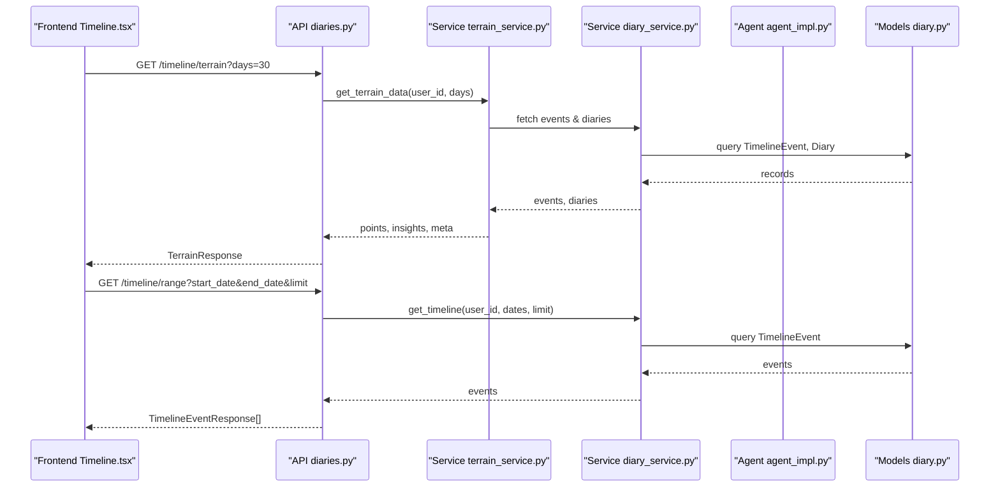

**Diagram sources**
- [diaries.py:271-352](file://backend/app/api/v1/diaries.py#L271-L352)
- [terrain_service.py:169-227](file://backend/app/services/terrain_service.py#L169-L227)
- [diary_service.py:524-569](file://backend/app/services/diary_service.py#L524-L569)
- [diary.py:67-186](file://backend/app/models/diary.py#L67-L186)
- [Timeline.tsx:128-145](file://frontend/src/pages/timeline/Timeline.tsx#L128-L145)

## Detailed Component Analysis

### Frontend Timeline Component
Responsibilities:
- Fetch terrain data and render:
  - Mood calendar grid with ring visuals (outer color: emotion, inner brightness: energy, ring width: density)
  - Energy trend chart with clickable dots and key-event markers
  - Keyword cards per SATIR layer (behavior, emotion, cognition, belief, desire)
  - Selected day details panel
- Interactive controls:
  - Month navigation
  - Window selection (7/30/90 days)
  - Hover tooltips with daily insights
  - Click-to-view-diary actions

Key computations:
- Energy: max importance_score per day
- Valence: average of mapped emotion valence per day
- Density: number of events or diaries per day
- Jump detection: highlight key events when energy jumps by ≥2 between consecutive days

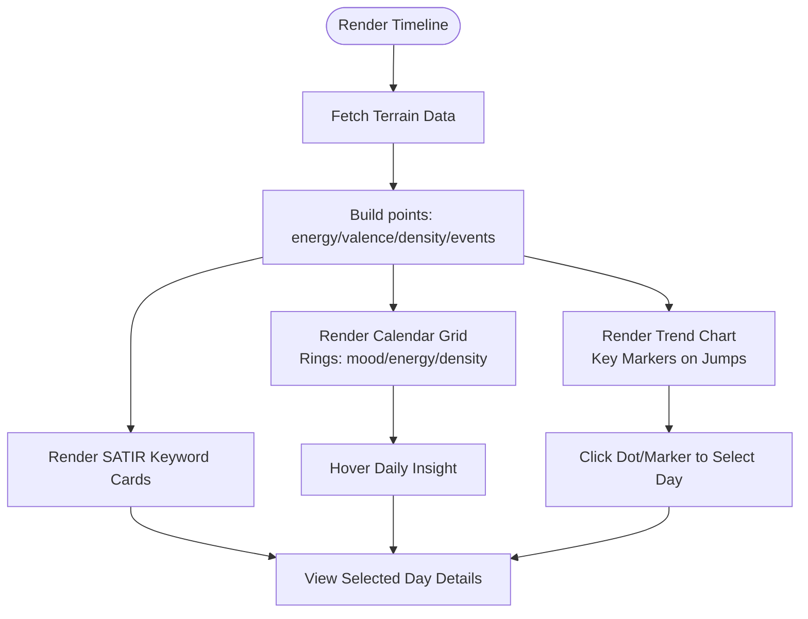

**Diagram sources**
- [Timeline.tsx:116-656](file://frontend/src/pages/timeline/Timeline.tsx#L116-L656)
- [diary.ts (types):75-127](file://frontend/src/types/diary.ts#L75-L127)

**Section sources**
- [Timeline.tsx:116-656](file://frontend/src/pages/timeline/Timeline.tsx#L116-L656)
- [diary.ts (types):75-127](file://frontend/src/types/diary.ts#L75-L127)

### Backend Event Extraction Service
Responsibilities:
- Create/update timeline events from diary entries (rule-based)
- AI refinement of events with structured JSON extraction
- Rebuilding events for a user within a date range (idempotent)
- Enforce cross-user isolation and prevent unauthorized writes

Rule-based extraction:
- Builds event payload from diary title/content/emotion_tags/importance_score
- Infers event_type from keywords
- Stores source metadata for traceability

AI refinement:
- Calls LLM with a structured prompt to improve summary, emotion_tag, importance_score, and event_type
- Preserves AI results unless forced overwrite

Rebuilding:
- Scans diaries within a date window and upserts events
- Returns statistics for audit

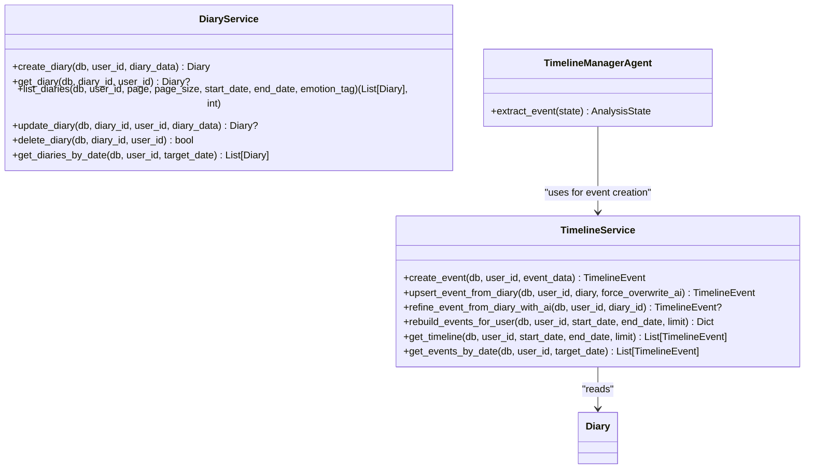

**Diagram sources**
- [diary_service.py:281-637](file://backend/app/services/diary_service.py#L281-L637)
- [agent_impl.py:144-203](file://backend/app/agents/agent_impl.py#L144-L203)

**Section sources**
- [diary_service.py:281-637](file://backend/app/services/diary_service.py#L281-L637)
- [agent_impl.py:144-203](file://backend/app/agents/agent_impl.py#L144-L203)
- [prompts.py:33-57](file://backend/app/agents/prompts.py#L33-L57)

### Backend Terrain Aggregation Service
Responsibilities:
- Aggregate timeline events and diaries by day
- Compute energy (max importance_score), valence (avg mapped emotion), density (count)
- Fallback to diary-derived metrics when no timeline events exist
- Detect peaks and valleys and compute trend

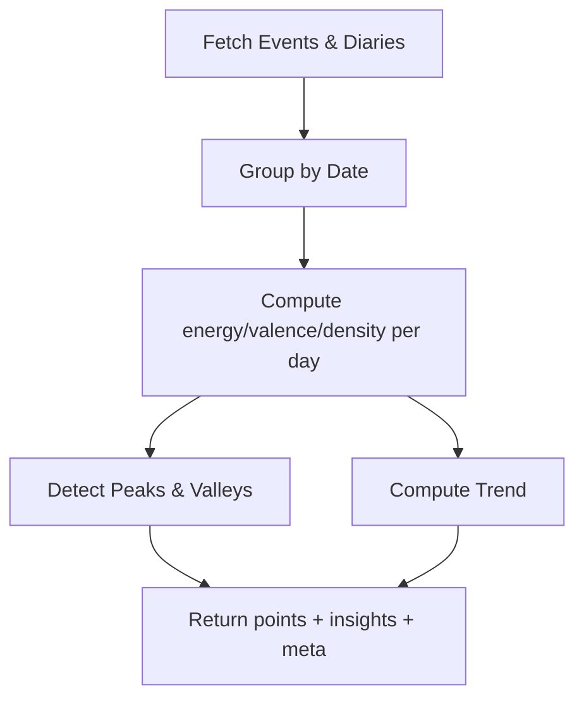

**Diagram sources**
- [terrain_service.py:169-227](file://backend/app/services/terrain_service.py#L169-L227)
- [terrain_service.py:266-355](file://backend/app/services/terrain_service.py#L266-L355)

**Section sources**
- [terrain_service.py:169-227](file://backend/app/services/terrain_service.py#L169-L227)
- [terrain_service.py:266-355](file://backend/app/services/terrain_service.py#L266-L355)

### Data Modeling for Timeline Events
Entities and relationships:
- TimelineEvent: stores event metadata, importance_score, emotion_tag, event_type, and related_entities
- Diary: user-owned journal entries with optional emotion_tags and importance_score
- GrowthDailyInsight: cached daily insights keyed by user and date

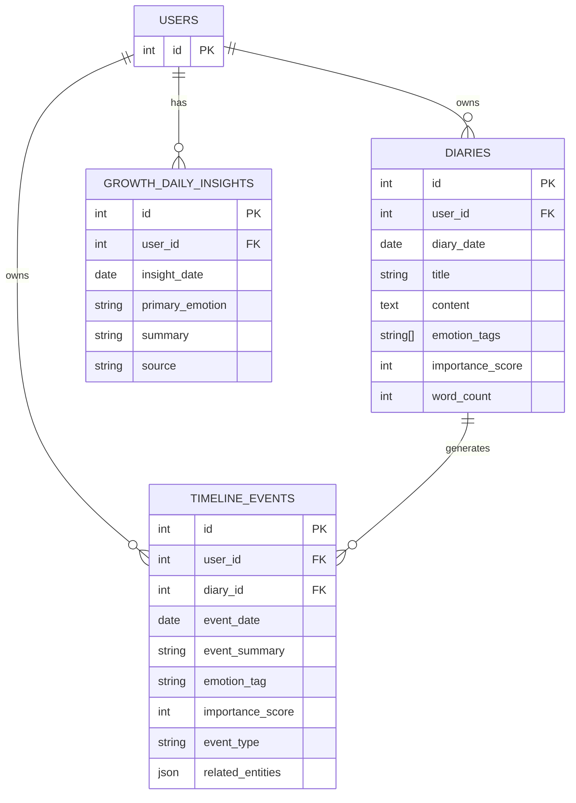

**Diagram sources**
- [diary.py:29-186](file://backend/app/models/diary.py#L29-L186)

**Section sources**
- [diary.py:29-186](file://backend/app/models/diary.py#L29-L186)

### API Endpoints for Timeline and Terrain
Endpoints:
- GET /timeline/range: Retrieve timeline events within a date range
- GET /timeline/date/{target_date}: Retrieve timeline events for a specific date
- POST /timeline/rebuild: Rebuild timeline events for a user within N days
- GET /timeline/terrain: Get terrain data (points, insights, meta)

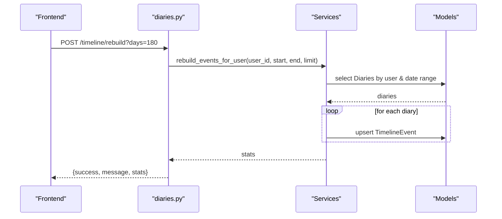

**Diagram sources**
- [diaries.py:311-333](file://backend/app/api/v1/diaries.py#L311-L333)
- [diary_service.py:490-522](file://backend/app/services/diary_service.py#L490-L522)

**Section sources**
- [diaries.py:271-352](file://backend/app/api/v1/diaries.py#L271-L352)
- [diaries.py:311-333](file://backend/app/api/v1/diaries.py#L311-L333)
- [diary_service.py:490-522](file://backend/app/services/diary_service.py#L490-L522)

### Rebuilding Script for Legacy Data Migration
Purpose:
- Rebuild timeline_events for a specific user or all active users
- Limit scan window and return processed counts

Usage:
- python3 scripts/rebuild_timeline_events.py --user-id 1 --days 365
- python3 scripts/rebuild_timeline_events.py --all --days 180

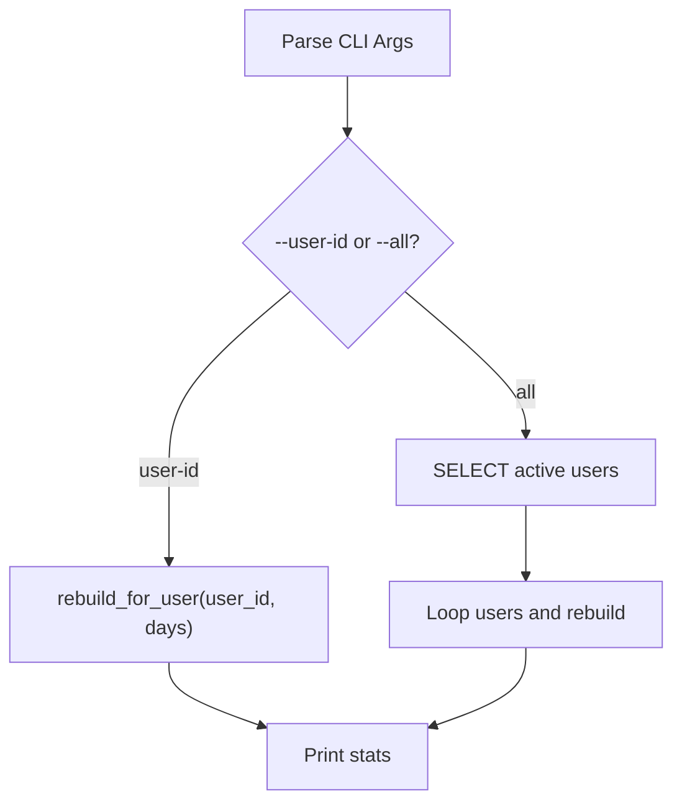

**Diagram sources**
- [rebuild_timeline_events.py:33-59](file://backend/scripts/rebuild_timeline_events.py#L33-L59)

**Section sources**
- [rebuild_timeline_events.py:19-59](file://backend/scripts/rebuild_timeline_events.py#L19-L59)

## Dependency Analysis
- Frontend depends on:
  - API endpoints for terrain and timeline data
  - Types for TerrainResponse, TerrainPoint, GrowthDailyInsight
- Backend services depend on:
  - SQLAlchemy models for queries and persistence
  - Agent prompts for structured extraction
  - External LLM client for AI refinement
- No circular dependencies observed between modules.

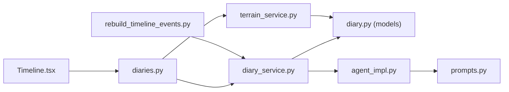

**Diagram sources**
- [Timeline.tsx:116-656](file://frontend/src/pages/timeline/Timeline.tsx#L116-L656)
- [diaries.py:271-352](file://backend/app/api/v1/diaries.py#L271-L352)
- [diary_service.py:281-637](file://backend/app/services/diary_service.py#L281-L637)
- [terrain_service.py:166-360](file://backend/app/services/terrain_service.py#L166-L360)
- [agent_impl.py:144-203](file://backend/app/agents/agent_impl.py#L144-L203)
- [prompts.py:33-57](file://backend/app/agents/prompts.py#L33-L57)
- [diary.py:67-186](file://backend/app/models/diary.py#L67-L186)
- [rebuild_timeline_events.py:19-59](file://backend/scripts/rebuild_timeline_events.py#L19-L59)

**Section sources**
- [Timeline.tsx:116-656](file://frontend/src/pages/timeline/Timeline.tsx#L116-L656)
- [diaries.py:271-352](file://backend/app/api/v1/diaries.py#L271-L352)
- [diary_service.py:281-637](file://backend/app/services/diary_service.py#L281-L637)
- [terrain_service.py:166-360](file://backend/app/services/terrain_service.py#L166-L360)
- [agent_impl.py:144-203](file://backend/app/agents/agent_impl.py#L144-L203)
- [prompts.py:33-57](file://backend/app/agents/prompts.py#L33-L57)
- [diary.py:67-186](file://backend/app/models/diary.py#L67-L186)
- [rebuild_timeline_events.py:19-59](file://backend/scripts/rebuild_timeline_events.py#L19-L59)

## Performance Considerations
- Frontend
  - Memoization of computed values (chart data, keyword lists) reduces re-renders
  - Lazy loading of daily insights prevents unnecessary API calls
  - Efficient calendar cell generation avoids DOM thrash
- Backend
  - Queries are scoped by user and date ranges to minimize scans
  - Rebuilding limits the number of processed diaries
  - Aggregation loops per day avoid heavy joins
- Recommendations
  - Add pagination for timeline/range endpoint when volume grows
  - Cache terrain aggregations for recent windows
  - Batch rebuild operations for many users

[No sources needed since this section provides general guidance]

## Troubleshooting Guide
Common issues and resolutions:
- No events shown in calendar
  - Ensure diaries exist for the selected period and that events were rebuilt
  - Trigger rebuild endpoint or run the rebuild script
- AI refinement errors
  - LLM parsing failures fall back to existing event; check logs for parsing exceptions
- Cross-user data leakage
  - TimelineService enforces user isolation; verify user_id is correct and diary_id belongs to the user
- Missing daily insights
  - Frontend sets a fallback message when insight fetch fails; retry or check backend processing

**Section sources**
- [diary_service.py:380-387](file://backend/app/services/diary_service.py#L380-L387)
- [diary_service.py:460-461](file://backend/app/services/diary_service.py#L460-L461)
- [diaries.py:311-333](file://backend/app/api/v1/diaries.py#L311-L333)
- [rebuild_timeline_events.py:43-54](file://backend/scripts/rebuild_timeline_events.py#L43-L54)
- [Timeline.tsx:204-218](file://frontend/src/pages/timeline/Timeline.tsx#L204-L218)

## Conclusion
Timeline Management delivers a robust pipeline from raw diary entries to interactive, insightful visualizations. The frontend presents a user-friendly calendar and trend chart, while the backend ensures reliable event extraction, aggregation, and trend analysis. The importance scoring and keyword analysis support reflective insights, and the rebuilding mechanisms enable smooth legacy migrations.

[No sources needed since this section summarizes without analyzing specific files]

## Appendices

### Automatic Event Extraction Workflow
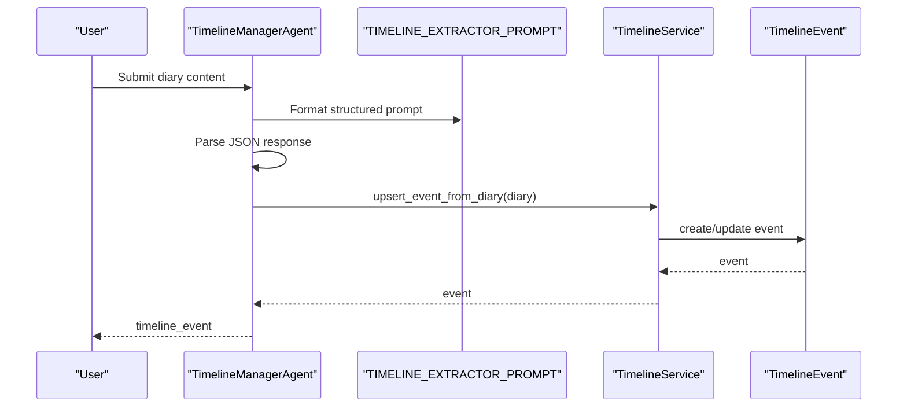

**Diagram sources**
- [agent_impl.py:144-203](file://backend/app/agents/agent_impl.py#L144-L203)
- [prompts.py:33-57](file://backend/app/agents/prompts.py#L33-L57)
- [diary_service.py:358-409](file://backend/app/services/diary_service.py#L358-L409)

**Section sources**
- [agent_impl.py:144-203](file://backend/app/agents/agent_impl.py#L144-L203)
- [prompts.py:33-57](file://backend/app/agents/prompts.py#L33-L57)
- [diary_service.py:358-409](file://backend/app/services/diary_service.py#L358-L409)

### Data Processing Pipeline: From Diary to Timeline
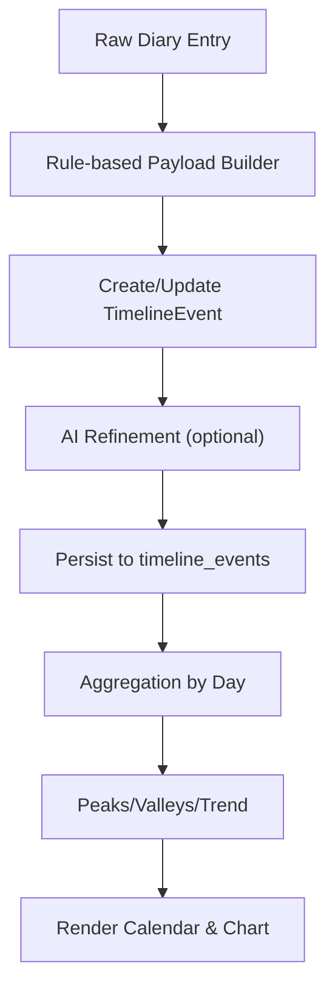

**Diagram sources**
- [diary_service.py:332-409](file://backend/app/services/diary_service.py#L332-L409)
- [diary_service.py:410-488](file://backend/app/services/diary_service.py#L410-L488)
- [terrain_service.py:266-355](file://backend/app/services/terrain_service.py#L266-L355)
- [Timeline.tsx:175-191](file://frontend/src/pages/timeline/Timeline.tsx#L175-L191)

**Section sources**
- [diary_service.py:332-409](file://backend/app/services/diary_service.py#L332-L409)
- [diary_service.py:410-488](file://backend/app/services/diary_service.py#L410-L488)
- [terrain_service.py:266-355](file://backend/app/services/terrain_service.py#L266-L355)
- [Timeline.tsx:175-191](file://frontend/src/pages/timeline/Timeline.tsx#L175-L191)