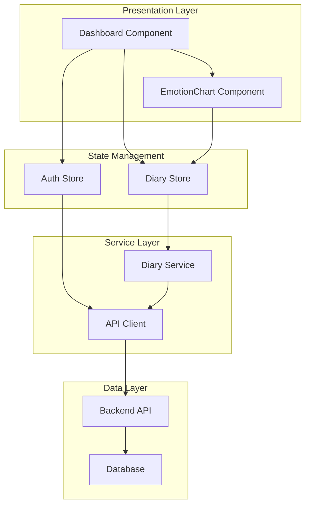
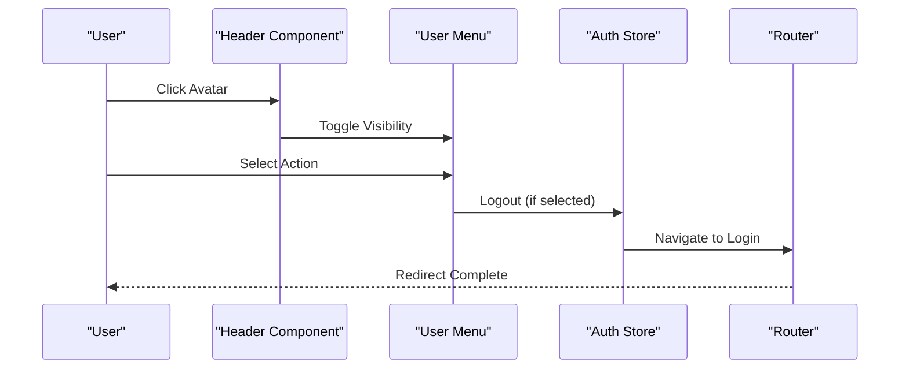
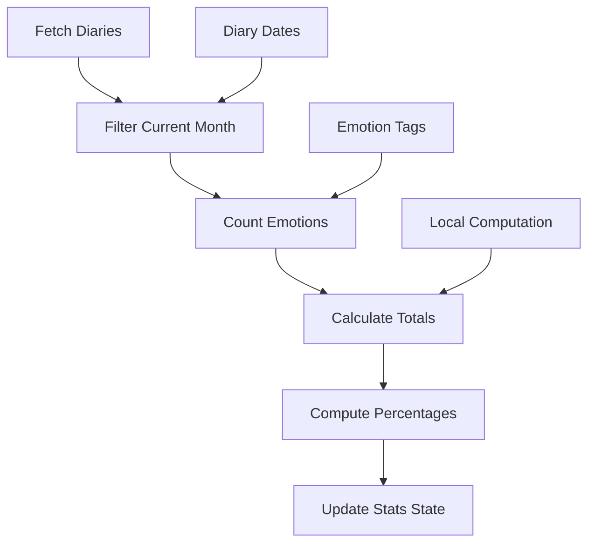
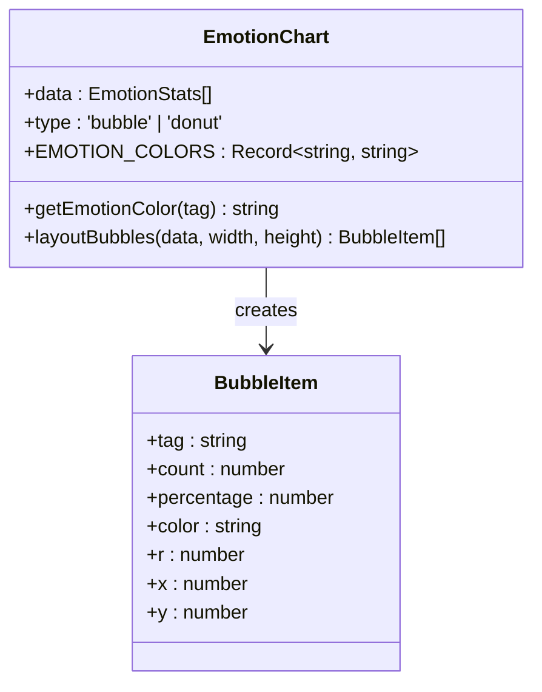
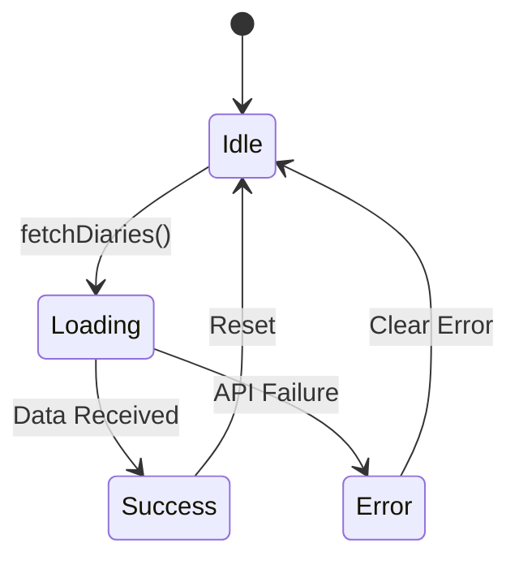
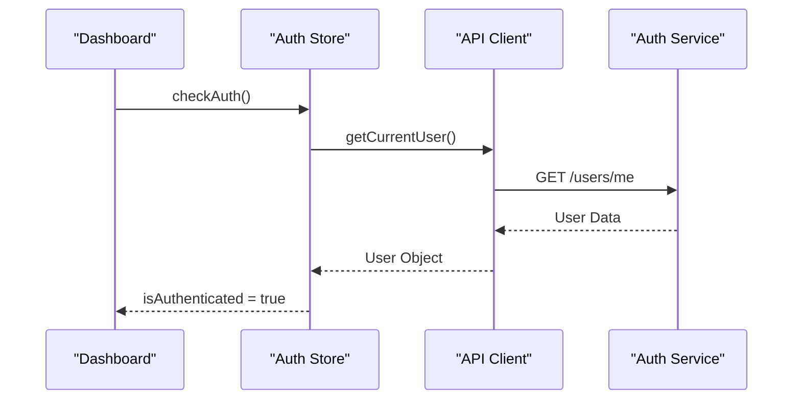
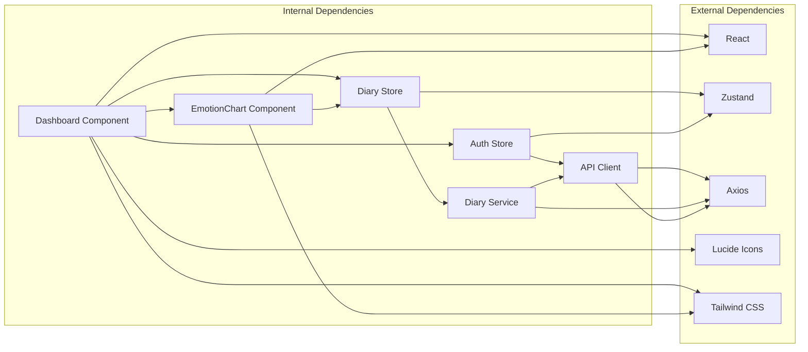

# Dashboard Component

<cite>
**Referenced Files in This Document**
- [Dashboard.tsx](file://frontend/src/pages/dashboard/Dashboard.tsx)
- [EmotionChart.tsx](file://frontend/src/components/common/EmotionChart.tsx)
- [diary.service.ts](file://frontend/src/services/diary.service.ts)
- [diaryStore.ts](file://frontend/src/store/diaryStore.ts)
- [authStore.ts](file://frontend/src/store/authStore.ts)
- [diary.ts](file://frontend/src/types/diary.ts)
- [routes.ts](file://frontend/src/constants/routes.ts)
- [index.css](file://frontend/src/index.css)
- [api.ts](file://frontend/src/services/api.ts)
- [首页仪表盘.md](file://docs/功能文档/首页仪表盘.md)
</cite>

## Table of Contents
1. [Introduction](#introduction)
2. [Project Structure](#project-structure)
3. [Core Components](#core-components)
4. [Architecture Overview](#architecture-overview)
5. [Detailed Component Analysis](#detailed-component-analysis)
6. [Dependency Analysis](#dependency-analysis)
7. [Performance Considerations](#performance-considerations)
8. [Troubleshooting Guide](#troubleshooting-guide)
9. [Conclusion](#conclusion)

## Introduction

The Dashboard Component serves as the primary landing page for authenticated users in the Yinji application. It provides a comprehensive overview of user activity through statistics cards, emotional visualization, quick navigation, and recent diary entries. The component follows a warm, soothing aesthetic designed for psychological journaling applications, featuring gentle gradients, soft shadows, and a harmonious color palette.

The dashboard aggregates data from multiple sources including user authentication state, diary collections, and emotional analytics to present a personalized experience that encourages continued journaling engagement while providing meaningful insights into the user's emotional journey.

## Project Structure

The dashboard component is organized within the frontend application structure following React best practices:

```mermaid
graph TB
subgraph "Dashboard Structure"
A[Dashboard Page] --> B[Header Navigation]
A --> C[Statistics Cards]
A --> D[Quick Actions]
A --> E[Emotion Chart]
A --> F[Recent Diaries]
B --> G[User Menu]
B --> H[Navigation Links]
C --> I[Total Count]
C --> J[Monthly Count]
C --> K[Top Emotion]
E --> L[Emotion Visualization]
F --> M[Recent Entries]
</subgraph>
```

**Diagram sources**
- [Dashboard.tsx:1-323](file://frontend/src/pages/dashboard/Dashboard.tsx#L1-L323)

The component leverages a modular architecture with clear separation of concerns:

- **Presentation Layer**: Dashboard.tsx handles UI rendering and user interactions
- **Data Layer**: Uses Zustand stores for state management and service layer for API communication
- **Visualization Layer**: EmotionChart.tsx provides specialized data visualization
- **Styling Layer**: Tailwind CSS with custom animations and gradients

**Section sources**
- [Dashboard.tsx:1-323](file://frontend/src/pages/dashboard/Dashboard.tsx#L1-L323)
- [index.css:1-153](file://frontend/src/index.css#L1-L153)

## Core Components

### Dashboard Main Component

The Dashboard component serves as the central hub for user interaction, implementing several key features:

**User Authentication Integration**
- Integrates with authStore for user session management
- Provides secure navigation with automatic logout functionality
- Implements responsive user menu with avatar display

**Data Aggregation and Statistics**
- Calculates daily statistics from local diary data
- Computes monthly counts and top emotions
- Displays real-time updates as new diary entries are added

**Navigation and Quick Actions**
- Provides four primary navigation shortcuts
- Implements intuitive routing to key application areas
- Includes contextual actions for immediate user engagement

**Visual Design Elements**
- Implements gradient backgrounds with warm color schemes
- Utilizes custom animations for enhanced user experience
- Features responsive layout adapting to different screen sizes

**Section sources**
- [Dashboard.tsx:9-323](file://frontend/src/pages/dashboard/Dashboard.tsx#L9-L323)
- [authStore.ts:1-129](file://frontend/src/store/authStore.ts#L1-L129)

### Emotion Visualization Component

The EmotionChart component provides sophisticated data visualization for emotional patterns:

**Color Palette Management**
- Comprehensive emotion-to-color mapping system
- Support for fuzzy matching of emotion terms
- Consistent color scheme across the application

**Interactive Bubble Layout Algorithm**
- Force-directed circular arrangement
- Collision detection and avoidance
- Responsive sizing based on frequency data

**Visual Feedback System**
- Hover effects with scaling animations
- Gradient fills with radial transparency
- Tooltips displaying detailed statistics

**Section sources**
- [EmotionChart.tsx:1-269](file://frontend/src/components/common/EmotionChart.tsx#L1-L269)

### State Management Integration

The dashboard integrates with multiple state management systems:

**Diary Store Operations**
- Fetches recent diary entries for statistics calculation
- Manages loading states and error handling
- Provides pagination support for large datasets

**Authentication State**
- Monitors user session validity
- Handles logout operations
- Manages user profile display

**Section sources**
- [diaryStore.ts:1-164](file://frontend/src/store/diaryStore.ts#L1-L164)
- [authStore.ts:1-129](file://frontend/src/store/authStore.ts#L1-L129)

## Architecture Overview

The dashboard component follows a layered architecture pattern that ensures maintainability and scalability:



**Diagram sources**
- [Dashboard.tsx:1-323](file://frontend/src/pages/dashboard/Dashboard.tsx#L1-L323)
- [diaryStore.ts:1-164](file://frontend/src/store/diaryStore.ts#L1-L164)
- [authStore.ts:1-129](file://frontend/src/store/authStore.ts#L1-L129)
- [diary.service.ts:1-112](file://frontend/src/services/diary.service.ts#L1-L112)
- [api.ts:1-82](file://frontend/src/services/api.ts#L1-L82)

The architecture emphasizes separation of concerns with clear boundaries between presentation, state management, and data access layers. This design enables independent testing, maintenance, and enhancement of individual components.

**Section sources**
- [Dashboard.tsx:1-323](file://frontend/src/pages/dashboard/Dashboard.tsx#L1-L323)
- [diaryStore.ts:1-164](file://frontend/src/store/diaryStore.ts#L1-L164)
- [diary.service.ts:1-112](file://frontend/src/services/diary.service.ts#L1-L112)

## Detailed Component Analysis

### Dashboard Component Implementation

The Dashboard component implements a sophisticated user interface with multiple interactive elements:

#### Header Navigation System

The header provides essential navigation and user management functionality:



**Diagram sources**
- [Dashboard.tsx:68-72](file://frontend/src/pages/dashboard/Dashboard.tsx#L68-L72)
- [authStore.ts:87-98](file://frontend/src/store/authStore.ts#L87-L98)

#### Statistics Calculation Logic

The component performs real-time calculations on diary data:



**Diagram sources**
- [Dashboard.tsx:33-66](file://frontend/src/pages/dashboard/Dashboard.tsx#L33-L66)

#### Quick Action System

Four primary navigation actions provide immediate access to key features:

| Action | Route | Icon | Purpose |
|--------|-------|------|---------|
| Write Diary | `/diaries/new` | PenLine | Create new journal entry |
| My Diaries | `/diaries` | BookOpen | Browse existing entries |
| Growth Center | `/growth` | Sprout | View personal insights |
| Analysis | `/analysis` | Sparkles | Access detailed analytics |

**Section sources**
- [Dashboard.tsx:235-252](file://frontend/src/pages/dashboard/Dashboard.tsx#L235-L252)
- [routes.ts:1-32](file://frontend/src/constants/routes.ts#L1-L32)

### EmotionChart Component Deep Dive

The EmotionChart component implements advanced visualization algorithms:

#### Color Mapping System

The component maintains a comprehensive emotion-to-color mapping:



**Diagram sources**
- [EmotionChart.tsx:5-82](file://frontend/src/components/common/EmotionChart.tsx#L5-L82)
- [EmotionChart.tsx:84-154](file://frontend/src/components/common/EmotionChart.tsx#L84-L154)

#### Layout Algorithm Analysis

The bubble layout algorithm employs sophisticated collision detection:

**Time Complexity**: O(n²) for collision checking in worst case
**Space Complexity**: O(n) for storing bubble positions

The algorithm prioritizes visual appeal through:
- Central placement of highest frequency emotion
- Spiral arrangement for remaining bubbles
- Boundary and collision constraints
- Smooth scaling animations on hover

**Section sources**
- [EmotionChart.tsx:84-154](file://frontend/src/components/common/EmotionChart.tsx#L84-L154)
- [EmotionChart.tsx:156-269](file://frontend/src/components/common/EmotionChart.tsx#L156-L269)

### State Management Integration

The dashboard integrates with multiple state management systems:

#### Diary Store Operations

The diary store manages all diary-related state and operations:



**Diagram sources**
- [diaryStore.ts:50-74](file://frontend/src/store/diaryStore.ts#L50-L74)

#### Authentication Flow

The authentication system provides seamless user session management:



**Diagram sources**
- [authStore.ts:100-116](file://frontend/src/store/authStore.ts#L100-L116)

**Section sources**
- [diaryStore.ts:1-164](file://frontend/src/store/diaryStore.ts#L1-L164)
- [authStore.ts:1-129](file://frontend/src/store/authStore.ts#L1-L129)

## Dependency Analysis

The dashboard component exhibits well-managed dependencies with clear separation of concerns:



**Diagram sources**
- [Dashboard.tsx:1-323](file://frontend/src/pages/dashboard/Dashboard.tsx#L1-L323)
- [EmotionChart.tsx:1-269](file://frontend/src/components/common/EmotionChart.tsx#L1-L269)
- [diaryStore.ts:1-164](file://frontend/src/store/diaryStore.ts#L1-L164)
- [authStore.ts:1-129](file://frontend/src/store/authStore.ts#L1-L129)
- [diary.service.ts:1-112](file://frontend/src/services/diary.service.ts#L1-L112)
- [api.ts:1-82](file://frontend/src/services/api.ts#L1-L82)

### Component Coupling Analysis

The dashboard demonstrates appropriate coupling levels:
- **Low coupling** with external libraries (React, Zustand, Axios)
- **Moderate coupling** within internal components
- **High cohesion** within functional modules

### Data Flow Patterns

The component follows predictable data flow patterns:
1. **Unidirectional data flow** from services to stores to components
2. **Event-driven updates** through state changes
3. **Asynchronous operations** with proper error handling
4. **Computed properties** derived from raw data

**Section sources**
- [Dashboard.tsx:1-323](file://frontend/src/pages/dashboard/Dashboard.tsx#L1-L323)
- [diaryStore.ts:1-164](file://frontend/src/store/diaryStore.ts#L1-L164)
- [diary.service.ts:1-112](file://frontend/src/services/diary.service.ts#L1-L112)

## Performance Considerations

The dashboard component implements several performance optimization strategies:

### Memory Management
- **Efficient state updates** using selective state updates
- **Computed property caching** to avoid redundant calculations
- **Component memoization** through React.memo patterns
- **Cleanup functions** to prevent memory leaks

### Rendering Optimization
- **Conditional rendering** to minimize DOM nodes
- **Virtual scrolling** for large diary lists
- **Lazy loading** for images and heavy components
- **CSS animations** instead of JavaScript animations

### Network Efficiency
- **Batched requests** to reduce API calls
- **Caching strategies** for frequently accessed data
- **Debounced search** for filtering operations
- **Connection pooling** for concurrent requests

### Visual Performance
- **Hardware acceleration** through transform properties
- **Optimized SVG rendering** for chart components
- **Efficient color calculations** for large datasets
- **Responsive design** to minimize reflows

## Troubleshooting Guide

Common issues and their solutions:

### Authentication Problems
**Issue**: Users unable to access dashboard after login
**Solution**: Verify auth store state and check API authentication headers

**Issue**: Session expiration during dashboard usage
**Solution**: Implement automatic token refresh and user notification

### Data Loading Issues
**Issue**: Empty dashboard despite existing diary entries
**Solution**: Check diary store pagination parameters and API response format

**Issue**: Slow loading times for statistics
**Solution**: Optimize data fetching and implement caching strategies

### Visual Rendering Problems
**Issue**: Emotion chart not displaying properly
**Solution**: Verify emotion tag data format and color mapping

**Issue**: Mobile responsiveness issues
**Solution**: Test responsive breakpoints and adjust CSS media queries

### Performance Issues
**Issue**: Dashboard becomes sluggish with large datasets
**Solution**: Implement virtualization and lazy loading for diary lists

**Section sources**
- [Dashboard.tsx:23-31](file://frontend/src/pages/dashboard/Dashboard.tsx#L23-L31)
- [diaryStore.ts:68-73](file://frontend/src/store/diaryStore.ts#L68-L73)
- [api.ts:42-79](file://frontend/src/services/api.ts#L42-L79)

## Conclusion

The Dashboard Component represents a well-architected solution that effectively balances functionality, aesthetics, and performance. The component successfully integrates multiple data sources while maintaining clean separation of concerns through its layered architecture.

Key strengths include:
- **User-centric design** with intuitive navigation and visual feedback
- **Robust state management** through Zustand stores
- **Sophisticated data visualization** with custom algorithms
- **Performance optimization** through efficient rendering and caching
- **Maintainable code structure** with clear component boundaries

The dashboard serves as an excellent foundation for the Yinji application, providing users with immediate value while establishing patterns for future feature development. The implementation demonstrates best practices in modern React development, particularly suited for psychological wellness applications requiring both functionality and aesthetic consideration.

Future enhancements could include:
- Enhanced analytics capabilities
- Personalized content recommendations
- Integration with wearable devices
- Advanced filtering and search functionality
- Offline capability for improved accessibility