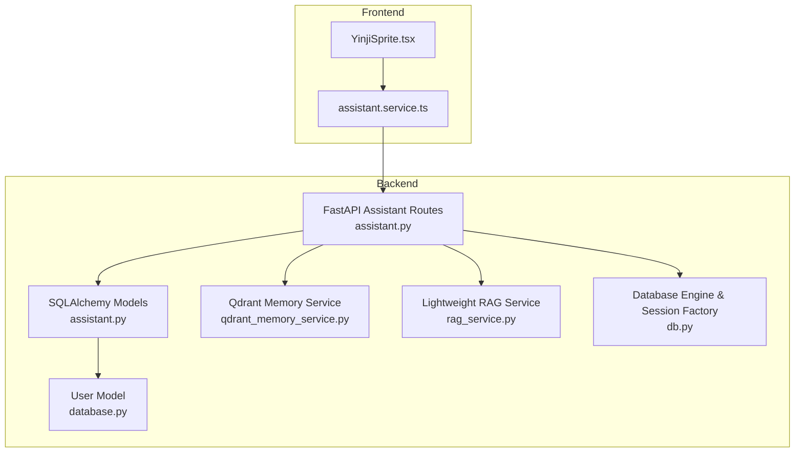
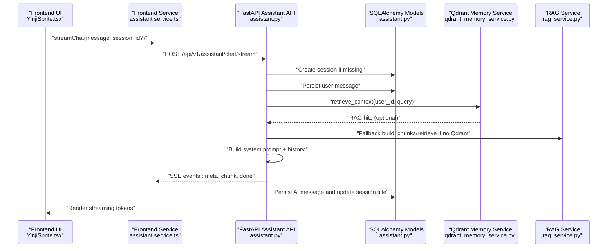
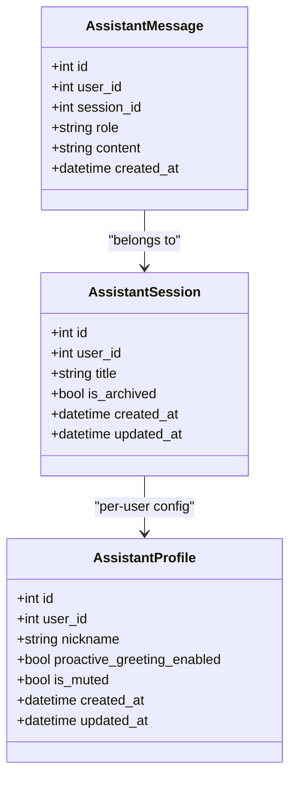
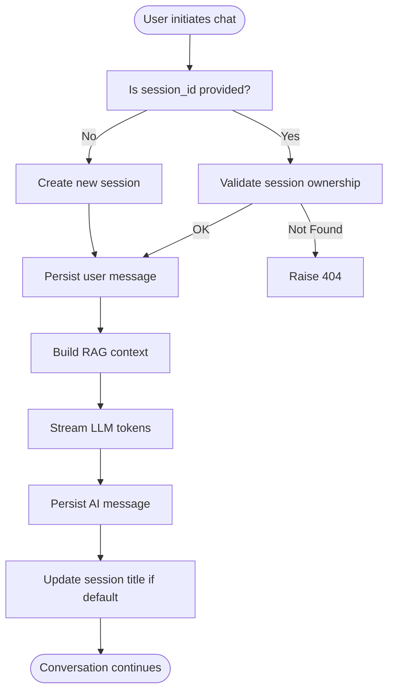
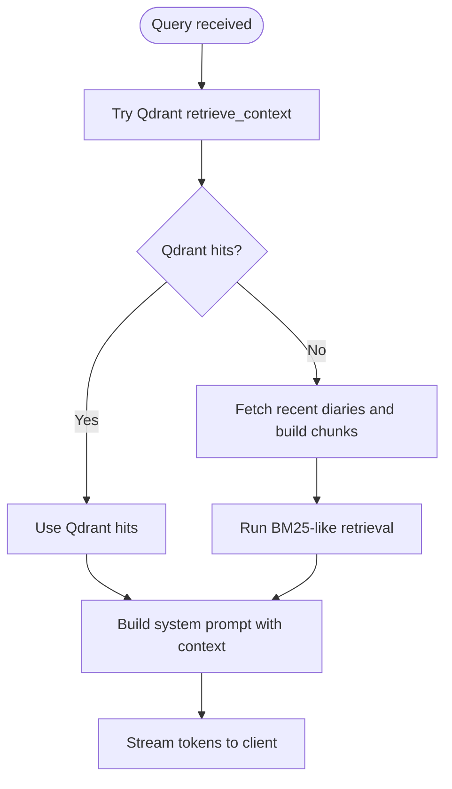
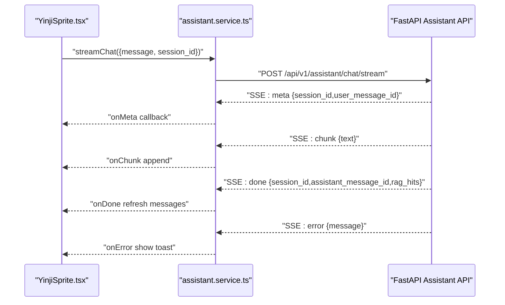
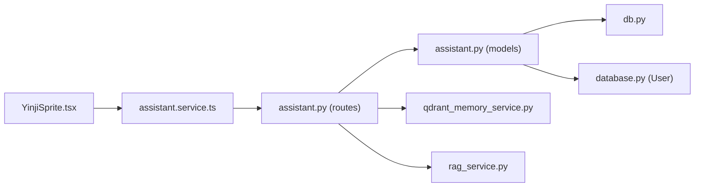

# Assistant Models

<cite>
**Referenced Files in This Document**
- [assistant.py](file://backend/app/models/assistant.py)
- [assistant.py](file://backend/app/api/v1/assistant.py)
- [assistant.service.ts](file://frontend/src/services/assistant.service.ts)
- [YinjiSprite.tsx](file://frontend/src/components/assistant/YinjiSprite.tsx)
- [qdrant_memory_service.py](file://backend/app/services/qdrant_memory_service.py)
- [rag_service.py](file://backend/app/services/rag_service.py)
- [db.py](file://backend/app/db.py)
- [database.py](file://backend/app/models/database.py)
- [AI助手对话功能.md](file://docs/功能文档/AI助手对话功能.md)
</cite>

## Table of Contents
1. [Introduction](#introduction)
2. [Project Structure](#project-structure)
3. [Core Components](#core-components)
4. [Architecture Overview](#architecture-overview)
5. [Detailed Component Analysis](#detailed-component-analysis)
6. [Dependency Analysis](#dependency-analysis)
7. [Performance Considerations](#performance-considerations)
8. [Troubleshooting Guide](#troubleshooting-guide)
9. [Conclusion](#conclusion)
10. [Appendices](#appendices)

## Introduction
This document provides comprehensive documentation for the assistant-related models and systems in the project, focusing on:
- AssistantSession: manages AI chat interactions, session persistence, and context management
- AssistantMessage: stores conversation history, user inputs, and AI responses
- AssistantProfile: user-level configuration for the AI companion
- Conversation tracking and lifecycle management
- Memory handling and RAG-based context retrieval
- Session creation, message exchange patterns, and conversation continuation
- Data retention policies, session timeout handling, and privacy considerations

The documentation synthesizes backend SQLAlchemy models, FastAPI endpoints, frontend integration, and supporting services to explain how conversations are persisted, streamed, and contextualized.

## Project Structure
The assistant functionality spans backend models and APIs, frontend UI integration, and supporting services for memory retrieval and RAG.

**Diagram sources**
- [assistant.py:13-78](file://backend/app/models/assistant.py#L13-L78)
- [assistant.py:1-389](file://backend/app/api/v1/assistant.py#L1-L389)
- [qdrant_memory_service.py:1-190](file://backend/app/services/qdrant_memory_service.py#L1-L190)
- [rag_service.py:1-360](file://backend/app/services/rag_service.py#L1-L360)
- [db.py:1-59](file://backend/app/db.py#L1-L59)
- [database.py:1-70](file://backend/app/models/database.py#L1-L70)
- [assistant.service.ts:1-128](file://frontend/src/services/assistant.service.ts#L1-L128)
- [YinjiSprite.tsx:1-545](file://frontend/src/components/assistant/YinjiSprite.tsx#L1-L545)

**Section sources**
- [assistant.py:1-78](file://backend/app/models/assistant.py#L1-L78)
- [assistant.py:1-389](file://backend/app/api/v1/assistant.py#L1-L389)
- [assistant.service.ts:1-128](file://frontend/src/services/assistant.service.ts#L1-L128)
- [YinjiSprite.tsx:1-545](file://frontend/src/components/assistant/YinjiSprite.tsx#L1-L545)
- [qdrant_memory_service.py:1-190](file://backend/app/services/qdrant_memory_service.py#L1-L190)
- [rag_service.py:1-360](file://backend/app/services/rag_service.py#L1-L360)
- [db.py:1-59](file://backend/app/db.py#L1-L59)
- [database.py:1-70](file://backend/app/models/database.py#L1-L70)

## Core Components
- AssistantProfile: user-level configuration for the AI companion, including nickname, proactive greeting flag, and mute state.
- AssistantSession: a conversation container with title, archival flag, and timestamps.
- AssistantMessage: individual turn in a session, including role (user/assistant/system), content, and timestamps.

These models define the conversation storage layer and enable session lifecycle operations (list, create, archive, clear, list messages).

**Section sources**
- [assistant.py:13-78](file://backend/app/models/assistant.py#L13-L78)

## Architecture Overview
The assistant system integrates frontend UI with backend APIs and services:
- Frontend triggers streaming chat via assistant.service.ts
- Backend FastAPI endpoint validates user, creates or selects a session, persists user message, builds RAG context, streams LLM tokens, and persists AI response
- Memory retrieval uses Qdrant for semantic search with a fallback to local lightweight RAG
- Database sessions are managed via SQLAlchemy async engine and session factory

**Diagram sources**
- [assistant.py:277-387](file://backend/app/api/v1/assistant.py#L277-L387)
- [assistant.py:36-78](file://backend/app/models/assistant.py#L36-L78)
- [qdrant_memory_service.py:175-186](file://backend/app/services/qdrant_memory_service.py#L175-L186)
- [rag_service.py:210-317](file://backend/app/services/rag_service.py#L210-L317)
- [assistant.service.ts:69-125](file://frontend/src/services/assistant.service.ts#L69-L125)
- [YinjiSprite.tsx:281-335](file://frontend/src/components/assistant/YinjiSprite.tsx#L281-L335)

## Detailed Component Analysis

### AssistantSession Model
AssistantSession encapsulates a conversation thread:
- Links to a user via foreign key
- Tracks title, archival flag, and timestamps
- Supports listing, creating, archiving, and clearing messages

Key behaviors:
- Creation sets title from initial user message if not provided
- Archiving toggles is_archived flag
- Clearing deletes all messages for the session

**Diagram sources**
- [assistant.py:36-78](file://backend/app/models/assistant.py#L36-L78)

**Section sources**
- [assistant.py:36-54](file://backend/app/models/assistant.py#L36-L54)
- [assistant.py:184-218](file://backend/app/api/v1/assistant.py#L184-L218)

### AssistantMessage Model
AssistantMessage stores individual turns:
- role indicates speaker (user/assistant/system)
- content holds the text
- timestamps support ordering and history retrieval

Processing logic:
- On chat, user message is persisted before streaming AI response
- AI response is persisted after completion
- History is limited to recent turns for context building

**Section sources**
- [assistant.py:57-77](file://backend/app/models/assistant.py#L57-L77)
- [assistant.py:303-374](file://backend/app/api/v1/assistant.py#L303-L374)

### AssistantProfile Model
AssistantProfile stores user-level preferences:
- nickname: user’s preferred name used in prompts
- proactive_greeting_enabled: product requirement to disable proactive greetings
- is_muted: mute state for the assistant
- initialized: derived from whether nickname is set

Operations:
- GET/PUT endpoints manage profile state
- Profile is lazily created on first access

**Section sources**
- [assistant.py:13-33](file://backend/app/models/assistant.py#L13-L33)
- [assistant.py:122-157](file://backend/app/api/v1/assistant.py#L122-L157)
- [assistant.py:69-78](file://backend/app/api/v1/assistant.py#L69-L78)

### Conversation Lifecycle Management
- Session creation: explicit POST or implicit on first chat
- Listing sessions: GET with pagination and filtering by user and archived flag
- Archiving: DELETE toggles is_archived
- Clearing messages: POST clears all messages for a session
- Retrieving messages: GET lists ordered by creation time

**Diagram sources**
- [assistant.py:277-387](file://backend/app/api/v1/assistant.py#L277-L387)

**Section sources**
- [assistant.py:160-274](file://backend/app/api/v1/assistant.py#L160-L274)

### Memory Handling and Context Retrieval
- Qdrant-based semantic search: retrieves diary fragments relevant to the query
- Fallback lightweight RAG: chunks and scores diary entries when Qdrant is unavailable
- Context injection: RAG hits are included in the system prompt to inform AI responses

**Diagram sources**
- [assistant.py:85-119](file://backend/app/api/v1/assistant.py#L85-L119)
- [qdrant_memory_service.py:175-186](file://backend/app/services/qdrant_memory_service.py#L175-L186)
- [rag_service.py:147-317](file://backend/app/services/rag_service.py#L147-L317)

**Section sources**
- [assistant.py:85-119](file://backend/app/api/v1/assistant.py#L85-L119)
- [qdrant_memory_service.py:1-190](file://backend/app/services/qdrant_memory_service.py#L1-L190)
- [rag_service.py:1-360](file://backend/app/services/rag_service.py#L1-L360)

### Frontend Integration
- assistant.service.ts handles SSE parsing and exposes callbacks for meta, chunk, done, and error
- YinjiSprite.tsx manages UI state, session switching, message rendering, and streaming updates
- The UI supports muting, session creation/clearing/deletion, and dynamic positioning

**Diagram sources**
- [assistant.service.ts:69-125](file://frontend/src/services/assistant.service.ts#L69-L125)
- [YinjiSprite.tsx:281-335](file://frontend/src/components/assistant/YinjiSprite.tsx#L281-L335)
- [assistant.py:343-387](file://backend/app/api/v1/assistant.py#L343-L387)

**Section sources**
- [assistant.service.ts:1-128](file://frontend/src/services/assistant.service.ts#L1-L128)
- [YinjiSprite.tsx:1-545](file://frontend/src/components/assistant/YinjiSprite.tsx#L1-L545)

## Dependency Analysis
- Models depend on SQLAlchemy declarative base and foreign keys to User and AssistantSession
- API routes depend on database sessions, assistant models, and memory services
- Frontend depends on assistant service for SSE and UI state management
- Memory services depend on Qdrant configuration and local RAG service

**Diagram sources**
- [assistant.py:1-389](file://backend/app/api/v1/assistant.py#L1-L389)
- [assistant.py:1-78](file://backend/app/models/assistant.py#L1-L78)
- [db.py:1-59](file://backend/app/db.py#L1-L59)
- [database.py:1-70](file://backend/app/models/database.py#L1-L70)
- [assistant.service.ts:1-128](file://frontend/src/services/assistant.service.ts#L1-L128)
- [YinjiSprite.tsx:1-545](file://frontend/src/components/assistant/YinjiSprite.tsx#L1-L545)
- [qdrant_memory_service.py:1-190](file://backend/app/services/qdrant_memory_service.py#L1-L190)
- [rag_service.py:1-360](file://backend/app/services/rag_service.py#L1-L360)

**Section sources**
- [assistant.py:1-78](file://backend/app/models/assistant.py#L1-L78)
- [assistant.py:1-389](file://backend/app/api/v1/assistant.py#L1-L389)
- [db.py:1-59](file://backend/app/db.py#L1-L59)
- [database.py:1-70](file://backend/app/models/database.py#L1-L70)
- [assistant.service.ts:1-128](file://frontend/src/services/assistant.service.ts#L1-L128)
- [YinjiSprite.tsx:1-545](file://frontend/src/components/assistant/YinjiSprite.tsx#L1-L545)
- [qdrant_memory_service.py:1-190](file://backend/app/services/qdrant_memory_service.py#L1-L190)
- [rag_service.py:1-360](file://backend/app/services/rag_service.py#L1-L360)

## Performance Considerations
- Streaming responses reduce perceived latency and improve UX
- Limiting recent history and RAG hits reduces prompt size and cost
- Qdrant retrieval is prioritized; fallback RAG ensures availability when external services are down
- Database operations are batched (persist user message, stream tokens, persist AI message) to minimize round trips

[No sources needed since this section provides general guidance]

## Troubleshooting Guide
Common issues and resolutions:
- Session not found: Ensure session_id belongs to the current user; API raises 404 otherwise
- Empty or missing messages: Verify session_id is set or allow automatic creation on first message
- Streaming errors: Check SSE event parsing and network connectivity; frontend displays error callbacks
- Qdrant unavailability: Fallback RAG service will still provide context from recent diaries
- Profile initialization: First-time users receive a one-time initialization dialog to set nickname

**Section sources**
- [assistant.py:202-218](file://backend/app/api/v1/assistant.py#L202-L218)
- [assistant.py:221-274](file://backend/app/api/v1/assistant.py#L221-L274)
- [assistant.py:277-387](file://backend/app/api/v1/assistant.py#L277-L387)
- [assistant.service.ts:69-125](file://frontend/src/services/assistant.service.ts#L69-L125)
- [YinjiSprite.tsx:281-335](file://frontend/src/components/assistant/YinjiSprite.tsx#L281-L335)

## Conclusion
The assistant models and services provide a robust foundation for AI-powered emotional companionship:
- AssistantSession and AssistantMessage form a durable conversation store
- AssistantProfile enables personalized interactions
- Streaming chat with RAG-enhanced context ensures meaningful, grounded responses
- Frontend integration delivers a responsive, persistent chat experience

[No sources needed since this section summarizes without analyzing specific files]

## Appendices

### API Definitions
- GET /api/v1/assistant/profile: Retrieve assistant profile
- PUT /api/v1/assistant/profile: Update assistant profile
- GET /api/v1/assistant/sessions: List sessions (limit 1–100)
- POST /api/v1/assistant/sessions: Create a new session
- DELETE /api/v1/assistant/sessions/{session_id}: Archive a session
- GET /api/v1/assistant/sessions/{session_id}/messages: List messages in a session
- POST /api/v1/assistant/sessions/{session_id}/clear: Clear messages in a session
- POST /api/v1/assistant/chat/stream: Stream chat with SSE

**Section sources**
- [assistant.py:122-387](file://backend/app/api/v1/assistant.py#L122-L387)

### Data Retention and Privacy Notes
- Sessions and messages are stored per-user and are not shared
- Product requirement disables proactive greetings and allows muting
- No explicit session timeout handling is implemented in the backend; sessions remain until archived or cleared by the user
- RAG context retrieval is scoped to the authenticated user’s data

**Section sources**
- [assistant.py:146-147](file://backend/app/api/v1/assistant.py#L146-L147)
- [AI助手对话功能.md:66-133](file://docs/功能文档/AI助手对话功能.md#L66-L133)