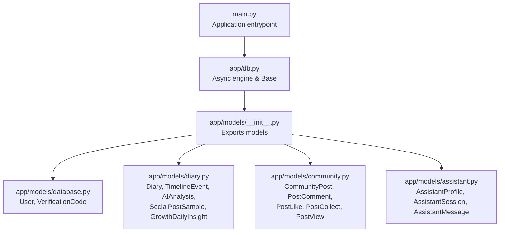
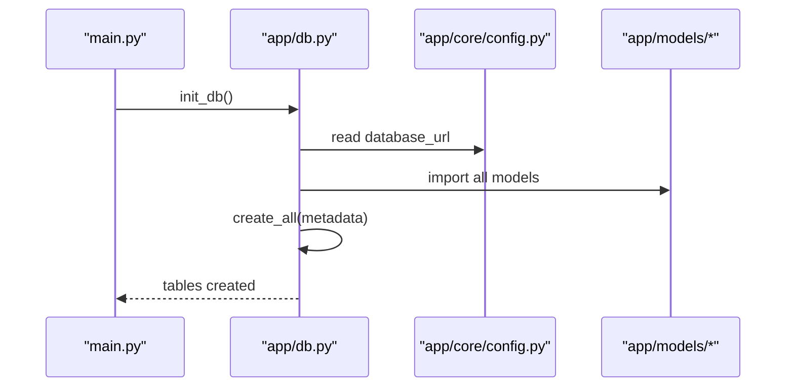

# Backend Database Models

<cite>
**Referenced Files in This Document**
- [main.py](file://backend/main.py)
- [db.py](file://backend/app/db.py)
- [config.py](file://backend/app/core/config.py)
- [models/__init__.py](file://backend/app/models/__init__.py)
- [models/database.py](file://backend/app/models/database.py)
- [models/diary.py](file://backend/app/models/diary.py)
- [models/community.py](file://backend/app/models/community.py)
- [models/assistant.py](file://backend/app/models/assistant.py)
- [migrate_add_profile_fields.py](file://backend/migrate_add_profile_fields.py)
- [scripts/rebuild_timeline_events.py](file://backend/scripts/rebuild_timeline_events.py)
</cite>

## Table of Contents
1. [Introduction](#introduction)
2. [Project Structure](#project-structure)
3. [Core Components](#core-components)
4. [Architecture Overview](#architecture-overview)
5. [Detailed Component Analysis](#detailed-component-analysis)
6. [Dependency Analysis](#dependency-analysis)
7. [Performance Considerations](#performance-considerations)
8. [Troubleshooting Guide](#troubleshooting-guide)
9. [Conclusion](#conclusion)
10. [Appendices](#appendices)

## Introduction
This document provides comprehensive data model documentation for the backend database models built with SQLAlchemy ORM. It covers the User, VerificationCode, Diary, TimelineEvent, AIAnalysis, CommunityPost, and AssistantSession entities, detailing field definitions, data types, constraints, indexes, and relationships. It also explains primary keys, foreign keys, cascading behaviors, model lifecycle management, and schema evolution strategies.

## Project Structure
The database models are organized under the backend application’s models package and are registered during application startup. The asynchronous SQLAlchemy setup uses an async engine and session factory, and all models inherit from a shared declarative base.



**Diagram sources**
- [main.py:19-40](file://backend/main.py#L19-L40)
- [db.py:26-58](file://backend/app/db.py#L26-L58)
- [models/__init__.py:4-7](file://backend/app/models/__init__.py#L4-L7)

**Section sources**
- [main.py:19-40](file://backend/main.py#L19-L40)
- [db.py:12-28](file://backend/app/db.py#L12-L28)
- [models/__init__.py:4-7](file://backend/app/models/__init__.py#L4-L7)

## Core Components
This section documents the core entities and their attributes, constraints, indexes, and relationships.

- User
  - Table: users
  - Fields: id (PK, autoincrement), email (unique, indexed), password_hash, username, avatar_url, mbti, social_style, current_state, catchphrases (JSON, default empty list), is_active (default True), is_verified (default False), created_at (timezone-aware, server_default now), updated_at (timezone-aware, server_default now, onupdate now)
  - Indexes: email
  - Notes: Catchphrases stored as JSON array; timestamps managed by server defaults and onupdate triggers.

- VerificationCode
  - Table: verification_codes
  - Fields: id (PK, autoincrement), email (indexed), code (6 chars), type ('register' or 'login'), expires_at (timezone-aware), used (default False), created_at (timezone-aware, server_default now)
  - Indexes: email
  - Notes: Expiry enforced via expires_at; used flag indicates consumption.

- Diary
  - Table: diaries
  - Fields: id (PK, autoincrement), user_id (FK users.id, CASCADE), title, content (not null), content_html, diary_date (date, indexed), emotion_tags (JSON via StringListJSON), importance_score (default 5), word_count (default 0), images (JSON via StringListJSON), is_analyzed (default False), created_at (timezone-aware, server_default now), updated_at (timezone-aware, server_default now, onupdate now)
  - Indexes: user_id, diary_date
  - Constraints: user_id FK with CASCADE on delete
  - Notes: StringListJSON ensures list normalization for emotion_tags and images.

- TimelineEvent
  - Table: timeline_events
  - Fields: id (PK, autoincrement), user_id (FK users.id, CASCADE), diary_id (FK diaries.id, SET NULL), event_date (date, indexed), event_summary, emotion_tag (indexed), importance_score (default 5), event_type, related_entities (JSON), created_at (timezone-aware, server_default now)
  - Indexes: user_id, event_date, emotion_tag
  - Constraints: user_id FK CASCADE; diary_id FK SET NULL
  - Notes: Relationship to Diary is optional; SET NULL preserves timeline integrity when a diary is deleted.

- AIAnalysis
  - Table: ai_analyses
  - Fields: id (PK, autoincrement), user_id (FK users.id, CASCADE), diary_id (FK diaries.id, CASCADE, unique), result_json (JSON, not null), created_at (timezone-aware, server_default now), updated_at (timezone-aware, server_default now, onupdate now)
  - Indexes: user_id, diary_id
  - Constraints: user_id FK CASCADE; diary_id FK CASCADE; unique constraint on diary_id
  - Notes: Stores latest AI analysis per diary; unique diary_id ensures single result per diary.

- CommunityPost
  - Table: community_posts
  - Fields: id (PK, autoincrement), user_id (FK users.id, CASCADE, indexed), circle_id (indexed), content (text, not null), images (JSON, default empty list), is_anonymous (default False), like_count (default 0), comment_count (default 0), collect_count (default 0), is_deleted (default False), created_at (timezone-aware, server_default now), updated_at (timezone-aware, server_default now, onupdate now)
  - Indexes: user_id, circle_id
  - Notes: Supports anonymous posts; counters maintained at the post level.

- AssistantSession
  - Table: assistant_sessions
  - Fields: id (PK, autoincrement), user_id (FK users.id, CASCADE, indexed), title, is_archived (default False), created_at (timezone-aware, server_default now), updated_at (timezone-aware, server_default now, onupdate now)
  - Indexes: user_id
  - Notes: Sessions belong to users; archived sessions can be filtered as needed.

**Section sources**
- [models/database.py:13-44](file://backend/app/models/database.py#L13-L44)
- [models/database.py:47-69](file://backend/app/models/database.py#L47-L69)
- [models/diary.py:29-64](file://backend/app/models/diary.py#L29-L64)
- [models/diary.py:67-99](file://backend/app/models/diary.py#L67-L99)
- [models/diary.py:102-132](file://backend/app/models/diary.py#L102-L132)
- [models/community.py:23-57](file://backend/app/models/community.py#L23-L57)
- [models/assistant.py:36-54](file://backend/app/models/assistant.py#L36-L54)

## Architecture Overview
The models share a common declarative base and are created at application startup. Foreign keys enforce referential integrity with cascading behaviors aligned to product requirements (e.g., user deletion cascades to dependent records).

```mermaid
erDiagram
USERS {
int id PK
string email UK
string password_hash
string username
string avatar_url
string mbti
string social_style
string current_state
json catchphrases
boolean is_active
boolean is_verified
timestamptz created_at
timestamptz updated_at
}
VERIFICATION_CODES {
int id PK
string email
string code
string type
timestamptz expires_at
boolean used
timestamptz created_at
}
DIARIES {
int id PK
int user_id FK
string title
text content
text content_html
date diary_date
json emotion_tags
int importance_score
int word_count
json images
boolean is_analyzed
timestamptz created_at
timestamptz updated_at
}
TIMELINE_EVENTS {
int id PK
int user_id FK
int diary_id FK
date event_date
string event_summary
string emotion_tag
int importance_score
string event_type
json related_entities
timestamptz created_at
}
AI_ANALYSES {
int id PK
int user_id FK
int diary_id FK UK
json result_json
timestamptz created_at
timestamptz updated_at
}
COMMUNITY_POSTS {
int id PK
int user_id FK
string circle_id
text content
json images
boolean is_anonymous
int like_count
int comment_count
int collect_count
boolean is_deleted
timestamptz created_at
timestamptz updated_at
}
ASSISTANT_SESSIONS {
int id PK
int user_id FK
string title
boolean is_archived
timestamptz created_at
timestamptz updated_at
}
USERS ||--o{ DIARIES : "owns"
USERS ||--o{ TIMELINE_EVENTS : "owns"
USERS ||--o{ AI_ANALYSES : "owns"
USERS ||--o{ COMMUNITY_POSTS : "owns"
USERS ||--o{ ASSISTANT_SESSIONS : "owns"
DIARIES ||--|| AI_ANALYSES : "analyzed_by"
DIARIES ||--o{ TIMELINE_EVENTS : "generates"
```

**Diagram sources**
- [models/database.py:13-69](file://backend/app/models/database.py#L13-L69)
- [models/diary.py:29-132](file://backend/app/models/diary.py#L29-L132)
- [models/community.py:23-57](file://backend/app/models/community.py#L23-L57)
- [models/assistant.py:36-54](file://backend/app/models/assistant.py#L36-L54)

## Detailed Component Analysis

### User Model
- Purpose: Core identity and profile storage for authenticated users.
- Key constraints: email uniqueness; timezone-aware timestamps; JSON field for catchphrases.
- Lifecycle: created_at and updated_at handled by server defaults and onupdate.

**Section sources**
- [models/database.py:13-44](file://backend/app/models/database.py#L13-L44)

### VerificationCode Model
- Purpose: Temporary authentication tokens for registration/login flows.
- Key constraints: type restricted to predefined values; expiry enforced by expires_at; used flag prevents reuse.
- Lifecycle: created_at managed by server default.

**Section sources**
- [models/database.py:47-69](file://backend/app/models/database.py#L47-L69)

### Diary Model
- Purpose: Stores user-written diary entries with metadata and analysis flags.
- Key constraints: user_id FK with CASCADE; emotion_tags and images normalized via StringListJSON; default importance_score and word_count.
- Lifecycle: timestamps updated automatically; is_analyzed supports incremental processing.

**Section sources**
- [models/diary.py:29-64](file://backend/app/models/diary.py#L29-L64)

### TimelineEvent Model
- Purpose: Aggregated life events derived from diaries and other sources.
- Key constraints: user_id FK CASCADE; optional diary_id with SET NULL on delete; indexed event_date and emotion_tag for filtering.
- Lifecycle: created_at managed by server default.

**Section sources**
- [models/diary.py:67-99](file://backend/app/models/diary.py#L67-L99)

### AIAnalysis Model
- Purpose: Caches the latest AI analysis result per diary.
- Key constraints: user_id FK CASCADE; diary_id FK CASCADE; unique constraint on diary_id enforces single result per diary; result_json stores structured analysis.
- Lifecycle: timestamps updated on change.

**Section sources**
- [models/diary.py:102-132](file://backend/app/models/diary.py#L102-L132)

### CommunityPost Model
- Purpose: Community-driven content with engagement metrics and anonymity support.
- Key constraints: user_id FK CASCADE; circle_id indexed for segmentation; JSON images default to empty list; counters track engagement.
- Lifecycle: created_at and updated_at managed by server defaults and onupdate.

**Section sources**
- [models/community.py:23-57](file://backend/app/models/community.py#L23-L57)

### AssistantSession Model
- Purpose: Tracks conversational sessions for the AI assistant.
- Key constraints: user_id FK CASCADE; is_archived allows soft-deletion-like behavior; title optional.
- Lifecycle: timestamps updated on change.

**Section sources**
- [models/assistant.py:36-54](file://backend/app/models/assistant.py#L36-L54)

### Additional Supporting Types and Entities
- StringListJSON: Normalizes stored lists for emotion_tags and images in Diary; ensures consistent JSON array representation.
- GrowthDailyInsight: Caches daily insights per user with a unique constraint on (user_id, insight_date).
- PostComment, PostLike, PostCollect, PostView: Community engagement models with appropriate FKs and unique constraints where applicable.

**Section sources**
- [models/diary.py:13-27](file://backend/app/models/diary.py#L13-L27)
- [models/diary.py:156-185](file://backend/app/models/diary.py#L156-L185)
- [models/community.py:60-175](file://backend/app/models/community.py#L60-L175)

## Dependency Analysis
- Initialization flow: main.py invokes init_db(), which creates all tables using Base.metadata.create_all after importing all models.
- Database configuration: settings.database_url defines the connection URL; SQLite by default; debug toggles SQL echoing.
- Model imports: models/__init__.py re-exports core models for convenience.



**Diagram sources**
- [main.py:22-25](file://backend/main.py#L22-L25)
- [db.py:45-58](file://backend/app/db.py#L45-L58)
- [config.py:22-26](file://backend/app/core/config.py#L22-L26)

**Section sources**
- [main.py:22-25](file://backend/main.py#L22-L25)
- [db.py:45-58](file://backend/app/db.py#L45-L58)
- [config.py:22-26](file://backend/app/core/config.py#L22-L26)

## Performance Considerations
- Indexes
  - Users: email (unique, indexed)
  - Diaries: user_id, diary_date
  - TimelineEvents: user_id, event_date, emotion_tag
  - AIAnalyses: user_id, diary_id (unique)
  - CommunityPosts: user_id, circle_id
  - AssistantSessions: user_id
  - VerificationCodes: email
- Timestamps
  - created_at and updated_at leverage server_default and onupdate to avoid application-side overhead and ensure consistency.
- JSON fields
  - emotion_tags and images in Diary; images in CommunityPost; catchphrases in User; related_entities in TimelineEvent; result_json in AIAnalysis. JSON indexing depends on database capabilities; consider selective queries and materialized summaries for frequent aggregations.
- Cascading behaviors
  - CASCADE on user_id FKs reduces orphaned records but increases cascade-delete cost; monitor performance impact on bulk deletions.
- Query patterns
  - Favor filtered queries using indexed columns (email, user_id, dates). For timeline and community feeds, paginate and filter by date ranges.

[No sources needed since this section provides general guidance]

## Troubleshooting Guide
- Database initialization
  - Ensure init_db() runs at startup; verify tables are created via Base.metadata.create_all.
- Schema evolution
  - Manual migrations supported by a dedicated script for adding profile fields to users; use similar scripts for additive-only schema changes.
  - Data migration procedures: rebuild timeline events for users or all active users; configurable day range and limits.
- Validation and defaults
  - Verify default values (e.g., importance_score, counters) and JSON defaults (empty list) are applied.
  - Confirm timezone-aware timestamps are handled consistently across environments.
- Cascade effects
  - When deleting a user, confirm cascading deletes propagate to diaries, timeline events, AI analyses, community posts, and assistant sessions as designed.

**Section sources**
- [db.py:45-58](file://backend/app/db.py#L45-L58)
- [migrate_add_profile_fields.py:12-50](file://backend/migrate_add_profile_fields.py#L12-L50)
- [scripts/rebuild_timeline_events.py:19-54](file://backend/scripts/rebuild_timeline_events.py#L19-L54)

## Conclusion
The backend database models define a cohesive, relational schema centered around users and their diary-derived timelines and AI analyses, while supporting community interactions and assistant sessions. The design emphasizes referential integrity via foreign keys and cascading behaviors, efficient querying through strategic indexes, and robust lifecycle management via server-managed timestamps. Schema evolution is supported through targeted migration scripts and data rebuild utilities.

[No sources needed since this section summarizes without analyzing specific files]

## Appendices

### Entity Relationship Diagram (ERD)
```mermaid
erDiagram
USERS {
int id PK
string email UK
string password_hash
string username
string avatar_url
string mbti
string social_style
string current_state
json catchphrases
boolean is_active
boolean is_verified
timestamptz created_at
timestamptz updated_at
}
DIARIES {
int id PK
int user_id FK
string title
text content
text content_html
date diary_date
json emotion_tags
int importance_score
int word_count
json images
boolean is_analyzed
timestamptz created_at
timestamptz updated_at
}
TIMELINE_EVENTS {
int id PK
int user_id FK
int diary_id FK
date event_date
string event_summary
string emotion_tag
int importance_score
string event_type
json related_entities
timestamptz created_at
}
AI_ANALYSES {
int id PK
int user_id FK
int diary_id FK UK
json result_json
timestamptz created_at
timestamptz updated_at
}
COMMUNITY_POSTS {
int id PK
int user_id FK
string circle_id
text content
json images
boolean is_anonymous
int like_count
int comment_count
int collect_count
boolean is_deleted
timestamptz created_at
timestamptz updated_at
}
ASSISTANT_SESSIONS {
int id PK
int user_id FK
string title
boolean is_archived
timestamptz created_at
timestamptz updated_at
}
USERS ||--o{ DIARIES : "owns"
USERS ||--o{ TIMELINE_EVENTS : "owns"
USERS ||--o{ AI_ANALYSES : "owns"
USERS ||--o{ COMMUNITY_POSTS : "owns"
USERS ||--o{ ASSISTANT_SESSIONS : "owns"
DIARIES ||--|| AI_ANALYSES : "analyzed_by"
DIARIES ||--o{ TIMELINE_EVENTS : "generates"
```

**Diagram sources**
- [models/database.py:13-69](file://backend/app/models/database.py#L13-L69)
- [models/diary.py:29-132](file://backend/app/models/diary.py#L29-L132)
- [models/community.py:23-57](file://backend/app/models/community.py#L23-L57)
- [models/assistant.py:36-54](file://backend/app/models/assistant.py#L36-L54)

### Model Lifecycle Management
- Creation: server_default sets created_at; updated_at set on creation and updates.
- Updates: onupdate triggers update updated_at.
- Deletion: CASCADE and SET NULL behaviors defined by FK constraints.

**Section sources**
- [models/database.py:33-41](file://backend/app/models/database.py#L33-L41)
- [models/diary.py:53-61](file://backend/app/models/diary.py#L53-L61)
- [models/diary.py:93-96](file://backend/app/models/diary.py#L93-L96)
- [models/diary.py:121-129](file://backend/app/models/diary.py#L121-L129)
- [models/community.py:46-54](file://backend/app/models/community.py#L46-L54)
- [models/assistant.py:49-54](file://backend/app/models/assistant.py#L49-L54)

### Schema Evolution Strategies
- Additive-only migrations: use dedicated scripts to add columns to existing tables.
- Unique constraints: apply at table creation or via ALTER TABLE where supported.
- Data rebuild utilities: scripts to regenerate derived data (e.g., timeline events) for correctness and performance.

**Section sources**
- [migrate_add_profile_fields.py:12-50](file://backend/migrate_add_profile_fields.py#L12-L50)
- [models/diary.py:159-161](file://backend/app/models/diary.py#L159-L161)
- [models/community.py:97-99](file://backend/app/models/community.py#L97-L99)
- [models/community.py:126-128](file://backend/app/models/community.py#L126-L128)
- [scripts/rebuild_timeline_events.py:19-30](file://backend/scripts/rebuild_timeline_events.py#L19-L30)