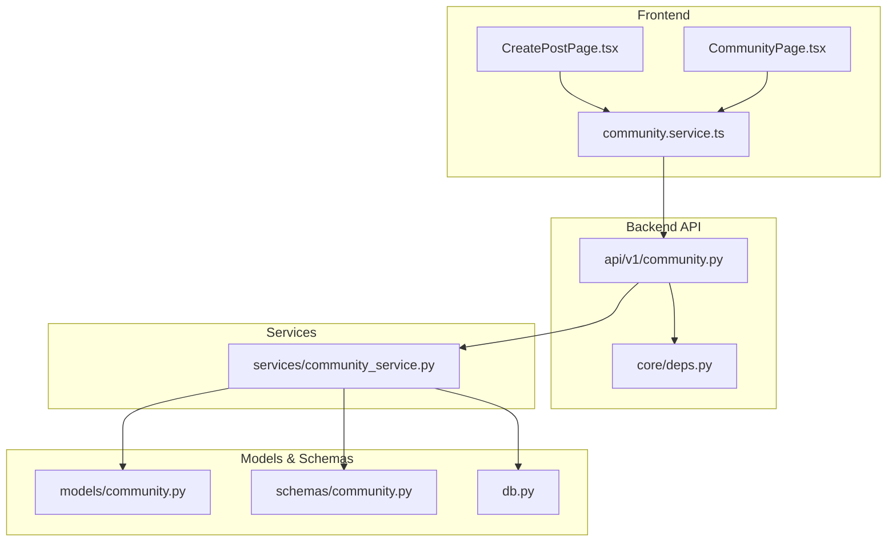
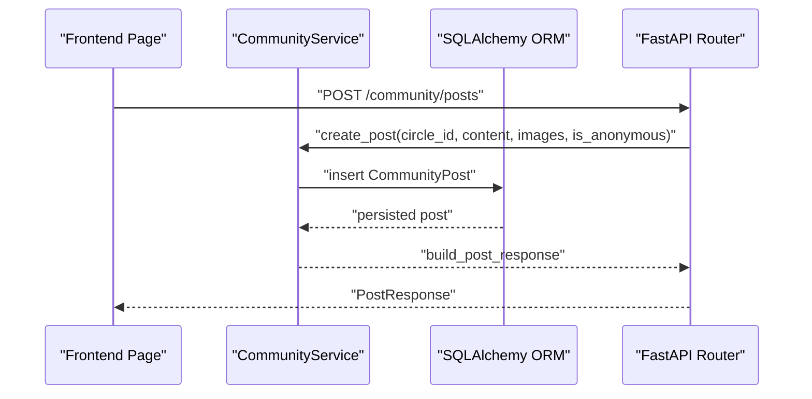
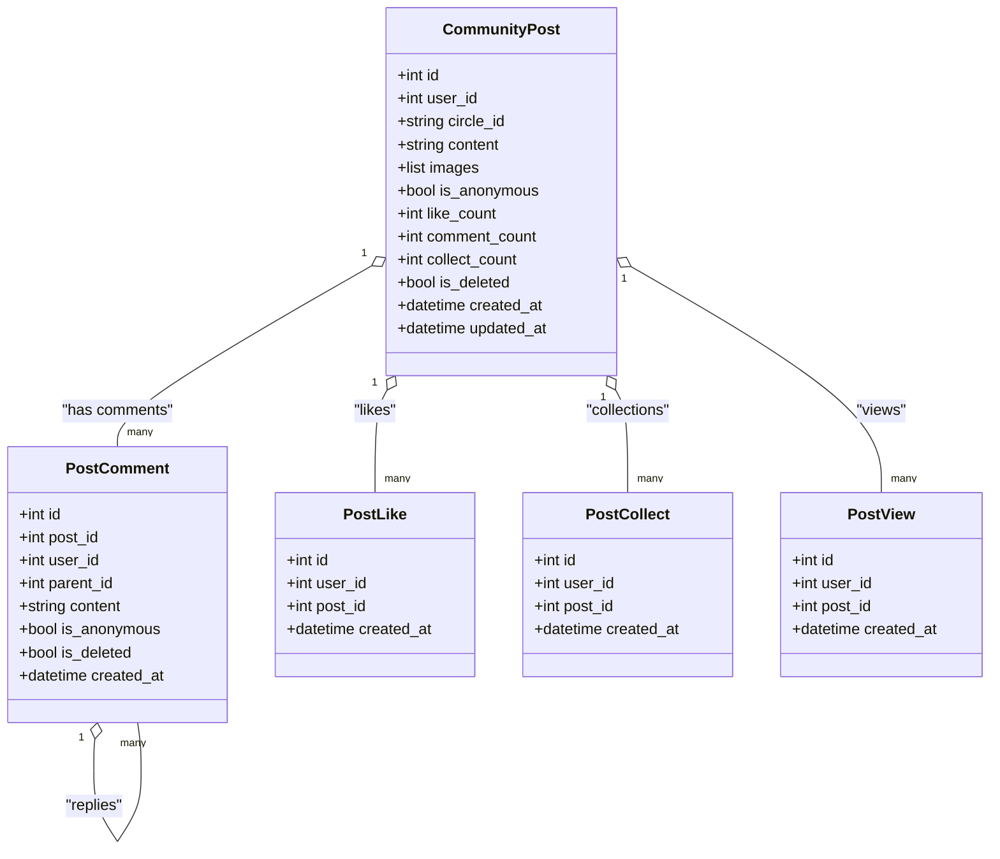
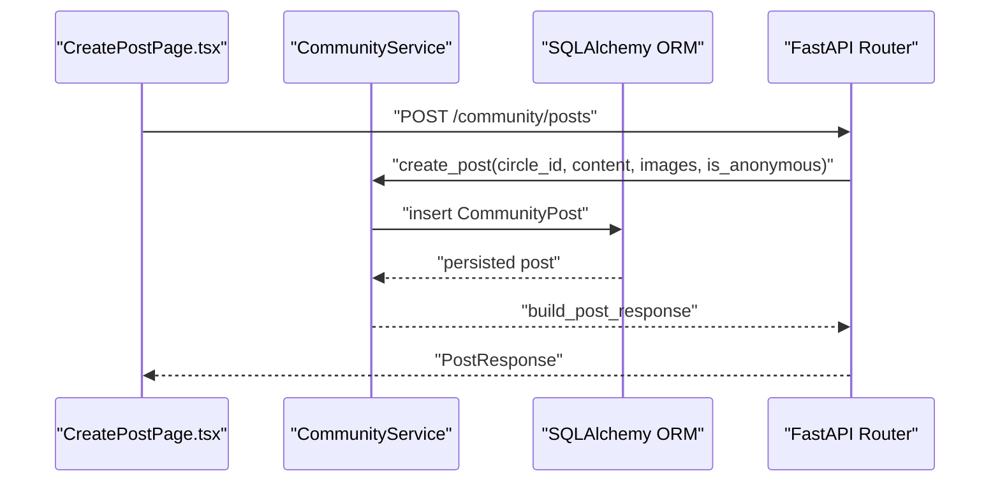
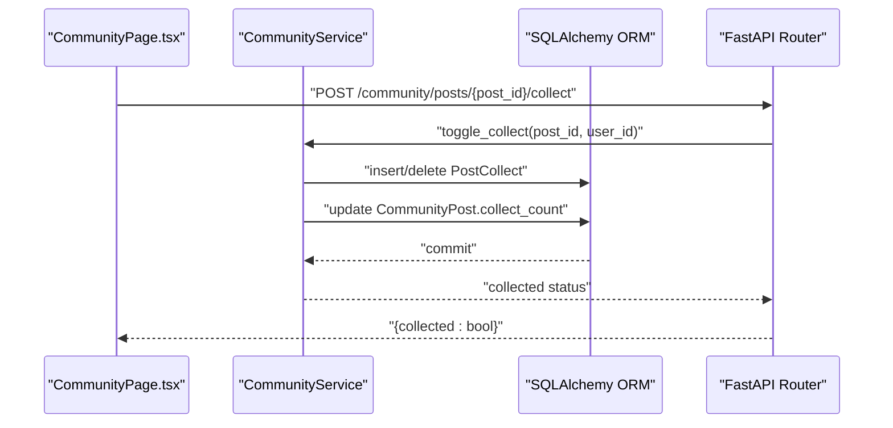
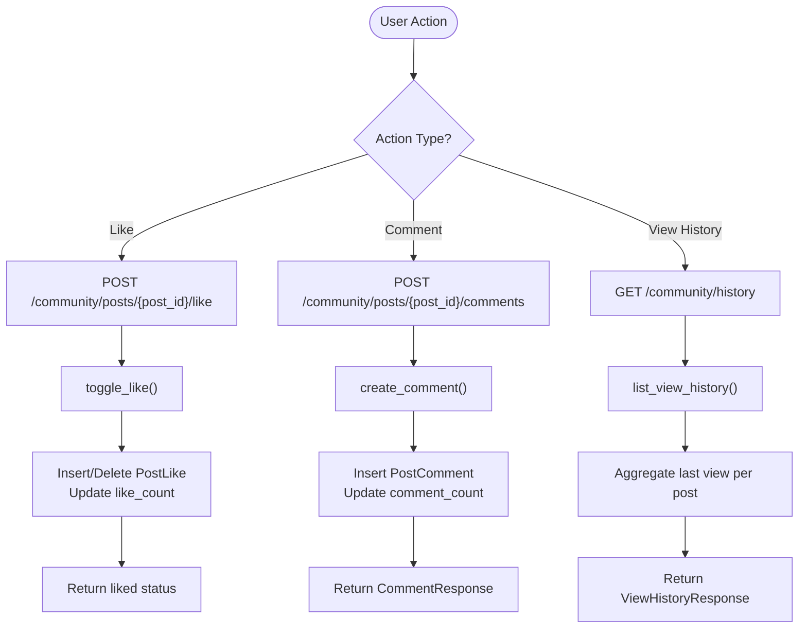
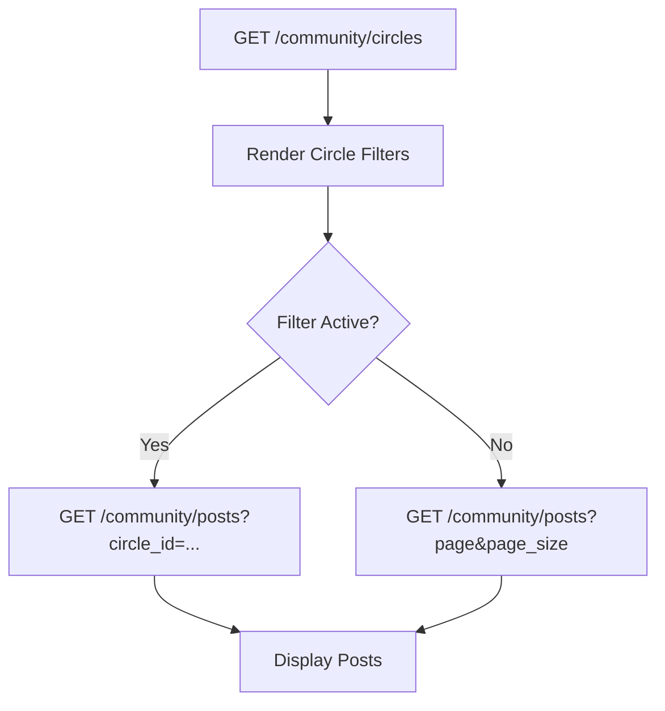
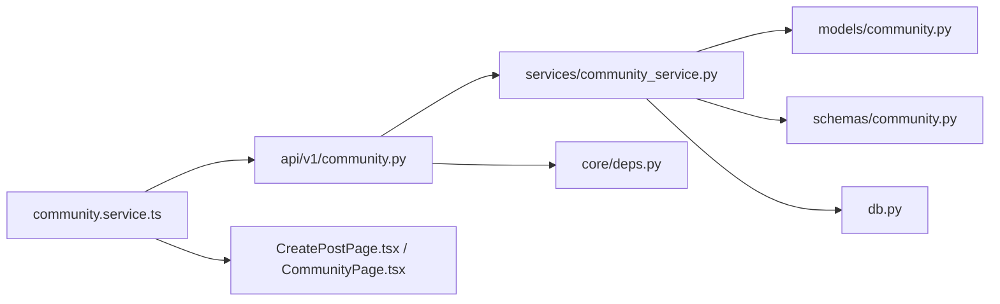

# Community Models

<cite>
**Referenced Files in This Document**
- [community.py](file://backend/app/models/community.py)
- [schemas/community.py](file://backend/app/schemas/community.py)
- [community_service.py](file://backend/app/services/community_service.py)
- [community.py](file://backend/app/api/v1/community.py)
- [db.py](file://backend/app/db.py)
- [deps.py](file://backend/app/core/deps.py)
- [community.service.ts](file://frontend/src/services/community.service.ts)
- [CreatePostPage.tsx](file://frontend/src/pages/community/CreatePostPage.tsx)
- [CommunityPage.tsx](file://frontend/src/pages/community/CommunityPage.tsx)
- [AnonymousAvatar.tsx](file://frontend/src/components/community/AnonymousAvatar.tsx)
</cite>

## Table of Contents
1. [Introduction](#introduction)
2. [Project Structure](#project-structure)
3. [Core Components](#core-components)
4. [Architecture Overview](#architecture-overview)
5. [Detailed Component Analysis](#detailed-component-analysis)
6. [Dependency Analysis](#dependency-analysis)
7. [Performance Considerations](#performance-considerations)
8. [Troubleshooting Guide](#troubleshooting-guide)
9. [Conclusion](#conclusion)

## Introduction
This document describes the community platform models and related entities, focusing on CommunityPost, PostCollection, and associated interaction models. It explains anonymous posting capabilities, content moderation considerations, user interaction tracking, post categorization, discovery mechanisms, engagement metrics, and privacy safeguards. It also includes examples of post creation, collection management, and community interaction workflows, along with practical guidance for moderation and spam prevention.

## Project Structure
The community platform is implemented with a layered architecture:
- Backend API layer exposes endpoints for posts, comments, likes, collections, and browsing history.
- Service layer encapsulates business logic for CRUD operations, counts, toggles, and response building.
- Data models define SQLAlchemy ORM entities for posts, comments, likes, collections, and views.
- Pydantic schemas define request/response contracts for the API.
- Frontend pages and services integrate with the backend to support user workflows.

**Diagram sources**
- [community.py:1-324](file://backend/app/api/v1/community.py#L1-L324)
- [deps.py:1-103](file://backend/app/core/deps.py#L1-L103)
- [community_service.py:1-415](file://backend/app/services/community_service.py#L1-L415)
- [community.py:1-176](file://backend/app/models/community.py#L1-L176)
- [schemas/community.py:1-124](file://backend/app/schemas/community.py#L1-L124)
- [db.py:1-59](file://backend/app/db.py#L1-L59)
- [community.service.ts:1-180](file://frontend/src/services/community.service.ts#L1-L180)
- [CreatePostPage.tsx:1-210](file://frontend/src/pages/community/CreatePostPage.tsx#L1-L210)
- [CommunityPage.tsx:1-358](file://frontend/src/pages/community/CommunityPage.tsx#L1-L358)

**Section sources**
- [community.py:1-324](file://backend/app/api/v1/community.py#L1-L324)
- [community_service.py:1-415](file://backend/app/services/community_service.py#L1-L415)
- [community.py:1-176](file://backend/app/models/community.py#L1-L176)
- [schemas/community.py:1-124](file://backend/app/schemas/community.py#L1-L124)
- [db.py:1-59](file://backend/app/db.py#L1-L59)
- [deps.py:1-103](file://backend/app/core/deps.py#L1-L103)
- [community.service.ts:1-180](file://frontend/src/services/community.service.ts#L1-L180)
- [CreatePostPage.tsx:1-210](file://frontend/src/pages/community/CreatePostPage.tsx#L1-L210)
- [CommunityPage.tsx:1-358](file://frontend/src/pages/community/CommunityPage.tsx#L1-L358)

## Core Components
- CommunityPost: Represents a user-generated post with content, images, category (circle), anonymous flag, and engagement counters.
- PostComment: Represents threaded comments with optional parent comment for replies.
- PostLike: Tracks user likes with a unique constraint to prevent duplicates.
- PostCollect: Tracks user collections with a unique constraint to prevent duplicates.
- PostView: Records user views for browsing history.
- CIRCLES: Defines the five emotional categories (anxiety, sadness, growth, peace, confusion) used for post categorization.

Key responsibilities:
- Store and retrieve posts, comments, likes, collections, and views.
- Enforce constraints (e.g., unique like/collect).
- Build enriched responses including author info (when not anonymous), counts, and user-specific flags.

**Section sources**
- [community.py:13-176](file://backend/app/models/community.py#L13-L176)
- [schemas/community.py:10-124](file://backend/app/schemas/community.py#L10-L124)
- [community_service.py:13-415](file://backend/app/services/community_service.py#L13-L415)

## Architecture Overview
The system follows a clean architecture with clear separation of concerns:
- API layer validates requests, injects dependencies, and delegates to services.
- Service layer performs business logic, updates counters, and constructs responses.
- Model layer persists data with SQLAlchemy ORM.
- Schema layer defines typed request/response contracts.
- Frontend integrates with the backend via typed services and pages.

**Diagram sources**
- [community.py:39-56](file://backend/app/api/v1/community.py#L39-L56)
- [community_service.py:36-57](file://backend/app/services/community_service.py#L36-L57)
- [community.py:23-57](file://backend/app/models/community.py#L23-L57)

**Section sources**
- [community.py:1-324](file://backend/app/api/v1/community.py#L1-L324)
- [community_service.py:1-415](file://backend/app/services/community_service.py#L1-L415)
- [community.py:1-176](file://backend/app/models/community.py#L1-L176)

## Detailed Component Analysis

### CommunityPost Model
CommunityPost stores the core post entity with:
- Identity and ownership: id, user_id (foreign key to users), timestamps.
- Category: circle_id constrained to predefined values.
- Content: text body and optional images stored as JSON.
- Anonymous mode: is_anonymous flag to hide author identity.
- Engagement metrics: like_count, comment_count, collect_count.
- Soft deletion: is_deleted flag to hide content without losing data.
- Indexes: on user_id and circle_id for efficient filtering and sorting.

Privacy and moderation considerations:
- Author visibility is controlled by is_anonymous; when true, author metadata is omitted in responses.
- Soft deletion allows moderation without permanent data loss.
- Content length limits are enforced by the schema (max 5000 characters).

Engagement tracking:
- Counters are maintained in the model; services increment/decrement them during interactions.

**Section sources**
- [community.py:23-57](file://backend/app/models/community.py#L23-L57)
- [schemas/community.py:12-18](file://backend/app/schemas/community.py#L12-L18)
- [community_service.py:36-57](file://backend/app/services/community_service.py#L36-L57)

### PostCollection and Related Entities
PostCollection is represented by the PostCollect model and the PostLike/PostView models. Together they enable:
- Collections: users can bookmark posts; uniqueness prevents duplicates.
- Likes: users can toggle likes; uniqueness ensures idempotent toggling.
- Views: user visits to post details are recorded for browsing history.

Unique constraints:
- PostLike: unique(user_id, post_id)
- PostCollect: unique(user_id, post_id)

Counters:
- PostCollect increments/decrements collect_count on toggle.
- PostLike increments/decrements like_count on toggle.
- Comment count is updated when comments are created/deleted.

**Section sources**
- [community.py:94-176](file://backend/app/models/community.py#L94-L176)
- [community_service.py:213-305](file://backend/app/services/community_service.py#L213-L305)

### Post Comments
PostComment enables threaded discussions:
- Parent-child relationships via parent_id referencing another comment.
- Optional anonymity for comments.
- Soft deletion for moderation.
- Sorting by creation time for chronological display.

**Section sources**
- [community.py:60-92](file://backend/app/models/community.py#L60-L92)
- [community_service.py:148-210](file://backend/app/services/community_service.py#L148-L210)

### API Endpoints and Workflows
Endpoints cover:
- Post lifecycle: create, list, list mine, get, update, delete.
- Image upload for posts.
- Comments: create, list, delete.
- Interactions: like, collect.
- Collections listing.
- View history.

Authentication and authorization:
- Requires active user via bearer token.
- Ownership checks for update/delete operations.

Pagination:
- Posts and collections support pagination with page/page_size.

**Section sources**
- [community.py:39-324](file://backend/app/api/v1/community.py#L39-L324)
- [deps.py:18-89](file://backend/app/core/deps.py#L18-L89)

### Frontend Integration
Frontend pages demonstrate:
- CreatePostPage: selects circle, manages content and images, toggles anonymous mode, submits to backend.
- CommunityPage: lists posts, filters by circle, handles likes/collects, navigates to post detail.
- AnonymousAvatar: renders anonymous user avatar in UI.

**Section sources**
- [CreatePostPage.tsx:1-210](file://frontend/src/pages/community/CreatePostPage.tsx#L1-L210)
- [CommunityPage.tsx:1-358](file://frontend/src/pages/community/CommunityPage.tsx#L1-L358)
- [AnonymousAvatar.tsx:1-46](file://frontend/src/components/community/AnonymousAvatar.tsx#L1-L46)
- [community.service.ts:70-179](file://frontend/src/services/community.service.ts#L70-L179)

## Architecture Overview

**Diagram sources**
- [community.py:23-176](file://backend/app/models/community.py#L23-L176)

**Section sources**
- [community.py:1-176](file://backend/app/models/community.py#L1-L176)

## Detailed Component Analysis

### Post Creation Workflow
End-to-end flow for creating a post:
1. Frontend collects circle_id, content, images, and is_anonymous.
2. Frontend calls communityService.createPost.
3. API endpoint validates and delegates to CommunityService.create_post.
4. Service validates circle_id against CIRCLES, creates CommunityPost, commits, refreshes, and builds response.
5. API returns PostResponse to frontend.

**Diagram sources**
- [CreatePostPage.tsx:53-78](file://frontend/src/pages/community/CreatePostPage.tsx#L53-L78)
- [community.service.ts:78-86](file://frontend/src/services/community.service.ts#L78-L86)
- [community.py:39-56](file://backend/app/api/v1/community.py#L39-L56)
- [community_service.py:36-57](file://backend/app/services/community_service.py#L36-L57)

**Section sources**
- [CreatePostPage.tsx:1-210](file://frontend/src/pages/community/CreatePostPage.tsx#L1-L210)
- [community.service.ts:70-86](file://frontend/src/services/community.service.ts#L70-L86)
- [community.py:39-56](file://backend/app/api/v1/community.py#L39-L56)
- [community_service.py:36-57](file://backend/app/services/community_service.py#L36-L57)

### Collection Management Workflow
Users can manage collections:
- Toggle collection via API endpoint posts/{post_id}/collect.
- Service toggles PostCollect, updates collect_count, and returns collected status.
- Listing collections via GET /community/collections with pagination.

**Diagram sources**
- [CommunityPage.tsx:87-101](file://frontend/src/pages/community/CommunityPage.tsx#L87-L101)
- [community.py:261-273](file://backend/app/api/v1/community.py#L261-L273)
- [community_service.py:248-270](file://backend/app/services/community_service.py#L248-L270)

**Section sources**
- [CommunityPage.tsx:1-358](file://frontend/src/pages/community/CommunityPage.tsx#L1-L358)
- [community.py:261-294](file://backend/app/api/v1/community.py#L261-L294)
- [community_service.py:248-305](file://backend/app/services/community_service.py#L248-L305)

### Community Interaction Workflows
- Like/unlike: posts/{post_id}/like toggles PostLike and updates like_count.
- Comment creation: posts/{post_id}/comments creates PostComment and increments comment_count.
- Browse history: GET /community/history returns last view per post.

**Diagram sources**
- [community.py:245-324](file://backend/app/api/v1/community.py#L245-L324)
- [community_service.py:213-345](file://backend/app/services/community_service.py#L213-L345)

**Section sources**
- [community.py:245-324](file://backend/app/api/v1/community.py#L245-L324)
- [community_service.py:213-345](file://backend/app/services/community_service.py#L213-L345)

### Post Categorization and Discovery
- Categories: Five predefined circles (anxiety, sadness, growth, peace, confusion).
- Discovery: List posts by circle_id, paginate, order by created_at descending.
- UI: CommunityPage displays circles and filters posts accordingly.

**Diagram sources**
- [community.py:30-34](file://backend/app/api/v1/community.py#L30-L34)
- [community.py:59-79](file://backend/app/api/v1/community.py#L59-L79)
- [CommunityPage.tsx:42-58](file://frontend/src/pages/community/CommunityPage.tsx#L42-L58)

**Section sources**
- [community.py:13-20](file://backend/app/models/community.py#L13-L20)
- [community.py:28-34](file://backend/app/api/v1/community.py#L28-L34)
- [community.py:59-79](file://backend/app/api/v1/community.py#L59-L79)
- [CommunityPage.tsx:175-218](file://frontend/src/pages/community/CommunityPage.tsx#L175-L218)

### Engagement Metrics
- PostResponse includes like_count, comment_count, collect_count, is_liked, is_collected.
- Services compute these values from counters and user-specific flags.
- Frontend updates metrics immediately after successful interactions.

**Section sources**
- [schemas/community.py:33-47](file://backend/app/schemas/community.py#L33-L47)
- [community_service.py:354-388](file://backend/app/services/community_service.py#L354-L388)

### Privacy Considerations for Anonymous Posting
- Anonymous posts: is_anonymous=true hides author identity in responses; author field is null.
- Anonymous comments: similarly hide author identity.
- Edit restrictions: anonymous posts cannot be edited; service raises an error if attempted.
- Moderation: soft deletion preserves content while hiding it; comments support soft deletion.

**Section sources**
- [schemas/community.py:26-47](file://backend/app/schemas/community.py#L26-L47)
- [community_service.py:119-135](file://backend/app/services/community_service.py#L119-L135)
- [community.py:23-57](file://backend/app/models/community.py#L23-L57)

### Content Moderation Patterns and Spam Prevention
Moderation patterns:
- Soft deletion: posts/comments marked deleted; excluded from public listings.
- Unique constraints: prevent duplicate likes/collections.
- Ownership checks: update/delete require matching user_id.

Spam prevention measures:
- Content length limits enforced by schema (max 5000 characters for posts, 2000 for comments).
- Image upload validation: allowed types and size limit (<= 10MB).
- Pagination limits: page_size constrained to a reasonable upper bound.

**Section sources**
- [schemas/community.py:12-24](file://backend/app/schemas/community.py#L12-L24)
- [schemas/community.py:64-68](file://backend/app/schemas/community.py#L64-L68)
- [community.py:160-188](file://backend/app/api/v1/community.py#L160-L188)
- [community_service.py:137-144](file://backend/app/services/community_service.py#L137-L144)
- [community_service.py:192-209](file://backend/app/services/community_service.py#L192-L209)

## Dependency Analysis

**Diagram sources**
- [community.py:1-324](file://backend/app/api/v1/community.py#L1-L324)
- [community_service.py:1-415](file://backend/app/services/community_service.py#L1-L415)
- [community.py:1-176](file://backend/app/models/community.py#L1-L176)
- [schemas/community.py:1-124](file://backend/app/schemas/community.py#L1-L124)
- [db.py:1-59](file://backend/app/db.py#L1-L59)
- [deps.py:1-103](file://backend/app/core/deps.py#L1-L103)
- [community.service.ts:1-180](file://frontend/src/services/community.service.ts#L1-L180)
- [CreatePostPage.tsx:1-210](file://frontend/src/pages/community/CreatePostPage.tsx#L1-L210)
- [CommunityPage.tsx:1-358](file://frontend/src/pages/community/CommunityPage.tsx#L1-L358)

**Section sources**
- [community.py:1-324](file://backend/app/api/v1/community.py#L1-L324)
- [community_service.py:1-415](file://backend/app/services/community_service.py#L1-L415)
- [community.py:1-176](file://backend/app/models/community.py#L1-L176)
- [schemas/community.py:1-124](file://backend/app/schemas/community.py#L1-L124)
- [db.py:1-59](file://backend/app/db.py#L1-L59)
- [deps.py:1-103](file://backend/app/core/deps.py#L1-L103)
- [community.service.ts:1-180](file://frontend/src/services/community.service.ts#L1-L180)
- [CreatePostPage.tsx:1-210](file://frontend/src/pages/community/CreatePostPage.tsx#L1-L210)
- [CommunityPage.tsx:1-358](file://frontend/src/pages/community/CommunityPage.tsx#L1-L358)

## Performance Considerations
- Indexes: user_id and circle_id on CommunityPost enable efficient filtering and sorting.
- Pagination: page/page_size limits reduce payload sizes and database load.
- Unique constraints: prevent redundant writes and improve consistency.
- Asynchronous operations: FastAPI and SQLAlchemy async sessions support concurrent requests.
- Recommendations:
  - Add indexes on PostComment.post_id and PostComment.parent_id for threaded comments.
  - Consider materialized aggregates for popular circles to reduce joins.
  - Cache frequently accessed circle metadata.

[No sources needed since this section provides general guidance]

## Troubleshooting Guide
Common issues and resolutions:
- Invalid circle_id: Service raises ValueError; ensure circle_id matches predefined values.
- Anonymous post edit attempts: Service raises ValueError; anonymous posts cannot be edited.
- Unauthorized operations: Update/Delete require matching user_id; otherwise returns not found.
- Missing post/comment: API returns 404 Not Found; verify identifiers.
- Image upload errors: Invalid type or size triggers 400 Bad Request; check allowed types and size limits.

**Section sources**
- [community_service.py:43-45](file://backend/app/services/community_service.py#L43-L45)
- [community_service.py:127-128](file://backend/app/services/community_service.py#L127-L128)
- [community_service.py:139-144](file://backend/app/services/community_service.py#L139-L144)
- [community.py:166-178](file://backend/app/api/v1/community.py#L166-L178)

## Conclusion
The community platform models provide a robust foundation for anonymous posting, categorized content, and user-driven interactions. The design balances privacy with discoverability, enforces moderation-friendly constraints, and offers scalable APIs for engagement features. By leveraging unique constraints, soft deletion, and pagination, the system supports both user experience and operational safety. Extending the model set with PostCollection (as implemented via PostCollect) completes the curation workflow alongside likes, comments, and browsing history.