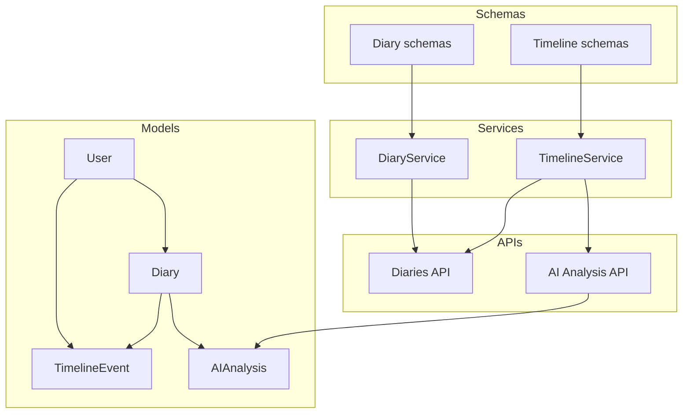
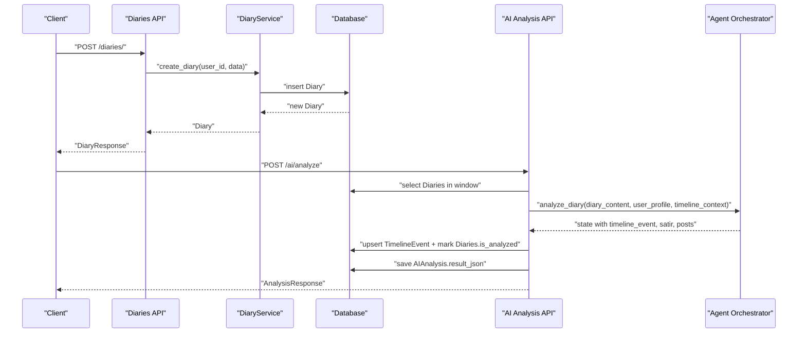
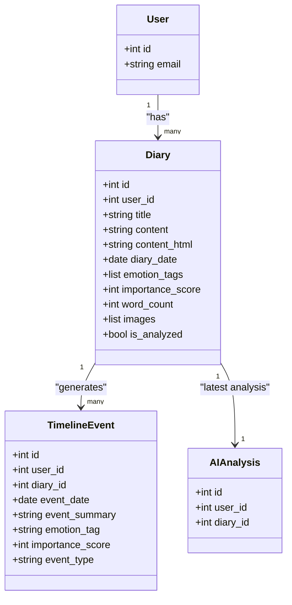
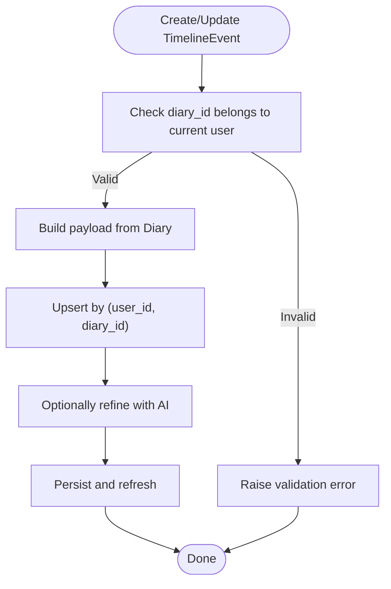
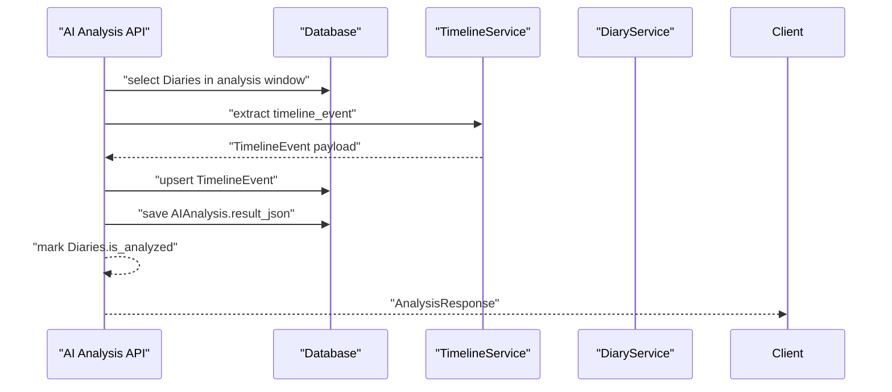
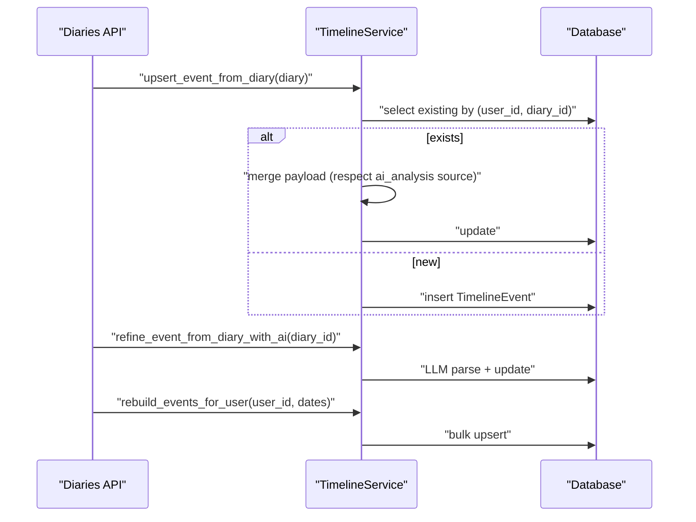
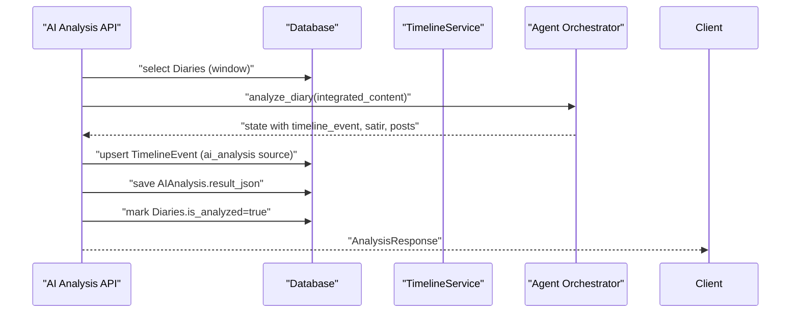
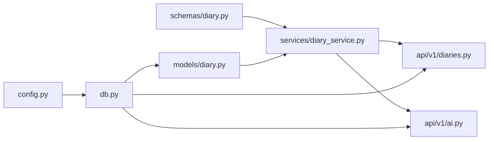

# Diary and Timeline Models

<cite>
**Referenced Files in This Document**
- [diary.py](file://backend/app/models/diary.py)
- [diary.py](file://backend/app/schemas/diary.py)
- [diary_service.py](file://backend/app/services/diary_service.py)
- [diaries.py](file://backend/app/api/v1/diaries.py)
- [ai.py](file://backend/app/api/v1/ai.py)
- [db.py](file://backend/app/db.py)
- [config.py](file://backend/app/core/config.py)
- [rebuild_timeline_events.py](file://backend/scripts/rebuild_timeline_events.py)
</cite>

## Table of Contents
1. [Introduction](#introduction)
2. [Project Structure](#project-structure)
3. [Core Components](#core-components)
4. [Architecture Overview](#architecture-overview)
5. [Detailed Component Analysis](#detailed-component-analysis)
6. [Dependency Analysis](#dependency-analysis)
7. [Performance Considerations](#performance-considerations)
8. [Troubleshooting Guide](#troubleshooting-guide)
9. [Conclusion](#conclusion)

## Introduction
This document explains the diary-related models and their ecosystem: Diary, TimelineEvent, and AIAnalysis. It covers model structure, relationships, foreign keys, cascading behaviors, validation rules, indexing strategies, and performance considerations. It also provides practical examples for creating diary entries, processing timeline events, and generating AI analyses, along with guidance for troubleshooting and optimization.

## Project Structure
The diary and timeline domain spans models, schemas, services, and APIs:
- Models define the database schema and relationships.
- Schemas define request/response validation and serialization.
- Services encapsulate business logic for CRUD, timeline extraction, and AI orchestration.
- APIs expose endpoints for client interaction.

**Diagram sources**
- [diary.py:29-132](file://backend/app/models/diary.py#L29-L132)
- [diary.py:9-101](file://backend/app/schemas/diary.py#L9-L101)
- [diary_service.py:66-636](file://backend/app/services/diary_service.py#L66-L636)
- [diaries.py:55-491](file://backend/app/api/v1/diaries.py#L55-L491)
- [ai.py:406-767](file://backend/app/api/v1/ai.py#L406-L767)

**Section sources**
- [diary.py:1-186](file://backend/app/models/diary.py#L1-L186)
- [diary.py:1-101](file://backend/app/schemas/diary.py#L1-L101)
- [diary_service.py:1-637](file://backend/app/services/diary_service.py#L1-L637)
- [diaries.py:1-491](file://backend/app/api/v1/diaries.py#L1-L491)
- [ai.py:1-902](file://backend/app/api/v1/ai.py#L1-L902)

## Core Components
- Diary: Stores user-written entries with content, metadata, emotion tags, images, and importance scoring.
- TimelineEvent: Extracted events derived from Diary, with optional linkage back to the source Diary and categorization.
- AIAnalysis: Persisted JSON result of AI analysis tied to a specific Diary.

Key characteristics:
- Diary.user_id links entries to a user; cascade delete ensures cleanup on user removal.
- TimelineEvent.user_id and TimelineEvent.diary_id form a two-tier linkage; cascades preserve referential integrity.
- AIAnalysis.user_id and AIAnalysis.diary_id link analysis results to a user and a specific Diary; uniqueness constraint on diary_id ensures one latest analysis per Diary.

**Section sources**
- [diary.py:29-132](file://backend/app/models/diary.py#L29-L132)

## Architecture Overview
The system integrates user actions (creating diaries) with automated extraction and AI analysis. The flow below maps actual code paths.

**Diagram sources**
- [diaries.py:55-183](file://backend/app/api/v1/diaries.py#L55-L183)
- [diary_service.py:69-105](file://backend/app/services/diary_service.py#L69-L105)
- [ai.py:406-638](file://backend/app/api/v1/ai.py#L406-L638)

## Detailed Component Analysis

### Diary Model
- Purpose: Store user entries with rich metadata for downstream analysis and timeline generation.
- Key fields:
  - Identity: id, user_id (FK to users), diary_date (indexed)
  - Content: title (optional), content (required), content_html (optional)
  - Metadata: word_count, importance_score (default 5), is_analyzed (default false)
  - Emotion and media: emotion_tags (JSON list), images (JSON list)
  - Timestamps: created_at, updated_at
- Validation and defaults:
  - Schema enforces content length and importance range.
  - Model sets default importance_score and computed word_count.
- Indexing:
  - user_id and diary_date are indexed for efficient filtering and sorting.
- Relationships:
  - One-to-many with TimelineEvent via diary_id.
  - One-to-one (unique) with AIAnalysis via diary_id.

**Diagram sources**
- [diary.py:29-132](file://backend/app/models/diary.py#L29-L132)

**Section sources**
- [diary.py:29-65](file://backend/app/models/diary.py#L29-L65)
- [diary.py:9-44](file://backend/app/schemas/diary.py#L9-L44)

### TimelineEvent Model
- Purpose: Structured, categorized events extracted from Diary entries.
- Key fields:
  - Identity: id, user_id (FK to users), diary_id (optional FK to Diary)
  - Event: event_date, event_summary, emotion_tag (indexed), importance_score (default 5)
  - Categorization: event_type (work/relationship/health/achievement/other)
  - Entities: related_entities (JSON), created_at
- Relationships and constraints:
  - Cascade delete on user_id ensures timeline cleanup when user removed.
  - diary_id uses SET NULL on delete, allowing orphaned events when a Diary is deleted.
- Indexing:
  - user_id and event_date are indexed for efficient timeline queries.

**Diagram sources**
- [diary_service.py:284-408](file://backend/app/services/diary_service.py#L284-L408)
- [diary_service.py:410-488](file://backend/app/services/diary_service.py#L410-L488)

**Section sources**
- [diary.py:67-99](file://backend/app/models/diary.py#L67-L99)
- [diary.py:75-101](file://backend/app/schemas/diary.py#L75-L101)
- [diary_service.py:281-488](file://backend/app/services/diary_service.py#L281-L488)

### AIAnalysis Model
- Purpose: Persist the latest AI analysis result for a given Diary.
- Key fields:
  - Identity: id, user_id (FK to users), diary_id (FK to Diary, unique)
  - Content: result_json (required JSON)
  - Timestamps: created_at, updated_at
- Constraints:
  - Unique constraint on (user_id, diary_id) ensures single latest analysis per Diary.
  - Cascade delete on user_id and Diary maintains referential integrity.

**Diagram sources**
- [ai.py:406-638](file://backend/app/api/v1/ai.py#L406-L638)
- [diary_service.py:358-408](file://backend/app/services/diary_service.py#L358-L408)

**Section sources**
- [diary.py:102-132](file://backend/app/models/diary.py#L102-L132)
- [ai.py:406-710](file://backend/app/api/v1/ai.py#L406-L710)

### Data Validation Rules
- DiaryCreate (schema):
  - content: required, minimum length 1, maximum 10000.
  - diary_date: defaults to today if not provided.
  - importance_score: integer 1–10.
  - emotion_tags and images: optional lists.
- DiaryUpdate (schema):
  - Same constraints as create, with optional fields.
- TimelineEventCreate (schema):
  - event_summary: required, max length 500.
  - event_type: constrained to predefined categories.
  - importance_score: integer 1–10.
- AI analysis requests:
  - window_days and max_diaries bounded for performance.
  - Focus is optional for comprehensive analysis.

**Section sources**
- [diary.py:9-44](file://backend/app/schemas/diary.py#L9-L44)
- [diary.py:75-101](file://backend/app/schemas/diary.py#L75-L101)
- [ai.py:9-21](file://backend/app/api/v1/ai.py#L9-L21)

### Indexing Strategies
- Diary: user_id (index), diary_date (index).
- TimelineEvent: user_id (index), event_date (index), emotion_tag (index), diary_id (index).
- AIAnalysis: user_id (index), diary_id (unique index).
- Additional indexes:
  - User.email (unique index).
  - VerificationCode.email (index).
  - GrowthDailyInsight (user_id, insight_date unique).
  - SocialPostSample.user_id (index).

These indexes optimize:
- Filtering by user and date ranges.
- Sorting by recency and importance.
- Uniqueness enforcement for analysis results.

**Section sources**
- [diary.py:34-61](file://backend/app/models/diary.py#L34-L61)
- [diary.py:72-96](file://backend/app/models/diary.py#L72-L96)
- [diary.py:107-129](file://backend/app/models/diary.py#L107-L129)
- [diary.py:140-150](file://backend/app/models/diary.py#L140-L150)
- [diary.py:164-182](file://backend/app/models/diary.py#L164-L182)

### Examples

#### Example: Create a Diary Entry
- Endpoint: POST /diaries/
- Steps:
  - Client sends DiaryCreate payload (title, content, diary_date, emotion_tags, importance_score, images).
  - API validates schema and delegates to DiaryService.create_diary.
  - Service computes word_count and persists Diary.
  - API responds with DiaryResponse.

**Section sources**
- [diaries.py:55-73](file://backend/app/api/v1/diaries.py#L55-L73)
- [diary_service.py:69-105](file://backend/app/services/diary_service.py#L69-L105)
- [diary.py:9-17](file://backend/app/schemas/diary.py#L9-L17)

#### Example: Process Timeline Events from a Diary
- Automatic extraction/upsert:
  - TimelineService.upsert_event_from_diary builds a payload from Diary and creates/updates TimelineEvent by (user_id, diary_id).
- AI refinement:
  - TimelineService.refine_event_from_diary_with_ai calls LLM to improve summary, emotion_tag, importance_score, and event_type.
- Bulk rebuild:
  - TimelineService.rebuild_events_for_user iterates Diaries and upserts events (with limit and date bounds).
  - CLI script supports per-user or global rebuild.

**Diagram sources**
- [diary_service.py:358-408](file://backend/app/services/diary_service.py#L358-L408)
- [diary_service.py:410-488](file://backend/app/services/diary_service.py#L410-L488)
- [diary_service.py:490-522](file://backend/app/services/diary_service.py#L490-L522)
- [rebuild_timeline_events.py:19-30](file://backend/scripts/rebuild_timeline_events.py#L19-L30)

**Section sources**
- [diary_service.py:358-522](file://backend/app/services/diary_service.py#L358-L522)
- [rebuild_timeline_events.py:1-59](file://backend/scripts/rebuild_timeline_events.py#L1-L59)

#### Example: Generate AI Analysis for a Window of Diaries
- Endpoint: POST /ai/analyze
- Steps:
  - API selects Diaries within window and constructs integrated content.
  - Calls agent orchestrator to extract timeline_event, run Satir analysis, and generate social posts.
  - Persists TimelineEvent (with ai_analysis source label) and AIAnalysis.result_json.
  - Marks Diaries.is_analyzed true for the analyzed window.

**Diagram sources**
- [ai.py:406-638](file://backend/app/api/v1/ai.py#L406-L638)
- [diary_service.py:358-408](file://backend/app/services/diary_service.py#L358-L408)

**Section sources**
- [ai.py:406-638](file://backend/app/api/v1/ai.py#L406-L638)

## Dependency Analysis
- Models depend on SQLAlchemy declarative base and define foreign keys and indexes.
- Services depend on models and schemas, and coordinate with external LLM clients.
- APIs depend on services and schemas, and enforce user isolation via current_active_user.
- Database initialization registers all models.

**Diagram sources**
- [config.py:23-26](file://backend/app/core/config.py#L23-L26)
- [db.py:50-58](file://backend/app/db.py#L50-L58)
- [diary.py:1-186](file://backend/app/models/diary.py#L1-L186)
- [diary.py:1-101](file://backend/app/schemas/diary.py#L1-L101)
- [diary_service.py:1-637](file://backend/app/services/diary_service.py#L1-L637)
- [diaries.py:1-491](file://backend/app/api/v1/diaries.py#L1-L491)
- [ai.py:1-902](file://backend/app/api/v1/ai.py#L1-L902)

**Section sources**
- [db.py:50-58](file://backend/app/db.py#L50-L58)
- [diaries.py:1-491](file://backend/app/api/v1/diaries.py#L1-L491)
- [ai.py:1-902](file://backend/app/api/v1/ai.py#L1-L902)

## Performance Considerations
- Indexes:
  - user_id and date-based indexes on Diary and TimelineEvent enable fast pagination and filtering.
  - emotion_tag index aids event classification queries.
- Query patterns:
  - Prefer filtering by user_id and date ranges; avoid SELECT * on large tables.
  - Use LIMIT and OFFSET for paginated lists; consider cursor-based pagination for very large datasets.
- Cascading:
  - CASCADE on user_id ensures clean-up; SET NULL on diary_id allows orphaned events when a Diary is deleted.
- AI processing:
  - Batch operations (rebuild_events_for_user) limit concurrency and memory usage.
  - Deduplication and retrieval limits in comprehensive analysis reduce LLM load.
- Storage:
  - JSON fields (emotion_tags, images, related_entities, result_json) are flexible but can increase storage; consider normalization if fragmentation becomes problematic.

[No sources needed since this section provides general guidance]

## Troubleshooting Guide
- Cross-user data exposure:
  - TimelineService validates that a provided diary_id belongs to the current user before creating events.
- AI parsing errors:
  - Safe JSON parsing helpers handle malformed LLM outputs; failures fall back to existing event data.
- Cascade behavior:
  - Deleting a user removes their Diaries and TimelineEvents; deleting a Diary sets orphaned TimelineEvents’ diary_id to NULL.
- Analysis persistence warnings:
  - API captures persistence warnings in metadata when saving AIAnalysis or updating TimelineEvent fails.
- CLI rebuild:
  - Use rebuild_timeline_events.py to reconstruct timeline events for a user or all active users within a date window.

**Section sources**
- [diary_service.py:301-314](file://backend/app/services/diary_service.py#L301-L314)
- [diary_service.py:452-462](file://backend/app/services/diary_service.py#L452-L462)
- [ai.py:587-592](file://backend/app/api/v1/ai.py#L587-L592)
- [ai.py:627-631](file://backend/app/api/v1/ai.py#L627-L631)
- [rebuild_timeline_events.py:19-59](file://backend/scripts/rebuild_timeline_events.py#L19-L59)

## Conclusion
The Diary, TimelineEvent, and AIAnalysis models form a cohesive pipeline: users write Diaries, events are extracted and optionally refined, and AI analyses are persisted for later retrieval. Robust validation, indexing, and cascading rules ensure data integrity and performance. The provided examples and troubleshooting guidance should help developers implement and maintain these features effectively.