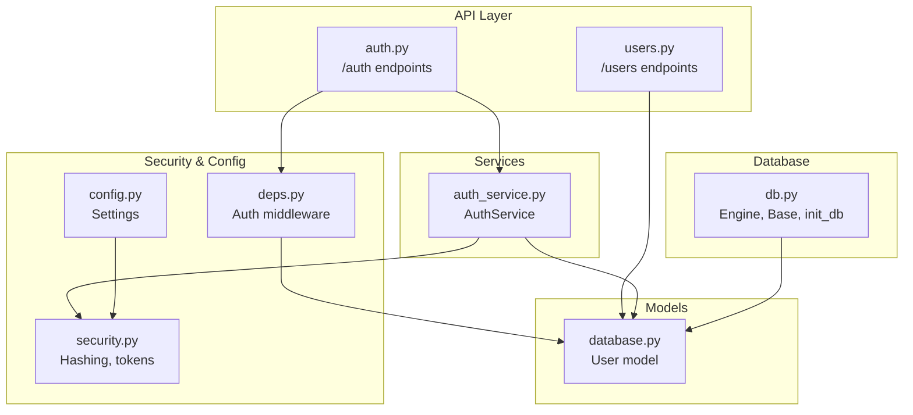
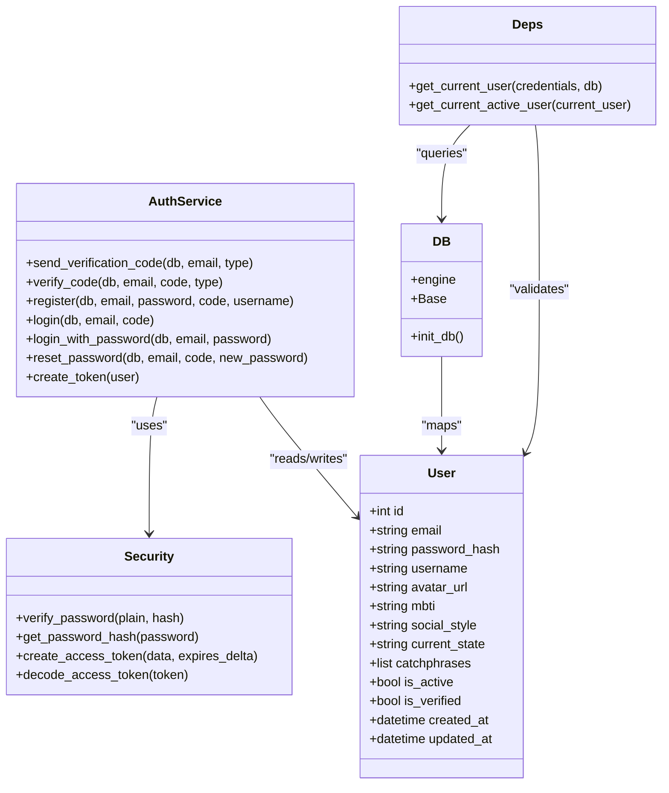
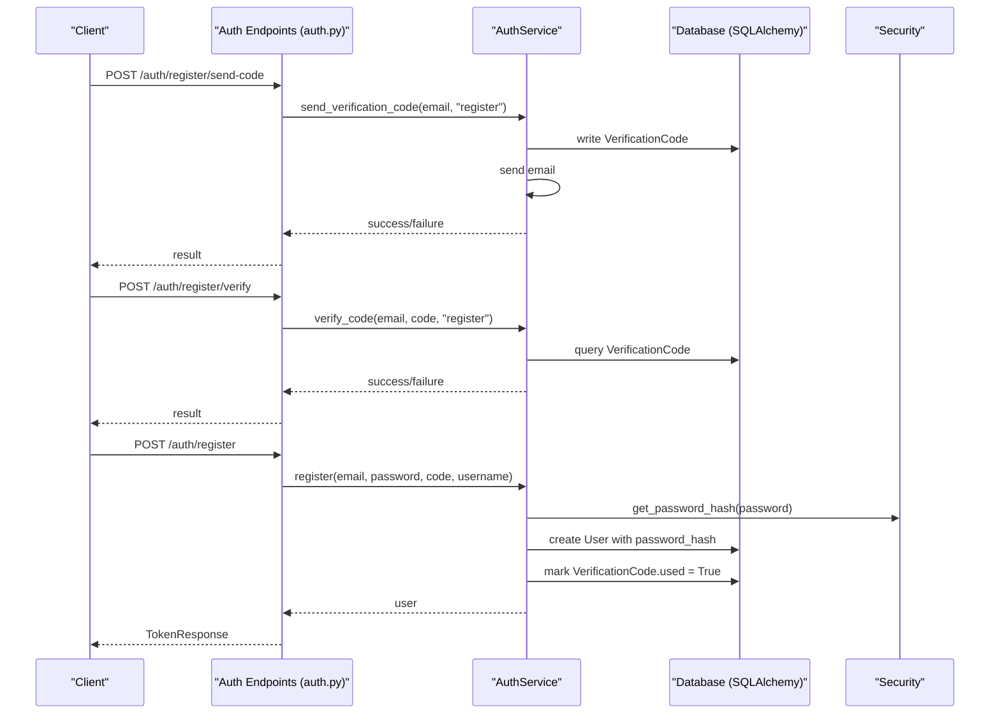
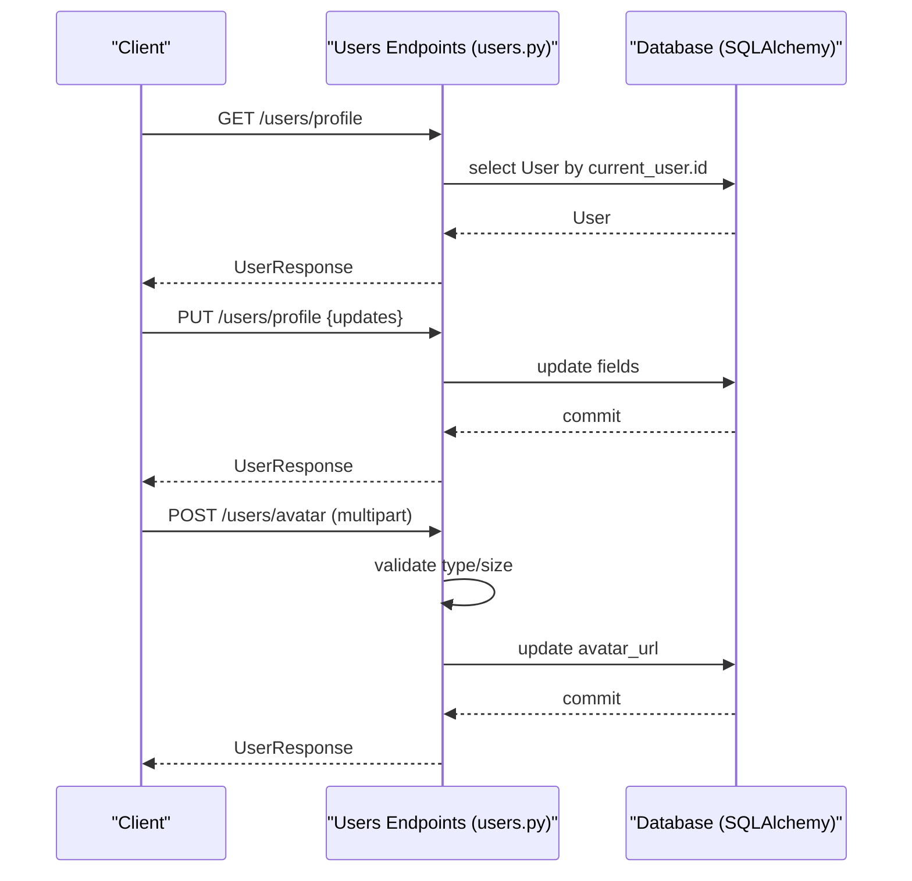
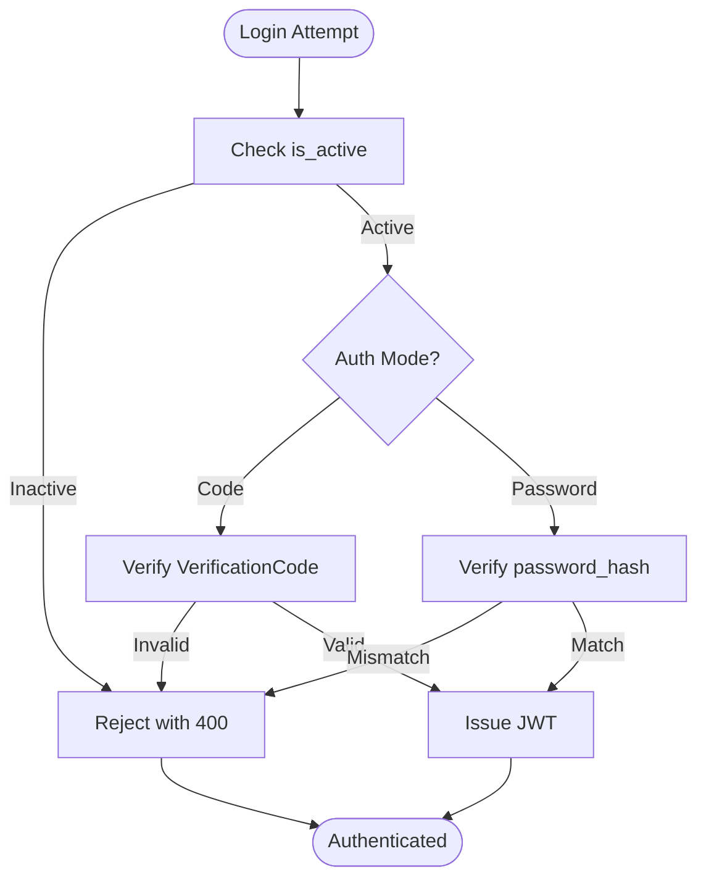
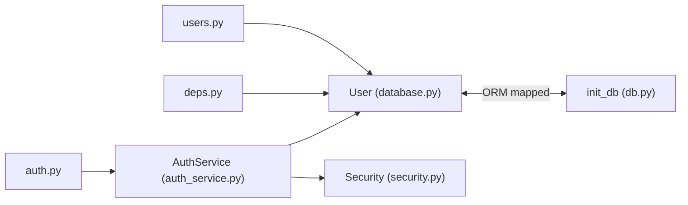

# User Model

<cite>
**Referenced Files in This Document**
- [database.py](file://backend/app/models/database.py)
- [auth.py](file://backend/app/api/v1/auth.py)
- [users.py](file://backend/app/api/v1/users.py)
- [auth_schemas.py](file://backend/app/schemas/auth.py)
- [auth_service.py](file://backend/app/services/auth_service.py)
- [security.py](file://backend/app/core/security.py)
- [deps.py](file://backend/app/core/deps.py)
- [db.py](file://backend/app/db.py)
- [config.py](file://backend/app/core/config.py)
</cite>

## Table of Contents
1. [Introduction](#introduction)
2. [Project Structure](#project-structure)
3. [Core Components](#core-components)
4. [Architecture Overview](#architecture-overview)
5. [Detailed Component Analysis](#detailed-component-analysis)
6. [Dependency Analysis](#dependency-analysis)
7. [Performance Considerations](#performance-considerations)
8. [Troubleshooting Guide](#troubleshooting-guide)
9. [Conclusion](#conclusion)

## Introduction
This document provides comprehensive data model documentation for the User entity. It covers the database schema, field definitions, constraints, and validation rules. It also explains the User model’s role in authentication and user management, including workflows for registration, login, profile updates, and avatar uploads. Security considerations around password hashing and token-based authentication are addressed, along with database indexes and performance optimizations.

## Project Structure
The User model is defined in the SQLAlchemy ORM layer and is used by FastAPI endpoints and services for authentication and user management. The relevant files are organized as follows:
- Data model definition: backend/app/models/database.py
- Authentication endpoints: backend/app/api/v1/auth.py
- User profile endpoints: backend/app/api/v1/users.py
- Request/response schemas: backend/app/schemas/auth.py
- Business logic: backend/app/services/auth_service.py
- Security utilities: backend/app/core/security.py
- Dependency injection and middleware: backend/app/core/deps.py
- Database initialization and engine: backend/app/db.py
- Application configuration: backend/app/core/config.py

**Diagram sources**
- [database.py:13-44](file://backend/app/models/database.py#L13-L44)
- [auth.py:1-316](file://backend/app/api/v1/auth.py#L1-L316)
- [users.py:1-103](file://backend/app/api/v1/users.py#L1-L103)
- [auth_service.py:1-358](file://backend/app/services/auth_service.py#L1-L358)
- [security.py:1-92](file://backend/app/core/security.py#L1-L92)
- [deps.py:1-103](file://backend/app/core/deps.py#L1-L103)
- [db.py:1-59](file://backend/app/db.py#L1-L59)
- [config.py:1-105](file://backend/app/core/config.py#L1-L105)

**Section sources**
- [database.py:13-44](file://backend/app/models/database.py#L13-L44)
- [auth.py:1-316](file://backend/app/api/v1/auth.py#L1-L316)
- [users.py:1-103](file://backend/app/api/v1/users.py#L1-L103)
- [auth_service.py:1-358](file://backend/app/services/auth_service.py#L1-L358)
- [security.py:1-92](file://backend/app/core/security.py#L1-L92)
- [deps.py:1-103](file://backend/app/core/deps.py#L1-L103)
- [db.py:1-59](file://backend/app/db.py#L1-L59)
- [config.py:1-105](file://backend/app/core/config.py#L1-L105)

## Core Components
This section documents the User model fields, types, constraints, and validation rules, and describes how the model participates in authentication and user management.

- Entity: User
- Table: users
- Primary key: id (integer, auto-increment)
- Fields and constraints:
  - id: integer, primary key, autoincrement
  - email: string(100), unique, indexed, not null
  - password_hash: string(255), not null
  - username: string(50), nullable
  - avatar_url: string(500), nullable
  - mbti: string(10), nullable
  - social_style: string(20), nullable
  - current_state: string(20), nullable
  - catchphrases: JSON array, default empty list
  - is_active: boolean, default true
  - is_verified: boolean, default false
  - created_at: datetime with timezone, server default now
  - updated_at: datetime with timezone, server default now, on update now

Validation and behavior:
- Unique and indexed: email ensures uniqueness and enables efficient lookups by email.
- Password storage: plaintext passwords are never stored; only password_hash is persisted.
- Optional profile fields: username, avatar_url, mbti, social_style, current_state, catchphrases.
- Status flags: is_active controls whether a user can authenticate; is_verified indicates email verification status.
- Timestamps: created_at and updated_at track record lifecycle.

**Section sources**
- [database.py:13-44](file://backend/app/models/database.py#L13-L44)

## Architecture Overview
The User model integrates with FastAPI endpoints, service layer, and security utilities to support authentication and user management.

**Diagram sources**
- [database.py:13-44](file://backend/app/models/database.py#L13-L44)
- [auth_service.py:1-358](file://backend/app/services/auth_service.py#L1-L358)
- [security.py:1-92](file://backend/app/core/security.py#L1-L92)
- [deps.py:1-103](file://backend/app/core/deps.py#L1-L103)
- [db.py:1-59](file://backend/app/db.py#L1-L59)

## Detailed Component Analysis

### Data Model Definition
- Table: users
- Columns and types:
  - id: integer, primary key, autoincrement
  - email: string(100), unique, indexed, not null
  - password_hash: string(255), not null
  - username: string(50), nullable
  - avatar_url: string(500), nullable
  - mbti: string(10), nullable
  - social_style: string(20), nullable
  - current_state: string(20), nullable
  - catchphrases: JSON, default empty list
  - is_active: boolean, default true
  - is_verified: boolean, default false
  - created_at: datetime with timezone, server default now
  - updated_at: datetime with timezone, server default now, on update now

Constraints and indexes:
- Unique constraint on email via unique=True and index=True.
- Index on email for fast lookups.
- JSON column for catchphrases supports arrays.

**Section sources**
- [database.py:13-44](file://backend/app/models/database.py#L13-L44)

### Authentication and Authorization Workflows
- Registration with email verification:
  - Send register code → Verify register code → Register user (hash password) → Issue token.
- Login with verification code:
  - Send login code → Verify login code → Authenticate user (check is_active) → Issue token.
- Password login:
  - Authenticate user by email → Verify password hash → Issue token.
- Logout:
  - Client-side token removal; server-side stateless token validation.

**Diagram sources**
- [auth.py:25-125](file://backend/app/api/v1/auth.py#L25-L125)
- [auth_service.py:19-98](file://backend/app/services/auth_service.py#L19-L98)
- [auth_service.py:142-200](file://backend/app/services/auth_service.py#L142-L200)
- [security.py:30-41](file://backend/app/core/security.py#L30-L41)
- [database.py:13-44](file://backend/app/models/database.py#L13-L44)

**Section sources**
- [auth.py:25-125](file://backend/app/api/v1/auth.py#L25-L125)
- [auth_service.py:19-98](file://backend/app/services/auth_service.py#L19-L98)
- [auth_service.py:142-200](file://backend/app/services/auth_service.py#L142-L200)
- [security.py:30-41](file://backend/app/core/security.py#L30-L41)

### User Management: Profile Updates and Avatar Upload
- Get profile:
  - Endpoint: GET /users/profile returns current user profile.
- Update profile:
  - Endpoint: PUT /users/profile accepts username, mbti, social_style, current_state, catchphrases.
  - Backend validates and updates only provided fields.
- Upload avatar:
  - Endpoint: POST /users/avatar handles multipart file upload.
  - Validates MIME type and size, stores file, updates avatar_url.

**Diagram sources**
- [users.py:20-103](file://backend/app/api/v1/users.py#L20-L103)
- [auth_schemas.py:58-84](file://backend/app/schemas/auth.py#L58-L84)
- [database.py:13-44](file://backend/app/models/database.py#L13-L44)

**Section sources**
- [users.py:20-103](file://backend/app/api/v1/users.py#L20-L103)
- [auth_schemas.py:58-84](file://backend/app/schemas/auth.py#L58-L84)

### Security Considerations
- Password hashing:
  - Passwords are never stored in plaintext. The service hashes passwords using a secure hashing scheme and stores only the hash.
- Token-based authentication:
  - Access tokens are issued upon successful authentication and validated centrally. Tokens encode user identity and expire after a configured period.
- Rate limiting and verification:
  - Verification code requests are rate-limited per email per 5 minutes. Codes are single-use and expire after a short window.
- Active user checks:
  - Authentication endpoints and middleware reject inactive users.

**Diagram sources**
- [auth_service.py:202-286](file://backend/app/services/auth_service.py#L202-L286)
- [security.py:16-41](file://backend/app/core/security.py#L16-L41)
- [deps.py:69-89](file://backend/app/core/deps.py#L69-L89)

**Section sources**
- [auth_service.py:202-286](file://backend/app/services/auth_service.py#L202-L286)
- [security.py:16-41](file://backend/app/core/security.py#L16-L41)
- [deps.py:69-89](file://backend/app/core/deps.py#L69-L89)

## Dependency Analysis
- Model-to-service:
  - AuthService reads/writes User records and uses Security utilities for hashing and token generation.
- Service-to-security:
  - Uses verify_password and get_password_hash for password operations.
- Middleware-to-model:
  - get_current_user and get_current_active_user enforce authentication and activity checks against User.
- Database initialization:
  - init_db registers models and creates tables.

**Diagram sources**
- [database.py:13-44](file://backend/app/models/database.py#L13-L44)
- [db.py:45-59](file://backend/app/db.py#L45-L59)
- [auth_service.py:1-358](file://backend/app/services/auth_service.py#L1-L358)
- [security.py:1-92](file://backend/app/core/security.py#L1-L92)
- [deps.py:1-103](file://backend/app/core/deps.py#L1-L103)
- [auth.py:1-316](file://backend/app/api/v1/auth.py#L1-L316)
- [users.py:1-103](file://backend/app/api/v1/users.py#L1-L103)

**Section sources**
- [database.py:13-44](file://backend/app/models/database.py#L13-L44)
- [db.py:45-59](file://backend/app/db.py#L45-L59)
- [auth_service.py:1-358](file://backend/app/services/auth_service.py#L1-L358)
- [security.py:1-92](file://backend/app/core/security.py#L1-L92)
- [deps.py:1-103](file://backend/app/core/deps.py#L1-L103)
- [auth.py:1-316](file://backend/app/api/v1/auth.py#L1-L316)
- [users.py:1-103](file://backend/app/api/v1/users.py#L1-L103)

## Performance Considerations
- Indexes:
  - email is unique and indexed, enabling O(log n) lookups and ensuring uniqueness.
- JSON column:
  - catchphrases is stored as JSON; consider normalization if frequent queries filter or aggregate on individual phrases.
- Token validation:
  - Stateless JWT decoding avoids database lookups for subsequent requests.
- Rate limiting:
  - Verification code requests are throttled to reduce spam and protect mailbox resources.

[No sources needed since this section provides general guidance]

## Troubleshooting Guide
Common issues and resolutions:
- Registration fails with “email already registered”:
  - Cause: Duplicate email detected during registration.
  - Resolution: Use a different email or recover account.
- Login denied with “user is disabled”:
  - Cause: is_active is false.
  - Resolution: Contact support to activate the account.
- Password mismatch:
  - Cause: Incorrect password for the given email.
  - Resolution: Re-enter password or reset via verified email.
- Avatar upload rejected:
  - Cause: Unsupported MIME type or file too large (>2MB).
  - Resolution: Use JPG/PNG/GIF/WebP under 2MB.

**Section sources**
- [auth_service.py:53-67](file://backend/app/services/auth_service.py#L53-L67)
- [auth_service.py:233-235](file://backend/app/services/auth_service.py#L233-L235)
- [auth_service.py:279-284](file://backend/app/services/auth_service.py#L279-L284)
- [users.py:62-76](file://backend/app/api/v1/users.py#L62-L76)

## Conclusion
The User model defines a robust, secure, and extensible foundation for user identity and profile management. Its schema enforces strong constraints (unique email, indexed lookup, JSON flexibility), while the service layer and middleware ensure secure authentication, controlled access, and operational safeguards. Together with database initialization and configuration, the system supports scalable user workflows with clear security boundaries.