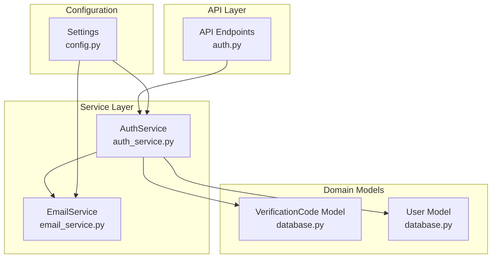
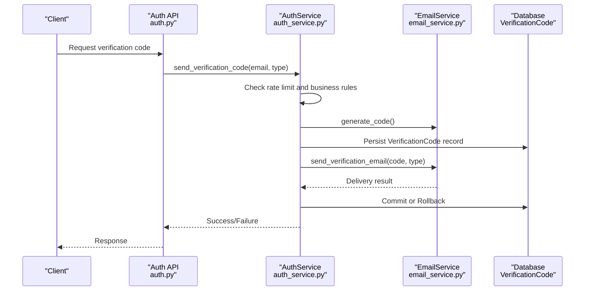
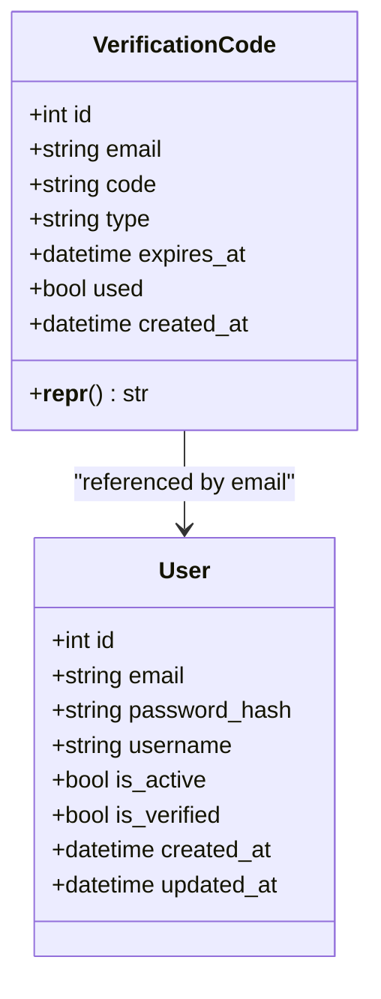
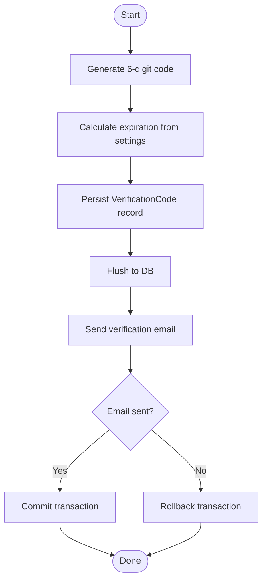
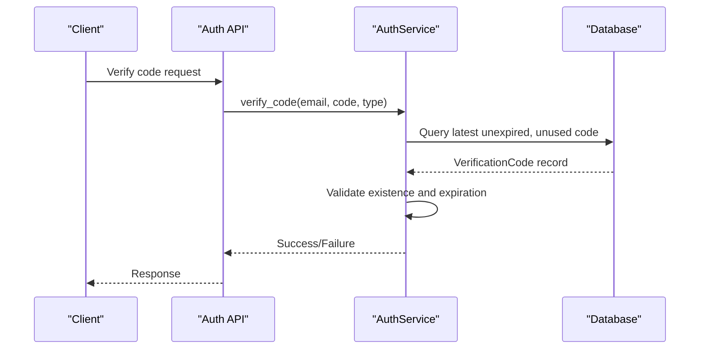
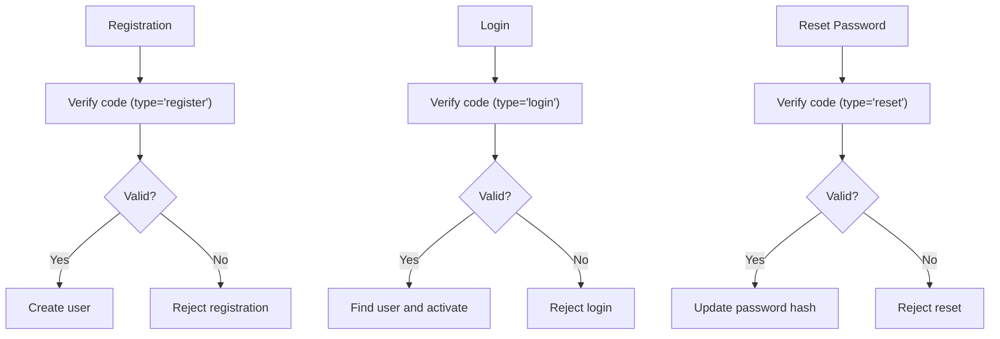
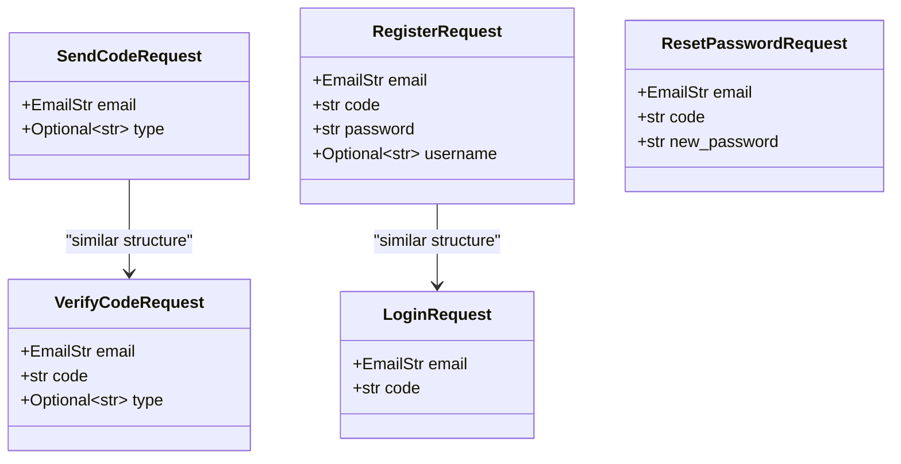
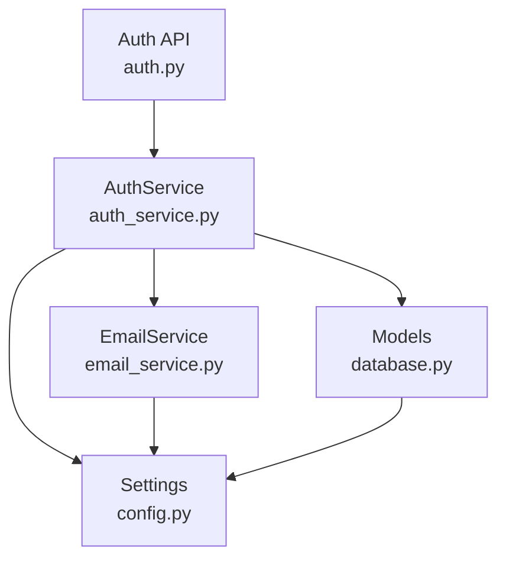

# Verification Code Model

<cite>
**Referenced Files in This Document**
- [database.py](file://backend/app/models/database.py)
- [auth_service.py](file://backend/app/services/auth_service.py)
- [auth.py](file://backend/app/api/v1/auth.py)
- [email_service.py](file://backend/app/services/email_service.py)
- [config.py](file://backend/app/core/config.py)
- [auth.py](file://backend/app/schemas/auth.py)
</cite>

## Table of Contents
1. [Introduction](#introduction)
2. [Project Structure](#project-structure)
3. [Core Components](#core-components)
4. [Architecture Overview](#architecture-overview)
5. [Detailed Component Analysis](#detailed-component-analysis)
6. [Dependency Analysis](#dependency-analysis)
7. [Performance Considerations](#performance-considerations)
8. [Troubleshooting Guide](#troubleshooting-guide)
9. [Conclusion](#conclusion)

## Introduction
This document provides comprehensive documentation for the VerificationCode model used for email verification and authentication. It covers the model structure, verification workflow, expiration handling, security considerations, database constraints, indexing strategies, and cleanup procedures for expired codes. It also includes examples of code generation, validation, and error handling patterns for common verification scenarios.

## Project Structure
The verification system spans several layers:
- Model definition for VerificationCode and related entities
- Service layer implementing business logic for sending, validating, and consuming verification codes
- API endpoints exposing verification-related operations
- Email service responsible for generating and sending verification emails
- Configuration settings controlling rate limits and expiration policies

**Diagram sources**
- [auth.py:1-316](file://backend/app/api/v1/auth.py#L1-L316)
- [auth_service.py:1-358](file://backend/app/services/auth_service.py#L1-L358)
- [email_service.py:1-226](file://backend/app/services/email_service.py#L1-L226)
- [database.py:47-69](file://backend/app/models/database.py#L47-L69)
- [config.py:10-105](file://backend/app/core/config.py#L10-L105)

**Section sources**
- [auth.py:1-316](file://backend/app/api/v1/auth.py#L1-L316)
- [auth_service.py:1-358](file://backend/app/services/auth_service.py#L1-L358)
- [email_service.py:1-226](file://backend/app/services/email_service.py#L1-L226)
- [database.py:47-69](file://backend/app/models/database.py#L47-L69)
- [config.py:10-105](file://backend/app/core/config.py#L10-L105)

## Core Components
The VerificationCode model encapsulates the verification lifecycle with the following attributes:
- email: Recipient email address (indexed for efficient lookups)
- code: Six-digit verification code
- type: Type of verification ('register', 'login', or 'reset')
- expires_at: Expiration timestamp for the code
- used: Boolean flag indicating whether the code has been consumed
- created_at: Creation timestamp with server-side default

Key behaviors:
- Codes are generated with a fixed six-digit numeric format
- Expiration is controlled by configuration settings
- Validation ensures uniqueness per email/type and prevents reuse
- Rate limiting prevents abuse during code generation requests

Security considerations:
- Codes are single-use and marked as used upon successful validation
- Expiration prevents replay attacks
- Rate limiting mitigates brute-force attempts
- Email delivery order is carefully orchestrated to avoid orphaned codes

**Section sources**
- [database.py:47-69](file://backend/app/models/database.py#L47-L69)
- [auth_service.py:19-97](file://backend/app/services/auth_service.py#L19-L97)
- [email_service.py:35-46](file://backend/app/services/email_service.py#L35-L46)
- [config.py:52-60](file://backend/app/core/config.py#L52-L60)

## Architecture Overview
The verification workflow integrates API endpoints, service logic, and persistence:

**Diagram sources**
- [auth.py:25-53](file://backend/app/api/v1/auth.py#L25-L53)
- [auth_service.py:19-97](file://backend/app/services/auth_service.py#L19-L97)
- [email_service.py:48-154](file://backend/app/services/email_service.py#L48-L154)
- [database.py:47-69](file://backend/app/models/database.py#L47-L69)

## Detailed Component Analysis

### VerificationCode Model
The VerificationCode entity defines the verification record structure and persistence behavior.

**Diagram sources**
- [database.py:47-69](file://backend/app/models/database.py#L47-L69)
- [database.py:13-44](file://backend/app/models/database.py#L13-L44)

Model characteristics:
- Primary key: Auto-incremented integer identifier
- Indexes: email column is indexed for fast lookups
- Constraints: Non-null fields for email, code, type, and expires_at
- Defaults: created_at uses server-side timestamp; used defaults to false
- Relationships: VerificationCode records are associated with User via email

**Section sources**
- [database.py:47-69](file://backend/app/models/database.py#L47-L69)

### Code Generation and Email Delivery
The system generates six-digit numeric codes and sends them via email with careful transaction management.

**Diagram sources**
- [auth_service.py:69-97](file://backend/app/services/auth_service.py#L69-L97)
- [email_service.py:35-46](file://backend/app/services/email_service.py#L35-L46)
- [config.py:52-60](file://backend/app/core/config.py#L52-L60)

Generation process:
- Code generation uses numeric digits only, ensuring predictable six-character length
- Expiration calculation uses configurable minutes from settings
- Transaction ordering: write to database before sending email to prevent orphaned records
- Failure handling: rollback on email delivery failure

**Section sources**
- [auth_service.py:69-97](file://backend/app/services/auth_service.py#L69-L97)
- [email_service.py:35-46](file://backend/app/services/email_service.py#L35-L46)
- [config.py:52-60](file://backend/app/core/config.py#L52-L60)

### Verification Workflow
Validation follows a strict sequence to ensure correctness and security.

**Diagram sources**
- [auth.py:56-85](file://backend/app/api/v1/auth.py#L56-L85)
- [auth_service.py:99-140](file://backend/app/services/auth_service.py#L99-L140)

Validation logic:
- Queries the most recent unexpired, unused code for the given email/type
- Compares the provided code against stored value
- Checks expiration against current UTC time
- Returns appropriate error messages for invalid states

**Section sources**
- [auth_service.py:99-140](file://backend/app/services/auth_service.py#L99-L140)
- [auth.py:56-85](file://backend/app/api/v1/auth.py#L56-L85)

### Registration, Login, and Password Reset Workflows
Each workflow demonstrates distinct validation and consumption patterns.

**Diagram sources**
- [auth_service.py:142-200](file://backend/app/services/auth_service.py#L142-L200)
- [auth_service.py:202-251](file://backend/app/services/auth_service.py#L202-L251)
- [auth_service.py:288-340](file://backend/app/services/auth_service.py#L288-L340)

Key behaviors:
- Registration validates code type 'register' and creates a new user account
- Login validates code type 'login' and authenticates existing users
- Password reset validates code type 'reset' and updates credentials
- All successful verifications mark the code as used to prevent reuse

**Section sources**
- [auth_service.py:142-200](file://backend/app/services/auth_service.py#L142-L200)
- [auth_service.py:202-251](file://backend/app/services/auth_service.py#L202-L251)
- [auth_service.py:288-340](file://backend/app/services/auth_service.py#L288-L340)

### API Endpoints and Request Validation
The API layer enforces request schemas and type constraints.

**Diagram sources**
- [auth.py:10-28](file://backend/app/schemas/auth.py#L10-L28)
- [auth.py:31-43](file://backend/app/schemas/auth.py#L31-L43)
- [auth.py:91-95](file://backend/app/schemas/auth.py#L91-L95)

Endpoint behavior:
- Enforce type field constraints for each operation
- Validate payload structure using Pydantic models
- Return structured error responses for invalid requests

**Section sources**
- [auth.py:10-28](file://backend/app/schemas/auth.py#L10-L28)
- [auth.py:31-43](file://backend/app/schemas/auth.py#L31-L43)
- [auth.py:91-95](file://backend/app/schemas/auth.py#L91-L95)

## Dependency Analysis
The verification system exhibits clear separation of concerns with minimal coupling.

**Diagram sources**
- [auth.py:1-316](file://backend/app/api/v1/auth.py#L1-L316)
- [auth_service.py:1-358](file://backend/app/services/auth_service.py#L1-L358)
- [email_service.py:1-226](file://backend/app/services/email_service.py#L1-L226)
- [database.py:1-70](file://backend/app/models/database.py#L1-L70)
- [config.py:1-105](file://backend/app/core/config.py#L1-L105)

Dependencies:
- API depends on AuthService for business logic
- AuthService depends on EmailService for delivery and on models for persistence
- All components depend on Settings for configuration
- No circular dependencies detected

**Section sources**
- [auth.py:1-316](file://backend/app/api/v1/auth.py#L1-L316)
- [auth_service.py:1-358](file://backend/app/services/auth_service.py#L1-L358)
- [email_service.py:1-226](file://backend/app/services/email_service.py#L1-L226)
- [database.py:1-70](file://backend/app/models/database.py#L1-L70)
- [config.py:1-105](file://backend/app/core/config.py#L1-L105)

## Performance Considerations
Indexing strategy:
- email column is indexed to accelerate verification queries
- Composite filtering by email, code, type, and used status optimizes lookup performance

Rate limiting:
- 5-minute sliding window limits requests per email/type
- Prevents abuse while maintaining usability

Expiration handling:
- Expiration checks occur at validation time
- Expired codes are effectively unusable due to database constraints

Cleanup procedures:
- No automated cleanup job is implemented in the current codebase
- Expired codes remain in the database but are filtered out by validation logic
- Consider implementing periodic cleanup jobs for production deployments

## Troubleshooting Guide
Common error scenarios and resolutions:

Frequency limit exceeded:
- Cause: More than configured requests within 5 minutes
- Resolution: Wait for cooldown period or reduce request frequency

Email already registered:
- Cause: Attempting registration with existing email
- Resolution: Use login flow or choose another email

Email not registered:
- Cause: Attempting password reset for unregistered email
- Resolution: Complete registration first

Invalid verification code:
- Cause: Wrong code, expired, or already used
- Resolution: Request a new code or verify input accuracy

Email delivery failures:
- Cause: SMTP configuration issues or network problems
- Resolution: Check SMTP settings and connectivity

Expired verification code:
- Cause: Validation attempted after expiration
- Resolution: Generate a new verification code

**Section sources**
- [auth_service.py:36-97](file://backend/app/services/auth_service.py#L36-L97)
- [auth_service.py:99-140](file://backend/app/services/auth_service.py#L99-L140)
- [email_service.py:120-154](file://backend/app/services/email_service.py#L120-L154)

## Conclusion
The VerificationCode model provides a robust foundation for email-based authentication with strong security controls, clear separation of concerns, and comprehensive validation logic. Its design balances usability with security through rate limiting, expiration enforcement, and careful transaction management. While the current implementation focuses on correctness and security, production deployments may benefit from additional cleanup procedures for expired records and enhanced monitoring capabilities.