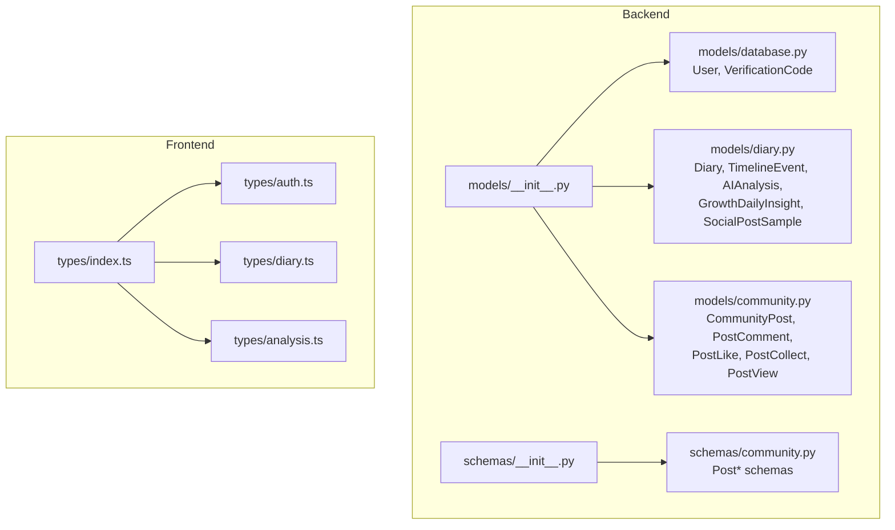
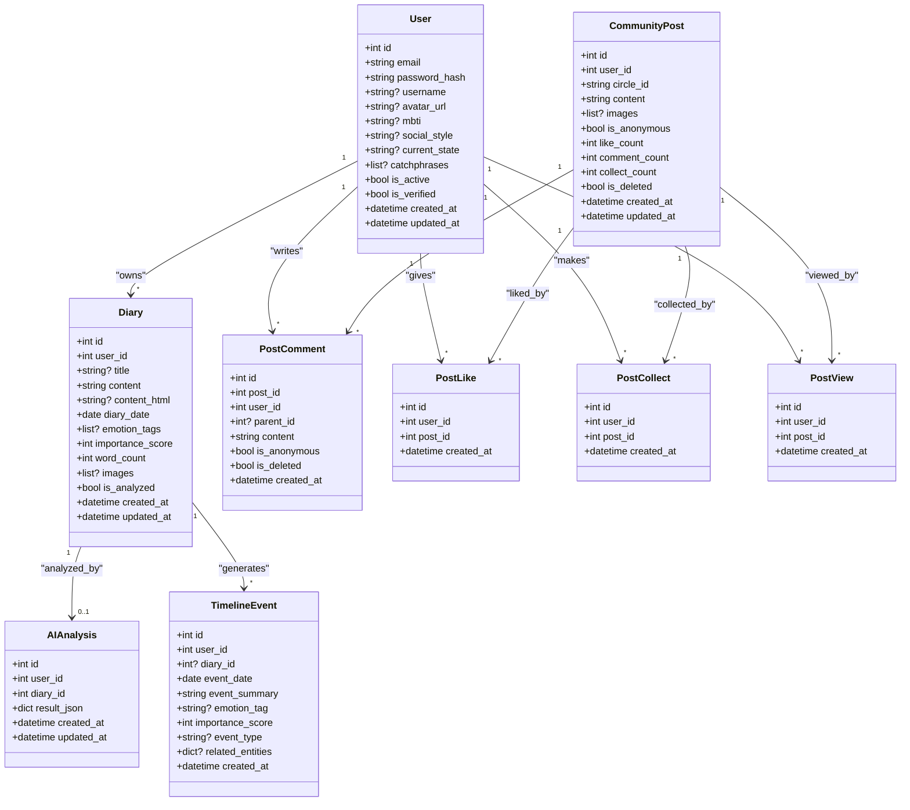
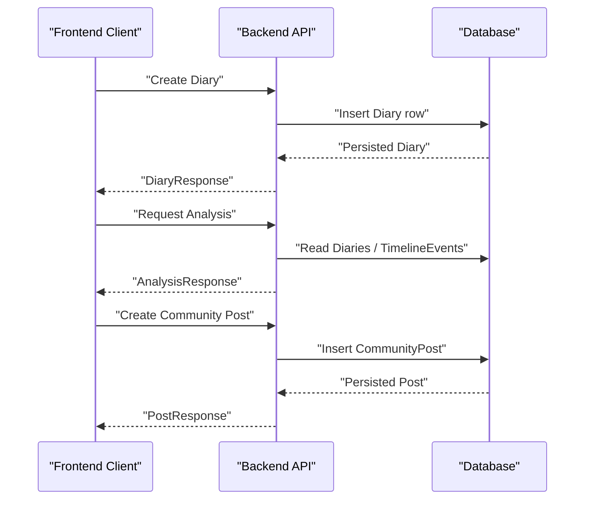
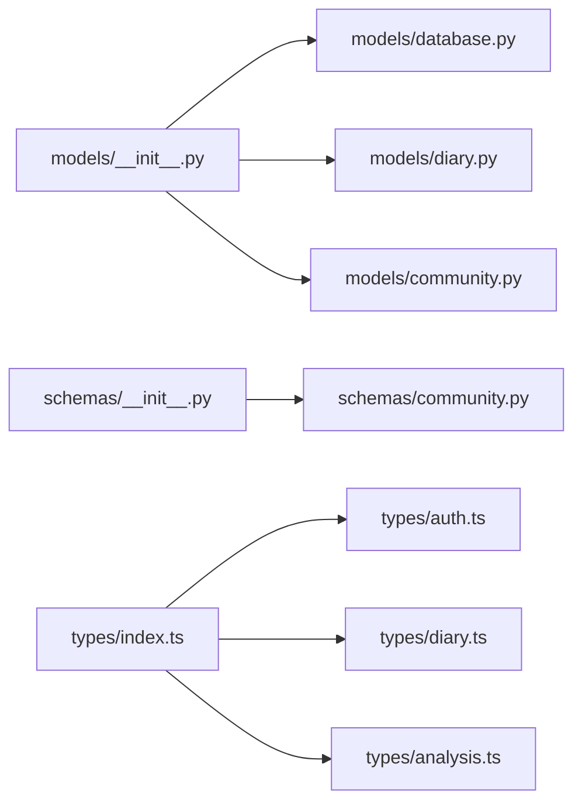

# Data Models and Schemas

<cite>
**Referenced Files in This Document**
- [backend/app/models/__init__.py](file://backend/app/models/__init__.py)
- [backend/app/models/database.py](file://backend/app/models/database.py)
- [backend/app/models/diary.py](file://backend/app/models/diary.py)
- [backend/app/models/community.py](file://backend/app/models/community.py)
- [backend/app/schemas/__init__.py](file://backend/app/schemas/__init__.py)
- [backend/app/schemas/community.py](file://backend/app/schemas/community.py)
- [frontend/src/types/index.ts](file://frontend/src/types/index.ts)
- [frontend/src/types/auth.ts](file://frontend/src/types/auth.ts)
- [frontend/src/types/diary.ts](file://frontend/src/types/diary.ts)
- [frontend/src/types/analysis.ts](file://frontend/src/types/analysis.ts)
</cite>

## Table of Contents
1. [Introduction](#introduction)
2. [Project Structure](#project-structure)
3. [Core Components](#core-components)
4. [Architecture Overview](#architecture-overview)
5. [Detailed Component Analysis](#detailed-component-analysis)
6. [Dependency Analysis](#dependency-analysis)
7. [Performance Considerations](#performance-considerations)
8. [Troubleshooting Guide](#troubleshooting-guide)
9. [Conclusion](#conclusion)
10. [Appendices](#appendices)

## Introduction
This document provides comprehensive data model documentation for the 映记 application. It covers backend database models (User, Diary, TimelineEvent, AIAnalysis, CommunityPost and related entities), frontend TypeScript types for integration, and Pydantic schemas used for API validation and serialization. It also explains relationships, constraints, indexing strategies, data lifecycle, and migration considerations.

## Project Structure
The data model layer is split into three parts:
- Backend SQLAlchemy models define persistent entities and relationships.
- Backend Pydantic schemas define API request/response validation and serialization.
- Frontend TypeScript types define client-side data contracts for authentication, diary, analysis, and community features.



**Diagram sources**
- [backend/app/models/__init__.py:1-8](file://backend/app/models/__init__.py#L1-L8)
- [backend/app/models/database.py:1-70](file://backend/app/models/database.py#L1-L70)
- [backend/app/models/diary.py:1-186](file://backend/app/models/diary.py#L1-L186)
- [backend/app/models/community.py:1-176](file://backend/app/models/community.py#L1-L176)
- [backend/app/schemas/__init__.py:1-49](file://backend/app/schemas/__init__.py#L1-L49)
- [backend/app/schemas/community.py:1-124](file://backend/app/schemas/community.py#L1-L124)
- [frontend/src/types/index.ts:1-4](file://frontend/src/types/index.ts#L1-L4)
- [frontend/src/types/auth.ts:1-45](file://frontend/src/types/auth.ts#L1-L45)
- [frontend/src/types/diary.ts:1-128](file://frontend/src/types/diary.ts#L1-L128)
- [frontend/src/types/analysis.ts:1-142](file://frontend/src/types/analysis.ts#L1-L142)

**Section sources**
- [backend/app/models/__init__.py:1-8](file://backend/app/models/__init__.py#L1-L8)
- [backend/app/schemas/__init__.py:1-49](file://backend/app/schemas/__init__.py#L1-L49)
- [frontend/src/types/index.ts:1-4](file://frontend/src/types/index.ts#L1-L4)

## Core Components
This section documents the core entities and their fields, constraints, and relationships.

### User Model
- Purpose: Stores user account information and profile attributes.
- Fields:
  - id: integer, primary key, auto-increment
  - email: string, unique, indexed, not null
  - password_hash: string, not null
  - username: string
  - avatar_url: string
  - mbti: string
  - social_style: string
  - current_state: string
  - catchphrases: JSON array, default empty list
  - is_active: boolean, default true
  - is_verified: boolean, default false
  - created_at, updated_at: timestamps with timezone
- Indexes: email (unique)
- Constraints: unique email
- Notes: VerificationCode is linked via email.

**Section sources**
- [backend/app/models/database.py:13-44](file://backend/app/models/database.py#L13-L44)

### Diary Model
- Purpose: Stores user-written diary entries.
- Fields:
  - id: integer, primary key, auto-increment
  - user_id: integer, foreign key to users.id with cascade delete, indexed, not null
  - title: string up to 200
  - content: text, not null
  - content_html: text
  - diary_date: date, not null, indexed
  - emotion_tags: JSON list (custom converter ensures list storage)
  - importance_score: integer, default 5, not null
  - word_count: integer, default 0
  - images: JSON list (custom converter)
  - is_analyzed: boolean, default false
  - created_at, updated_at: timestamps with timezone
- Indexes: user_id, diary_date
- Constraints: none explicit except defaults
- Notes: Used by TimelineEvent and AIAnalysis.

**Section sources**
- [backend/app/models/diary.py:29-64](file://backend/app/models/diary.py#L29-L64)

### TimelineEvent Model
- Purpose: Aggregated life events derived from diaries.
- Fields:
  - id: integer, primary key, auto-increment
  - user_id: integer, foreign key to users.id with cascade delete, indexed, not null
  - diary_id: integer, foreign key to diaries.id with set null, nullable
  - event_date: date, not null, indexed
  - event_summary: string up to 500, not null
  - emotion_tag: string up to 50, indexed
  - importance_score: integer, default 5, not null
  - event_type: string up to 50 (work/relationship/health/achievement)
  - related_entities: JSON
  - created_at: timestamp with timezone
- Indexes: user_id, event_date, emotion_tag
- Constraints: none explicit except defaults
- Notes: Links to Diary via optional foreign key.

**Section sources**
- [backend/app/models/diary.py:67-99](file://backend/app/models/diary.py#L67-L99)

### AIAnalysis Model
- Purpose: Stores the latest AI analysis per diary.
- Fields:
  - id: integer, primary key, auto-increment
  - user_id: integer, foreign key to users.id with cascade delete, indexed, not null
  - diary_id: integer, foreign key to diaries.id with cascade delete, indexed, unique
  - result_json: JSON, not null
  - created_at, updated_at: timestamps with timezone
- Indexes: user_id, diary_id (unique)
- Constraints: unique(diary_id)
- Notes: One-to-one with Diary via unique diary_id.

**Section sources**
- [backend/app/models/diary.py:102-132](file://backend/app/models/diary.py#L102-L132)

### CommunityPost and Related Entities
- CommunityPost:
  - id: integer, primary key, auto-increment
  - user_id: integer, foreign key to users.id with cascade delete, indexed, not null
  - circle_id: string up to 20, indexed, not null (anxiety/sadness/growth/peace/confusion)
  - content: text, not null
  - images: JSON array, default empty list
  - is_anonymous: boolean, default false
  - like_count, comment_count, collect_count: integers, defaults 0
  - is_deleted: boolean, default false
  - created_at, updated_at: timestamps with timezone
  - Indexes: user_id, circle_id
- PostComment:
  - id, post_id (FK to posts), user_id (FK to users), parent_id (self-referencing FK), content, is_anonymous, is_deleted
  - created_at: timestamp with timezone
  - Indexes: post_id, user_id, parent_id
- PostLike:
  - user_id, post_id (unique constraint on both)
  - created_at: timestamp with timezone
  - UniqueConstraint: (user_id, post_id)
- PostCollect:
  - user_id, post_id (unique constraint on both)
  - created_at: timestamp with timezone
  - UniqueConstraint: (user_id, post_id)
- PostView:
  - user_id, post_id
  - created_at: timestamp with timezone
  - Indexes: user_id, post_id

**Section sources**
- [backend/app/models/community.py:23-175](file://backend/app/models/community.py#L23-L175)

### Additional Supporting Models
- GrowthDailyInsight:
  - user_id, insight_date (unique constraint with user_id), primary_emotion, summary, source, timestamps
  - UniqueConstraint: (user_id, insight_date)
- SocialPostSample:
  - user_id, content, created_at

**Section sources**
- [backend/app/models/diary.py:135-185](file://backend/app/models/diary.py#L135-L185)

## Architecture Overview
The data model architecture follows a layered design:
- Backend ORM models define persistence and relationships.
- Pydantic schemas validate and serialize API requests/responses.
- Frontend TypeScript types align with backend schemas for type-safe integration.



**Diagram sources**
- [backend/app/models/database.py:13-44](file://backend/app/models/database.py#L13-L44)
- [backend/app/models/diary.py:29-132](file://backend/app/models/diary.py#L29-L132)
- [backend/app/models/community.py:23-175](file://backend/app/models/community.py#L23-L175)

## Detailed Component Analysis

### Backend ORM Models and Relationships
- User-Diary: One-to-many; deletion cascades.
- Diary-AIAnalysis: One-to-one via unique diary_id.
- Diary-TimelineEvent: Zero-or-one-to-many; optional linkage via diary_id.
- CommunityPost-PostComment: One-to-many; replies supported via parent_id self-reference.
- PostLike/PostCollect: Many-to-many via unique constraints.
- PostView: Tracks per-user post views.

```mermaid
erDiagram
USERS {
int id PK
string email UK
string password_hash
string? username
string? avatar_url
string? mbti
string? social_style
string? current_state
json? catchphrases
bool is_active
bool is_verified
timestamp created_at
timestamp updated_at
}
DIARIES {
int id PK
int user_id FK
string? title
text content
text? content_html
date diary_date
json? emotion_tags
int importance_score
int word_count
json? images
bool is_analyzed
timestamp created_at
timestamp updated_at
}
TIMELINE_EVENTS {
int id PK
int user_id FK
int? diary_id FK
date event_date
string event_summary
string? emotion_tag
int importance_score
string? event_type
json? related_entities
timestamp created_at
}
AI_ANALYSES {
int id PK
int user_id FK
int diary_id FK UK
json result_json
timestamp created_at
timestamp updated_at
}
COMMUNITY_POSTS {
int id PK
int user_id FK
string circle_id
text content
json? images
bool is_anonymous
int like_count
int comment_count
int collect_count
bool is_deleted
timestamp created_at
timestamp updated_at
}
POST_COMMENTS {
int id PK
int post_id FK
int user_id FK
int? parent_id FK
text content
bool is_anonymous
bool is_deleted
timestamp created_at
}
POST_LIKES {
int id PK
int user_id FK
int post_id FK
timestamp created_at
}
POST_COLLECTS {
int id PK
int user_id FK
int post_id FK
timestamp created_at
}
POST_VIEWS {
int id PK
int user_id FK
int post_id FK
timestamp created_at
}
USERS ||--o{ DIARIES : "owns"
DIARIES ||--|| AI_ANALYSES : "analyzed_by"
DIARIES ||--o{ TIMELINE_EVENTS : "generates"
COMMUNITY_POSTS ||--o{ POST_COMMENTS : "contains"
USERS ||--o{ POST_COMMENTS : "writes"
USERS ||--o{ POST_LIKES : "gives"
COMMUNITY_POSTS ||--o{ POST_LIKES : "liked_by"
USERS ||--o{ POST_COLLECTS : "makes"
COMMUNITY_POSTS ||--o{ POST_COLLECTS : "collected_by"
USERS ||--o{ POST_VIEWS : "views"
COMMUNITY_POSTS ||--o{ POST_VIEWS : "viewed_by"
```

**Diagram sources**
- [backend/app/models/database.py:13-44](file://backend/app/models/database.py#L13-L44)
- [backend/app/models/diary.py:29-132](file://backend/app/models/diary.py#L29-L132)
- [backend/app/models/community.py:23-175](file://backend/app/models/community.py#L23-L175)

**Section sources**
- [backend/app/models/database.py:13-44](file://backend/app/models/database.py#L13-L44)
- [backend/app/models/diary.py:29-132](file://backend/app/models/diary.py#L29-L132)
- [backend/app/models/community.py:23-175](file://backend/app/models/community.py#L23-L175)

### Pydantic Schemas for API Validation and Serialization
- Authentication schemas: request/response for send code, verify code, register, login, token response, user response, and update.
- Diary schemas: create/update/response/list, and timeline event create/response.
- AI analysis schemas: request/response, timeline event response, Satir analysis response, and social post response.
- Community schemas: post create/update/response/list, comment create/response/list, circle info, and view history response.

Validation rules and constraints are enforced at the API boundary via Pydantic Field definitions and BaseModel configurations.

**Section sources**
- [backend/app/schemas/__init__.py:1-49](file://backend/app/schemas/__init__.py#L1-L49)
- [backend/app/schemas/community.py:1-124](file://backend/app/schemas/community.py#L1-L124)

### Frontend TypeScript Types for Integration
- Authentication types: User, LoginRequest/LoginResponse, RegisterRequest, SendCodeRequest, VerifyCodeRequest.
- Diary types: Diary, DiaryCreate, DiaryUpdate, DiaryListResponse, TimelineEvent, emotion stats, terrain types (points, peaks, valleys, insights, meta), and growth daily insight.
- Analysis types: AnalysisRequest, comprehensive analysis request/response, evidence item, daily guidance response, social style samples response, timeline event analysis, layers (emotion/cognitive/belief/core self), Satir analysis, social post, analysis metadata, and analysis response.

These types align with backend schemas to ensure consistent data contracts across the stack.

**Section sources**
- [frontend/src/types/index.ts:1-4](file://frontend/src/types/index.ts#L1-L4)
- [frontend/src/types/auth.ts:1-45](file://frontend/src/types/auth.ts#L1-L45)
- [frontend/src/types/diary.ts:1-128](file://frontend/src/types/diary.ts#L1-L128)
- [frontend/src/types/analysis.ts:1-142](file://frontend/src/types/analysis.ts#L1-L142)

### Data Flow Patterns
- Diary creation triggers timeline event generation and optional AI analysis.
- Community posts are authored by users and can be liked/collected/commented on.
- Analytics pipeline aggregates diary data and produces structured analysis outputs.



[No sources needed since this diagram shows conceptual workflow, not actual code structure]

## Dependency Analysis
- Backend models are exposed via a central init module for imports.
- Pydantic schemas are re-exported for API modules.
- Frontend types are re-exported via index.ts for consumption across pages/services.



**Diagram sources**
- [backend/app/models/__init__.py:1-8](file://backend/app/models/__init__.py#L1-L8)
- [backend/app/schemas/__init__.py:1-49](file://backend/app/schemas/__init__.py#L1-L49)
- [frontend/src/types/index.ts:1-4](file://frontend/src/types/index.ts#L1-L4)

**Section sources**
- [backend/app/models/__init__.py:1-8](file://backend/app/models/__init__.py#L1-L8)
- [backend/app/schemas/__init__.py:1-49](file://backend/app/schemas/__init__.py#L1-L49)
- [frontend/src/types/index.ts:1-4](file://frontend/src/types/index.ts#L1-L4)

## Performance Considerations
- Indexing:
  - Users: email (unique)
  - Diaries: user_id, diary_date
  - TimelineEvents: user_id, event_date, emotion_tag
  - AIAnalyses: user_id, unique(diary_id)
  - CommunityPosts: user_id, circle_id
  - PostComments: post_id, user_id, parent_id
  - PostLikes/PostCollects: unique(user_id, post_id)
  - PostViews: user_id, post_id
- JSON fields:
  - emotion_tags, images (diary), images (community post), related_entities (timeline), catchphrases (user), result_json (AI analysis) are stored as JSON; consider normalization if frequent filtering by nested keys is required.
- Timestamps:
  - All timestamps use timezone-aware datetimes to avoid ambiguity.
- Cascading:
  - Cascade deletes on user/diary ensure referential integrity but can be expensive for bulk deletions; batch operations recommended.
- Pagination:
  - Community post list and view history responses support pagination; tune page_size for performance.

[No sources needed since this section provides general guidance]

## Troubleshooting Guide
- Unique constraint violations:
  - AIAnalysis: unique(diary_id); ensure one analysis per diary.
  - PostLike/PostCollect: unique(user_id, post_id); prevent duplicate actions.
  - GrowthDailyInsight: unique(user_id, insight_date); avoid duplicates per day.
- Foreign key errors:
  - Deleting users or diaries with cascade deletes; ensure dependent records are handled.
- JSON conversion:
  - emotion_tags/images use a custom converter ensuring list storage; ensure inputs conform to list semantics.
- Timezone handling:
  - All timestamps include timezone; ensure client/server handle timezones consistently.

**Section sources**
- [backend/app/models/diary.py:102-132](file://backend/app/models/diary.py#L102-L132)
- [backend/app/models/diary.py:156-161](file://backend/app/models/diary.py#L156-L161)
- [backend/app/models/community.py:94-121](file://backend/app/models/community.py#L94-L121)
- [backend/app/models/community.py:123-149](file://backend/app/models/community.py#L123-L149)

## Conclusion
The 映记 data model layer provides a robust foundation for diary, timeline, AI analysis, and community features. Backend ORM models define clear relationships and constraints, while Pydantic schemas enforce API validation. Frontend TypeScript types maintain strong typing across the stack. Proper indexing and lifecycle management ensure scalability and reliability.

## Appendices

### Data Lifecycle Management
- Creation: Users sign up and verify; diaries are authored; community posts/comments are created.
- Updates: Diaries, posts, and user profiles support updates; timestamps reflect changes.
- Deletion: Cascade deletes on user/diary; soft-delete flag exists for posts; likes/collects/views are cleaned up via cascade.
- Archival/Caching: AI analysis and growth insights are cached per diary/user; ensure invalidation on updates.

[No sources needed since this section provides general guidance]

### Migration Procedures and Versioning
- Schema changes:
  - Add new columns with defaults; consider nullable=false only after data backfill.
  - Add indexes for new query patterns; monitor impact on write performance.
- Backward compatibility:
  - Keep JSON fields flexible; avoid strict schemas that break on missing keys.
  - Maintain stable API responses; deprecate fields with warnings rather than removal.
- Versioning:
  - Use semantic versioning for API responses; include version fields for evolving structures (e.g., social posts).
  - Track migrations with explicit upgrade/downgrade steps.

[No sources needed since this section provides general guidance]