# Analysis and Insights Types

<cite>
**Referenced Files in This Document**
- [analysis.ts](file://frontend/src/types/analysis.ts)
- [AnalysisResult.tsx](file://frontend/src/pages/analysis/AnalysisResult.tsx)
- [SatirIceberg.tsx](file://frontend/src/pages/analysis/SatirIceberg.tsx)
- [ai.service.ts](file://frontend/src/services/ai.service.ts)
- [ai.py](file://backend/app/api/v1/ai.py)
- [state.py](file://backend/app/agents/state.py)
- [agent_impl.py](file://backend/app/agents/agent_impl.py)
- [diary.ts](file://frontend/src/types/diary.ts)
- [Timeline.tsx](file://frontend/src/pages/timeline/Timeline.tsx)
- [EmotionChart.tsx](file://frontend/src/components/common/EmotionChart.tsx)
- [diaryStore.ts](file://frontend/src/store/diaryStore.ts)
- [authStore.ts](file://frontend/src/store/authStore.ts)
</cite>

## Table of Contents
1. [Introduction](#introduction)
2. [Project Structure](#project-structure)
3. [Core Components](#core-components)
4. [Architecture Overview](#architecture-overview)
5. [Detailed Component Analysis](#detailed-component-analysis)
6. [Dependency Analysis](#dependency-analysis)
7. [Performance Considerations](#performance-considerations)
8. [Troubleshooting Guide](#troubleshooting-guide)
9. [Conclusion](#conclusion)
10. [Appendices](#appendices)

## Introduction
This document provides comprehensive documentation for the analysis and psychological insights TypeScript types used by the frontend to render AI-driven insights. It covers:
- General analysis outputs and metadata
- The Satir Iceberg Model implementation
- Trend analysis types (emotional trends, activity patterns)
- AI analysis response types, evidence extraction, and reasoning chain metadata
- Statistical analysis types (frequency distributions, correlation analysis, predictive modeling)
- Visualization data types for chart rendering and data transformation
- Export format types
- Analysis validation, quality assessment, and confidence interval types
- Integration patterns with frontend components and state management

## Project Structure
The analysis types are primarily defined in the frontend TypeScript types and consumed by React components and services. Backend endpoints produce structured JSON responses that the frontend consumes and renders.

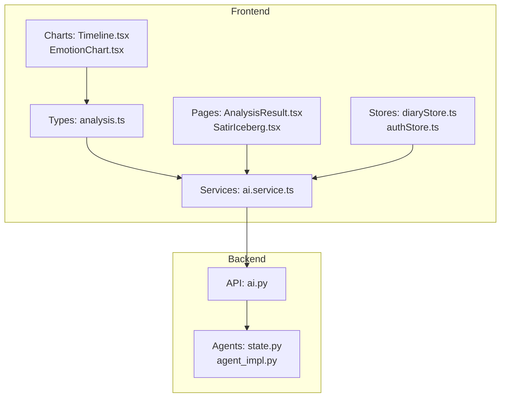

**Diagram sources**
- [analysis.ts:1-142](file://frontend/src/types/analysis.ts#L1-L142)
- [ai.service.ts:1-112](file://frontend/src/services/ai.service.ts#L1-L112)
- [AnalysisResult.tsx:1-410](file://frontend/src/pages/analysis/AnalysisResult.tsx#L1-L410)
- [SatirIceberg.tsx:1-216](file://frontend/src/pages/analysis/SatirIceberg.tsx#L1-L216)
- [ai.py:1-902](file://backend/app/api/v1/ai.py#L1-L902)
- [state.py:1-45](file://backend/app/agents/state.py#L1-L45)
- [agent_impl.py:231-335](file://backend/app/agents/agent_impl.py#L231-L335)
- [diaryStore.ts:1-164](file://frontend/src/store/diaryStore.ts#L1-L164)
- [authStore.ts:92-145](file://frontend/src/store/authStore.ts#L92-L145)
- [Timeline.tsx:58-484](file://frontend/src/pages/timeline/Timeline.tsx#L58-L484)
- [EmotionChart.tsx:161-188](file://frontend/src/components/common/EmotionChart.tsx#L161-L188)

**Section sources**
- [analysis.ts:1-142](file://frontend/src/types/analysis.ts#L1-L142)
- [ai.service.ts:1-112](file://frontend/src/services/ai.service.ts#L1-L112)
- [ai.py:1-902](file://backend/app/api/v1/ai.py#L1-L902)

## Core Components
This section documents the core TypeScript types used for analysis and insights.

- AnalysisRequest: Request parameters for single-diary analysis with optional anchor, window size, and maximum diary count.
- ComprehensiveAnalysisRequest: Request parameters for user-integrated analysis with window size, maximum diary count, and optional focus.
- EvidenceItem: Structured evidence used to support analysis conclusions, including diary linkage, snippet, reason, and score.
- ComprehensiveAnalysisResponse: Aggregated insights including summary, key themes, emotion trends, continuity signals, turning points, growth suggestions, and evidence with metadata.
- DailyGuidanceResponse: Personalized daily writing prompt with source indicator and metadata.
- SocialStyleSamplesResponse: Aggregated social media post style samples with counts and metadata.
- TimelineEventAnalysis: Extracted timeline event with summary, emotion tag, importance score, type, and related entities.
- EmotionLayer: Surface emotion, underlying emotion, intensity, and description.
- CognitiveLayer: Non-rational beliefs, automatic thoughts, and cognitive patterns.
- BeliefLayer: Core beliefs, life rules, and value systems.
- CoreSelfLayer: Deeper desire, universal needs, and life energy.
- SatirAnalysis: Complete five-layer analysis combining behavior, emotion, cognition, belief, and core self layers.
- SocialPost: Version, style, and content of generated social posts.
- AnalysisMetadata: Processing time, current step, error, scope, analyzed diary counts and periods, workflow steps, agent runs, and persistence warnings.
- AnalysisResponse: Final analysis result including timeline event, Satir analysis, therapeutic response, social posts, and metadata.

These types define the shape of data flowing from backend endpoints to frontend components and stores.

**Section sources**
- [analysis.ts:3-141](file://frontend/src/types/analysis.ts#L3-L141)

## Architecture Overview
The frontend composes analysis results from multiple backend endpoints and renders them via dedicated pages and components. The backend orchestrates multi-agent analysis and returns structured JSON.

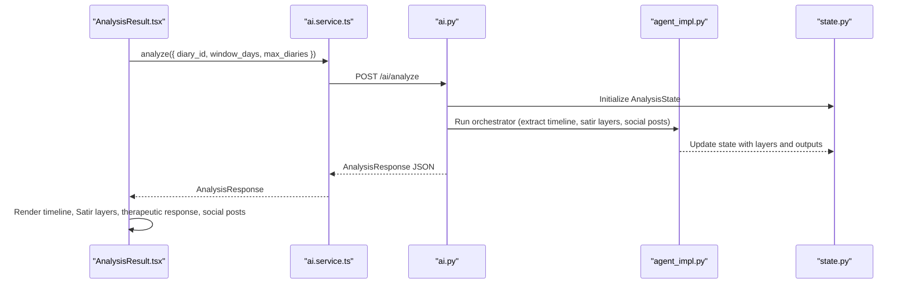

**Diagram sources**
- [AnalysisResult.tsx:33-78](file://frontend/src/pages/analysis/AnalysisResult.tsx#L33-L78)
- [ai.service.ts:16-19](file://frontend/src/services/ai.service.ts#L16-L19)
- [ai.py:406-638](file://backend/app/api/v1/ai.py#L406-L638)
- [state.py:10-45](file://backend/app/agents/state.py#L10-L45)
- [agent_impl.py:231-335](file://backend/app/agents/agent_impl.py#L231-L335)

## Detailed Component Analysis

### AnalysisResult Page Integration
The AnalysisResult page orchestrates loading, analyzing, and rendering of a single-diary analysis. It handles loading states, errors, and copying social posts to clipboard.

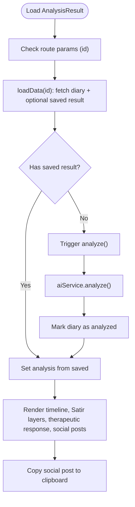

**Diagram sources**
- [AnalysisResult.tsx:27-117](file://frontend/src/pages/analysis/AnalysisResult.tsx#L27-L117)
- [ai.service.ts:16-19](file://frontend/src/services/ai.service.ts#L16-L19)

**Section sources**
- [AnalysisResult.tsx:16-398](file://frontend/src/pages/analysis/AnalysisResult.tsx#L16-L398)
- [ai.service.ts:14-111](file://frontend/src/services/ai.service.ts#L14-L111)

### Satir Iceberg Visualization
The SatirIceberg component renders the five-layer model with expandable cards and layered visuals.

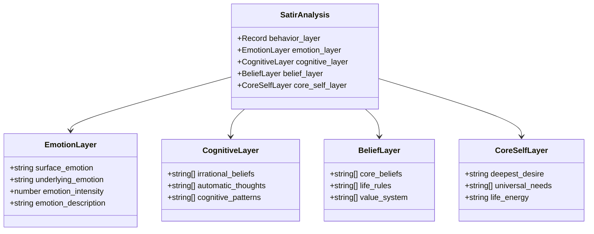

**Diagram sources**
- [analysis.ts:66-97](file://frontend/src/types/analysis.ts#L66-L97)
- [SatirIceberg.tsx:6-87](file://frontend/src/pages/analysis/SatirIceberg.tsx#L6-L87)

**Section sources**
- [SatirIceberg.tsx:10-215](file://frontend/src/pages/analysis/SatirIceberg.tsx#L10-L215)
- [analysis.ts:66-97](file://frontend/src/types/analysis.ts#L66-L97)

### Backend Orchestration and State
The backend orchestrator initializes AnalysisState and executes agents for timeline extraction and Satir layers. The state defines the structure of intermediate and final outputs.

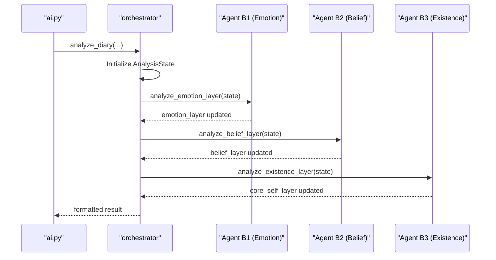

**Diagram sources**
- [ai.py:47-90](file://backend/app/api/v1/ai.py#L47-L90)
- [state.py:10-45](file://backend/app/agents/state.py#L10-L45)
- [agent_impl.py:231-335](file://backend/app/agents/agent_impl.py#L231-L335)

**Section sources**
- [ai.py:47-90](file://backend/app/api/v1/ai.py#L47-L90)
- [state.py:10-45](file://backend/app/agents/state.py#L10-L45)
- [agent_impl.py:231-335](file://backend/app/agents/agent_impl.py#L231-L335)

### Trend Analysis Types
The frontend integrates terrain-based insights and charts to visualize emotional trends and activity patterns.

- TerrainPoint: Daily point with date, energy, valence, density, and events.
- TerrainPeak: Local peak with date, value, label, and summary.
- TerrainValley: Local low with date range, min value, days, label, and summary.
- TerrainInsights: Peaks, valleys, trend direction, and description.
- TerrainMeta: Period and counts metadata.
- TerrainResponse: Points, insights, and meta.
- GrowthDailyInsight: Daily insight with date, primary emotion, summary, flags, and optional message.

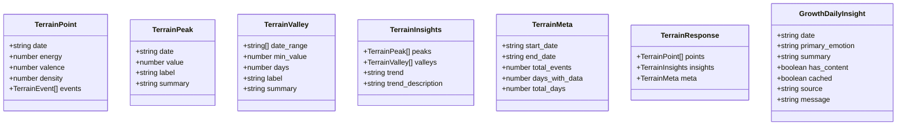

**Diagram sources**
- [diary.ts:75-127](file://frontend/src/types/diary.ts#L75-L127)

**Section sources**
- [diary.ts:75-127](file://frontend/src/types/diary.ts#L75-L127)
- [Timeline.tsx:58-484](file://frontend/src/pages/timeline/Timeline.tsx#L58-L484)
- [EmotionChart.tsx:161-188](file://frontend/src/components/common/EmotionChart.tsx#L161-L188)

### AI Analysis Response Types
The frontend consumes the following response types for rendering:

- AnalysisRequest and ComprehensiveAnalysisRequest for endpoint parameters.
- ComprehensiveAnalysisResponse for aggregated insights and evidence.
- AnalysisResponse for single-diary results including timeline event, Satir analysis, therapeutic response, social posts, and metadata.

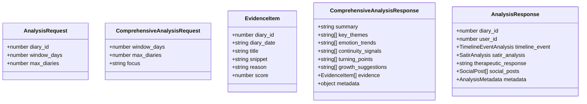

**Diagram sources**
- [analysis.ts:3-141](file://frontend/src/types/analysis.ts#L3-L141)

**Section sources**
- [analysis.ts:3-141](file://frontend/src/types/analysis.ts#L3-L141)
- [ai.service.ts:14-111](file://frontend/src/services/ai.service.ts#L14-L111)

### Evidence Extraction and Reasoning Chain Types
EvidenceItem supports structured evidence with diary linkage, snippet, reason, and score. Metadata tracks retrieval strategy, ranking formula, and analyzed period.

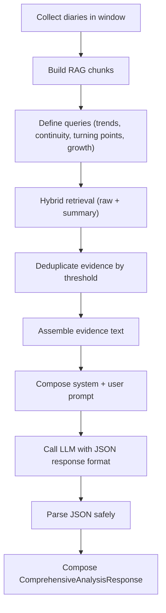

**Diagram sources**
- [ai.py:267-403](file://backend/app/api/v1/ai.py#L267-L403)
- [analysis.ts:15-44](file://frontend/src/types/analysis.ts#L15-L44)

**Section sources**
- [ai.py:267-403](file://backend/app/api/v1/ai.py#L267-L403)
- [analysis.ts:15-44](file://frontend/src/types/analysis.ts#L15-L44)

### Statistical Analysis Types
The project includes types for frequency distributions (e.g., emotion tags), correlation analysis (via terrain energy/valence), and predictive modeling (e.g., trend direction). These are represented by:
- Frequency distributions: emotion tags and counts
- Correlation analysis: terrain energy vs. valence
- Predictive modeling: trend classification (ascending, descending, stable, overall)

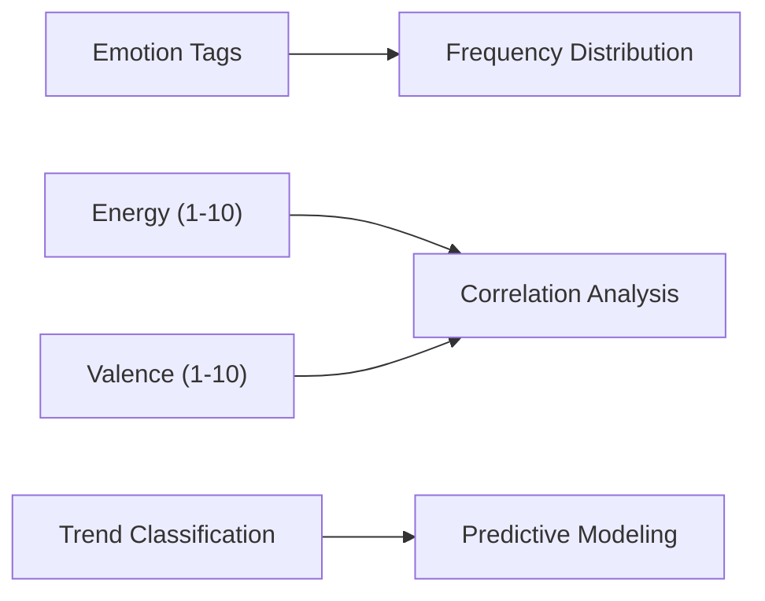

[No sources needed since this diagram shows conceptual workflow, not actual code structure]

**Section sources**
- [diary.ts:75-127](file://frontend/src/types/diary.ts#L75-L127)
- [Timeline.tsx:58-484](file://frontend/src/pages/timeline/Timeline.tsx#L58-L484)

### Visualization Data Types
Visualization components consume structured data:
- Timeline chart data derived from TerrainResponse points
- Emotion bubble chart data computed from emotion distributions
- Recharts-based area chart for energy trends

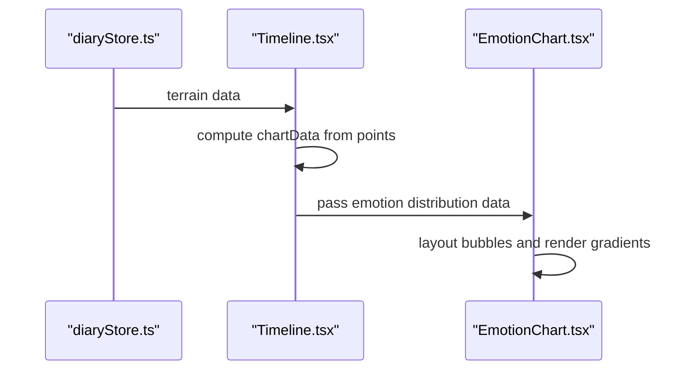

**Diagram sources**
- [diaryStore.ts:1-164](file://frontend/src/store/diaryStore.ts#L1-L164)
- [Timeline.tsx:175-191](file://frontend/src/pages/timeline/Timeline.tsx#L175-L191)
- [EmotionChart.tsx:161-188](file://frontend/src/components/common/EmotionChart.tsx#L161-L188)

**Section sources**
- [diaryStore.ts:1-164](file://frontend/src/store/diaryStore.ts#L1-L164)
- [Timeline.tsx:175-191](file://frontend/src/pages/timeline/Timeline.tsx#L175-L191)
- [EmotionChart.tsx:161-188](file://frontend/src/components/common/EmotionChart.tsx#L161-L188)

### Export Format Types
Export formats are not explicitly defined in the codebase. The frontend currently supports copying social posts to clipboard and does not expose explicit export endpoints. Any export functionality would likely reuse the AnalysisResponse structure and present it in a downloadable format.

[No sources needed since this section provides general guidance]

### Analysis Validation, Quality Assessment, and Confidence Intervals
Validation and quality checks are embedded in the backend:
- JSON parsing safeguards for LLM outputs
- Deduplication thresholds for evidence
- Metadata includes retrieval strategy and ranking formula
- Agent runs logging with status and timing

Quality assessment is implicit through:
- Evidence scoring and deduplication
- Retrieval strategy metadata
- Agent run logs and error propagation

Confidence intervals are not explicitly modeled in the codebase. They could be introduced as optional metadata in EvidenceItem or AnalysisMetadata to quantify certainty.

**Section sources**
- [ai.py:34-80](file://backend/app/api/v1/ai.py#L34-L80)
- [analysis.ts:105-131](file://frontend/src/types/analysis.ts#L105-L131)

### Integration Patterns with Frontend Components and State Management
- ai.service.ts encapsulates API calls for analysis, comprehensive analysis, social posts, and daily guidance.
- AnalysisResult.tsx orchestrates loading, analyzing, and rendering of AnalysisResponse.
- SatirIceberg.tsx renders the five-layer Satir model with expandable cards.
- diaryStore.ts manages diary lists, current diary, timeline events, and emotion statistics.
- authStore.ts manages authentication state and persists credentials.

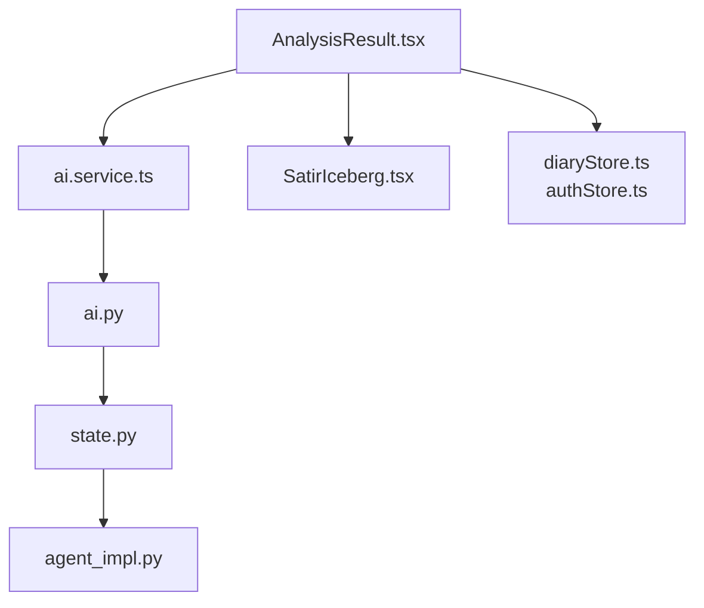

**Diagram sources**
- [ai.service.ts:14-111](file://frontend/src/services/ai.service.ts#L14-L111)
- [ai.py:406-638](file://backend/app/api/v1/ai.py#L406-L638)
- [state.py:10-45](file://backend/app/agents/state.py#L10-L45)
- [agent_impl.py:231-335](file://backend/app/agents/agent_impl.py#L231-L335)
- [AnalysisResult.tsx:16-398](file://frontend/src/pages/analysis/AnalysisResult.tsx#L16-L398)
- [SatirIceberg.tsx:10-215](file://frontend/src/pages/analysis/SatirIceberg.tsx#L10-L215)
- [diaryStore.ts:36-163](file://frontend/src/store/diaryStore.ts#L36-L163)
- [authStore.ts:92-145](file://frontend/src/store/authStore.ts#L92-L145)

**Section sources**
- [ai.service.ts:14-111](file://frontend/src/services/ai.service.ts#L14-L111)
- [AnalysisResult.tsx:16-398](file://frontend/src/pages/analysis/AnalysisResult.tsx#L16-L398)
- [SatirIceberg.tsx:10-215](file://frontend/src/pages/analysis/SatirIceberg.tsx#L10-L215)
- [diaryStore.ts:36-163](file://frontend/src/store/diaryStore.ts#L36-L163)
- [authStore.ts:92-145](file://frontend/src/store/authStore.ts#L92-L145)

## Dependency Analysis
The frontend depends on TypeScript types to strongly type API responses and component props. The ai.service.ts module centralizes API interactions, while pages and components depend on these types for rendering.

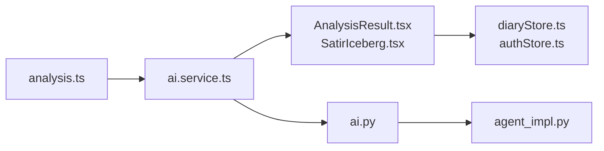

**Diagram sources**
- [analysis.ts:1-142](file://frontend/src/types/analysis.ts#L1-L142)
- [ai.service.ts:1-112](file://frontend/src/services/ai.service.ts#L1-L112)
- [AnalysisResult.tsx:1-410](file://frontend/src/pages/analysis/AnalysisResult.tsx#L1-L410)
- [SatirIceberg.tsx:1-216](file://frontend/src/pages/analysis/SatirIceberg.tsx#L1-L216)
- [diaryStore.ts:1-164](file://frontend/src/store/diaryStore.ts#L1-L164)
- [authStore.ts:92-145](file://frontend/src/store/authStore.ts#L92-L145)
- [ai.py:1-902](file://backend/app/api/v1/ai.py#L1-L902)
- [agent_impl.py:231-335](file://backend/app/agents/agent_impl.py#L231-L335)

**Section sources**
- [analysis.ts:1-142](file://frontend/src/types/analysis.ts#L1-L142)
- [ai.service.ts:1-112](file://frontend/src/services/ai.service.ts#L1-L112)

## Performance Considerations
- Token limits: The backend caps combined content length and diary counts to manage LLM context sizes.
- Deduplication thresholds: Evidence deduplication reduces redundancy and improves relevance.
- Caching: GrowthDailyInsight includes a cached flag to avoid recomputation.
- Visualization: Recharts-based charts compute data transformations efficiently; ensure large datasets are paginated.

[No sources needed since this section provides general guidance]

## Troubleshooting Guide
Common issues and remedies:
- Empty or missing analysis results: Verify diary exists and is analyzed; check persisted result endpoint.
- JSON parsing failures: Backend includes robust parsing for LLM outputs; inspect metadata for error details.
- Persistence warnings: Metadata may include warnings when saving results or updating timeline events.
- Authentication errors: Ensure authStore is initialized and token is present.

**Section sources**
- [ai.py:689-710](file://backend/app/api/v1/ai.py#L689-L710)
- [analysis.ts:105-131](file://frontend/src/types/analysis.ts#L105-L131)
- [authStore.ts:92-145](file://frontend/src/store/authStore.ts#L92-L145)

## Conclusion
The analysis and insights types provide a cohesive contract between frontend and backend, enabling structured rendering of AI-driven psychological insights. The five-layer Satir model, trend analysis, and visualization components form a comprehensive view of user experiences over time. Extending these types with explicit confidence intervals and export formats would further enhance reliability and usability.

## Appendices
- API endpoints used by ai.service.ts:
  - POST /ai/analyze
  - POST /ai/analyze-async
  - POST /ai/satir-analysis
  - POST /ai/social-posts
  - POST /ai/comprehensive-analysis
  - GET /ai/daily-guidance
  - GET /ai/social-style-samples
  - PUT /ai/social-style-samples
  - GET /ai/analyses
  - GET /ai/result/{diary_id}

**Section sources**
- [ai.service.ts:14-111](file://frontend/src/services/ai.service.ts#L14-L111)
- [ai.py:83-800](file://backend/app/api/v1/ai.py#L83-L800)