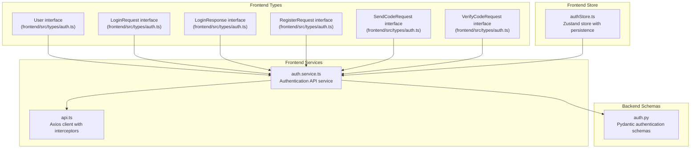
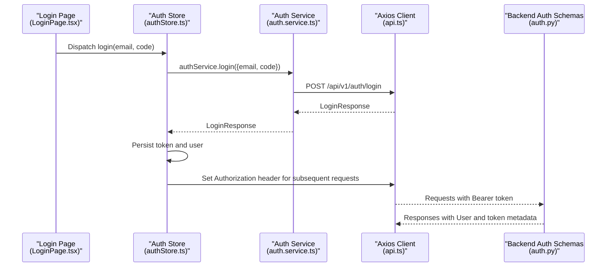
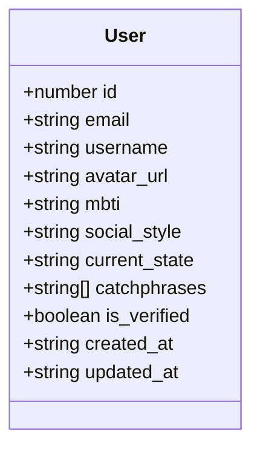
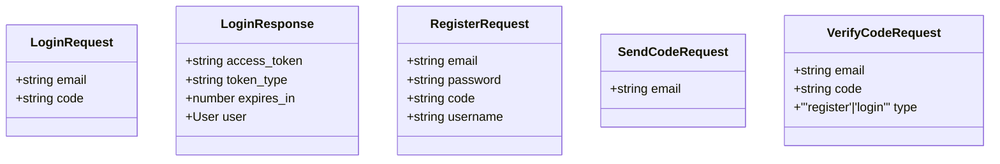
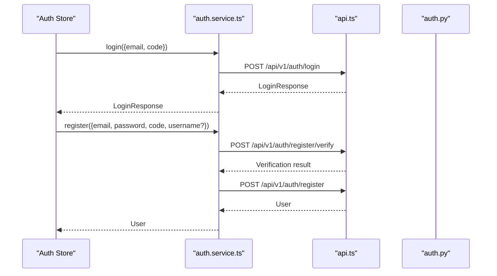
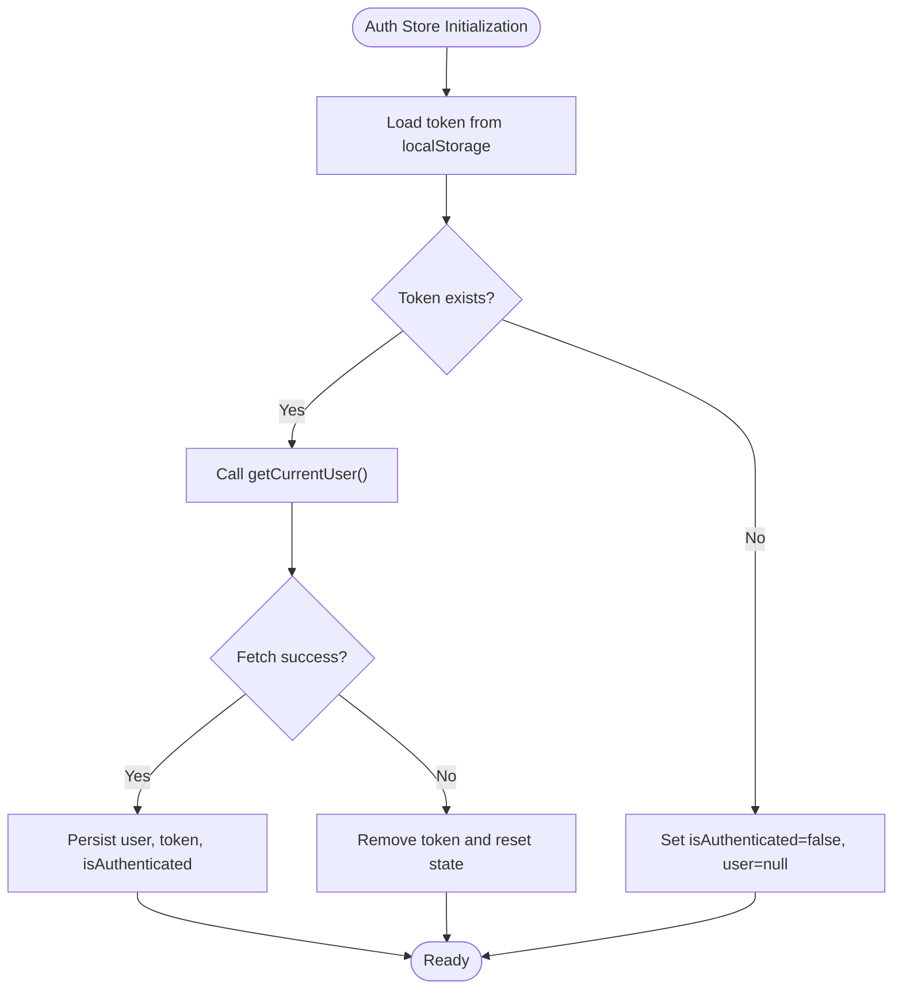
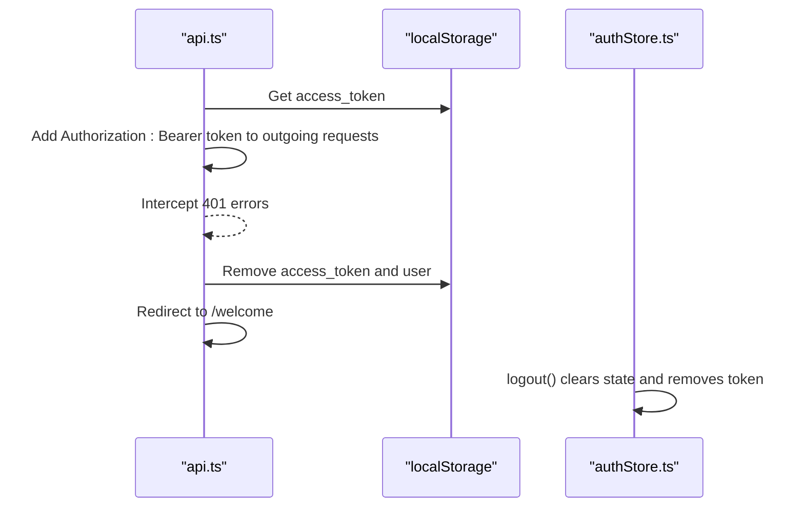
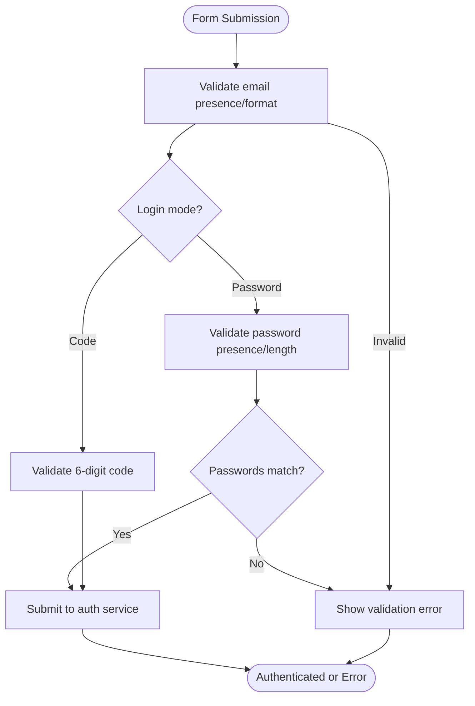
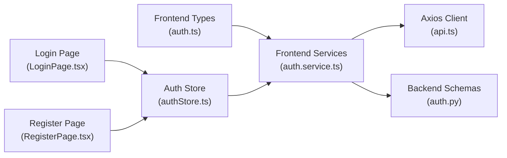

# Authentication Types

<cite>
**Referenced Files in This Document**
- [auth.ts](file://frontend/src/types/auth.ts)
- [auth.service.ts](file://frontend/src/services/auth.service.ts)
- [authStore.ts](file://frontend/src/store/authStore.ts)
- [api.ts](file://frontend/src/services/api.ts)
- [LoginPage.tsx](file://frontend/src/pages/auth/LoginPage.tsx)
- [RegisterPage.tsx](file://frontend/src/pages/auth/RegisterPage.tsx)
- [auth.py](file://backend/app/schemas/auth.py)
</cite>

## Table of Contents
1. [Introduction](#introduction)
2. [Project Structure](#project-structure)
3. [Core Components](#core-components)
4. [Architecture Overview](#architecture-overview)
5. [Detailed Component Analysis](#detailed-component-analysis)
6. [Dependency Analysis](#dependency-analysis)
7. [Performance Considerations](#performance-considerations)
8. [Troubleshooting Guide](#troubleshooting-guide)
9. [Conclusion](#conclusion)

## Introduction
This document provides comprehensive documentation for authentication-related TypeScript types in the frontend application. It covers the User interface and related authentication interfaces, JWT token handling, session persistence, form validation patterns, and error handling mechanisms. The goal is to enable developers to understand and extend the authentication system while maintaining type safety and consistent UX behavior.

## Project Structure
Authentication types and logic are organized across three primary areas:
- Frontend types define the shape of authentication data exchanged between the client and server.
- Frontend services encapsulate API calls for authentication operations.
- Frontend stores manage authentication state, tokens, and loading/error states.

**Diagram sources**
- [auth.ts:1-45](file://frontend/src/types/auth.ts#L1-L45)
- [auth.service.ts:1-100](file://frontend/src/services/auth.service.ts#L1-L100)
- [api.ts:1-43](file://frontend/src/services/api.ts#L1-L43)
- [authStore.ts:1-146](file://frontend/src/store/authStore.ts#L1-L146)
- [auth.py:1-106](file://backend/app/schemas/auth.py#L1-L106)

**Section sources**
- [auth.ts:1-45](file://frontend/src/types/auth.ts#L1-L45)
- [auth.service.ts:1-100](file://frontend/src/services/auth.service.ts#L1-L100)
- [api.ts:1-43](file://frontend/src/services/api.ts#L1-L43)
- [authStore.ts:1-146](file://frontend/src/store/authStore.ts#L1-L146)
- [auth.py:1-106](file://backend/app/schemas/auth.py#L1-L106)

## Core Components
This section documents the core TypeScript types used for authentication.

- User
  - Purpose: Represents a logged-in user profile.
  - Properties:
    - id: number
    - email: string
    - username?: string
    - avatar_url?: string
    - mbti?: string
    - social_style?: string
    - current_state?: string
    - catchphrases?: string[]
    - is_verified: boolean
    - created_at: string (ISO 8601 timestamp)
    - updated_at: string (ISO 8601 timestamp)
  - Notes: Several properties are optional to support flexible user profiles. Timestamps are represented as strings to match backend serialization.

- LoginRequest
  - Purpose: Payload for code-based login.
  - Properties:
    - email: string
    - code: string
  - Notes: Used by both code-based and password-based login flows.

- LoginResponse
  - Purpose: Response after successful login.
  - Properties:
    - access_token: string
    - token_type: string
    - expires_in: number
    - user: User
  - Notes: Includes user profile and token metadata.

- RegisterRequest
  - Purpose: Payload for user registration.
  - Properties:
    - email: string
    - password: string
    - code: string
    - username?: string
  - Notes: Username is optional during registration.

- SendCodeRequest
  - Purpose: Request to send a verification code.
  - Properties:
    - email: string
  - Notes: Used for login, register, and reset-password flows.

- VerifyCodeRequest
  - Purpose: Request to verify a sent code.
  - Properties:
    - email: string
    - code: string
    - type: 'register' | 'login'
  - Notes: Supports explicit type selection for verification.

**Section sources**
- [auth.ts:3-15](file://frontend/src/types/auth.ts#L3-L15)
- [auth.ts:17-27](file://frontend/src/types/auth.ts#L17-L27)
- [auth.ts:29-34](file://frontend/src/types/auth.ts#L29-L34)
- [auth.ts:36-38](file://frontend/src/types/auth.ts#L36-L38)
- [auth.ts:40-44](file://frontend/src/types/auth.ts#L40-L44)

## Architecture Overview
The authentication architecture integrates frontend types, services, and stores with backend schemas. The frontend Axios client injects Authorization headers automatically and handles 401 responses centrally.

**Diagram sources**
- [LoginPage.tsx:1-263](file://frontend/src/pages/auth/LoginPage.tsx#L1-L263)
- [authStore.ts:1-146](file://frontend/src/store/authStore.ts#L1-L146)
- [auth.service.ts:1-100](file://frontend/src/services/auth.service.ts#L1-L100)
- [api.ts:1-43](file://frontend/src/services/api.ts#L1-L43)
- [auth.py:51-56](file://backend/app/schemas/auth.py#L51-L56)

## Detailed Component Analysis

### User Interface
The User interface defines the authenticated user's profile. It includes identity fields, optional personality attributes, verification status, and timestamps.

**Diagram sources**
- [auth.ts:3-15](file://frontend/src/types/auth.ts#L3-L15)

**Section sources**
- [auth.ts:3-15](file://frontend/src/types/auth.ts#L3-L15)

### Authentication Interfaces
These interfaces model request/response shapes for authentication operations.

**Diagram sources**
- [auth.ts:17-44](file://frontend/src/types/auth.ts#L17-L44)

**Section sources**
- [auth.ts:17-44](file://frontend/src/types/auth.ts#L17-L44)

### Authentication Service
The service layer abstracts API endpoints for authentication operations, including code-based login, password login, registration, and profile management.

**Diagram sources**
- [auth.service.ts:1-100](file://frontend/src/services/auth.service.ts#L1-L100)
- [api.ts:1-43](file://frontend/src/services/api.ts#L1-L43)
- [auth.py:31-37](file://backend/app/schemas/auth.py#L31-L37)

**Section sources**
- [auth.service.ts:1-100](file://frontend/src/services/auth.service.ts#L1-L100)

### Authentication State Management
The Zustand store manages authentication state, including user, token, loading, and error states. It persists selected state to localStorage and synchronizes with the backend.

**Diagram sources**
- [authStore.ts:107-132](file://frontend/src/store/authStore.ts#L107-L132)

**Section sources**
- [authStore.ts:1-146](file://frontend/src/store/authStore.ts#L1-L146)

### Token Management and Session Persistence
The Axios client injects the Authorization header for every request and handles 401 responses by clearing stored tokens and redirecting to the welcome page.

**Diagram sources**
- [api.ts:14-40](file://frontend/src/services/api.ts#L14-L40)
- [authStore.ts:92-105](file://frontend/src/store/authStore.ts#L92-L105)

**Section sources**
- [api.ts:1-43](file://frontend/src/services/api.ts#L1-L43)
- [authStore.ts:1-146](file://frontend/src/store/authStore.ts#L1-L146)

### Form Validation Types and Patterns
Frontend pages implement validation patterns for authentication forms:
- Email presence and format validation
- Password length and confirmation matching
- Code input sanitization (only digits, max length 6)
- Step-based registration flow with progress indicators

**Diagram sources**
- [LoginPage.tsx:22-58](file://frontend/src/pages/auth/LoginPage.tsx#L22-L58)
- [RegisterPage.tsx:44-72](file://frontend/src/pages/auth/RegisterPage.tsx#L44-L72)

**Section sources**
- [LoginPage.tsx:1-263](file://frontend/src/pages/auth/LoginPage.tsx#L1-L263)
- [RegisterPage.tsx:1-371](file://frontend/src/pages/auth/RegisterPage.tsx#L1-L371)

## Dependency Analysis
Authentication types depend on backend schemas to maintain consistency across the stack. The frontend types align with backend models to ensure seamless serialization/deserialization.

**Diagram sources**
- [auth.ts:1-45](file://frontend/src/types/auth.ts#L1-L45)
- [auth.service.ts:1-100](file://frontend/src/services/auth.service.ts#L1-L100)
- [api.ts:1-43](file://frontend/src/services/api.ts#L1-L43)
- [auth.py:1-106](file://backend/app/schemas/auth.py#L1-L106)
- [authStore.ts:1-146](file://frontend/src/store/authStore.ts#L1-L146)
- [LoginPage.tsx:1-263](file://frontend/src/pages/auth/LoginPage.tsx#L1-L263)
- [RegisterPage.tsx:1-371](file://frontend/src/pages/auth/RegisterPage.tsx#L1-L371)

**Section sources**
- [auth.ts:1-45](file://frontend/src/types/auth.ts#L1-L45)
- [auth.service.ts:1-100](file://frontend/src/services/auth.service.ts#L1-L100)
- [auth.py:1-106](file://backend/app/schemas/auth.py#L1-L106)

## Performance Considerations
- Minimize unnecessary re-renders by structuring store state granularly.
- Debounce or throttle repeated API calls (e.g., code resend) to reduce network overhead.
- Persist only essential state to localStorage to avoid bloating storage and improve hydration speed.
- Use optimistic updates for quick feedback during login/register flows, with rollback on failure.

## Troubleshooting Guide
Common issues and resolutions:
- 401 Unauthorized
  - Symptom: Automatic logout and redirection to the welcome page.
  - Cause: Expired or invalid token detected by the interceptor.
  - Resolution: Trigger re-authentication; ensure token is refreshed or reissued.
  - Reference: [api.ts:32-39](file://frontend/src/services/api.ts#L32-L39)

- Registration validation failures
  - Symptom: Form displays validation errors for missing fields or mismatched passwords.
  - Cause: Client-side validation prevents submission.
  - Resolution: Fix input values according to validation rules.
  - Reference: [RegisterPage.tsx:48-63](file://frontend/src/pages/auth/RegisterPage.tsx#L48-L63)

- Login failures
  - Symptom: Error messages appear after attempting login.
  - Cause: Invalid credentials or code, or backend error responses.
  - Resolution: Verify email/code/password and retry; inspect error state in the store.
  - Reference: [authStore.ts:43-49](file://frontend/src/store/authStore.ts#L43-L49)

- Token persistence issues
  - Symptom: User appears unauthenticated after refresh.
  - Cause: Missing or corrupted token in localStorage.
  - Resolution: Clear localStorage manually or trigger checkAuth to rehydrate state.
  - Reference: [authStore.ts:107-132](file://frontend/src/store/authStore.ts#L107-L132)

**Section sources**
- [api.ts:28-40](file://frontend/src/services/api.ts#L28-L40)
- [RegisterPage.tsx:44-72](file://frontend/src/pages/auth/RegisterPage.tsx#L44-L72)
- [authStore.ts:32-50](file://frontend/src/store/authStore.ts#L32-L50)
- [authStore.ts:107-132](file://frontend/src/store/authStore.ts#L107-L132)

## Conclusion
The authentication system combines strongly typed frontend models with robust service and store layers to deliver a reliable, type-safe login and registration experience. By aligning frontend types with backend schemas and leveraging centralized interceptors and state management, the system ensures consistent behavior across operations like code-based login, password login, registration, and session persistence. Extending the system should maintain these patterns to preserve type safety and user experience.