# Community Platform Types

<cite>
**Referenced Files in This Document**
- [community.service.ts](file://frontend/src/services/community.service.ts)
- [community.py](file://backend/app/schemas/community.py)
- [community.py](file://backend/app/models/community.py)
- [community.py](file://backend/app/api/v1/community.py)
- [CreatePostPage.tsx](file://frontend/src/pages/community/CreatePostPage.tsx)
</cite>

## Table of Contents
1. [Introduction](#introduction)
2. [Project Structure](#project-structure)
3. [Core Components](#core-components)
4. [Architecture Overview](#architecture-overview)
5. [Detailed Component Analysis](#detailed-component-analysis)
6. [Dependency Analysis](#dependency-analysis)
7. [Performance Considerations](#performance-considerations)
8. [Troubleshooting Guide](#troubleshooting-guide)
9. [Conclusion](#conclusion)

## Introduction
This document describes the TypeScript and Python types that define the community platform’s data models, API contracts, and frontend interactions. It focuses on:
- CommunityPost and Comment interfaces
- Content creation forms and validation
- Discovery and filtering parameters
- Engagement actions (likes, collections)
- Categories and tagging
- Moderation and anonymous modes
- Notification and activity feed concepts
- Anonymous user and reputation/ranking considerations
- Real-time update and social graph integration patterns

## Project Structure
The community platform spans a FastAPI backend and a React/TypeScript frontend. The backend defines Pydantic models and SQLAlchemy ORM entities for posts, comments, likes, collections, and views. The frontend defines TypeScript interfaces and service APIs that mirror backend contracts.

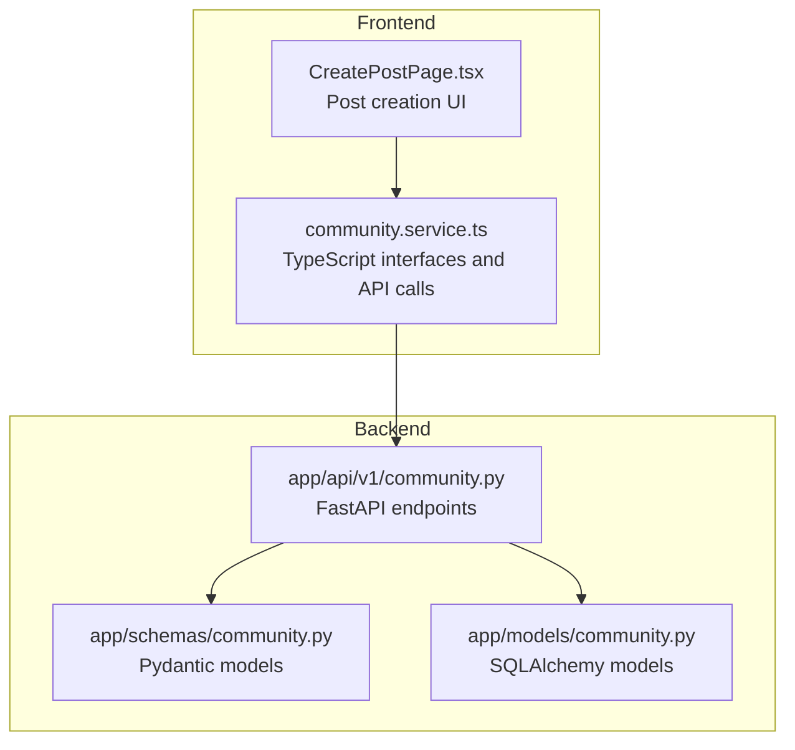

**Diagram sources**
- [community.service.ts:1-180](file://frontend/src/services/community.service.ts#L1-L180)
- [community.py:1-324](file://backend/app/api/v1/community.py#L1-L324)
- [community.py:1-124](file://backend/app/schemas/community.py#L1-L124)
- [community.py:1-176](file://backend/app/models/community.py#L1-L176)
- [CreatePostPage.tsx:1-210](file://frontend/src/pages/community/CreatePostPage.tsx#L1-L210)

**Section sources**
- [community.service.ts:1-180](file://frontend/src/services/community.service.ts#L1-L180)
- [community.py:1-324](file://backend/app/api/v1/community.py#L1-L324)
- [community.py:1-124](file://backend/app/schemas/community.py#L1-L124)
- [community.py:1-176](file://backend/app/models/community.py#L1-L176)
- [CreatePostPage.tsx:1-210](file://frontend/src/pages/community/CreatePostPage.tsx#L1-L210)

## Core Components
- CommunityPost interface: post content, author info, anonymous mode, engagement metrics
- Comment interface: threaded comments with parent-child hierarchy and author info
- PostFormData: content creation payload with validation rules and media attachments
- CommunityQueryParams: pagination and filtering for content discovery
- Engagement types: likes and collections toggles
- Categories and tagging: circles and post tagging
- Moderation: deletion and anonymous constraints
- Notifications and activity feeds: view history and collection lists
- Anonymous user and reputation/ranking: conceptual types for identity and scoring
- Real-time and social graph: integration patterns via service APIs

**Section sources**
- [community.service.ts:4-68](file://frontend/src/services/community.service.ts#L4-L68)
- [community.py:12-123](file://backend/app/schemas/community.py#L12-L123)
- [community.py:23-175](file://backend/app/models/community.py#L23-L175)
- [community.py:59-101](file://backend/app/api/v1/community.py#L59-L101)
- [CreatePostPage.tsx:53-78](file://frontend/src/pages/community/CreatePostPage.tsx#L53-L78)

## Architecture Overview
The frontend communicates with backend endpoints to manage posts, comments, likes, collections, and image uploads. Backend enforces validation and persistence via Pydantic and SQLAlchemy.

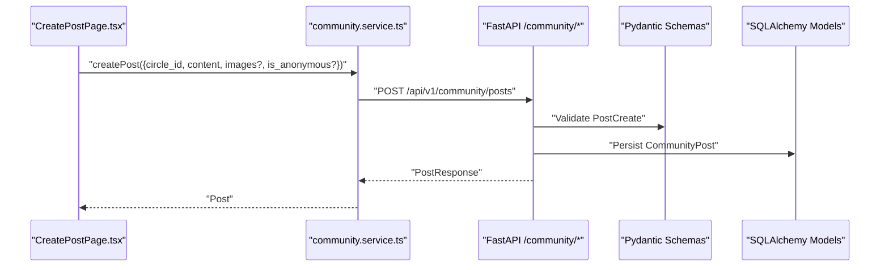

**Diagram sources**
- [CreatePostPage.tsx:65-70](file://frontend/src/pages/community/CreatePostPage.tsx#L65-L70)
- [community.service.ts:78-86](file://frontend/src/services/community.service.ts#L78-L86)
- [community.py:39-56](file://backend/app/api/v1/community.py#L39-L56)
- [community.py:12-17](file://backend/app/schemas/community.py#L12-L17)
- [community.py:23-54](file://backend/app/models/community.py#L23-L54)

## Detailed Component Analysis

### CommunityPost Interface
The frontend Post interface captures the essential attributes of a community post:
- Identity: id, circle_id
- Content: content, images[]
- Author: PostAuthor (id, username, avatar_url) or null (anonymous)
- Engagement: like_count, comment_count, collect_count, is_liked, is_collected
- Timestamps: created_at, updated_at

Backend PostResponse mirrors this structure and adds author resolution and counts.

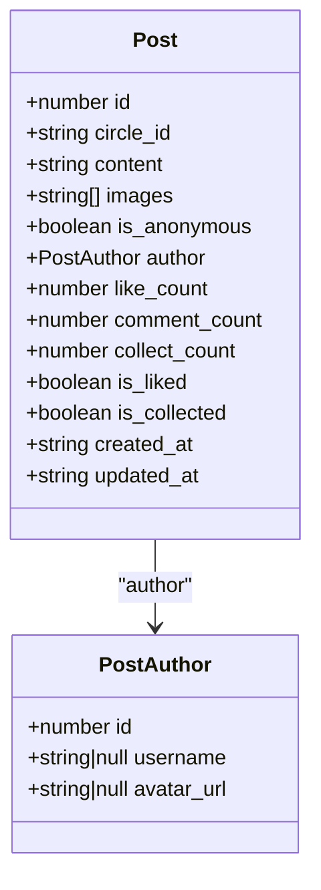

**Diagram sources**
- [community.service.ts:10-24](file://frontend/src/services/community.service.ts#L10-L24)
- [community.service.ts:4-8](file://frontend/src/services/community.service.ts#L4-L8)

**Section sources**
- [community.service.ts:10-24](file://frontend/src/services/community.service.ts#L10-L24)
- [community.py:33-47](file://backend/app/schemas/community.py#L33-L47)

### Comment Interface and Threaded Discussions
Comments support hierarchical replies via parent_id. The frontend Comment interface includes:
- Identity: id, post_id
- Content: content, is_anonymous, author
- Hierarchy: parent_id
- Timestamp: created_at

Backend CommentResponse and SQLAlchemy PostComment define the persisted structure and relationships.

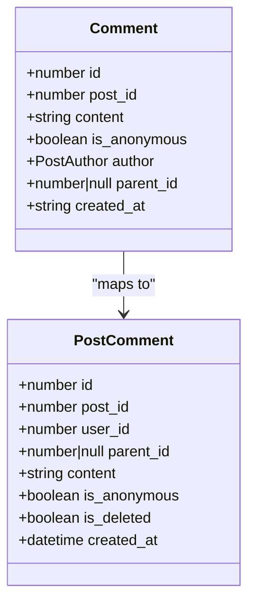

**Diagram sources**
- [community.service.ts:34-42](file://frontend/src/services/community.service.ts#L34-L42)
- [community.py:78-87](file://backend/app/schemas/community.py#L78-L87)
- [community.py:60-91](file://backend/app/models/community.py#L60-L91)

**Section sources**
- [community.service.ts:34-42](file://frontend/src/services/community.service.ts#L34-L42)
- [community.py:64-87](file://backend/app/schemas/community.py#L64-L87)
- [community.py:60-91](file://backend/app/models/community.py#L60-L91)

### PostFormData and Validation Rules
Post creation payload supports:
- circle_id: constrained to predefined circles
- content: length limits enforced
- images: array of URLs
- is_anonymous: boolean flag

Frontend validation ensures:
- Non-empty circle selection
- Content length within bounds
- Image count limit and types

Backend validation includes:
- Content length constraints
- Anonymous posts cannot be edited
- Image upload restrictions (types and size)

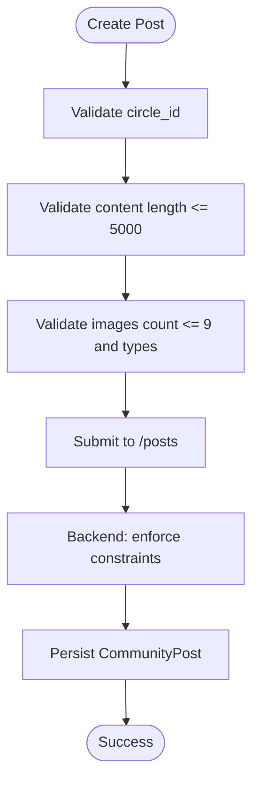

**Diagram sources**
- [CreatePostPage.tsx:53-78](file://frontend/src/pages/community/CreatePostPage.tsx#L53-L78)
- [community.service.ts:78-86](file://frontend/src/services/community.service.ts#L78-L86)
- [community.py:12-17](file://backend/app/schemas/community.py#L12-L17)
- [community.py:160-188](file://backend/app/api/v1/community.py#L160-L188)

**Section sources**
- [CreatePostPage.tsx:53-78](file://frontend/src/pages/community/CreatePostPage.tsx#L53-L78)
- [community.service.ts:78-86](file://frontend/src/services/community.service.ts#L78-L86)
- [community.py:12-17](file://backend/app/schemas/community.py#L12-L17)
- [community.py:160-188](file://backend/app/api/v1/community.py#L160-L188)

### CommunityQueryParams for Discovery, Sorting, and Filtering
Discovery endpoints support:
- Pagination: page, page_size with backend limits
- Filtering: circle_id query parameter
- Sorting: implicit by recency via backend ordering

Frontend service methods expose these parameters for fetching posts and collections.

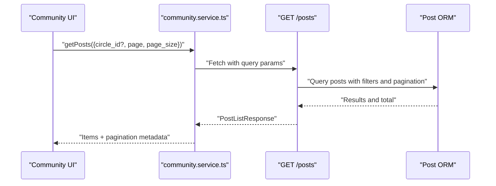

**Diagram sources**
- [community.service.ts:88-95](file://frontend/src/services/community.service.ts#L88-L95)
- [community.py:59-79](file://backend/app/api/v1/community.py#L59-L79)
- [community.py:23-54](file://backend/app/models/community.py#L23-L54)

**Section sources**
- [community.service.ts:88-95](file://frontend/src/services/community.service.ts#L88-L95)
- [community.py:59-79](file://backend/app/api/v1/community.py#L59-L79)

### Engagement Types: Likes and Collections
Engagement actions are exposed via service methods:
- Toggle like: returns liked status
- Toggle collection: returns collected status
- Retrieve collections list with pagination

Backend enforces uniqueness constraints for likes and collections.

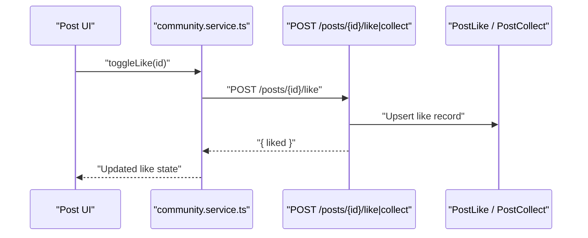

**Diagram sources**
- [community.service.ts:152-161](file://frontend/src/services/community.service.ts#L152-L161)
- [community.py:245-256](file://backend/app/api/v1/community.py#L245-L256)
- [community.py:94-121](file://backend/app/models/community.py#L94-L121)

**Section sources**
- [community.service.ts:152-161](file://frontend/src/services/community.service.ts#L152-L161)
- [community.py:245-256](file://backend/app/api/v1/community.py#L245-L256)
- [community.py:94-121](file://backend/app/models/community.py#L94-L121)

### Categories, Tagging Systems, and Moderation
- Categories: predefined circles (anxiety, sadness, growth, peace, confusion) with id, name, label, color, and post_count
- Tagging: posts may carry emotion tags (conceptual extension)
- Moderation: deletion flags for posts and comments; anonymous posts cannot be edited

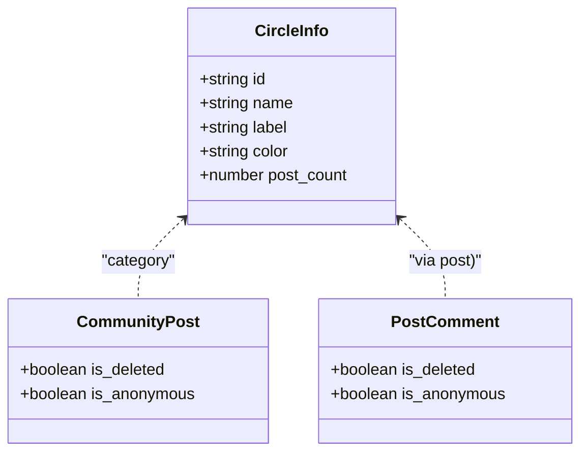

**Diagram sources**
- [community.py:100-106](file://backend/app/schemas/community.py#L100-L106)
- [community.py:23-54](file://backend/app/models/community.py#L23-L54)
- [community.py:60-91](file://backend/app/models/community.py#L60-L91)

**Section sources**
- [community.py:100-106](file://backend/app/schemas/community.py#L100-L106)
- [community.py:23-54](file://backend/app/models/community.py#L23-L54)
- [community.py:60-91](file://backend/app/models/community.py#L60-L91)

### Notifications, Subscriptions, and Activity Feed Types
- View history: records last view per post with pagination
- Collections: user-curated saved posts with pagination
- Conceptual notifications: could be modeled as activity events linked to posts and comments

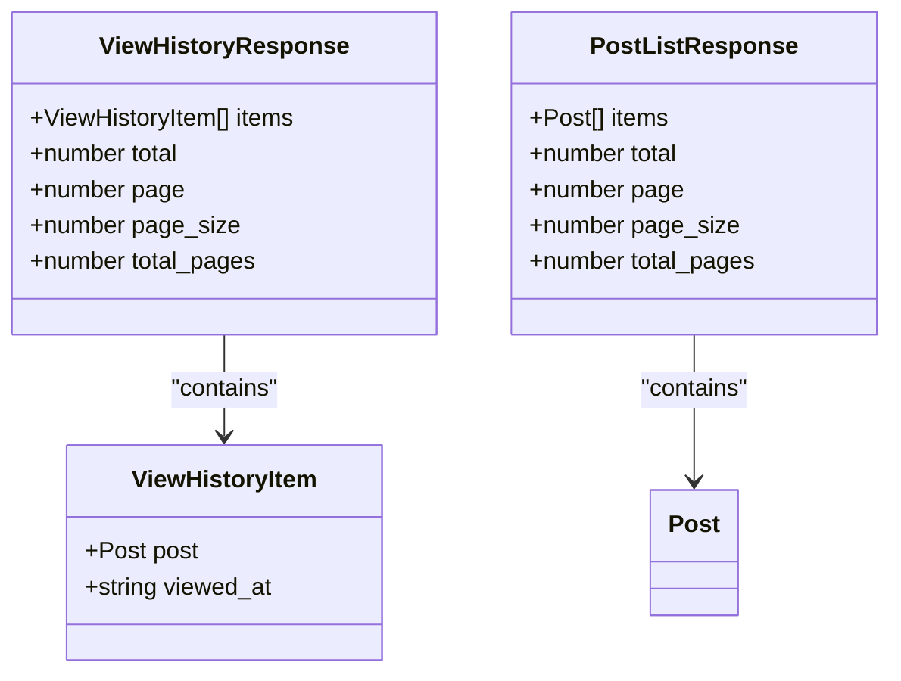

**Diagram sources**
- [community.service.ts:57-68](file://frontend/src/services/community.service.ts#L57-L68)
- [community.py:111-123](file://backend/app/schemas/community.py#L111-L123)

**Section sources**
- [community.service.ts:57-68](file://frontend/src/services/community.service.ts#L57-L68)
- [community.py:111-123](file://backend/app/schemas/community.py#L111-L123)

### Anonymous Users, Reputation Scoring, and Ranking
- Anonymous mode: posts and comments can be published anonymously; anonymous posts cannot be edited
- Reputation scoring: not defined in current types; can be introduced as numeric scores on users
- Ranking: not defined in current types; can be derived from engagement metrics (likes, comments, collects)

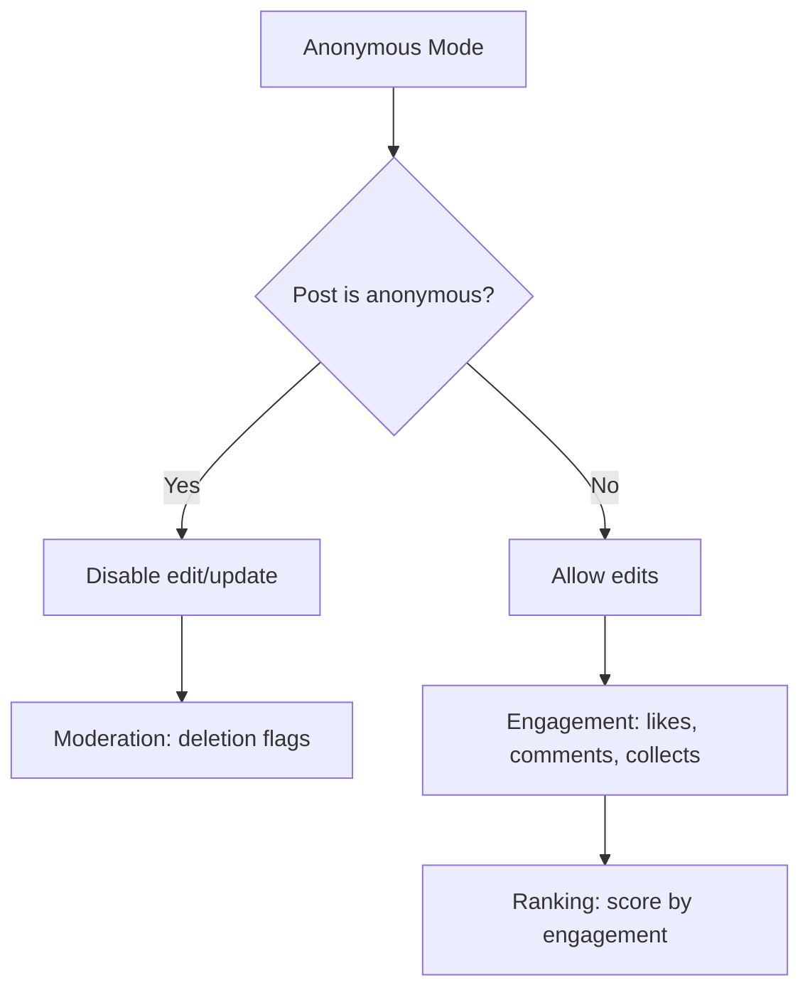

**Diagram sources**
- [community.py:12-23](file://backend/app/schemas/community.py#L12-L23)
- [community.py:23-54](file://backend/app/models/community.py#L23-L54)

**Section sources**
- [community.py:12-23](file://backend/app/schemas/community.py#L12-L23)
- [community.py:23-54](file://backend/app/models/community.py#L23-L54)

### Real-Time Updates and Social Graph Integration Patterns
- Real-time: service methods return immediate results; real-time updates can be layered via WebSocket subscriptions to post/comment events
- Social graph: relationships (followers, friends) can be integrated by extending user types and adding relationship endpoints; current types focus on posts and comments

[No sources needed since this section provides conceptual guidance]

## Dependency Analysis
The frontend service layer depends on backend endpoints and schemas. Backend enforces validation and persistence via SQLAlchemy models.

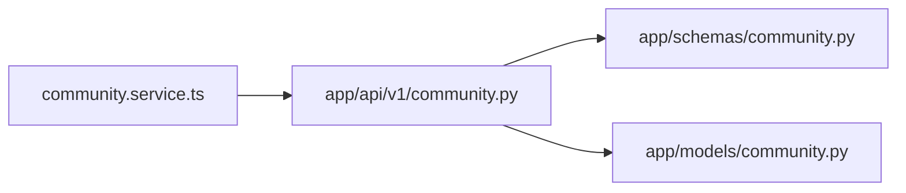

**Diagram sources**
- [community.service.ts:1-180](file://frontend/src/services/community.service.ts#L1-L180)
- [community.py:1-324](file://backend/app/api/v1/community.py#L1-L324)
- [community.py:1-124](file://backend/app/schemas/community.py#L1-L124)
- [community.py:1-176](file://backend/app/models/community.py#L1-L176)

**Section sources**
- [community.service.ts:1-180](file://frontend/src/services/community.service.ts#L1-L180)
- [community.py:1-324](file://backend/app/api/v1/community.py#L1-L324)
- [community.py:1-124](file://backend/app/schemas/community.py#L1-L124)
- [community.py:1-176](file://backend/app/models/community.py#L1-L176)

## Performance Considerations
- Pagination: use page/page_size to limit result sets
- Indexes: backend models use indexed fields for user_id, post_id, and circle_id
- Media: enforce client-side image count and type limits; backend validates upload types and sizes
- Engagement counters: maintain counters on posts to avoid expensive recalculations

[No sources needed since this section provides general guidance]

## Troubleshooting Guide
- Authentication errors: unauthorized responses trigger token removal and redirect to welcome page
- Validation errors: backend raises 400 with detail messages for invalid inputs
- Not found errors: attempts to access non-existent posts or comments return 404
- Anonymous constraints: editing anonymous posts fails validation

**Section sources**
- [community.py:52-53](file://backend/app/api/v1/community.py#L52-L53)
- [community.py:135-139](file://backend/app/api/v1/community.py#L135-L139)
- [community.py:166-178](file://backend/app/api/v1/community.py#L166-L178)
- [community.py:206-207](file://backend/app/api/v1/community.py#L206-L207)
- [community.py:237-240](file://backend/app/api/v1/community.py#L237-L240)
- [community.py:254-256](file://backend/app/api/v1/community.py#L254-L256)
- [community.py:271-272](file://backend/app/api/v1/community.py#L271-L272)
- [community.py:319-323](file://backend/app/api/v1/community.py#L319-L323)

## Conclusion
The community platform types provide a clear contract between frontend and backend for posts, comments, engagement, and discovery. Extending these types to include reputation scoring, ranking, notifications, and real-time updates aligns with the existing patterns and maintains consistency across the stack.