# Diary Management Types

<cite>
**Referenced Files in This Document**
- [diary.ts](file://frontend/src/types/diary.ts)
- [index.ts](file://frontend/src/types/index.ts)
- [diary.service.ts](file://frontend/src/services/diary.service.ts)
- [diaryStore.ts](file://frontend/src/store/diaryStore.ts)
- [analysis.ts](file://frontend/src/types/analysis.ts)
- [diary.py](file://backend/app/models/diary.py)
- [diary.py](file://backend/app/schemas/diary.py)
- [diaries.py](file://backend/app/api/v1/diaries.py)
- [DiaryEditor.tsx](file://frontend/src/pages/diaries/DiaryEditor.tsx)
- [DiaryList.tsx](file://frontend/src/pages/diaries/DiaryList.tsx)
- [RichTextEditor.tsx](file://frontend/src/components/editor/RichTextEditor.tsx)
</cite>

## Table of Contents
1. [Introduction](#introduction)
2. [Project Structure](#project-structure)
3. [Core Components](#core-components)
4. [Architecture Overview](#architecture-overview)
5. [Detailed Component Analysis](#detailed-component-analysis)
6. [Dependency Analysis](#dependency-analysis)
7. [Performance Considerations](#performance-considerations)
8. [Troubleshooting Guide](#troubleshooting-guide)
9. [Conclusion](#conclusion)

## Introduction
This document provides comprehensive documentation for the diary management TypeScript types used in the application. It covers the core data structures for diary entries, timeline events, emotion tagging, form data validation, search and filtering capabilities, statistics, sentiment analysis results, image upload handling, and type guards for state management. The goal is to help developers understand the type system, data flows, and integration points across the frontend and backend layers.

## Project Structure
The diary management types are organized across frontend and backend layers:
- Frontend types define the client-side contracts for diary data, forms, analysis results, and UI-related structures.
- Backend models and schemas define the server-side persistence and API contracts.
- Services and stores orchestrate data fetching, mutation, and state management.

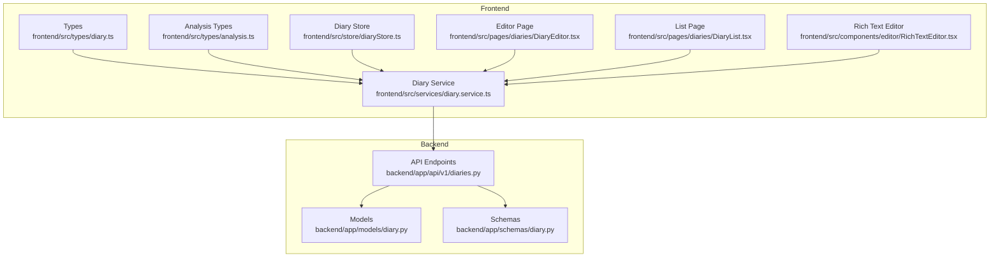

**Diagram sources**
- [diary.ts:1-128](file://frontend/src/types/diary.ts#L1-L128)
- [diary.service.ts:1-112](file://frontend/src/services/diary.service.ts#L1-L112)
- [diaryStore.ts:1-164](file://frontend/src/store/diaryStore.ts#L1-L164)
- [diary.py:1-186](file://backend/app/models/diary.py#L1-L186)
- [diary.py:1-101](file://backend/app/schemas/diary.py#L1-L101)
- [diaries.py:1-491](file://backend/app/api/v1/diaries.py#L1-L491)

**Section sources**
- [diary.ts:1-128](file://frontend/src/types/diary.ts#L1-L128)
- [diary.service.ts:1-112](file://frontend/src/services/diary.service.ts#L1-L112)
- [diaryStore.ts:1-164](file://frontend/src/store/diaryStore.ts#L1-L164)
- [diary.py:1-186](file://backend/app/models/diary.py#L1-L186)
- [diary.py:1-101](file://backend/app/schemas/diary.py#L1-L101)
- [diaries.py:1-491](file://backend/app/api/v1/diaries.py#L1-L491)

## Core Components
This section documents the primary TypeScript types used for diary management, including the Diary entity, form data interfaces, timeline events, emotion tagging, statistics, and analysis results.

- Diary entity: Contains content, emotion tags, timestamps, word count, media URLs, and analysis flags.
- DiaryCreate and DiaryUpdate: Form data interfaces for creating/updating diaries with optional fields.
- TimelineEvent: Structured event tracking with date, title, description, importance scoring, and related entities.
- EmotionTag: Type alias for emotion labels.
- EventType: Enum-like union for categorizing timeline events.
- EmotionStats: Statistics for emotion distribution.
- TerrainResponse and related types: Aggregated emotional terrain data for visualization.
- GrowthDailyInsight: Daily insight for growth center with caching and source attribution.
- AnalysisRequest and AnalysisResponse: Request/response contracts for comprehensive analysis.

**Section sources**
- [diary.ts:3-128](file://frontend/src/types/diary.ts#L3-L128)
- [analysis.ts:1-142](file://frontend/src/types/analysis.ts#L1-L142)

## Architecture Overview
The diary management architecture follows a layered approach:
- Frontend types define contracts for data exchange.
- Services encapsulate API interactions and parameter handling.
- Stores manage application state and side effects.
- Backend models and schemas define persistence and validation.
- API endpoints expose CRUD, search, filtering, and analysis endpoints.

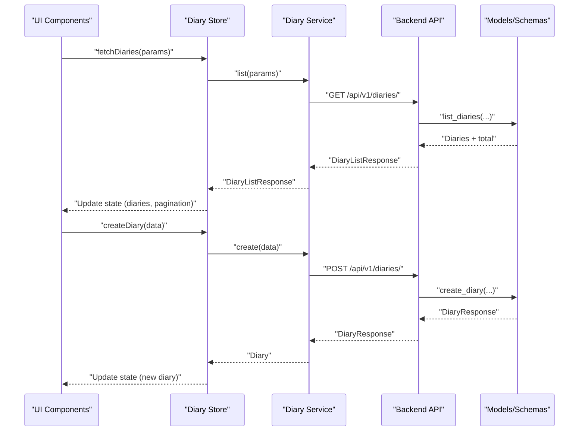

**Diagram sources**
- [diaryStore.ts:50-74](file://frontend/src/store/diaryStore.ts#L50-L74)
- [diary.service.ts:22-31](file://frontend/src/services/diary.service.ts#L22-L31)
- [diaries.py:76-109](file://backend/app/api/v1/diaries.py#L76-L109)
- [diary.py:66-73](file://backend/app/schemas/diary.py#L66-L73)

## Detailed Component Analysis

### Diary Entity and Forms
The Diary entity captures the core content and metadata for each diary entry. The form interfaces (DiaryCreate, DiaryUpdate) define the shape of data submitted to the backend.

Key characteristics:
- Content and title: Free-form text with length constraints enforced by backend schemas.
- Emotion tags: Array of labels for mood categorization.
- Importance score: Numeric rating (1–10) indicating significance.
- Word count: Computed metric for content length.
- Media URLs: Array of image URLs associated with the diary.
- Timestamps: Creation and update timestamps.
- Analysis flag: Indicates whether AI analysis has been performed.

Form validation and submission:
- Frontend validation ensures required fields are present.
- Backend validation enforces content constraints and defaults for dates.

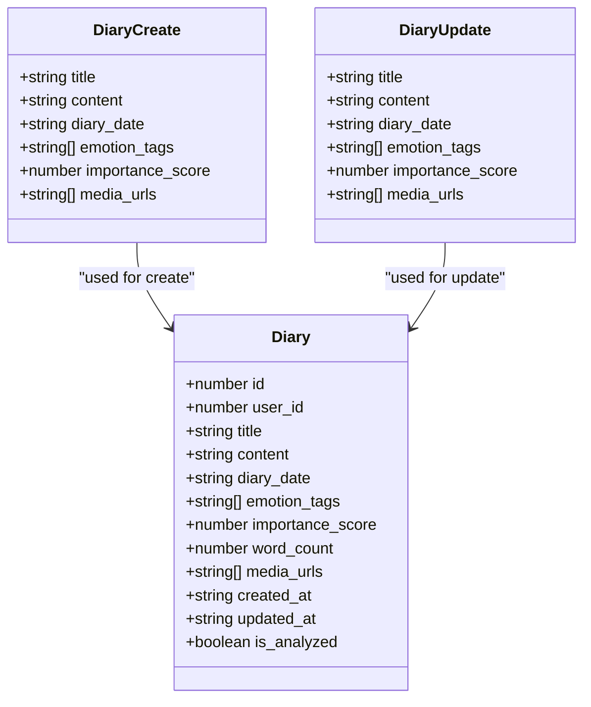

**Diagram sources**
- [diary.ts:6-37](file://frontend/src/types/diary.ts#L6-L37)
- [diary.py:9-44](file://backend/app/schemas/diary.py#L9-L44)

**Section sources**
- [diary.ts:6-37](file://frontend/src/types/diary.ts#L6-L37)
- [diary.py:9-44](file://backend/app/schemas/diary.py#L9-L44)
- [DiaryEditor.tsx:110-143](file://frontend/src/pages/diaries/DiaryEditor.tsx#L110-L143)

### Timeline Event Type
TimelineEvent represents structured event tracking derived from diary content and user actions. It includes:
- Event summary and emotion tag
- Importance score and event type
- Related entities for contextual enrichment
- Event date and creation timestamp

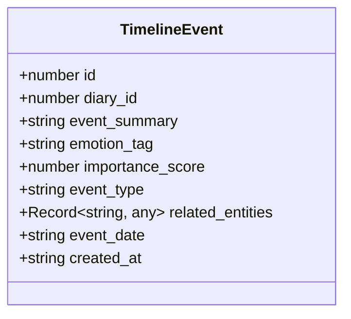

**Diagram sources**
- [diary.ts:47-57](file://frontend/src/types/diary.ts#L47-L57)

**Section sources**
- [diary.ts:47-57](file://frontend/src/types/diary.ts#L47-L57)
- [diaries.py:243-298](file://backend/app/api/v1/diaries.py#L243-L298)

### Emotion Tagging and Statistics
EmotionTag is a string-based type alias for emotion labels. EventType is a union representing categories such as work, relationship, health, achievement, and other. EmotionStats provides counts and percentages for emotion distributions.

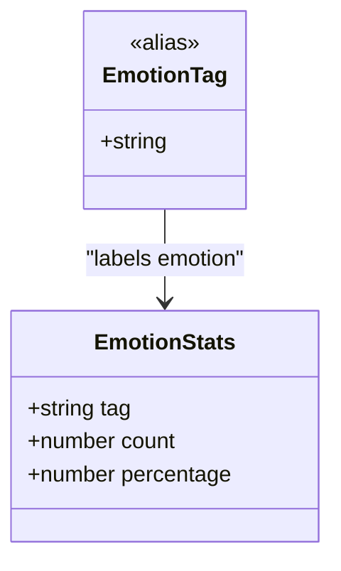

**Diagram sources**
- [diary.ts:3-63](file://frontend/src/types/diary.ts#L3-L63)

**Section sources**
- [diary.ts:3-63](file://frontend/src/types/diary.ts#L3-L63)
- [DiaryList.tsx:12-12](file://frontend/src/pages/diaries/DiaryList.tsx#L12-L12)

### DiaryFormData and Form Validation
DiaryFormData is represented by DiaryCreate and DiaryUpdate interfaces. These types drive form validation and submission:
- Required fields: content is mandatory for creation.
- Optional fields: title, emotion tags, importance score, media URLs.
- Backend enforcement: Length limits, numeric ranges, and default values.

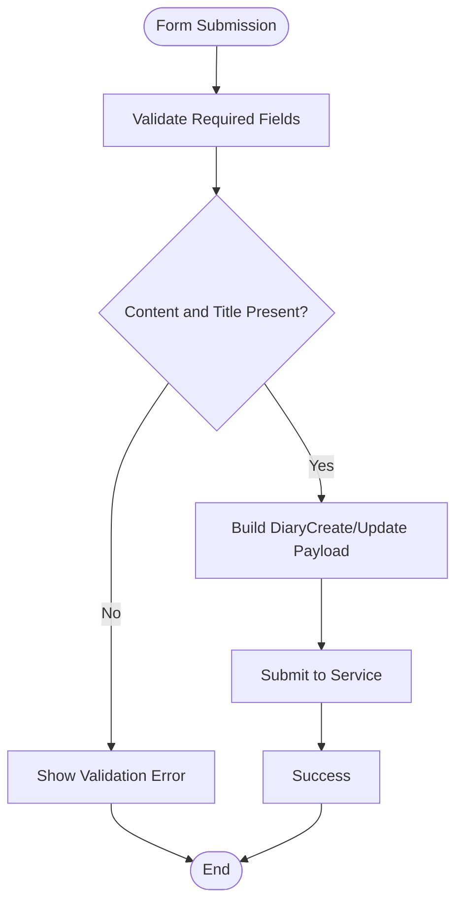

**Diagram sources**
- [DiaryEditor.tsx:110-143](file://frontend/src/pages/diaries/DiaryEditor.tsx#L110-L143)
- [diary.service.ts:16-19](file://frontend/src/services/diary.service.ts#L16-L19)

**Section sources**
- [DiaryEditor.tsx:110-143](file://frontend/src/pages/diaries/DiaryEditor.tsx#L110-L143)
- [diary.py:26-32](file://backend/app/schemas/diary.py#L26-L32)

### DiaryQueryParams and Filtering
DiaryQueryParams are used for filtering and pagination:
- Pagination: page, page_size
- Date range: start_date, end_date
- Emotion tag: emotion_tag

These parameters are passed to the backend API to retrieve filtered lists of diaries.

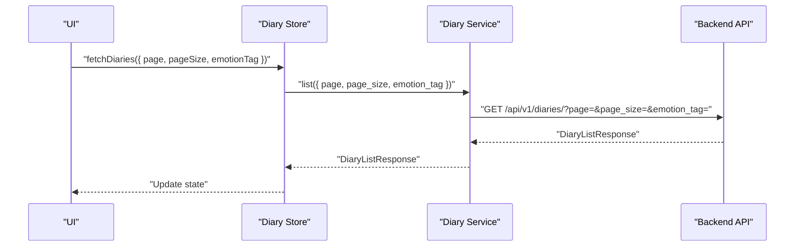

**Diagram sources**
- [diaryStore.ts:21-25](file://frontend/src/store/diaryStore.ts#L21-L25)
- [diary.service.ts:22-31](file://frontend/src/services/diary.service.ts#L22-L31)
- [diaries.py:76-109](file://backend/app/api/v1/diaries.py#L76-L109)

**Section sources**
- [diaryStore.ts:21-25](file://frontend/src/store/diaryStore.ts#L21-L25)
- [diary.service.ts:22-31](file://frontend/src/services/diary.service.ts#L22-L31)
- [diaries.py:76-109](file://backend/app/api/v1/diaries.py#L76-L109)

### Statistics, Word Count, and Sentiment Analysis
Statistics types include EmotionStats for emotion distribution. Word count is part of the Diary entity. Sentiment analysis results are encapsulated in AnalysisResponse and related types.

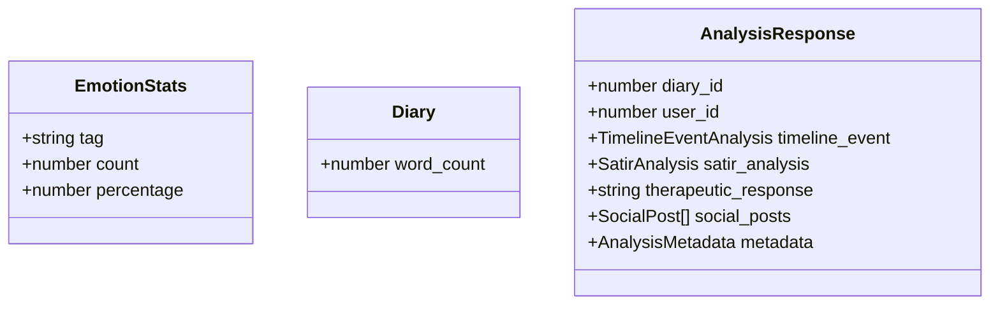

**Diagram sources**
- [diary.ts:59-63](file://frontend/src/types/diary.ts#L59-L63)
- [diary.ts:6-19](file://frontend/src/types/diary.ts#L6-L19)
- [analysis.ts:133-141](file://frontend/src/types/analysis.ts#L133-L141)

**Section sources**
- [diary.ts:59-63](file://frontend/src/types/diary.ts#L59-L63)
- [diary.ts:6-19](file://frontend/src/types/diary.ts#L6-L19)
- [analysis.ts:133-141](file://frontend/src/types/analysis.ts#L133-L141)

### Image Upload Types and Media Handling
Image upload involves client-side file handling and backend validation:
- Frontend: RichTextEditor triggers upload via diaryService.uploadImage, which posts multipart/form-data.
- Backend: Validates content type and size, writes file to disk, and returns URL.

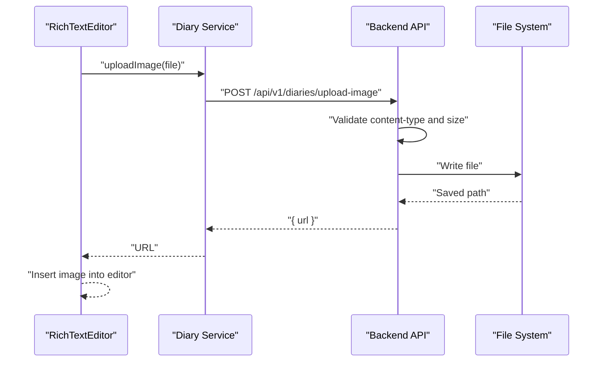

**Diagram sources**
- [RichTextEditor.tsx:300-313](file://frontend/src/components/editor/RichTextEditor.tsx#L300-L313)
- [diary.service.ts:102-110](file://frontend/src/services/diary.service.ts#L102-L110)
- [diaries.py:205-238](file://backend/app/api/v1/diaries.py#L205-L238)

**Section sources**
- [RichTextEditor.tsx:300-313](file://frontend/src/components/editor/RichTextEditor.tsx#L300-L313)
- [diary.service.ts:102-110](file://frontend/src/services/diary.service.ts#L102-L110)
- [diaries.py:205-238](file://backend/app/api/v1/diaries.py#L205-L238)

### Search and Filtering Types
Search and filtering are supported through:
- Date range queries: start_date and end_date parameters.
- Emotion tag filtering: emotion_tag parameter.
- Timeline event queries: recent, range, and date-specific endpoints.

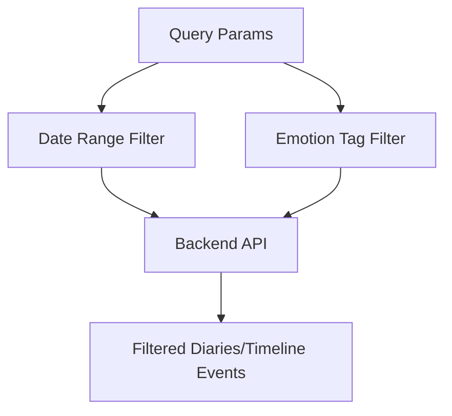

**Diagram sources**
- [diaries.py:76-109](file://backend/app/api/v1/diaries.py#L76-L109)
- [diaries.py:243-298](file://backend/app/api/v1/diaries.py#L243-L298)

**Section sources**
- [diaries.py:76-109](file://backend/app/api/v1/diaries.py#L76-L109)
- [diaries.py:243-298](file://backend/app/api/v1/diaries.py#L243-L298)

### Type Guards and Conditional Rendering
Type guards are essential for safe runtime checks and conditional rendering. While explicit guard functions are not defined in the referenced files, the types themselves enable safe usage:
- Use optional chaining and nullish coalescing for optional fields.
- Narrow types using truthiness checks for arrays and optional properties.
- Leverage discriminated unions for event types and analysis results.

[No sources needed since this section provides general guidance]

### Content Analysis Types
Content analysis encompasses:
- Comprehensive analysis request/response with themes, trends, and evidence.
- Timeline event analysis with emotion tags and importance scores.
- SATIR analysis layers for deeper psychological insights.
- Social post generation and metadata tracking.

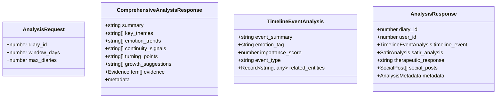

**Diagram sources**
- [analysis.ts:3-44](file://frontend/src/types/analysis.ts#L3-L44)
- [analysis.ts:58-64](file://frontend/src/types/analysis.ts#L58-L64)
- [analysis.ts:133-141](file://frontend/src/types/analysis.ts#L133-L141)

**Section sources**
- [analysis.ts:3-44](file://frontend/src/types/analysis.ts#L3-L44)
- [analysis.ts:58-64](file://frontend/src/types/analysis.ts#L58-L64)
- [analysis.ts:133-141](file://frontend/src/types/analysis.ts#L133-L141)

## Dependency Analysis
The type system creates strong contracts between frontend and backend:
- Frontend types map to backend schemas and models.
- Services depend on types for request/response shapes.
- Stores consume service responses to update state.
- UI components rely on types for rendering and validation.

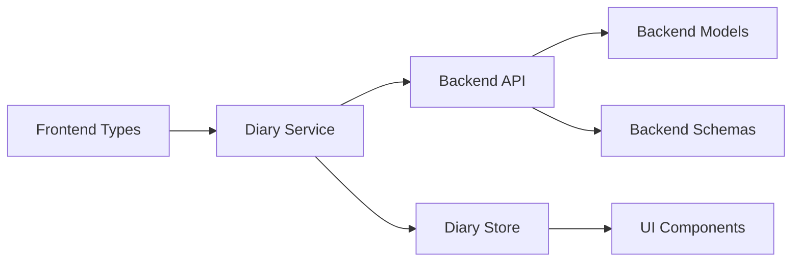

**Diagram sources**
- [diary.ts:1-128](file://frontend/src/types/diary.ts#L1-L128)
- [diary.service.ts:1-112](file://frontend/src/services/diary.service.ts#L1-L112)
- [diary.py:1-186](file://backend/app/models/diary.py#L1-L186)
- [diary.py:1-101](file://backend/app/schemas/diary.py#L1-L101)
- [diaries.py:1-491](file://backend/app/api/v1/diaries.py#L1-L491)

**Section sources**
- [diary.ts:1-128](file://frontend/src/types/diary.ts#L1-L128)
- [diary.service.ts:1-112](file://frontend/src/services/diary.service.ts#L1-L112)
- [diary.py:1-186](file://backend/app/models/diary.py#L1-L186)
- [diary.py:1-101](file://backend/app/schemas/diary.py#L1-L101)
- [diaries.py:1-491](file://backend/app/api/v1/diaries.py#L1-L491)

## Performance Considerations
- Pagination: Use page and page_size parameters to limit payload sizes.
- Filtering: Apply emotion_tag and date range filters early in the backend to reduce result sets.
- Image uploads: Validate file types and sizes on the backend to prevent oversized requests.
- Caching: GrowthDailyInsight caches results to avoid repeated AI generation.

[No sources needed since this section provides general guidance]

## Troubleshooting Guide
Common issues and resolutions:
- Validation errors: Ensure content and title are provided; check backend validators for length and format.
- Image upload failures: Verify allowed content types and size limits; confirm file input handling.
- Timeline queries: Confirm date parameters and day ranges are within accepted bounds.
- State updates: Use store actions to update state; handle loading and error states appropriately.

**Section sources**
- [diary.py:26-32](file://backend/app/schemas/diary.py#L26-L32)
- [diaries.py:216-228](file://backend/app/api/v1/diaries.py#L216-L228)
- [diaryStore.ts:50-74](file://frontend/src/store/diaryStore.ts#L50-L74)

## Conclusion
The diary management type system provides a robust foundation for building a cohesive diary application. By aligning frontend types with backend schemas and leveraging services and stores for state management, the system supports rich functionality including content editing, emotion tagging, timeline events, statistics, analysis, and media handling. Adhering to the documented types and patterns ensures consistent behavior across the application.