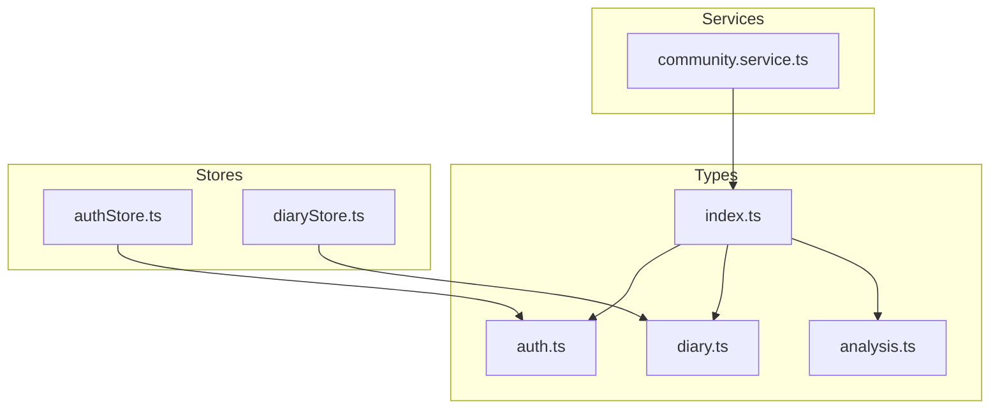
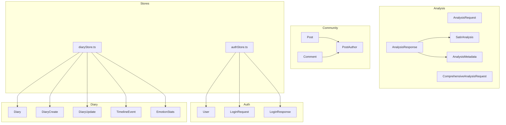
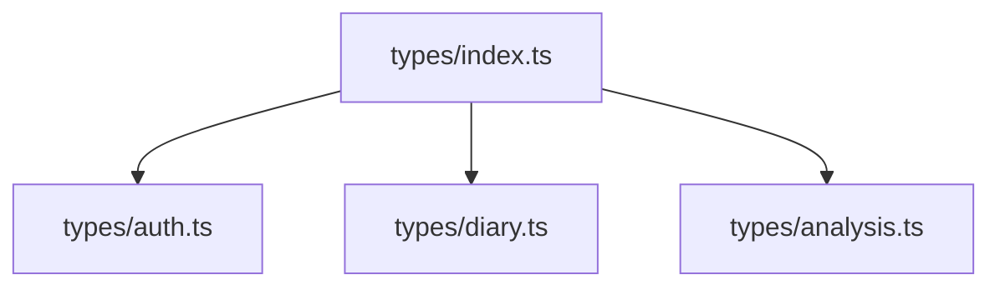

# Frontend TypeScript Types

<cite>
**Referenced Files in This Document**
- [auth.ts](file://frontend/src/types/auth.ts)
- [diary.ts](file://frontend/src/types/diary.ts)
- [analysis.ts](file://frontend/src/types/analysis.ts)
- [index.ts](file://frontend/src/types/index.ts)
- [community.service.ts](file://frontend/src/services/community.service.ts)
- [authStore.ts](file://frontend/src/store/authStore.ts)
- [diaryStore.ts](file://frontend/src/store/diaryStore.ts)
- [tsconfig.json](file://frontend/tsconfig.json)
- [cn.ts](file://frontend/src/utils/cn.ts)
</cite>

## Table of Contents
1. [Introduction](#introduction)
2. [Project Structure](#project-structure)
3. [Core Components](#core-components)
4. [Architecture Overview](#architecture-overview)
5. [Detailed Component Analysis](#detailed-component-analysis)
6. [Dependency Analysis](#dependency-analysis)
7. [Performance Considerations](#performance-considerations)
8. [Troubleshooting Guide](#troubleshooting-guide)
9. [Conclusion](#conclusion)

## Introduction
This document provides comprehensive documentation for the frontend TypeScript type definitions used in the “映记” application. It focuses on authentication, diary management, AI analysis results, and community interactions. It explains type interfaces, union types, optional properties, discriminated unions, type guards, utility types, generic constraints, type transformation patterns, API response mapping, form validation types, type safety practices, error handling types, loading state types, type inference patterns, readonly properties, immutability considerations, and integration patterns with React components and Zustand stores.

## Project Structure
The frontend types are organized under a centralized types module and integrated with services and Zustand stores. The types module exports authentication, diary, and analysis types, while community-related types are defined alongside the community service.

**Diagram sources**
- [index.ts:1-4](file://frontend/src/types/index.ts#L1-L4)
- [auth.ts:1-45](file://frontend/src/types/auth.ts#L1-L45)
- [diary.ts:1-128](file://frontend/src/types/diary.ts#L1-L128)
- [analysis.ts:1-142](file://frontend/src/types/analysis.ts#L1-L142)
- [community.service.ts:1-180](file://frontend/src/services/community.service.ts#L1-L180)
- [authStore.ts:1-146](file://frontend/src/store/authStore.ts#L1-L146)
- [diaryStore.ts:1-164](file://frontend/src/store/diaryStore.ts#L1-L164)

**Section sources**
- [index.ts:1-4](file://frontend/src/types/index.ts#L1-L4)
- [tsconfig.json:1-31](file://frontend/tsconfig.json#L1-L31)

## Core Components
This section documents the primary type interfaces and their roles across authentication, diary management, analysis results, and community interactions.

- Authentication types
  - User: Core user profile interface with optional and required fields.
  - LoginRequest, LoginResponse: Request/response shapes for email/code-based login.
  - RegisterRequest: Registration request shape including optional username.
  - SendCodeRequest, VerifyCodeRequest: Email verification request with union literal type for verification type.

- Diary types
  - EmotionTag: string alias for emotion tags.
  - EventType: Discriminated union of event categories.
  - Diary, DiaryCreate, DiaryUpdate: CRUD-related shapes for diary entries.
  - DiaryListResponse: Paginated list response for diaries.
  - TimelineEvent: Event representation for timeline views.
  - EmotionStats: Aggregated emotion statistics.
  - TerrainEvent, TerrainPoint, TerrainPeak, TerrainValley, TerrainInsights, TerrainMeta, TerrainResponse: Terrain analytics data structures.
  - GrowthDailyInsight: Daily insight aggregation.

- Analysis types
  - AnalysisRequest, ComprehensiveAnalysisRequest: Requests for analysis with optional windows and counts.
  - EvidenceItem: Evidence item for analysis reports.
  - ComprehensiveAnalysisResponse: Structured analysis report with metadata.
  - DailyGuidanceResponse, SocialStyleSamplesResponse: Guidance and samples responses.
  - TimelineEventAnalysis: Analysis payload for timeline events.
  - EmotionLayer, CognitiveLayer, BeliefLayer, CoreSelfLayer: Layers for Satir Iceberg analysis.
  - SatirAnalysis: Complete Satir analysis composition.
  - SocialPost: Social media post template.
  - AnalysisMetadata: Metadata for analysis runs.
  - AnalysisResponse: Full analysis response including metadata and layers.

- Community types
  - PostAuthor: Author information for posts.
  - Post: Post entity with optional author and counters.
  - PostListResponse: Paginated post list.
  - Comment: Comment entity with optional author and parent reference.
  - CommentListResponse: Paginated comments list.
  - CircleInfo: Community circle metadata.
  - ViewHistoryItem, ViewHistoryResponse: View history tracking.

**Section sources**
- [auth.ts:1-45](file://frontend/src/types/auth.ts#L1-L45)
- [diary.ts:1-128](file://frontend/src/types/diary.ts#L1-L128)
- [analysis.ts:1-142](file://frontend/src/types/analysis.ts#L1-L142)
- [community.service.ts:1-180](file://frontend/src/services/community.service.ts#L1-L180)

## Architecture Overview
The type system integrates tightly with services and Zustand stores to enforce type safety across the application lifecycle.

**Diagram sources**
- [auth.ts:1-45](file://frontend/src/types/auth.ts#L1-L45)
- [diary.ts:1-128](file://frontend/src/types/diary.ts#L1-L128)
- [analysis.ts:1-142](file://frontend/src/types/analysis.ts#L1-L142)
- [community.service.ts:1-180](file://frontend/src/services/community.service.ts#L1-L180)
- [authStore.ts:1-146](file://frontend/src/store/authStore.ts#L1-L146)
- [diaryStore.ts:1-164](file://frontend/src/store/diaryStore.ts#L1-L164)

## Detailed Component Analysis

### Authentication Types
- Interfaces
  - User: Includes identifiers, optional profile fields, verification flag, and timestamps.
  - LoginRequest: Email and code for magic-code login.
  - LoginResponse: Access token, token type, expiry, and embedded user.
  - RegisterRequest: Email, password, code, and optional username.
  - SendCodeRequest: Email for code dispatch.
  - VerifyCodeRequest: Email, code, and union literal type for verification action.

- Type Guards and Validation
  - Use union literal types for verification type to restrict allowed values.
  - Optional fields enable partial updates and flexible forms.

- API Mapping
  - LoginResponse embeds User to streamline client-side hydration after authentication.

- Form Validation Types
  - LoginRequest and RegisterRequest define minimal required fields for forms.

- Type Safety Practices
  - Strict compiler options enforce correctness across the codebase.

**Section sources**
- [auth.ts:1-45](file://frontend/src/types/auth.ts#L1-L45)
- [tsconfig.json:18-22](file://frontend/tsconfig.json#L18-L22)

### Diary Management Types
- Interfaces
  - Diary: Full diary record with emotion tags, importance score, word count, media URLs, and timestamps.
  - DiaryCreate, DiaryUpdate: Partial shapes for creation and updates.
  - DiaryListResponse: Pagination envelope for diary lists.
  - TimelineEvent: Event summary, emotion tag, importance score, event type, related entities, and dates.
  - EmotionStats: Aggregated emotion metrics.
  - Terrain* types: Analytics structures for terrain insights, including peaks, valleys, trends, and metadata.

- Union Types and Discriminated Unions
  - EventType is a discriminated union of event categories, enabling exhaustive switch handling.

- Optional Properties and Partial Updates
  - DiaryUpdate allows selective field updates.
  - Optional fields in User and other entities support flexible rendering.

- Type Transformation Patterns
  - API responses map to domain interfaces; stores transform and cache normalized data.

- API Response Mapping
  - DiaryListResponse wraps items and pagination metadata for list views.

- Form Validation Types
  - DiaryCreate and DiaryUpdate serve as validation schemas for editor forms.

- Loading and Error States
  - Stores maintain isLoading and error fields to reflect async operations.

**Section sources**
- [diary.ts:1-128](file://frontend/src/types/diary.ts#L1-L128)
- [diaryStore.ts:1-164](file://frontend/src/store/diaryStore.ts#L1-L164)

### Analysis Results Types
- Interfaces
  - AnalysisRequest, ComprehensiveAnalysisRequest: Configure analysis scope and window.
  - EvidenceItem: Evidence entry with diary context and reasoning.
  - ComprehensiveAnalysisResponse: Structured report with themes, trends, signals, turning points, suggestions, and evidence.
  - DailyGuidanceResponse, SocialStyleSamplesResponse: Guidance and samples envelopes.
  - TimelineEventAnalysis: Analysis payload for timeline events.
  - EmotionLayer, CognitiveLayer, BeliefLayer, CoreSelfLayer: Hierarchical layers for Satir Iceberg analysis.
  - SatirAnalysis: Composition of all analysis layers.
  - SocialPost: Social media post template.
  - AnalysisMetadata: Metadata for analysis runs including agent steps and timing.
  - AnalysisResponse: Complete analysis response including metadata and layers.

- Discriminated Unions and Layering
  - AnalysisResponse composes multiple layers and metadata, enabling structured downstream consumption.

- Type Guards and Exhaustiveness
  - Use discriminated unions for event types and agent statuses to ensure exhaustive handling.

- API Response Mapping
  - AnalysisResponse encapsulates analysis results and metadata for rendering.

**Section sources**
- [analysis.ts:1-142](file://frontend/src/types/analysis.ts#L1-L142)

### Community Interactions Types
- Interfaces
  - PostAuthor: Minimal author identity.
  - Post: Post entity with content, images, anonymity, author, counters, and timestamps.
  - PostListResponse: Paginated posts.
  - Comment: Comment with content, anonymity, author, parent reference, and timestamps.
  - CommentListResponse: Paginated comments.
  - CircleInfo: Community circle metadata.
  - ViewHistoryItem, ViewHistoryResponse: View history tracking.

- Optional Properties and Polymorphism
  - Author can be null for anonymous posts/comments.
  - Parent_id enables hierarchical comments.

- API Mapping
  - Services return typed responses that map directly to these interfaces.

**Section sources**
- [community.service.ts:1-180](file://frontend/src/services/community.service.ts#L1-L180)

### Utility Types and Type Guards
- Utility Types
  - EmotionTag as a string alias simplifies tagging semantics.
  - EventType as a discriminated union ensures exhaustive handling of event categories.
  - Record<string, any> is used for dynamic related entities and metadata, balancing flexibility with safety.

- Type Guards
  - Use typeof and equality checks for primitive unions (e.g., token type, agent status).
  - Narrow arrays and optional fields with truthiness checks before accessing nested properties.

- Generic Constraints
  - Generic constraints are not extensively used in the current types; prefer explicit interfaces for clarity.

- Readonly and Immutability
  - Consider marking store state as readonly to prevent accidental mutations.
  - Prefer immutable updates in Zustand selectors and reducers.

- Type Inference
  - Leverage inferred types from service responses to avoid duplication.
  - Use ReturnType and Parameters utility types where helpful for service wrappers.

- Integration with React and Zustand
  - Stores consume typed service responses and expose typed actions and selectors.
  - Components receive strongly-typed props derived from store state and service types.

**Section sources**
- [diary.ts:3-4](file://frontend/src/types/diary.ts#L3-L4)
- [diary.ts:4,54:4-5](file://frontend/src/types/diary.ts#L4-L5)
- [analysis.ts:48,124:48-49](file://frontend/src/types/analysis.ts#L48-L49)
- [analysis.ts:119-129](file://frontend/src/types/analysis.ts#L119-L129)
- [authStore.ts:7-21](file://frontend/src/store/authStore.ts#L7-L21)
- [diaryStore.ts:6-34](file://frontend/src/store/diaryStore.ts#L6-L34)

### Type Transformation Patterns
- From API to Domain
  - Services return typed responses; stores set normalized domain objects.
  - Example: PostListResponse items mapped to Post[] in store.

- From Domain to UI
  - Components receive typed props; optional fields are handled gracefully.
  - Example: Post.author may be null for anonymous posts.

- Form Payloads
  - Forms submit DiaryCreate or DiaryUpdate payloads; optional fields are omitted when not provided.

**Section sources**
- [community.service.ts:70-180](file://frontend/src/services/community.service.ts#L70-L180)
- [diaryStore.ts:36-164](file://frontend/src/store/diaryStore.ts#L36-L164)

### API Response Mapping
- Authentication
  - LoginResponse embeds User to simplify hydration after login.

- Diary
  - DiaryListResponse provides pagination metadata for list views.
  - TimelineEvent and EmotionStats are returned for timeline and charts.

- Analysis
  - AnalysisResponse includes metadata and layers for rendering.

- Community
  - PostListResponse, CommentListResponse, ViewHistoryResponse provide paginated data.

**Section sources**
- [auth.ts:22-27](file://frontend/src/types/auth.ts#L22-L27)
- [diary.ts:39-45](file://frontend/src/types/diary.ts#L39-L45)
- [analysis.ts:133-141](file://frontend/src/types/analysis.ts#L133-L141)
- [community.service.ts:26-68](file://frontend/src/services/community.service.ts#L26-L68)

### Form Validation Types
- Authentication
  - LoginRequest defines required fields for login.
  - RegisterRequest defines registration fields including optional username.

- Diary
  - DiaryCreate and DiaryUpdate define editor forms’ required and optional fields.

- Community
  - Service method signatures act as implicit validation contracts for create/update operations.

**Section sources**
- [auth.ts:17-34](file://frontend/src/types/auth.ts#L17-L34)
- [diary.ts:21-37](file://frontend/src/types/diary.ts#L21-L37)
- [community.service.ts:78-144](file://frontend/src/services/community.service.ts#L78-L144)

### Error Handling Types
- Stores maintain an error field to surface API errors to components.
- Error messages are extracted from response data or defaulted for user feedback.

**Section sources**
- [authStore.ts:43-49](file://frontend/src/store/authStore.ts#L43-L49)
- [authStore.ts:83-89](file://frontend/src/store/authStore.ts#L83-L89)
- [diaryStore.ts:69-73](file://frontend/src/store/diaryStore.ts#L69-L73)
- [diaryStore.ts:117-121](file://frontend/src/store/diaryStore.ts#L117-L121)

### Loading State Types
- Stores expose an isLoading flag to coordinate loading indicators and UX states.
- Actions set isLoading during async operations and reset on completion or error.

**Section sources**
- [authStore.ts:32-50](file://frontend/src/store/authStore.ts#L32-L50)
- [diaryStore.ts:50-74](file://frontend/src/store/diaryStore.ts#L50-L74)

### Type Inference Patterns
- ReturnType is used to infer return types of service methods.
- Parameters infers argument types for service wrappers.
- Utility types like Partial are used for update payloads.

**Section sources**
- [diaryStore.ts:21-33](file://frontend/src/store/diaryStore.ts#L21-L33)

### Readonly Properties and Immutability
- Consider marking store state as readonly to prevent accidental mutations.
- Prefer immutable updates in reducers and selectors to maintain predictable state transitions.

[No sources needed since this section provides general guidance]

### Integration Patterns with React Components and Zustand Stores
- Components subscribe to Zustand stores via hooks and receive strongly-typed state.
- Services return typed responses; stores normalize and expose them to components.
- Optional fields and discriminated unions enable safe rendering and exhaustive handling.

**Section sources**
- [authStore.ts:23-146](file://frontend/src/store/authStore.ts#L23-L146)
- [diaryStore.ts:36-164](file://frontend/src/store/diaryStore.ts#L36-L164)

## Dependency Analysis
The type system is designed around cohesive modules with clear boundaries. The index module re-exports types for convenient imports across the application.

**Diagram sources**
- [index.ts:1-4](file://frontend/src/types/index.ts#L1-L4)
- [auth.ts:1-45](file://frontend/src/types/auth.ts#L1-L45)
- [diary.ts:1-128](file://frontend/src/types/diary.ts#L1-L128)
- [analysis.ts:1-142](file://frontend/src/types/analysis.ts#L1-L142)

**Section sources**
- [index.ts:1-4](file://frontend/src/types/index.ts#L1-L4)

## Performance Considerations
- Prefer discriminated unions for exhaustive handling to reduce runtime checks.
- Use readonly types and immutable updates to minimize unnecessary re-renders.
- Keep payload shapes minimal to reduce serialization overhead.
- Cache computed stats (e.g., emotion stats) in stores to avoid recomputation.

[No sources needed since this section provides general guidance]

## Troubleshooting Guide
- Missing optional fields
  - Ensure optional fields are checked before access; use guard clauses or default values.
- Union literal mismatches
  - Validate union values against allowed literals before dispatching actions.
- API response mismatches
  - Align service return types with corresponding domain interfaces; add defensive checks if needed.
- Store state inconsistencies
  - Use immutable updates and consider readonly state to prevent accidental mutations.

**Section sources**
- [diaryStore.ts:107-123](file://frontend/src/store/diaryStore.ts#L107-L123)
- [authStore.ts:32-50](file://frontend/src/store/authStore.ts#L32-L50)

## Conclusion
The frontend type system in “映记” provides strong guarantees across authentication, diary management, analysis results, and community interactions. By leveraging discriminated unions, optional properties, and strict compiler options, the application achieves robust type safety and maintainable code. Integrations with services and Zustand stores further reinforce type-driven development, ensuring reliable data flows and predictable UI behavior.