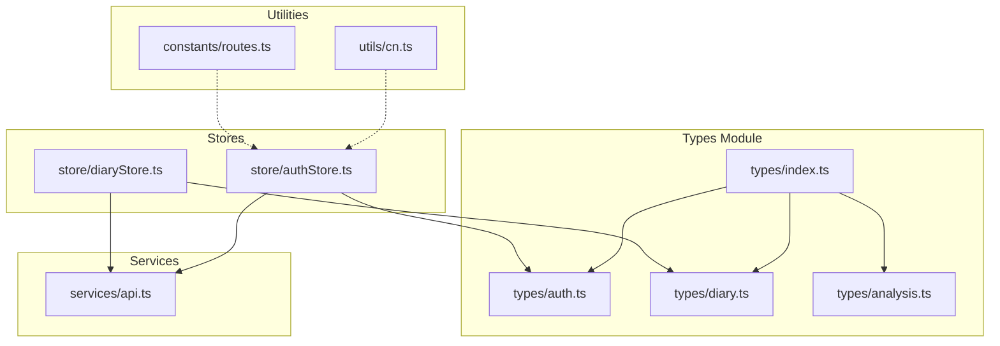
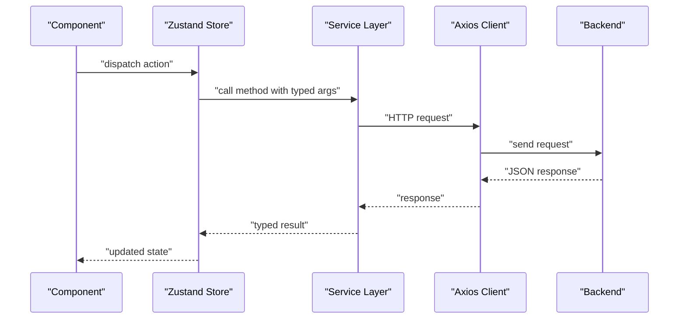
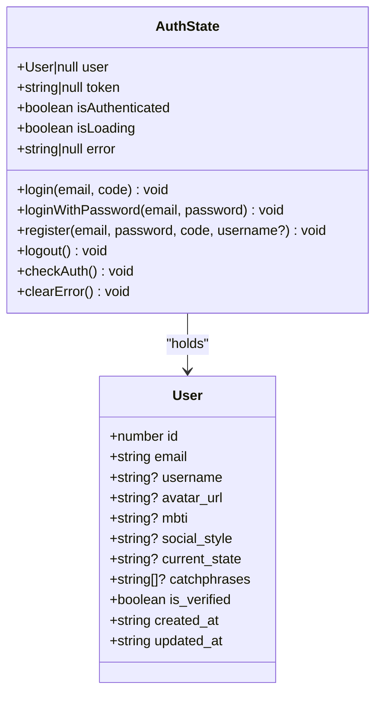
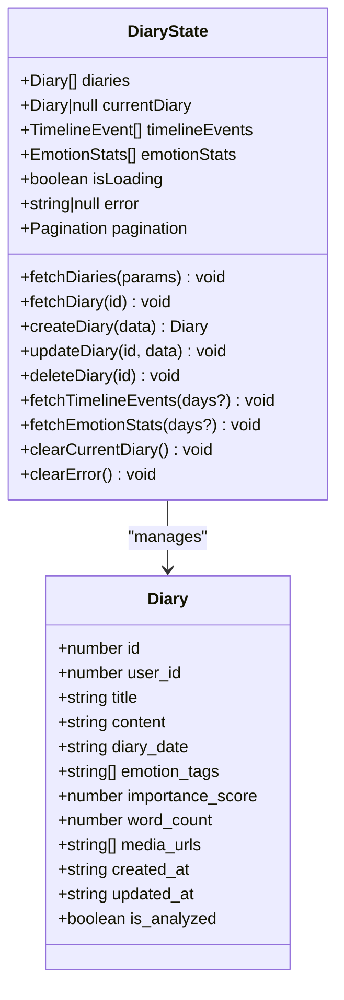
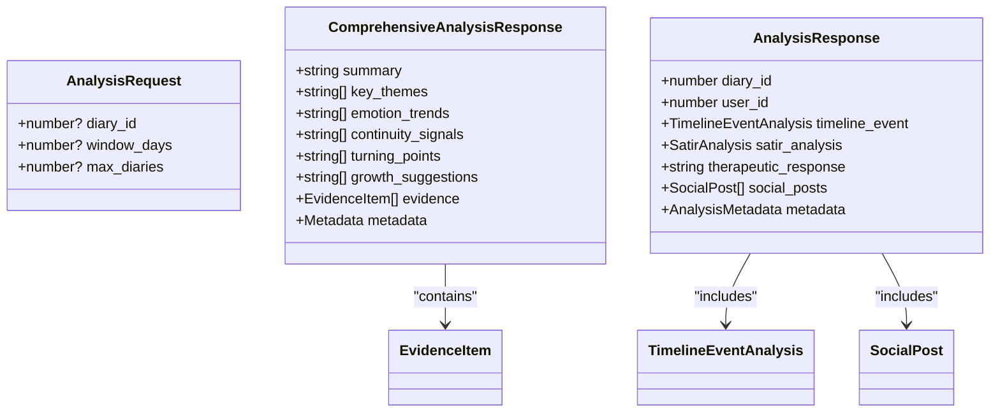
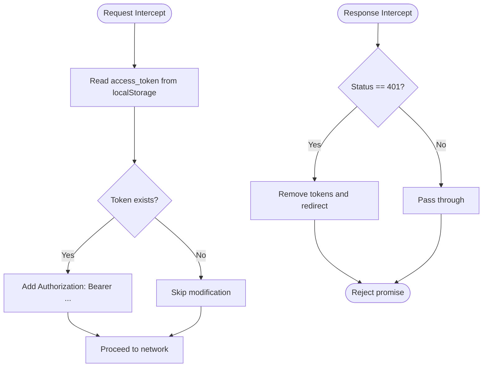
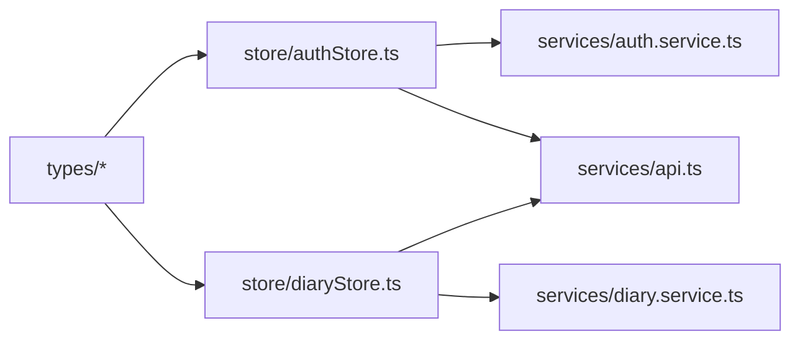

# Utility and Shared Types

<cite>
**Referenced Files in This Document**
- [auth.ts](file://frontend/src/types/auth.ts)
- [diary.ts](file://frontend/src/types/diary.ts)
- [analysis.ts](file://frontend/src/types/analysis.ts)
- [index.ts](file://frontend/src/types/index.ts)
- [api.ts](file://frontend/src/services/api.ts)
- [authStore.ts](file://frontend/src/store/authStore.ts)
- [diaryStore.ts](file://frontend/src/store/diaryStore.ts)
- [routes.ts](file://frontend/src/constants/routes.ts)
- [cn.ts](file://frontend/src/utils/cn.ts)
</cite>

## Table of Contents
1. [Introduction](#introduction)
2. [Project Structure](#project-structure)
3. [Core Components](#core-components)
4. [Architecture Overview](#architecture-overview)
5. [Detailed Component Analysis](#detailed-component-analysis)
6. [Dependency Analysis](#dependency-analysis)
7. [Performance Considerations](#performance-considerations)
8. [Troubleshooting Guide](#troubleshooting-guide)
9. [Conclusion](#conclusion)
10. [Appendices](#appendices)

## Introduction
This document consolidates shared utility and helper TypeScript types used across the frontend application. It focuses on:
- Common mapped types and utility patterns (Optional, Required, Partial, Pick)
- Discriminated unions for state and response variants
- Generic constraints, type guards, and predicates
- API response wrappers, error handling, and loading state types
- Form-related types (validation errors, field states, submission)
- Data transformation, serialization, and deserialization helpers
- Integration types for external APIs and third-party libraries
- Type inference patterns, readonly types, and immutable structures
- Testing, mock, and development-only types

Where applicable, we map these concepts to concrete type definitions and usage patterns found in the repository.

## Project Structure
The frontend organizes shared types under a centralized module that re-exports domain-specific type groups. Stores and services consume these types to maintain consistent state and API contracts.

**Diagram sources**
- [index.ts:1-4](file://frontend/src/types/index.ts#L1-L4)
- [auth.ts:1-45](file://frontend/src/types/auth.ts#L1-L45)
- [diary.ts:1-128](file://frontend/src/types/diary.ts#L1-L128)
- [analysis.ts:1-142](file://frontend/src/types/analysis.ts#L1-L142)
- [api.ts:1-43](file://frontend/src/services/api.ts#L1-L43)
- [authStore.ts:1-146](file://frontend/src/store/authStore.ts#L1-L146)
- [diaryStore.ts:1-164](file://frontend/src/store/diaryStore.ts#L1-L164)
- [cn.ts:1-8](file://frontend/src/utils/cn.ts#L1-L8)
- [routes.ts:1-32](file://frontend/src/constants/routes.ts#L1-L32)

**Section sources**
- [index.ts:1-4](file://frontend/src/types/index.ts#L1-L4)
- [auth.ts:1-45](file://frontend/src/types/auth.ts#L1-L45)
- [diary.ts:1-128](file://frontend/src/types/diary.ts#L1-L128)
- [analysis.ts:1-142](file://frontend/src/types/analysis.ts#L1-L142)
- [api.ts:1-43](file://frontend/src/services/api.ts#L1-L43)
- [authStore.ts:1-146](file://frontend/src/store/authStore.ts#L1-L146)
- [diaryStore.ts:1-164](file://frontend/src/store/diaryStore.ts#L1-L164)
- [cn.ts:1-8](file://frontend/src/utils/cn.ts#L1-L8)
- [routes.ts:1-32](file://frontend/src/constants/routes.ts#L1-L32)

## Core Components
This section catalogs shared type patterns and their usage across the application.

- Authentication types
  - User, LoginRequest, LoginResponse, RegisterRequest, SendCodeRequest, VerifyCodeRequest
  - Used by stores and services for auth flows and persisted state
  - Reference: [auth.ts:1-45](file://frontend/src/types/auth.ts#L1-L45)

- Diary and timeline types
  - Diary, DiaryCreate, DiaryUpdate, DiaryListResponse, TimelineEvent, EmotionStats, Terrain* types, GrowthDailyInsight
  - Used by stores and services for CRUD and analytics
  - Reference: [diary.ts:1-128](file://frontend/src/types/diary.ts#L1-L128)

- Analysis and AI types
  - AnalysisRequest, ComprehensiveAnalysisRequest, EvidenceItem, ComprehensiveAnalysisResponse, DailyGuidanceResponse, SocialStyleSamplesResponse, TimelineEventAnalysis, layered analyses, SocialPost, AnalysisMetadata, AnalysisResponse
  - Reference: [analysis.ts:1-142](file://frontend/src/types/analysis.ts#L1-L142)

- API client and interceptors
  - Axios client with base URL, request/response interceptors, and 401 handling
  - Reference: [api.ts:1-43](file://frontend/src/services/api.ts#L1-L43)

- Store state and actions
  - AuthState and actions for login/register/logout/checkAuth
  - DiaryState and actions for fetching/updating diaries and analytics
  - Reference: [authStore.ts:1-146](file://frontend/src/store/authStore.ts#L1-L146), [diaryStore.ts:1-164](file://frontend/src/store/diaryStore.ts#L1-L164)

- Utilities and constants
  - cn for Tailwind class merging
  - routes constant for route definitions
  - Reference: [cn.ts:1-8](file://frontend/src/utils/cn.ts#L1-L8), [routes.ts:1-32](file://frontend/src/constants/routes.ts#L1-L32)

**Section sources**
- [auth.ts:1-45](file://frontend/src/types/auth.ts#L1-L45)
- [diary.ts:1-128](file://frontend/src/types/diary.ts#L1-L128)
- [analysis.ts:1-142](file://frontend/src/types/analysis.ts#L1-L142)
- [api.ts:1-43](file://frontend/src/services/api.ts#L1-L43)
- [authStore.ts:1-146](file://frontend/src/store/authStore.ts#L1-L146)
- [diaryStore.ts:1-164](file://frontend/src/store/diaryStore.ts#L1-L164)
- [cn.ts:1-8](file://frontend/src/utils/cn.ts#L1-L8)
- [routes.ts:1-32](file://frontend/src/constants/routes.ts#L1-L32)

## Architecture Overview
The type system supports a unidirectional data flow:
- Services define request/response shapes and use the API client for HTTP communication
- Stores consume service results and manage application state with explicit loading/error fields
- Components rely on strongly typed props derived from these shared types

**Diagram sources**
- [authStore.ts:32-50](file://frontend/src/store/authStore.ts#L32-L50)
- [diaryStore.ts:50-74](file://frontend/src/store/diaryStore.ts#L50-L74)
- [api.ts:6-12](file://frontend/src/services/api.ts#L6-L12)

## Detailed Component Analysis

### Authentication Types and State
- Domain types
  - User: core identity and profile fields
  - Requests/Responses: login, registration, code verification, send code
- Store state
  - Fields: user, token, isAuthenticated, isLoading, error
  - Actions: login, loginWithPassword, register, logout, checkAuth, clearError
- Interactions
  - Stores call auth services and update local storage and state
  - API interceptor handles 401 globally

**Diagram sources**
- [auth.ts:3-15](file://frontend/src/types/auth.ts#L3-L15)
- [authStore.ts:7-21](file://frontend/src/store/authStore.ts#L7-L21)

**Section sources**
- [auth.ts:1-45](file://frontend/src/types/auth.ts#L1-L45)
- [authStore.ts:1-146](file://frontend/src/store/authStore.ts#L1-L146)
- [api.ts:28-40](file://frontend/src/services/api.ts#L28-L40)

### Diary and Timeline Types and State
- Domain types
  - Diary, DiaryCreate, DiaryUpdate, DiaryListResponse
  - TimelineEvent, EmotionStats, Terrain* types, GrowthDailyInsight
- Store state
  - Fields: diaries, currentDiary, timelineEvents, emotionStats, isLoading, error, pagination
  - Actions: fetchDiaries, fetchDiary, createDiary, updateDiary, deleteDiary, fetchTimelineEvents, fetchEmotionStats, clearCurrentDiary, clearError
- Interactions
  - Stores call diary services and update lists and pagination

**Diagram sources**
- [diary.ts:6-19](file://frontend/src/types/diary.ts#L6-L19)
- [diaryStore.ts:6-34](file://frontend/src/store/diaryStore.ts#L6-L34)

**Section sources**
- [diary.ts:1-128](file://frontend/src/types/diary.ts#L1-L128)
- [diaryStore.ts:1-164](file://frontend/src/store/diaryStore.ts#L1-L164)

### Analysis and AI Types
- Domain types
  - AnalysisRequest, ComprehensiveAnalysisRequest, EvidenceItem
  - ComprehensiveAnalysisResponse, DailyGuidanceResponse, SocialStyleSamplesResponse
  - TimelineEventAnalysis, layered analysis objects, SocialPost, AnalysisMetadata, AnalysisResponse
- Usage
  - These types describe AI/analysis payloads and responses consumed by services and stores

**Diagram sources**
- [analysis.ts:3-7](file://frontend/src/types/analysis.ts#L3-L7)
- [analysis.ts:24-44](file://frontend/src/types/analysis.ts#L24-L44)
- [analysis.ts:133-141](file://frontend/src/types/analysis.ts#L133-L141)

**Section sources**
- [analysis.ts:1-142](file://frontend/src/types/analysis.ts#L1-L142)

### API Client and Interceptors
- Configuration
  - Base URL from environment, timeout, JSON headers
- Request interceptor
  - Adds Authorization header from localStorage token
- Response interceptor
  - Handles 401 by clearing tokens and redirecting

**Diagram sources**
- [api.ts:14-26](file://frontend/src/services/api.ts#L14-L26)
- [api.ts:28-40](file://frontend/src/services/api.ts#L28-L40)

**Section sources**
- [api.ts:1-43](file://frontend/src/services/api.ts#L1-L43)

### Utility Types and Patterns
- Mapped types and utility patterns
  - Optional<T>: fields marked with ?
  - Required<T>: fields enforced via runtime checks or service contracts
  - Partial<T>: update DTOs (e.g., DiaryUpdate)
  - Pick<T,K>: selective property extraction for focused updates
  - Discriminated unions: union types with a common discriminant (e.g., token_type, event_type, agent status)
- Type guards and predicates
  - Runtime checks for presence of fields or values (e.g., checking token existence)
- Readonly and immutable structures
  - Prefer readonly arrays and fields in DTOs; avoid mutating store state directly
- Serialization and deserialization
  - Convert snake_case to camelCase on the wire; keep internal types in camelCase
- Integration types
  - Axios types for request/response; Zustand store state interfaces
- Testing and development-only types
  - Mock data types and stubs can be defined alongside real types for tests

Note: The repository primarily uses explicit optional fields and discriminated unions. Additional utility types can be introduced as needed to reduce duplication and improve type safety.

[No sources needed since this section synthesizes patterns without quoting specific files]

## Dependency Analysis
Shared types are consumed by stores and services. The types module acts as a single source of truth for domain models.

**Diagram sources**
- [index.ts:1-4](file://frontend/src/types/index.ts#L1-L4)
- [authStore.ts:1-146](file://frontend/src/store/authStore.ts#L1-L146)
- [diaryStore.ts:1-164](file://frontend/src/store/diaryStore.ts#L1-L164)
- [api.ts:1-43](file://frontend/src/services/api.ts#L1-L43)

**Section sources**
- [index.ts:1-4](file://frontend/src/types/index.ts#L1-L4)
- [authStore.ts:1-146](file://frontend/src/store/authStore.ts#L1-L146)
- [diaryStore.ts:1-164](file://frontend/src/store/diaryStore.ts#L1-L164)
- [api.ts:1-43](file://frontend/src/services/api.ts#L1-L43)

## Performance Considerations
- Keep DTOs minimal to reduce payload sizes
- Use Partial<T> for updates to avoid sending unchanged fields
- Normalize nested structures to reduce duplication
- Prefer readonly types to prevent accidental mutations
- Cache frequently accessed computed values in stores

[No sources needed since this section provides general guidance]

## Troubleshooting Guide
- Authentication failures
  - Verify token presence in localStorage and Authorization header injection
  - Confirm 401 handling clears tokens and redirects appropriately
- API errors
  - Inspect error.response.status and handle accordingly
  - Ensure error messages are propagated to UI via store error fields
- State synchronization
  - Confirm stores update isLoading/error consistently during async operations
  - Validate that successful responses update state immutably

**Section sources**
- [api.ts:28-40](file://frontend/src/services/api.ts#L28-L40)
- [authStore.ts:32-49](file://frontend/src/store/authStore.ts#L32-L49)
- [diaryStore.ts:50-74](file://frontend/src/store/diaryStore.ts#L50-L74)

## Conclusion
The application’s type system centers on clear domain models and explicit state fields. By leveraging discriminated unions, mapped types, and strict store/service contracts, the codebase achieves predictable behavior and improved developer experience. Extending the type system with additional utilities (e.g., DeepPartial, Omit, Merge) can further reduce boilerplate and enhance safety.

[No sources needed since this section summarizes without analyzing specific files]

## Appendices
- Route constants
  - Public/private route sets and dynamic route builders
  - Reference: [routes.ts:1-32](file://frontend/src/constants/routes.ts#L1-L32)
- Utility function
  - Tailwind class merging helper
  - Reference: [cn.ts:1-8](file://frontend/src/utils/cn.ts#L1-L8)

**Section sources**
- [routes.ts:1-32](file://frontend/src/constants/routes.ts#L1-L32)
- [cn.ts:1-8](file://frontend/src/utils/cn.ts#L1-L8)