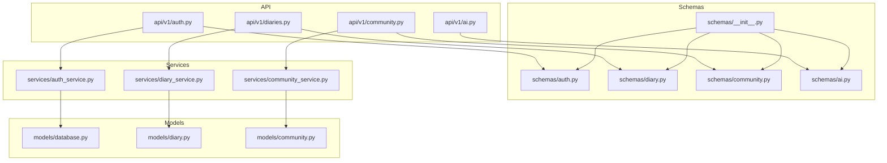
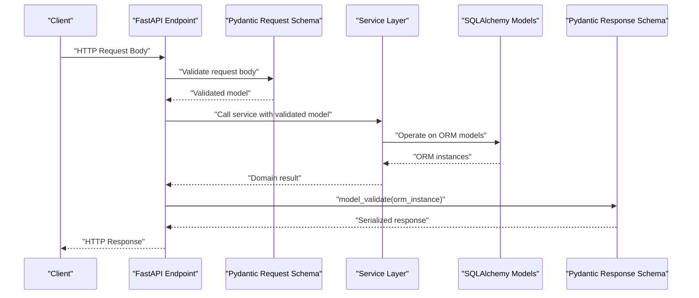
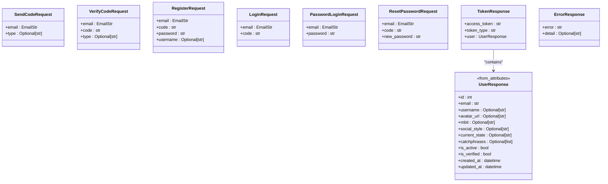
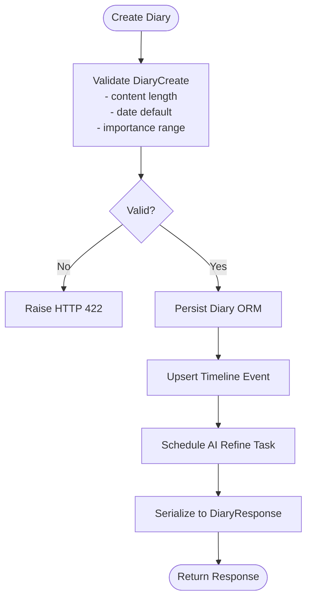
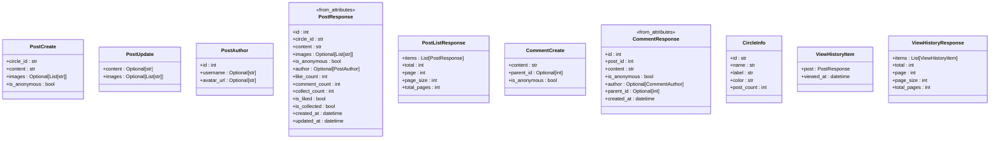
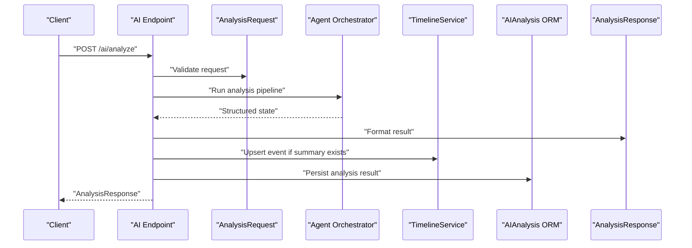
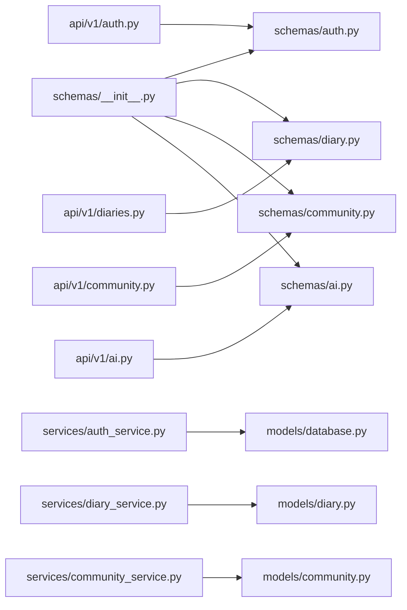

# Pydantic Validation Schemas

<cite>
**Referenced Files in This Document**
- [schemas/__init__.py](file://backend/app/schemas/__init__.py)
- [schemas/auth.py](file://backend/app/schemas/auth.py)
- [schemas/diary.py](file://backend/app/schemas/diary.py)
- [schemas/community.py](file://backend/app/schemas/community.py)
- [schemas/ai.py](file://backend/app/schemas/ai.py)
- [api/v1/auth.py](file://backend/app/api/v1/auth.py)
- [api/v1/diaries.py](file://backend/app/api/v1/diaries.py)
- [api/v1/community.py](file://backend/app/api/v1/community.py)
- [api/v1/ai.py](file://backend/app/api/v1/ai.py)
- [models/database.py](file://backend/app/models/database.py)
- [models/diary.py](file://backend/app/models/diary.py)
- [models/community.py](file://backend/app/models/community.py)
- [services/auth_service.py](file://backend/app/services/auth_service.py)
- [services/diary_service.py](file://backend/app/services/diary_service.py)
- [services/community_service.py](file://backend/app/services/community_service.py)
</cite>

## Table of Contents
1. [Introduction](#introduction)
2. [Project Structure](#project-structure)
3. [Core Components](#core-components)
4. [Architecture Overview](#architecture-overview)
5. [Detailed Component Analysis](#detailed-component-analysis)
6. [Dependency Analysis](#dependency-analysis)
7. [Performance Considerations](#performance-considerations)
8. [Troubleshooting Guide](#troubleshooting-guide)
9. [Conclusion](#conclusion)

## Introduction
This document explains the Pydantic validation schemas used across the backend API for data validation and serialization. It covers authentication requests and responses, diary entry validation, community post schemas, and AI analysis results. It also documents field validators, custom validation logic, serialization patterns, schema inheritance, nested model validation, optional field handling, schema versioning considerations, migration strategies, FastAPI dependency injection integration, database model conversion, and API response formatting. Finally, it addresses performance considerations for large payload validation and memory optimization techniques.

## Project Structure
The schemas are organized by domain and imported via a central module to expose a unified API surface. Each domain’s schemas define request/response models and nested structures used by FastAPI endpoints and services.

**Diagram sources**
- [schemas/__init__.py:1-49](file://backend/app/schemas/__init__.py#L1-L49)
- [schemas/auth.py:1-106](file://backend/app/schemas/auth.py#L1-L106)
- [schemas/diary.py:1-101](file://backend/app/schemas/diary.py#L1-L101)
- [schemas/community.py:1-124](file://backend/app/schemas/community.py#L1-L124)
- [schemas/ai.py:1-108](file://backend/app/schemas/ai.py#L1-L108)
- [api/v1/auth.py:1-316](file://backend/app/api/v1/auth.py#L1-L316)
- [api/v1/diaries.py:1-501](file://backend/app/api/v1/diaries.py#L1-L501)
- [api/v1/community.py:1-324](file://backend/app/api/v1/community.py#L1-L324)
- [api/v1/ai.py:1-902](file://backend/app/api/v1/ai.py#L1-L902)
- [services/auth_service.py:1-358](file://backend/app/services/auth_service.py#L1-L358)
- [services/diary_service.py:1-637](file://backend/app/services/diary_service.py#L1-L637)
- [services/community_service.py:1-415](file://backend/app/services/community_service.py#L1-L415)
- [models/database.py:1-70](file://backend/app/models/database.py#L1-L70)
- [models/diary.py:1-186](file://backend/app/models/diary.py#L1-L186)
- [models/community.py:1-176](file://backend/app/models/community.py#L1-L176)

**Section sources**
- [schemas/__init__.py:1-49](file://backend/app/schemas/__init__.py#L1-L49)

## Core Components
- Authentication schemas: request/response models for sending verification codes, verifying codes, registering, logging in, password login, resetting passwords, and returning tokens and user info.
- Diary schemas: creation/update/validation of diary entries, timeline event creation and response, and list wrappers.
- Community schemas: post creation/update, nested author information, comments, circles, and browsing history.
- AI analysis schemas: analysis requests/responses, comprehensive analysis, daily guidance, social style samples, and title suggestions.

Key validation features:
- Field constraints (length, range, types).
- Optional fields with defaults and explicit None handling.
- Custom validators for content and date normalization.
- Nested models for composed responses.
- Serialization via model_validate and from_attributes for ORM-to-JSON conversion.

**Section sources**
- [schemas/auth.py:10-106](file://backend/app/schemas/auth.py#L10-L106)
- [schemas/diary.py:9-101](file://backend/app/schemas/diary.py#L9-L101)
- [schemas/community.py:12-124](file://backend/app/schemas/community.py#L12-L124)
- [schemas/ai.py:9-108](file://backend/app/schemas/ai.py#L9-L108)

## Architecture Overview
The FastAPI routers accept Pydantic models as request bodies, validate them automatically, and delegate business logic to services. Services operate on SQLAlchemy models and return Pydantic response models. Some endpoints use model_validate to convert ORM objects into response schemas.

**Diagram sources**
- [api/v1/auth.py:88-125](file://backend/app/api/v1/auth.py#L88-L125)
- [api/v1/diaries.py:55-78](file://backend/app/api/v1/diaries.py#L55-L78)
- [api/v1/community.py:39-56](file://backend/app/api/v1/community.py#L39-L56)
- [api/v1/ai.py:406-632](file://backend/app/api/v1/ai.py#L406-L632)
- [services/auth_service.py:16-358](file://backend/app/services/auth_service.py#L16-L358)
- [services/diary_service.py:66-637](file://backend/app/services/diary_service.py#L66-L637)
- [services/community_service.py:13-415](file://backend/app/services/community_service.py#L13-L415)
- [models/database.py:13-70](file://backend/app/models/database.py#L13-L70)
- [models/diary.py:29-186](file://backend/app/models/diary.py#L29-L186)
- [models/community.py:23-176](file://backend/app/models/community.py#L23-L176)

## Detailed Component Analysis

### Authentication Schemas and Endpoints
- Request schemas:
  - SendCodeRequest, VerifyCodeRequest, RegisterRequest, LoginRequest, PasswordLoginRequest, ResetPasswordRequest.
  - TokenResponse embeds a nested UserResponse.
  - UserResponse enables ORM conversion via from_attributes.
  - ErrorResponse captures error messages.
- Endpoint behaviors:
  - Send and verify codes enforce type constraints and return generic success messages.
  - Registration and login validate codes against the database and issue JWT tokens.
  - Password login bypasses code verification.
  - Current user retrieval uses model_validate to serialize the ORM user.
- Validation logic:
  - Pattern constraints for type fields.
  - Length constraints for codes and passwords.
  - EmailStr ensures valid email format.
  - Optional fields permit missing values; defaults are handled by the service layer.

**Diagram sources**
- [schemas/auth.py:10-106](file://backend/app/schemas/auth.py#L10-L106)

**Section sources**
- [schemas/auth.py:10-106](file://backend/app/schemas/auth.py#L10-L106)
- [api/v1/auth.py:25-316](file://backend/app/api/v1/auth.py#L25-L316)
- [services/auth_service.py:19-358](file://backend/app/services/auth_service.py#L19-L358)

### Diary Entry Validation and Timeline Events
- DiaryCreate validates content length and sets default date if absent; includes validators for content emptiness and default importance score.
- DiaryUpdate supports partial updates; optional fields allow selective modification.
- DiaryResponse and TimelineEventResponse enable ORM serialization via from_attributes.
- Endpoints:
  - Create, list, retrieve, update, delete diaries.
  - Upload images with size/type checks.
  - Timeline queries by date range and recent days.
  - Asynchronous AI refinement of timeline events scheduled after write operations.
- Validation logic:
  - field_validator enforces non-empty content.
  - Default date assignment when none provided.
  - Range constraints for importance scores.
  - Optional lists and dictionaries with defaults.

**Diagram sources**
- [schemas/diary.py:9-44](file://backend/app/schemas/diary.py#L9-L44)
- [api/v1/diaries.py:55-78](file://backend/app/api/v1/diaries.py#L55-L78)
- [services/diary_service.py:69-105](file://backend/app/services/diary_service.py#L69-L105)

**Section sources**
- [schemas/diary.py:9-101](file://backend/app/schemas/diary.py#L9-L101)
- [api/v1/diaries.py:55-333](file://backend/app/api/v1/diaries.py#L55-L333)
- [services/diary_service.py:66-637](file://backend/app/services/diary_service.py#L66-L637)
- [models/diary.py:29-186](file://backend/app/models/diary.py#L29-L186)

### Community Post Schemas and Endpoints
- Post schemas:
  - PostCreate and PostUpdate define content, images, and anonymity.
  - PostResponse nests PostAuthor; PostListResponse wraps items.
  - Comment schemas mirror authorship and hierarchy.
  - CircleInfo describes predefined emotional circles.
  - ViewHistoryResponse aggregates PostResponse with timestamps.
- Endpoint behaviors:
  - Create/list/retrieve posts with pagination and filtering.
  - Update/delete posts with permission checks and anonymous restrictions.
  - Comments CRUD with reply support.
  - Likes, collections, and browsing history with deduplication.
  - Image upload with type and size validation.
- Validation logic:
  - Enum-like circle_id validation enforced by service.
  - Anonymous posts cannot be edited.
  - Optional fields with defaults for counts and image lists.

**Diagram sources**
- [schemas/community.py:12-124](file://backend/app/schemas/community.py#L12-L124)

**Section sources**
- [schemas/community.py:12-124](file://backend/app/schemas/community.py#L12-L124)
- [api/v1/community.py:39-324](file://backend/app/api/v1/community.py#L39-L324)
- [services/community_service.py:13-415](file://backend/app/services/community_service.py#L13-L415)
- [models/community.py:23-176](file://backend/app/models/community.py#L23-L176)

### AI Analysis Results and Requests
- Analysis schemas:
  - AnalysisRequest and ComprehensiveAnalysisRequest define windows and limits.
  - EvidenceItem, ComprehensiveAnalysisResponse, DailyGuidanceResponse, SocialStyleSamplesRequest/Response, TitleSuggestionRequest/Response, and AnalysisResponse define structured outputs.
  - TimelineEventResponse and SatirAnalysisResponse are nested structures for event and layered analysis.
- Endpoint behaviors:
  - Title generation, daily guidance, comprehensive RAG-based analysis, and social post samples management.
  - Asynchronous orchestration of analysis with persistence of results and timeline updates.
  - JSON parsing helpers robustly extract structured outputs from LLM responses.
- Validation logic:
  - Numeric bounds for window sizes and counts.
  - Content length checks for title suggestion.
  - JSON extraction with fallbacks and normalization.

**Diagram sources**
- [api/v1/ai.py:406-632](file://backend/app/api/v1/ai.py#L406-L632)
- [schemas/ai.py:9-108](file://backend/app/schemas/ai.py#L9-L108)
- [services/diary_service.py:281-637](file://backend/app/services/diary_service.py#L281-L637)
- [models/diary.py:102-186](file://backend/app/models/diary.py#L102-L186)

**Section sources**
- [schemas/ai.py:9-108](file://backend/app/schemas/ai.py#L9-L108)
- [api/v1/ai.py:83-800](file://backend/app/api/v1/ai.py#L83-L800)
- [services/diary_service.py:281-637](file://backend/app/services/diary_service.py#L281-L637)
- [models/diary.py:102-186](file://backend/app/models/diary.py#L102-L186)

## Dependency Analysis
- Central import: schemas/__init__.py exports all domain schemas for convenient imports across the app.
- API endpoints depend on schemas for request validation and response serialization.
- Services encapsulate business logic and interact with SQLAlchemy models.
- Models define persistence and relationships; schemas handle validation and serialization.

**Diagram sources**
- [schemas/__init__.py:1-49](file://backend/app/schemas/__init__.py#L1-L49)
- [api/v1/auth.py:8-21](file://backend/app/api/v1/auth.py#L8-L21)
- [api/v1/diaries.py:16-27](file://backend/app/api/v1/diaries.py#L16-L27)
- [api/v1/community.py:11-18](file://backend/app/api/v1/community.py#L11-L18)
- [api/v1/ai.py:11-29](file://backend/app/api/v1/ai.py#L11-L29)
- [services/auth_service.py:10-13](file://backend/app/services/auth_service.py#L10-L13)
- [services/diary_service.py:11-13](file://backend/app/services/diary_service.py#L11-L13)
- [services/community_service.py:9-10](file://backend/app/services/community_service.py#L9-L10)
- [models/database.py:13-70](file://backend/app/models/database.py#L13-L70)
- [models/diary.py:29-186](file://backend/app/models/diary.py#L29-L186)
- [models/community.py:23-176](file://backend/app/models/community.py#L23-L176)

**Section sources**
- [schemas/__init__.py:1-49](file://backend/app/schemas/__init__.py#L1-L49)

## Performance Considerations
- Prefer streaming or chunked processing for large payloads when applicable.
- Use Pydantic’s built-in validation efficiently; avoid redundant validations in services.
- Minimize ORM conversions by selecting only required fields in queries.
- Cache frequently accessed derived data (e.g., daily insights) to reduce repeated computation.
- For AI-heavy endpoints, offload heavy LLM calls to background tasks and persist results for reuse.
- Limit list sizes and enforce strict upper bounds on array fields to cap memory usage.
- Use pagination for list endpoints to control payload sizes.

## Troubleshooting Guide
Common validation and runtime errors:
- Validation errors (HTTP 422): Occur when request fields violate constraints (e.g., invalid email, out-of-range integers, empty content). Inspect the specific field and constraint.
- Business logic errors (HTTP 400/404): Raised by services for invalid operations (e.g., anonymous post edit, unauthorized access, missing records). Review endpoint-specific guards.
- Serialization issues: Ensure from_attributes is enabled for ORM models used in responses.
- JSON parsing failures: AI endpoints include robust parsing helpers; verify LLM output formatting and thresholds.

**Section sources**
- [api/v1/auth.py:36-83](file://backend/app/api/v1/auth.py#L36-L83)
- [api/v1/diaries.py:128-190](file://backend/app/api/v1/diaries.py#L128-L190)
- [api/v1/community.py:129-140](file://backend/app/api/v1/community.py#L129-L140)
- [api/v1/ai.py:34-65](file://backend/app/api/v1/ai.py#L34-L65)

## Conclusion
The Pydantic schemas provide strong, explicit validation and serialization guarantees across authentication, diary, community, and AI domains. They integrate cleanly with FastAPI, services, and SQLAlchemy models, enabling safe and predictable API behavior. By leveraging optional fields, nested models, custom validators, and ORM serialization, the system balances flexibility with correctness. For future evolution, adopt schema versioning and backward compatibility strategies during migrations, and continue optimizing performance for large payloads and AI-driven workflows.