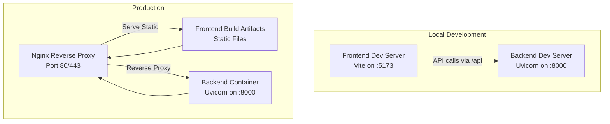
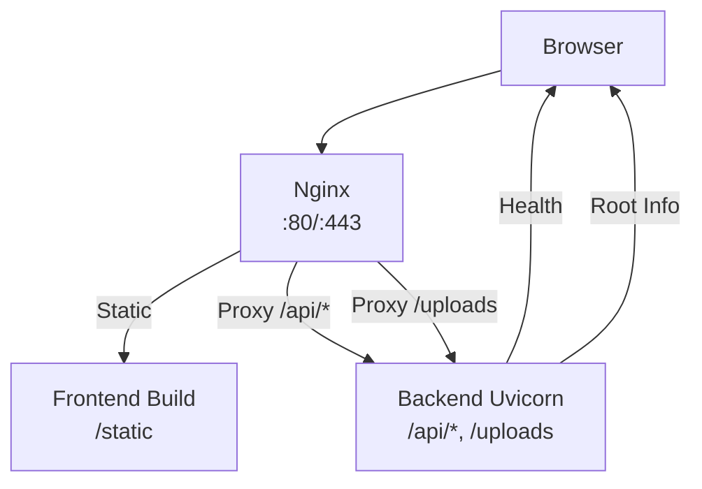
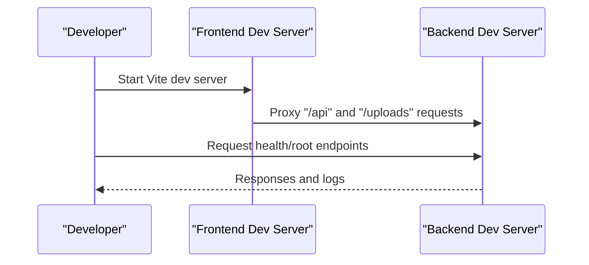
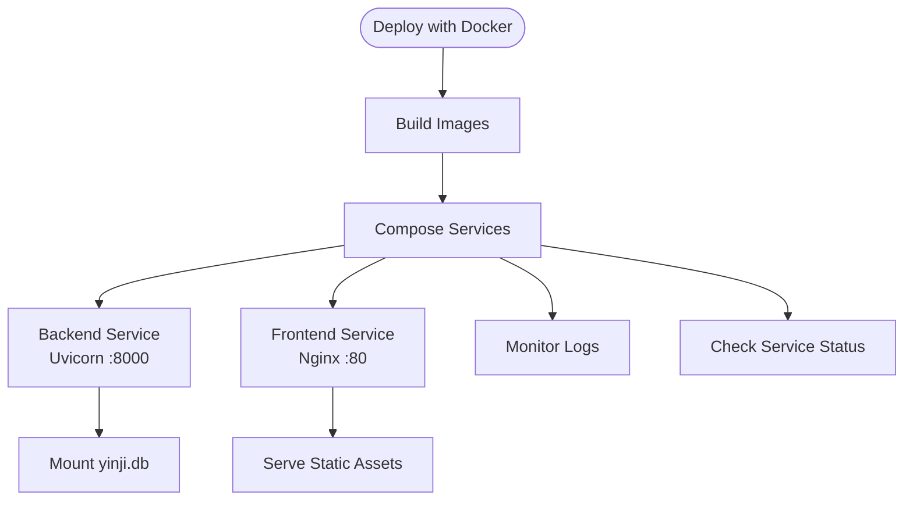
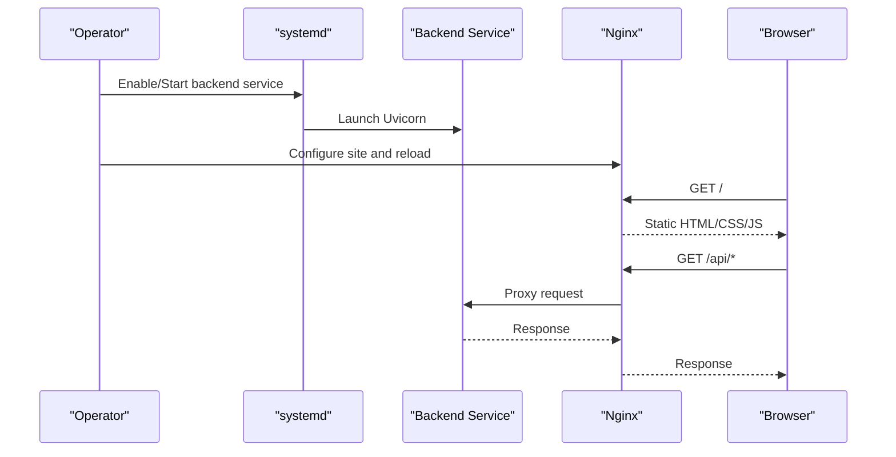
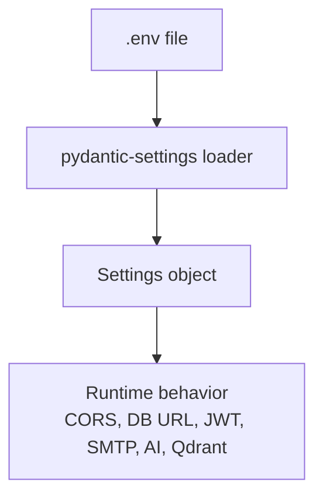
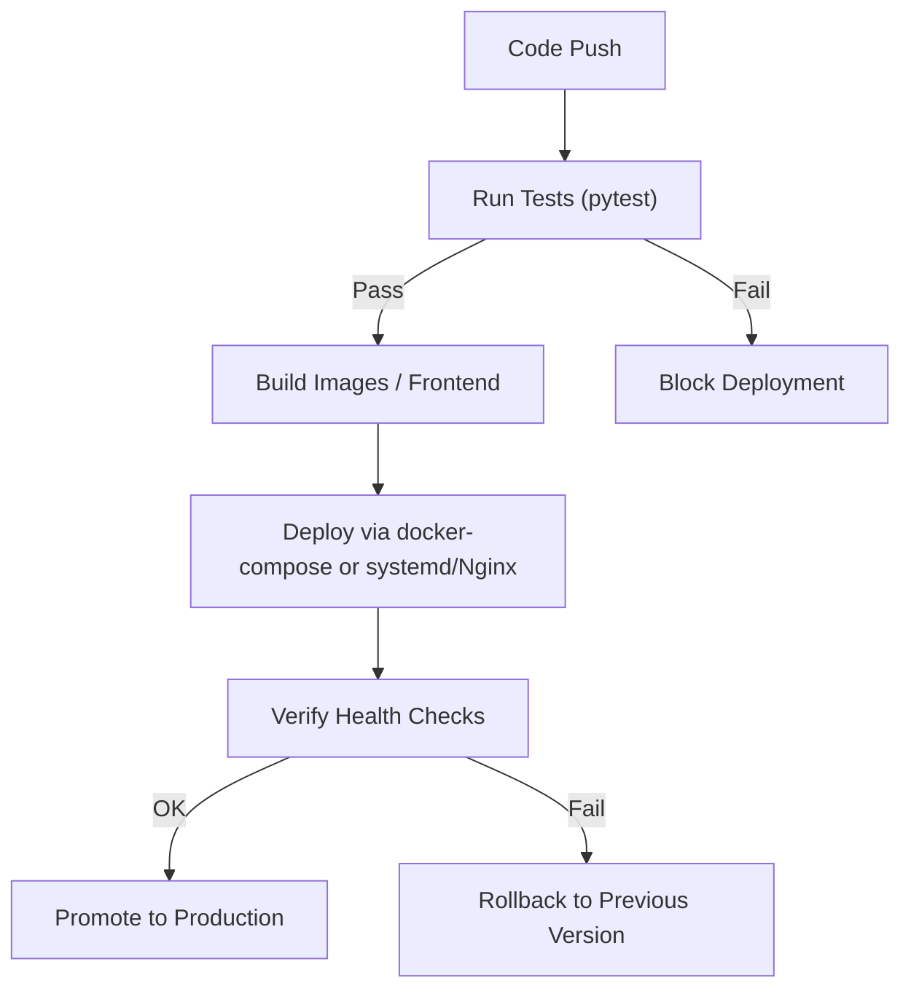
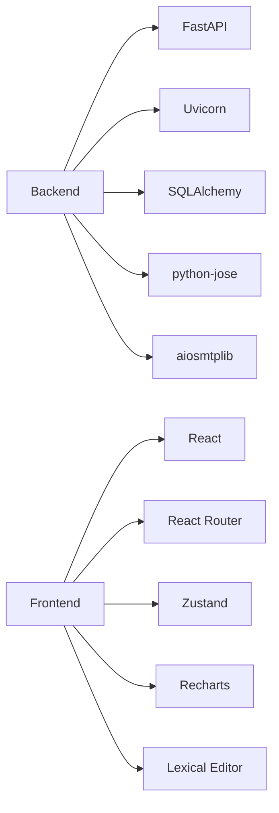

# Deployment and DevOps

<cite>
**Referenced Files in This Document**
- [DEPLOY.md](file://DEPLOY.md)
- [backend/README.md](file://backend/README.md)
- [frontend/README.md](file://frontend/README.md)
- [backend/main.py](file://backend/main.py)
- [backend/app/core/config.py](file://backend/app/core/config.py)
- [backend/.env.example](file://backend/.env.example)
- [backend/requirements.txt](file://backend/requirements.txt)
- [backend/start.bat](file://backend/start.bat)
- [backend/install.bat](file://backend/install.bat)
- [frontend/vite.config.ts](file://frontend/vite.config.ts)
- [frontend/package.json](file://frontend/package.json)
- [frontend/tailwind.config.js](file://frontend/tailwind.config.js)
- [frontend/postcss.config.js](file://frontend/postcss.config.js)
- [backend/pytest.ini](file://backend/pytest.ini)
</cite>

## Table of Contents
1. [Introduction](#introduction)
2. [Project Structure](#project-structure)
3. [Core Components](#core-components)
4. [Architecture Overview](#architecture-overview)
5. [Detailed Component Analysis](#detailed-component-analysis)
6. [Dependency Analysis](#dependency-analysis)
7. [Performance Considerations](#performance-considerations)
8. [Troubleshooting Guide](#troubleshooting-guide)
9. [Conclusion](#conclusion)
10. [Appendices](#appendices)

## Introduction
This document provides comprehensive deployment and DevOps guidance for the Yinji smart diary application. It covers local development setup (hot reload and debugging), production deployment via Docker and manual installation, CI/CD considerations, monitoring and maintenance, scaling, backups, disaster recovery, environment configuration, secrets management, security hardening, performance monitoring, health checks, and operational troubleshooting.

## Project Structure
The repository is a full-stack application with a Python FastAPI backend and a React/Vite frontend. The deployment guide documents two primary approaches:
- Docker-based deployment with separate backend and frontend containers
- Manual deployment using system services and Nginx reverse proxy

**Diagram sources**
- [DEPLOY.md:23-149](file://DEPLOY.md#L23-L149)
- [frontend/vite.config.ts:13-26](file://frontend/vite.config.ts#L13-L26)
- [backend/main.py:79-95](file://backend/main.py#L79-L95)

**Section sources**
- [DEPLOY.md:21-264](file://DEPLOY.md#L21-L264)
- [backend/README.md:14-63](file://backend/README.md#L14-L63)
- [frontend/README.md:37-63](file://frontend/README.md#L37-L63)

## Core Components
- Backend service built with FastAPI and Uvicorn, exposing REST APIs under /api/v1 and serving static uploads under /uploads.
- Frontend built with Vite and React, served statically by Nginx in production.
- Configuration managed via environment variables loaded by pydantic-settings.
- Optional RAG stack integration via Qdrant vector storage and DeepSeek AI API.
- Database support for SQLite (development) and PostgreSQL (production).

Key runtime endpoints:
- Health check endpoint for readiness/liveness.
- Root endpoint returning app metadata.
- CORS configured via allowed origins.

**Section sources**
- [backend/main.py:31-95](file://backend/main.py#L31-L95)
- [backend/app/core/config.py:10-105](file://backend/app/core/config.py#L10-L105)
- [backend/.env.example:1-45](file://backend/.env.example#L1-L45)
- [backend/README.md:115-137](file://backend/README.md#L115-L137)

## Architecture Overview
The production architecture uses Nginx as a reverse proxy to route frontend static assets and API traffic to the backend container. The backend exposes health and root endpoints and serves uploaded media files.

**Diagram sources**
- [DEPLOY.md:228-263](file://DEPLOY.md#L228-L263)
- [backend/main.py:79-95](file://backend/main.py#L79-L95)

## Detailed Component Analysis

### Local Development Setup
- Backend
  - Install dependencies using the provided batch script or pip.
  - Activate virtual environment if present.
  - Run the FastAPI app with hot reload enabled.
  - Access interactive API docs at the backend host/port.
- Frontend
  - Install dependencies with npm.
  - Start Vite dev server on the default port.
  - Configure proxy in Vite to forward /api and /uploads to the backend.

**Diagram sources**
- [frontend/vite.config.ts:13-26](file://frontend/vite.config.ts#L13-L26)
- [backend/main.py:79-95](file://backend/main.py#L79-L95)

**Section sources**
- [backend/README.md:14-63](file://backend/README.md#L14-L63)
- [frontend/README.md:37-63](file://frontend/README.md#L37-L63)
- [backend/start.bat:1-46](file://backend/start.bat#L1-L46)
- [backend/install.bat:1-67](file://backend/install.bat#L1-L67)
- [frontend/vite.config.ts:13-26](file://frontend/vite.config.ts#L13-L26)

### Production Deployment (Docker)
- Build images for backend and frontend.
- Define services with appropriate ports, volumes, and environment files.
- Mount database file for persistence.
- Use docker-compose to orchestrate services and expose ports.

**Diagram sources**
- [DEPLOY.md:73-149](file://DEPLOY.md#L73-L149)

**Section sources**
- [DEPLOY.md:23-149](file://DEPLOY.md#L23-L149)

### Production Deployment (Manual)
- Backend
  - Create and activate a Python virtual environment.
  - Install dependencies from requirements.txt.
  - Configure environment variables (.env).
  - Manage with systemd to run Uvicorn as a service.
- Frontend
  - Install Node.js and build the project.
  - Copy built artifacts to the web root.
- Nginx
  - Configure server block to serve static files and proxy API and uploads to the backend.

**Diagram sources**
- [DEPLOY.md:151-263](file://DEPLOY.md#L151-L263)

**Section sources**
- [DEPLOY.md:151-263](file://DEPLOY.md#L151-L263)

### Environment Management and Secrets
- Backend configuration is managed via environment variables loaded by pydantic-settings.
- Example template defines keys for application, database, JWT, email, verification codes, AI provider, and vector store.
- Production-grade deployments should externalize secrets and avoid committing sensitive values.

**Diagram sources**
- [backend/app/core/config.py:10-105](file://backend/app/core/config.py#L10-L105)
- [backend/.env.example:1-45](file://backend/.env.example#L1-L45)

**Section sources**
- [backend/app/core/config.py:10-105](file://backend/app/core/config.py#L10-L105)
- [backend/.env.example:1-45](file://backend/.env.example#L1-L45)

### SSL/TLS Configuration
- Obtain and install SSL certificates using Certbot with the Nginx plugin.
- Automatic renewal is recommended.

**Section sources**
- [DEPLOY.md:265-276](file://DEPLOY.md#L265-L276)

### CI/CD Pipeline
- Automated testing
  - Backend tests use pytest with asyncio mode and markers.
  - Coverage can be enabled via pytest configuration.
- Deployment automation
  - The repository includes an update script supporting both Docker and manual deployment modes.
  - The script pulls latest code and restarts services accordingly.
- Rollback procedures
  - Maintain image/tag versioning and keep previous container versions.
  - For manual deployments, preserve prior backend/frontend builds and Nginx configs to quickly revert.

**Diagram sources**
- [backend/pytest.ini:1-28](file://backend/pytest.ini#L1-L28)
- [DEPLOY.md:278-316](file://DEPLOY.md#L278-L316)

**Section sources**
- [backend/pytest.ini:1-28](file://backend/pytest.ini#L1-L28)
- [DEPLOY.md:278-316](file://DEPLOY.md#L278-L316)

### Monitoring, Logging, and Maintenance
- Backend logs
  - Docker: follow service logs and inspect container status.
  - systemd: use journalctl to view service logs.
- Frontend
  - Nginx access/error logs for diagnostics.
- Database backup
  - Scripted daily backup of the SQLite database file with retention policy.
- Scheduled tasks
  - Add cron jobs for periodic backups and maintenance.

**Section sources**
- [DEPLOY.md:318-353](file://DEPLOY.md#L318-L353)

### Scaling Considerations
- Horizontal scaling
  - Backend: run multiple Uvicorn workers behind Nginx.
  - Frontend: scale static hosting via CDN or load-balanced Nginx instances.
- Database
  - Migrate from SQLite to PostgreSQL for production scalability.
- Caching and CDN
  - Serve frontend assets via CDN and cache static resources.
- Rate limiting and circuit breakers
  - Implement upstream rate limits and timeouts in Nginx.

[No sources needed since this section provides general guidance]

### Backup Strategies and Disaster Recovery
- Database
  - Daily backups of the SQLite database file with retention.
- Application code
  - Maintain Git history and tagged releases for quick rollbacks.
- Secrets
  - Store secrets externally and rotate regularly.
- DR Plan
  - Replicate database backups offsite.
  - Document restore steps for both backend and frontend artifacts.

**Section sources**
- [DEPLOY.md:332-353](file://DEPLOY.md#L332-L353)

### Security Hardening
- Secrets management
  - Use environment files or external secret managers; never commit secrets.
- Network exposure
  - Restrict inbound ports; only expose 80/443 to clients.
- TLS
  - Enforce HTTPS with strong ciphers and automatic certificate renewal.
- CORS and CSRF
  - Configure allowed origins carefully; consider CSRF protection for state-changing endpoints.
- Dependencies
  - Pin versions and periodically audit dependencies for vulnerabilities.

**Section sources**
- [backend/app/core/config.py:17-20](file://backend/app/core/config.py#L17-L20)
- [DEPLOY.md:265-276](file://DEPLOY.md#L265-L276)

### Performance Monitoring and Health Checks
- Health endpoint
  - Use the backend’s health endpoint for readiness probes.
- Metrics and tracing
  - Integrate application metrics and distributed tracing in future enhancements.
- Load testing
  - Conduct load tests against API endpoints and static asset delivery.

**Section sources**
- [backend/main.py:89-95](file://backend/main.py#L89-L95)

## Dependency Analysis
- Backend runtime dependencies include FastAPI, Uvicorn, SQLAlchemy, JWT, email, HTTP client, and timezone utilities.
- Frontend dependencies include React, routing, state management, UI libraries, charts, and lexical editor.

**Diagram sources**
- [backend/requirements.txt:1-26](file://backend/requirements.txt#L1-L26)
- [frontend/package.json:14-36](file://frontend/package.json#L14-L36)

**Section sources**
- [backend/requirements.txt:1-26](file://backend/requirements.txt#L1-L26)
- [frontend/package.json:14-36](file://frontend/package.json#L14-L36)

## Performance Considerations
- Optimize database queries and connection pooling.
- Use asynchronous patterns consistently.
- Minimize payload sizes and leverage compression.
- Cache frequently accessed static assets and API responses where appropriate.
- Monitor memory and CPU usage of backend and frontend processes.

[No sources needed since this section provides general guidance]

## Troubleshooting Guide
- Backend does not start
  - Check service logs and port conflicts.
- Frontend not accessible
  - Verify Nginx status, configuration syntax, and error logs.
- Database issues
  - Inspect file permissions and reinitialize database if needed.
- Update failures
  - Use the provided update script or manually rebuild and restart services.

**Section sources**
- [DEPLOY.md:355-388](file://DEPLOY.md#L355-L388)

## Conclusion
This guide consolidates local development, production deployment, CI/CD, monitoring, scaling, backups, and security practices for the Yinji application. Adopt the documented Docker-based approach for simplicity, complemented by robust secrets management, health checks, and maintenance procedures.

[No sources needed since this section summarizes without analyzing specific files]

## Appendices

### Appendix A: Environment Variables Reference
- Application: app name, version, debug flag, allowed origins.
- Database: connection URL (SQLite for dev, PostgreSQL for prod).
- Authentication: JWT secret key, algorithm, expiration.
- Email: QQ SMTP address, port, credentials.
- Verification: code expiration and rate limits.
- AI Provider: DeepSeek API key and base URL.
- Vector Store: Qdrant URL, API key, collection, vector dimension.

**Section sources**
- [backend/.env.example:1-45](file://backend/.env.example#L1-L45)

### Appendix B: Frontend Build and Proxy Configuration
- Build artifacts are produced by Vite and served statically.
- Proxy configuration forwards API and uploads to the backend during development.

**Section sources**
- [frontend/README.md:53-103](file://frontend/README.md#L53-L103)
- [frontend/vite.config.ts:13-26](file://frontend/vite.config.ts#L13-L26)

### Appendix C: Styling and Tooling
- Tailwind CSS and PostCSS are configured for styling.
- ESLint and TypeScript are included for code quality.

**Section sources**
- [frontend/tailwind.config.js:1-86](file://frontend/tailwind.config.js#L1-L86)
- [frontend/postcss.config.js:1-7](file://frontend/postcss.config.js#L1-L7)
- [frontend/package.json:37-52](file://frontend/package.json#L37-L52)