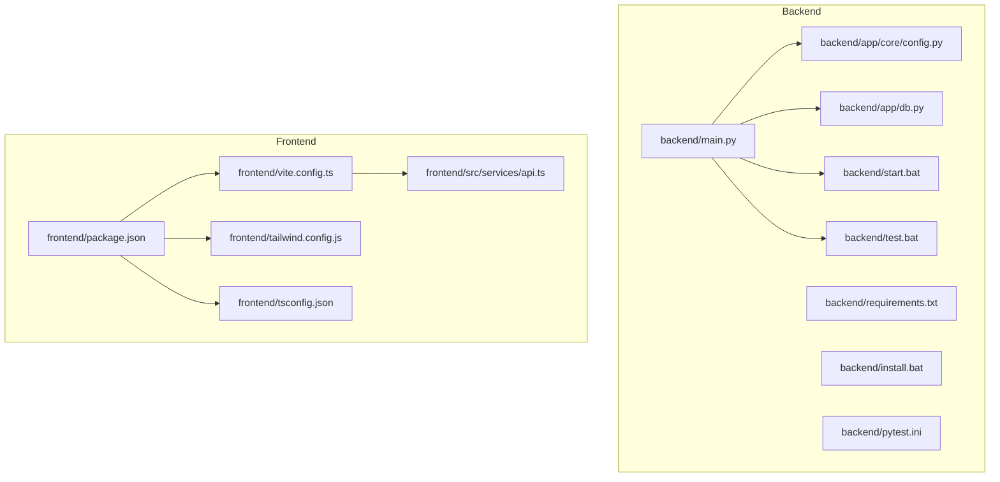
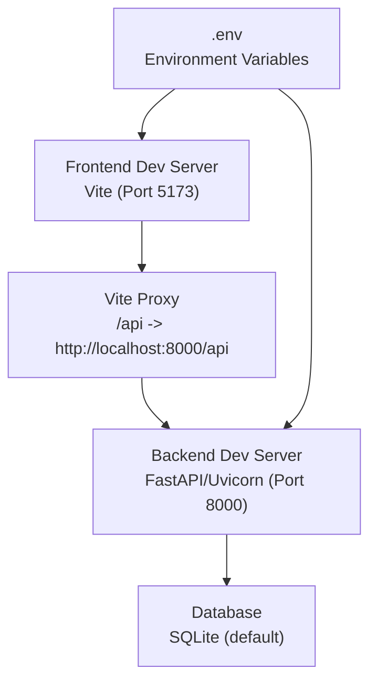
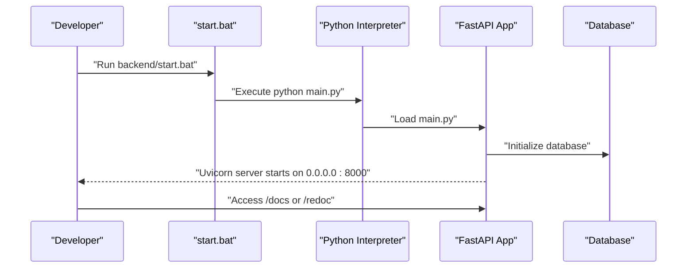
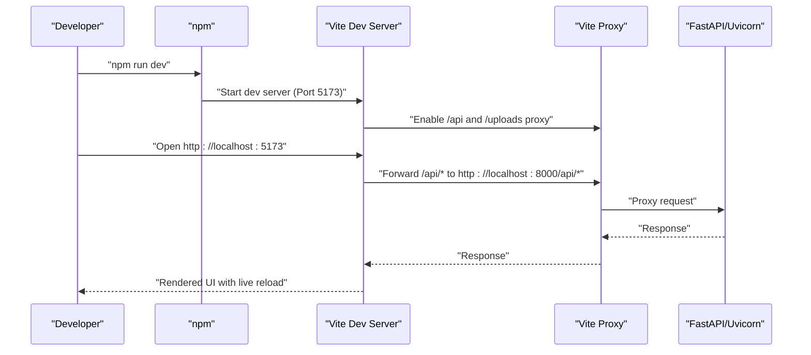

# Development Setup

<cite>
**Referenced Files in This Document**
- [backend/main.py](file://backend/main.py)
- [backend/requirements.txt](file://backend/requirements.txt)
- [backend/start.bat](file://backend/start.bat)
- [backend/install.bat](file://backend/install.bat)
- [backend/test.bat](file://backend/test.bat)
- [backend/pytest.ini](file://backend/pytest.ini)
- [backend/app/core/config.py](file://backend/app/core/config.py)
- [backend/app/db.py](file://backend/app/db.py)
- [backend/README.md](file://backend/README.md)
- [frontend/package.json](file://frontend/package.json)
- [frontend/vite.config.ts](file://frontend/vite.config.ts)
- [frontend/src/services/api.ts](file://frontend/src/services/api.ts)
- [frontend/tailwind.config.js](file://frontend/tailwind.config.js)
- [frontend/tsconfig.json](file://frontend/tsconfig.json)
- [frontend/README.md](file://frontend/README.md)
</cite>

## Table of Contents
1. [Introduction](#introduction)
2. [Project Structure](#project-structure)
3. [Core Components](#core-components)
4. [Architecture Overview](#architecture-overview)
5. [Detailed Component Analysis](#detailed-component-analysis)
6. [Dependency Analysis](#dependency-analysis)
7. [Performance Considerations](#performance-considerations)
8. [Troubleshooting Guide](#troubleshooting-guide)
9. [Conclusion](#conclusion)
10. [Appendices](#appendices)

## Introduction
This document provides a comprehensive guide to set up and develop the 映记 application locally. It covers environment prerequisites, dependency management, development workflows for both frontend (Vite) and backend (FastAPI + uvicorn), Windows batch scripts for automation, IDE configuration recommendations, environment variable setup, and local testing procedures. The goal is to enable developers to start coding, test, and debug efficiently with minimal friction.

## Project Structure
The project is organized into two primary directories:
- backend: FastAPI application with asynchronous database support, routing, and services
- frontend: React + TypeScript application built with Vite, using Axios for API communication and Tailwind CSS for styling

**Diagram sources**
- [backend/main.py:1-119](file://backend/main.py#L1-L119)
- [backend/app/core/config.py:1-105](file://backend/app/core/config.py#L1-L105)
- [backend/app/db.py:1-59](file://backend/app/db.py#L1-L59)
- [backend/requirements.txt:1-26](file://backend/requirements.txt#L1-L26)
- [backend/start.bat:1-46](file://backend/start.bat#L1-L46)
- [backend/install.bat:1-67](file://backend/install.bat#L1-L67)
- [backend/test.bat:1-128](file://backend/test.bat#L1-L128)
- [backend/pytest.ini:1-28](file://backend/pytest.ini#L1-L28)
- [frontend/package.json:1-54](file://frontend/package.json#L1-L54)
- [frontend/vite.config.ts:1-27](file://frontend/vite.config.ts#L1-L27)
- [frontend/src/services/api.ts:1-43](file://frontend/src/services/api.ts#L1-L43)
- [frontend/tailwind.config.js:1-86](file://frontend/tailwind.config.js#L1-L86)
- [frontend/tsconfig.json:1-32](file://frontend/tsconfig.json#L1-L32)

**Section sources**
- [backend/main.py:1-119](file://backend/main.py#L1-L119)
- [frontend/package.json:1-54](file://frontend/package.json#L1-L54)

## Core Components
- Backend framework and runtime
  - FastAPI application with CORS middleware, static file mounting, and lifecycle management
  - Uvicorn ASGI server for development and production
  - Environment-driven configuration via pydantic-settings
  - Asynchronous SQLAlchemy ORM for database operations
- Frontend toolchain
  - Vite for development server with hot module replacement
  - React + TypeScript with Tailwind CSS
  - Axios for HTTP requests with interceptors for auth and error handling
  - ESLint and Vitest for linting and testing

Key implementation references:
- Backend entrypoint and server configuration: [backend/main.py:109-119](file://backend/main.py#L109-L119)
- Backend dependencies: [backend/requirements.txt:1-26](file://backend/requirements.txt#L1-L26)
- Frontend scripts and toolchain: [frontend/package.json:6-13](file://frontend/package.json#L6-L13)
- Frontend development server and proxy: [frontend/vite.config.ts:13-25](file://frontend/vite.config.ts#L13-L25)
- Frontend API client: [frontend/src/services/api.ts:1-43](file://frontend/src/services/api.ts#L1-L43)

**Section sources**
- [backend/main.py:1-119](file://backend/main.py#L1-L119)
- [backend/requirements.txt:1-26](file://backend/requirements.txt#L1-L26)
- [frontend/package.json:1-54](file://frontend/package.json#L1-L54)
- [frontend/vite.config.ts:1-27](file://frontend/vite.config.ts#L1-L27)
- [frontend/src/services/api.ts:1-43](file://frontend/src/services/api.ts#L1-L43)

## Architecture Overview
The development architecture consists of:
- Frontend (Vite) running on port 5173, proxying API calls to the backend
- Backend (FastAPI + Uvicorn) running on port 8000, serving REST APIs and static uploads
- Database configured via environment variables (default SQLite for development)
- Environment variables managed through a .env file loaded by pydantic-settings

**Diagram sources**
- [frontend/vite.config.ts:13-25](file://frontend/vite.config.ts#L13-L25)
- [backend/main.py:109-119](file://backend/main.py#L109-L119)
- [backend/app/core/config.py:22-26](file://backend/app/core/config.py#L22-L26)

**Section sources**
- [frontend/vite.config.ts:1-27](file://frontend/vite.config.ts#L1-L27)
- [backend/main.py:1-119](file://backend/main.py#L1-L119)
- [backend/app/core/config.py:1-105](file://backend/app/core/config.py#L1-L105)

## Detailed Component Analysis

### Backend Development Environment (FastAPI + Uvicorn)
- Application lifecycle and startup
  - Uses lifespan context manager to initialize the database and schedule periodic tasks during startup
  - Mounts static upload directories for avatars, diary images, and community images
  - Exposes health check endpoint and root metadata endpoint
- Development server
  - Uvicorn runs with reload enabled when debug is True, enabling hot reload during development
  - Host binding to 0.0.0.0 allows external access if needed
- Configuration
  - Settings class defines application name, version, debug flag, CORS origins, database URL, JWT parameters, email settings, rate limits, AI provider credentials, and Qdrant vector search configuration
  - CORS origins parsed from comma-separated string
- Database initialization
  - Asynchronous engine creation with echo controlled by debug setting
  - Session factory with expiration policy
  - Centralized init_db function registers models and creates tables

Recommended development commands:
- Run with uvicorn: [backend/main.py:109-119](file://backend/main.py#L109-L119)
- Use provided batch script: [backend/start.bat:33-43](file://backend/start.bat#L33-L43)

**Section sources**
- [backend/main.py:19-119](file://backend/main.py#L19-L119)
- [backend/app/core/config.py:10-105](file://backend/app/core/config.py#L10-L105)
- [backend/app/db.py:11-59](file://backend/app/db.py#L11-L59)
- [backend/start.bat:1-46](file://backend/start.bat#L1-L46)

#### Backend Startup Flow (Sequence)

**Diagram sources**
- [backend/start.bat:33-43](file://backend/start.bat#L33-L43)
- [backend/main.py:109-119](file://backend/main.py#L109-L119)

### Frontend Development Environment (Vite + React + TypeScript)
- Scripts and toolchain
  - Development: npm run dev (Vite)
  - Build: tsc + vite build
  - Preview: vite preview
  - Linting: eslint with TypeScript parser
  - Testing: vitest with optional UI mode
- Development server
  - Port 5173 with React plugin and path alias @ -> src
  - Proxy configured for /api and /uploads to backend address
- API client
  - Axios instance with base URL from VITE_API_BASE_URL
  - Request interceptor adds Authorization header if present
  - Response interceptor handles 401 by clearing tokens and redirecting
- Styling and types
  - Tailwind CSS configured with content paths and custom color palette
  - TypeScript strict mode with bundler resolution and path aliases

Recommended development commands:
- Install dependencies: [frontend/package.json:40-41](file://frontend/package.json#L40-L41)
- Start dev server: [frontend/package.json:7-7](file://frontend/package.json#L7-L7)
- Configure proxy and base URL: [frontend/vite.config.ts:13-25](file://frontend/vite.config.ts#L13-L25), [frontend/src/services/api.ts:4-4](file://frontend/src/services/api.ts#L4-L4)

**Section sources**
- [frontend/package.json:1-54](file://frontend/package.json#L1-L54)
- [frontend/vite.config.ts:1-27](file://frontend/vite.config.ts#L1-L27)
- [frontend/src/services/api.ts:1-43](file://frontend/src/services/api.ts#L1-L43)
- [frontend/tailwind.config.js:1-86](file://frontend/tailwind.config.js#L1-L86)
- [frontend/tsconfig.json:1-32](file://frontend/tsconfig.json#L1-L32)

#### Frontend Development Workflow (Sequence)

**Diagram sources**
- [frontend/package.json:7-7](file://frontend/package.json#L7-L7)
- [frontend/vite.config.ts:13-25](file://frontend/vite.config.ts#L13-L25)

### Environment Variables and Configuration
- Backend (.env)
  - Required keys include JWT secret, QQ email credentials, and optionally AI provider and vector search settings
  - Allowed origins for CORS are configurable
  - Database URL defaults to SQLite but can be switched to PostgreSQL
- Frontend (.env.local)
  - VITE_API_BASE_URL should point to backend address (http://localhost:8000)
  - Additional environment-specific overrides are supported by Vite

References:
- Backend settings definition: [backend/app/core/config.py:10-105](file://backend/app/core/config.py#L10-L105)
- Backend README setup steps: [backend/README.md:35-46](file://backend/README.md#L35-L46)
- Frontend environment variables: [frontend/README.md:85-92](file://frontend/README.md#L85-L92)

**Section sources**
- [backend/app/core/config.py:1-105](file://backend/app/core/config.py#L1-L105)
- [backend/README.md:35-46](file://backend/README.md#L35-L46)
- [frontend/README.md:85-92](file://frontend/README.md#L85-L92)

### Windows Batch Scripts for Development
- install.bat
  - Sets HTTP/HTTPS proxy for pip
  - Checks Python availability
  - Upgrades pip and installs requirements.txt
  - Provides troubleshooting tips for proxy/network issues
- start.bat
  - Optionally activates virtual environment
  - Validates installed dependencies
  - Starts Python main.py and prints service URLs
- test.bat
  - Installs pytest if missing
  - Offers menu-driven test selection (unit, security, email, auth, real email scenarios, coverage)
  - Supports generating HTML coverage reports

References:
- [backend/install.bat:1-67](file://backend/install.bat#L1-L67)
- [backend/start.bat:1-46](file://backend/start.bat#L1-L46)
- [backend/test.bat:1-128](file://backend/test.bat#L1-L128)
- [backend/pytest.ini:1-28](file://backend/pytest.ini#L1-L28)

**Section sources**
- [backend/install.bat:1-67](file://backend/install.bat#L1-L67)
- [backend/start.bat:1-46](file://backend/start.bat#L1-L46)
- [backend/test.bat:1-128](file://backend/test.bat#L1-L128)
- [backend/pytest.ini:1-28](file://backend/pytest.ini#L1-L28)

## Dependency Analysis
- Backend dependencies (selected)
  - Web framework: FastAPI, Uvicorn
  - Database: SQLAlchemy 2.x, aiosqlite, Alembic
  - Security: python-jose, passlib, Pydantic, pydantic-settings, python-dotenv
  - HTTP client: httpx
  - Utilities: pytz
- Frontend dependencies (selected)
  - Core: React, React DOM, React Router
  - State management: Zustand
  - HTTP: Axios
  - UI: shadcn/ui components, Radix UI, Lucide icons
  - Styling: Tailwind CSS, Recharts
  - Tooling: Vite, TypeScript, ESLint, Vitest

References:
- [backend/requirements.txt:1-26](file://backend/requirements.txt#L1-L26)
- [frontend/package.json:14-52](file://frontend/package.json#L14-L52)

**Section sources**
- [backend/requirements.txt:1-26](file://backend/requirements.txt#L1-L26)
- [frontend/package.json:1-54](file://frontend/package.json#L1-L54)

## Performance Considerations
- Enable debug mode for SQL logging during development (controlled by settings.debug)
- Use Vite's built-in hot reload for rapid iteration
- Keep frontend proxy minimal to avoid unnecessary overhead
- Prefer lazy loading and code splitting for large components
- Use Tailwind utilities judiciously to minimize bundle size

[No sources needed since this section provides general guidance]

## Troubleshooting Guide
Common issues and resolutions:
- Backend
  - Missing dependencies: Use install.bat to install requirements with proxy support
  - Database initialization failures: Delete SQLite file and restart application
  - JWT validation errors: Verify SECRET_KEY is set and not expired
- Frontend
  - Port conflicts: Change Vite server.port in vite.config.ts
  - API proxy failures: Confirm VITE_API_BASE_URL and backend is reachable
  - Component styles not applying: Ensure Tailwind dependencies are installed and configured
- Testing
  - Coverage generation: Install pytest-cov and run coverage report via test.bat

References:
- Backend troubleshooting: [backend/README.md:139-156](file://backend/README.md#L139-L156)
- Frontend troubleshooting: [frontend/README.md:200-220](file://frontend/README.md#L200-L220)
- Test script options: [backend/test.bat:22-42](file://backend/test.bat#L22-L42)

**Section sources**
- [backend/README.md:139-156](file://backend/README.md#L139-L156)
- [frontend/README.md:200-220](file://frontend/README.md#L200-L220)
- [backend/test.bat:22-42](file://backend/test.bat#L22-L42)

## Conclusion
With the provided setup, environment variables, and batch scripts, developers can quickly spin up both frontend and backend services, iterate with hot reload, and run tests efficiently. The documented configuration ensures consistent behavior across environments while allowing easy customization for development needs.

[No sources needed since this section summarizes without analyzing specific files]

## Appendices

### Development Workflow Checklist
- Backend
  - Install dependencies: [backend/install.bat:32-38](file://backend/install.bat#L32-L38)
  - Set environment variables (.env): [backend/app/core/config.py:10-105](file://backend/app/core/config.py#L10-L105)
  - Start backend: [backend/start.bat:33-43](file://backend/start.bat#L33-L43)
- Frontend
  - Install dependencies: [frontend/package.json:40-41](file://frontend/package.json#L40-L41)
  - Configure VITE_API_BASE_URL: [frontend/README.md:85-92](file://frontend/README.md#L85-L92)
  - Start frontend: [frontend/package.json:7-7](file://frontend/package.json#L7-L7)
- Testing
  - Run tests: [backend/test.bat:45-50](file://backend/test.bat#L45-L50)
  - Generate coverage: [backend/test.bat:105-114](file://backend/test.bat#L105-L114)

**Section sources**
- [backend/install.bat:32-38](file://backend/install.bat#L32-L38)
- [backend/app/core/config.py:10-105](file://backend/app/core/config.py#L10-L105)
- [backend/start.bat:33-43](file://backend/start.bat#L33-L43)
- [frontend/package.json:7-7](file://frontend/package.json#L7-L7)
- [frontend/README.md:85-92](file://frontend/README.md#L85-L92)
- [backend/test.bat:45-50](file://backend/test.bat#L45-L50)
- [backend/test.bat:105-114](file://backend/test.bat#L105-L114)