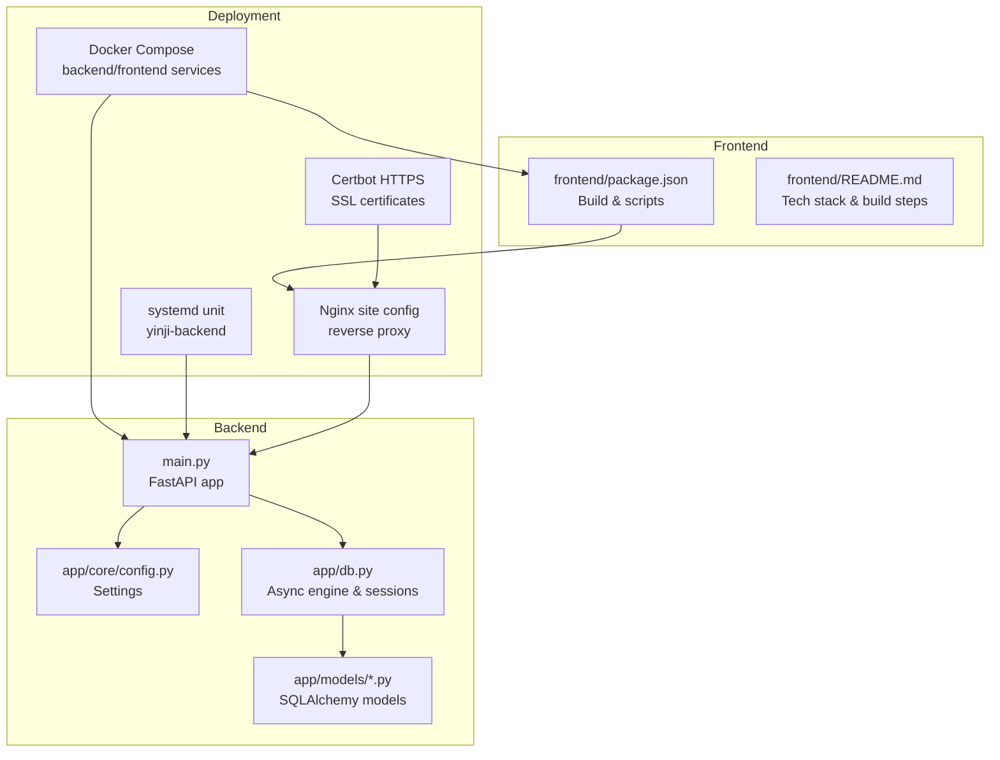
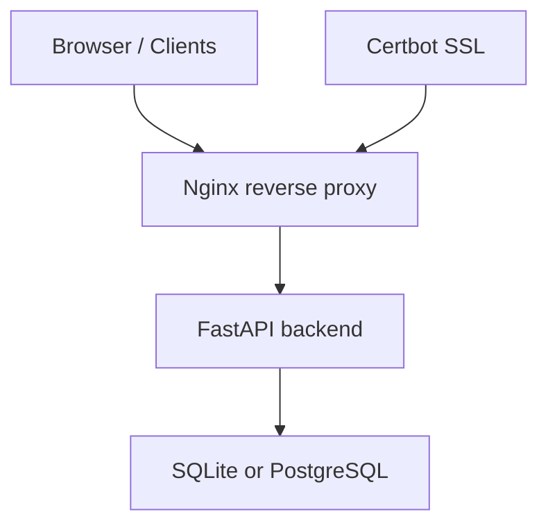
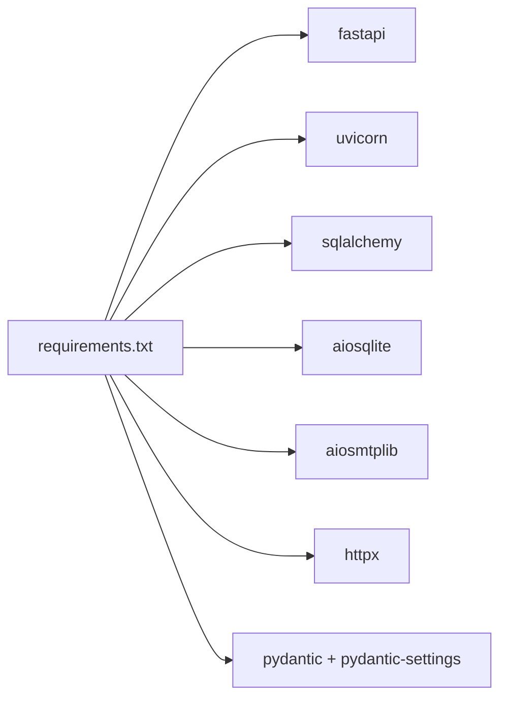
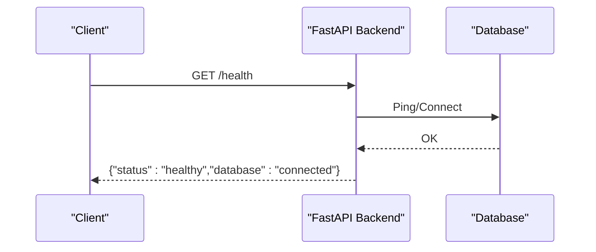
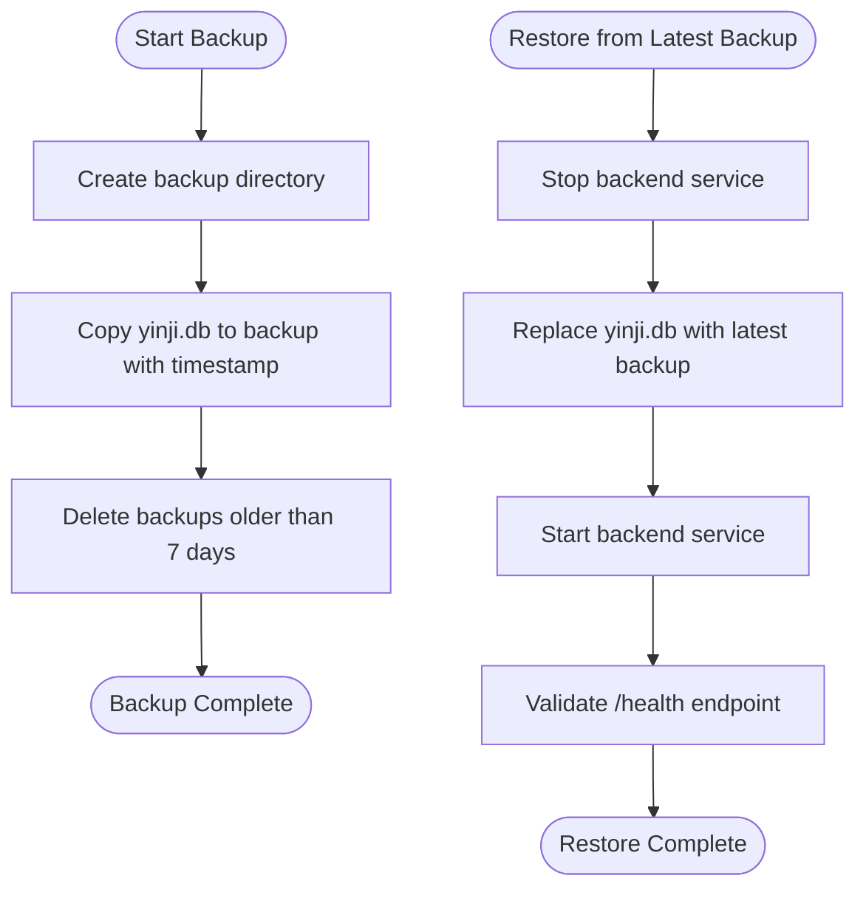
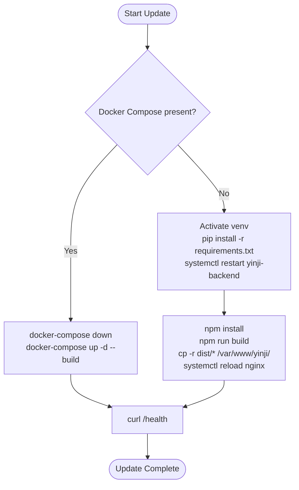

# Monitoring and Maintenance

<cite>
**Referenced Files in This Document**
- [DEPLOY.md](file://DEPLOY.md)
- [QUICK_START.md](file://docs/QUICK_START.md)
- [backend/README.md](file://backend/README.md)
- [frontend/README.md](file://frontend/README.md)
- [backend/main.py](file://backend/main.py)
- [backend/app/core/config.py](file://backend/app/core/config.py)
- [backend/app/db.py](file://backend/app/db.py)
- [backend/requirements.txt](file://backend/requirements.txt)
- [backend/install.bat](file://backend/install.bat)
- [backend/start.bat](file://backend/start.bat)
- [backend/scripts/rebuild_timeline_events.py](file://backend/scripts/rebuild_timeline_events.py)
- [backend/migrate_add_profile_fields.py](file://backend/migrate_add_profile_fields.py)
- [backend/tests/conftest.py](file://backend/tests/conftest.py)
</cite>

## Table of Contents
1. [Introduction](#introduction)
2. [Project Structure](#project-structure)
3. [Core Components](#core-components)
4. [Architecture Overview](#architecture-overview)
5. [Detailed Component Analysis](#detailed-component-analysis)
6. [Dependency Analysis](#dependency-analysis)
7. [Performance Considerations](#performance-considerations)
8. [Troubleshooting Guide](#troubleshooting-guide)
9. [Conclusion](#conclusion)
10. [Appendices](#appendices)

## Introduction
This document provides comprehensive monitoring and maintenance guidance for the Yinji application. It covers logging strategies for Docker and systemd deployments, database backup and restoration procedures, application update workflows for both Docker and manual deployments, performance monitoring, troubleshooting for common issues, maintenance schedules, security updates, disaster recovery, and capacity planning.

## Project Structure
The Yinji application consists of:
- Backend service built with FastAPI and asynchronous SQLAlchemy, exposing REST APIs and serving static uploads.
- Frontend built with React and Vite, served via Nginx in production.
- Deployment options include Docker Compose and manual systemd/Nginx setup.

**Diagram sources**
- [backend/main.py:1-119](file://backend/main.py#L1-L119)
- [backend/app/core/config.py:1-105](file://backend/app/core/config.py#L1-L105)
- [backend/app/db.py:1-59](file://backend/app/db.py#L1-L59)
- [frontend/README.md:1-228](file://frontend/README.md#L1-L228)
- [DEPLOY.md:23-149](file://DEPLOY.md#L23-L149)

**Section sources**
- [DEPLOY.md:1-400](file://DEPLOY.md#L1-L400)
- [backend/README.md:1-160](file://backend/README.md#L1-L160)
- [frontend/README.md:1-228](file://frontend/README.md#L1-L228)

## Core Components
- Backend application lifecycle and health endpoint:
  - Initializes the database and starts a scheduler loop during application lifespan.
  - Provides a health check endpoint indicating application and database connectivity.
- Configuration management:
  - Centralized settings via pydantic-settings, supporting environment-driven configuration for database URL, CORS origins, JWT, email, AI, and Qdrant.
- Database layer:
  - Asynchronous SQLAlchemy engine and session factory, with initialization that creates all registered tables.
- Frontend build and deployment:
  - Build artifacts deployed to Nginx or static hosting providers; development server configured via Vite.

Key operational endpoints and configurations:
- Health check: GET /health
- Root: GET /
- Static uploads mount: /uploads
- Environment variables managed via .env and settings model

**Section sources**
- [backend/main.py:1-119](file://backend/main.py#L1-L119)
- [backend/app/core/config.py:1-105](file://backend/app/core/config.py#L1-L105)
- [backend/app/db.py:1-59](file://backend/app/db.py#L1-L59)
- [backend/README.md:1-160](file://backend/README.md#L1-L160)
- [frontend/README.md:1-228](file://frontend/README.md#L1-L228)

## Architecture Overview
The system supports two primary deployment modes:
- Docker Compose: backend service (FastAPI) and frontend service (Nginx) orchestrated together.
- Manual deployment: backend managed by systemd, frontend served by Nginx, with optional HTTPS via Certbot.

**Diagram sources**
- [DEPLOY.md:23-149](file://DEPLOY.md#L23-L149)
- [backend/main.py:1-119](file://backend/main.py#L1-L119)
- [backend/app/core/config.py:1-105](file://backend/app/core/config.py#L1-L105)

## Detailed Component Analysis

### Logging Strategies
Logging approaches differ by deployment mode:

- Docker Compose:
  - Use container logs for backend and frontend services.
  - Commands to follow logs and inspect service status are documented in the deployment guide.
- systemd:
  - Use journalctl to monitor backend service logs.
  - Nginx access logs can be tailed for frontend traffic insights.

Log aggregation and rotation recommendations:
- Centralized log collection: deploy a lightweight collector (e.g., filebeat or similar) to ship logs to a central store.
- Rotation: configure logrotate for systemd journal and Nginx logs to prevent disk growth.
- Structured logging: consider adding structured log formatting and correlation IDs for improved traceability.

**Section sources**
- [DEPLOY.md:320-330](file://DEPLOY.md#L320-L330)

### Database Backup Procedures
Backups are performed by copying the SQLite database file. The deployment guide includes:
- A backup script that copies the database file to a dated backup location.
- A retention policy using find to delete backups older than seven days.
- A cron job suggestion to schedule daily backups at a specified time.

Operational steps:
- Create the backup script and set executable permissions.
- Add a crontab entry to automate daily backups.
- Verify backups by checking the backup directory and ensuring recent files exist.

Restoration process:
- Stop the backend service.
- Restore the database file from the latest backup.
- Restart the backend service and verify connectivity via the health endpoint.

Security and integrity:
- Ensure backup directories are protected and only accessible to authorized users.
- Optionally encrypt backups at rest if sensitive data is present.

**Section sources**
- [DEPLOY.md:332-353](file://DEPLOY.md#L332-L353)

### Application Update Procedures
Two update workflows are supported:

- Docker Compose:
  - Pull latest code and rebuild services with docker-compose.
  - Use the provided automation script for streamlined updates.

- Manual deployment:
  - Update backend: activate virtual environment, upgrade Python dependencies, restart systemd service.
  - Update frontend: install Node dependencies, build production bundle, copy to web root, reload Nginx.

Validation after updates:
- Confirm backend health endpoint responds as healthy.
- Verify frontend loads and API requests succeed.

**Section sources**
- [DEPLOY.md:278-316](file://DEPLOY.md#L278-L316)
- [docs/QUICK_START.md:209-268](file://docs/QUICK_START.md#L209-L268)

### Performance Monitoring
Resource utilization:
- Monitor CPU, memory, and disk usage on the host system.
- Track container resource consumption if using Docker Compose.

Database query optimization:
- Enable SQL echoing in debug mode to review queries during development.
- Use connection pooling and avoid N+1 queries; leverage asynchronous sessions efficiently.
- Index frequently queried columns (as defined by models).

Application health checks:
- Use the /health endpoint to validate backend availability and database connectivity.
- Integrate periodic health checks into monitoring systems.

Frontend performance:
- Analyze build sizes and enable code splitting.
- Use browser developer tools to profile network requests and rendering performance.

**Section sources**
- [backend/app/core/config.py:1-105](file://backend/app/core/config.py#L1-L105)
- [backend/app/db.py:1-59](file://backend/app/db.py#L1-L59)
- [docs/QUICK_START.md:221-240](file://docs/QUICK_START.md#L221-L240)

### Troubleshooting Procedures
Common issues and resolutions:

- Backend startup failures:
  - Inspect backend logs using Docker Compose logs or journalctl.
  - Check for port conflicts (default backend port is 8000).

- Frontend access problems:
  - Verify Nginx status and configuration syntax.
  - Review Nginx error logs and ensure the site is enabled.

- Database corruption or initialization issues:
  - Check database file permissions and ownership.
  - Reinitialize the database using the provided initialization routine.

- Email delivery issues:
  - Confirm QQ SMTP settings and authorization code.
  - Validate SMTP host/port and SSL configuration.

- Authentication and tokens:
  - Ensure SECRET_KEY is configured and tokens are not expired.

- Dependency and environment issues:
  - On Windows, use provided batch scripts to install dependencies and start the backend.
  - Confirm environment variables are loaded from .env.

**Section sources**
- [DEPLOY.md:355-389](file://DEPLOY.md#L355-L389)
- [backend/README.md:139-160](file://backend/README.md#L139-L160)
- [backend/install.bat:1-67](file://backend/install.bat#L1-L67)
- [backend/start.bat:1-46](file://backend/start.bat#L1-L46)

### Maintenance Schedules
Recommended recurring tasks:
- Daily:
  - Run the backup script and verify backup creation.
  - Review backend and Nginx logs for anomalies.
- Weekly:
  - Audit database size and clean old migrations or unused data if applicable.
  - Rotate logs and archive old entries.
- Monthly:
  - Review SSL certificate expiration and renew as needed.
  - Update dependencies and test deployments in a staging environment.

**Section sources**
- [DEPLOY.md:332-353](file://DEPLOY.md#L332-L353)
- [DEPLOY.md:265-276](file://DEPLOY.md#L265-L276)

### Security Updates
- Keep base images updated in Docker environments.
- Regularly update Python and Node.js dependencies.
- Apply OS and Nginx updates.
- Enforce HTTPS using Certbot and configure automatic renewal.

**Section sources**
- [DEPLOY.md:265-276](file://DEPLOY.md#L265-L276)

### Disaster Recovery
Recovery steps:
- Restore the latest successful backup to the database file.
- Recreate containers or restart services to apply restored data.
- Validate application health and user data integrity.

Documentation and testing:
- Maintain a documented recovery playbook and periodically test restoration procedures.

**Section sources**
- [DEPLOY.md:332-353](file://DEPLOY.md#L332-L353)

### Capacity Planning and Scaling Considerations
- Horizontal scaling:
  - Use Docker Compose scaling for stateless services or deploy behind a load balancer.
- Vertical scaling:
  - Increase host resources (CPU/RAM) as usage grows.
- Database:
  - Consider migrating from SQLite to PostgreSQL for higher concurrency and reliability.
  - Plan for read replicas and connection pooling.
- Caching and CDN:
  - Serve frontend assets via CDN and cache static content.
- Observability:
  - Instrument metrics and traces to identify bottlenecks.

**Section sources**
- [backend/README.md:7-12](file://backend/README.md#L7-L12)
- [backend/app/core/config.py:22-27](file://backend/app/core/config.py#L22-L27)

## Dependency Analysis
Runtime dependencies and their roles:
- FastAPI and Uvicorn: web framework and ASGI server.
- SQLAlchemy 2.0 (async): ORM and asynchronous database access.
- aiosmtplib: SMTP client for email notifications.
- httpx: HTTP client for external API calls.
- pydantic/pydantic-settings/python-dotenv: configuration management.

**Diagram sources**
- [backend/requirements.txt:1-26](file://backend/requirements.txt#L1-L26)

**Section sources**
- [backend/requirements.txt:1-26](file://backend/requirements.txt#L1-L26)

## Performance Considerations
- Logging overhead: reduce log verbosity in production; avoid excessive SQL echoing.
- Database connections: tune pool size and timeouts; ensure proper session lifecycle.
- Static files: serve via Nginx or CDN; enable compression and caching.
- Background tasks: monitor scheduled jobs and ensure they complete within expected intervals.

[No sources needed since this section provides general guidance]

## Troubleshooting Guide
- Backend logs:
  - Docker: docker-compose logs -f backend
  - systemd: journalctl -u yinji-backend -f
- Frontend logs:
  - Nginx access log: tail -f /var/log/nginx/access.log
  - Nginx error log: tail -f /var/log/nginx/error.log
- Health checks:
  - curl http://your-server-ip:8000/health
- Database:
  - Check file permissions and reinitialize if needed.

**Section sources**
- [DEPLOY.md:320-330](file://DEPLOY.md#L320-L330)
- [docs/QUICK_START.md:221-228](file://docs/QUICK_START.md#L221-L228)

## Conclusion
This guide consolidates monitoring and maintenance practices for the Yinji application across Docker and systemd deployments. By implementing robust logging, automated backups, standardized update workflows, and continuous performance monitoring, operators can maintain a reliable and scalable system. Regular audits, security updates, and disaster recovery testing further strengthen operational resilience.

[No sources needed since this section summarizes without analyzing specific files]

## Appendices

### Appendix A: Health Check Workflow

**Diagram sources**
- [backend/main.py:100-106](file://backend/main.py#L100-L106)

### Appendix B: Backup and Restore Flow

**Diagram sources**
- [DEPLOY.md:332-353](file://DEPLOY.md#L332-L353)

### Appendix C: Update Deployment Flow

**Diagram sources**
- [DEPLOY.md:278-316](file://DEPLOY.md#L278-L316)
- [docs/QUICK_START.md:209-219](file://docs/QUICK_START.md#L209-L219)