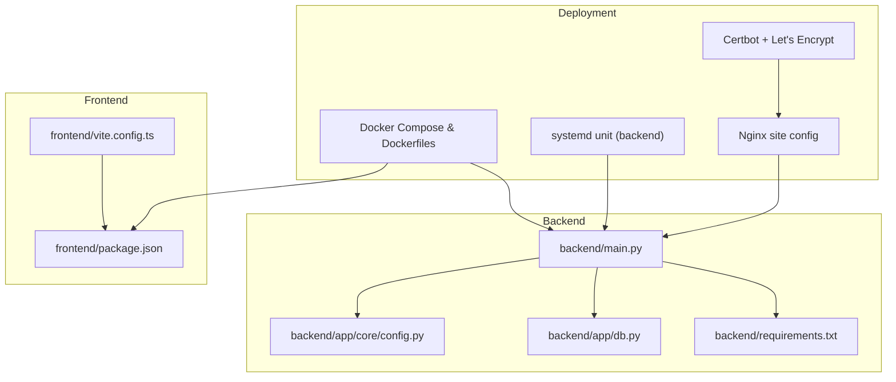
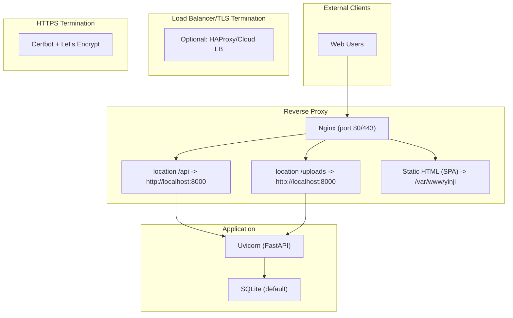
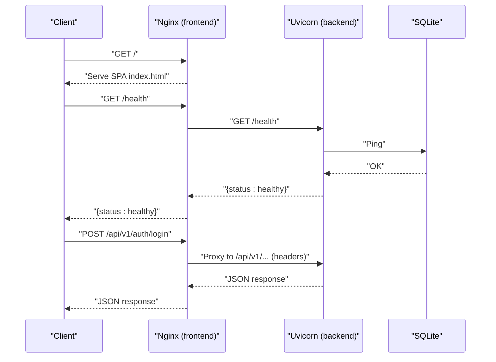
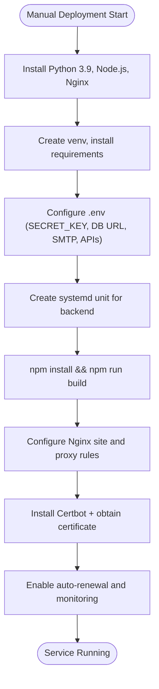
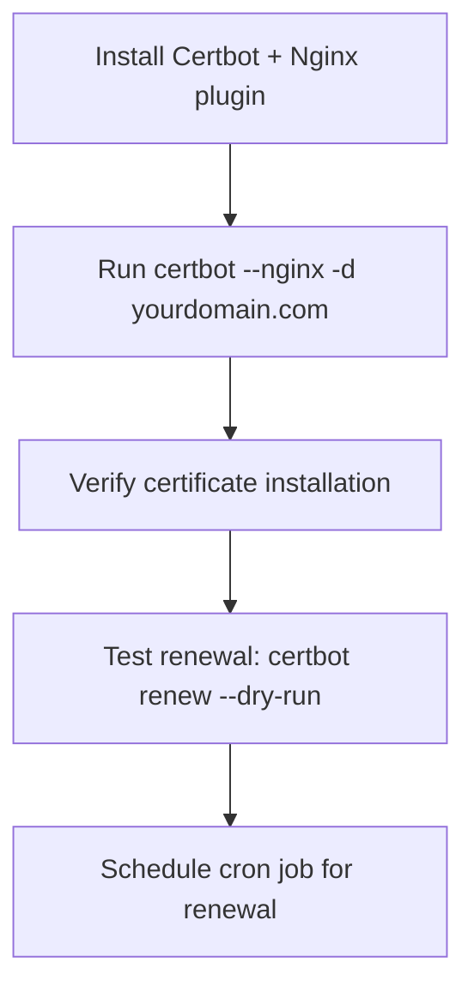
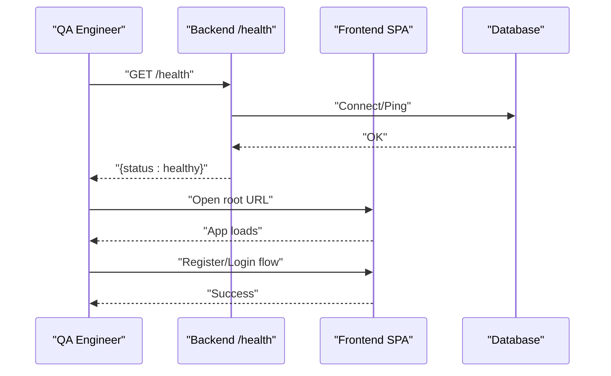
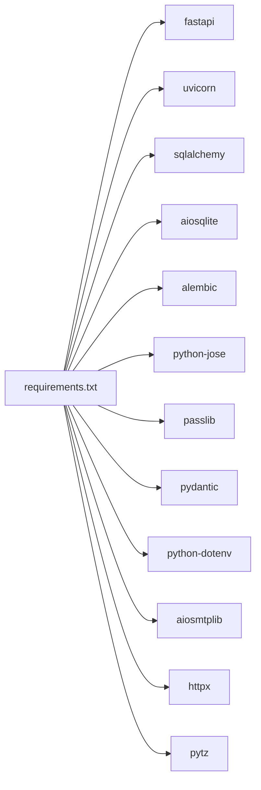

# Production Deployment

<cite>
**Referenced Files in This Document**
- [DEPLOY.md](file://DEPLOY.md)
- [main.py](file://backend/main.py)
- [config.py](file://backend/app/core/config.py)
- [db.py](file://backend/app/db.py)
- [requirements.txt](file://backend/requirements.txt)
- [vite.config.ts](file://frontend/vite.config.ts)
- [package.json](file://frontend/package.json)
- [.gitignore](file://.gitignore)
- [start.bat](file://backend/start.bat)
</cite>

## Table of Contents
1. [Introduction](#introduction)
2. [Project Structure](#project-structure)
3. [Core Components](#core-components)
4. [Architecture Overview](#architecture-overview)
5. [Detailed Component Analysis](#detailed-component-analysis)
6. [Dependency Analysis](#dependency-analysis)
7. [Performance Considerations](#performance-considerations)
8. [Troubleshooting Guide](#troubleshooting-guide)
9. [Conclusion](#conclusion)
10. [Appendices](#appendices)

## Introduction
This document provides production-grade deployment guidance for the Yinyinji application. It covers two recommended approaches: Docker-based deployment with container orchestration and manual deployment for traditional servers. It also documents environment variable configuration, HTTPS setup with Certbot/Let's Encrypt, deployment verification, health checks, initial testing, production optimizations, security hardening, and monitoring recommendations.

## Project Structure
The application consists of:
- Backend: FastAPI application with asynchronous SQLAlchemy ORM, Uvicorn ASGI server, and static file serving for uploads.
- Frontend: React application built with Vite, served via Nginx in production.
- Shared deployment artifacts: Docker Compose, Dockerfiles, systemd unit, Nginx site configuration, and update/backup scripts.

**Diagram sources**
- [main.py:1-119](file://backend/main.py#L1-L119)
- [config.py:1-105](file://backend/app/core/config.py#L1-L105)
- [db.py:1-59](file://backend/app/db.py#L1-L59)
- [requirements.txt:1-26](file://backend/requirements.txt#L1-L26)
- [vite.config.ts:1-27](file://frontend/vite.config.ts#L1-L27)
- [package.json:1-54](file://frontend/package.json#L1-L54)

**Section sources**
- [DEPLOY.md:1-400](file://DEPLOY.md#L1-L400)
- [main.py:1-119](file://backend/main.py#L1-L119)
- [config.py:1-105](file://backend/app/core/config.py#L1-L105)
- [db.py:1-59](file://backend/app/db.py#L1-L59)
- [requirements.txt:1-26](file://backend/requirements.txt#L1-L26)
- [vite.config.ts:1-27](file://frontend/vite.config.ts#L1-L27)
- [package.json:1-54](file://frontend/package.json#L1-L54)

## Core Components
- Backend application entrypoint and lifecycle management:
  - Initializes database and schedules daily tasks during startup.
  - Serves API endpoints under /api/v1 and static uploads under /uploads.
  - Provides health check endpoint.
- Configuration management:
  - Centralized settings via pydantic-settings with environment-driven defaults.
  - Supports SQLite by default; can be switched to PostgreSQL-compatible URLs.
- Database layer:
  - Asynchronous SQLAlchemy engine and session factory.
  - Automatic table creation on initialization.
- Frontend build and proxy configuration:
  - Vite dev server proxies /api and /uploads to backend.
  - Production builds are served by Nginx.

Key production deployment implications:
- Environment variables drive CORS origins, database URL, JWT secrets, SMTP credentials, and external service keys.
- Health checks and static file serving simplify reverse proxy configurations.
- SQLite is suitable for small to medium deployments; consider PostgreSQL for higher concurrency.

**Section sources**
- [main.py:19-119](file://backend/main.py#L19-L119)
- [config.py:10-105](file://backend/app/core/config.py#L10-L105)
- [db.py:11-59](file://backend/app/db.py#L11-L59)
- [vite.config.ts:13-26](file://frontend/vite.config.ts#L13-L26)

## Architecture Overview
The production architecture supports two deployment modes:

- Docker mode:
  - Backend container exposes port 8000 and mounts the SQLite database file for persistence.
  - Frontend container serves the React build via Nginx on port 80.
  - Optional HTTPS termination via Certbot-managed certificates.

- Manual mode:
  - Backend runs via Uvicorn under systemd.
  - Frontend built and copied to Nginx document root.
  - Nginx proxies /api and /uploads to localhost:8000.

**Diagram sources**
- [DEPLOY.md:228-263](file://DEPLOY.md#L228-L263)
- [main.py:82-106](file://backend/main.py#L82-L106)

## Detailed Component Analysis

### Docker Deployment (Recommended)
- Prerequisites:
  - Install Docker and Docker Compose.
  - Clone repository and prepare environment variables (.env).
- Services:
  - Backend service:
    - Builds from backend directory, exposes port 8000, mounts code and database file, loads .env, runs Uvicorn.
  - Frontend service:
    - Builds from frontend directory, exposes port 80, depends on backend, serves static build via Nginx.
- Volume mounts:
  - Mount backend code for development convenience; mount yinji.db for persistent storage.
- Health checks:
  - Use the /health endpoint to verify backend readiness.
- HTTPS:
  - Run Nginx inside the frontend container or configure TLS termination at a reverse proxy/load balancer with Certbot.

**Diagram sources**
- [DEPLOY.md:75-149](file://DEPLOY.md#L75-L149)
- [main.py:82-106](file://backend/main.py#L82-L106)

**Section sources**
- [DEPLOY.md:23-149](file://DEPLOY.md#L23-L149)
- [main.py:82-106](file://backend/main.py#L82-L106)

### Manual Deployment (Traditional Servers)
- Backend:
  - Create Python 3.9 virtual environment, install dependencies, set environment variables, and run Uvicorn under systemd.
  - Configure systemd unit to manage the backend process.
- Frontend:
  - Build production bundle with npm, copy to Nginx document root.
  - Configure Nginx to serve SPA and proxy /api and /uploads to backend.
- HTTPS:
  - Install Certbot and obtain SSL certificate for domain; configure automatic renewal.

**Diagram sources**
- [DEPLOY.md:151-263](file://DEPLOY.md#L151-L263)

**Section sources**
- [DEPLOY.md:151-263](file://DEPLOY.md#L151-L263)

### Environment Variables (Production)
Critical environment variables managed by the configuration module:
- Application
  - APP_NAME, APP_VERSION, DEBUG, ALLOWED_ORIGINS
- Security
  - SECRET_KEY (required), ACCESS_TOKEN_EXPIRE_MINUTES
- Database
  - DATABASE_URL (default SQLite; consider PostgreSQL for production)
- Email
  - QQ_EMAIL, QQ_EMAIL_AUTH_CODE, SMTP_HOST, SMTP_PORT, SMTP_SECURE
- External Services
  - DEEPSEEK_API_KEY, DEEPSEEK_BASE_URL
  - QDRANT_URL, QDRANT_API_KEY, QDRANT_COLLECTION, QDRANT_VECTOR_DIM
- CORS
  - allowed_origins parsed into a list for FastAPI middleware

Recommendations:
- Generate a strong SECRET_KEY and rotate periodically.
- Store sensitive values in OS keychain or secret manager; avoid committing .env.
- Use separate database credentials for production and limit network exposure.
- Restrict ALLOWED_ORIGINS to production domains only.

**Section sources**
- [config.py:10-105](file://backend/app/core/config.py#L10-L105)
- [DEPLOY.md:55-72](file://DEPLOY.md#L55-L72)

### HTTPS Configuration with Certbot and Let's Encrypt
- Install Certbot with Nginx plugin.
- Obtain certificate for domain(s).
- Set up automatic renewal with dry-run testing.
- Optionally terminate TLS at a reverse proxy/load balancer and forward to Nginx containers.

**Diagram sources**
- [DEPLOY.md:265-276](file://DEPLOY.md#L265-L276)

**Section sources**
- [DEPLOY.md:265-276](file://DEPLOY.md#L265-L276)

### Deployment Verification and Initial Testing
- Health check:
  - Call /health on backend to verify database connectivity and service status.
- Frontend accessibility:
  - Open root URL in browser; SPA should load and show login/register pages.
- Functional smoke tests:
  - Register an account, send verification code, log in, and create a diary entry.
- Logs:
  - Tail Docker logs for backend/frontend or systemd journal for manual deployments.

**Diagram sources**
- [main.py:100-106](file://backend/main.py#L100-L106)
- [DEPLOY.md:221-240](file://DEPLOY.md#L221-L240)

**Section sources**
- [main.py:100-106](file://backend/main.py#L100-L106)
- [DEPLOY.md:221-240](file://DEPLOY.md#L221-L240)

### Production Optimizations and Security Hardening
- Containerization
  - Use multi-stage builds for frontend; pin base images; minimize attack surface.
  - Limit container privileges; disable shell where not needed.
- Backend
  - Disable DEBUG in production; restrict CORS origins; enforce HTTPS.
  - Use connection pooling and tune worker/process counts in Uvicorn for concurrency.
- Database
  - Prefer PostgreSQL for production; enable WAL archiving and backups.
  - Persist yinji.db outside container; schedule regular backups.
- Frontend
  - Build with production flags; enable gzip/brotli compression via Nginx.
  - Serve static assets with cache headers.
- Network and Secrets
  - Use secrets management; restrict inbound firewall to 80/443 and internal ports.
  - Rotate API keys and SMTP credentials regularly.
- Monitoring and Observability
  - Enable structured logging; export metrics if needed.
  - Set up log aggregation and alerting for errors and downtime.

[No sources needed since this section provides general guidance]

### Monitoring Setup Recommendations
- Logging
  - Docker: docker-compose logs -f backend/frontend
  - systemd: journalctl -u yinji-backend -f
  - Nginx: tail -f /var/log/nginx/access.log /var/log/nginx/error.log
- Metrics
  - Track uptime, response latency, error rates, and database connection health.
- Alerts
  - Notify on failed health checks, high error rates, disk pressure, and certificate expiry.

**Section sources**
- [DEPLOY.md:318-330](file://DEPLOY.md#L318-L330)

## Dependency Analysis
Runtime dependencies and their roles:
- Web framework and ASGI server
  - FastAPI, Uvicorn
- Database and migrations
  - SQLAlchemy 2.x, aiosqlite, Alembic
- Authentication and security
  - python-jose, passlib bcrypt, Pydantic, python-dotenv
- Email
  - aiosmtplib
- HTTP client
  - httpx
- Utilities
  - pytz

**Diagram sources**
- [requirements.txt:1-26](file://backend/requirements.txt#L1-L26)

**Section sources**
- [requirements.txt:1-26](file://backend/requirements.txt#L1-L26)

## Performance Considerations
- Database
  - SQLite is simple but may bottleneck under heavy write loads; consider PostgreSQL with read replicas and connection pooling.
- Backend concurrency
  - Tune Uvicorn workers and threads; monitor CPU saturation and memory usage.
- Static assets
  - Serve frontend via Nginx with compression and caching; offload image processing if needed.
- Caching
  - Add Redis/Memcached for session and short-lived caches if traffic grows.
- CDN
  - Use CDN for static assets and uploads to reduce origin load.

[No sources needed since this section provides general guidance]

## Troubleshooting Guide
Common issues and remedies:
- Backend fails to start
  - Check logs via Docker or journalctl; verify port 8000 availability; validate .env correctness.
- Frontend not loading
  - Confirm Nginx is running and configured; verify proxy rules for /api and /uploads.
- Database problems
  - Inspect database file permissions; reinitialize database if corrupted.
- Certificate renewal failures
  - Test dry-run renewal; check DNS and firewall rules for ACME challenges.

**Section sources**
- [DEPLOY.md:355-388](file://DEPLOY.md#L355-L388)

## Conclusion
This guide outlines two robust production deployment paths for Yinyinji: Docker-based orchestration and manual server deployment. By correctly configuring environment variables, enabling HTTPS, verifying health and functionality, and applying production hardening and monitoring, you can operate a secure, scalable, and maintainable instance of the application.

[No sources needed since this section summarizes without analyzing specific files]

## Appendices

### Appendix A: Environment Variable Reference
- Required
  - SECRET_KEY
  - QQ_EMAIL
  - QQ_EMAIL_AUTH_CODE
- Optional but recommended
  - DATABASE_URL (prefer PostgreSQL)
  - DEEPSEEK_API_KEY, DEEPSEEK_BASE_URL
  - QDRANT_URL, QDRANT_API_KEY, QDRANT_COLLECTION, QDRANT_VECTOR_DIM
- CORS and app behavior
  - ALLOWED_ORIGINS
  - DEBUG (should be false in production)

**Section sources**
- [config.py:10-105](file://backend/app/core/config.py#L10-L105)
- [DEPLOY.md:55-72](file://DEPLOY.md#L55-L72)

### Appendix B: Quick Commands
- Docker
  - Build and start: docker-compose up -d
  - View logs: docker-compose logs -f
  - Check status: docker-compose ps
- Manual
  - Reload systemd: sudo systemctl daemon-reload
  - Enable and start backend: sudo systemctl enable yinji-backend && sudo systemctl start yinji-backend
  - Restart Nginx: sudo systemctl restart nginx
- Health check
  - curl http://your-server-ip:8000/health

**Section sources**
- [DEPLOY.md:138-149](file://DEPLOY.md#L138-L149)
- [DEPLOY.md:205-211](file://DEPLOY.md#L205-L211)
- [DEPLOY.md:258-263](file://DEPLOY.md#L258-L263)
- [main.py:100-106](file://backend/main.py#L100-L106)