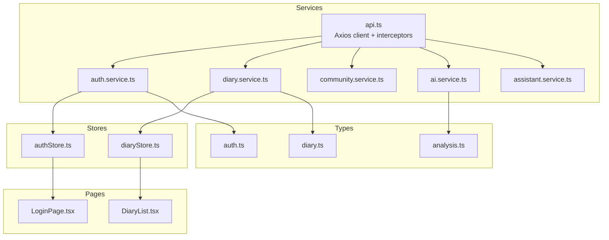
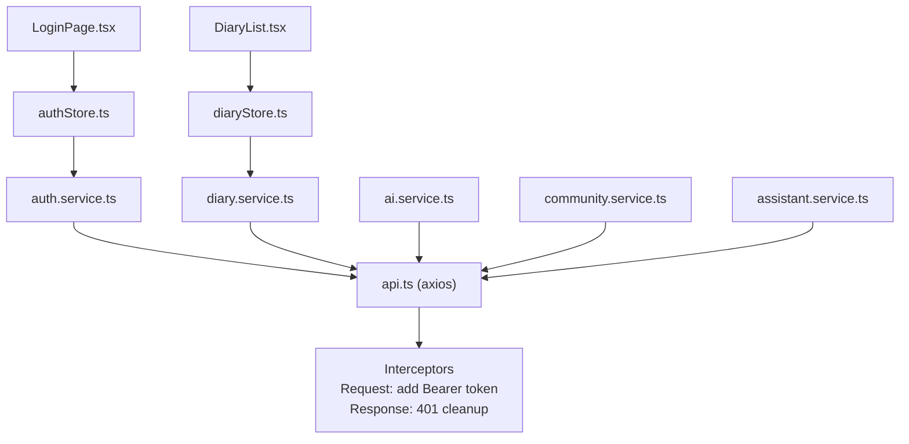
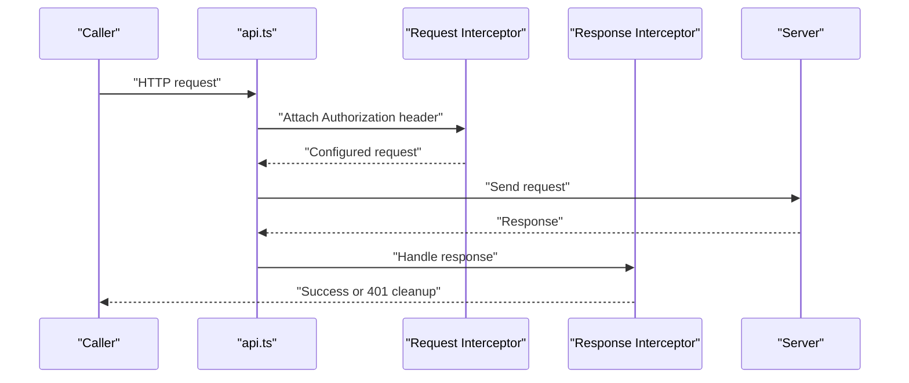
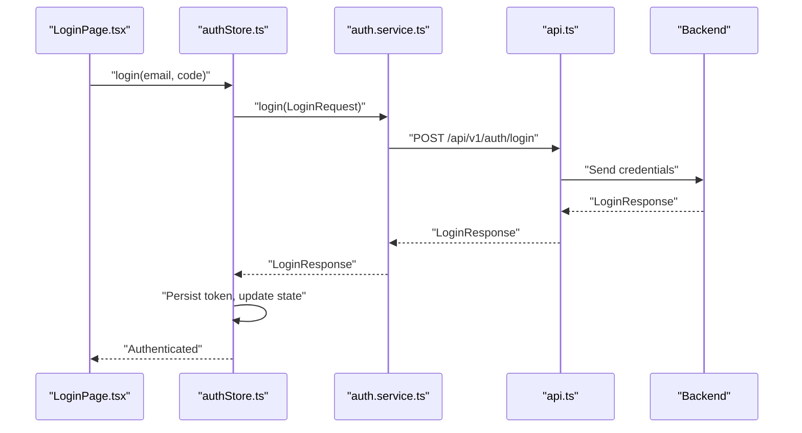
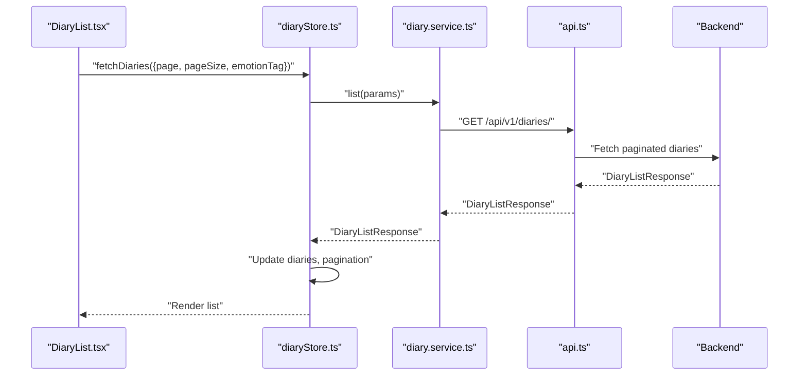
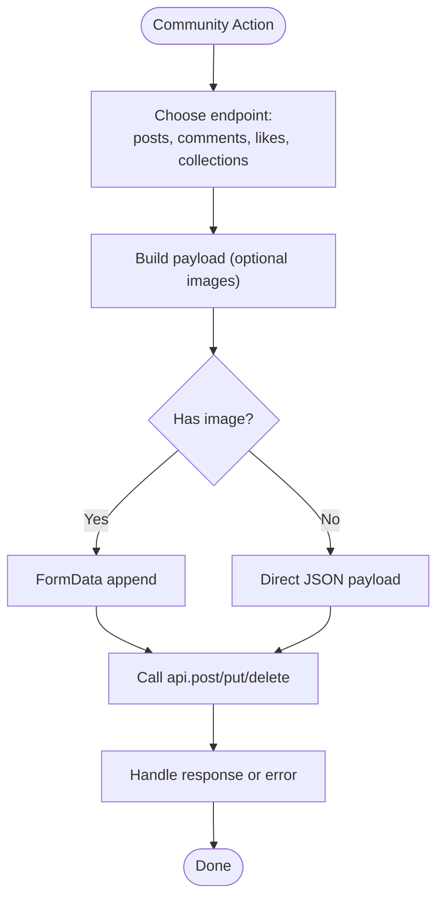
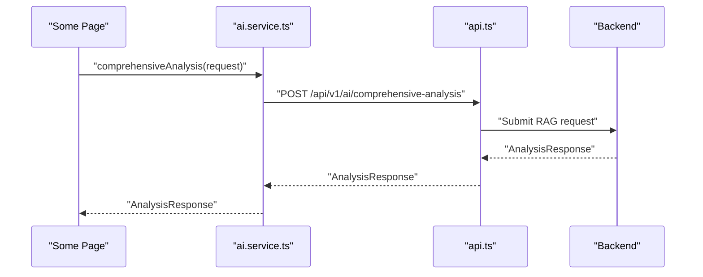
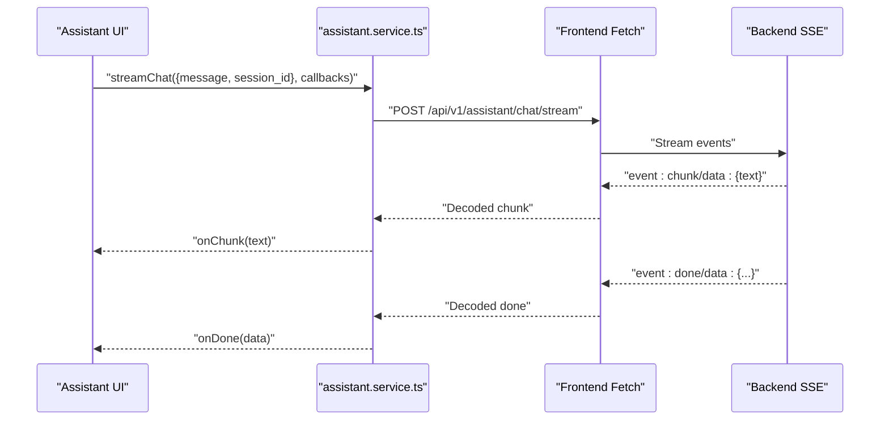

# API Integration

<cite>
**Referenced Files in This Document**
- [api.ts](file://frontend/src/services/api.ts)
- [auth.service.ts](file://frontend/src/services/auth.service.ts)
- [diary.service.ts](file://frontend/src/services/diary.service.ts)
- [community.service.ts](file://frontend/src/services/community.service.ts)
- [ai.service.ts](file://frontend/src/services/ai.service.ts)
- [assistant.service.ts](file://frontend/src/services/assistant.service.ts)
- [authStore.ts](file://frontend/src/store/authStore.ts)
- [diaryStore.ts](file://frontend/src/store/diaryStore.ts)
- [auth.ts](file://frontend/src/types/auth.ts)
- [diary.ts](file://frontend/src/types/diary.ts)
- [analysis.ts](file://frontend/src/types/analysis.ts)
- [LoginPage.tsx](file://frontend/src/pages/auth/LoginPage.tsx)
- [DiaryList.tsx](file://frontend/src/pages/diaries/DiaryList.tsx)
- [package.json](file://frontend/package.json)
</cite>

## Table of Contents
1. [Introduction](#introduction)
2. [Project Structure](#project-structure)
3. [Core Components](#core-components)
4. [Architecture Overview](#architecture-overview)
5. [Detailed Component Analysis](#detailed-component-analysis)
6. [Dependency Analysis](#dependency-analysis)
7. [Performance Considerations](#performance-considerations)
8. [Troubleshooting Guide](#troubleshooting-guide)
9. [Conclusion](#conclusion)
10. [Appendices](#appendices)

## Introduction
This document describes the API integration layer for the 映记 React application. It explains the service layer built on axios, including client configuration, interceptors, and error handling strategies. It documents service implementations for authentication, diary management, community features, AI analysis, and assistant functionality. It also covers request/response transformation, token management, offline handling, retry logic, throttling, performance optimization, and integration patterns with React components. Mocking strategies for testing are included to help teams build reliable unit and integration tests.

## Project Structure
The frontend API integration is organized around a shared axios client and feature-specific service modules. Stores encapsulate state and orchestrate service calls. Types define request/response contracts. Pages consume stores and services to render UI and manage user interactions.

**Diagram sources**
- [api.ts:1-43](file://frontend/src/services/api.ts#L1-L43)
- [auth.service.ts:1-100](file://frontend/src/services/auth.service.ts#L1-L100)
- [diary.service.ts:1-112](file://frontend/src/services/diary.service.ts#L1-L112)
- [community.service.ts:1-180](file://frontend/src/services/community.service.ts#L1-L180)
- [ai.service.ts:1-112](file://frontend/src/services/ai.service.ts#L1-L112)
- [assistant.service.ts:1-128](file://frontend/src/services/assistant.service.ts#L1-L128)
- [authStore.ts:1-146](file://frontend/src/store/authStore.ts#L1-L146)
- [diaryStore.ts:1-164](file://frontend/src/store/diaryStore.ts#L1-L164)
- [auth.ts:1-45](file://frontend/src/types/auth.ts#L1-L45)
- [diary.ts:1-128](file://frontend/src/types/diary.ts#L1-L128)
- [analysis.ts:1-142](file://frontend/src/types/analysis.ts#L1-L142)
- [LoginPage.tsx:1-263](file://frontend/src/pages/auth/LoginPage.tsx#L1-L263)
- [DiaryList.tsx:1-211](file://frontend/src/pages/diaries/DiaryList.tsx#L1-L211)

**Section sources**
- [api.ts:1-43](file://frontend/src/services/api.ts#L1-L43)
- [auth.service.ts:1-100](file://frontend/src/services/auth.service.ts#L1-L100)
- [diary.service.ts:1-112](file://frontend/src/services/diary.service.ts#L1-L112)
- [community.service.ts:1-180](file://frontend/src/services/community.service.ts#L1-L180)
- [ai.service.ts:1-112](file://frontend/src/services/ai.service.ts#L1-L112)
- [assistant.service.ts:1-128](file://frontend/src/services/assistant.service.ts#L1-L128)
- [authStore.ts:1-146](file://frontend/src/store/authStore.ts#L1-L146)
- [diaryStore.ts:1-164](file://frontend/src/store/diaryStore.ts#L1-L164)
- [auth.ts:1-45](file://frontend/src/types/auth.ts#L1-L45)
- [diary.ts:1-128](file://frontend/src/types/diary.ts#L1-L128)
- [analysis.ts:1-142](file://frontend/src/types/analysis.ts#L1-L142)
- [LoginPage.tsx:1-263](file://frontend/src/pages/auth/LoginPage.tsx#L1-L263)
- [DiaryList.tsx:1-211](file://frontend/src/pages/diaries/DiaryList.tsx#L1-L211)

## Core Components
- Shared Axios client with base URL, timeouts, and global headers.
- Request interceptor adds Authorization header from localStorage.
- Response interceptor handles 401 globally by clearing tokens and redirecting.
- Feature services wrap endpoints for authentication, diary, community, AI analysis, and assistant streaming chat.
- Stores orchestrate service calls, manage loading/error states, and persist minimal auth state.

Key implementation patterns:
- Strongly typed requests/responses via TypeScript interfaces.
- FormData support for multipart uploads.
- Separate streaming chat client for assistant to leverage server-sent events.

**Section sources**
- [api.ts:1-43](file://frontend/src/services/api.ts#L1-L43)
- [auth.service.ts:1-100](file://frontend/src/services/auth.service.ts#L1-L100)
- [diary.service.ts:1-112](file://frontend/src/services/diary.service.ts#L1-L112)
- [community.service.ts:1-180](file://frontend/src/services/community.service.ts#L1-L180)
- [ai.service.ts:1-112](file://frontend/src/services/ai.service.ts#L1-L112)
- [assistant.service.ts:1-128](file://frontend/src/services/assistant.service.ts#L1-L128)
- [authStore.ts:1-146](file://frontend/src/store/authStore.ts#L1-L146)
- [diaryStore.ts:1-164](file://frontend/src/store/diaryStore.ts#L1-L164)

## Architecture Overview
The API layer follows a layered architecture:
- Presentation layer (React pages) consumes stores.
- State management layer (Zustand stores) coordinates service calls and updates UI.
- Service layer (feature-specific modules) encapsulates HTTP interactions.
- Shared HTTP client (axios) centralizes configuration and interceptors.

**Diagram sources**
- [api.ts:14-40](file://frontend/src/services/api.ts#L14-L40)
- [authStore.ts:32-132](file://frontend/src/store/authStore.ts#L32-L132)
- [diaryStore.ts:50-159](file://frontend/src/store/diaryStore.ts#L50-L159)
- [auth.service.ts:11-99](file://frontend/src/services/auth.service.ts#L11-L99)
- [diary.service.ts:14-111](file://frontend/src/services/diary.service.ts#L14-L111)
- [ai.service.ts:14-111](file://frontend/src/services/ai.service.ts#L14-L111)
- [community.service.ts:70-179](file://frontend/src/services/community.service.ts#L70-179)
- [assistant.service.ts:35-127](file://frontend/src/services/assistant.service.ts#L35-L127)

## Detailed Component Analysis

### Shared HTTP Client and Interceptors
- Base URL is loaded from environment variables.
- Timeout configured for long-running operations.
- Request interceptor reads access token from localStorage and attaches Authorization header.
- Response interceptor detects 401 and clears tokens and navigates to welcome page.

**Diagram sources**
- [api.ts:14-40](file://frontend/src/services/api.ts#L14-L40)

**Section sources**
- [api.ts:1-43](file://frontend/src/services/api.ts#L1-L43)

### Authentication Service
Endpoints covered:
- Send login/register/reset verification codes.
- Login with code or password.
- Register and verify registration code.
- Logout.
- Get current user and profile.
- Update profile and upload avatar.

Patterns:
- Strong typing via User, LoginRequest, LoginResponse, RegisterRequest, VerifyCodeRequest.
- Avatar upload uses FormData.
- Store manages token persistence and redirects on auth failures.

**Diagram sources**
- [authStore.ts:32-50](file://frontend/src/store/authStore.ts#L32-L50)
- [auth.service.ts:19-28](file://frontend/src/services/auth.service.ts#L19-L28)
- [api.ts:14-26](file://frontend/src/services/api.ts#L14-L26)

**Section sources**
- [auth.service.ts:1-100](file://frontend/src/services/auth.service.ts#L1-L100)
- [auth.ts:1-45](file://frontend/src/types/auth.ts#L1-L45)
- [authStore.ts:1-146](file://frontend/src/store/authStore.ts#L1-L146)
- [LoginPage.tsx:1-263](file://frontend/src/pages/auth/LoginPage.tsx#L1-L263)

### Diary Management Service
Endpoints covered:
- CRUD for diaries.
- List with pagination and filters.
- Timeline queries (recent, range, date).
- Emotion statistics and terrain insights.
- Growth daily insight retrieval.
- Image upload for diaries.

Patterns:
- Pagination responses standardized via DiaryListResponse.
- Range and date filters passed as query params.
- Image upload uses FormData.

**Diagram sources**
- [diaryStore.ts:50-74](file://frontend/src/store/diaryStore.ts#L50-L74)
- [diary.service.ts:22-31](file://frontend/src/services/diary.service.ts#L22-L31)
- [api.ts:14-26](file://frontend/src/services/api.ts#L14-L26)

**Section sources**
- [diary.service.ts:1-112](file://frontend/src/services/diary.service.ts#L1-L112)
- [diary.ts:1-128](file://frontend/src/types/diary.ts#L1-L128)
- [diaryStore.ts:1-164](file://frontend/src/store/diaryStore.ts#L1-L164)
- [DiaryList.tsx:1-211](file://frontend/src/pages/diaries/DiaryList.tsx#L1-L211)

### Community Service
Endpoints covered:
- Circles, posts CRUD, comments CRUD.
- Likes and collections toggles.
- Image upload for posts.
- Collections listing and view history.

Patterns:
- Typed responses for lists and paginations.
- Nested author info in posts and comments.
- Image upload uses FormData.

**Diagram sources**
- [community.service.ts:78-130](file://frontend/src/services/community.service.ts#L78-L130)
- [community.service.ts:142-149](file://frontend/src/services/community.service.ts#L142-L149)

**Section sources**
- [community.service.ts:1-180](file://frontend/src/services/community.service.ts#L1-L180)

### AI Analysis Service
Endpoints covered:
- Single and async analysis tasks.
- Satir analysis, social posts generation.
- Comprehensive user-level analysis (RAG).
- Daily guidance, social style samples, and model info.
- Title generation and result retrieval by diary.

Patterns:
- Strong typing for analysis responses and metadata.
- Async task pattern returns task_id for later polling if needed.

**Diagram sources**
- [ai.service.ts:44-47](file://frontend/src/services/ai.service.ts#L44-L47)
- [analysis.ts:24-44](file://frontend/src/types/analysis.ts#L24-L44)

**Section sources**
- [ai.service.ts:1-112](file://frontend/src/services/ai.service.ts#L1-L112)
- [analysis.ts:1-142](file://frontend/src/types/analysis.ts#L1-L142)

### Assistant Service (Streaming Chat)
- Non-axios client for assistant chat streaming.
- Uses fetch with SSE-like parsing for event chunks.
- Manages token injection and streaming lifecycle.
- Callbacks for meta, chunk, done, and error events.

**Diagram sources**
- [assistant.service.ts:69-125](file://frontend/src/services/assistant.service.ts#L69-L125)

**Section sources**
- [assistant.service.ts:1-128](file://frontend/src/services/assistant.service.ts#L1-L128)

### Type Definitions
- Authentication: User, LoginRequest/Response, RegisterRequest, VerifyCodeRequest.
- Diary: Diary, DiaryCreate/Update, DiaryListResponse, TimelineEvent, EmotionStats, TerrainResponse, GrowthDailyInsight.
- Analysis: AnalysisRequest/Response, ComprehensiveAnalysisRequest/Response, DailyGuidanceResponse, SocialPost, SocialStyleSamplesResponse, SatirAnalysis, AnalysisMetadata.

These types guide service signatures and store state shapes.

**Section sources**
- [auth.ts:1-45](file://frontend/src/types/auth.ts#L1-L45)
- [diary.ts:1-128](file://frontend/src/types/diary.ts#L1-L128)
- [analysis.ts:1-142](file://frontend/src/types/analysis.ts#L1-L142)

## Dependency Analysis
- Services depend on the shared axios client for HTTP transport.
- Stores depend on services for data fetching and mutations.
- Pages depend on stores for state and actions.
- No circular dependencies observed among services and stores.

**Diagram sources**
- [api.ts:1-43](file://frontend/src/services/api.ts#L1-L43)
- [authStore.ts:1-146](file://frontend/src/store/authStore.ts#L1-L146)
- [diaryStore.ts:1-164](file://frontend/src/store/diaryStore.ts#L1-L164)
- [auth.service.ts:1-100](file://frontend/src/services/auth.service.ts#L1-L100)
- [diary.service.ts:1-112](file://frontend/src/services/diary.service.ts#L1-L112)

**Section sources**
- [package.json:14-36](file://frontend/package.json#L14-L36)

## Performance Considerations
- Global axios timeout configured for long-running operations.
- Streaming assistant chat avoids polling and reduces latency.
- Pagination in diary listing prevents large payloads.
- Minimal auth state persisted to reduce rehydration overhead.
- Consider adding:
  - Request deduplication for concurrent identical requests.
  - Retry with exponential backoff for transient network errors.
  - Local caching for read-heavy endpoints (e.g., timeline, stats).
  - Throttling for frequent UI-triggered requests (e.g., live filters).
  - React Query for centralized caching, invalidation, and refetching.

[No sources needed since this section provides general guidance]

## Troubleshooting Guide
Common issues and remedies:
- 401 Unauthorized
  - Symptom: Automatic logout and navigation to welcome page.
  - Cause: Expired or invalid token.
  - Resolution: Re-authenticate; ensure interceptor attaches token.
- Network timeouts
  - Symptom: Long-running requests fail.
  - Cause: Default timeout too low for AI or large uploads.
  - Resolution: Increase axios timeout or split large operations.
- CORS or base URL misconfiguration
  - Symptom: Requests blocked or hitting wrong host.
  - Resolution: Set VITE_API_BASE_URL correctly.
- Streaming assistant errors
  - Symptom: No chunks received or premature closure.
  - Resolution: Validate SSE event format and token presence.

**Section sources**
- [api.ts:28-40](file://frontend/src/services/api.ts#L28-L40)
- [assistant.service.ts:73-86](file://frontend/src/services/assistant.service.ts#L73-L86)

## Conclusion
The 映记 frontend employs a clean separation of concerns: a shared HTTP client with robust interceptors, feature-specific services with strong typing, and Zustand stores coordinating state and side effects. The assistant service leverages a dedicated streaming client for real-time interactions. The architecture supports scalability, maintainability, and a good developer experience. Extending with caching, retries, and throttling will further improve resilience and performance.

[No sources needed since this section summarizes without analyzing specific files]

## Appendices

### API Client Setup and Environment
- Base URL is sourced from VITE_API_BASE_URL.
- Content-Type defaults to application/json.
- Timeout configured for long-running operations.

**Section sources**
- [api.ts:4-12](file://frontend/src/services/api.ts#L4-L12)

### Request/Response Transformation
- Services return raw axios data for flexibility.
- Strong typing enforced via TypeScript interfaces.
- Multipart uploads handled via FormData appended to request bodies.

**Section sources**
- [auth.service.ts:90-98](file://frontend/src/services/auth.service.ts#L90-L98)
- [diary.service.ts:102-110](file://frontend/src/services/diary.service.ts#L102-L110)
- [community.service.ts:122-130](file://frontend/src/services/community.service.ts#L122-L130)

### Authentication Token Management
- Access token stored in localStorage after successful login.
- Request interceptor automatically attaches Authorization header.
- Response interceptor clears tokens on 401 and navigates to welcome.

**Section sources**
- [authStore.ts:42](file://frontend/src/store/authStore.ts#L42)
- [api.ts:14-26](file://frontend/src/services/api.ts#L14-L26)
- [api.ts:32-37](file://frontend/src/services/api.ts#L32-L37)

### Offline Handling
- Current implementation assumes online connectivity.
- Recommended enhancements:
  - Detect navigator.onLine and show offline UI.
  - Queue requests and replay on reconnect.
  - Use service workers or local storage for read caching.

[No sources needed since this section provides general guidance]

### Retry Logic
- Not implemented in current services.
- Recommended approach:
  - Add axios retry interceptor with exponential backoff.
  - Apply selectively to idempotent GET/PUT/DELETE requests.
  - Respect max attempts and jitter.

[No sources needed since this section provides general guidance]

### Request Throttling
- Not implemented in current services.
- Recommended approach:
  - Debounce filter changes in diary list.
  - Throttle search or auto-complete endpoints.
  - Use AbortController to cancel stale requests.

[No sources needed since this section provides general guidance]

### Performance Optimization Techniques
- Prefer incremental loading and pagination.
- Lazy load heavy components and images.
- Memoize derived data in stores.
- Minimize re-renders by selecting only necessary state.

[No sources needed since this section provides general guidance]

### Examples of Service Usage
- Login flow: LoginPage triggers authStore.login, which calls authService.login and persists token.
- Diary list: DiaryList fetches paginated diaries via diaryStore.fetchDiaries, which calls diaryService.list.

**Section sources**
- [LoginPage.tsx:42-58](file://frontend/src/pages/auth/LoginPage.tsx#L42-L58)
- [diaryStore.ts:50-74](file://frontend/src/store/diaryStore.ts#L50-L74)

### Mocking Strategies for Testing
- Mock axios interceptors to stub token presence and responses.
- Replace services with mocked implementations in unit tests.
- Use React Testing Library to mock stores and pass in mocked dependencies.
- For assistant streaming, mock fetch response body with readable stream and event chunks.

[No sources needed since this section provides general guidance]