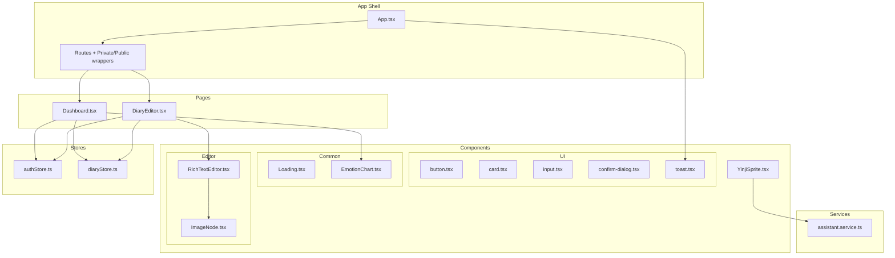
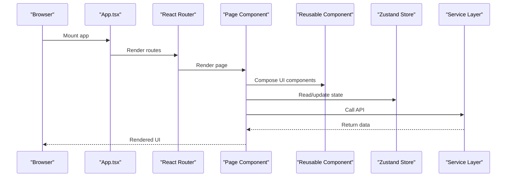
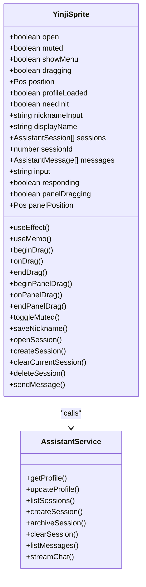
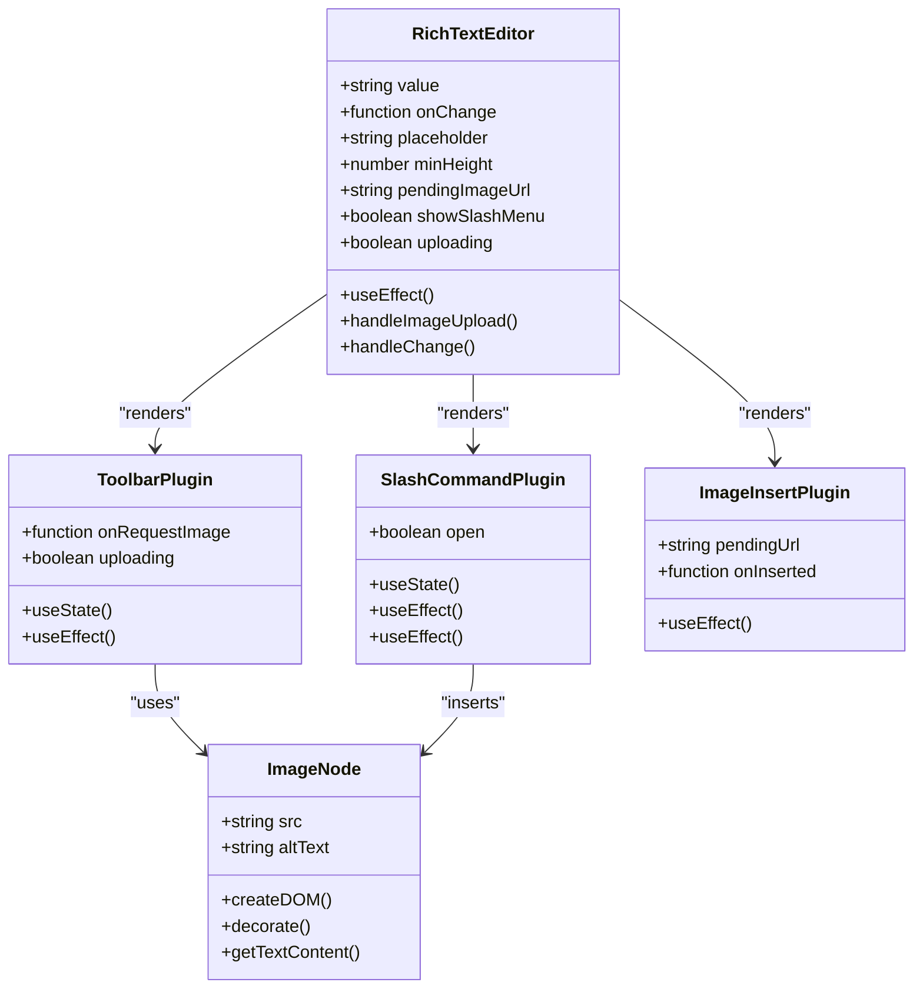
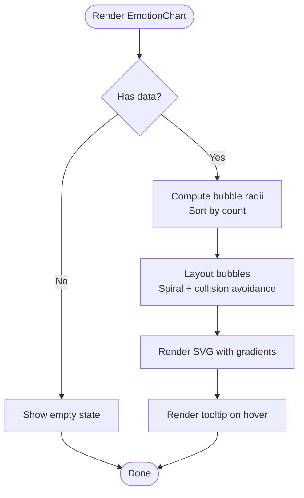
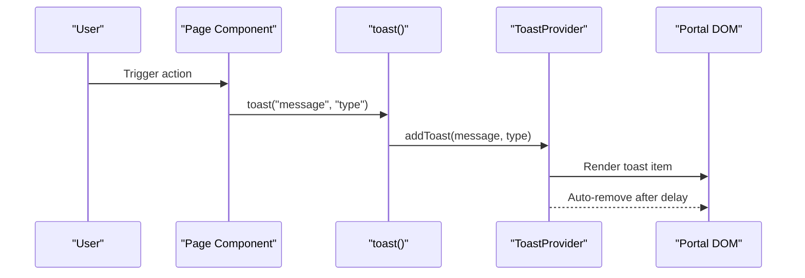
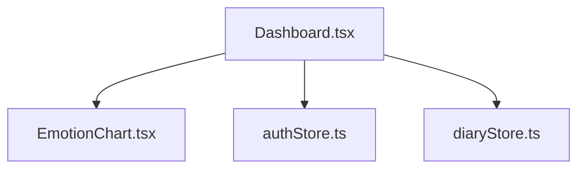
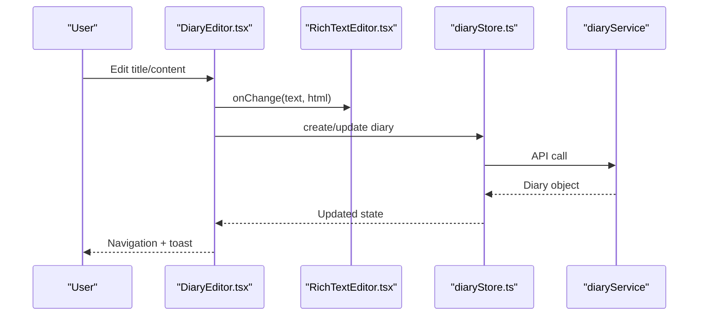
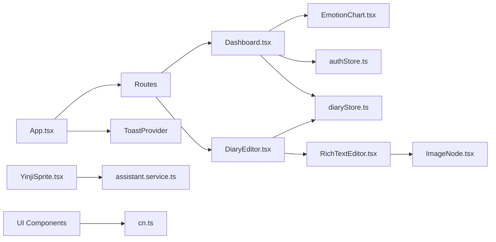

# Component System

<cite>
**Referenced Files in This Document**
- [App.tsx](file://frontend/src/App.tsx)
- [YinjiSprite.tsx](file://frontend/src/components/assistant/YinjiSprite.tsx)
- [RichTextEditor.tsx](file://frontend/src/components/editor/RichTextEditor.tsx)
- [ImageNode.tsx](file://frontend/src/components/editor/ImageNode.tsx)
- [EmotionChart.tsx](file://frontend/src/components/common/EmotionChart.tsx)
- [Loading.tsx](file://frontend/src/components/common/Loading.tsx)
- [button.tsx](file://frontend/src/components/ui/button.tsx)
- [card.tsx](file://frontend/src/components/ui/card.tsx)
- [input.tsx](file://frontend/src/components/ui/input.tsx)
- [confirm-dialog.tsx](file://frontend/src/components/ui/confirm-dialog.tsx)
- [toast.tsx](file://frontend/src/components/ui/toast.tsx)
- [DiaryEditor.tsx](file://frontend/src/pages/diaries/DiaryEditor.tsx)
- [Dashboard.tsx](file://frontend/src/pages/dashboard/Dashboard.tsx)
- [authStore.ts](file://frontend/src/store/authStore.ts)
- [diaryStore.ts](file://frontend/src/store/diaryStore.ts)
- [assistant.service.ts](file://frontend/src/services/assistant.service.ts)
- [cn.ts](file://frontend/src/utils/cn.ts)
</cite>

## Table of Contents
1. [Introduction](#introduction)
2. [Project Structure](#project-structure)
3. [Core Components](#core-components)
4. [Architecture Overview](#architecture-overview)
5. [Detailed Component Analysis](#detailed-component-analysis)
6. [Dependency Analysis](#dependency-analysis)
7. [Performance Considerations](#performance-considerations)
8. [Accessibility Compliance](#accessibility-compliance)
9. [Testing Strategies](#testing-strategies)
10. [Troubleshooting Guide](#troubleshooting-guide)
11. [Conclusion](#conclusion)

## Introduction
This document describes the component system of the Yiji (Yinji) React application. It focuses on the atomic design implementation across reusable components, page components, and layout systems. The system emphasizes:
- Assistant components (YinjiSprite): a draggable floating chat companion with session management and streaming responses
- Editor components (RichTextEditor): a Lexical-based editor supporting Markdown, images, and slash commands
- Common components (EmotionChart, Loading): specialized UI utilities for analytics and UX feedback
- UI components (buttons, cards, inputs, dialogs, toasts): foundational building blocks with consistent styling and behavior
- Page components (Dashboard, DiaryEditor): feature-rich pages composed from smaller components and stores

The documentation covers component props, state management, event handling, composition patterns, lifecycle methods, performance optimization, accessibility, and testing strategies.

## Project Structure
The frontend follows a feature-centric organization:
- Components are grouped by domain: assistant, common, editor, ui, and community
- Pages are organized under pages/<feature>
- Stores manage cross-cutting state (authentication, diaries)
- Services encapsulate API interactions
- Utilities provide shared helpers (class merging)

**Diagram sources**
- [App.tsx:61-242](file://frontend/src/App.tsx#L61-L242)
- [Dashboard.tsx:1-323](file://frontend/src/pages/dashboard/Dashboard.tsx#L1-L323)
- [DiaryEditor.tsx:1-368](file://frontend/src/pages/diaries/DiaryEditor.tsx#L1-L368)
- [YinjiSprite.tsx:20-545](file://frontend/src/components/assistant/YinjiSprite.tsx#L20-L545)
- [RichTextEditor.tsx:282-383](file://frontend/src/components/editor/RichTextEditor.tsx#L282-L383)
- [ImageNode.tsx:10-87](file://frontend/src/components/editor/ImageNode.tsx#L10-L87)
- [EmotionChart.tsx:158-269](file://frontend/src/components/common/EmotionChart.tsx#L158-L269)
- [Loading.tsx:9-55](file://frontend/src/components/common/Loading.tsx#L9-L55)
- [button.tsx:32-52](file://frontend/src/components/ui/button.tsx#L32-L52)
- [card.tsx:5-57](file://frontend/src/components/ui/card.tsx#L5-L57)
- [input.tsx:5-25](file://frontend/src/components/ui/input.tsx#L5-L25)
- [confirm-dialog.tsx:4-77](file://frontend/src/components/ui/confirm-dialog.tsx#L4-L77)
- [toast.tsx:17-61](file://frontend/src/components/ui/toast.tsx#L17-L61)
- [authStore.ts:23-146](file://frontend/src/store/authStore.ts#L23-L146)
- [diaryStore.ts:36-164](file://frontend/src/store/diaryStore.ts#L36-L164)
- [assistant.service.ts:35-128](file://frontend/src/services/assistant.service.ts#L35-L128)

**Section sources**
- [App.tsx:61-242](file://frontend/src/App.tsx#L61-L242)

## Core Components
This section outlines the primary component families and their responsibilities.

- Assistant: YinjiSprite
  - Purpose: Floating draggable chat companion with session management, mute controls, and streaming assistant responses
  - Key props: none (consumes stores/services internally)
  - State: local UI state (open, muted, dragging, positions), assistant sessions/messages, input text
  - Events: pointer drag for positioning, keyboard shortcuts, click interactions
  - Composition: integrates with assistant service for profile/session/message operations

- Editor: RichTextEditor
  - Purpose: Lexical-based editor with toolbar, slash commands, image insertion, and Markdown conversion
  - Props: value, onChange, placeholder, minHeight
  - State: pending image URL, slash menu visibility, upload status
  - Composition: composes plugins (toolbar, slash, history, markdown, image insert, initial value)

- Common: EmotionChart
  - Purpose: SVG bubble chart visualizing emotion statistics
  - Props: data (EmotionStats[]), type (bubble/donut)
  - State: hovered emotion tag
  - Composition: computes bubble layout and renders gradients

- Common: Loading
  - Purpose: Spinner with optional fullscreen mode
  - Props: size, className
  - Composition: provides FullScreenLoading wrapper

- UI: button, card, input, confirm-dialog, toast
  - Purpose: Atomic UI primitives with consistent variants and sizes
  - Props: variant, size, className, disabled, etc.
  - Composition: forwardRef-based, styled via class variance authority and Tailwind

**Section sources**
- [YinjiSprite.tsx:20-545](file://frontend/src/components/assistant/YinjiSprite.tsx#L20-L545)
- [RichTextEditor.tsx:253-383](file://frontend/src/components/editor/RichTextEditor.tsx#L253-L383)
- [EmotionChart.tsx:5-269](file://frontend/src/components/common/EmotionChart.tsx#L5-L269)
- [Loading.tsx:4-55](file://frontend/src/components/common/Loading.tsx#L4-L55)
- [button.tsx:32-52](file://frontend/src/components/ui/button.tsx#L32-L52)
- [card.tsx:5-57](file://frontend/src/components/ui/card.tsx#L5-L57)
- [input.tsx:5-25](file://frontend/src/components/ui/input.tsx#L5-L25)
- [confirm-dialog.tsx:4-77](file://frontend/src/components/ui/confirm-dialog.tsx#L4-L77)
- [toast.tsx:17-61](file://frontend/src/components/ui/toast.tsx#L17-L61)

## Architecture Overview
The application uses a layered architecture:
- App shell manages routing, authentication guards, and global providers
- Pages orchestrate domain logic and render feature-specific UI
- Components encapsulate UI concerns and compose services/stores
- Stores manage cross-page state (auth, diaries)
- Services abstract API interactions

**Diagram sources**
- [App.tsx:61-242](file://frontend/src/App.tsx#L61-L242)
- [Dashboard.tsx:1-323](file://frontend/src/pages/dashboard/Dashboard.tsx#L1-L323)
- [DiaryEditor.tsx:1-368](file://frontend/src/pages/diaries/DiaryEditor.tsx#L1-L368)
- [authStore.ts:23-146](file://frontend/src/store/authStore.ts#L23-L146)
- [diaryStore.ts:36-164](file://frontend/src/store/diaryStore.ts#L36-L164)
- [assistant.service.ts:35-128](file://frontend/src/services/assistant.service.ts#L35-L128)

## Detailed Component Analysis

### Assistant: YinjiSprite
YinjiSprite is a sophisticated floating assistant with:
- Draggable positioning persisted to localStorage
- Session-based chat with streaming responses
- Mute/unmute controls and initialization flow
- Panel drag for resizing and repositioning

**Diagram sources**
- [YinjiSprite.tsx:20-545](file://frontend/src/components/assistant/YinjiSprite.tsx#L20-L545)
- [assistant.service.ts:35-128](file://frontend/src/services/assistant.service.ts#L35-L128)

Key behaviors:
- Pointer drag: low-latency DOM writes during drag using requestAnimationFrame
- Streaming: SSE-like streaming via fetch reader with event parsing
- Persistence: position and mute preferences stored in localStorage
- Initialization: first-time nickname prompt before enabling chat

Usage and customization:
- Positioning: default position adjusted to viewport bounds
- Drag threshold: prevents accidental drags on click
- Panel drag: separate drag logic for the chat panel
- Accessibility: context menu toggles menu; screen reader labels present

**Section sources**
- [YinjiSprite.tsx:45-108](file://frontend/src/components/assistant/YinjiSprite.tsx#L45-L108)
- [YinjiSprite.tsx:124-183](file://frontend/src/components/assistant/YinjiSprite.tsx#L124-L183)
- [YinjiSprite.tsx:185-206](file://frontend/src/components/assistant/YinjiSprite.tsx#L185-L206)
- [YinjiSprite.tsx:208-279](file://frontend/src/components/assistant/YinjiSprite.tsx#L208-L279)
- [YinjiSprite.tsx:281-335](file://frontend/src/components/assistant/YinjiSprite.tsx#L281-L335)
- [assistant.service.ts:69-125](file://frontend/src/services/assistant.service.ts#L69-L125)

### Editor: RichTextEditor
RichTextEditor is a Lexical-based editor with:
- Toolbar with bold/italic and image insertion
- Slash command menu for quick actions
- Markdown shortcuts and transformations
- Image node support with lazy loading

**Diagram sources**
- [RichTextEditor.tsx:282-383](file://frontend/src/components/editor/RichTextEditor.tsx#L282-L383)
- [RichTextEditor.tsx:75-146](file://frontend/src/components/editor/RichTextEditor.tsx#L75-L146)
- [RichTextEditor.tsx:149-208](file://frontend/src/components/editor/RichTextEditor.tsx#L149-L208)
- [RichTextEditor.tsx:211-234](file://frontend/src/components/editor/RichTextEditor.tsx#L211-L234)
- [ImageNode.tsx:10-87](file://frontend/src/components/editor/ImageNode.tsx#L10-L87)

Composition patterns:
- Plugin architecture: each plugin encapsulates a single concern
- Controlled editor: parent manages value and onChange
- Transformer pipeline: Markdown and image transformers integrated

Customization options:
- Placeholder text and minimum height
- Theme customization via lexical theme object
- Upload handler for images

**Section sources**
- [RichTextEditor.tsx:293-298](file://frontend/src/components/editor/RichTextEditor.tsx#L293-L298)
- [RichTextEditor.tsx:300-313](file://frontend/src/components/editor/RichTextEditor.tsx#L300-L313)
- [RichTextEditor.tsx:315-326](file://frontend/src/components/editor/RichTextEditor.tsx#L315-L326)
- [ImageNode.tsx:36-87](file://frontend/src/components/editor/ImageNode.tsx#L36-L87)

### Common: EmotionChart
EmotionChart renders an interactive bubble chart of emotions:
- Color mapping from emotion tags to a warm palette
- Force-directed layout with collision avoidance
- Hover tooltip with counts and percentages

**Diagram sources**
- [EmotionChart.tsx:158-269](file://frontend/src/components/common/EmotionChart.tsx#L158-L269)
- [EmotionChart.tsx:96-154](file://frontend/src/components/common/EmotionChart.tsx#L96-L154)

**Section sources**
- [EmotionChart.tsx:10-82](file://frontend/src/components/common/EmotionChart.tsx#L10-L82)
- [EmotionChart.tsx:96-154](file://frontend/src/components/common/EmotionChart.tsx#L96-L154)
- [EmotionChart.tsx:158-269](file://frontend/src/components/common/EmotionChart.tsx#L158-L269)

### Common: Loading
Provides spinner indicators with three sizes and a fullscreen variant.

**Section sources**
- [Loading.tsx:4-55](file://frontend/src/components/common/Loading.tsx#L4-L55)

### UI: Button, Card, Input, ConfirmDialog, Toast
Atomic UI primitives with consistent variants and sizes. Toast uses a provider pattern to globally manage notifications.

**Diagram sources**
- [toast.tsx:17-61](file://frontend/src/components/ui/toast.tsx#L17-L61)

**Section sources**
- [button.tsx:32-52](file://frontend/src/components/ui/button.tsx#L32-L52)
- [card.tsx:5-57](file://frontend/src/components/ui/card.tsx#L5-L57)
- [input.tsx:5-25](file://frontend/src/components/ui/input.tsx#L5-L25)
- [confirm-dialog.tsx:4-77](file://frontend/src/components/ui/confirm-dialog.tsx#L4-L77)
- [toast.tsx:17-61](file://frontend/src/components/ui/toast.tsx#L17-L61)

### Page: Dashboard
Dashboard composes common and UI components to present:
- Greeting and navigation
- Statistics cards
- Quick actions
- Emotion chart
- Recent diary entries

**Diagram sources**
- [Dashboard.tsx:1-323](file://frontend/src/pages/dashboard/Dashboard.tsx#L1-L323)
- [EmotionChart.tsx:158-269](file://frontend/src/components/common/EmotionChart.tsx#L158-L269)
- [authStore.ts:23-146](file://frontend/src/store/authStore.ts#L23-L146)
- [diaryStore.ts:36-164](file://frontend/src/store/diaryStore.ts#L36-L164)

**Section sources**
- [Dashboard.tsx:1-323](file://frontend/src/pages/dashboard/Dashboard.tsx#L1-L323)

### Page: DiaryEditor
DiaryEditor integrates the RichTextEditor and supports:
- Title generation via AI
- Emotion tagging
- Importance scoring
- Form submission and navigation

**Diagram sources**
- [DiaryEditor.tsx:106-143](file://frontend/src/pages/diaries/DiaryEditor.tsx#L106-L143)
- [RichTextEditor.tsx:315-326](file://frontend/src/components/editor/RichTextEditor.tsx#L315-L326)
- [diaryStore.ts:89-123](file://frontend/src/store/diaryStore.ts#L89-L123)

**Section sources**
- [DiaryEditor.tsx:1-368](file://frontend/src/pages/diaries/DiaryEditor.tsx#L1-L368)
- [RichTextEditor.tsx:253-383](file://frontend/src/components/editor/RichTextEditor.tsx#L253-L383)
- [diaryStore.ts:36-164](file://frontend/src/store/diaryStore.ts#L36-L164)

## Dependency Analysis
Component dependencies and coupling:
- App.tsx depends on routing, private/public wrappers, and global providers
- Pages depend on stores and services for data fetching and mutations
- Reusable components depend on shared utilities (cn) and UI primitives
- Assistant component depends on assistant service for chat operations
- Editor component depends on ImageNode and lexical plugins

**Diagram sources**
- [App.tsx:61-242](file://frontend/src/App.tsx#L61-L242)
- [Dashboard.tsx:1-323](file://frontend/src/pages/dashboard/Dashboard.tsx#L1-L323)
- [DiaryEditor.tsx:1-368](file://frontend/src/pages/diaries/DiaryEditor.tsx#L1-L368)
- [YinjiSprite.tsx:20-545](file://frontend/src/components/assistant/YinjiSprite.tsx#L20-L545)
- [RichTextEditor.tsx:282-383](file://frontend/src/components/editor/RichTextEditor.tsx#L282-L383)
- [ImageNode.tsx:10-87](file://frontend/src/components/editor/ImageNode.tsx#L10-L87)
- [EmotionChart.tsx:158-269](file://frontend/src/components/common/EmotionChart.tsx#L158-L269)
- [authStore.ts:23-146](file://frontend/src/store/authStore.ts#L23-L146)
- [diaryStore.ts:36-164](file://frontend/src/store/diaryStore.ts#L36-L164)
- [assistant.service.ts:35-128](file://frontend/src/services/assistant.service.ts#L35-L128)
- [cn.ts:5-7](file://frontend/src/utils/cn.ts#L5-L7)

**Section sources**
- [App.tsx:61-242](file://frontend/src/App.tsx#L61-L242)
- [YinjiSprite.tsx:20-545](file://frontend/src/components/assistant/YinjiSprite.tsx#L20-L545)
- [RichTextEditor.tsx:282-383](file://frontend/src/components/editor/RichTextEditor.tsx#L282-L383)
- [EmotionChart.tsx:158-269](file://frontend/src/components/common/EmotionChart.tsx#L158-L269)
- [authStore.ts:23-146](file://frontend/src/store/authStore.ts#L23-L146)
- [diaryStore.ts:36-164](file://frontend/src/store/diaryStore.ts#L36-L164)
- [assistant.service.ts:35-128](file://frontend/src/services/assistant.service.ts#L35-L128)
- [cn.ts:5-7](file://frontend/src/utils/cn.ts#L5-L7)

## Performance Considerations
- Memoization and stable computations
  - EmotionChart uses useMemo for bubble layout computation
  - RichTextEditor uses useCallback for change handler
- Minimizing re-renders
  - Zustand stores isolate state slices; components subscribe to minimal state
  - Forward refs avoid unnecessary wrapper components
- Rendering optimizations
  - Low-latency drag uses requestAnimationFrame and direct DOM writes
  - SVG rendering optimized with precomputed gradients
- Streaming and async flows
  - Assistant streaming updates UI incrementally without blocking
  - Toast auto-dismiss after a fixed interval
- Bundle splitting
  - Pages are lazy-loaded via React.lazy/Suspense

[No sources needed since this section provides general guidance]

## Accessibility Compliance
- Semantic roles and labels
  - Loading component includes role="status" and aria-label
  - Toast items include appropriate semantic classes and aria attributes
- Keyboard navigation
  - RichTextEditor supports keyboard shortcuts and tab order
  - Confirm dialog handles Escape key to close
- Focus management
  - Dialogs and menus coordinate focus to prevent tab trapping
- Screen reader support
  - Hidden text for assistive technologies (e.g., sr-only)
  - Descriptive labels for interactive elements

**Section sources**
- [Loading.tsx:18-44](file://frontend/src/components/common/Loading.tsx#L18-L44)
- [toast.tsx:36-58](file://frontend/src/components/ui/toast.tsx#L36-L58)
- [RichTextEditor.tsx:187-205](file://frontend/src/components/editor/RichTextEditor.tsx#L187-L205)
- [confirm-dialog.tsx:28-74](file://frontend/src/components/ui/confirm-dialog.tsx#L28-L74)

## Testing Strategies
Recommended approaches:
- Unit tests for pure functions and utilities (e.g., cn, color mapping)
- Component tests with React Testing Library focusing on:
  - Event handlers (clicks, drags, key presses)
  - State transitions (open/muted, loading states)
  - Accessibility attributes and ARIA roles
- Store tests for state updates and async actions
- Service tests for API interactions and error handling
- Snapshot tests for static UI components (e.g., buttons, cards)
- Integration tests for page flows (e.g., editor form submission)

[No sources needed since this section provides general guidance]

## Troubleshooting Guide
Common issues and resolutions:
- Assistant not appearing
  - Ensure user is authenticated; component conditionally renders only when authenticated and profile loaded
  - Verify localStorage keys for position and mute preferences
- Chat streaming fails
  - Check network connectivity and API base URL configuration
  - Inspect error callbacks and toast messages for failure reasons
- Editor image upload fails
  - Confirm file type and size constraints
  - Verify upload progress and error toast messages
- Toast not showing
  - Ensure ToastProvider wraps the application root
  - Confirm global toast function is called from the correct context

**Section sources**
- [YinjiSprite.tsx:337-338](file://frontend/src/components/assistant/YinjiSprite.tsx#L337-L338)
- [assistant.service.ts:75-124](file://frontend/src/services/assistant.service.ts#L75-L124)
- [RichTextEditor.tsx:300-313](file://frontend/src/components/editor/RichTextEditor.tsx#L300-L313)
- [toast.tsx:17-31](file://frontend/src/components/ui/toast.tsx#L17-L31)

## Conclusion
The Yiji component system demonstrates a well-structured atomic design implementation:
- Assistant components provide immersive, persistent interactions
- Editor components offer powerful, extensible authoring capabilities
- Common components encapsulate domain-specific visuals and UX patterns
- UI primitives ensure consistency and accessibility
- Pages orchestrate state and services to deliver feature-rich experiences

Adhering to composition patterns, minimizing prop drilling via stores, and leveraging memoization and streaming enable a responsive and accessible user experience.