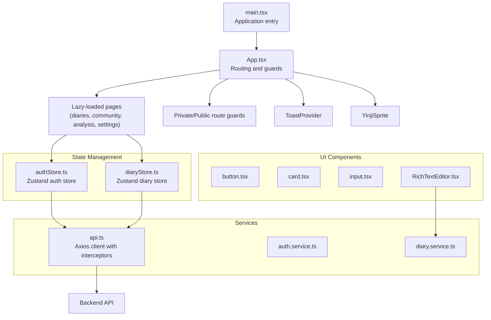
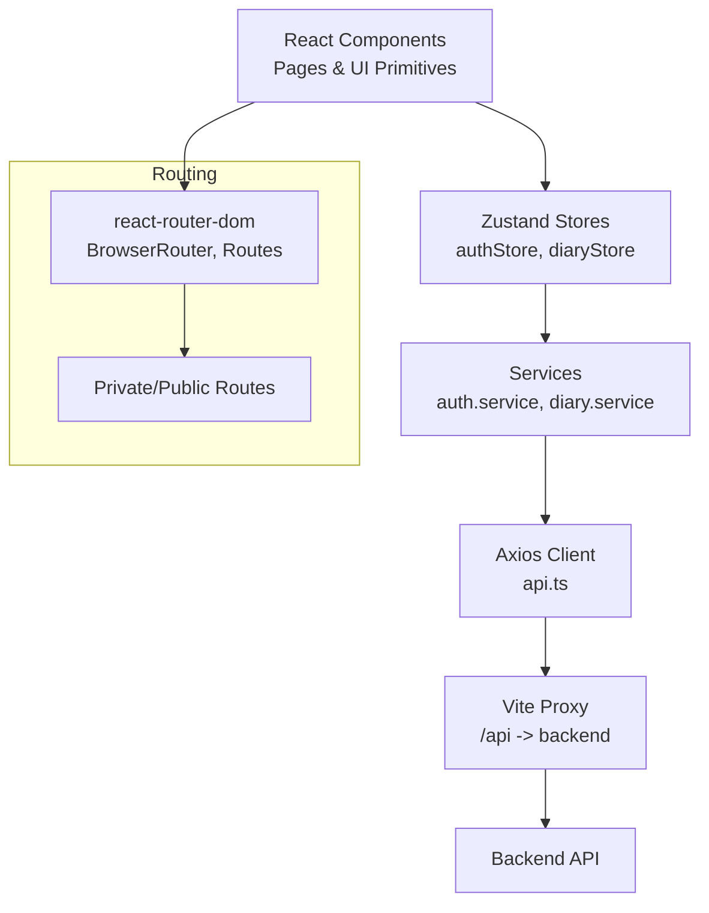
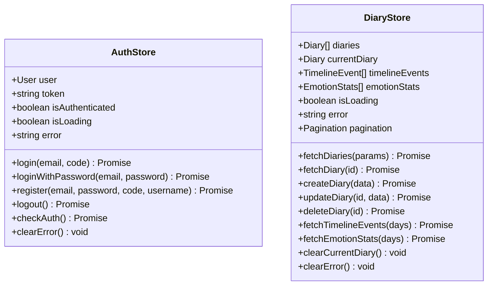
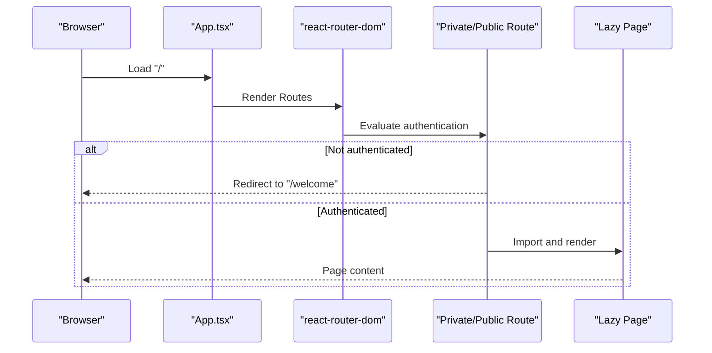
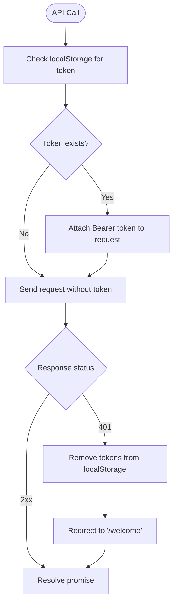
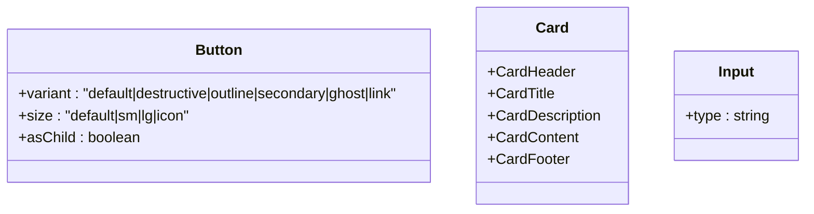
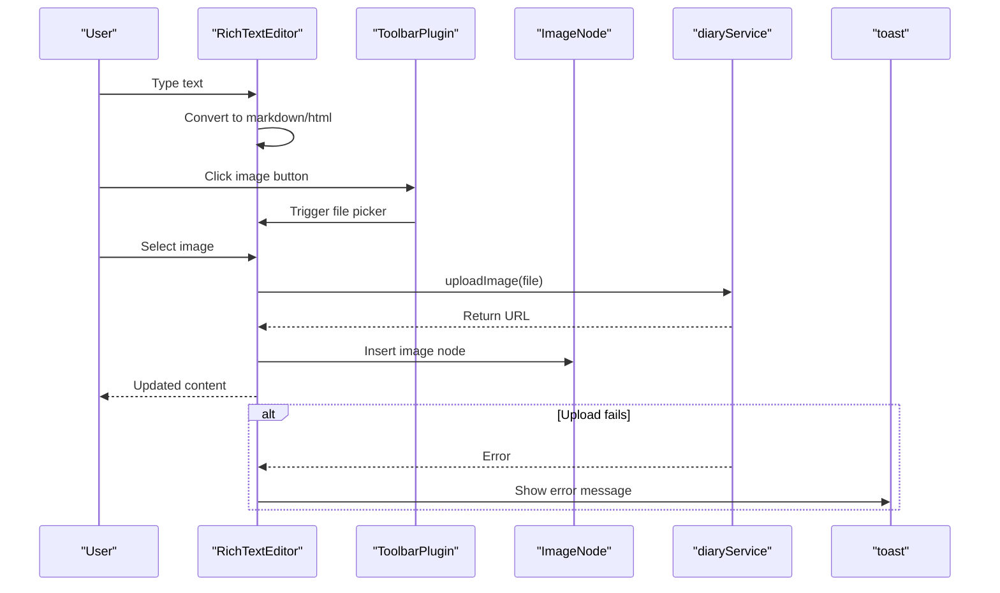
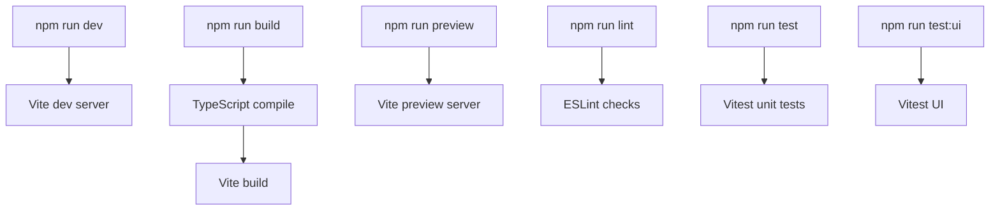
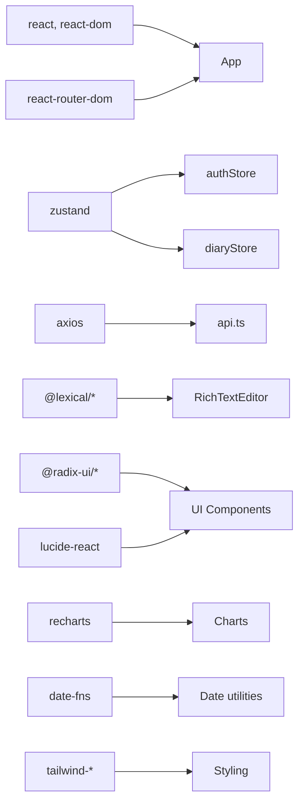

# Frontend System

<cite>
**Referenced Files in This Document**
- [main.tsx](file://frontend/src/main.tsx)
- [App.tsx](file://frontend/src/App.tsx)
- [package.json](file://frontend/package.json)
- [vite.config.ts](file://frontend/vite.config.ts)
- [tsconfig.json](file://frontend/tsconfig.json)
- [authStore.ts](file://frontend/src/store/authStore.ts)
- [diaryStore.ts](file://frontend/src/store/diaryStore.ts)
- [routes.ts](file://frontend/src/constants/routes.ts)
- [button.tsx](file://frontend/src/components/ui/button.tsx)
- [card.tsx](file://frontend/src/components/ui/card.tsx)
- [input.tsx](file://frontend/src/components/ui/input.tsx)
- [RichTextEditor.tsx](file://frontend/src/components/editor/RichTextEditor.tsx)
- [api.ts](file://frontend/src/services/api.ts)
- [index.ts](file://frontend/src/types/index.ts)
- [cn.ts](file://frontend/src/utils/cn.ts)
</cite>

## Table of Contents
1. [Introduction](#introduction)
2. [Project Structure](#project-structure)
3. [Core Components](#core-components)
4. [Architecture Overview](#architecture-overview)
5. [Detailed Component Analysis](#detailed-component-analysis)
6. [Dependency Analysis](#dependency-analysis)
7. [Performance Considerations](#performance-considerations)
8. [Troubleshooting Guide](#troubleshooting-guide)
9. [Conclusion](#conclusion)
10. [Appendices](#appendices)

## Introduction
This document describes the frontend system of the 映记 React application. It covers the component architecture following atomic design principles, state management with Zustand stores, routing and navigation patterns with lazy loading, the service layer for API communication, UI component library, build configuration, TypeScript integration, development workflow, responsive design, accessibility considerations, and performance optimization techniques.

## Project Structure
The frontend is organized around a clear separation of concerns:
- Entry point initializes the React application and mounts the root component.
- App defines routing with public/private guards and lazy-loaded page components.
- Store modules encapsulate state for authentication and diary management.
- Services provide typed API clients and interceptors for HTTP requests.
- UI components implement reusable building blocks following atomic design.
- Editor components provide a rich text editing experience.
- Types define shared interfaces across the application.
- Utilities consolidate cross-cutting concerns like class merging.
- Build configuration integrates Vite, TypeScript, Tailwind CSS, and development tooling.

**Diagram sources**
- [main.tsx:1-12](file://frontend/src/main.tsx#L1-L12)
- [App.tsx:1-242](file://frontend/src/App.tsx#L1-L242)
- [authStore.ts:1-146](file://frontend/src/store/authStore.ts#L1-L146)
- [diaryStore.ts:1-164](file://frontend/src/store/diaryStore.ts#L1-L164)
- [api.ts:1-43](file://frontend/src/services/api.ts#L1-L43)
- [button.tsx:1-52](file://frontend/src/components/ui/button.tsx#L1-L52)
- [card.tsx:1-57](file://frontend/src/components/ui/card.tsx#L1-L57)
- [input.tsx:1-25](file://frontend/src/components/ui/input.tsx#L1-L25)
- [RichTextEditor.tsx:1-383](file://frontend/src/components/editor/RichTextEditor.tsx#L1-L383)

**Section sources**
- [main.tsx:1-12](file://frontend/src/main.tsx#L1-L12)
- [App.tsx:1-242](file://frontend/src/App.tsx#L1-L242)
- [package.json:1-54](file://frontend/package.json#L1-L54)
- [vite.config.ts:1-27](file://frontend/vite.config.ts#L1-L27)
- [tsconfig.json:1-32](file://frontend/tsconfig.json#L1-L32)

## Core Components
- Application entry and root component initialize the app and render the router.
- Routing system defines public and private routes, with lazy loading and Suspense fallbacks.
- Authentication guard enforces protected access during loading and redirects unauthenticated users.
- UI primitives (Button, Card, Input) provide consistent styling and behavior via Tailwind and class variance authority.
- Rich Text Editor integrates Lexical for advanced editing with Markdown shortcuts, toolbar, slash commands, and image insertion.

Key implementation references:
- App routing and lazy loading: [App.tsx:12-29](file://frontend/src/App.tsx#L12-L29)
- Private/Public route guards: [App.tsx:32-59](file://frontend/src/App.tsx#L32-L59)
- UI Button variants and sizes: [button.tsx:6-30](file://frontend/src/components/ui/button.tsx#L6-L30)
- Card composition: [card.tsx:5-56](file://frontend/src/components/ui/card.tsx#L5-L56)
- Input field styling: [input.tsx:7-21](file://frontend/src/components/ui/input.tsx#L7-L21)
- Rich Text Editor integration: [RichTextEditor.tsx:282-382](file://frontend/src/components/editor/RichTextEditor.tsx#L282-L382)

**Section sources**
- [App.tsx:12-59](file://frontend/src/App.tsx#L12-L59)
- [button.tsx:1-52](file://frontend/src/components/ui/button.tsx#L1-L52)
- [card.tsx:1-57](file://frontend/src/components/ui/card.tsx#L1-L57)
- [input.tsx:1-25](file://frontend/src/components/ui/input.tsx#L1-L25)
- [RichTextEditor.tsx:1-383](file://frontend/src/components/editor/RichTextEditor.tsx#L1-L383)

## Architecture Overview
The system follows a layered architecture:
- Presentation Layer: React components, pages, and UI primitives.
- State Management: Zustand stores for auth and diary domains.
- Service Layer: Axios-based API client with request/response interceptors.
- Backend Integration: Proxy configured in Vite to target the backend server.

**Diagram sources**
- [App.tsx:61-239](file://frontend/src/App.tsx#L61-L239)
- [authStore.ts:23-145](file://frontend/src/store/authStore.ts#L23-L145)
- [diaryStore.ts:36-163](file://frontend/src/store/diaryStore.ts#L36-L163)
- [api.ts:6-42](file://frontend/src/services/api.ts#L6-L42)
- [vite.config.ts:15-24](file://frontend/vite.config.ts#L15-L24)

**Section sources**
- [App.tsx:61-239](file://frontend/src/App.tsx#L61-L239)
- [authStore.ts:1-146](file://frontend/src/store/authStore.ts#L1-L146)
- [diaryStore.ts:1-164](file://frontend/src/store/diaryStore.ts#L1-L164)
- [api.ts:1-43](file://frontend/src/services/api.ts#L1-L43)
- [vite.config.ts:1-27](file://frontend/vite.config.ts#L1-L27)

## Detailed Component Analysis

### State Management with Zustand
The application uses two primary Zustand stores:
- Authentication Store: Manages user session, tokens, loading states, and errors; persists selected fields to local storage.
- Diary Store: Manages lists, current item, timeline events, emotion statistics, pagination, and CRUD actions.

**Diagram sources**
- [authStore.ts:7-21](file://frontend/src/store/authStore.ts#L7-L21)
- [diaryStore.ts:6-34](file://frontend/src/store/diaryStore.ts#L6-L34)

Implementation highlights:
- Authentication actions integrate with the auth service and update persisted state.
- Diary actions coordinate with the diary service and maintain optimistic updates where appropriate.
- Error handling centralizes messages from API responses.

**Section sources**
- [authStore.ts:23-145](file://frontend/src/store/authStore.ts#L23-L145)
- [diaryStore.ts:36-163](file://frontend/src/store/diaryStore.ts#L36-L163)

### Routing, Navigation, and Lazy Loading
The routing system:
- Uses react-router-dom with BrowserRouter and declarative Routes.
- Implements PrivateRoute and PublicRoute wrappers to enforce authentication.
- Lazily loads page components with React.lazy and Suspense fallbacks.
- Provides programmatic navigation and redirects for 404 scenarios.

**Diagram sources**
- [App.tsx:32-59](file://frontend/src/App.tsx#L32-L59)
- [App.tsx:78-232](file://frontend/src/App.tsx#L78-L232)

Additional routing utilities:
- Centralized route constants for type-safe navigation and route matching.

**Section sources**
- [App.tsx:12-29](file://frontend/src/App.tsx#L12-L29)
- [App.tsx:32-59](file://frontend/src/App.tsx#L32-L59)
- [App.tsx:78-232](file://frontend/src/App.tsx#L78-L232)
- [routes.ts:1-32](file://frontend/src/constants/routes.ts#L1-L32)

### Service Layer and API Communication
The service layer builds on Axios:
- Configures base URL from environment variables.
- Adds Authorization header automatically using stored tokens.
- Handles 401 responses by clearing local storage and redirecting to welcome.

**Diagram sources**
- [api.ts:14-40](file://frontend/src/services/api.ts#L14-L40)

**Section sources**
- [api.ts:1-43](file://frontend/src/services/api.ts#L1-L43)

### UI Component Library
Reusable components adhere to atomic design:
- Button: Variants (default, destructive, outline, secondary, ghost, link) and sizes (default, sm, lg, icon) with consistent focus and disabled states.
- Card: Header, Title, Description, Content, Footer composition for structured layouts.
- Input: Consistent styling and focus-visible ring behavior.

**Diagram sources**
- [button.tsx:32-36](file://frontend/src/components/ui/button.tsx#L32-L36)
- [card.tsx:5-56](file://frontend/src/components/ui/card.tsx#L5-L56)
- [input.tsx:5-5](file://frontend/src/components/ui/input.tsx#L5-L5)

**Section sources**
- [button.tsx:1-52](file://frontend/src/components/ui/button.tsx#L1-L52)
- [card.tsx:1-57](file://frontend/src/components/ui/card.tsx#L1-L57)
- [input.tsx:1-25](file://frontend/src/components/ui/input.tsx#L1-L25)

### Rich Text Editor
The editor integrates Lexical with:
- Toolbar with formatting buttons and image insertion.
- Markdown shortcut support and slash command menu.
- Image upload flow integrated with the diary service and toast notifications.
- Theme customization and placeholder text.

**Diagram sources**
- [RichTextEditor.tsx:300-313](file://frontend/src/components/editor/RichTextEditor.tsx#L300-L313)
- [RichTextEditor.tsx:328-382](file://frontend/src/components/editor/RichTextEditor.tsx#L328-L382)

**Section sources**
- [RichTextEditor.tsx:1-383](file://frontend/src/components/editor/RichTextEditor.tsx#L1-L383)

### Build Configuration, TypeScript, and Development Workflow
- Vite configuration enables React plugin, path aliases, and proxy for API and uploads.
- TypeScript compiler options enable bundler mode, JSX transform, strictness, and path aliases.
- Package scripts define dev, build, preview, lint, test, and test:ui workflows.
- Tailwind CSS and PostCSS are integrated for styling.

**Diagram sources**
- [vite.config.ts:1-27](file://frontend/vite.config.ts#L1-L27)
- [tsconfig.json:1-32](file://frontend/tsconfig.json#L1-L32)
- [package.json:6-13](file://frontend/package.json#L6-L13)

**Section sources**
- [vite.config.ts:1-27](file://frontend/vite.config.ts#L1-L27)
- [tsconfig.json:1-32](file://frontend/tsconfig.json#L1-L32)
- [package.json:1-54](file://frontend/package.json#L1-L54)

## Dependency Analysis
External libraries and their roles:
- React and React DOM: Core rendering.
- react-router-dom: Declarative routing and navigation.
- zustand: Lightweight state management.
- @tanstack/react-query: Data fetching and caching (configured but not used in provided files).
- axios: HTTP client with interceptors.
- date-fns: Date utilities.
- clsx and tailwind-merge: Class merging and Tailwind utilities.
- recharts: Charting components.
- lexical and @lexical/react: Rich text editing.
- radix-ui packages: Accessible UI primitives.
- lucide-react: Icons.

**Diagram sources**
- [package.json:14-36](file://frontend/package.json#L14-L36)
- [authStore.ts:1-6](file://frontend/src/store/authStore.ts#L1-L6)
- [diaryStore.ts:1-5](file://frontend/src/store/diaryStore.ts#L1-L5)
- [api.ts:1-5](file://frontend/src/services/api.ts#L1-L5)
- [RichTextEditor.tsx:3-27](file://frontend/src/components/editor/RichTextEditor.tsx#L3-L27)

**Section sources**
- [package.json:1-54](file://frontend/package.json#L1-L54)

## Performance Considerations
- Lazy loading pages reduces initial bundle size; keep critical routes eager and defer heavy pages.
- Zustand stores avoid unnecessary re-renders; keep state granular and avoid storing large objects when not needed.
- Axios interceptors prevent redundant network calls; ensure proper error handling to avoid retry storms.
- Tailwind CSS purging and tree-shaking minimize CSS footprint; leverage utility classes sparingly.
- Image uploads in the editor should be optimized; consider compression and progressive loading.
- Prefer memoization for expensive computations and avoid deep object mutations in state.

## Troubleshooting Guide
Common issues and resolutions:
- Authentication loops or unauthorized redirects:
  - Verify token presence and validity; check interceptor behavior for 401 responses.
  - Confirm local storage keys and expiration handling.
- API timeouts or CORS errors:
  - Validate proxy configuration and backend reachability.
  - Ensure environment variables are set for base URLs.
- Rich text editor not updating content:
  - Confirm onChange handlers receive markdown and HTML outputs.
  - Check image upload flow and toast feedback on failures.
- UI component styles not applying:
  - Verify Tailwind configuration and class merging utilities.
  - Ensure component props align with variant and size definitions.

**Section sources**
- [api.ts:14-40](file://frontend/src/services/api.ts#L14-L40)
- [vite.config.ts:15-24](file://frontend/vite.config.ts#L15-L24)
- [RichTextEditor.tsx:300-313](file://frontend/src/components/editor/RichTextEditor.tsx#L300-L313)
- [button.tsx:6-30](file://frontend/src/components/ui/button.tsx#L6-L30)
- [cn.ts:1-8](file://frontend/src/utils/cn.ts#L1-L8)

## Conclusion
The 映记 frontend employs a clean, modular architecture with clear separation between presentation, state, and services. Atomic UI components, lazy-loaded routes, and Zustand stores deliver a responsive and maintainable user experience. The Axios-based service layer, robust interceptors, and thoughtful build configuration support scalability and developer productivity.

## Appendices
- Accessibility: Use semantic HTML, focus-visible rings, and ARIA attributes where needed. Ensure keyboard navigation for dialogs, selects, and tabs.
- Responsive Design: Leverage Tailwind’s responsive utilities and ensure components adapt to mobile breakpoints.
- TypeScript Best Practices: Keep types centralized, use discriminated unions for state transitions, and enforce strict mode settings.