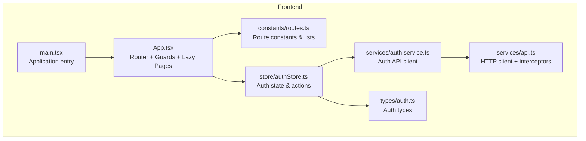
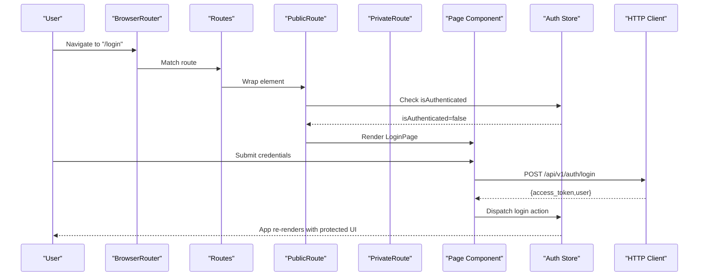
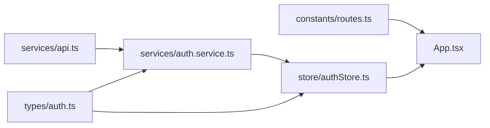

# Routing and Navigation

<cite>
**Referenced Files in This Document**
- [routes.ts](file://frontend/src/constants/routes.ts)
- [App.tsx](file://frontend/src/App.tsx)
- [authStore.ts](file://frontend/src/store/authStore.ts)
- [auth.service.ts](file://frontend/src/services/auth.service.ts)
- [api.ts](file://frontend/src/services/api.ts)
- [main.tsx](file://frontend/src/main.tsx)
- [auth.ts](file://frontend/src/types/auth.ts)
</cite>

## Table of Contents
1. [Introduction](#introduction)
2. [Project Structure](#project-structure)
3. [Core Components](#core-components)
4. [Architecture Overview](#architecture-overview)
5. [Detailed Component Analysis](#detailed-component-analysis)
6. [Dependency Analysis](#dependency-analysis)
7. [Performance Considerations](#performance-considerations)
8. [Troubleshooting Guide](#troubleshooting-guide)
9. [Conclusion](#conclusion)

## Introduction
This document explains the routing and navigation system of the Yìjì (映记) React application. It covers route configuration, private/public guards, lazy loading, route protection, dynamic and nested routes, redirects, and integration with authentication. It also documents parameter handling, query string management, performance optimization strategies, and error boundary integration.

## Project Structure
The routing system is centered around:
- Route constants and lists for public/private routes
- Application-wide router configuration with guards
- Authentication store and service for protected access
- Lazy-loaded page components for performance
- Global HTTP client with interceptors for auth and error handling

**Diagram sources**
- [main.tsx:1-12](file://frontend/src/main.tsx#L1-L12)
- [App.tsx:1-242](file://frontend/src/App.tsx#L1-L242)
- [routes.ts:1-32](file://frontend/src/constants/routes.ts#L1-L32)
- [authStore.ts:1-146](file://frontend/src/store/authStore.ts#L1-L146)
- [auth.service.ts:1-100](file://frontend/src/services/auth.service.ts#L1-L100)
- [api.ts:1-43](file://frontend/src/services/api.ts#L1-L43)
- [auth.ts:1-45](file://frontend/src/types/auth.ts#L1-L45)

**Section sources**
- [main.tsx:1-12](file://frontend/src/main.tsx#L1-L12)
- [App.tsx:1-242](file://frontend/src/App.tsx#L1-L242)
- [routes.ts:1-32](file://frontend/src/constants/routes.ts#L1-L32)
- [authStore.ts:1-146](file://frontend/src/store/authStore.ts#L1-L146)
- [auth.service.ts:1-100](file://frontend/src/services/auth.service.ts#L1-L100)
- [api.ts:1-43](file://frontend/src/services/api.ts#L1-L43)
- [auth.ts:1-45](file://frontend/src/types/auth.ts#L1-L45)

## Core Components
- Route constants and lists define canonical paths and categorize routes as public or private.
- App router config declares routes, lazy loads page components, and applies guard wrappers.
- Guard components enforce authentication state and redirect accordingly.
- Auth store manages user session, token persistence, and initial auth check.
- Auth service encapsulates API calls for login, registration, logout, and profile retrieval.
- HTTP client centralizes base URL, timeouts, and request/response interceptors for auth and error handling.

Key responsibilities:
- Route constants: maintain a single source of truth for route definitions and categories.
- App router: assemble routes, apply guards, handle redirects, and render lazy components.
- Guards: protect private routes and prevent authenticated users from accessing public routes.
- Auth store: initialize auth state, persist tokens, and expose auth-aware UI logic.
- Auth service: integrate with backend APIs for authentication flows.
- HTTP client: attach tokens, handle 401 errors globally, and standardize requests.

**Section sources**
- [routes.ts:1-32](file://frontend/src/constants/routes.ts#L1-L32)
- [App.tsx:32-59](file://frontend/src/App.tsx#L32-L59)
- [authStore.ts:23-145](file://frontend/src/store/authStore.ts#L23-L145)
- [auth.service.ts:11-99](file://frontend/src/services/auth.service.ts#L11-L99)
- [api.ts:6-40](file://frontend/src/services/api.ts#L6-L40)

## Architecture Overview
The routing architecture combines React Router with custom guard components and a centralized auth store. The system supports:
- Public routes (unauthenticated users only)
- Private routes (authenticated users only)
- Dynamic routes with parameters
- Redirects for legacy or invalid paths
- Lazy loading for page components
- Centralized auth via HTTP interceptors

**Diagram sources**
- [App.tsx:80-111](file://frontend/src/App.tsx#L80-L111)
- [App.tsx:32-59](file://frontend/src/App.tsx#L32-L59)
- [authStore.ts:32-50](file://frontend/src/store/authStore.ts#L32-L50)
- [auth.service.ts:18-28](file://frontend/src/services/auth.service.ts#L18-L28)
- [api.ts:14-26](file://frontend/src/services/api.ts#L14-L26)

## Detailed Component Analysis

### Route Configuration and Constants
- Route constants define canonical paths and parameterized helpers for dynamic segments.
- Lists separate public and private routes for quick reference and potential future use (e.g., prefetching or analytics).
- The route list includes home, diaries, analysis, growth/timeline, dashboard, and settings.

Best practices observed:
- Parameterized helpers ensure consistent dynamic route construction across the app.
- Dedicated lists enable centralized maintenance of route categories.

**Section sources**
- [routes.ts:1-32](file://frontend/src/constants/routes.ts#L1-L32)

### Router Setup and Route Protection
- The router wraps page components with guard wrappers:
  - PublicRoute prevents authenticated users from accessing login/register/forgot-password.
  - PrivateRoute enforces authentication and redirects unauthenticated users to the welcome landing.
- Legal policy pages are declared without guards and are publicly accessible.
- Redirects:
  - "/timeline" redirects to "/growth".
  - "/analysis/:id" redirects to "/analysis".
  - Wildcard "*" redirects to "/welcome".

Lazy loading:
- Page components are imported lazily to reduce initial bundle size and improve perceived performance.

Suspense fallback:
- A global Suspense wrapper provides a loading spinner while lazy chunks are being fetched.

**Section sources**
- [App.tsx:78-233](file://frontend/src/App.tsx#L78-L233)
- [App.tsx:12-30](file://frontend/src/App.tsx#L12-L30)
- [App.tsx:71-77](file://frontend/src/App.tsx#L71-L77)

### Guard Components
- PublicRoute:
  - Checks authentication state.
  - If authenticated, redirects to "/".
  - Otherwise renders the child component.
- PrivateRoute:
  - Handles loading state during initial auth check.
  - If not authenticated, redirects to "/welcome".
  - Otherwise renders the child component.

Guard behavior ensures:
- Unauthenticated users cannot access private areas.
- Authenticated users cannot access login/register pages.
- Initial loading state is handled gracefully.

**Section sources**
- [App.tsx:32-59](file://frontend/src/App.tsx#L32-L59)

### Authentication Integration
- Auth store:
  - Provides actions for login, register, logout, and checking auth status.
  - Persists user, token, and authentication state.
  - Performs initial auth check on app load.
- Auth service:
  - Encapsulates backend API calls for authentication and profile management.
- HTTP client:
  - Adds Authorization header when a token exists.
  - Handles 401 responses by clearing local storage and redirecting to "/welcome".

This integration ensures:
- Seamless authentication flows.
- Automatic token injection for protected endpoints.
- Centralized error handling for auth failures.

**Section sources**
- [authStore.ts:23-145](file://frontend/src/store/authStore.ts#L23-L145)
- [auth.service.ts:11-99](file://frontend/src/services/auth.service.ts#L11-L99)
- [api.ts:14-40](file://frontend/src/services/api.ts#L14-L40)

### Dynamic Routes and Parameter Handling
- Dynamic segments:
  - Diaries: "/diaries/:id", "/diaries/:id/edit"
  - Community posts: "/community/post/:id"
- Parameter handling:
  - Route constants provide typed helpers for building URLs.
  - Page components consume parameters via React Router hooks (not shown here but typical usage).

Recommendations:
- Use route constants for URL construction to avoid typos.
- Validate parameters in page components and handle missing/invalid IDs gracefully.

**Section sources**
- [App.tsx:135-158](file://frontend/src/App.tsx#L135-L158)
- [App.tsx:206-213](file://frontend/src/App.tsx#L206-L213)
- [routes.ts:10-12](file://frontend/src/constants/routes.ts#L10-L12)
- [routes.ts:12](file://frontend/src/constants/routes.ts#L12)
- [routes.ts:14](file://frontend/src/constants/routes.ts#L14)

### Redirect Patterns
- "/timeline" → "/growth"
- "/analysis/:id" → "/analysis"
- "*" → "/welcome"

These redirects:
- Normalize URLs and prevent broken links.
- Improve SEO and UX by consolidating similar routes.

**Section sources**
- [App.tsx:167](file://frontend/src/App.tsx#L167)
- [App.tsx:177-179](file://frontend/src/App.tsx#L177-L179)
- [App.tsx:232](file://frontend/src/App.tsx#L232)

### Navigation Components and Breadcrumb Implementation
- No dedicated navigation components or breadcrumb implementation were found in the analyzed files.
- Active link highlighting is not implemented in the router configuration.
- Navigation utilities are not present in the analyzed files.

Recommendations:
- Create reusable navigation components (e.g., NavItem, Breadcrumb) to support active state and breadcrumbs.
- Integrate with React Router's useLocation/useNavigate for programmatic navigation and active link detection.

[No sources needed since this section does not analyze specific files]

### Query String Management
- No explicit query string parsing or management was identified in the analyzed files.
- Typical approaches include using URLSearchParams or a library like react-query for URL state synchronization.

Recommendations:
- Centralize query string handling in a hook or utility to keep pages clean.
- Persist query state in URL for shareable links and deep linking.

[No sources needed since this section does not analyze specific files]

### Route Preloading Strategies
- No explicit preloading or prefetching logic was found in the analyzed files.
- Current lazy loading occurs on first render of lazy components.

Recommendations:
- Implement preloading for frequently visited private routes after successful login.
- Use React Router’s future flags and preload hints if upgrading to newer versions.

[No sources needed since this section does not analyze specific files]

### Error Boundary Integration
- No error boundaries were found in the analyzed files.
- Global error handling is performed by the HTTP interceptor for 401 responses.

Recommendations:
- Add error boundaries around lazy-loaded components to gracefully handle loading errors.
- Surface user-friendly messages and provide retry actions.

[No sources needed since this section does not analyze specific files]

## Dependency Analysis
The routing system exhibits clear separation of concerns:
- App.tsx depends on route constants, auth store, and lazy-loaded page components.
- Auth store depends on auth service and persists state.
- Auth service depends on the HTTP client.
- HTTP client depends on environment configuration and handles interceptors.

**Diagram sources**
- [routes.ts:1-32](file://frontend/src/constants/routes.ts#L1-L32)
- [App.tsx:1-242](file://frontend/src/App.tsx#L1-L242)
- [authStore.ts:1-146](file://frontend/src/store/authStore.ts#L1-L146)
- [auth.service.ts:1-100](file://frontend/src/services/auth.service.ts#L1-L100)
- [api.ts:1-43](file://frontend/src/services/api.ts#L1-L43)
- [auth.ts:1-45](file://frontend/src/types/auth.ts#L1-L45)

**Section sources**
- [App.tsx:1-242](file://frontend/src/App.tsx#L1-L242)
- [authStore.ts:1-146](file://frontend/src/store/authStore.ts#L1-L146)
- [auth.service.ts:1-100](file://frontend/src/services/auth.service.ts#L1-L100)
- [api.ts:1-43](file://frontend/src/services/api.ts#L1-L43)
- [auth.ts:1-45](file://frontend/src/types/auth.ts#L1-L45)

## Performance Considerations
- Lazy loading is implemented for page components, reducing initial bundle size.
- Suspense fallback provides a smooth loading experience during chunk fetches.
- Consider:
  - Preloading critical private routes after authentication.
  - Code-splitting shared components to further optimize bundles.
  - Using React Router’s future flags for improved performance if upgrading.

[No sources needed since this section provides general guidance]

## Troubleshooting Guide
Common issues and resolutions:
- Unauthorized access attempts:
  - Symptom: Redirect to "/welcome" after 401.
  - Cause: HTTP interceptor clears tokens and redirects on 401.
  - Resolution: Ensure token is present in localStorage; re-authenticate if needed.
- Stuck loading on private routes:
  - Symptom: Spinner remains indefinitely.
  - Cause: Auth check still in progress.
  - Resolution: Wait for initial auth check to complete; verify network connectivity.
- Incorrect redirects:
  - Symptom: Visiting "/timeline" or "/analysis/:id" navigates unexpectedly.
  - Cause: Defined redirects normalize URLs.
  - Resolution: Use canonical paths "/growth" and "/analysis".

**Section sources**
- [api.ts:28-40](file://frontend/src/services/api.ts#L28-L40)
- [App.tsx:35-47](file://frontend/src/App.tsx#L35-L47)
- [App.tsx:167](file://frontend/src/App.tsx#L167)
- [App.tsx:177-179](file://frontend/src/App.tsx#L177-L179)

## Conclusion
The Yìjì routing system leverages React Router with custom guard components, lazy-loaded page components, and a centralized auth store. It provides clear separation between public and private routes, handles dynamic parameters, and normalizes URLs via redirects. Enhancements such as navigation components, breadcrumbs, query string utilities, preloading strategies, and error boundaries would further improve UX and maintainability.