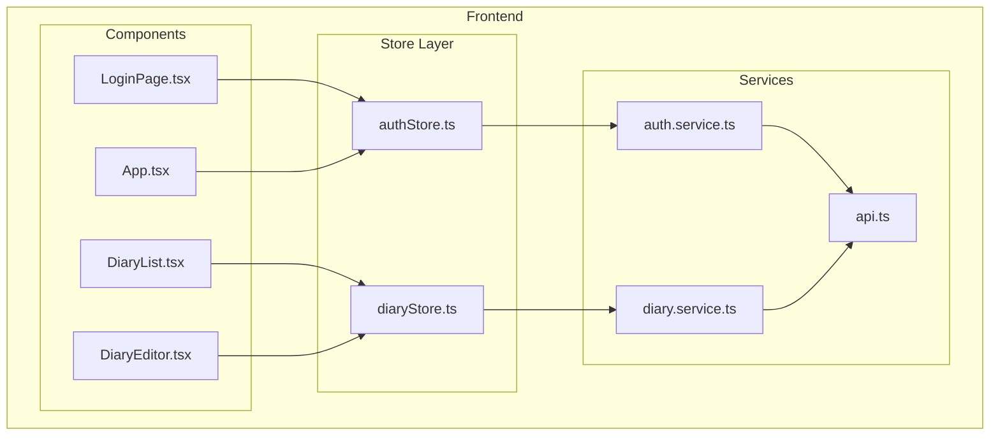
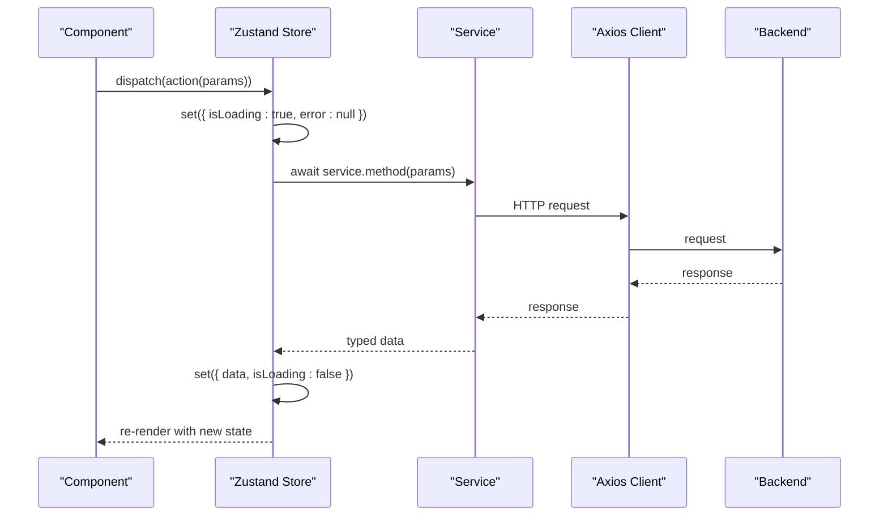
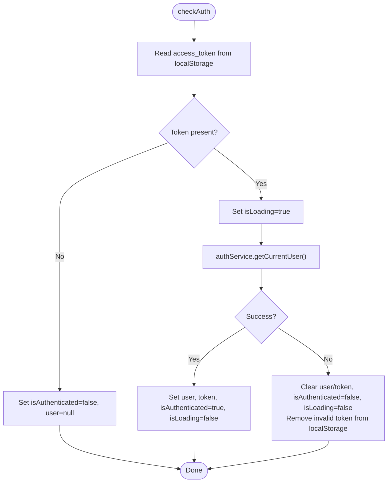
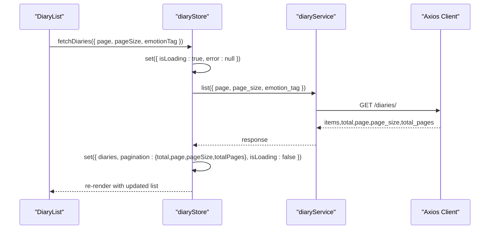
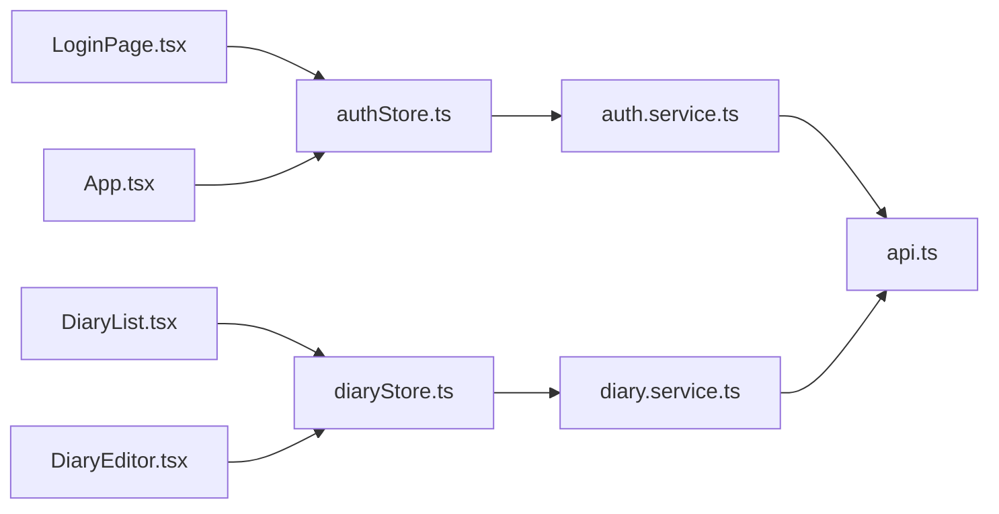

# State Management

<cite>
**Referenced Files in This Document**
- [authStore.ts](file://frontend/src/store/authStore.ts)
- [diaryStore.ts](file://frontend/src/store/diaryStore.ts)
- [auth.ts](file://frontend/src/types/auth.ts)
- [diary.ts](file://frontend/src/types/diary.ts)
- [auth.service.ts](file://frontend/src/services/auth.service.ts)
- [diary.service.ts](file://frontend/src/services/diary.service.ts)
- [api.ts](file://frontend/src/services/api.ts)
- [App.tsx](file://frontend/src/App.tsx)
- [LoginPage.tsx](file://frontend/src/pages/auth/LoginPage.tsx)
- [DiaryList.tsx](file://frontend/src/pages/diaries/DiaryList.tsx)
- [DiaryEditor.tsx](file://frontend/src/pages/diaries/DiaryEditor.tsx)
- [package.json](file://frontend/package.json)
- [vite-env.d.ts](file://frontend/src/vite-env.d.ts)
</cite>

## Table of Contents
1. [Introduction](#introduction)
2. [Project Structure](#project-structure)
3. [Core Components](#core-components)
4. [Architecture Overview](#architecture-overview)
5. [Detailed Component Analysis](#detailed-component-analysis)
6. [Dependency Analysis](#dependency-analysis)
7. [Performance Considerations](#performance-considerations)
8. [Troubleshooting Guide](#troubleshooting-guide)
9. [Conclusion](#conclusion)
10. [Appendices](#appendices)

## Introduction
This document explains the global state architecture of the 映记 React application built with Zustand. It focuses on two stores:
- authStore: manages authentication state, including user profile, tokens, loading, and errors.
- diaryStore: manages diary-related state, including lists, current entries, timeline events, emotion statistics, pagination, and errors.

It covers initialization, actions, selectors, middleware usage, state update patterns, subscriptions, persistence strategies, async handling, error management, integration with React components, debugging aids, performance optimizations, and migration considerations.

## Project Structure
The state layer is organized under frontend/src/store with dedicated files per domain. Services encapsulate API interactions, and components consume the stores via hooks. The API client centralizes HTTP configuration and interceptors.

**Diagram sources**
- [authStore.ts:1-146](file://frontend/src/store/authStore.ts#L1-L146)
- [diaryStore.ts:1-164](file://frontend/src/store/diaryStore.ts#L1-L164)
- [auth.service.ts:1-100](file://frontend/src/services/auth.service.ts#L1-L100)
- [diary.service.ts:1-112](file://frontend/src/services/diary.service.ts#L1-L112)
- [api.ts:1-43](file://frontend/src/services/api.ts#L1-L43)
- [App.tsx:1-242](file://frontend/src/App.tsx#L1-L242)
- [LoginPage.tsx:1-263](file://frontend/src/pages/auth/LoginPage.tsx#L1-L263)
- [DiaryList.tsx:1-211](file://frontend/src/pages/diaries/DiaryList.tsx#L1-L211)
- [DiaryEditor.tsx:1-368](file://frontend/src/pages/diaries/DiaryEditor.tsx#L1-L368)

**Section sources**
- [authStore.ts:1-146](file://frontend/src/store/authStore.ts#L1-L146)
- [diaryStore.ts:1-164](file://frontend/src/store/diaryStore.ts#L1-L164)
- [auth.service.ts:1-100](file://frontend/src/services/auth.service.ts#L1-L100)
- [diary.service.ts:1-112](file://frontend/src/services/diary.service.ts#L1-L112)
- [api.ts:1-43](file://frontend/src/services/api.ts#L1-L43)
- [App.tsx:1-242](file://frontend/src/App.tsx#L1-L242)

## Core Components
- authStore
  - Purpose: Authentication lifecycle, token management, and session persistence.
  - Key fields: user, token, isAuthenticated, isLoading, error.
  - Actions: login, loginWithPassword, register, logout, checkAuth, clearError.
  - Persistence: Uses Zustand’s persist middleware to persist user, token, and isAuthenticated.
  - Integration: Components subscribe via useAuthStore; App initializes session on mount.

- diaryStore
  - Purpose: Diary CRUD, timeline retrieval, emotion statistics, pagination, and current entry management.
  - Key fields: diaries, currentDiary, timelineEvents, emotionStats, isLoading, error, pagination.
  - Actions: fetchDiaries, fetchDiary, createDiary, updateDiary, deleteDiary, fetchTimelineEvents, fetchEmotionStats, clearCurrentDiary, clearError.
  - Integration: Components subscribe via useDiaryStore; pages orchestrate data fetching and updates.

**Section sources**
- [authStore.ts:7-21](file://frontend/src/store/authStore.ts#L7-L21)
- [authStore.ts:23-145](file://frontend/src/store/authStore.ts#L23-L145)
- [diaryStore.ts:6-34](file://frontend/src/store/diaryStore.ts#L6-L34)
- [diaryStore.ts:36-163](file://frontend/src/store/diaryStore.ts#L36-L163)

## Architecture Overview
Zustand stores are thin, focused slices of state with synchronous state updates and asynchronous actions. Services encapsulate network calls and return typed data. Components subscribe to stores and render based on state changes. The API client injects Authorization headers and handles 401 globally.

**Diagram sources**
- [authStore.ts:32-50](file://frontend/src/store/authStore.ts#L32-L50)
- [authStore.ts:107-132](file://frontend/src/store/authStore.ts#L107-L132)
- [diaryStore.ts:50-74](file://frontend/src/store/diaryStore.ts#L50-L74)
- [diaryStore.ts:76-87](file://frontend/src/store/diaryStore.ts#L76-L87)
- [auth.service.ts:18-28](file://frontend/src/services/auth.service.ts#L18-L28)
- [diary.service.ts:14-48](file://frontend/src/services/diary.service.ts#L14-L48)
- [api.ts:14-26](file://frontend/src/services/api.ts#L14-L26)

## Detailed Component Analysis

### authStore
- Initialization and middleware
  - Initializes user, token, isAuthenticated, isLoading, error to safe defaults.
  - Uses persist middleware to save user, token, and isAuthenticated to local storage.
  - Partializes state to avoid persisting transient fields.

- Actions
  - login: sets loading, calls authService.login, updates user/token/isAuthenticated, persists token.
  - loginWithPassword: similar flow with password-based login.
  - register: verifies registration code, then registers; clears loading on success.
  - logout: calls authService.logout, resets auth state, removes token.
  - checkAuth: reads token from localStorage, validates via getCurrentUser, updates state; clears invalid token on failure.
  - clearError: resets error field.

- Subscriptions and selectors
  - Components can destructure isLoading, error, isAuthenticated, and action functions from useAuthStore.
  - App uses checkAuth on mount to hydrate session.

- Error handling
  - Actions set error with server-provided detail or fallback messages.
  - API interceptor clears token and redirects on 401.

**Diagram sources**
- [authStore.ts:107-132](file://frontend/src/store/authStore.ts#L107-L132)

**Section sources**
- [authStore.ts:23-145](file://frontend/src/store/authStore.ts#L23-L145)
- [api.ts:28-40](file://frontend/src/services/api.ts#L28-L40)
- [App.tsx:61-66](file://frontend/src/App.tsx#L61-L66)

### diaryStore
- Initialization and pagination
  - Initializes arrays/lists, current entry, timeline events, emotion stats, and pagination metadata.

- Actions
  - fetchDiaries: paginated list retrieval; updates items and pagination.
  - fetchDiary: single entry retrieval; updates currentDiary.
  - createDiary: posts new entry; prepends to list; returns created entity.
  - updateDiary: patches existing entry; updates list and current entry if applicable.
  - deleteDiary: removes entry; clears current entry if matched.
  - fetchTimelineEvents: recent events by days.
  - fetchEmotionStats: emotion distribution by days.
  - clearCurrentDiary, clearError: helpers to reset state.

- Subscriptions and selectors
  - Components subscribe to diaries, currentDiary, isLoading, error, pagination.
  - DiaryList uses fetchDiaries with emotion filter and pagination.page progression.
  - DiaryEditor uses createDiary/updateDiary and toggles emotion tags and importance score.

**Diagram sources**
- [diaryStore.ts:50-74](file://frontend/src/store/diaryStore.ts#L50-L74)
- [diary.service.ts:21-31](file://frontend/src/services/diary.service.ts#L21-L31)
- [api.ts:1-43](file://frontend/src/services/api.ts#L1-L43)

**Section sources**
- [diaryStore.ts:36-163](file://frontend/src/store/diaryStore.ts#L36-L163)
- [DiaryList.tsx:23-52](file://frontend/src/pages/diaries/DiaryList.tsx#L23-L52)
- [DiaryEditor.tsx:40-143](file://frontend/src/pages/diaries/DiaryEditor.tsx#L40-L143)

### Integration with React Components
- App routing and guards
  - App initializes auth hydration via checkAuth on mount.
  - PrivateRoute and PublicRoute enforce authentication gating using isAuthenticated and isLoading.

- LoginPage
  - Subscribes to login, loginWithPassword, isLoading, error, clearError.
  - Integrates authService for code sending and form submission.

- DiaryList and DiaryEditor
  - Subscribe to diaryStore actions and state.
  - Orchestrate CRUD flows and handle loading/error states.

**Section sources**
- [App.tsx:32-59](file://frontend/src/App.tsx#L32-L59)
- [App.tsx:61-66](file://frontend/src/App.tsx#L61-L66)
- [LoginPage.tsx:11-58](file://frontend/src/pages/auth/LoginPage.tsx#L11-L58)
- [DiaryList.tsx:23-52](file://frontend/src/pages/diaries/DiaryList.tsx#L23-L52)
- [DiaryEditor.tsx:40-143](file://frontend/src/pages/diaries/DiaryEditor.tsx#L40-L143)

## Dependency Analysis
- Internal dependencies
  - authStore depends on authService; authService depends on api.
  - diaryStore depends on diaryService; diaryService depends on api.
  - Components depend on stores and services.

- External dependencies
  - Zustand for state management.
  - Axios for HTTP requests.
  - React Router for navigation and guards.

**Diagram sources**
- [authStore.ts:1-146](file://frontend/src/store/authStore.ts#L1-L146)
- [diaryStore.ts:1-164](file://frontend/src/store/diaryStore.ts#L1-L164)
- [auth.service.ts:1-100](file://frontend/src/services/auth.service.ts#L1-L100)
- [diary.service.ts:1-112](file://frontend/src/services/diary.service.ts#L1-L112)
- [api.ts:1-43](file://frontend/src/services/api.ts#L1-L43)
- [LoginPage.tsx:1-263](file://frontend/src/pages/auth/LoginPage.tsx#L1-L263)
- [DiaryList.tsx:1-211](file://frontend/src/pages/diaries/DiaryList.tsx#L1-L211)
- [DiaryEditor.tsx:1-368](file://frontend/src/pages/diaries/DiaryEditor.tsx#L1-L368)
- [App.tsx:1-242](file://frontend/src/App.tsx#L1-L242)

**Section sources**
- [package.json:14-36](file://frontend/package.json#L14-L36)

## Performance Considerations
- Minimize re-renders
  - Keep state granular; avoid storing derived data.
  - Use shallow equality for primitive fields; memoize callbacks in components.

- Pagination and lists
  - Use pagination.page progression to avoid loading all records at once.
  - Update lists efficiently (prepend for new items, map for updates, filter for deletes).

- Loading states
  - Set isLoading per-action to provide responsive feedback.
  - Debounce or coalesce rapid UI triggers where appropriate.

- Network timeouts and retries
  - Configure axios timeout appropriately; consider retry policies at service level if needed.

- Dev tools
  - Use React DevTools to inspect component renders and state updates.
  - Consider Zustand Devtools for debugging store updates (add as needed).

[No sources needed since this section provides general guidance]

## Troubleshooting Guide
- Authentication issues
  - Symptoms: Stuck on loading, redirected to welcome after login.
  - Causes: Missing/invalid token, 401 responses.
  - Checks: Verify localStorage access_token presence; inspect API interceptor behavior.

- API failures
  - Symptoms: Error banners, failed mutations.
  - Checks: Inspect error fields in stores; review service method calls and response handling.

- Component not updating
  - Causes: Not subscribing to the correct store slice or not handling isLoading states.
  - Checks: Ensure destructuring of state/action from the store hook; verify useEffect dependencies.

- Environment configuration
  - Ensure VITE_API_BASE_URL is set for production builds.

**Section sources**
- [api.ts:28-40](file://frontend/src/services/api.ts#L28-L40)
- [authStore.ts:42-49](file://frontend/src/store/authStore.ts#L42-L49)
- [diaryStore.ts:68-73](file://frontend/src/store/diaryStore.ts#L68-L73)
- [vite-env.d.ts:3-6](file://frontend/src/vite-env.d.ts#L3-L6)

## Conclusion
The 映记 application employs a clean, modular Zustand-based state architecture:
- authStore centralizes authentication with persistence and robust error handling.
- diaryStore encapsulates diary domain logic with pagination and async actions.
- Services isolate HTTP concerns and provide typed contracts.
- Components remain thin consumers of stores, enabling predictable updates and maintainable flows.

This design supports scalability, testability, and future enhancements, including potential migrations to other state libraries with minimal component-level disruption.

[No sources needed since this section summarizes without analyzing specific files]

## Appendices

### Types and Contracts
- Authentication types define user profiles, login/register payloads, and verification requests.
- Diary types define entities, lists, timeline events, emotion stats, and growth insights.

**Section sources**
- [auth.ts:3-44](file://frontend/src/types/auth.ts#L3-L44)
- [diary.ts:6-127](file://frontend/src/types/diary.ts#L6-L127)

### Example Usage Patterns
- Login flow
  - Subscribe to login/loginWithPassword, isLoading, error.
  - Clear error before submitting; navigate on success; surface error messages.

- Diary list pagination
  - On mount, fetchDiaries with emotion filter.
  - On “Load more”, increment page and fetch again.

- Create/update diary
  - Collect form data; call createDiary or updateDiary; handle returned entity; navigate to detail.

**Section sources**
- [LoginPage.tsx:11-58](file://frontend/src/pages/auth/LoginPage.tsx#L11-L58)
- [DiaryList.tsx:23-52](file://frontend/src/pages/diaries/DiaryList.tsx#L23-L52)
- [DiaryEditor.tsx:110-143](file://frontend/src/pages/diaries/DiaryEditor.tsx#L110-L143)

### Migration Strategies
- Plan incremental adoption
  - Introduce a new store alongside existing ones; gradually move slices.
  - Keep service interfaces stable to minimize component changes.

- Preserve contracts
  - Maintain consistent action signatures and return types across stores.
  - Centralize shared logic in services to ease cross-store coordination.

- Testing
  - Add unit tests for store actions and service calls.
  - Mock API responses to validate error and loading flows.

[No sources needed since this section provides general guidance]