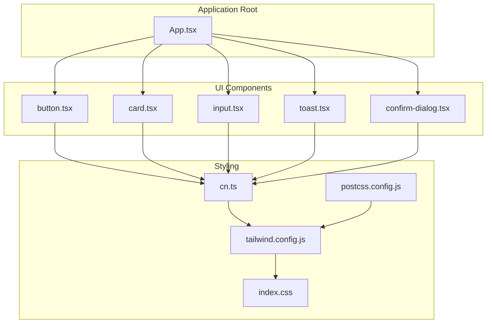
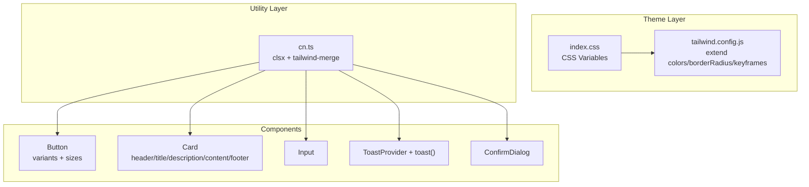
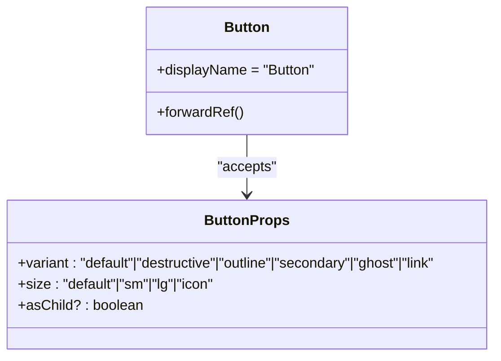
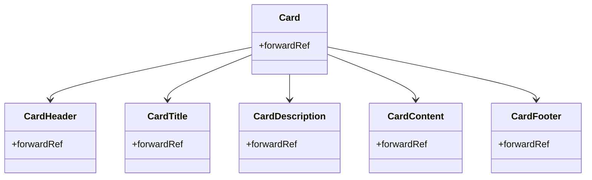
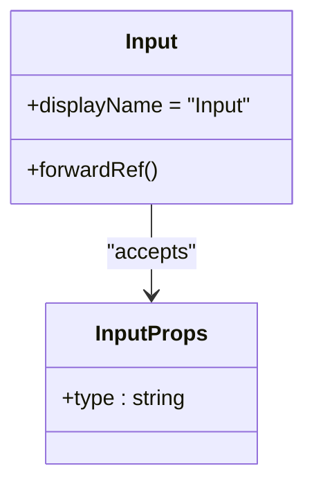
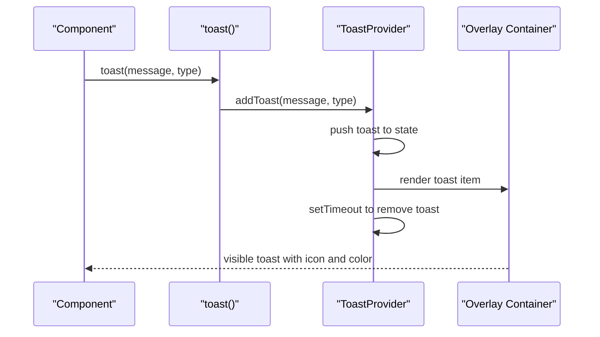
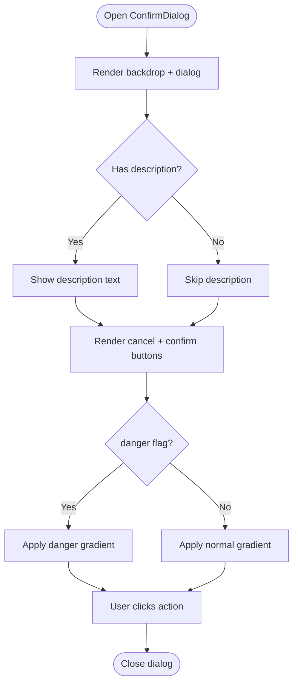
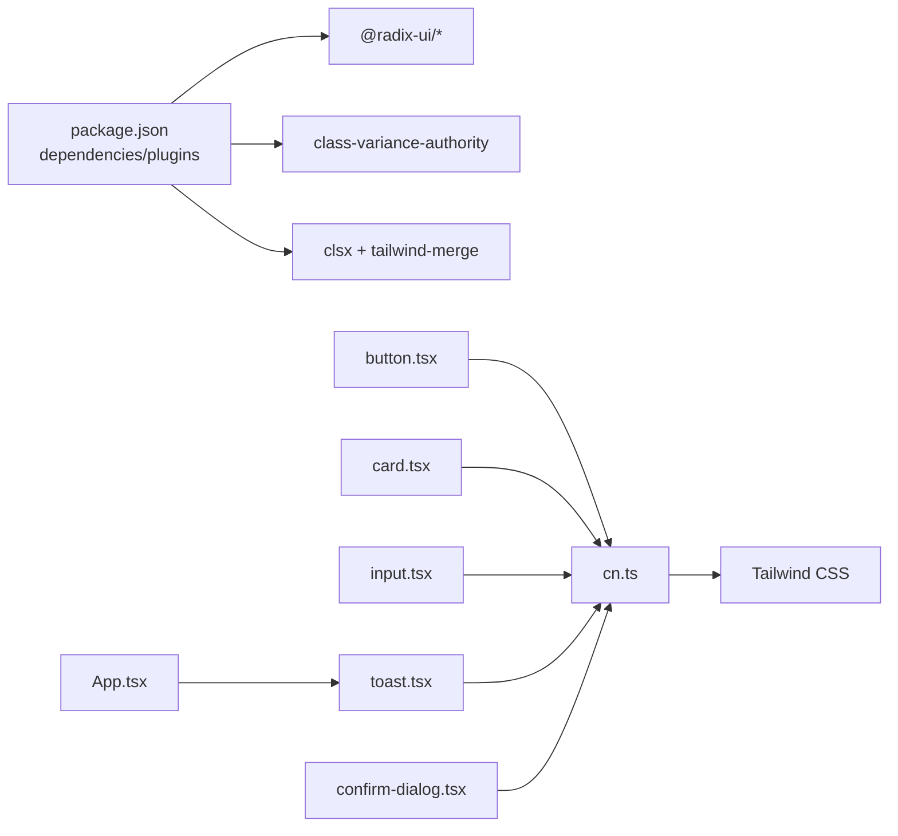
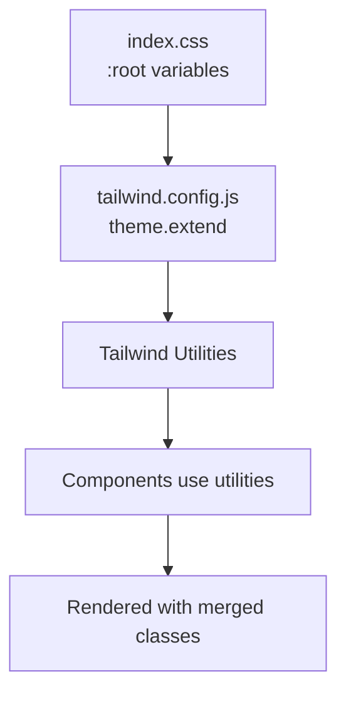

# UI Component Library

<cite>
**Referenced Files in This Document**
- [button.tsx](file://frontend/src/components/ui/button.tsx)
- [card.tsx](file://frontend/src/components/ui/card.tsx)
- [input.tsx](file://frontend/src/components/ui/input.tsx)
- [toast.tsx](file://frontend/src/components/ui/toast.tsx)
- [confirm-dialog.tsx](file://frontend/src/components/ui/confirm-dialog.tsx)
- [cn.ts](file://frontend/src/utils/cn.ts)
- [App.tsx](file://frontend/src/App.tsx)
- [tailwind.config.js](file://frontend/tailwind.config.js)
- [index.css](file://frontend/src/index.css)
- [postcss.config.js](file://frontend/postcss.config.js)
- [package.json](file://frontend/package.json)
</cite>

## Table of Contents
1. [Introduction](#introduction)
2. [Project Structure](#project-structure)
3. [Core Components](#core-components)
4. [Architecture Overview](#architecture-overview)
5. [Detailed Component Analysis](#detailed-component-analysis)
6. [Dependency Analysis](#dependency-analysis)
7. [Performance Considerations](#performance-considerations)
8. [Accessibility and UX Features](#accessibility-and-ux-features)
9. [Styling Architecture and Design System](#styling-architecture-and-design-system)
10. [Usage Examples and Customization Guidelines](#usage-examples-and-customization-guidelines)
11. [Troubleshooting Guide](#troubleshooting-guide)
12. [Conclusion](#conclusion)

## Introduction
This document describes the UI component library used in the 映记 React application. It focuses on the custom components built with Radix UI primitives and styled with Tailwind CSS, including buttons, form controls, cards, toast notifications, and confirmation dialogs. It explains the styling architecture, design system principles, accessibility features, responsive patterns, TypeScript integration, and contribution standards for extending the library.

## Project Structure
The UI components live under the frontend/src/components/ui directory and are consumed by the application via the root App component. Styling is centralized in Tailwind CSS with a design system built around CSS variables and layered styles.

**Diagram sources**
- [App.tsx:61-242](file://frontend/src/App.tsx#L61-L242)
- [button.tsx:1-52](file://frontend/src/components/ui/button.tsx#L1-L52)
- [card.tsx:1-57](file://frontend/src/components/ui/card.tsx#L1-L57)
- [input.tsx:1-25](file://frontend/src/components/ui/input.tsx#L1-L25)
- [toast.tsx:1-61](file://frontend/src/components/ui/toast.tsx#L1-L61)
- [confirm-dialog.tsx:1-77](file://frontend/src/components/ui/confirm-dialog.tsx#L1-L77)
- [cn.ts:1-8](file://frontend/src/utils/cn.ts#L1-L8)
- [tailwind.config.js:1-86](file://frontend/tailwind.config.js#L1-L86)
- [index.css:1-153](file://frontend/src/index.css#L1-L153)
- [postcss.config.js:1-7](file://frontend/postcss.config.js#L1-L7)

**Section sources**
- [App.tsx:61-242](file://frontend/src/App.tsx#L61-L242)
- [package.json:14-36](file://frontend/package.json#L14-L36)

## Core Components
This section documents the primary UI components and their roles in the application.

- Button: A variant-rich button built with class variance authority and Radix UI focus-visible semantics.
- Card: A semantic grouping component with header, title, description, content, and footer slots.
- Input: A styled text input with focus-visible ring and disabled states.
- Toast: A provider-driven notification system with transient messages and animated entries.
- ConfirmDialog: A modal-style confirmation dialog with optional danger styling.

**Section sources**
- [button.tsx:1-52](file://frontend/src/components/ui/button.tsx#L1-L52)
- [card.tsx:1-57](file://frontend/src/components/ui/card.tsx#L1-L57)
- [input.tsx:1-25](file://frontend/src/components/ui/input.tsx#L1-L25)
- [toast.tsx:1-61](file://frontend/src/components/ui/toast.tsx#L1-L61)
- [confirm-dialog.tsx:1-77](file://frontend/src/components/ui/confirm-dialog.tsx#L1-L77)

## Architecture Overview
The UI library integrates Tailwind CSS for atomic styling, class-variance-authority for variant composition, and Radix UI primitives for accessible interactions. The toast system is provider-based and mounted globally, while other components are composable and theme-aware through CSS variables.

**Diagram sources**
- [index.css:1-153](file://frontend/src/index.css#L1-L153)
- [tailwind.config.js:19-82](file://frontend/tailwind.config.js#L19-L82)
- [cn.ts:1-8](file://frontend/src/utils/cn.ts#L1-L8)
- [button.tsx:6-30](file://frontend/src/components/ui/button.tsx#L6-L30)
- [card.tsx:5-56](file://frontend/src/components/ui/card.tsx#L5-L56)
- [input.tsx:7-21](file://frontend/src/components/ui/input.tsx#L7-L21)
- [toast.tsx:17-60](file://frontend/src/components/ui/toast.tsx#L17-L60)
- [confirm-dialog.tsx:15-75](file://frontend/src/components/ui/confirm-dialog.tsx#L15-L75)

## Detailed Component Analysis

### Button Component
- Purpose: Provides a unified button with variant and size variants, focus-visible ring, and disabled states.
- Variants: default, destructive, outline, secondary, ghost, link.
- Sizes: default, sm, lg, icon.
- Composition: Uses class-variance-authority for variant logic and cn for safe class merging.
- Accessibility: Inherits native button semantics and focus-visible ring from Tailwind.

**Diagram sources**
- [button.tsx:32-48](file://frontend/src/components/ui/button.tsx#L32-L48)

**Section sources**
- [button.tsx:6-30](file://frontend/src/components/ui/button.tsx#L6-L30)
- [button.tsx:32-48](file://frontend/src/components/ui/button.tsx#L32-L48)

### Card Component Family
- Purpose: Semantic card container with dedicated subcomponents for header, title, description, content, and footer.
- Composition: Each subcomponent is a forwardRef wrapper that merges Tailwind classes with incoming className.
- Usage pattern: Compose CardHeader/CardTitle/CardDescription/CardContent/CardFooter inside Card.

**Diagram sources**
- [card.tsx:5-56](file://frontend/src/components/ui/card.tsx#L5-L56)

**Section sources**
- [card.tsx:1-57](file://frontend/src/components/ui/card.tsx#L1-L57)

### Input Component
- Purpose: Styled text input with focus-visible ring, disabled states, and placeholder styling.
- Extensibility: Accepts all native input attributes and merges with default classes.

**Diagram sources**
- [input.tsx:5-21](file://frontend/src/components/ui/input.tsx#L5-L21)

**Section sources**
- [input.tsx:1-25](file://frontend/src/components/ui/input.tsx#L1-L25)

### Toast Notification System
- Provider: ToastProvider manages a queue of toasts and mounts them in a fixed overlay.
- API: toast(message, type) dispatches a new toast; types include success, error, info.
- Behavior: Auto-dismiss after a timeout; animated entrance and backdrop blur styling.
- Mounting: Rendered as a fixed column in the top-right corner.

**Diagram sources**
- [toast.tsx:13-31](file://frontend/src/components/ui/toast.tsx#L13-L31)
- [toast.tsx:33-60](file://frontend/src/components/ui/toast.tsx#L33-L60)

**Section sources**
- [toast.tsx:1-61](file://frontend/src/components/ui/toast.tsx#L1-L61)
- [App.tsx:5-6](file://frontend/src/App.tsx#L5-L6)

### Confirm Dialog
- Purpose: Modal confirmation dialog with title, description, and action buttons.
- States: Danger vs. normal actions via a boolean flag; supports custom labels.
- Accessibility: Backdrop click closes; uses aria-label on close button.
- Styling: Fixed positioning, backdrop blur, and gradient backgrounds for actions.

**Diagram sources**
- [confirm-dialog.tsx:15-75](file://frontend/src/components/ui/confirm-dialog.tsx#L15-L75)

**Section sources**
- [confirm-dialog.tsx:1-77](file://frontend/src/components/ui/confirm-dialog.tsx#L1-L77)

## Dependency Analysis
The UI components depend on shared utilities and Tailwind configuration. The toast system depends on the provider being mounted at the application root.

**Diagram sources**
- [package.json:14-36](file://frontend/package.json#L14-L36)
- [cn.ts:1-8](file://frontend/src/utils/cn.ts#L1-L8)
- [button.tsx:3-4](file://frontend/src/components/ui/button.tsx#L3-L4)
- [card.tsx:3](file://frontend/src/components/ui/card.tsx#L3)
- [input.tsx:3](file://frontend/src/components/ui/input.tsx#L3)
- [toast.tsx:3](file://frontend/src/components/ui/toast.tsx#L3)
- [confirm-dialog.tsx:1](file://frontend/src/components/ui/confirm-dialog.tsx#L1)
- [App.tsx:5-6](file://frontend/src/App.tsx#L5-L6)

**Section sources**
- [package.json:14-36](file://frontend/package.json#L14-L36)

## Performance Considerations
- Class merging: Using clsx and tailwind-merge prevents redundant classes and reduces bundle size.
- Minimal re-renders: Components are lightweight wrappers; avoid unnecessary prop churn.
- Toast lifecycle: Automatic cleanup prevents memory leaks; keep message count reasonable.
- CSS variables: Centralized theme values reduce repaints and enable smooth dark mode transitions.

[No sources needed since this section provides general guidance]

## Accessibility and UX Features
- Focus management: Buttons and inputs apply focus-visible rings for keyboard navigation.
- Screen reader support: Confirm dialog includes aria-label on the backdrop close button.
- Keyboard navigation: Components rely on native semantics; ensure parent containers manage focus order.
- Motion preferences: Provide reduced-motion alternatives where animations are used.

**Section sources**
- [button.tsx:7](file://frontend/src/components/ui/button.tsx#L7)
- [input.tsx:12-18](file://frontend/src/components/ui/input.tsx#L12-L18)
- [confirm-dialog.tsx:31](file://frontend/src/components/ui/confirm-dialog.tsx#L31)

## Styling Architecture and Design System
- Theme tokens: CSS variables define semantic colors and radii; Tailwind reads these via hsl().
- Layered styles: Base layer sets global defaults; utilities compose atomic classes.
- Color system: Includes primary, secondary, destructive, muted, accent, card, and emotion palette.
- Animations: Custom keyframes for fade-in, slide-in, float, and spin; applied via utility classes.
- Responsive: Tailwind container and screens configuration; components remain responsive by default.

**Diagram sources**
- [index.css:5-41](file://frontend/src/index.css#L5-L41)
- [tailwind.config.js:19-67](file://frontend/tailwind.config.js#L19-L67)
- [button.tsx:7](file://frontend/src/components/ui/button.tsx#L7)
- [card.tsx:9](file://frontend/src/components/ui/card.tsx#L9)
- [input.tsx:12-18](file://frontend/src/components/ui/input.tsx#L12-L18)
- [toast.tsx:36-57](file://frontend/src/components/ui/toast.tsx#L36-L57)

**Section sources**
- [index.css:1-153](file://frontend/src/index.css#L1-L153)
- [tailwind.config.js:1-86](file://frontend/tailwind.config.js#L1-L86)

## Usage Examples and Customization Guidelines
- Button
  - Variants: default, destructive, outline, secondary, ghost, link.
  - Sizes: default, sm, lg, icon.
  - Custom classes: Pass className to merge with defaults.
  - Reference: [button.tsx:32-48](file://frontend/src/components/ui/button.tsx#L32-L48)

- Card
  - Compose Card with CardHeader, CardTitle, CardDescription, CardContent, CardFooter.
  - Reference: [card.tsx:5-56](file://frontend/src/components/ui/card.tsx#L5-L56)

- Input
  - Accepts native input props; merges default classes.
  - Reference: [input.tsx:5-21](file://frontend/src/components/ui/input.tsx#L5-L21)

- Toast
  - Wrap app with ToastProvider once at root.
  - Trigger notifications via toast(message, type).
  - Reference: [toast.tsx:13-31](file://frontend/src/components/ui/toast.tsx#L13-L31), [App.tsx:69](file://frontend/src/App.tsx#L69)

- ConfirmDialog
  - Controlled via open prop; handle onConfirm/onCancel callbacks.
  - Reference: [confirm-dialog.tsx:15-75](file://frontend/src/components/ui/confirm-dialog.tsx#L15-L75)

- Theming and customization
  - Adjust CSS variables in :root to change semantic colors.
  - Extend Tailwind colors and borderRadius in tailwind.config.js.
  - Reference: [index.css:5-41](file://frontend/src/index.css#L5-L41), [tailwind.config.js:19-67](file://frontend/tailwind.config.js#L19-L67)

- TypeScript integration
  - Props extend native HTML attributes; ensure type safety for custom props.
  - Reference: [button.tsx:32-36](file://frontend/src/components/ui/button.tsx#L32-L36), [input.tsx:5](file://frontend/src/components/ui/input.tsx#L5), [confirm-dialog.tsx:4-13](file://frontend/src/components/ui/confirm-dialog.tsx#L4-L13)

- Contribution standards
  - Use cn for class merging; define variants with class-variance-authority.
  - Keep components thin; rely on Tailwind utilities.
  - Add aria-* attributes where appropriate.
  - Reference: [cn.ts:5-7](file://frontend/src/utils/cn.ts#L5-L7), [button.tsx:6-30](file://frontend/src/components/ui/button.tsx#L6-L30)

**Section sources**
- [button.tsx:32-48](file://frontend/src/components/ui/button.tsx#L32-L48)
- [card.tsx:5-56](file://frontend/src/components/ui/card.tsx#L5-L56)
- [input.tsx:5-21](file://frontend/src/components/ui/input.tsx#L5-L21)
- [toast.tsx:13-31](file://frontend/src/components/ui/toast.tsx#L13-L31)
- [confirm-dialog.tsx:15-75](file://frontend/src/components/ui/confirm-dialog.tsx#L15-L75)
- [index.css:5-41](file://frontend/src/index.css#L5-L41)
- [tailwind.config.js:19-67](file://frontend/tailwind.config.js#L19-L67)
- [cn.ts:5-7](file://frontend/src/utils/cn.ts#L5-L7)

## Troubleshooting Guide
- Toast not appearing
  - Ensure ToastProvider wraps the application root.
  - Verify toast() is called after provider mount.
  - Reference: [App.tsx:69](file://frontend/src/App.tsx#L69), [toast.tsx:17-31](file://frontend/src/components/ui/toast.tsx#L17-L31)

- Styles not applying
  - Confirm Tailwind layers are included and CSS variables are defined.
  - Check that cn merges classes correctly.
  - Reference: [index.css:1-3](file://frontend/src/index.css#L1-L3), [cn.ts:5-7](file://frontend/src/utils/cn.ts#L5-L7)

- Focus ring missing
  - Ensure focus-visible utilities are present in Tailwind.
  - Reference: [button.tsx:7](file://frontend/src/components/ui/button.tsx#L7), [input.tsx:12-18](file://frontend/src/components/ui/input.tsx#L12-L18)

- Confirm dialog not closing
  - Verify open prop and callback handlers are wired correctly.
  - Reference: [confirm-dialog.tsx:25](file://frontend/src/components/ui/confirm-dialog.tsx#L25), [confirm-dialog.tsx:33](file://frontend/src/components/ui/confirm-dialog.tsx#L33)

**Section sources**
- [App.tsx:69](file://frontend/src/App.tsx#L69)
- [toast.tsx:17-31](file://frontend/src/components/ui/toast.tsx#L17-L31)
- [index.css:1-3](file://frontend/src/index.css#L1-L3)
- [cn.ts:5-7](file://frontend/src/utils/cn.ts#L5-L7)
- [button.tsx:7](file://frontend/src/components/ui/button.tsx#L7)
- [input.tsx:12-18](file://frontend/src/components/ui/input.tsx#L12-L18)
- [confirm-dialog.tsx:25](file://frontend/src/components/ui/confirm-dialog.tsx#L25)
- [confirm-dialog.tsx:33](file://frontend/src/components/ui/confirm-dialog.tsx#L33)

## Conclusion
The 映记 UI component library leverages Radix UI primitives and Tailwind CSS to deliver accessible, themeable, and composable components. The design system centers on CSS variables and Tailwind’s utility-first approach, enabling consistent styling and easy customization. By following the documented patterns and contribution standards, teams can extend the library while maintaining accessibility, responsiveness, and performance.