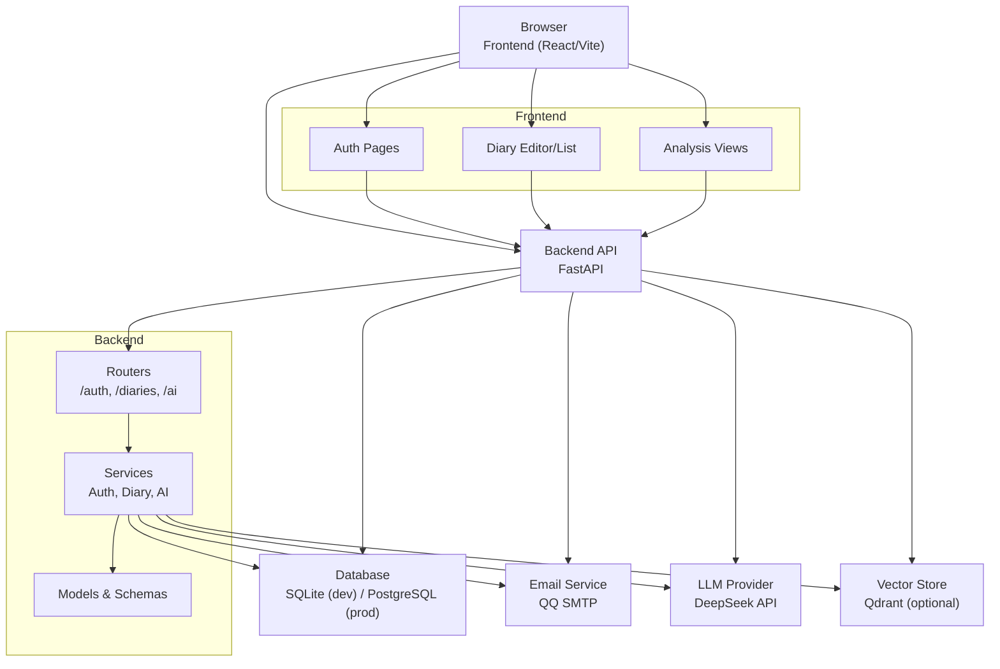

# Getting Started

<cite>
**Referenced Files in This Document**
- [backend README.md](file://backend/README.md)
- [frontend README.md](file://frontend/README.md)
- [backend requirements.txt](file://backend/requirements.txt)
- [frontend package.json](file://frontend/package.json)
- [backend main.py](file://backend/main.py)
- [backend config.py](file://backend/app/core/config.py)
- [backend .env.example](file://backend/.env.example)
- [backend install.bat](file://backend/install.bat)
- [backend start.bat](file://backend/start.bat)
- [backend auth endpoints](file://backend/app/api/v1/auth.py)
- [backend diaries endpoints](file://backend/app/api/v1/diaries.py)
- [backend ai endpoints](file://backend/app/api/v1/ai.py)
- [frontend vite.config.ts](file://frontend/vite.config.ts)
- [DEPLOY.md](file://DEPLOY.md)
- [QUICK_START.md](file://docs/QUICK_START.md)
</cite>

## Table of Contents
1. [Introduction](#introduction)
2. [Prerequisites](#prerequisites)
3. [Installation](#installation)
4. [Environment Setup](#environment-setup)
5. [Database Initialization](#database-initialization)
6. [First Run](#first-run)
7. [Basic Usage](#basic-usage)
8. [Verification Steps](#verification-steps)
9. [Quick Start Examples](#quick-start-examples)
10. [Troubleshooting](#troubleshooting)
11. [Architecture Overview](#architecture-overview)
12. [Conclusion](#conclusion)

## Introduction
This guide helps you install and run the YinJi smart diary application locally. It covers backend and frontend setup, environment configuration, database initialization, and first-run tasks. You will learn how to create an account, write diary entries, and access AI analysis features.

## Prerequisites
- Python 3.9 or newer for the backend
- Node.js 18.x for the frontend
- Git for cloning the repository
- A terminal/shell (Windows Command Prompt, PowerShell, or Unix shell)
- Optional: Docker for containerized deployment (covered in deployment docs)

Key technology stack highlights:
- Backend: FastAPI, SQLAlchemy 2.0 (async), JWT authentication, QQ SMTP email service
- Frontend: React 18 + Vite + TypeScript + shadcn/ui + Zustand
- AI: DeepSeek API for analysis features

**Section sources**
- [backend README.md: Technology Stack:5-12](file://backend/README.md#L5-L12)
- [frontend README.md: Technology Stack:5-14](file://frontend/README.md#L5-L14)
- [backend requirements.txt:1-26](file://backend/requirements.txt#L1-L26)
- [frontend package.json:1-54](file://frontend/package.json#L1-L54)

## Installation
Follow these platform-specific steps to install dependencies and run the application.

### Backend (Python)
1. Navigate to the backend directory and create a virtual environment:
   - Windows: `python -m venv venv`
   - Linux/macOS: `python3 -m venv venv`
2. Activate the virtual environment:
   - Windows: `venv\Scripts\activate`
   - Linux/macOS: `source venv/bin/activate`
3. Install Python dependencies:
   - `pip install -r requirements.txt`
4. Alternatively, use the provided Windows installer script:
   - `install.bat` (with proxy support configured inside the script)

Notes:
- The backend uses FastAPI and requires Python 3.9+.
- Dependencies include FastAPI, Uvicorn, SQLAlchemy, JWT libraries, email client, HTTP client, and timezone utilities.

**Section sources**
- [backend README.md: Quick Start:14-33](file://backend/README.md#L14-L33)
- [backend install.bat:1-67](file://backend/install.bat#L1-L67)
- [backend requirements.txt:1-26](file://backend/requirements.txt#L1-L26)

### Frontend (Node.js)
1. Install Node.js 18.x if not already installed.
2. Install dependencies:
   - `npm install`
3. Start the development server:
   - `npm run dev`
4. Access the frontend at http://localhost:5173

Notes:
- The frontend uses React 18, Vite, TypeScript, and shadcn/ui components.
- The development proxy forwards `/api` and `/uploads` to the backend on port 8000.

**Section sources**
- [frontend README.md: Development:37-63](file://frontend/README.md#L37-L63)
- [frontend vite.config.ts:1-27](file://frontend/vite.config.ts#L1-L27)

## Environment Setup
Configure environment variables for both backend and frontend.

### Backend Environment Variables
1. Copy the template to `.env`:
   - `cp .env.example .env`
2. Edit `.env` to set:
   - `SECRET_KEY`: A secure random key (required)
   - `QQ_EMAIL`: Your QQ email address
   - `QQ_EMAIL_AUTH_CODE`: QQ SMTP authorization code
   - `DEEPSEEK_API_KEY`: Your DeepSeek API key (for AI features)
   - `QDRANT_URL`, `QDRANT_API_KEY`: Optional vector storage for RAG
   - `DATABASE_URL`: Defaults to SQLite for local dev; switch to PostgreSQL for production

Important defaults and options:
- Allowed origins default to localhost ports for frontend and admin UI
- Debug mode enabled by default for development
- SMTP settings for QQ email with SSL on port 465

**Section sources**
- [backend .env.example:1-45](file://backend/.env.example#L1-L45)
- [backend config.py:10-105](file://backend/app/core/config.py#L10-L105)
- [backend README.md: Configuration:35-46](file://backend/README.md#L35-L46)

### Frontend Environment Variables
1. Create `.env.local`:
   - `VITE_API_BASE_URL=http://localhost:8000`
2. The frontend proxies `/api` and `/uploads` to the backend automatically during development.

**Section sources**
- [frontend README.md: Environment Variables:85-91](file://frontend/README.md#L85-L91)
- [frontend vite.config.ts:15-24](file://frontend/vite.config.ts#L15-L24)

## Database Initialization
The backend initializes the database automatically on startup. SQLite is used by default for local development.

What happens on startup:
- The application lifecycle hook creates tables and ensures the database is ready before serving requests.

To verify database readiness:
- Visit the health endpoint after starting the backend.

**Section sources**
- [backend main.py: Lifespan and database init:17-29](file://backend/main.py#L17-L29)
- [backend README.md: Database:8-9](file://backend/README.md#L8-L9)

## First Run
Start both backend and frontend services.

### Backend
- Option 1: Direct run
  - `python main.py`
- Option 2: Uvicorn
  - `uvicorn main:app --reload --host 0.0.0.0 --port 8000`
- Option 3: Windows shortcut
  - `start.bat` (checks dependencies and launches the app)

Access the API documentation:
- Swagger UI: http://localhost:8000/docs
- ReDoc: http://localhost:8000/redoc

**Section sources**
- [backend README.md: Run Application:48-56](file://backend/README.md#L48-L56)
- [backend start.bat:1-46](file://backend/start.bat#L1-L46)
- [backend main.py: Root and Health:79-95](file://backend/main.py#L79-L95)

### Frontend
- Start the dev server:
  - `npm run dev`
- Open http://localhost:5173

Proxy configuration:
- `/api` and `/uploads` are proxied to the backend at `http://localhost:8000`.

**Section sources**
- [frontend README.md: Development:45-51](file://frontend/README.md#L45-L51)
- [frontend vite.config.ts:13-25](file://frontend/vite.config.ts#L13-L25)

## Basic Usage
Once both services are running, you can use the application:

- Authentication: Register and log in via email verification
- Diary Management: Create, edit, and delete diary entries
- AI Analysis: Generate titles, daily guidance, and comprehensive insights
- Timeline: View and manage life events derived from your diary

**Section sources**
- [backend auth endpoints:25-315](file://backend/app/api/v1/auth.py#L25-L315)
- [backend diaries endpoints:55-501](file://backend/app/api/v1/diaries.py#L55-L501)
- [backend ai endpoints:83-800](file://backend/app/api/v1/ai.py#L83-L800)

## Verification Steps
Confirm the system is working correctly:

1. Backend health check
   - `curl http://localhost:8000/health`
   - Expected: healthy status with database connected

2. API documentation
   - Open http://localhost:8000/docs and browse available endpoints

3. Frontend accessibility
   - Open http://localhost:5173 and ensure the app loads without errors

4. Email configuration (optional)
   - Test sending an email from the backend using the test endpoint

**Section sources**
- [backend main.py: Health endpoint:89-95](file://backend/main.py#L89-L95)
- [backend README.md: API Docs:58-62](file://backend/README.md#L58-L62)
- [backend auth endpoints: Test email:298-315](file://backend/app/api/v1/auth.py#L298-L315)

## Quick Start Examples
Complete beginner-friendly workflows to get you started quickly.

### Create an Account
1. Register
   - Send verification code: POST `/api/v1/auth/register/send-code`
   - Verify code: POST `/api/v1/auth/register/verify`
   - Complete registration: POST `/api/v1/auth/register`
2. Log In
   - Send login code: POST `/api/v1/auth/login/send-code`
   - Authenticate: POST `/api/v1/auth/login`
3. Retrieve profile
   - GET `/api/v1/auth/me`

Tip: Use the frontend login/register pages for a guided experience.

**Section sources**
- [backend auth endpoints:25-188](file://backend/app/api/v1/auth.py#L25-L188)

### Write Your First Diary Entry
1. Create a new diary
   - POST `/api/v1/diaries/`
   - Provide title, content, optional emotion tags, importance score
2. View your diary list
   - GET `/api/v1/diaries/?page=1&page_size=20`
3. Edit or delete later
   - PUT `/api/v1/diaries/{diary_id}`
   - DELETE `/api/v1/diaries/{diary_id}`

Optional: Upload images
- POST `/api/v1/diaries/upload-image` (supports jpg/png/gif/webp, up to 10MB)

**Section sources**
- [backend diaries endpoints:55-248](file://backend/app/api/v1/diaries.py#L55-L248)

### Access AI Analysis Features
1. Generate a title suggestion
   - POST `/api/v1/ai/generate-title`
2. Get daily guidance
   - GET `/api/v1/ai/daily-guidance`
3. Comprehensive user-level analysis (RAG)
   - POST `/api/v1/ai/comprehensive-analysis`
4. View previous analyses
   - GET `/api/v1/ai/analyses`
5. Get a specific analysis result
   - GET `/api/v1/ai/result/{diary_id}`

Note: These features require a valid DeepSeek API key configured in the backend environment.

**Section sources**
- [backend ai endpoints:83-800](file://backend/app/api/v1/ai.py#L83-L800)
- [backend .env.example: DeepSeek API:30-33](file://backend/.env.example#L30-L33)

## Troubleshooting
Common issues and solutions:

- Backend fails to start
  - Check logs from the terminal where the backend is running
  - Ensure the virtual environment is activated and dependencies installed
  - Verify port 8000 is free

- Frontend cannot connect to backend
  - Confirm backend is running on port 8000
  - Check `.env.local` for correct `VITE_API_BASE_URL`
  - Review browser network tab for CORS-related errors

- Email sending fails (QQ SMTP)
  - Enable SMTP in QQ mail settings
  - Use the correct authorization code (not your QQ password)
  - Confirm SSL port 465 is used

- Database initialization issues
  - Delete the SQLite file if corrupted and restart the backend
  - Ensure the database directory exists and is writable

- Windows-specific
  - Use `install.bat` and `start.bat` for simplified setup
  - Proxy settings may be required depending on your network

**Section sources**
- [backend README.md: Common Issues:139-156](file://backend/README.md#L139-L156)
- [frontend README.md: Common Issues:200-220](file://frontend/README.md#L200-L220)
- [DEPLOY.md: Troubleshooting:355-389](file://DEPLOY.md#L355-L389)

## Architecture Overview
High-level flow of the application:

**Diagram sources**
- [backend main.py:48-76](file://backend/main.py#L48-L76)
- [backend auth endpoints:22-315](file://backend/app/api/v1/auth.py#L22-L315)
- [backend diaries endpoints:29-501](file://backend/app/api/v1/diaries.py#L29-L501)
- [backend ai endpoints:31-800](file://backend/app/api/v1/ai.py#L31-L800)

## Conclusion
You now have the essentials to install, configure, and run the YinJi application locally. Use the quick start examples to create an account, write your first diary, and explore AI analysis features. Refer to the troubleshooting section if you encounter issues, and consult the deployment guide for production setups.