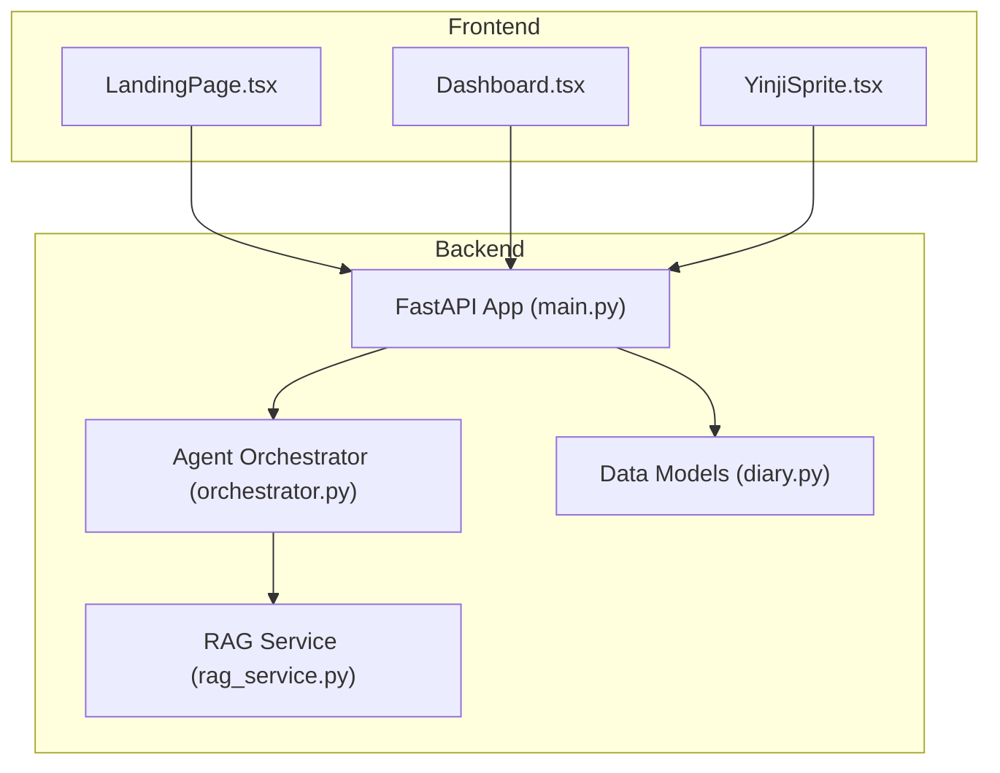
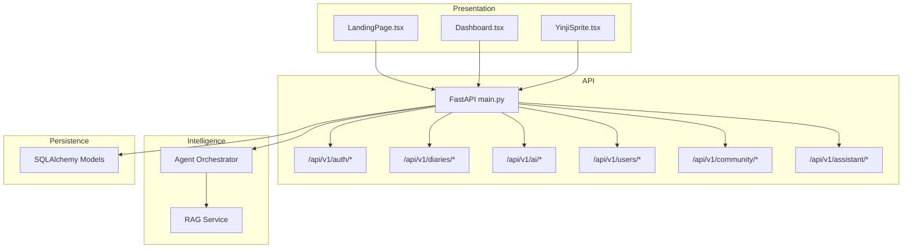
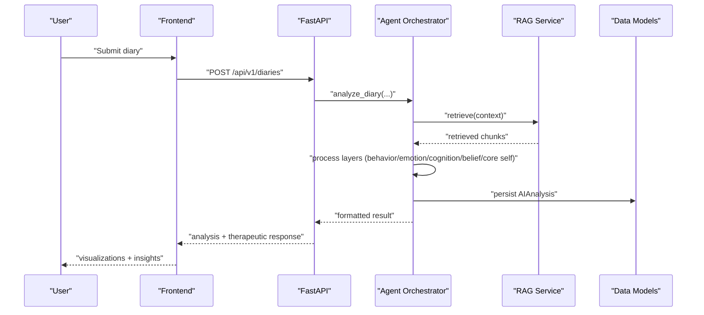
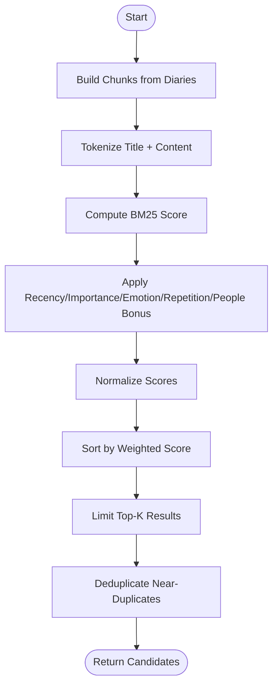
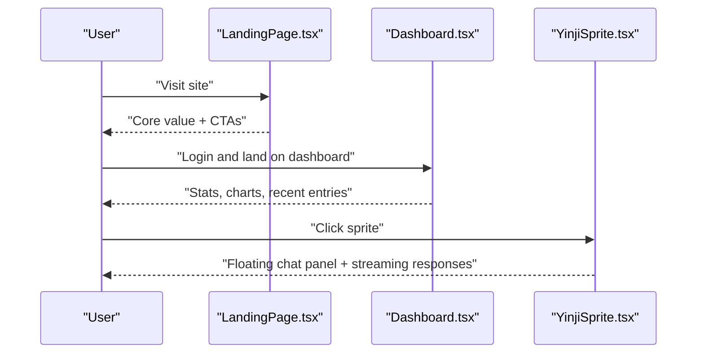
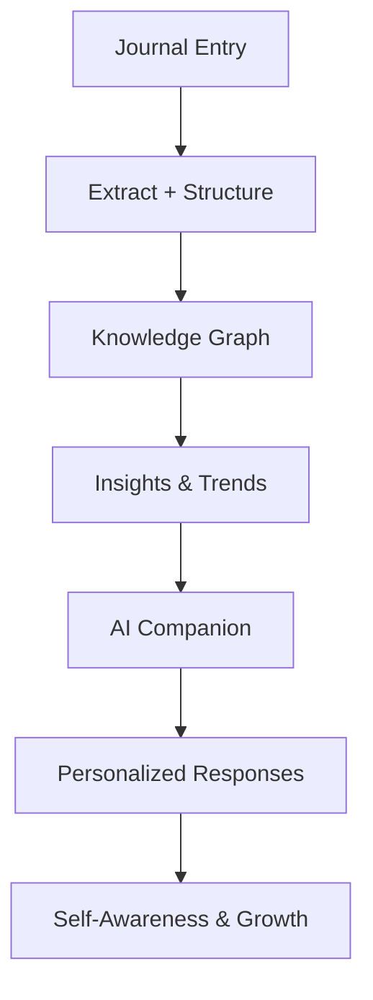
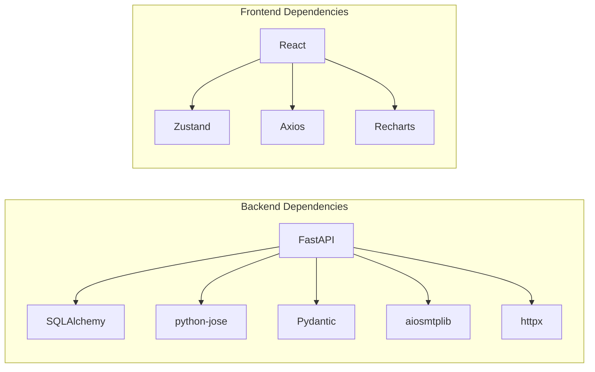

# Introduction and Purpose

<cite>
**Referenced Files in This Document**
- [PRD-产品需求文档.md](file://PRD-产品需求文档.md)
- [产品手册.md](file://docs/产品手册.md)
- [AI助手对话功能.md](file://docs/功能文档/AI助手对话功能.md)
- [成长中心模块.md](file://docs/功能文档/成长中心模块.md)
- [LandingPage.tsx](file://frontend/src/pages/LandingPage.tsx)
- [Dashboard.tsx](file://frontend/src/pages/dashboard/Dashboard.tsx)
- [YinjiSprite.tsx](file://frontend/src/components/assistant/YinjiSprite.tsx)
- [orchestrator.py](file://backend/app/agents/orchestrator.py)
- [rag_service.py](file://backend/app/services/rag_service.py)
- [diary.py](file://backend/app/models/diary.py)
- [main.py](file://backend/main.py)
- [requirements.txt](file://backend/requirements.txt)
</cite>

## Table of Contents
1. [Introduction](#introduction)
2. [Project Structure](#project-structure)
3. [Core Components](#core-components)
4. [Architecture Overview](#architecture-overview)
5. [Detailed Component Analysis](#detailed-component-analysis)
6. [Dependency Analysis](#dependency-analysis)
7. [Performance Considerations](#performance-considerations)
8. [Troubleshooting Guide](#troubleshooting-guide)
9. [Conclusion](#conclusion)

## Introduction
映记 is a long-term emotional companion powered by AI, designed to transform personal journal entries into a comprehensive personal knowledge base. Its fundamental vision is to help users understand their thoughts, emotions, and behavioral patterns through psychological insights combined with practical AI assistance. The project bridges the gap between traditional journaling and modern AI-assisted personal development by turning daily reflections into structured, retrievable knowledge that deepens self-awareness over time.

The problem statement that inspired the project is clear: most people keep journals but rarely revisit them meaningfully, and when they do, they often struggle to see patterns or gain actionable insights. Traditional journaling lacks the ability to connect past entries, surface recurring themes, or offer therapeutic guidance grounded in psychological models. 映记 solves this by automatically extracting insights from each entry, structuring them into a knowledge graph, and providing ongoing, personalized support through an AI companion.

Target audience includes individuals seeking self-reflection and personal growth, such as:
- Professionals under stress who need a safe space to reflect and decompress
- Creative and introspective individuals who want to capture and explore life’s nuances
- Psychological growth enthusiasts interested in frameworks like the Satir Iceberg Model
- Parents navigating life transitions who want to record and learn from their experiences

The core mission is to become “the AI psychological companion” that grows more understanding with every entry, offering continuous emotional support, pattern recognition, and practical guidance rooted in psychology and AI.

Unique value proposition:
- Psychological depth: Structured analysis using the Satir Iceberg Model across five layers (behavior, emotion, cognition, belief, core self)
- Practical AI assistance: Automated extraction, contextual retrieval, and therapeutic responses
- Long-term memory: A continuously evolving personal knowledge base that improves with each interaction
- Emotional companionship: An AI that proactively checks in, remembers context, and offers warm, nonjudgmental responses

Context for user personas:
- The Overwhelmed Executive: Uses 映记 to process work stress, reflect on interpersonal dynamics, and receive gentle guidance grounded in psychological insights.
- The Reflective Artist: Records creative moments and emotional shifts, gaining clarity on themes and patterns that inform both personal growth and artistic expression.
- The Mindful Parent: Documents parenting challenges and milestones, reflecting on emotional reactions and discovering deeper motivations behind actions.
- The Curious Learner: Interested in self-awareness and personal development, leveraging 映记 to track progress, recognize cycles, and receive tailored suggestions.

## Project Structure
The 映记 project is organized into a modern full-stack architecture:
- Frontend (React + TypeScript): Provides a warm, emotionally supportive UI with interactive dashboards, chat, and visualization components.
- Backend (FastAPI): Implements APIs for authentication, diary management, AI analysis orchestration, and integrations with RAG services.
- AI Agents and Services: Orchestrate multi-step analysis workflows, extract insights, and manage conversational contexts.
- Data Models: Define schemas for diaries, timeline events, AI analysis results, and social content samples.
- Deployment and DevOps: Includes quick-start deployment guidance and containerization options.

**Diagram sources**
- [main.py:42-87](file://backend/main.py#L42-L87)
- [orchestrator.py:18-175](file://backend/app/agents/orchestrator.py#L18-L175)
- [rag_service.py:147-359](file://backend/app/services/rag_service.py#L147-L359)
- [diary.py:29-186](file://backend/app/models/diary.py#L29-L186)
- [LandingPage.tsx:1-308](file://frontend/src/pages/LandingPage.tsx#L1-L308)
- [Dashboard.tsx:1-323](file://frontend/src/pages/dashboard/Dashboard.tsx#L1-L323)
- [YinjiSprite.tsx:1-545](file://frontend/src/components/assistant/YinjiSprite.tsx#L1-L545)

**Section sources**
- [main.py:42-87](file://backend/main.py#L42-L87)
- [requirements.txt:1-26](file://backend/requirements.txt#L1-L26)
- [LandingPage.tsx:1-308](file://frontend/src/pages/LandingPage.tsx#L1-L308)
- [Dashboard.tsx:1-323](file://frontend/src/pages/dashboard/Dashboard.tsx#L1-L323)
- [YinjiSprite.tsx:1-545](file://frontend/src/components/assistant/YinjiSprite.tsx#L1-L545)

## Core Components
- AI Agent Orchestrator: Coordinates multi-agent workflows for context collection, timeline event extraction, Satir analysis, and social content generation. It manages state, tracks processing steps, and formats results for downstream consumption.
- RAG Service: Performs chunking, tokenization, BM25-based retrieval, and deduplication to build a semantic index from diary entries. It weights relevance by recency, importance, emotion intensity, repetition, and entity mentions.
- Data Models: Define core entities such as Diaries, TimelineEvents, AIAnalysis results, and SocialPostSamples, enabling persistent storage and cross-module integration.
- Frontend UI: Includes a welcoming landing page, a dashboard with statistics and charts, and a floating AI companion (Yinji Sprite) that supports streaming conversations and session management.

These components collectively enable 映记 to transform raw journal entries into structured insights, visualizations, and ongoing companionship.

**Section sources**
- [orchestrator.py:18-175](file://backend/app/agents/orchestrator.py#L18-L175)
- [rag_service.py:147-359](file://backend/app/services/rag_service.py#L147-L359)
- [diary.py:29-186](file://backend/app/models/diary.py#L29-L186)
- [LandingPage.tsx:1-308](file://frontend/src/pages/LandingPage.tsx#L1-L308)
- [Dashboard.tsx:1-323](file://frontend/src/pages/dashboard/Dashboard.tsx#L1-L323)
- [YinjiSprite.tsx:1-545](file://frontend/src/components/assistant/YinjiSprite.tsx#L1-L545)

## Architecture Overview
The system follows a layered architecture:
- Presentation Layer: React-based UI with responsive design and interactive components.
- API Layer: FastAPI routes for authentication, diaries, AI analysis, users, community, and assistant.
- Intelligence Layer: Agent orchestrator and RAG service coordinate analysis and retrieval.
- Persistence Layer: SQLAlchemy models define relational schemas for diaries, timelines, analyses, and samples.

**Diagram sources**
- [main.py:59-87](file://backend/main.py#L59-L87)
- [orchestrator.py:18-175](file://backend/app/agents/orchestrator.py#L18-L175)
- [rag_service.py:147-359](file://backend/app/services/rag_service.py#L147-L359)
- [diary.py:29-186](file://backend/app/models/diary.py#L29-L186)

## Detailed Component Analysis

### AI Agent Orchestrator
The orchestrator coordinates a multi-step analysis pipeline:
- Context Collection: Aggregates user profile and timeline context
- Timeline Extraction: Structures diary events into timeline records
- Satir Analysis: Processes five layers (behavior, emotion, cognition, belief, core self)
- Therapeutic Response: Generates warm, personalized feedback
- Social Content Generation: Produces shareable posts with style learning

**Diagram sources**
- [orchestrator.py:27-119](file://backend/app/agents/orchestrator.py#L27-L119)
- [rag_service.py:210-317](file://backend/app/services/rag_service.py#L210-L317)
- [diary.py:102-132](file://backend/app/models/diary.py#L102-L132)

**Section sources**
- [orchestrator.py:18-175](file://backend/app/agents/orchestrator.py#L18-L175)
- [rag_service.py:147-359](file://backend/app/services/rag_service.py#L147-L359)
- [diary.py:29-186](file://backend/app/models/diary.py#L29-L186)

### RAG Retrieval and Weighting
The RAG service builds a semantic index from diary content and retrieves relevant chunks for analysis:
- Chunking: Splits content into overlapping segments
- Tokenization: Handles both Chinese characters and English tokens
- Scoring: BM25 with recency, importance, emotion intensity, repetition, and entity mention bonuses
- Deduplication: Removes near-duplicates while respecting per-reason limits

**Diagram sources**
- [rag_service.py:147-359](file://backend/app/services/rag_service.py#L147-L359)

**Section sources**
- [rag_service.py:147-359](file://backend/app/services/rag_service.py#L147-L359)

### Frontend Experience and Companion
The frontend emphasizes emotional comfort and ease of use:
- Landing page highlights core benefits and pricing tiers
- Dashboard provides statistics, emotion charts, and quick actions
- Yinji Sprite offers a persistent, friendly AI companion with streaming conversations, session management, and initialization flow

**Diagram sources**
- [LandingPage.tsx:1-308](file://frontend/src/pages/LandingPage.tsx#L1-L308)
- [Dashboard.tsx:1-323](file://frontend/src/pages/dashboard/Dashboard.tsx#L1-L323)
- [YinjiSprite.tsx:1-545](file://frontend/src/components/assistant/YinjiSprite.tsx#L1-L545)

**Section sources**
- [LandingPage.tsx:1-308](file://frontend/src/pages/LandingPage.tsx#L1-L308)
- [Dashboard.tsx:1-323](file://frontend/src/pages/dashboard/Dashboard.tsx#L1-L323)
- [YinjiSprite.tsx:1-545](file://frontend/src/components/assistant/YinjiSprite.tsx#L1-L545)

### Conceptual Overview
映记 transforms journaling from a passive activity into an active journey of self-discovery. By integrating psychological frameworks with AI-driven analysis, it enables users to:
- See patterns across time
- Understand the layers beneath surface behaviors and emotions
- Receive compassionate, personalized guidance
- Share meaningful moments with curated content

[No sources needed since this diagram shows conceptual workflow, not actual code structure]

## Dependency Analysis
The backend depends on a focused set of libraries and integrates tightly with AI providers and databases. The frontend relies on React ecosystem packages and state management for a smooth user experience.

**Diagram sources**
- [requirements.txt:1-26](file://backend/requirements.txt#L1-L26)

**Section sources**
- [requirements.txt:1-26](file://backend/requirements.txt#L1-L26)

## Performance Considerations
- RAG scoring and retrieval: Keep top-k reasonable and precompute token frequencies to reduce latency during analysis.
- Streaming UI: Ensure frontend handles partial responses efficiently to maintain responsiveness.
- Database indexing: Index frequently queried fields (e.g., diary_date, user_id) to speed up retrieval and timeline queries.
- Caching: Cache repeated analysis results and user sessions to minimize redundant computations.

[No sources needed since this section provides general guidance]

## Troubleshooting Guide
Common issues and resolutions:
- Backend health check: Verify the health endpoint returns a healthy status and database connectivity.
- Authentication: Confirm environment variables for secrets and email credentials are properly configured.
- CORS: Ensure allowed origins are set correctly for local and production environments.
- Frontend API proxy: Validate the API base URL and route proxies for seamless communication between frontend and backend.

**Section sources**
- [main.py:100-106](file://backend/main.py#L100-L106)
- [main.py:50-57](file://backend/main.py#L50-L57)
- [frontend README:85-103](file://frontend/README.md#L85-L103)

## Conclusion
映记 aims to redefine personal journaling by merging psychological insight with practical AI assistance. Through structured analysis, long-term memory, and an emotionally intelligent companion, it helps users move from “what happened” to “what it means” and “how to grow.” By focusing on user personas who seek reflection, growth, and meaningful connection with their inner lives, 映记 delivers a unique value proposition: a system that understands you better with every entry, becoming a trusted partner in your journey of self-discovery.