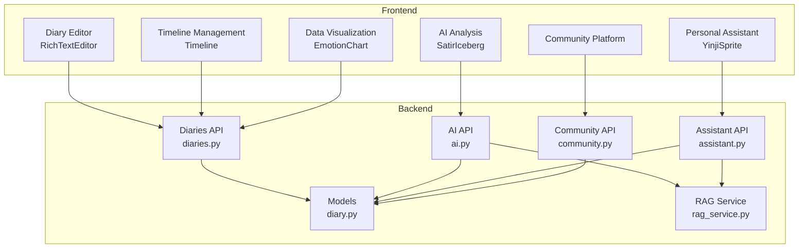
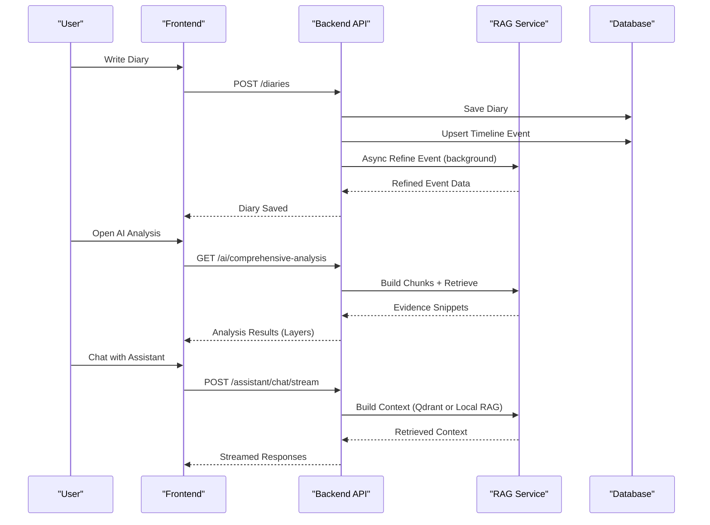
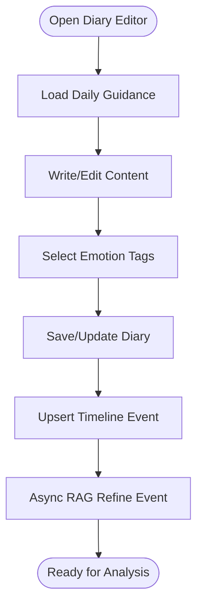
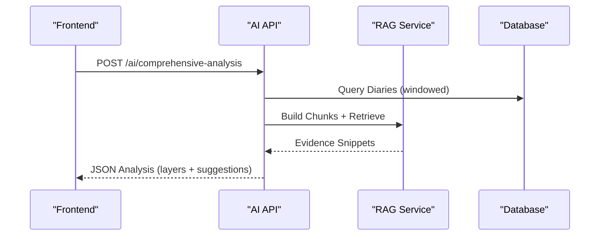
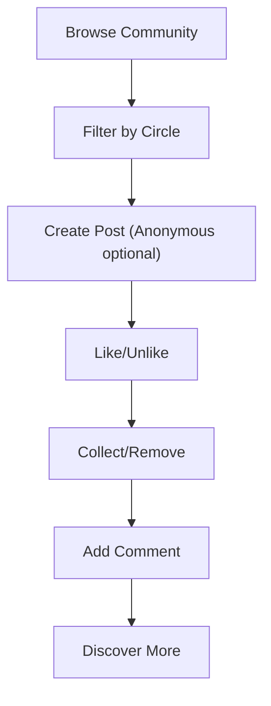
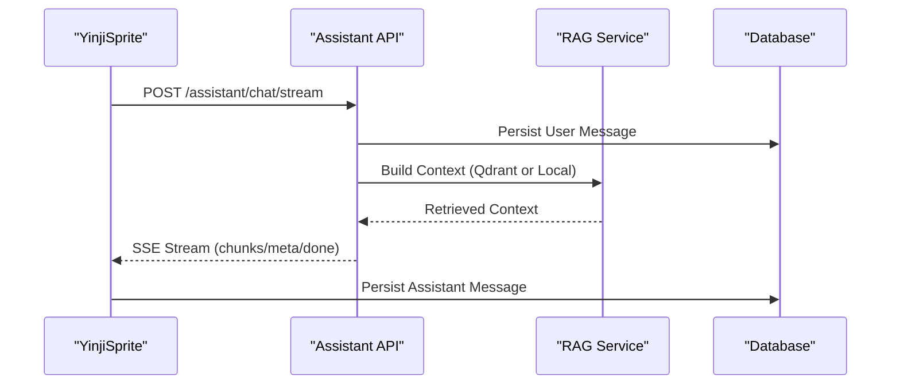
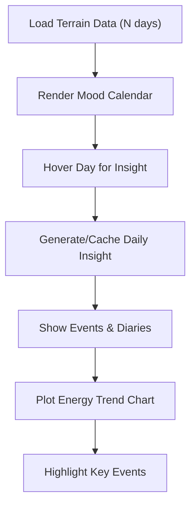
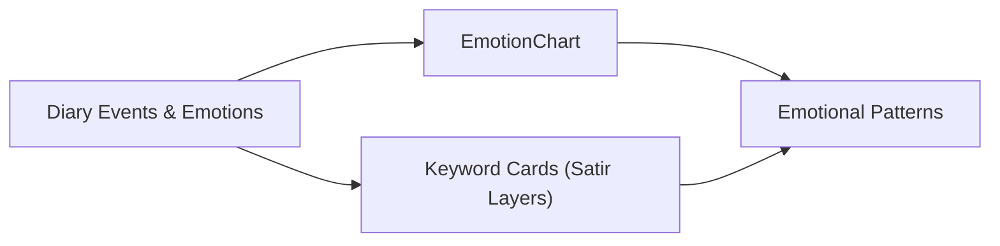
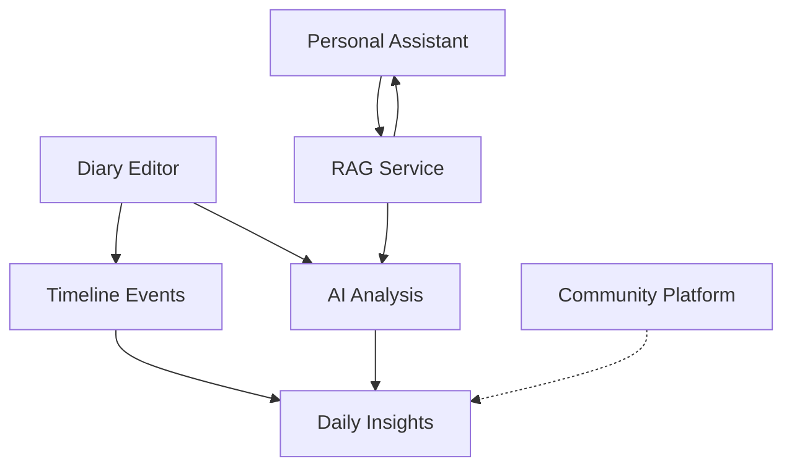

# Key Features Overview

<cite>
**Referenced Files in This Document**
- [PRD-产品需求文档.md](file://docs/PRD-产品需求文档.md)
- [产品手册.md](file://docs/产品手册.md)
- [DiaryEditor.tsx](file://frontend/src/pages/diaries/DiaryEditor.tsx)
- [RichTextEditor.tsx](file://frontend/src/components/editor/RichTextEditor.tsx)
- [SatirIceberg.tsx](file://frontend/src/pages/analysis/SatirIceberg.tsx)
- [CommunityPage.tsx](file://frontend/src/pages/community/CommunityPage.tsx)
- [YinjiSprite.tsx](file://frontend/src/components/assistant/YinjiSprite.tsx)
- [Timeline.tsx](file://frontend/src/pages/timeline/Timeline.tsx)
- [EmotionChart.tsx](file://frontend/src/components/common/EmotionChart.tsx)
- [ai.py](file://backend/app/api/v1/ai.py)
- [assistant.py](file://backend/app/api/v1/assistant.py)
- [diaries.py](file://backend/app/api/v1/diaries.py)
- [community.py](file://backend/app/api/v1/community.py)
- [diary.py](file://backend/app/models/diary.py)
- [rag_service.py](file://backend/app/services/rag_service.py)
</cite>

## Table of Contents
1. [Introduction](#introduction)
2. [Project Structure](#project-structure)
3. [Core Components](#core-components)
4. [Architecture Overview](#architecture-overview)
5. [Detailed Component Analysis](#detailed-component-analysis)
6. [Dependency Analysis](#dependency-analysis)
7. [Performance Considerations](#performance-considerations)
8. [Troubleshooting Guide](#troubleshooting-guide)
9. [Conclusion](#conclusion)

## Introduction
This document presents the key features overview for the 映记 project, highlighting six primary feature categories designed to form a comprehensive personal growth ecosystem. Each feature contributes to a long-term emotional companion experience that helps users reflect, understand, and grow through structured self-expression, intelligent analysis, peer support, and personalized insights.

## Project Structure
The 映记 project is organized into a modern full-stack architecture:
- Frontend built with React, TypeScript, and TailwindCSS, delivering a warm, immersive interface for writing, analysis, community, and insights.
- Backend powered by FastAPI with asynchronous SQLAlchemy ORM, providing robust APIs for AI analysis, assistant chat, diary management, community, and timeline services.
- AI and RAG services enabling intelligent analysis, contextual retrieval, and personalized guidance.

**Diagram sources**
- [DiaryEditor.tsx:1-368](file://frontend/src/pages/diaries/DiaryEditor.tsx#L1-368)
- [RichTextEditor.tsx:1-383](file://frontend/src/components/editor/RichTextEditor.tsx#L1-383)
- [SatirIceberg.tsx:1-216](file://frontend/src/pages/analysis/SatirIceberg.tsx#L1-216)
- [CommunityPage.tsx:1-358](file://frontend/src/pages/community/CommunityPage.tsx#L1-358)
- [YinjiSprite.tsx:1-545](file://frontend/src/components/assistant/YinjiSprite.tsx#L1-545)
- [Timeline.tsx:1-657](file://frontend/src/pages/timeline/Timeline.tsx#L1-657)
- [EmotionChart.tsx:1-269](file://frontend/src/components/common/EmotionChart.tsx#L1-269)
- [ai.py:1-902](file://backend/app/api/v1/ai.py#L1-902)
- [assistant.py:1-389](file://backend/app/api/v1/assistant.py#L1-389)
- [diaries.py:1-501](file://backend/app/api/v1/diaries.py#L1-501)
- [community.py:1-324](file://backend/app/api/v1/community.py#L1-324)
- [diary.py:1-186](file://backend/app/models/diary.py#L1-186)
- [rag_service.py:1-360](file://backend/app/services/rag_service.py#L1-360)

**Section sources**
- [PRD-产品需求文档.md:1-262](file://docs/PRD-产品需求文档.md#L1-L262)
- [产品手册.md:1-152](file://docs/产品手册.md#L1-L152)

## Core Components
This section introduces the six feature categories and their high-level capabilities:

- Smart Diary System
  - Rich text editing with Markdown, images, and preset emotion tags
  - AI-driven daily guidance and title suggestions
  - Structured event extraction and timeline integration

- AI Psychological Analysis (RAG + Satir Iceberg)
  - Multi-layer psychological analysis (behavior, emotion, cognition, beliefs, existence)
  - Retrieval-Augmented Generation for contextual insights
  - Visual iceburg representation for layered understanding

- Community Platform
  - Anonymous posting with emotion-based circles
  - Like, collect, and browse interactions
  - Curated content discovery without follower metrics

- Personal Assistant
  - Interactive AI chat widget with streaming responses
  - Session management and persistent memory
  - Context-aware replies using RAG over diary history

- Timeline Management
  - Structured event tracking with emotion and importance scoring
  - Energy and valence visualization over time
  - Daily insights and key event markers

- Data Visualization
  - Mood charts and emotion bubble visualization
  - Trending insights and keyword prominence
  - Relationship graph exploration (planned)

**Section sources**
- [DiaryEditor.tsx:1-368](file://frontend/src/pages/diaries/DiaryEditor.tsx#L1-368)
- [RichTextEditor.tsx:1-383](file://frontend/src/components/editor/RichTextEditor.tsx#L1-383)
- [SatirIceberg.tsx:1-216](file://frontend/src/pages/analysis/SatirIceberg.tsx#L1-216)
- [CommunityPage.tsx:1-358](file://frontend/src/pages/community/CommunityPage.tsx#L1-358)
- [YinjiSprite.tsx:1-545](file://frontend/src/components/assistant/YinjiSprite.tsx#L1-545)
- [Timeline.tsx:1-657](file://frontend/src/pages/timeline/Timeline.tsx#L1-657)
- [EmotionChart.tsx:1-269](file://frontend/src/components/common/EmotionChart.tsx#L1-269)
- [ai.py:1-902](file://backend/app/api/v1/ai.py#L1-L902)
- [assistant.py:1-389](file://backend/app/api/v1/assistant.py#L1-L389)
- [diaries.py:1-501](file://backend/app/api/v1/diaries.py#L1-L501)
- [community.py:1-324](file://backend/app/api/v1/community.py#L1-L324)
- [rag_service.py:1-360](file://backend/app/services/rag_service.py#L1-L360)

## Architecture Overview
The features integrate through a cohesive pipeline:
- Users write in the diary editor, which triggers automatic timeline event creation and asynchronous refinement.
- AI analysis leverages RAG over historical entries to produce layered insights and summaries.
- The Personal Assistant provides continuous companionship with streamed conversations enriched by diary context.
- Community enables anonymous sharing and peer connection, complementing personal reflection.
- Timeline and visualization surfaces long-term patterns and daily insights.

**Diagram sources**
- [diaries.py:32-51](file://backend/app/api/v1/diaries.py#L32-L51)
- [ai.py:267-404](file://backend/app/api/v1/ai.py#L267-L404)
- [assistant.py:277-389](file://backend/app/api/v1/assistant.py#L277-L389)
- [rag_service.py:147-360](file://backend/app/services/rag_service.py#L147-L360)
- [diary.py:29-186](file://backend/app/models/diary.py#L29-L186)

## Detailed Component Analysis

### Smart Diary System
- Rich text editing with Markdown shortcuts, slash commands, and image insertion
- Preset emotion tags and importance scoring for structured reflection
- AI-powered daily guidance and title suggestions
- Automatic timeline event creation and asynchronous refinement

**Diagram sources**
- [DiaryEditor.tsx:1-368](file://frontend/src/pages/diaries/DiaryEditor.tsx#L1-368)
- [RichTextEditor.tsx:1-383](file://frontend/src/components/editor/RichTextEditor.tsx#L1-383)
- [diaries.py:55-78](file://backend/app/api/v1/diaries.py#L55-L78)

**Section sources**
- [DiaryEditor.tsx:11-38](file://frontend/src/pages/diaries/DiaryEditor.tsx#L11-L38)
- [RichTextEditor.tsx:29-45](file://frontend/src/components/editor/RichTextEditor.tsx#L29-L45)
- [diaries.py:55-78](file://backend/app/api/v1/diaries.py#L55-L78)

### AI Psychological Analysis (RAG + Satir Iceberg)
- Comprehensive analysis over configurable windows using hybrid lexical and recency weighting
- Layered psychological interpretation aligned with the Satir Iceberg Model
- Visual presentation of five layers: behavior, emotion, cognition, beliefs, and existence

**Diagram sources**
- [ai.py:267-404](file://backend/app/api/v1/ai.py#L267-L404)
- [rag_service.py:147-360](file://backend/app/services/rag_service.py#L147-L360)
- [SatirIceberg.tsx:10-75](file://frontend/src/pages/analysis/SatirIceberg.tsx#L10-L75)

**Section sources**
- [ai.py:267-404](file://backend/app/api/v1/ai.py#L267-L404)
- [rag_service.py:147-360](file://backend/app/services/rag_service.py#L147-L360)
- [SatirIceberg.tsx:10-75](file://frontend/src/pages/analysis/SatirIceberg.tsx#L10-L75)

### Community Platform
- Anonymous posting with emotion-based circles (anxiety, sadness, growth, peace, confusion)
- Like, collect, and comment interactions
- Browse and discover posts with pagination and filtering

**Diagram sources**
- [CommunityPage.tsx:31-358](file://frontend/src/pages/community/CommunityPage.tsx#L31-L358)
- [community.py:39-156](file://backend/app/api/v1/community.py#L39-L156)

**Section sources**
- [CommunityPage.tsx:9-15](file://frontend/src/pages/community/CommunityPage.tsx#L9-L15)
- [community.py:39-156](file://backend/app/api/v1/community.py#L39-L156)

### Personal Assistant
- Interactive chat widget with draggable, resizable panel
- Session management, message streaming, and profile customization
- Context-aware responses using RAG over diary history

**Diagram sources**
- [YinjiSprite.tsx:281-335](file://frontend/src/components/assistant/YinjiSprite.tsx#L281-L335)
- [assistant.py:277-389](file://backend/app/api/v1/assistant.py#L277-L389)
- [rag_service.py:85-120](file://backend/app/services/rag_service.py#L85-L120)

**Section sources**
- [YinjiSprite.tsx:20-88](file://frontend/src/components/assistant/YinjiSprite.tsx#L20-L88)
- [assistant.py:277-389](file://backend/app/api/v1/assistant.py#L277-L389)

### Timeline Management
- Structured event tracking with emotion tags and importance scores
- Energy and valence visualization over 7/30/90-day windows
- Daily insights generation and key event markers

**Diagram sources**
- [Timeline.tsx:116-145](file://frontend/src/pages/timeline/Timeline.tsx#L116-L145)
- [Timeline.tsx:175-191](file://frontend/src/pages/timeline/Timeline.tsx#L175-L191)
- [diaries.py:340-353](file://backend/app/api/v1/diaries.py#L340-L353)

**Section sources**
- [Timeline.tsx:116-203](file://frontend/src/pages/timeline/Timeline.tsx#L116-L203)
- [diaries.py:340-353](file://backend/app/api/v1/diaries.py#L340-L353)

### Data Visualization
- Emotion bubble chart with color-coded emotions and dynamic layout
- Keyword prominence cards for each Satir layer
- Planned relationship graph visualization

**Diagram sources**
- [EmotionChart.tsx:158-269](file://frontend/src/components/common/EmotionChart.tsx#L158-L269)
- [Timeline.tsx:193-202](file://frontend/src/pages/timeline/Timeline.tsx#L193-L202)

**Section sources**
- [EmotionChart.tsx:10-83](file://frontend/src/components/common/EmotionChart.tsx#L10-L83)
- [Timeline.tsx:193-202](file://frontend/src/pages/timeline/Timeline.tsx#L193-L202)

## Dependency Analysis
Feature interdependencies and data flows:
- Diary writes trigger timeline events and asynchronous RAG refinement, feeding analysis and insights.
- AI analysis uses RAG over historical diaries and timeline context.
- Assistant chat retrieves contextual diary fragments via RAG to personalize responses.
- Community posts are independent but complement personal reflection by offering anonymous peer resonance.
- Timeline and visualization consume diary and timeline data to surface patterns and daily insights.

**Diagram sources**
- [diaries.py:32-51](file://backend/app/api/v1/diaries.py#L32-L51)
- [ai.py:267-404](file://backend/app/api/v1/ai.py#L267-L404)
- [assistant.py:85-120](file://backend/app/api/v1/assistant.py#L85-L120)
- [rag_service.py:147-360](file://backend/app/services/rag_service.py#L147-L360)
- [diary.py:29-100](file://backend/app/models/diary.py#L29-L100)

**Section sources**
- [diaries.py:32-51](file://backend/app/api/v1/diaries.py#L32-L51)
- [ai.py:267-404](file://backend/app/api/v1/ai.py#L267-L404)
- [assistant.py:85-120](file://backend/app/api/v1/assistant.py#L85-L120)
- [rag_service.py:147-360](file://backend/app/services/rag_service.py#L147-L360)

## Performance Considerations
- Asynchronous refinement ensures diary saves remain responsive while background tasks refine timeline events.
- RAG retrieval employs BM25 scoring with recency, importance, and repetition heuristics to balance relevance and freshness.
- Streaming assistant responses improve perceived responsiveness and reduce latency for conversational flows.
- Visualization components compute layouts and render charts efficiently, with caching for daily insights.

[No sources needed since this section provides general guidance]

## Troubleshooting Guide
Common issues and mitigations:
- Diary save fails due to missing content or invalid date range; ensure minimum content length and valid date selection.
- AI analysis returns fallback when insufficient diary history exists; encourage continued writing to enrich context.
- Assistant chat stream errors indicate upstream LLM issues; retry after verifying network connectivity and service availability.
- Community post creation errors often relate to image size/type limits; verify supported formats and size constraints.
- Timeline visualization requires minimal diary activity; write a few entries to populate insights.

**Section sources**
- [DiaryEditor.tsx:110-143](file://frontend/src/pages/diaries/DiaryEditor.tsx#L110-L143)
- [ai.py:293-297](file://backend/app/api/v1/ai.py#L293-L297)
- [assistant.py:384-386](file://backend/app/api/v1/assistant.py#L384-L386)
- [community.py:166-178](file://backend/app/api/v1/community.py#L166-L178)
- [diaries.py:386-500](file://backend/app/api/v1/diaries.py#L386-L500)

## Conclusion
The 映记 project’s six feature categories form a cohesive personal growth ecosystem. By combining intelligent diary writing, psychological analysis, community support, continuous AI companionship, structured timeline tracking, and insightful visualizations, users gain a long-term emotional companion that evolves with them. These features reinforce each other: writing feeds analysis, analysis informs assistant responses, community provides external resonance, timeline reveals patterns, and visualization highlights progress—creating a comprehensive journey toward self-awareness and growth.