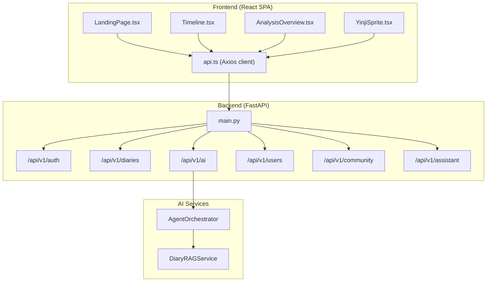
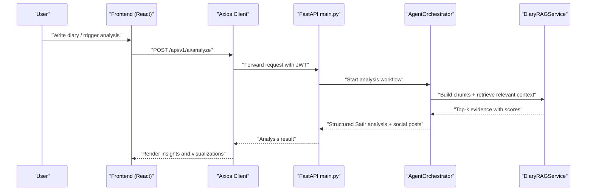
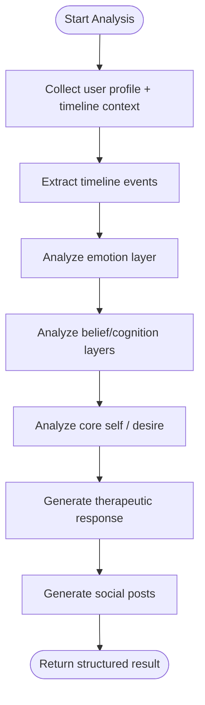
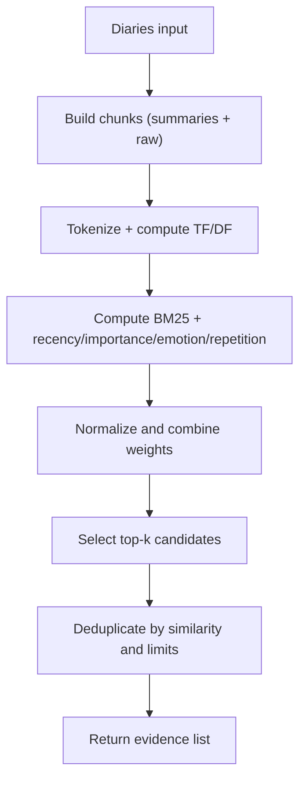
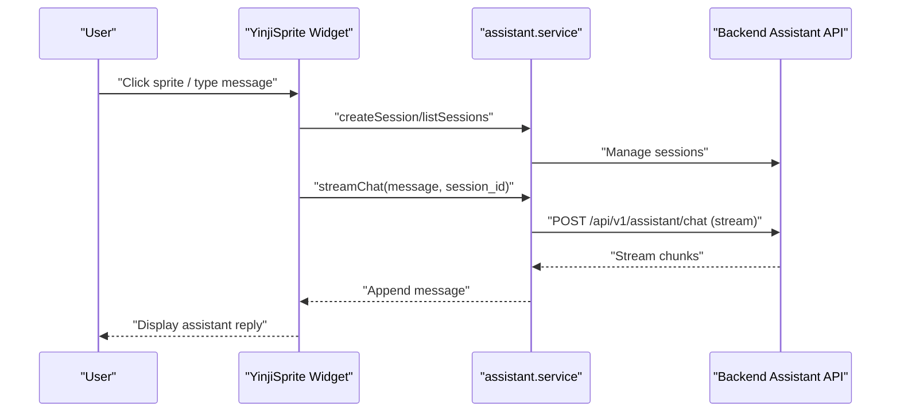
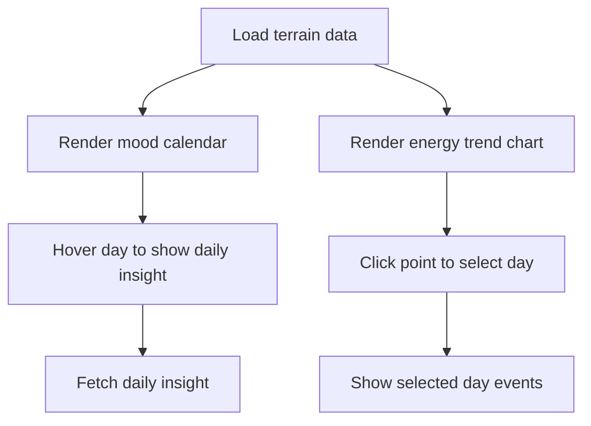
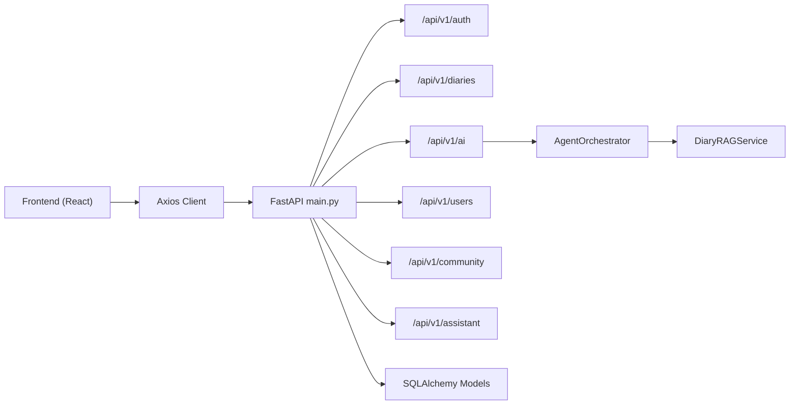

# Project Overview

<cite>
**Referenced Files in This Document**
- [backend/README.md](file://backend/README.md)
- [frontend/README.md](file://frontend/README.md)
- [PRD-产品需求文档.md](file://PRD-产品需求文档.md)
- [docs/产品手册.md](file://docs/产品手册.md)
- [backend/main.py](file://backend/main.py)
- [backend/app/services/rag_service.py](file://backend/app/services/rag_service.py)
- [backend/app/agents/orchestrator.py](file://backend/app/agents/orchestrator.py)
- [backend/app/models/diary.py](file://backend/app/models/diary.py)
- [frontend/src/pages/LandingPage.tsx](file://frontend/src/pages/LandingPage.tsx)
- [frontend/src/components/assistant/YinjiSprite.tsx](file://frontend/src/components/assistant/YinjiSprite.tsx)
- [frontend/src/pages/timeline/Timeline.tsx](file://frontend/src/pages/timeline/Timeline.tsx)
- [frontend/src/pages/analysis/AnalysisOverview.tsx](file://frontend/src/pages/analysis/AnalysisOverview.tsx)
- [frontend/src/services/api.ts](file://frontend/src/services/api.ts)
</cite>

## Table of Contents
1. [Introduction](#introduction)
2. [Project Structure](#project-structure)
3. [Core Components](#core-components)
4. [Architecture Overview](#architecture-overview)
5. [Detailed Component Analysis](#detailed-component-analysis)
6. [Dependency Analysis](#dependency-analysis)
7. [Performance Considerations](#performance-considerations)
8. [Troubleshooting Guide](#troubleshooting-guide)
9. [Conclusion](#conclusion)

## Introduction
印记 (Yinji) is a smart diary application that transforms personal journal entries into a comprehensive personal knowledge base through AI-powered analysis and visualization. The platform’s mission is to become a long-term emotional companion that grows smarter with every entry, enabling deeper self-awareness and meaningful personal growth.

Key value propositions:
- Intelligent understanding: The AI learns from your writing over time, becoming more attuned to your voice, emotions, and patterns.
- Deep emotional陪伴: Psychological insights grounded in the Satir Iceberg model help you explore layers from behavior to core desires.
- Convenient sharing: One-click generation of personalized social media posts tailored to your evolving style.
- Self-exploration: Multi-layered analysis from behavior to existence supports continuous introspection and growth.

Target audience:
- Primarily urban professionals aged 25–40 who seek self-improvement, stress relief, and structured reflection.
- Includes creatives, parents, and psychology enthusiasts interested in emotional awareness and narrative therapy.

Core benefits:
- Reduce mental clutter by externalizing thoughts and surfacing hidden patterns.
- Track emotional trends and life themes over time with visual dashboards.
- Receive warm, therapeutic responses and actionable suggestions aligned with your history.
- Build a searchable, structured memory of your life journey with timeline and knowledge graph features.

## Project Structure
The project follows a modern full-stack architecture:
- Backend: FastAPI application exposing REST APIs for authentication, diary management, AI analysis, user profiles, community, and the “Yinji Assistant.”
- Frontend: React 18 + TypeScript SPA with a cohesive UI built on shadcn/ui and Tailwind CSS, integrating real-time AI chat, timelines, and analysis dashboards.
- AI/ML: Custom-built Retrieval-Augmented Generation (RAG) pipeline and an orchestration layer of specialized AI agents for psychological analysis, timeline structuring, and social content creation.

**Diagram sources**
- [backend/main.py:31-76](file://backend/main.py#L31-L76)
- [frontend/src/services/api.ts:1-43](file://frontend/src/services/api.ts#L1-L43)
- [backend/app/agents/orchestrator.py:18-176](file://backend/app/agents/orchestrator.py#L18-L176)
- [backend/app/services/rag_service.py:147-360](file://backend/app/services/rag_service.py#L147-L360)

**Section sources**
- [backend/README.md:1-160](file://backend/README.md#L1-L160)
- [frontend/README.md:1-228](file://frontend/README.md#L1-L228)

## Core Components
- Authentication and user lifecycle: Email-based registration/login with JWT, plus profile and session management.
- Diary system: Rich-text editing, image upload, emotion tagging, importance scoring, and structured timeline events.
- AI analysis engine: Orchestration of multiple agents for Satir Iceberg analysis, timeline extraction, and social content generation, powered by a custom RAG service.
- Personal assistant (Yinji Sprite): An interactive chat companion that remembers context, supports sessions, and can be toggled on/off.
- Timeline and growth insights: Visual mood calendar, energy trend charts, keyword cards, and daily insights derived from structured diary events.
- Community platform: Anonymous, emotion-scoped posts with coherency-focused ranking.

**Section sources**
- [backend/README.md:64-104](file://backend/README.md#L64-L104)
- [frontend/README.md:65-84](file://frontend/README.md#L65-L84)
- [PRD-产品需求文档.md:3-23](file://PRD-产品需求文档.md#L3-L23)
- [docs/产品手册.md:33-116](file://docs/产品手册.md#L33-L116)

## Architecture Overview
The system integrates a reactive frontend with a modular backend API and a purpose-built AI pipeline:
- Frontend communicates with the backend via a typed Axios client, automatically attaching JWT tokens for secured routes.
- Backend routes handle authentication, diaries, AI analysis, user profiles, community, and the assistant.
- AI orchestration coordinates multiple agents (context collector, timeline manager, Satir therapist, social content creator) to produce layered insights.
- The RAG service chunks historical diaries, computes BM25-like scores with recency, importance, emotion, repetition, and entity signals, and deduplicates evidence for coherent reasoning.

**Diagram sources**
- [frontend/src/services/api.ts:14-40](file://frontend/src/services/api.ts#L14-L40)
- [backend/main.py:48-76](file://backend/main.py#L48-L76)
- [backend/app/agents/orchestrator.py:27-131](file://backend/app/agents/orchestrator.py#L27-L131)
- [backend/app/services/rag_service.py:210-317](file://backend/app/services/rag_service.py#L210-L317)

## Detailed Component Analysis

### AI Agent Orchestration
The AgentOrchestrator coordinates a multi-step analysis pipeline:
- Collect contextual user and timeline data.
- Extract and structure timeline events from the diary.
- Perform layered psychological analysis (behavior, emotion, cognition, belief, core self) using the Satir Iceberg model.
- Generate therapeutic responses and social content variants.

**Diagram sources**
- [backend/app/agents/orchestrator.py:27-131](file://backend/app/agents/orchestrator.py#L27-L131)

**Section sources**
- [backend/app/agents/orchestrator.py:18-176](file://backend/app/agents/orchestrator.py#L18-L176)

### Custom RAG Service
The RAG service performs:
- Chunking of diary content and summaries with overlap.
- Tokenization and Jaccard similarity for deduplication.
- Scoring combining BM25, recency decay, importance, emotion intensity, repetition, and entity hits.
- Deduplication across reasons and per-diary limits.

**Diagram sources**
- [backend/app/services/rag_service.py:147-360](file://backend/app/services/rag_service.py#L147-L360)

**Section sources**
- [backend/app/services/rag_service.py:1-360](file://backend/app/services/rag_service.py#L1-L360)

### Frontend: Personal Assistant (Yinji Sprite)
The assistant is a draggable, persistent chat widget that:
- Manages sessions and messages with streaming responses.
- Allows muting/unmuting, nickname initialization, and session archival.
- Integrates with backend assistant endpoints for contextual, stateful conversations.

**Diagram sources**
- [frontend/src/components/assistant/YinjiSprite.tsx:266-320](file://frontend/src/components/assistant/YinjiSprite.tsx#L266-L320)
- [frontend/src/services/api.ts:14-40](file://frontend/src/services/api.ts#L14-L40)

**Section sources**
- [frontend/src/components/assistant/YinjiSprite.tsx:1-525](file://frontend/src/components/assistant/YinjiSprite.tsx#L1-L525)

### Frontend: Timeline and Growth Insights
The timeline page visualizes:
- Mood calendar with energy, valence, and event density.
- Energy trend area chart with clickable markers for key events.
- Keyword cards for Satir layers (behavior, emotion, cognition, belief, desire).
- Daily insights loaded on hover.

**Diagram sources**
- [frontend/src/pages/timeline/Timeline.tsx:116-657](file://frontend/src/pages/timeline/Timeline.tsx#L116-L657)

**Section sources**
- [frontend/src/pages/timeline/Timeline.tsx:1-657](file://frontend/src/pages/timeline/Timeline.tsx#L1-L657)

### Frontend: Landing Page and Product Positioning
The landing page communicates the product philosophy and core benefits, emphasizing emotional陪伴, self-discovery, and privacy-first design.

**Section sources**
- [frontend/src/pages/LandingPage.tsx:1-308](file://frontend/src/pages/LandingPage.tsx#L1-L308)
- [docs/产品手册.md:8-30](file://docs/产品手册.md#L8-L30)

## Dependency Analysis
High-level dependencies:
- Frontend depends on Axios for HTTP requests and FastAPI backend routes.
- Backend exposes modular routers for auth, diaries, AI, users, community, and assistant.
- AI orchestration depends on the RAG service for retrieval and evidence synthesis.
- Data models define the schema for diaries, timeline events, AI analyses, and growth insights.

**Diagram sources**
- [frontend/src/services/api.ts:1-43](file://frontend/src/services/api.ts#L1-L43)
- [backend/main.py:31-76](file://backend/main.py#L31-L76)
- [backend/app/agents/orchestrator.py:18-26](file://backend/app/agents/orchestrator.py#L18-L26)
- [backend/app/models/diary.py:29-186](file://backend/app/models/diary.py#L29-L186)

**Section sources**
- [backend/app/models/diary.py:1-186](file://backend/app/models/diary.py#L1-L186)

## Performance Considerations
- RAG scoring and deduplication are optimized with BM25-style weighting, recency decay, and per-reason limits to keep results focused and efficient.
- Frontend uses lazy loading, responsive charts, and minimal re-renders to maintain smooth interactions.
- Streaming assistant responses reduce perceived latency and improve user engagement.
- Database models leverage indexing on dates and foreign keys to accelerate timeline and analysis queries.

## Troubleshooting Guide
Common areas to check:
- Authentication: Ensure JWT token is present in local storage and attached to requests.
- CORS and origins: Verify backend CORS configuration allows frontend origin.
- Health checks: Use the health endpoint to confirm backend connectivity.
- Environment variables: Confirm backend environment variables for secrets and database URLs are configured.

**Section sources**
- [frontend/src/services/api.ts:14-40](file://frontend/src/services/api.ts#L14-L40)
- [backend/README.md:139-156](file://backend/README.md#L139-L156)
- [backend/main.py:89-95](file://backend/main.py#L89-L95)

## Conclusion
印记 combines thoughtful UI/UX with a robust AI-driven knowledge base to support long-term emotional growth. Its modular backend, custom RAG pipeline, and agent orchestration enable deep, layered insights from everyday journaling. The frontend delivers immersive, privacy-respecting experiences for writing, reflecting, and sharing. Together, these components form a cohesive platform that evolves with the user, offering intelligent companionship and powerful self-awareness tools.