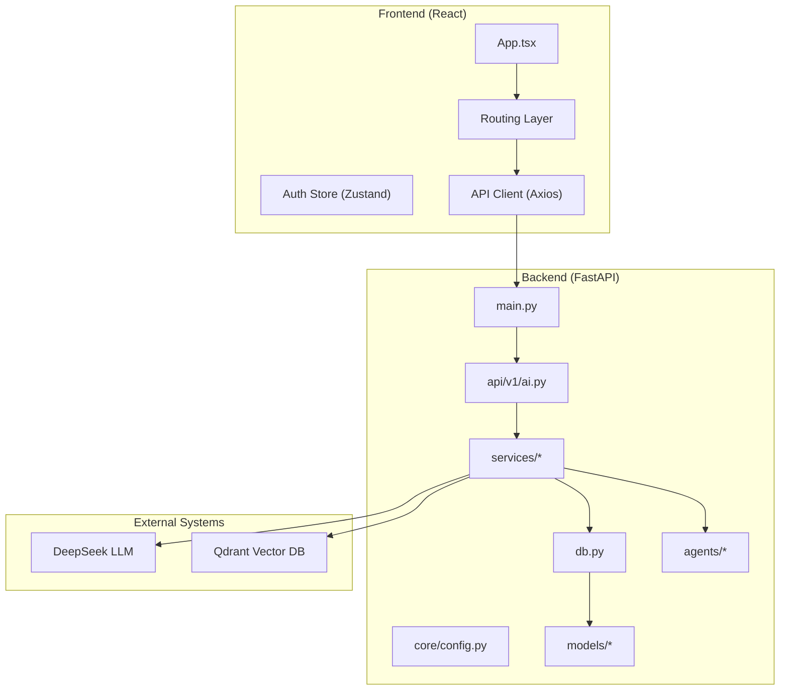
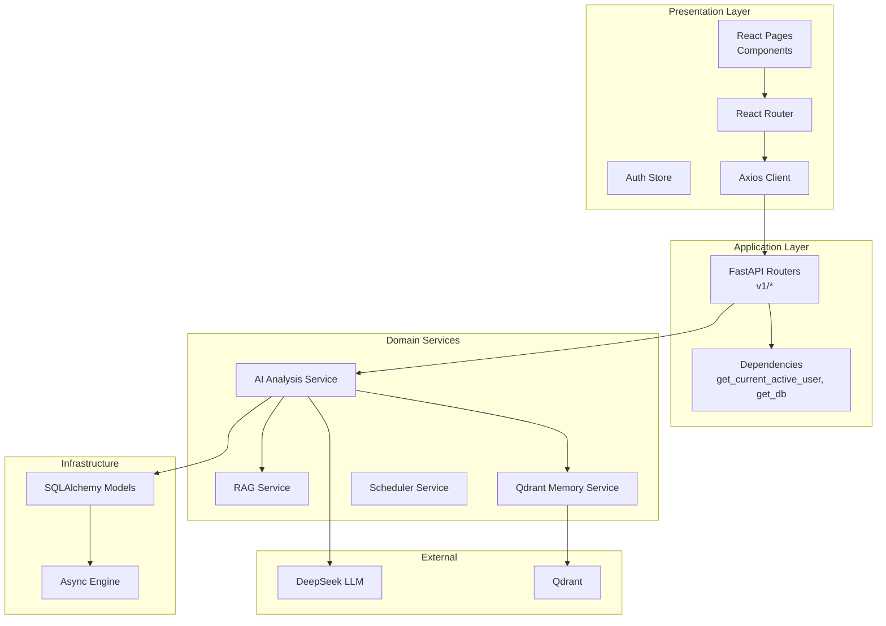
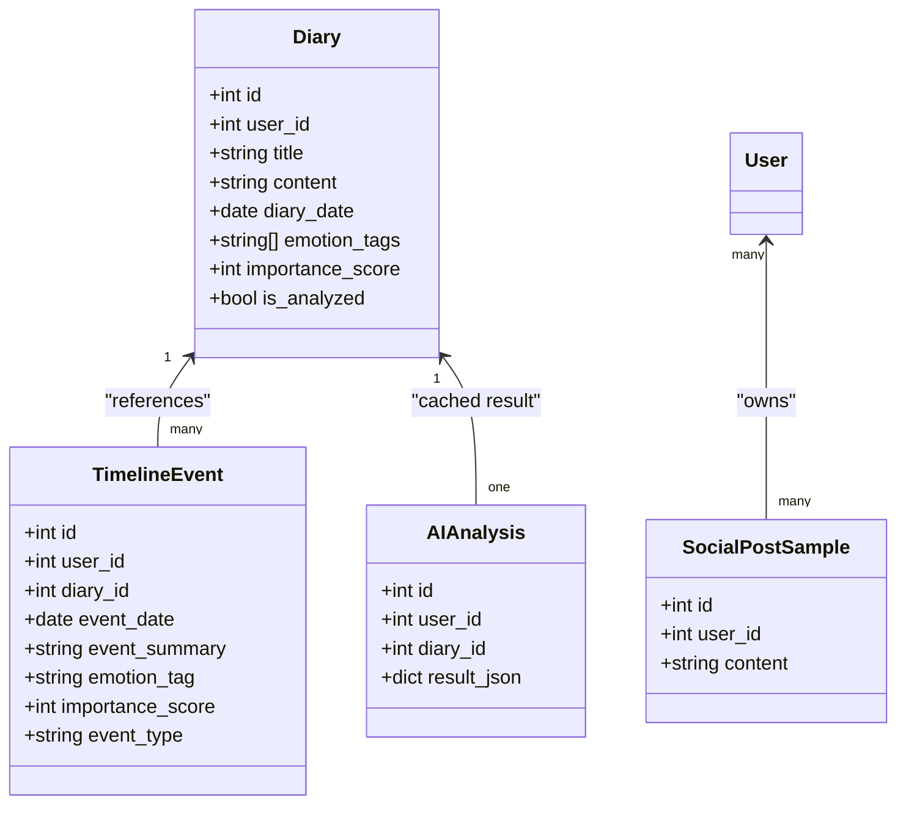
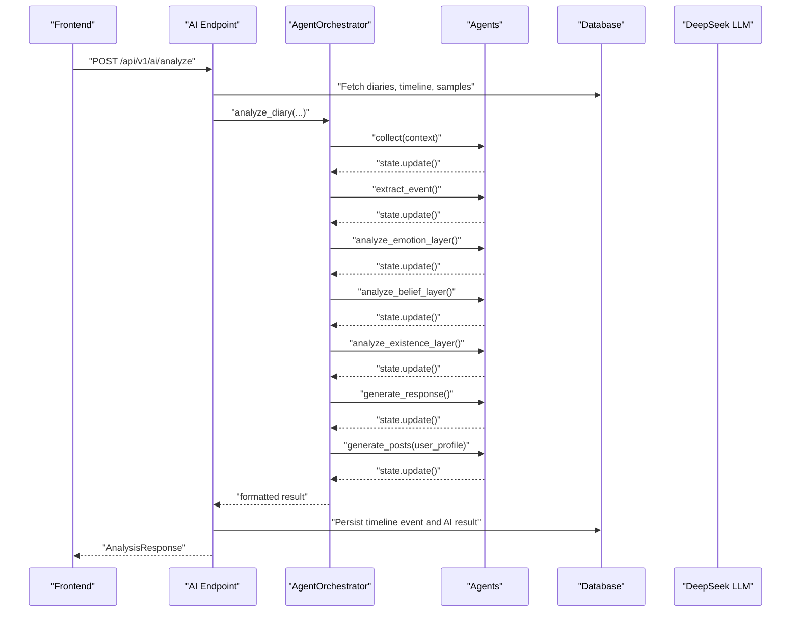
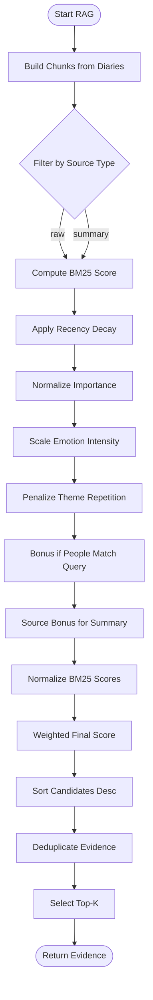
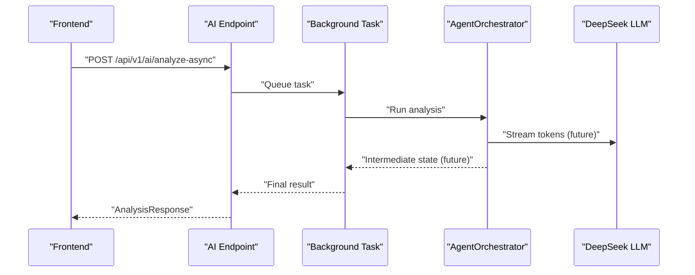
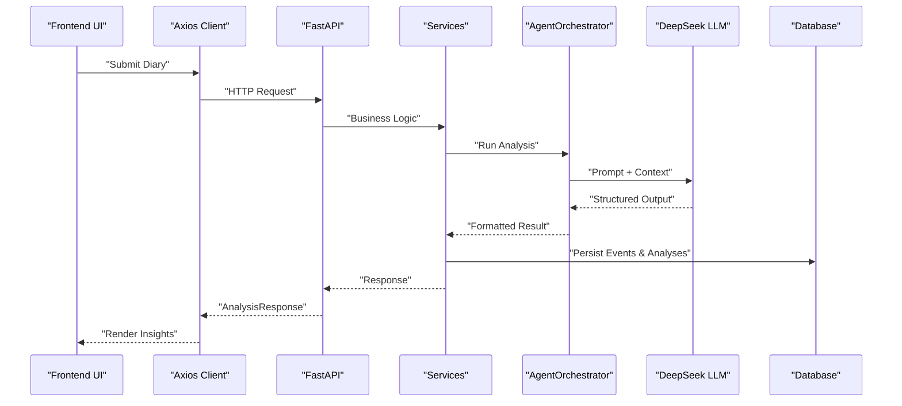
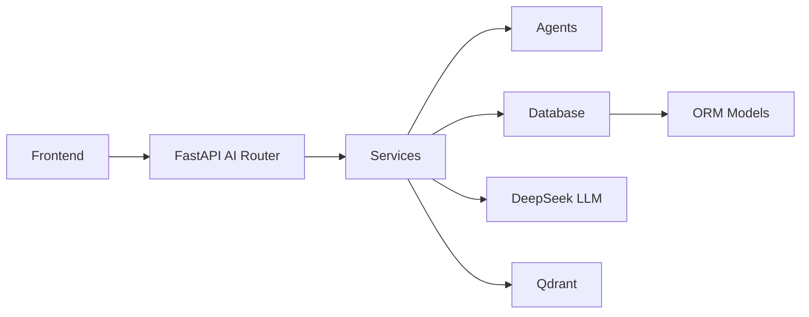

# System Architecture Overview

<cite>
**Referenced Files in This Document**
- [backend/main.py](file://backend/main.py)
- [backend/app/db.py](file://backend/app/db.py)
- [backend/app/core/config.py](file://backend/app/core/config.py)
- [backend/app/api/v1/ai.py](file://backend/app/api/v1/ai.py)
- [backend/app/services/rag_service.py](file://backend/app/services/rag_service.py)
- [backend/app/services/qdrant_memory_service.py](file://backend/app/services/qdrant_memory_service.py)
- [backend/app/models/diary.py](file://backend/app/models/diary.py)
- [backend/app/agents/orchestrator.py](file://backend/app/agents/orchestrator.py)
- [backend/app/agents/state.py](file://backend/app/agents/state.py)
- [frontend/src/App.tsx](file://frontend/src/App.tsx)
- [frontend/src/services/api.ts](file://frontend/src/services/api.ts)
- [frontend/src/store/authStore.ts](file://frontend/src/store/authStore.ts)
</cite>

## Table of Contents
1. [Introduction](#introduction)
2. [Project Structure](#project-structure)
3. [Core Components](#core-components)
4. [Architecture Overview](#architecture-overview)
5. [Detailed Component Analysis](#detailed-component-analysis)
6. [Dependency Analysis](#dependency-analysis)
7. [Performance Considerations](#performance-considerations)
8. [Troubleshooting Guide](#troubleshooting-guide)
9. [Conclusion](#conclusion)

## Introduction
This document presents a comprehensive system architecture overview for the Yinyin Ji (Yinji) project. It explains how the frontend React application, backend FastAPI server, AI processing layer, and database systems collaborate to deliver intelligent diary analysis, visualization, and personal growth insights. The system follows a clean architecture pattern with clear separation of concerns across models, services, API layers, and agents. It also documents the data flow from user input through AI processing to visualization outputs, the multi-agent orchestration, Retrieval-Augmented Generation (RAG) implementation, and the real-time streaming architecture.

## Project Structure
The system is organized into two primary layers:
- Frontend: A React application with TypeScript, routing, state management, and service clients.
- Backend: A FastAPI application implementing clean architecture with models, services, API routers, and agents.

**Diagram sources**
- [backend/main.py:42-87](file://backend/main.py#L42-L87)
- [backend/app/core/config.py:10-105](file://backend/app/core/config.py#L10-L105)
- [backend/app/db.py:11-59](file://backend/app/db.py#L11-L59)
- [backend/app/api/v1/ai.py:31-31](file://backend/app/api/v1/ai.py#L31-L31)
- [backend/app/services/rag_service.py:147-360](file://backend/app/services/rag_service.py#L147-L360)
- [backend/app/services/qdrant_memory_service.py:45-190](file://backend/app/services/qdrant_memory_service.py#L45-L190)
- [backend/app/models/diary.py:29-186](file://backend/app/models/diary.py#L29-L186)
- [frontend/src/App.tsx:61-242](file://frontend/src/App.tsx#L61-L242)
- [frontend/src/services/api.ts:1-43](file://frontend/src/services/api.ts#L1-L43)
- [frontend/src/store/authStore.ts:23-146](file://frontend/src/store/authStore.ts#L23-L146)

**Section sources**
- [backend/main.py:42-87](file://backend/main.py#L42-L87)
- [frontend/src/App.tsx:61-242](file://frontend/src/App.tsx#L61-L242)

## Core Components
- Frontend React Application
  - Routing with private/public route guards and lazy-loaded pages.
  - Authentication state management with persistent storage.
  - HTTP client configured with interceptors for token injection and error handling.
- Backend FastAPI Application
  - Central application lifecycle with database initialization and scheduled tasks.
  - CORS configuration and static file serving for uploads.
  - Modular API routers under a versioned namespace.
- Clean Architecture Layers
  - Models: SQLAlchemy declarative base and ORM models for diaries, timelines, AI analyses, and social samples.
  - Services: Business logic for diary operations, RAG retrieval, Qdrant memory synchronization, and scheduler tasks.
  - API Layer: Versioned endpoints for authentication, diaries, AI analysis, users, and community.
  - Agents: Multi-agent orchestration coordinating context collection, timeline extraction, Satir therapy analysis, and social content generation.
- AI Processing Layer
  - RAG service implementing chunking, BM25-like scoring, recency weighting, and deduplication.
  - Qdrant memory service for vector indexing and retrieval.
  - Orchestrator coordinating specialized agents with structured state management.
- Database Systems
  - Asynchronous SQLAlchemy engine supporting SQLite and PostgreSQL.
  - Model-driven schema creation and persistence of diary entries, timeline events, AI analyses, and social samples.

**Section sources**
- [backend/app/db.py:11-59](file://backend/app/db.py#L11-L59)
- [backend/app/models/diary.py:29-186](file://backend/app/models/diary.py#L29-L186)
- [backend/app/services/rag_service.py:147-360](file://backend/app/services/rag_service.py#L147-L360)
- [backend/app/services/qdrant_memory_service.py:45-190](file://backend/app/services/qdrant_memory_service.py#L45-L190)
- [backend/app/agents/orchestrator.py:18-176](file://backend/app/agents/orchestrator.py#L18-L176)
- [backend/app/agents/state.py:10-45](file://backend/app/agents/state.py#L10-L45)

## Architecture Overview
The system adheres to a layered clean architecture:
- Presentation Layer (Frontend): Handles UI rendering, routing, and user interactions.
- Application Layer (Backend API): Exposes REST endpoints, validates requests, and coordinates workflows.
- Domain Services (Backend Services): Implements business logic, integrates external LLM and vector databases, and manages persistence.
- Infrastructure (Models and DB): Provides ORM models and asynchronous database connectivity.

**Diagram sources**
- [backend/app/api/v1/ai.py:31-31](file://backend/app/api/v1/ai.py#L31-L31)
- [backend/app/services/rag_service.py:147-360](file://backend/app/services/rag_service.py#L147-L360)
- [backend/app/services/qdrant_memory_service.py:45-190](file://backend/app/services/qdrant_memory_service.py#L45-L190)
- [backend/app/db.py:11-59](file://backend/app/db.py#L11-L59)
- [backend/app/models/diary.py:29-186](file://backend/app/models/diary.py#L29-L186)
- [frontend/src/App.tsx:61-242](file://frontend/src/App.tsx#L61-L242)
- [frontend/src/services/api.ts:1-43](file://frontend/src/services/api.ts#L1-L43)

## Detailed Component Analysis

### Clean Architecture Pattern and Separation of Concerns
- Models: Define domain entities and relationships, enabling persistence and cross-service reuse.
- Services: Encapsulate business logic, coordinate external integrations, and manage data transformations.
- API Layer: Validates inputs, delegates to services, and returns standardized responses.
- Agents: Orchestrate specialized reasoning steps with explicit state transitions.

**Diagram sources**
- [backend/app/models/diary.py:29-186](file://backend/app/models/diary.py#L29-L186)

**Section sources**
- [backend/app/models/diary.py:29-186](file://backend/app/models/diary.py#L29-L186)

### Multi-Agent System Orchestration
The orchestrator coordinates four specialized agents:
- Context Collector Agent: Aggregates user profile and timeline context.
- Timeline Manager Agent: Extracts and structures timeline events from integrated content.
- Satir Therapist Agent: Performs five-layer analysis (behavior, emotion, cognition, beliefs, core self) and generates therapeutic responses.
- Social Content Creator Agent: Produces social media posts aligned with user style samples.

**Diagram sources**
- [backend/app/api/v1/ai.py:406-638](file://backend/app/api/v1/ai.py#L406-L638)
- [backend/app/agents/orchestrator.py:27-131](file://backend/app/agents/orchestrator.py#L27-L131)
- [backend/app/agents/state.py:10-45](file://backend/app/agents/state.py#L10-L45)

**Section sources**
- [backend/app/agents/orchestrator.py:18-176](file://backend/app/agents/orchestrator.py#L18-L176)
- [backend/app/agents/state.py:10-45](file://backend/app/agents/state.py#L10-L45)

### RAG Implementation Architecture
The RAG pipeline transforms user diaries into retrievable chunks, computes hybrid scores, and deduplicates evidence:
- Chunking: Splits content into overlapping segments and builds daily summaries.
- Scoring: Computes BM25-like lexical similarity, recency decay, importance, emotion intensity, repetition penalty, people hit bonus, and source bonus.
- Retrieval: Returns top-k candidates per reason category, then deduplicates across reasons and diaries.

**Diagram sources**
- [backend/app/services/rag_service.py:147-360](file://backend/app/services/rag_service.py#L147-L360)

**Section sources**
- [backend/app/services/rag_service.py:147-360](file://backend/app/services/rag_service.py#L147-L360)

### Real-Time Streaming Architecture
While the current implementation primarily supports synchronous analysis, the architecture supports asynchronous execution patterns:
- Background Tasks: The AI endpoint accepts background tasks and currently executes synchronously; production deployments can integrate Celery or similar systems.
- Streaming Considerations: The LLM client and orchestrator can be extended to emit incremental tokens or intermediate states for streaming UI updates.

**Diagram sources**
- [backend/app/api/v1/ai.py:641-658](file://backend/app/api/v1/ai.py#L641-L658)
- [backend/app/agents/orchestrator.py:27-131](file://backend/app/agents/orchestrator.py#L27-L131)

**Section sources**
- [backend/app/api/v1/ai.py:641-658](file://backend/app/api/v1/ai.py#L641-L658)

### Data Flow Architecture
End-to-end data flow from user input to visualization:
- Frontend collects user input (diary content, preferences) and sends requests via Axios to FastAPI endpoints.
- Backend validates requests, fetches contextual data (diaries, timeline, samples), and triggers the orchestrator.
- The orchestrator coordinates agents, which interact with the LLM and optionally Qdrant for memory retrieval.
- Results are persisted to the database and returned to the frontend for rendering.

**Diagram sources**
- [frontend/src/services/api.ts:1-43](file://frontend/src/services/api.ts#L1-L43)
- [backend/app/api/v1/ai.py:406-638](file://backend/app/api/v1/ai.py#L406-L638)
- [backend/app/agents/orchestrator.py:27-131](file://backend/app/agents/orchestrator.py#L27-L131)
- [backend/app/db.py:31-59](file://backend/app/db.py#L31-L59)

**Section sources**
- [frontend/src/services/api.ts:1-43](file://frontend/src/services/api.ts#L1-L43)
- [backend/app/api/v1/ai.py:406-638](file://backend/app/api/v1/ai.py#L406-L638)

## Dependency Analysis
The backend exhibits strong cohesion within layers and controlled coupling:
- API depends on services and agents via dependency injection and shared schemas.
- Services depend on models for persistence and on external systems for LLM and vector retrieval.
- Agents encapsulate orchestration logic and state transitions, minimizing coupling to API internals.
- Frontend depends on backend APIs and maintains minimal internal state through stores.

**Diagram sources**
- [backend/app/api/v1/ai.py:31-31](file://backend/app/api/v1/ai.py#L31-L31)
- [backend/app/services/rag_service.py:147-360](file://backend/app/services/rag_service.py#L147-L360)
- [backend/app/services/qdrant_memory_service.py:45-190](file://backend/app/services/qdrant_memory_service.py#L45-L190)
- [backend/app/models/diary.py:29-186](file://backend/app/models/diary.py#L29-L186)

**Section sources**
- [backend/app/api/v1/ai.py:31-31](file://backend/app/api/v1/ai.py#L31-L31)
- [backend/app/services/rag_service.py:147-360](file://backend/app/services/rag_service.py#L147-L360)
- [backend/app/services/qdrant_memory_service.py:45-190](file://backend/app/services/qdrant_memory_service.py#L45-L190)
- [backend/app/models/diary.py:29-186](file://backend/app/models/diary.py#L29-L186)

## Performance Considerations
- Asynchronous I/O: Use of async SQLAlchemy sessions and HTTP clients minimizes blocking during I/O-bound operations.
- RAG Efficiency: Hybrid scoring and deduplication reduce redundant retrievals; consider caching frequent queries and precomputing embeddings for high-frequency users.
- Vector Indexing: Ensure Qdrant collection exists and vectors are synchronized; batch upserts and tune dimensionality and distance metrics.
- Agent Parallelization: Where safe, parallelize independent agent steps to reduce latency while preserving state consistency.
- Frontend Responsiveness: Lazy-load heavy components and leverage pagination for long lists to maintain smooth UX.

## Troubleshooting Guide
Common issues and resolutions:
- Authentication Failures: Verify token presence and validity; the Axios interceptor clears invalid tokens and redirects to the welcome page.
- Database Initialization: Confirm database URL and permissions; the application initializes tables on startup.
- LLM Connectivity: Validate API keys and base URLs; ensure network access to the LLM provider.
- Vector DB Sync: Check Qdrant URL, API key, and collection configuration; ensure user diaries are synced before retrieval.
- CORS Errors: Confirm allowed origins and headers in configuration.

**Section sources**
- [frontend/src/services/api.ts:14-40](file://frontend/src/services/api.ts#L14-L40)
- [backend/app/core/config.py:17-100](file://backend/app/core/config.py#L17-L100)
- [backend/app/db.py:45-59](file://backend/app/db.py#L45-L59)
- [backend/app/services/qdrant_memory_service.py:62-84](file://backend/app/services/qdrant_memory_service.py#L62-L84)

## Conclusion
The Yinyin Ji project demonstrates a robust, layered architecture that cleanly separates presentation, application, domain, and infrastructure concerns. The multi-agent AI system, RAG pipeline, and modular services enable scalable and extensible capabilities for intelligent diary analysis and personal growth insights. By leveraging asynchronous patterns, external LLM and vector databases, and a reactive frontend, the system delivers a responsive and insightful user experience.