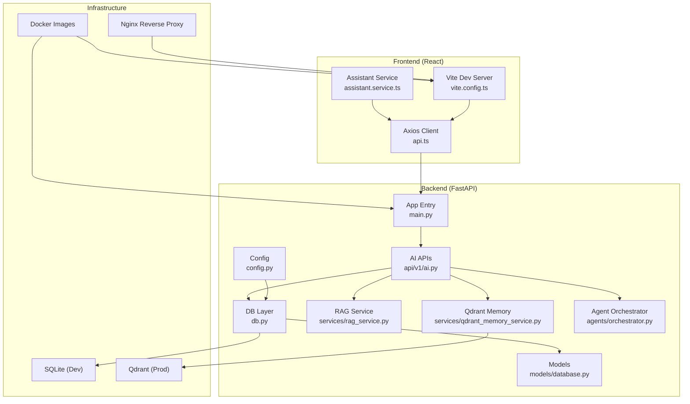
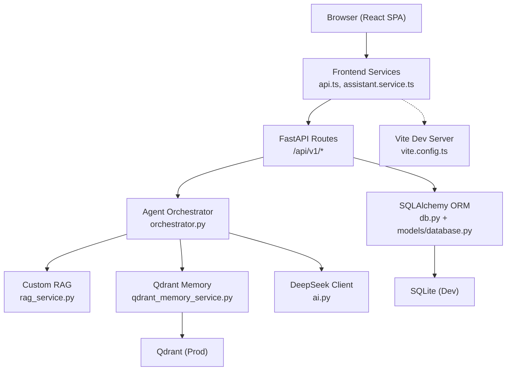
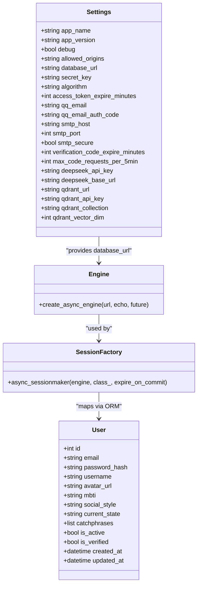
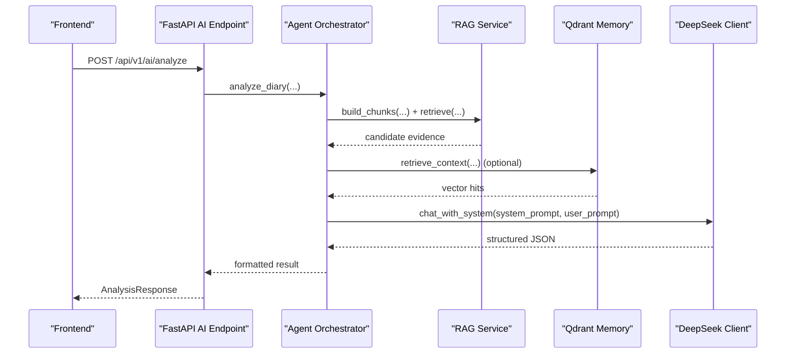
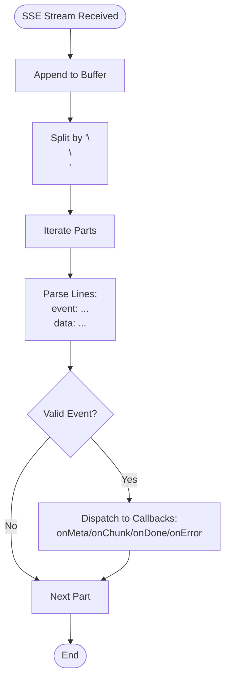
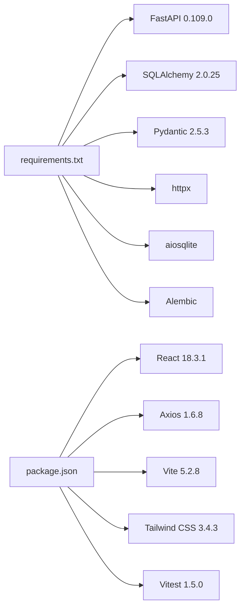

# Technology Stack

<cite>
**Referenced Files in This Document**
- [requirements.txt](file://backend/requirements.txt)
- [main.py](file://backend/main.py)
- [config.py](file://backend/app/core/config.py)
- [db.py](file://backend/app/db.py)
- [database.py](file://backend/app/models/database.py)
- [rag_service.py](file://backend/app/services/rag_service.py)
- [qdrant_memory_service.py](file://backend/app/services/qdrant_memory_service.py)
- [ai.py](file://backend/app/api/v1/ai.py)
- [orchestrator.py](file://backend/app/agents/orchestrator.py)
- [package.json](file://frontend/package.json)
- [vite.config.ts](file://frontend/vite.config.ts)
- [api.ts](file://frontend/src/services/api.ts)
- [assistant.service.ts](file://frontend/src/services/assistant.service.ts)
- [DEPLOY.md](file://DEPLOY.md)
- [pytest.ini](file://backend/pytest.ini)
- [conftest.py](file://backend/tests/conftest.py)
</cite>

## Table of Contents
1. [Introduction](#introduction)
2. [Project Structure](#project-structure)
3. [Core Components](#core-components)
4. [Architecture Overview](#architecture-overview)
5. [Detailed Component Analysis](#detailed-component-analysis)
6. [Dependency Analysis](#dependency-analysis)
7. [Performance Considerations](#performance-considerations)
8. [Troubleshooting Guide](#troubleshooting-guide)
9. [Conclusion](#conclusion)

## Introduction
This document presents the complete technology stack for the Yinji (映记) smart diary application. It covers backend technologies (Python 3.9+, FastAPI 0.109.0, SQLAlchemy 2.0.25, Pydantic 2.5.3), frontend technologies (TypeScript/JavaScript, React 18.3.1, Vite, Tailwind CSS), AI integration components (DeepSeek API, custom RAG implementation, Qdrant vector database), database technologies (SQLite for development, Qdrant for production), real-time communication (SSE streaming), and deployment technologies (Docker, Nginx). It also documents development tools, build processes, and testing frameworks used throughout the project.

## Project Structure
The project follows a clear separation of concerns:
- Backend: Python FastAPI application with asynchronous SQLAlchemy ORM, AI orchestration, and AI analysis APIs.
- Frontend: React 18.3.1 SPA built with Vite, styled with Tailwind CSS, consuming the backend via Axios.
- AI and Memory: Custom lightweight RAG service and optional Qdrant vector memory for retrieval.
- Deployment: Dockerized backend and Nginx-based frontend serving, with systemd and manual deployment options.

**Diagram sources**
- [main.py:42-87](file://backend/main.py#L42-L87)
- [config.py:22-88](file://backend/app/core/config.py#L22-L88)
- [db.py:11-23](file://backend/app/db.py#L11-L23)
- [database.py:13-44](file://backend/app/models/database.py#L13-L44)
- [ai.py:31-31](file://backend/app/api/v1/ai.py#L31-L31)
- [rag_service.py:147-360](file://backend/app/services/rag_service.py#L147-L360)
- [qdrant_memory_service.py:45-188](file://backend/app/services/qdrant_memory_service.py#L45-L188)
- [orchestrator.py:18-175](file://backend/app/agents/orchestrator.py#L18-L175)
- [api.ts:1-43](file://frontend/src/services/api.ts#L1-L43)
- [assistant.service.ts:99-126](file://frontend/src/services/assistant.service.ts#L99-L126)
- [vite.config.ts:1-27](file://frontend/vite.config.ts#L1-L27)
- [DEPLOY.md:75-136](file://DEPLOY.md#L75-L136)

**Section sources**
- [main.py:42-119](file://backend/main.py#L42-L119)
- [config.py:22-88](file://backend/app/core/config.py#L22-L88)
- [db.py:11-59](file://backend/app/db.py#L11-L59)
- [database.py:13-70](file://backend/app/models/database.py#L13-L70)
- [ai.py:31-404](file://backend/app/api/v1/ai.py#L31-L404)
- [rag_service.py:147-360](file://backend/app/services/rag_service.py#L147-L360)
- [qdrant_memory_service.py:45-188](file://backend/app/services/qdrant_memory_service.py#L45-L188)
- [orchestrator.py:18-175](file://backend/app/agents/orchestrator.py#L18-L175)
- [package.json:1-54](file://frontend/package.json#L1-L54)
- [vite.config.ts:1-27](file://frontend/vite.config.ts#L1-L27)
- [api.ts:1-43](file://frontend/src/services/api.ts#L1-L43)
- [assistant.service.ts:99-126](file://frontend/src/services/assistant.service.ts#L99-L126)
- [DEPLOY.md:75-136](file://DEPLOY.md#L75-L136)

## Core Components
- Backend web framework and runtime
  - FastAPI 0.109.0 with Uvicorn for ASGI server.
  - CORS middleware configured via settings.
  - Static file mounting for uploads.
- Database and ORM
  - SQLAlchemy 2.0.25 with async engine and session factory.
  - SQLite by default for development; PostgreSQL-compatible engine supported.
  - Alembic migrations included.
- Authentication and security
  - Pydantic 2.5.3 for schema validation.
  - python-jose for JWT cryptography, passlib bcrypt for password hashing.
  - python-dotenv and pydantic-settings for environment-driven configuration.
- HTTP client and utilities
  - httpx for async HTTP requests to external services (Qdrant).
  - python-multipart for multipart form parsing.
- Frontend toolchain
  - React 18.3.1 with TypeScript.
  - Vite 5.2.8 for dev/build.
  - Tailwind CSS 3.4.3 with PostCSS 8.4.38.
  - Axios 1.6.8 for API calls.
- AI and memory
  - DeepSeek API integration for LLM chat.
  - Custom lightweight RAG service for diary retrieval.
  - Optional Qdrant vector database for scalable embedding retrieval.
- Testing and development
  - Pytest with asyncio mode and markers.
  - Vitest for frontend unit tests.

**Section sources**
- [requirements.txt:1-26](file://backend/requirements.txt#L1-L26)
- [main.py:42-87](file://backend/main.py#L42-L87)
- [config.py:10-95](file://backend/app/core/config.py#L10-L95)
- [db.py:11-59](file://backend/app/db.py#L11-L59)
- [package.json:14-52](file://frontend/package.json#L14-L52)
- [ai.py:22-30](file://backend/app/api/v1/ai.py#L22-L30)
- [rag_service.py:147-360](file://backend/app/services/rag_service.py#L147-L360)
- [qdrant_memory_service.py:45-188](file://backend/app/services/qdrant_memory_service.py#L45-L188)
- [pytest.ini:1-28](file://backend/pytest.ini#L1-L28)
- [conftest.py:15-29](file://backend/tests/conftest.py#L15-L29)

## Architecture Overview
The system is a full-stack web application with a FastAPI backend exposing REST APIs consumed by a React frontend. AI analysis leverages a custom agent orchestrator and optional Qdrant-backed retrieval. Data persistence uses an async SQLAlchemy engine with SQLite in development and Qdrant for production-grade vector storage.

**Diagram sources**
- [main.py:59-87](file://backend/main.py#L59-L87)
- [ai.py:31-404](file://backend/app/api/v1/ai.py#L31-L404)
- [orchestrator.py:18-175](file://backend/app/agents/orchestrator.py#L18-L175)
- [rag_service.py:147-360](file://backend/app/services/rag_service.py#L147-L360)
- [qdrant_memory_service.py:45-188](file://backend/app/services/qdrant_memory_service.py#L45-L188)
- [db.py:11-59](file://backend/app/db.py#L11-L59)
- [database.py:13-70](file://backend/app/models/database.py#L13-L70)
- [api.ts:1-43](file://frontend/src/services/api.ts#L1-L43)
- [assistant.service.ts:99-126](file://frontend/src/services/assistant.service.ts#L99-L126)
- [vite.config.ts:1-27](file://frontend/vite.config.ts#L1-L27)

## Detailed Component Analysis

### Backend Technologies
- FastAPI application lifecycle and routing
  - Application startup initializes the database and schedules daily tasks.
  - CORS configured from settings; routes mounted under /api/v1 for auth, diaries, AI, users, community, and assistant.
  - Health check endpoint exposed.
- Configuration management
  - Environment-driven settings via pydantic-settings, including database URL, JWT secrets, SMTP credentials, DeepSeek API keys, and Qdrant configuration.
- Database layer
  - Async engine creation and session factory; dependency-injected sessions; table initialization on startup.
  - Model definitions for users, verification codes, and other domain entities.
- AI and agent orchestration
  - Agent orchestrator coordinates multiple specialized agents for context collection, timeline extraction, Satir analysis, and social content generation.
  - AI endpoints support title suggestions, daily guidance, comprehensive analysis, and social post generation.

**Diagram sources**
- [config.py:10-95](file://backend/app/core/config.py#L10-L95)
- [db.py:11-23](file://backend/app/db.py#L11-L23)
- [database.py:13-44](file://backend/app/models/database.py#L13-L44)

**Section sources**
- [main.py:19-40](file://backend/main.py#L19-L40)
- [config.py:10-105](file://backend/app/core/config.py#L10-L105)
- [db.py:11-59](file://backend/app/db.py#L11-L59)
- [database.py:13-70](file://backend/app/models/database.py#L13-L70)

### AI Integration Components
- DeepSeek API integration
  - Chat completions invoked from AI endpoints; JSON-safe parsing and fallback mechanisms.
- Custom RAG implementation
  - Lightweight chunking, tokenization, BM25-like scoring, recency weighting, importance/emotion penalties, and deduplication.
- Qdrant vector database
  - Optional embedding synchronization and search; collection ensured on demand; cosine distance vectors.
- Agent orchestration
  - Multi-step workflow: context collection → timeline extraction → Satir layers → therapeutic response → social posts.

**Diagram sources**
- [ai.py:267-404](file://backend/app/api/v1/ai.py#L267-L404)
- [orchestrator.py:27-131](file://backend/app/agents/orchestrator.py#L27-L131)
- [rag_service.py:147-360](file://backend/app/services/rag_service.py#L147-L360)
- [qdrant_memory_service.py:175-188](file://backend/app/services/qdrant_memory_service.py#L175-L188)

**Section sources**
- [ai.py:83-207](file://backend/app/api/v1/ai.py#L83-L207)
- [rag_service.py:147-360](file://backend/app/services/rag_service.py#L147-L360)
- [qdrant_memory_service.py:45-188](file://backend/app/services/qdrant_memory_service.py#L45-L188)
- [orchestrator.py:18-175](file://backend/app/agents/orchestrator.py#L18-L175)

### Real-Time Communication (SSE)
- Frontend SSE parsing
  - Assistant service streams server-sent events with structured event names and data payloads.
  - Supports meta, chunk, done, and error events.

**Diagram sources**
- [assistant.service.ts:99-126](file://frontend/src/services/assistant.service.ts#L99-L126)

**Section sources**
- [assistant.service.ts:99-126](file://frontend/src/services/assistant.service.ts#L99-L126)

### Database Technologies
- Development vs Production
  - SQLite default via aiosqlite for local development.
  - Qdrant for production-grade vector retrieval and embedding storage.
- ORM and models
  - SQLAlchemy declarative base with async sessions; models for users, verification codes, diaries, timelines, and AI analyses.

**Section sources**
- [config.py:22-26](file://backend/app/core/config.py#L22-L26)
- [db.py:11-59](file://backend/app/db.py#L11-L59)
- [database.py:13-70](file://backend/app/models/database.py#L13-L70)

### Frontend Technologies
- Build and tooling
  - Vite dev server with React plugin and proxy for /api and /uploads.
  - Tailwind CSS with PostCSS; TypeScript strictness.
- Runtime
  - Axios client with request/response interceptors for auth token injection and 401 handling.
- UI libraries and state
  - React Router, Zustand, TanStack React Query, Radix UI primitives, Recharts, Lexical editor.

**Section sources**
- [package.json:6-52](file://frontend/package.json#L6-L52)
- [vite.config.ts:1-27](file://frontend/vite.config.ts#L1-L27)
- [api.ts:1-43](file://frontend/src/services/api.ts#L1-L43)

### Deployment Technologies
- Dockerized deployment
  - Separate Dockerfiles for backend (Python 3.9 slim) and frontend (Node 18 Alpine + Nginx).
  - docker-compose orchestrates backend, frontend, and volume mounts for SQLite.
- Manual deployment
  - systemd service for backend, Nginx site configuration for reverse proxy.
- HTTPS and updates
  - Certbot automation and update script for Git-based deployments.

**Section sources**
- [DEPLOY.md:75-136](file://DEPLOY.md#L75-L136)
- [DEPLOY.md:151-263](file://DEPLOY.md#L151-L263)
- [DEPLOY.md:265-276](file://DEPLOY.md#L265-L276)
- [DEPLOY.md:278-316](file://DEPLOY.md#L278-L316)

### Testing Frameworks
- Backend
  - Pytest configuration with asyncio mode, custom markers, and test discovery settings.
- Frontend
  - Vitest configured via package.json scripts.

**Section sources**
- [pytest.ini:1-28](file://backend/pytest.ini#L1-L28)
- [conftest.py:15-29](file://backend/tests/conftest.py#L15-L29)
- [package.json:10-12](file://frontend/package.json#L10-L12)

## Dependency Analysis
- Backend dependencies pinned in requirements.txt include FastAPI, SQLAlchemy 2.0.25, Pydantic 2.5.3, httpx, aiosqlite, alembic, and others.
- Frontend dependencies include React, Tailwind, Axios, Vitest, and ESLint tooling.
- AI and memory services depend on httpx for HTTP operations and SQLAlchemy for database access.

**Diagram sources**
- [requirements.txt:1-26](file://backend/requirements.txt#L1-L26)
- [package.json:14-52](file://frontend/package.json#L14-L52)

**Section sources**
- [requirements.txt:1-26](file://backend/requirements.txt#L1-L26)
- [package.json:14-52](file://frontend/package.json#L14-L52)

## Performance Considerations
- Asynchronous I/O
  - SQLAlchemy async engine and httpx ensure non-blocking IO for database and external API calls.
- Vector retrieval
  - Qdrant memory service uses cosine distance vectors and filters by user ID; ensure dimension alignment with embedding function.
- RAG scoring
  - BM25 normalization and weighted combination of recency, importance, emotion intensity, repetition, and people hit improve relevance.
- Streaming
  - SSE streaming reduces latency for long-running AI responses; ensure client-side buffering and event parsing robustness.

[No sources needed since this section provides general guidance]

## Troubleshooting Guide
- Backend startup and database
  - Verify database URL and permissions; ensure SQLite file exists or initialize schema.
- CORS and proxy
  - Confirm allowed origins and Vite proxy targets for /api and /uploads.
- Qdrant connectivity
  - Check URL, API key, and collection existence; ensure vector dimension matches embedding function.
- Authentication
  - Validate JWT secret and token expiration; inspect interceptor behavior for 401 handling.
- Deployment
  - Use docker-compose logs and systemd journal for diagnostics; verify Nginx configuration and SSL certificate.

**Section sources**
- [config.py:22-88](file://backend/app/core/config.py#L22-L88)
- [db.py:45-59](file://backend/app/db.py#L45-L59)
- [qdrant_memory_service.py:62-84](file://backend/app/services/qdrant_memory_service.py#L62-L84)
- [vite.config.ts:15-24](file://frontend/vite.config.ts#L15-L24)
- [api.ts:14-40](file://frontend/src/services/api.ts#L14-L40)
- [DEPLOY.md:318-388](file://DEPLOY.md#L318-L388)

## Conclusion
The Yinji application employs a modern, modular full-stack architecture. The backend leverages FastAPI and SQLAlchemy for robust async operations, integrates DeepSeek for AI capabilities, and optionally uses Qdrant for scalable vector retrieval. The frontend is a React SPA powered by Vite and Tailwind, with Axios for API communication and SSE for streaming. The deployment strategy supports both Docker and manual setups, ensuring flexibility across environments.