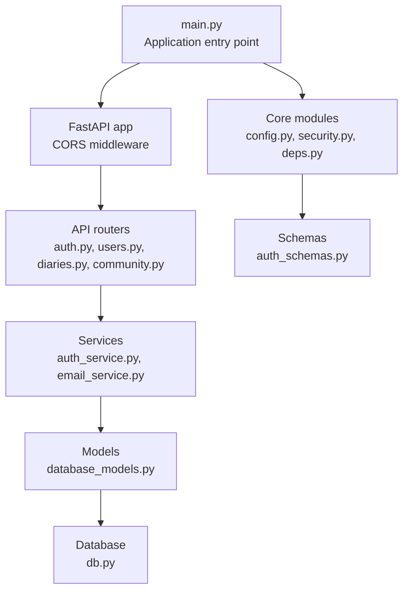
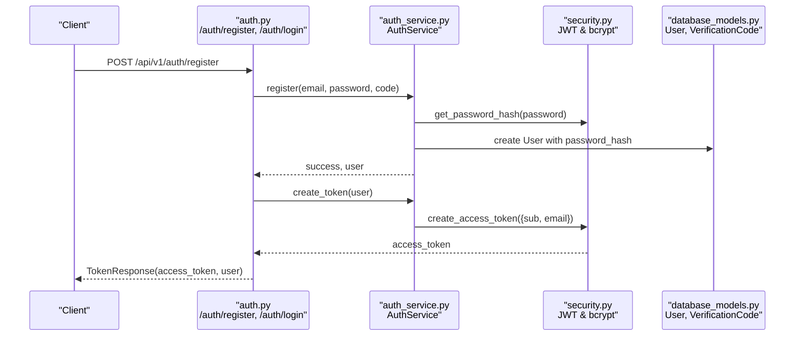
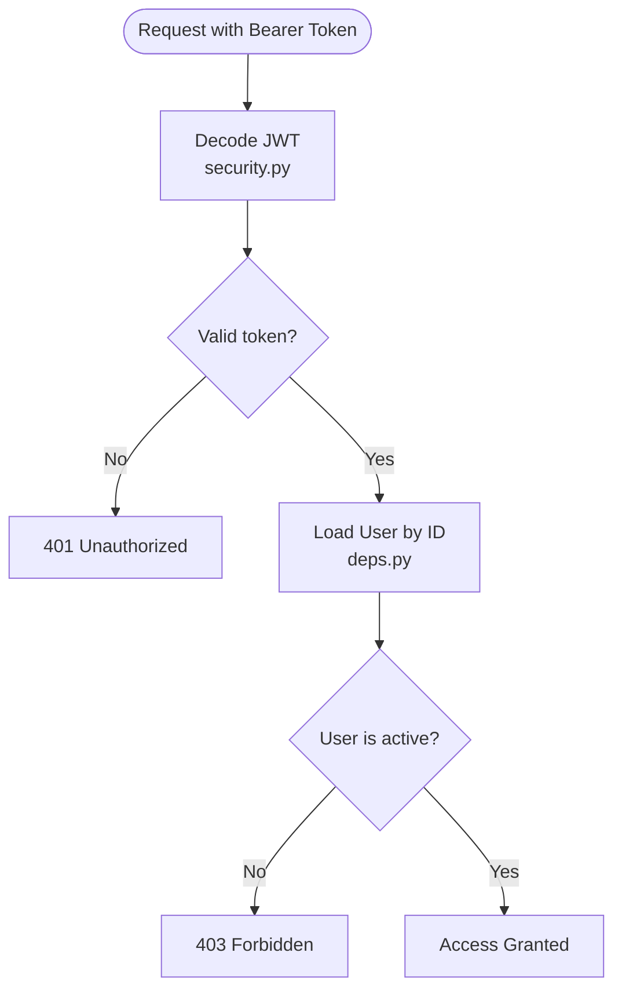
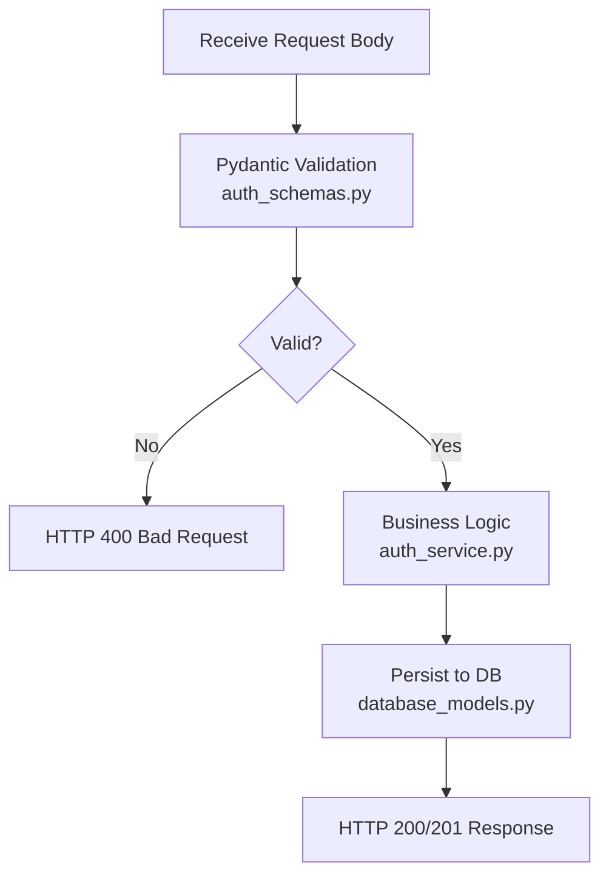
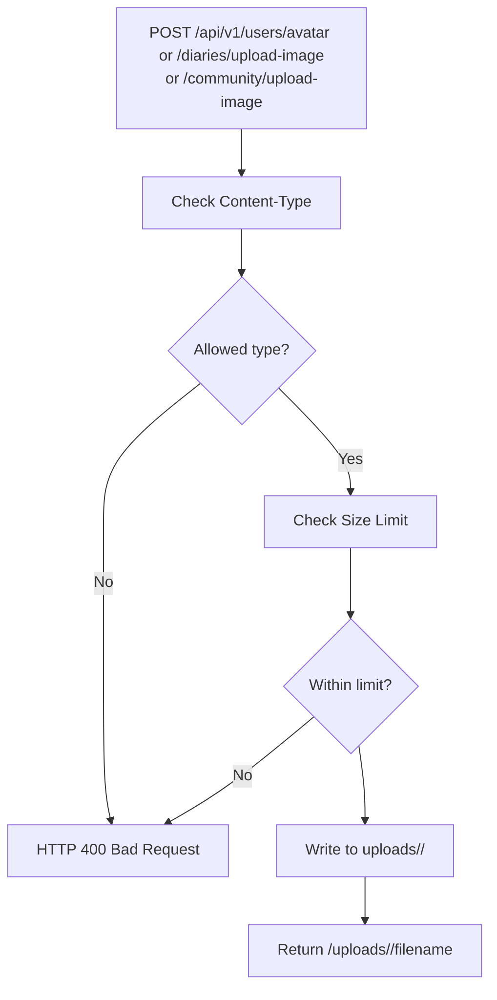
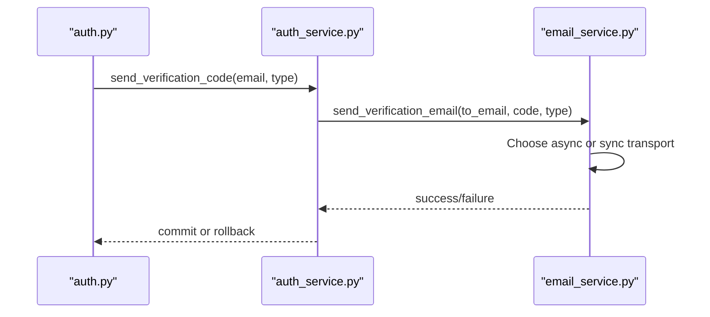
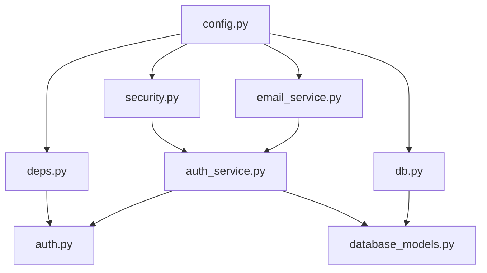

# Security Considerations

<cite>
**Referenced Files in This Document**
- [main.py](file://backend/main.py)
- [config.py](file://backend/app/core/config.py)
- [security.py](file://backend/app/core/security.py)
- [deps.py](file://backend/app/core/deps.py)
- [auth.py](file://backend/app/api/v1/auth.py)
- [auth_service.py](file://backend/app/services/auth_service.py)
- [email_service.py](file://backend/app/services/email_service.py)
- [auth_schemas.py](file://backend/app/schemas/auth.py)
- [database_models.py](file://backend/app/models/database.py)
- [db.py](file://backend/app/db.py)
- [users_api.py](file://backend/app/api/v1/users.py)
- [diaries_api.py](file://backend/app/api/v1/diaries.py)
- [community_api.py](file://backend/app/api/v1/community.py)
- [test_security.py](file://backend/tests/test_security.py)
- [requirements.txt](file://backend/requirements.txt)
- [.windsurfrules](file://backend/.windsurfrules)
</cite>

## Table of Contents
1. [Introduction](#introduction)
2. [Project Structure](#project-structure)
3. [Core Components](#core-components)
4. [Architecture Overview](#architecture-overview)
5. [Detailed Component Analysis](#detailed-component-analysis)
6. [Dependency Analysis](#dependency-analysis)
7. [Performance Considerations](#performance-considerations)
8. [Troubleshooting Guide](#troubleshooting-guide)
9. [Conclusion](#conclusion)
10. [Appendices](#appendices)

## Introduction
This document provides comprehensive security documentation for the Yinji (映记) application. It covers authentication and authorization mechanisms, JWT implementation, password hashing, session management, input validation, SQL injection prevention, XSS protection, CSRF mitigation, file upload security, email service security, API rate limiting, data protection, encryption at rest and in transit, privacy compliance, best practices, vulnerability assessment, incident response, configuration examples, threat modeling, audit guidelines, secure coding practices, dependency security updates, and security monitoring.

## Project Structure
The backend follows a layered architecture with clear separation of concerns:
- Application entry point initializes FastAPI, middleware, and routes.
- Core modules handle configuration, security utilities, and dependency injection.
- API modules define versioned endpoints for authentication, user management, diaries, and community.
- Services encapsulate business logic for authentication, email delivery, and other domain operations.
- Models define SQLAlchemy ORM entities for persistence.
- Tests validate security-critical functionality.

**Diagram sources**
- [main.py:31-76](file://backend/main.py#L31-L76)
- [auth.py:22-22](file://backend/app/api/v1/auth.py#L22-L22)
- [auth_service.py:16-358](file://backend/app/services/auth_service.py#L16-L358)
- [email_service.py:25-226](file://backend/app/services/email_service.py#L25-L226)
- [database_models.py:13-70](file://backend/app/models/database.py#L13-L70)
- [db.py:45-59](file://backend/app/db.py#L45-L59)
- [config.py:10-105](file://backend/app/core/config.py#L10-L105)
- [security.py:1-92](file://backend/app/core/security.py#L1-L92)
- [deps.py:18-102](file://backend/app/core/deps.py#L18-L102)
- [auth_schemas.py:10-106](file://backend/app/schemas/auth.py#L10-L106)

**Section sources**
- [main.py:31-76](file://backend/main.py#L31-L76)
- [config.py:10-105](file://backend/app/core/config.py#L10-L105)

## Core Components
- Authentication and Authorization:
  - JWT-based bearer tokens with HS256 algorithm.
  - Password hashing using bcrypt via passlib.
  - Dependency injection for protected endpoints.
- Email Service:
  - QQ SMTP integration with SSL/TLS support.
  - Asynchronous and synchronous transport fallback.
- Data Validation:
  - Pydantic schemas enforce field constraints and types.
- Database:
  - SQLAlchemy ORM with async engine and session management.
- File Uploads:
  - Content-type whitelisting and size limits per endpoint.

**Section sources**
- [security.py:12-92](file://backend/app/core/security.py#L12-L92)
- [deps.py:18-102](file://backend/app/core/deps.py#L18-L102)
- [auth_service.py:19-358](file://backend/app/services/auth_service.py#L19-L358)
- [email_service.py:25-226](file://backend/app/services/email_service.py#L25-L226)
- [auth_schemas.py:10-106](file://backend/app/schemas/auth.py#L10-L106)
- [database_models.py:13-70](file://backend/app/models/database.py#L13-L70)
- [db.py:11-59](file://backend/app/db.py#L11-L59)

## Architecture Overview
The authentication flow integrates API endpoints, services, and security utilities. The diagram below maps the actual components involved in JWT creation and validation.

**Diagram sources**
- [auth.py:88-125](file://backend/app/api/v1/auth.py#L88-L125)
- [auth_service.py:142-200](file://backend/app/services/auth_service.py#L142-L200)
- [security.py:43-70](file://backend/app/core/security.py#L43-L70)
- [database_models.py:13-41](file://backend/app/models/database.py#L13-L41)

**Section sources**
- [auth.py:88-125](file://backend/app/api/v1/auth.py#L88-L125)
- [auth_service.py:142-200](file://backend/app/services/auth_service.py#L142-L200)
- [security.py:43-70](file://backend/app/core/security.py#L43-L70)

## Detailed Component Analysis

### Authentication and Authorization System
- JWT Implementation:
  - Access tokens are created with expiration and signed using HS256.
  - Tokens are validated centrally via dependency injection.
  - Users must be active; inactive users are rejected.
- Password Hashing:
  - bcrypt-based hashing ensures irreversible password storage.
  - Verification compares plaintext against stored hash.
- Session Management:
  - Stateless JWT bearer tokens; no server-side session storage.
  - Logout is client-side (no server-side revocation).

**Diagram sources**
- [deps.py:18-66](file://backend/app/core/deps.py#L18-L66)
- [security.py:73-92](file://backend/app/core/security.py#L73-L92)

**Section sources**
- [security.py:43-92](file://backend/app/core/security.py#L43-L92)
- [deps.py:18-66](file://backend/app/core/deps.py#L18-L66)
- [auth.py:278-285](file://backend/app/api/v1/auth.py#L278-L285)

### Input Validation and Data Types
- Pydantic schemas enforce:
  - Email format validation.
  - Fixed-length verification codes (6 digits).
  - Minimum/maximum lengths for passwords and optional fields.
- Endpoint handlers validate request bodies and raise appropriate HTTP exceptions.

**Diagram sources**
- [auth_schemas.py:10-96](file://backend/app/schemas/auth.py#L10-L96)
- [auth_service.py:19-98](file://backend/app/services/auth_service.py#L19-L98)
- [database_models.py:13-70](file://backend/app/models/database.py#L13-L70)

**Section sources**
- [auth_schemas.py:10-96](file://backend/app/schemas/auth.py#L10-L96)
- [auth_service.py:19-98](file://backend/app/services/auth_service.py#L19-L98)
- [test_security.py:113-164](file://backend/tests/test_security.py#L113-L164)

### SQL Injection Prevention
- ORM Usage:
  - SQLAlchemy ORM queries prevent raw SQL injection.
  - Parameterized queries via ORM constructs.
- Validation Layer:
  - Pydantic schemas validate inputs before database operations.

**Section sources**
- [auth_service.py:36-98](file://backend/app/services/auth_service.py#L36-L98)
- [database_models.py:13-70](file://backend/app/models/database.py#L13-L70)

### XSS Protection
- Backend does not generate HTML; responses are JSON.
- Frontend rendering occurs in the browser; ensure client-side sanitization and CSP headers if needed.
- No server-side templating detected.

[No sources needed since this section doesn't analyze specific backend files]

### CSRF Mitigation
- Stateless JWT bearer tokens; no CSRF risk for token-based APIs.
- If cookies were used, CSRF tokens would be required; current implementation avoids this vector.

[No sources needed since this section doesn't analyze specific backend files]

### File Upload Security
- Type Whitelisting:
  - Allowed MIME types: image/jpeg, image/png, image/gif, image/webp.
- Size Limits:
  - Avatars: ≤ 2MB.
  - Diary images: ≤ 10MB.
  - Community images: ≤ 10MB.
- Storage:
  - Unique filenames derived from user ID and UUID to prevent collisions.
  - Static file serving via mounted directory.

**Diagram sources**
- [users_api.py:50-102](file://backend/app/api/v1/users.py#L50-L102)
- [diaries_api.py:223-248](file://backend/app/api/v1/diaries.py#L223-L248)
- [community_api.py:160-188](file://backend/app/api/v1/community.py#L160-L188)

**Section sources**
- [users_api.py:50-102](file://backend/app/api/v1/users.py#L50-L102)
- [diaries_api.py:223-248](file://backend/app/api/v1/diaries.py#L223-L248)
- [community_api.py:160-188](file://backend/app/api/v1/community.py#L160-L188)

### Email Service Security
- SMTP Transport:
  - SSL (port 465) or STARTTLS (port 587) based on configuration.
  - Credentials stored in environment variables.
- Resilience:
  - Asynchronous transport preferred; synchronous fallback available.
- Rate Limiting:
  - Built-in frequency checks to limit verification code requests.

**Diagram sources**
- [auth.py:25-53](file://backend/app/api/v1/auth.py#L25-L53)
- [auth_service.py:19-98](file://backend/app/services/auth_service.py#L19-L98)
- [email_service.py:48-155](file://backend/app/services/email_service.py#L48-L155)

**Section sources**
- [email_service.py:25-226](file://backend/app/services/email_service.py#L25-L226)
- [auth_service.py:19-98](file://backend/app/services/auth_service.py#L19-L98)

### API Rate Limiting
- Verification Code Requests:
  - Maximum requests per 5 minutes configurable via settings.
  - Enforced in service layer before sending emails.

**Section sources**
- [auth_service.py:36-51](file://backend/app/services/auth_service.py#L36-L51)
- [config.py:52-60](file://backend/app/core/config.py#L52-L60)

### Data Protection and Encryption
- At Rest:
  - SQLite by default; PostgreSQL recommended for production.
  - Consider database encryption at rest in production deployments.
- In Transit:
  - HTTPS enforced by mounting static files; SMTP configured for SSL/TLS.
  - CORS origins configurable; restrict to trusted domains.

**Section sources**
- [config.py:22-26](file://backend/app/core/config.py#L22-L26)
- [config.py:48-50](file://backend/app/core/config.py#L48-L50)
- [config.py:17-20](file://backend/app/core/config.py#L17-L20)
- [main.py:39-46](file://backend/main.py#L39-L46)

### Privacy Compliance
- Data Minimization:
  - Only necessary fields stored (email, hashed password, profile attributes).
- Consent and Retention:
  - Implement explicit consent mechanisms and data retention policies.
- Right to Erasure:
  - Provide deletion endpoints and secure data wiping.

[No sources needed since this section provides general guidance]

### Security Best Practices
- Secrets Management:
  - Store JWT secret key, SMTP credentials, and database URLs in environment variables.
- Least Privilege:
  - Run application with minimal required permissions.
- Network Security:
  - Restrict CORS origins and enable HTTPS termination at reverse proxy.
- Logging and Monitoring:
  - Log security-relevant events; monitor for anomalies.

[No sources needed since this section provides general guidance]

### Vulnerability Assessment
- Known Areas:
  - Stateless JWT: no server-side token revocation; mitigate via short-lived tokens and secure storage.
  - Email credentials: ensure strong auth codes and rotation.
  - File uploads: rely on whitelisted types and size limits; sanitize metadata if needed.
- Testing:
  - Unit tests validate hashing, token creation/decoding, and schema validation.

**Section sources**
- [test_security.py:1-164](file://backend/tests/test_security.py#L1-L164)

### Incident Response Procedures
- Detection:
  - Monitor authentication failures, rate-limit triggers, and unusual file upload patterns.
- Containment:
  - Rotate secrets, revoke compromised tokens, and temporarily block suspicious IPs.
- Eradication:
  - Patch vulnerabilities, update dependencies, and re-validate configurations.
- Recovery:
  - Restore from backups, re-enable services gradually, and validate integrity.

[No sources needed since this section provides general guidance]

### Security Configuration Examples
- Environment Variables (.env):
  - SECRET_KEY: Strong, randomly generated key for JWT signing.
  - ALLOWED_ORIGINS: Comma-separated list of trusted origins.
  - DATABASE_URL: PostgreSQL connection string for production.
  - QQ_EMAIL, QQ_EMAIL_AUTH_CODE: SMTP credentials.
  - SMTP_HOST, SMTP_PORT, SMTP_SECURE: SMTP configuration.
  - ACCESS_TOKEN_EXPIRE_MINUTES: Token lifetime (shorter for higher security).
  - MAX_CODE_REQUESTS_PER_5MIN: Rate limit for verification codes.

**Section sources**
- [config.py:28-60](file://backend/app/core/config.py#L28-L60)
- [config.py:17-20](file://backend/app/core/config.py#L17-L20)
- [config.py:22-26](file://backend/app/core/config.py#L22-L26)
- [config.py:39-50](file://backend/app/core/config.py#L39-L50)
- [.windsurfrules:17-20](file://backend/.windsurfrules#L17-L20)

### Threat Modeling
- Actors:
  - Authorized users, attackers attempting credential theft, automated bots.
- Threats:
  - Brute force attacks, credential stuffing, email abuse, file upload attacks.
- Controls:
  - Rate limiting, bcrypt hashing, strict input validation, MIME whitelisting, secure SMTP.

[No sources needed since this section provides general guidance]

### Security Audit Guidelines
- Code Review:
  - Focus on authentication flows, input validation, and error handling.
- Dependency Review:
  - Regularly audit requirements.txt for known vulnerabilities.
- Configuration Review:
  - Validate environment variables and CORS settings.
- Penetration Testing:
  - Simulate attacks on authentication, file upload, and email endpoints.

[No sources needed since this section provides general guidance]

### Secure Coding Practices
- Input Sanitization:
  - Use Pydantic validators; avoid manual parsing.
- Error Handling:
  - Do not leak sensitive information in error messages.
- Secret Handling:
  - Never log secrets; use environment variables.
- Dependency Updates:
  - Pin versions and update regularly; monitor advisories.

[No sources needed since this section provides general guidance]

### Dependency Security Updates
- Dependencies:
  - FastAPI, SQLAlchemy, python-jose, passlib, pydantic, aiosmtplib, httpx.
- Recommendations:
  - Automate scanning with tools; keep packages updated.
  - Prefer stable releases and LTS versions where applicable.

**Section sources**
- [requirements.txt:1-26](file://backend/requirements.txt#L1-L26)

### Security Monitoring
- Metrics:
  - Authentication failure rates, rate-limit hits, file upload volumes.
- Tools:
  - Integrate with logging and alerting systems; set up anomaly detection.

[No sources needed since this section provides general guidance]

## Dependency Analysis
The following diagram shows key internal dependencies among security-critical modules.

**Diagram sources**
- [config.py:10-105](file://backend/app/core/config.py#L10-L105)
- [security.py:1-92](file://backend/app/core/security.py#L1-L92)
- [deps.py:1-102](file://backend/app/core/deps.py#L1-L102)
- [email_service.py:1-226](file://backend/app/services/email_service.py#L1-L226)
- [db.py:1-59](file://backend/app/db.py#L1-L59)
- [auth_service.py:1-358](file://backend/app/services/auth_service.py#L1-L358)
- [auth.py:1-316](file://backend/app/api/v1/auth.py#L1-L316)
- [database_models.py:1-70](file://backend/app/models/database.py#L1-L70)

**Section sources**
- [config.py:10-105](file://backend/app/core/config.py#L10-L105)
- [security.py:1-92](file://backend/app/core/security.py#L1-L92)
- [deps.py:1-102](file://backend/app/core/deps.py#L1-L102)
- [email_service.py:1-226](file://backend/app/services/email_service.py#L1-L226)
- [db.py:1-59](file://backend/app/db.py#L1-L59)
- [auth_service.py:1-358](file://backend/app/services/auth_service.py#L1-L358)
- [auth.py:1-316](file://backend/app/api/v1/auth.py#L1-L316)
- [database_models.py:1-70](file://backend/app/models/database.py#L1-L70)

## Performance Considerations
- JWT Decoding:
  - Minimal overhead; ensure adequate entropy in SECRET_KEY.
- Database Queries:
  - Indexes on email fields improve lookup performance.
- Email Delivery:
  - Asynchronous SMTP reduces latency; fallback to synchronous if needed.

[No sources needed since this section provides general guidance]

## Troubleshooting Guide
- JWT Issues:
  - Verify SECRET_KEY matches across environments; check algorithm and expiration.
- Authentication Failures:
  - Confirm user is active; validate credentials and token payload.
- Email Problems:
  - Check SMTP credentials, port, and TLS settings; verify network connectivity.
- File Upload Errors:
  - Ensure allowed MIME types and size limits; verify write permissions to uploads directory.

**Section sources**
- [security.py:73-92](file://backend/app/core/security.py#L73-L92)
- [deps.py:18-66](file://backend/app/core/deps.py#L18-L66)
- [email_service.py:120-154](file://backend/app/services/email_service.py#L120-L154)
- [users_api.py:62-76](file://backend/app/api/v1/users.py#L62-L76)

## Conclusion
Yinji implements a robust, standards-aligned security foundation with JWT authentication, bcrypt password hashing, strict input validation, and secure email delivery. Production readiness requires enforcing HTTPS, tightening CORS, rotating secrets, applying rate limits, and establishing continuous monitoring and auditing practices.

[No sources needed since this section summarizes without analyzing specific files]

## Appendices

### Appendix A: Security Configuration Checklist
- [ ] Set SECRET_KEY to a cryptographically secure random value.
- [ ] Configure ALLOWED_ORIGINS to trusted domains only.
- [ ] Switch DATABASE_URL to PostgreSQL in production.
- [ ] Enable SMTP_SSL and correct port for QQ SMTP.
- [ ] Reduce ACCESS_TOKEN_EXPIRE_MINUTES for sensitive environments.
- [ ] Monitor rate-limit triggers and authentication anomalies.

**Section sources**
- [config.py:28-60](file://backend/app/core/config.py#L28-L60)
- [config.py:17-20](file://backend/app/core/config.py#L17-L20)
- [config.py:22-26](file://backend/app/core/config.py#L22-L26)
- [config.py:48-50](file://backend/app/core/config.py#L48-L50)