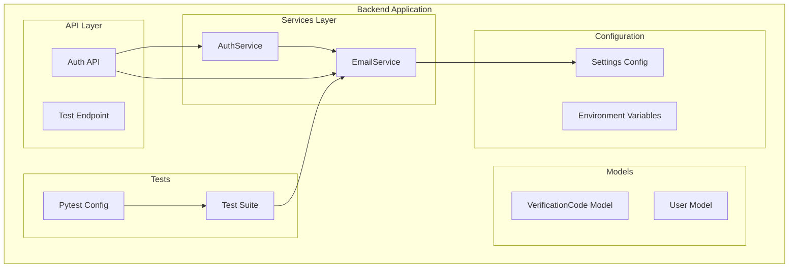
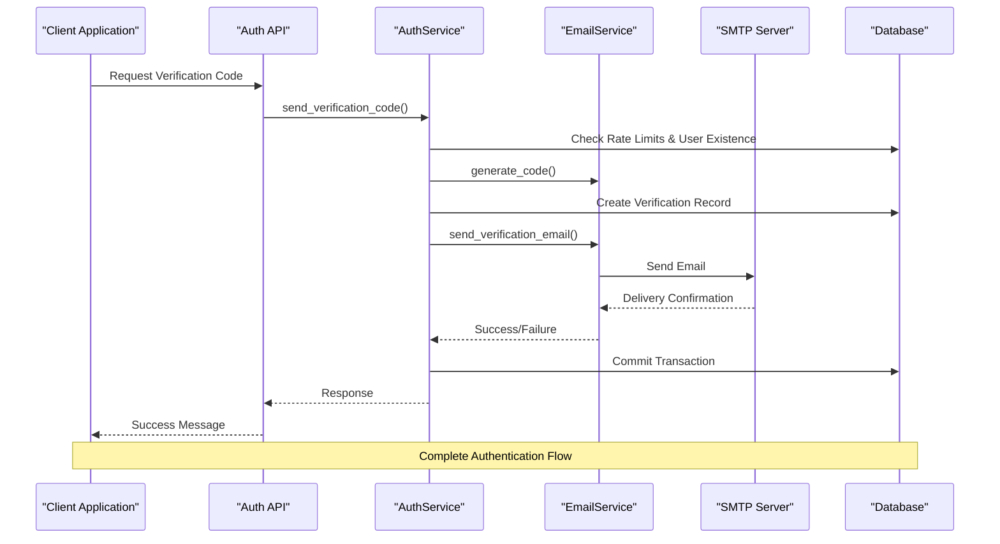
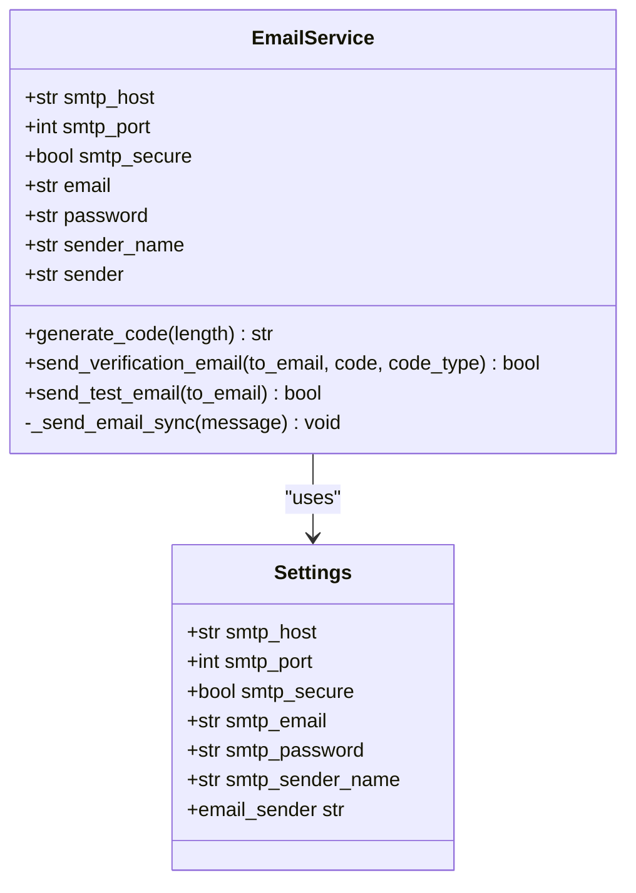
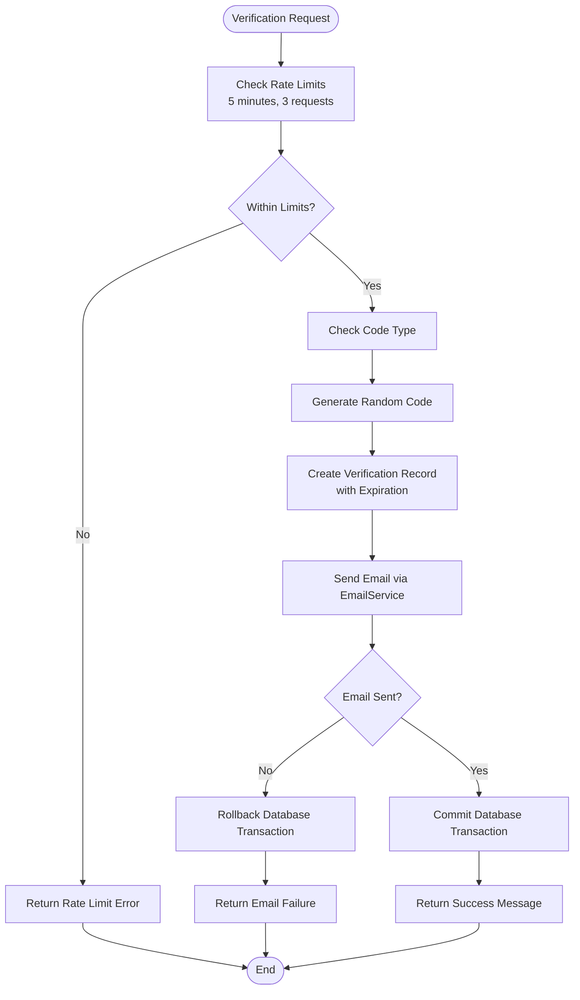
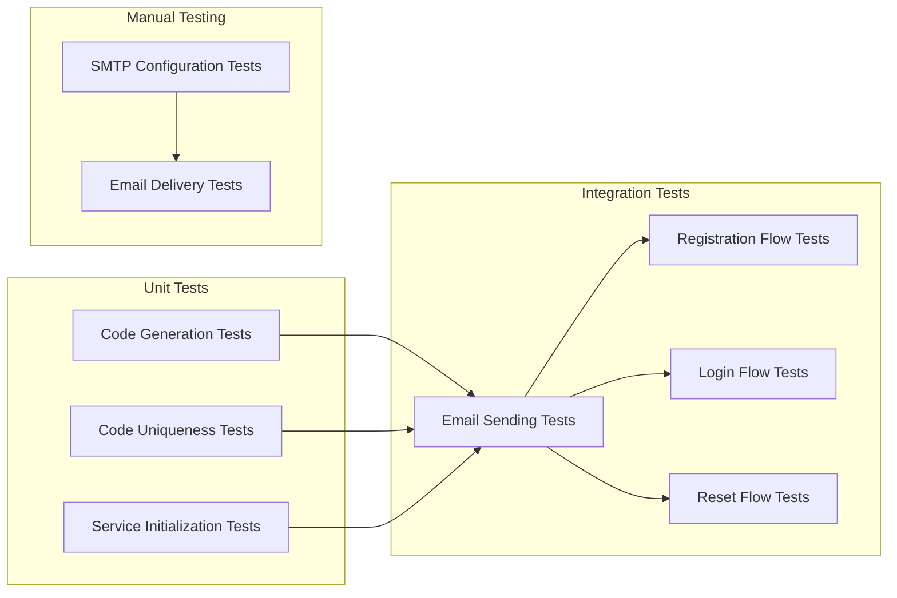
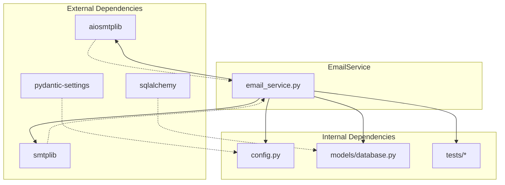
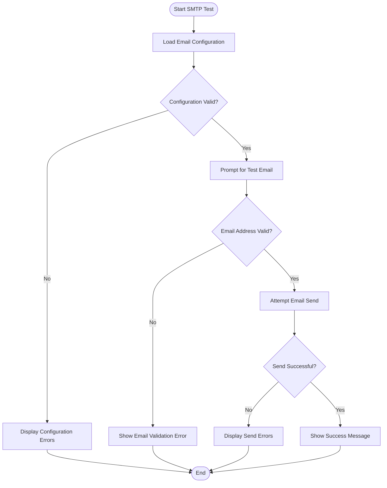

# Test Email Service

<cite>
**Referenced Files in This Document**
- [test_email_service.py](file://backend/tests/test_email_service.py)
- [email_service.py](file://backend/app/services/email_service.py)
- [conftest.py](file://backend/tests/conftest.py)
- [config.py](file://backend/app/core/config.py)
- [auth.py](file://backend/app/api/v1/auth.py)
- [auth_service.py](file://backend/app/services/auth_service.py)
- [database.py](file://backend/app/models/database.py)
- [requirements.txt](file://backend/requirements.txt)
- [test_smtp.py](file://backend/test_smtp.py)
</cite>

## Table of Contents
1. [Introduction](#introduction)
2. [Project Structure](#project-structure)
3. [Core Components](#core-components)
4. [Architecture Overview](#architecture-overview)
5. [Detailed Component Analysis](#detailed-component-analysis)
6. [Dependency Analysis](#dependency-analysis)
7. [Performance Considerations](#performance-considerations)
8. [Troubleshooting Guide](#troubleshooting-guide)
9. [Conclusion](#conclusion)

## Introduction

The Test Email Service is a comprehensive email delivery system integrated into the YinJi application, designed to handle authentication-related email communications including verification codes, registration notifications, and system testing. This service provides robust email functionality with support for both synchronous and asynchronous SMTP operations, ensuring reliable communication for user authentication processes.

The email service operates as a critical component in the application's authentication pipeline, enabling secure user registration, login verification, and password reset functionality through automated email delivery. It supports multiple email providers including Aliyun SMTP services and offers fallback mechanisms for different network environments.

## Project Structure

The email service is organized within the backend application structure following a modular architecture pattern:

**Diagram sources**
- [email_service.py:25-36](file://backend/app/services/email_service.py#L25-L36)
- [auth_service.py:16-13](file://backend/app/services/auth_service.py#L16-L13)
- [config.py:10-70](file://backend/app/core/config.py#L10-L70)

**Section sources**
- [email_service.py:1-228](file://backend/app/services/email_service.py#L1-L228)
- [auth_service.py:1-358](file://backend/app/services/auth_service.py#L1-L358)

## Core Components

### EmailService Class

The EmailService class serves as the primary interface for email operations within the application. It encapsulates all email-related functionality including verification code generation, email sending, and configuration management.

Key features include:
- **Dual SMTP Support**: Automatic fallback between aiosmtplib (asynchronous) and built-in smtplib (synchronous)
- **Dynamic Configuration**: Runtime configuration loading from environment variables
- **Multi-Type Email Support**: Registration, login, and password reset email templates
- **Robust Error Handling**: Comprehensive exception handling with graceful degradation

### Configuration Management

The email service relies on centralized configuration management through the Settings class, which handles environment variable loading and validation. The configuration system supports:

- **SMTP Provider Flexibility**: Support for various SMTP providers including Aliyun
- **Security Configuration**: SSL/TLS settings and authentication credentials
- **Rate Limiting**: Built-in constraints for verification code requests
- **Sender Identity**: Configurable sender names and email addresses

### Authentication Integration

The email service seamlessly integrates with the authentication system through the AuthService, which manages the complete authentication lifecycle including verification code generation, validation, and user account management.

**Section sources**
- [email_service.py:25-228](file://backend/app/services/email_service.py#L25-L228)
- [config.py:10-125](file://backend/app/core/config.py#L10-L125)
- [auth_service.py:16-358](file://backend/app/services/auth_service.py#L16-L358)

## Architecture Overview

The email service architecture follows a layered approach with clear separation of concerns:

**Diagram sources**
- [auth.py:63-93](file://backend/app/api/v1/auth.py#L63-L93)
- [auth_service.py:19-97](file://backend/app/services/auth_service.py#L19-L97)
- [email_service.py:50-156](file://backend/app/services/email_service.py#L50-L156)

The architecture ensures transactional integrity by writing verification records to the database before attempting email delivery, preventing orphaned verification codes in case of delivery failures.

**Section sources**
- [auth.py:1-446](file://backend/app/api/v1/auth.py#L1-L446)
- [auth_service.py:19-97](file://backend/app/services/auth_service.py#L19-L97)

## Detailed Component Analysis

### EmailService Implementation

The EmailService class implements a sophisticated email delivery system with the following key components:

#### Asynchronous SMTP Support

The service automatically detects and utilizes aiosmtplib for asynchronous email operations when available, falling back to synchronous smtplib with thread pool execution when asynchronous support is unavailable.

**Diagram sources**
- [email_service.py:25-36](file://backend/app/services/email_service.py#L25-L36)
- [config.py:40-70](file://backend/app/core/config.py#L40-L70)

#### Verification Code Generation

The verification code generation system creates cryptographically secure random codes with configurable length and digit-only composition, ensuring optimal security for authentication purposes.

#### Multi-Type Email Templates

The service supports three distinct email types with tailored content and subject lines:
- **Registration Emails**: Welcome messages with registration-specific instructions
- **Login Emails**: Authentication verification for user login attempts
- **Password Reset Emails**: Secure password recovery instructions

**Section sources**
- [email_service.py:25-228](file://backend/app/services/email_service.py#L25-L228)

### Authentication Service Integration

The AuthService coordinates email operations within the broader authentication framework, implementing sophisticated business logic for verification code management and user authentication.

**Diagram sources**
- [auth_service.py:19-97](file://backend/app/services/auth_service.py#L19-L97)
- [auth_service.py:70-97](file://backend/app/services/auth_service.py#L70-L97)

#### Database Integration

The authentication service maintains strict transactional integrity by creating verification code records before attempting email delivery. This ensures that database state remains consistent regardless of email delivery outcomes.

**Section sources**
- [auth_service.py:19-97](file://backend/app/services/auth_service.py#L19-L97)
- [database.py:47-70](file://backend/app/models/database.py#L47-L70)

### Testing Infrastructure

The email service includes comprehensive testing infrastructure supporting both unit and integration testing scenarios.

#### Test Suite Organization

The test suite is structured to validate both individual components and end-to-end functionality:

**Diagram sources**
- [test_email_service.py:9-97](file://backend/tests/test_email_service.py#L9-L97)
- [test_smtp.py:8-52](file://backend/test_smtp.py#L8-L52)

#### Test Email Service

The manual testing utility provides interactive SMTP configuration validation with comprehensive error reporting and troubleshooting guidance.

**Section sources**
- [test_email_service.py:1-97](file://backend/tests/test_email_service.py#L1-L97)
- [test_smtp.py:1-52](file://backend/test_smtp.py#L1-L52)

## Dependency Analysis

The email service maintains minimal external dependencies while providing comprehensive functionality:

**Diagram sources**
- [requirements.txt:18-19](file://backend/requirements.txt#L18-L19)
- [email_service.py:14-14](file://backend/app/services/email_service.py#L14-L14)
- [config.py:7-7](file://backend/app/core/config.py#L7-L7)

### Configuration Dependencies

The email service depends on centralized configuration management through pydantic-settings, enabling flexible environment-based configuration without code changes.

**Section sources**
- [requirements.txt:18-26](file://backend/requirements.txt#L18-L26)
- [config.py:10-125](file://backend/app/core/config.py#L10-L125)

## Performance Considerations

The email service is designed with several performance optimization strategies:

### Asynchronous Operations

The dual SMTP support architecture enables non-blocking email operations when aiosmtplib is available, improving overall application responsiveness during authentication workflows.

### Thread Pool Management

When asynchronous SMTP is unavailable, the service delegates synchronous operations to thread pools, preventing blocking of the main application thread while maintaining reliability.

### Connection Reuse

The service maintains efficient connection management to minimize overhead during high-volume email operations typical of authentication systems.

### Memory Efficiency

Verification code generation uses memory-efficient random number generation suitable for high-frequency authentication scenarios.

## Troubleshooting Guide

### Common Configuration Issues

**SMTP Authentication Failures**
- Verify SMTP credentials in environment variables
- Check SMTP server address and port configuration
- Confirm SSL/TLS settings match server requirements

**Email Delivery Failures**
- Validate recipient email addresses
- Check spam folder filtering
- Review SMTP server logs for delivery errors

### Development Environment Testing

The manual testing utility provides comprehensive diagnostic capabilities:

**Diagram sources**
- [test_smtp.py:8-52](file://backend/test_smtp.py#L8-L52)

### Production Deployment Checklist

- Configure environment variables for production deployment
- Set up proper SSL certificate validation
- Implement monitoring for email delivery metrics
- Establish backup SMTP configurations for redundancy
- Set up logging for email operation tracking

**Section sources**
- [test_smtp.py:8-52](file://backend/test_smtp.py#L8-L52)
- [config.py:39-70](file://backend/app/core/config.py#L39-L70)

## Conclusion

The Test Email Service represents a robust, production-ready email delivery system integrated into the YinJi authentication framework. Its architecture emphasizes reliability, security, and maintainability through comprehensive error handling, transactional integrity, and flexible configuration management.

The service successfully addresses the core requirements of modern authentication systems by providing secure verification code delivery, flexible SMTP provider support, and comprehensive testing infrastructure. The integration with the broader authentication system ensures seamless user experience while maintaining strict security standards.

Future enhancements could include support for additional email providers, enhanced monitoring and analytics capabilities, and expanded template customization options for different user segments and regional requirements.