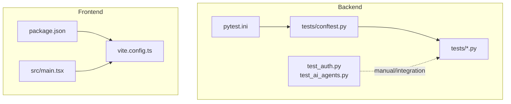
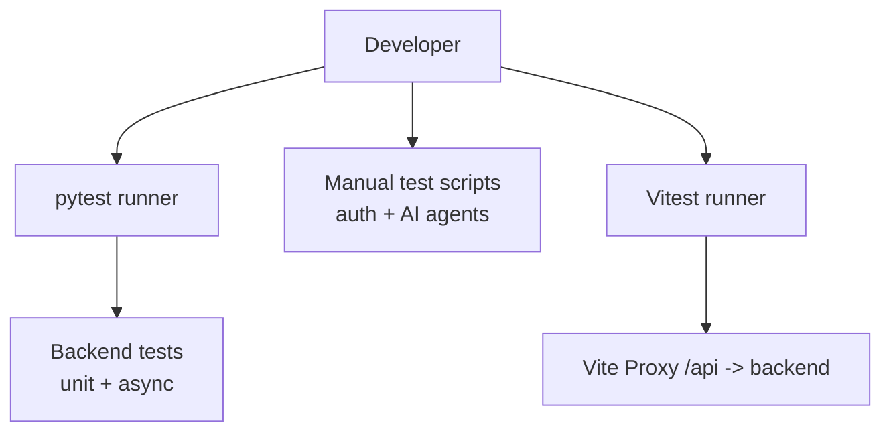
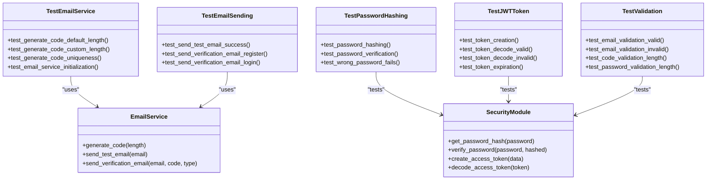
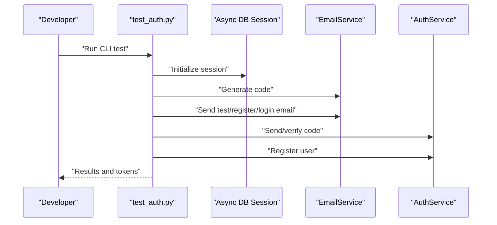
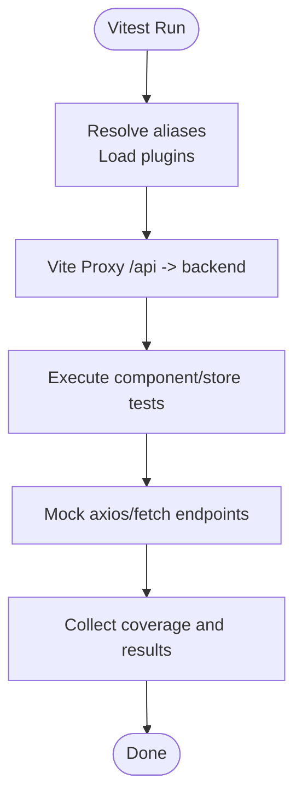
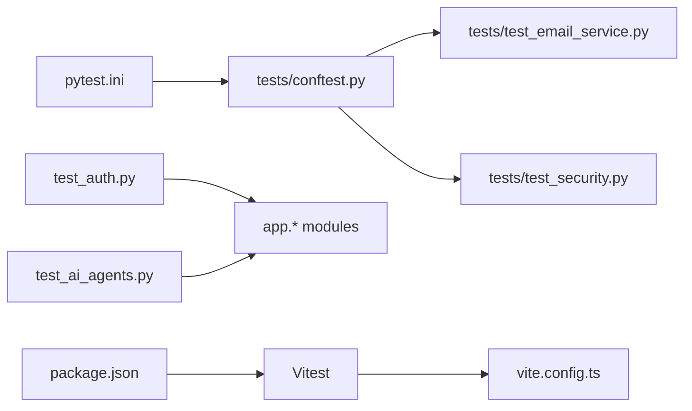

# Testing Strategy

<cite>
**Referenced Files in This Document**
- [pytest.ini](file://backend/pytest.ini)
- [conftest.py](file://backend/tests/conftest.py)
- [test_email_service.py](file://backend/tests/test_email_service.py)
- [test_security.py](file://backend/tests/test_security.py)
- [test_auth.py](file://backend/test_auth.py)
- [test_ai_agents.py](file://backend/test_ai_agents.py)
- [vite.config.ts](file://frontend/vite.config.ts)
- [package.json](file://frontend/package.json)
- [main.tsx](file://frontend/src/main.tsx)
</cite>

## Table of Contents
1. [Introduction](#introduction)
2. [Project Structure](#project-structure)
3. [Core Components](#core-components)
4. [Architecture Overview](#architecture-overview)
5. [Detailed Component Analysis](#detailed-component-analysis)
6. [Dependency Analysis](#dependency-analysis)
7. [Performance Considerations](#performance-considerations)
8. [Troubleshooting Guide](#troubleshooting-guide)
9. [Conclusion](#conclusion)
10. [Appendices](#appendices)

## Introduction
This document defines the testing strategy for the Yìjì application, covering backend and frontend testing approaches, configuration, and quality assurance practices. It consolidates the existing backend pytest-based unit and integration tests, documents frontend Vitest usage, and proposes best practices for coverage, CI, performance, security, and user acceptance testing.

## Project Structure
The repository includes:
- Backend: Python FastAPI application with pytest-based tests under backend/tests and ad-hoc test scripts under backend/.
- Frontend: React + TypeScript application configured for Vitest under frontend/.

**Diagram sources**
- [pytest.ini:1-28](file://backend/pytest.ini#L1-L28)
- [conftest.py:1-29](file://backend/tests/conftest.py#L1-L29)
- [test_auth.py:1-158](file://backend/test_auth.py#L1-L158)
- [test_ai_agents.py:1-161](file://backend/test_ai_agents.py#L1-L161)
- [vite.config.ts:1-27](file://frontend/vite.config.ts#L1-L27)
- [package.json:1-54](file://frontend/package.json#L1-L54)
- [main.tsx:1-12](file://frontend/src/main.tsx#L1-L12)

**Section sources**
- [pytest.ini:1-28](file://backend/pytest.ini#L1-L28)
- [conftest.py:1-29](file://backend/tests/conftest.py#L1-L29)
- [test_auth.py:1-158](file://backend/test_auth.py#L1-L158)
- [test_ai_agents.py:1-161](file://backend/test_ai_agents.py#L1-L161)
- [vite.config.ts:1-27](file://frontend/vite.config.ts#L1-L27)
- [package.json:1-54](file://frontend/package.json#L1-L54)
- [main.tsx:1-12](file://frontend/src/main.tsx#L1-L12)

## Core Components
- Backend testing framework: pytest with asyncio support, markers for unit/integration categorization, and optional coverage reporting.
- Manual/integration test scripts: interactive CLI-driven tests for email service, verification codes, registration, and AI agent analysis.
- Frontend testing framework: Vitest via npm scripts, with Vite proxy configured for API integration during development.

Key capabilities:
- Unit tests for email service behavior and security utilities.
- Async unit tests for email sending flows.
- Manual test suites for end-to-end workflows and AI agent analysis.

**Section sources**
- [pytest.ini:1-28](file://backend/pytest.ini#L1-L28)
- [conftest.py:1-29](file://backend/tests/conftest.py#L1-L29)
- [test_email_service.py:1-96](file://backend/tests/test_email_service.py#L1-L96)
- [test_security.py:1-164](file://backend/tests/test_security.py#L1-L164)
- [test_auth.py:1-158](file://backend/test_auth.py#L1-L158)
- [test_ai_agents.py:1-161](file://backend/test_ai_agents.py#L1-L161)
- [package.json:1-54](file://frontend/package.json#L1-L54)
- [vite.config.ts:1-27](file://frontend/vite.config.ts#L1-L27)

## Architecture Overview
The testing architecture separates concerns:
- Backend: pytest-driven unit and integration tests, plus manual scripts for real-world workflows.
- Frontend: Vitest-based component and store tests with mocked APIs via Vite proxy.

**Diagram sources**
- [pytest.ini:1-28](file://backend/pytest.ini#L1-L28)
- [test_auth.py:1-158](file://backend/test_auth.py#L1-L158)
- [test_ai_agents.py:1-161](file://backend/test_ai_agents.py#L1-L161)
- [package.json:1-54](file://frontend/package.json#L1-L54)
- [vite.config.ts:1-27](file://frontend/vite.config.ts#L1-L27)

## Detailed Component Analysis

### Backend Testing: Unit and Integration
- Test discovery and markers: pytest.ini configures test discovery and registers asyncio, integration, and unit markers. conftest.py extends marker registration for pytest.
- Email service tests: Validate code generation, initialization defaults, and async email sending flows.
- Security tests: Password hashing, verification, JWT creation and decoding, and Pydantic model validations for requests.

**Diagram sources**
- [test_email_service.py:1-96](file://backend/tests/test_email_service.py#L1-L96)
- [test_security.py:1-164](file://backend/tests/test_security.py#L1-L164)

**Section sources**
- [pytest.ini:1-28](file://backend/pytest.ini#L1-L28)
- [conftest.py:1-29](file://backend/tests/conftest.py#L1-L29)
- [test_email_service.py:1-96](file://backend/tests/test_email_service.py#L1-L96)
- [test_security.py:1-164](file://backend/tests/test_security.py#L1-L164)

### Backend Testing: Manual and Integration Scripts
- Interactive CLI tests for email service, verification code workflow, and user registration.
- AI agent analysis script with configurable behavior and simplified import testing mode.

**Diagram sources**
- [test_auth.py:1-158](file://backend/test_auth.py#L1-L158)

**Section sources**
- [test_auth.py:1-158](file://backend/test_auth.py#L1-L158)
- [test_ai_agents.py:1-161](file://backend/test_ai_agents.py#L1-L161)

### Frontend Testing: Vitest and Mocking
- Vitest is configured via npm scripts and runs React components and stores.
- Vite proxy forwards /api and /uploads to the backend host, enabling realistic API integration tests.

**Diagram sources**
- [vite.config.ts:1-27](file://frontend/vite.config.ts#L1-L27)
- [package.json:1-54](file://frontend/package.json#L1-L54)

**Section sources**
- [vite.config.ts:1-27](file://frontend/vite.config.ts#L1-L27)
- [package.json:1-54](file://frontend/package.json#L1-L54)
- [main.tsx:1-12](file://frontend/src/main.tsx#L1-L12)

## Dependency Analysis
- Backend test dependencies:
  - pytest.ini and conftest.py define discovery and markers.
  - test_email_service.py and test_security.py depend on app.services and app.core modules.
  - test_auth.py and test_ai_agents.py are standalone scripts that import app modules directly.
- Frontend test dependencies:
  - package.json defines Vitest and related tooling.
  - vite.config.ts configures proxy and aliases.

**Diagram sources**
- [pytest.ini:1-28](file://backend/pytest.ini#L1-L28)
- [conftest.py:1-29](file://backend/tests/conftest.py#L1-L29)
- [test_email_service.py:1-96](file://backend/tests/test_email_service.py#L1-L96)
- [test_security.py:1-164](file://backend/tests/test_security.py#L1-L164)
- [test_auth.py:1-158](file://backend/test_auth.py#L1-L158)
- [test_ai_agents.py:1-161](file://backend/test_ai_agents.py#L1-L161)
- [package.json:1-54](file://frontend/package.json#L1-L54)
- [vite.config.ts:1-27](file://frontend/vite.config.ts#L1-L27)

**Section sources**
- [pytest.ini:1-28](file://backend/pytest.ini#L1-L28)
- [conftest.py:1-29](file://backend/tests/conftest.py#L1-L29)
- [test_email_service.py:1-96](file://backend/tests/test_email_service.py#L1-L96)
- [test_security.py:1-164](file://backend/tests/test_security.py#L1-L164)
- [test_auth.py:1-158](file://backend/test_auth.py#L1-L158)
- [test_ai_agents.py:1-161](file://backend/test_ai_agents.py#L1-L161)
- [package.json:1-54](file://frontend/package.json#L1-L54)
- [vite.config.ts:1-27](file://frontend/vite.config.ts#L1-L27)

## Performance Considerations
- Backend:
  - Prefer unit tests over integration tests for performance-sensitive logic (e.g., hashing, token creation).
  - Use small, deterministic datasets for email and security tests.
  - Avoid real network calls in unit tests; rely on mocking or local SMTP stubs.
- Frontend:
  - Keep component tests focused and fast; mock heavy services (axios, zustand stores).
  - Use Vitest’s built-in timers sparingly; prefer deterministic waits or mocks.

[No sources needed since this section provides general guidance]

## Troubleshooting Guide
- Backend:
  - If tests fail due to missing environment variables (e.g., SMTP credentials), ensure configuration is present or mock the service layer.
  - For asyncio-related failures, confirm the test decorator and asyncio_mode are configured.
  - Use verbose output and short tracebacks for quicker diagnosis.
- Frontend:
  - If API calls fail in tests, verify Vite proxy settings and backend availability.
  - Ensure aliases are resolved correctly in test imports.

**Section sources**
- [pytest.ini:1-28](file://backend/pytest.ini#L1-L28)
- [vite.config.ts:1-27](file://frontend/vite.config.ts#L1-L27)

## Conclusion
The Yìjì project employs a pragmatic testing strategy:
- Backend: pytest-based unit and async tests with manual/integration scripts for real-world workflows.
- Frontend: Vitest with Vite proxy for realistic API integration.
To strengthen the suite, introduce dedicated frontend component and store tests, enforce coverage thresholds, and integrate automated CI pipelines for continuous quality assurance.

[No sources needed since this section summarizes without analyzing specific files]

## Appendices

### Test Organization and Categories
- Backend:
  - Unit tests: isolated logic (hashing, token creation, code generation).
  - Async tests: email sending flows.
  - Integration tests: manual scripts for end-to-end workflows.
- Frontend:
  - Component tests: UI logic and rendering.
  - Store tests: Zustand store state and actions.
  - API tests: mocked endpoints via Vite proxy.

**Section sources**
- [test_email_service.py:1-96](file://backend/tests/test_email_service.py#L1-L96)
- [test_security.py:1-164](file://backend/tests/test_security.py#L1-L164)
- [test_auth.py:1-158](file://backend/test_auth.py#L1-L158)
- [test_ai_agents.py:1-161](file://backend/test_ai_agents.py#L1-L161)
- [package.json:1-54](file://frontend/package.json#L1-L54)
- [vite.config.ts:1-27](file://frontend/vite.config.ts#L1-L27)

### Coverage and CI Recommendations
- Backend:
  - Enable coverage reporting via pytest configuration and integrate with CI to enforce minimum coverage thresholds.
- Frontend:
  - Configure Vitest coverage and include it in CI checks.
- General:
  - Enforce branch protection rules requiring passing tests and coverage reports.

[No sources needed since this section provides general guidance]

### Security and User Acceptance Testing
- Security:
  - Validate JWT expiration and payload integrity.
  - Ensure request schemas reject malformed inputs.
- User Acceptance:
  - Use manual scripts to simulate real user journeys (registration, login, diary analysis).
  - Document acceptance criteria for AI agent outputs and community features.

**Section sources**
- [test_security.py:1-164](file://backend/tests/test_security.py#L1-L164)
- [test_auth.py:1-158](file://backend/test_auth.py#L1-L158)
- [test_ai_agents.py:1-161](file://backend/test_ai_agents.py#L1-L161)