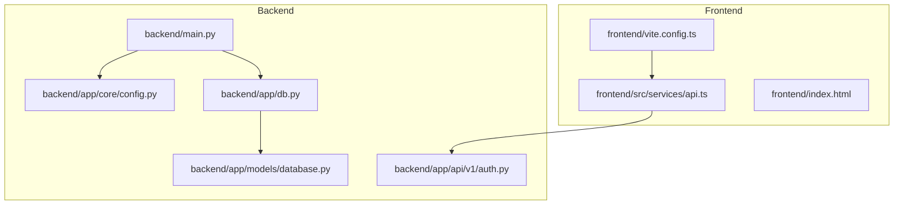
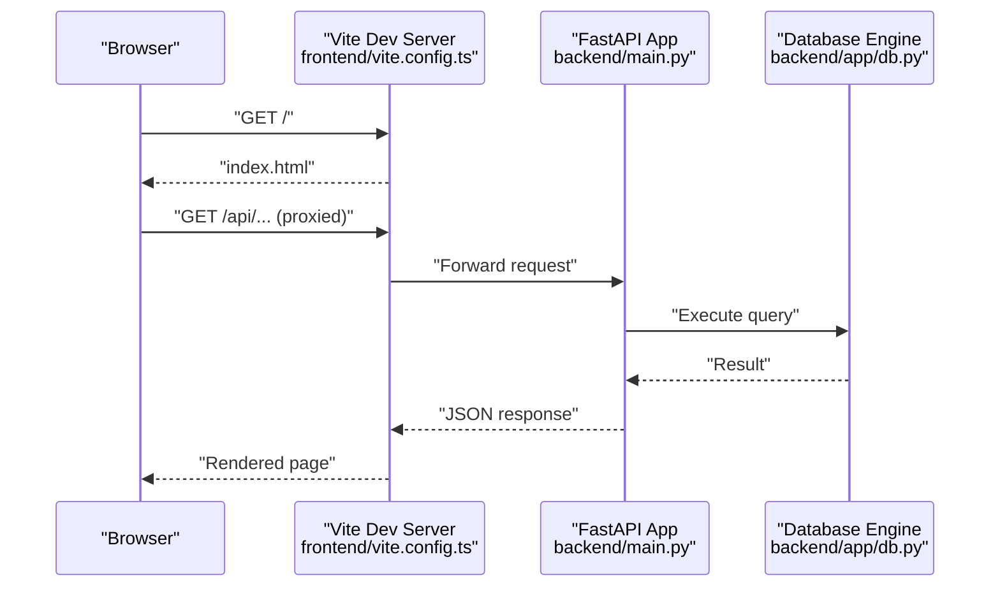
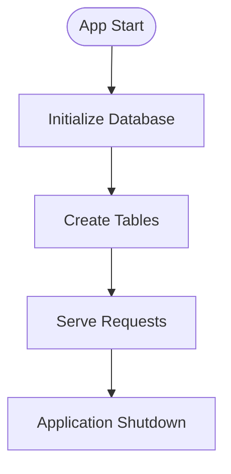
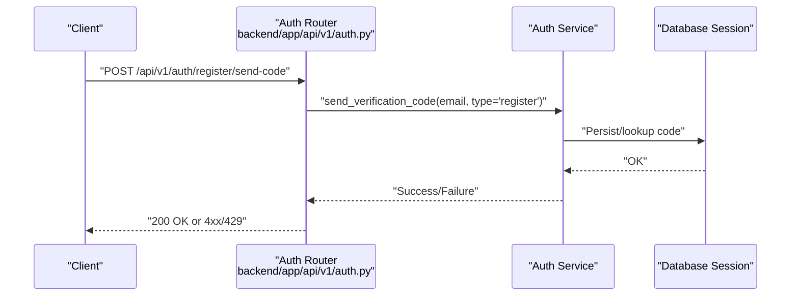
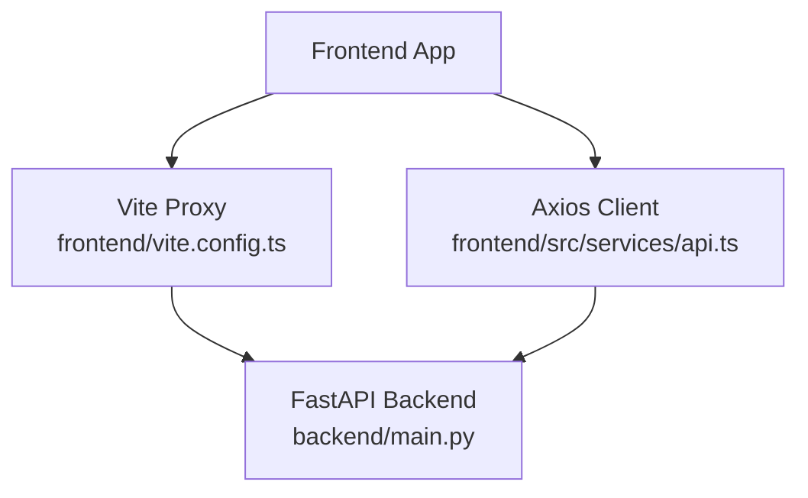
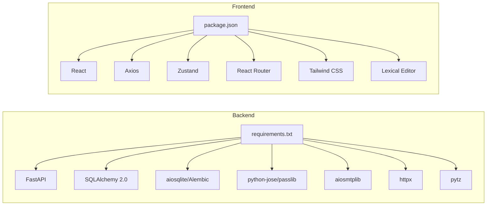

# Troubleshooting and FAQ

<cite>
**Referenced Files in This Document**
- [backend/README.md](file://backend/README.md)
- [frontend/README.md](file://frontend/README.md)
- [backend/main.py](file://backend/main.py)
- [backend/requirements.txt](file://backend/requirements.txt)
- [backend/app/core/config.py](file://backend/app/core/config.py)
- [backend/app/db.py](file://backend/app/db.py)
- [backend/app/models/database.py](file://backend/app/models/database.py)
- [backend/app/api/v1/auth.py](file://backend/app/api/v1/auth.py)
- [frontend/vite.config.ts](file://frontend/vite.config.ts)
- [frontend/src/services/api.ts](file://frontend/src/services/api.ts)
- [backend/install.bat](file://backend/install.bat)
- [backend/start.bat](file://backend/start.bat)
- [backend/.env.example](file://backend/.env.example)
- [frontend/.env.local](file://frontend/.env.local)
- [frontend/index.html](file://frontend/index.html)
</cite>

## Table of Contents
1. [Introduction](#introduction)
2. [Project Structure](#project-structure)
3. [Core Components](#core-components)
4. [Architecture Overview](#architecture-overview)
5. [Detailed Component Analysis](#detailed-component-analysis)
6. [Dependency Analysis](#dependency-analysis)
7. [Performance Considerations](#performance-considerations)
8. [Troubleshooting Guide](#troubleshooting-guide)
9. [Conclusion](#conclusion)
10. [Appendices](#appendices)

## Introduction
This document provides comprehensive troubleshooting and FAQ guidance for the 映记 application. It covers installation issues, database initialization and migration problems, API errors, frontend build and runtime issues, performance tuning, debugging techniques, logging and error tracking, production debugging and monitoring, and community resources. The goal is to help developers and operators quickly diagnose and resolve common problems while maintaining a smooth development and deployment experience.

## Project Structure
The 映记 project consists of two primary parts:
- Backend: FastAPI application with asynchronous SQLAlchemy ORM, JWT authentication, email service, and AI-related integrations.
- Frontend: React 18 + Vite + TypeScript application with shadcn/ui, Zustand state management, and Axios-based API client.

**Diagram sources**
- [backend/main.py:1-108](file://backend/main.py#L1-L108)
- [backend/app/core/config.py:1-105](file://backend/app/core/config.py#L1-L105)
- [backend/app/db.py:1-59](file://backend/app/db.py#L1-L59)
- [backend/app/models/database.py:1-70](file://backend/app/models/database.py#L1-L70)
- [backend/app/api/v1/auth.py:1-316](file://backend/app/api/v1/auth.py#L1-L316)
- [frontend/vite.config.ts:1-27](file://frontend/vite.config.ts#L1-L27)
- [frontend/src/services/api.ts:1-43](file://frontend/src/services/api.ts#L1-L43)
- [frontend/index.html:1-15](file://frontend/index.html#L1-L15)

**Section sources**
- [backend/README.md:80-105](file://backend/README.md#L80-L105)
- [frontend/README.md:16-35](file://frontend/README.md#L16-L35)

## Core Components
- Backend configuration and environment management via pydantic-settings with explicit defaults and validation.
- Asynchronous database layer using SQLAlchemy 2.0 with asyncpg for PostgreSQL and aiosqlite for SQLite.
- Authentication endpoints supporting email verification-based login and registration, plus password-based login.
- Frontend API client configured with request/response interceptors, base URL from environment, and automatic token injection.
- Development and deployment scripts for Windows environments.

Key configuration and environment variables are defined in the backend settings and .env.example, and consumed by the FastAPI app and services.

**Section sources**
- [backend/app/core/config.py:10-95](file://backend/app/core/config.py#L10-L95)
- [backend/.env.example:1-45](file://backend/.env.example#L1-L45)
- [backend/app/db.py:11-23](file://backend/app/db.py#L11-L23)
- [backend/app/api/v1/auth.py:25-316](file://backend/app/api/v1/auth.py#L25-L316)
- [frontend/src/services/api.ts:4-12](file://frontend/src/services/api.ts#L4-L12)

## Architecture Overview
The backend initializes the database at startup, mounts static upload directories, and exposes API routers under /api/v1. The frontend communicates with the backend via a proxy during development and uses a configurable base URL in production. CORS is enabled based on allowed origins.

**Diagram sources**
- [frontend/vite.config.ts:13-25](file://frontend/vite.config.ts#L13-L25)
- [backend/main.py:71-76](file://backend/main.py#L71-L76)
- [backend/app/db.py:11-23](file://backend/app/db.py#L11-L23)

**Section sources**
- [backend/main.py:31-76](file://backend/main.py#L31-L76)
- [frontend/vite.config.ts:13-25](file://frontend/vite.config.ts#L13-L25)

## Detailed Component Analysis

### Backend Startup and Database Initialization
- The application lifecycle initializes the database before serving requests and prints informational logs.
- Database engine creation respects debug mode for SQL echoing and supports both SQLite and PostgreSQL URLs.
- All models are imported during initialization to ensure metadata registration.

**Diagram sources**
- [backend/main.py:17-29](file://backend/main.py#L17-L29)
- [backend/app/db.py:45-59](file://backend/app/db.py#L45-L59)

**Section sources**
- [backend/main.py:17-29](file://backend/main.py#L17-L29)
- [backend/app/db.py:45-59](file://backend/app/db.py#L45-L59)

### Authentication Endpoints and Error Handling
- Registration and login endpoints support email verification codes and password-based login.
- Validation errors and rate-limiting scenarios return appropriate HTTP status codes.
- Test email endpoint is available for development.

**Diagram sources**
- [backend/app/api/v1/auth.py:25-53](file://backend/app/api/v1/auth.py#L25-L53)

**Section sources**
- [backend/app/api/v1/auth.py:25-316](file://backend/app/api/v1/auth.py#L25-L316)

### Frontend API Client and Proxy Configuration
- The API client reads the base URL from environment variables and injects Authorization headers when present.
- Request interceptor handles 401 responses by clearing tokens and redirecting to the welcome route.
- Vite proxy forwards /api and /uploads to the backend during development.

**Diagram sources**
- [frontend/vite.config.ts:15-24](file://frontend/vite.config.ts#L15-L24)
- [frontend/src/services/api.ts:14-40](file://frontend/src/services/api.ts#L14-L40)
- [backend/main.py:71-76](file://backend/main.py#L71-L76)

**Section sources**
- [frontend/src/services/api.ts:4-43](file://frontend/src/services/api.ts#L4-L43)
- [frontend/vite.config.ts:13-25](file://frontend/vite.config.ts#L13-L25)

## Dependency Analysis
- Backend dependencies include FastAPI, Uvicorn, SQLAlchemy 2.0, aiosqlite, Alembic, python-jose, passlib, pydantic, python-dotenv, aiosmtplib, httpx, and pytz.
- Frontend dependencies include React, React Router, Axios, Tailwind CSS, shadcn/ui components, Zustand, lexical editor, and testing libraries.

**Diagram sources**
- [backend/requirements.txt:1-26](file://backend/requirements.txt#L1-L26)
- [frontend/package.json:14-52](file://frontend/package.json#L14-L52)

**Section sources**
- [backend/requirements.txt:1-26](file://backend/requirements.txt#L1-L26)
- [frontend/package.json:14-52](file://frontend/package.json#L14-L52)

## Performance Considerations
- Database performance:
  - Use PostgreSQL in production for scalability and concurrency.
  - Enable connection pooling and tune engine parameters as needed.
  - Monitor slow queries and add indexes for frequent filters (e.g., email, verification code expiration).
- Backend performance:
  - Keep debug mode disabled in production to reduce overhead.
  - Use async I/O and avoid blocking operations in request handlers.
  - Consider caching for repeated reads and rate-limiting for write-heavy endpoints.
- Frontend performance:
  - Leverage code splitting and lazy loading for large components.
  - Optimize image assets and avoid unnecessary re-renders.
  - Minimize payload sizes by filtering data and using pagination.
- Network:
  - Ensure stable connectivity to external APIs (e.g., DeepSeek, Qdrant).
  - Configure timeouts appropriately in the API client.

[No sources needed since this section provides general guidance]

## Troubleshooting Guide

### Installation Problems (Windows)
- Symptom: pip install fails behind a proxy or firewall.
  - Resolution: Run the provided install script which sets HTTP/HTTPS proxies and installs dependencies from a mirror. Confirm the proxy is active and the mirror URL is reachable.
  - Next steps: After successful install, run the start script to verify dependencies and launch the server.
- Symptom: Python not found or missing packages after install.
  - Resolution: Activate the virtual environment before running the start script, and verify that required packages are installed.

**Section sources**
- [backend/install.bat:10-38](file://backend/install.bat#L10-L38)
- [backend/start.bat:12-28](file://backend/start.bat#L12-L28)

### Environment Variables and Configuration
- Symptom: Application fails to start due to missing or invalid configuration.
  - Resolution: Copy the example environment file and set required values, especially SECRET_KEY, QQ_EMAIL, QQ_EMAIL_AUTH_CODE, and database URL. Ensure allowed origins match the frontend address.
- Symptom: CORS errors in the browser console.
  - Resolution: Update ALLOWED_ORIGINS to include the frontend origin(s) used during development.

**Section sources**
- [backend/.env.example:14-24](file://backend/.env.example#L14-L24)
- [backend/app/core/config.py:17-20](file://backend/app/core/config.py#L17-L20)
- [backend/app/core/config.py:98-100](file://backend/app/core/config.py#L98-L100)

### Database Issues
- Symptom: Database initialization failure or table creation errors.
  - Resolution: Ensure the database engine URL is valid and accessible. For SQLite, verify file permissions. For PostgreSQL, check credentials and network connectivity. Restart the application after correcting the URL.
- Symptom: Slow queries or timeouts.
  - Resolution: Switch to PostgreSQL in production, add indexes for filtered columns, and review query patterns. Enable SQL echoing in debug mode temporarily for diagnostics.

**Section sources**
- [backend/app/db.py:11-23](file://backend/app/db.py#L11-L23)
- [backend/app/db.py:45-59](file://backend/app/db.py#L45-L59)
- [backend/app/core/config.py:22-26](file://backend/app/core/config.py#L22-L26)

### API Errors
- Symptom: 401 Unauthorized after login.
  - Resolution: Verify that the Authorization header is being added by the API client and that the token is stored in local storage. On 401, the client clears tokens and redirects to the welcome route.
- Symptom: Rate limit exceeded for verification codes.
  - Resolution: Respect the configured limits and cooldown period for sending verification codes.
- Symptom: Health check failing.
  - Resolution: Confirm database connectivity and that the database was initialized successfully.

**Section sources**
- [frontend/src/services/api.ts:14-40](file://frontend/src/services/api.ts#L14-L40)
- [backend/app/api/v1/auth.py:46-53](file://backend/app/api/v1/auth.py#L46-L53)
- [backend/main.py:89-95](file://backend/main.py#L89-L95)

### Frontend Build and Runtime Issues
- Symptom: Port 5173 already in use.
  - Resolution: Change the development server port in the Vite configuration.
- Symptom: API requests fail in development.
  - Resolution: Ensure the backend is running, verify the proxy target matches the backend address, and confirm the base URL environment variable in production builds.
- Symptom: Styles not applying or component library not rendering.
  - Resolution: Install Tailwind CSS and related dependencies as indicated in the frontend README.

**Section sources**
- [frontend/README.md:200-219](file://frontend/README.md#L200-L219)
- [frontend/vite.config.ts:13-25](file://frontend/vite.config.ts#L13-L25)
- [frontend/.env.local:1-3](file://frontend/.env.local#L1-L3)

### Email and Authentication Problems
- Symptom: QQ email sending fails.
  - Resolution: Confirm SMTP is enabled, the authorization code is correct, and the SSL port is set properly. Test the email endpoint in development.
- Symptom: JWT verification failures.
  - Resolution: Ensure SECRET_KEY is configured and not expired. Validate token generation and parsing logic.

**Section sources**
- [backend/README.md:141-146](file://backend/README.md#L141-L146)
- [backend/app/api/v1/auth.py:298-315](file://backend/app/api/v1/auth.py#L298-L315)
- [backend/app/core/config.py:28-37](file://backend/app/core/config.py#L28-L37)

### Logging and Debugging Tools
- Backend:
  - Enable debug mode to print SQL statements and increase verbosity.
  - Use the health endpoint to verify service status.
  - Add structured logging around critical paths and integrate with a logging framework in production.
- Frontend:
  - Use browser developer tools to inspect network requests, console logs, and local storage.
  - Add error boundaries and global error handlers to capture frontend exceptions.

**Section sources**
- [backend/app/core/config.py](file://backend/app/core/config.py#L16)
- [backend/main.py:89-95](file://backend/main.py#L89-L95)
- [frontend/src/services/api.ts:28-40](file://frontend/src/services/api.ts#L28-L40)

### Production Debugging and Monitoring
- Deploy with PostgreSQL and configure environment variables accordingly.
- Set up health checks and metrics endpoints.
- Use centralized logging and error tracking (e.g., Sentry) for both backend and frontend.
- Establish alerting for critical errors and performance regressions.

[No sources needed since this section provides general guidance]

### Issue Escalation Procedures
- Document reproducible steps, environment details, and logs.
- Categorize issues by severity and attach screenshots or recordings when applicable.
- Use appropriate channels (e.g., internal ticketing system) and tag relevant team members.

[No sources needed since this section provides general guidance]

### Frequently Asked Questions
- Q: How do I switch from SQLite to PostgreSQL?
  - A: Update the DATABASE_URL in the environment file to a PostgreSQL connection string and redeploy.
- Q: Why is my frontend not connecting to the backend?
  - A: Ensure the backend is running, the proxy target is correct in development, or the VITE_API_BASE_URL is set in production.
- Q: How do I enable debug logging?
  - A: Set DEBUG to true in the environment file and restart the backend.

**Section sources**
- [backend/README.md:115-127](file://backend/README.md#L115-L127)
- [frontend/vite.config.ts:15-24](file://frontend/vite.config.ts#L15-L24)
- [frontend/.env.local:1-3](file://frontend/.env.local#L1-L3)
- [backend/app/core/config.py](file://backend/app/core/config.py#L16)

## Conclusion
By following the troubleshooting steps and best practices outlined above, most installation, configuration, database, API, and frontend issues can be resolved efficiently. Adopt structured logging, monitoring, and error tracking in production, and maintain clear escalation procedures to keep the application stable and performant.

[No sources needed since this section summarizes without analyzing specific files]

## Appendices

### Quick Reference: Common Commands and Paths
- Backend install and start scripts:
  - [backend/install.bat:38-48](file://backend/install.bat#L38-L48)
  - [backend/start.bat](file://backend/start.bat#L43)
- Backend entrypoint and health:
  - [backend/main.py:98-107](file://backend/main.py#L98-L107)
  - [backend/main.py:89-95](file://backend/main.py#L89-L95)
- Frontend development and proxy:
  - [frontend/vite.config.ts:13-25](file://frontend/vite.config.ts#L13-L25)
  - [frontend/src/services/api.ts:4-12](file://frontend/src/services/api.ts#L4-L12)
- Environment configuration:
  - [backend/.env.example:1-45](file://backend/.env.example#L1-L45)
  - [frontend/.env.local:1-3](file://frontend/.env.local#L1-L3)

[No sources needed since this section aggregates previously cited items]