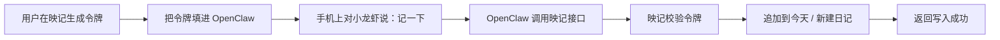

# OpenClaw 手机接入映记图文说明

## 一、你会得到什么

完成接入后，你可以直接在手机上对小龙虾说：

- 记一下今天做了什么
- 帮我把这段话写进今天的日记
- 单独存成一篇新日记

小龙虾就会把内容直接写入你的映记。

---

## 二、接入前准备

### 第 1 步：打开映记设置页

进入：

- 映记首页
- 右上角头像
- 个人设置

找到卡片：

- **OpenClaw 小龙虾速记接入**

### 第 2 步：生成接入令牌

点击：

- **生成接入令牌**

你会看到：

- 一串专属 token
- 接入地址
- 推荐给 OpenClaw 的技能提示词

注意：

- token 只会完整展示一次
- 建议立刻复制保存

---

## 三、在 OpenClaw 里怎么填

### 推荐地址

```text
http://yingjiapp.com/api/v1/integrations/openclaw/ingest
```

### 请求头

```text
Authorization: Bearer 你的令牌
Content-Type: application/json
```

### 默认请求体

```json
{
  "content": "用户刚刚说的内容",
  "mode": "append_today"
}
```

### 新建一篇时

```json
{
  "content": "用户刚刚说的内容",
  "mode": "create"
}
```

---

## 四、为什么有时会报错

### 情况 1：返回 401

说明：

- 令牌错误
- 令牌已失效
- 请求头没带上 `Authorization`

### 情况 2：返回 404

说明：

- 地址写错了
- 平台自动把 `http` 改成了 `https`

当前要特别注意：

- `http://yingjiapp.com` 是映记
- `https://yingjiapp.com` 目前还不是映记对应站点

所以在证书没配好前，**请优先使用 `http`**

### 情况 3：返回 400 / 422

说明：

- 请求体格式不正确
- 常见是 JSON 没转义好

现在映记已经兼容：

1. JSON
2. 纯文本
3. 表单

所以如果 JSON 老失败，可以改用纯文本方式。

---

## 五、推荐的最稳配置

如果你的 OpenClaw 支持 HTTP 动作，推荐这样配：

```text
POST http://yingjiapp.com/api/v1/integrations/openclaw/ingest
Authorization: Bearer 你的令牌
Content-Type: text/plain
```

正文直接放：

```text
今天在图书馆把部署流程跑通了，终于顺了一口气。
```

如果要新建而不是追加：

```text
POST http://yingjiapp.com/api/v1/integrations/openclaw/ingest?mode=create
```

---

## 六、整条流程图



---

## 七、开源仓库

OpenClaw 技能包已作为独立开源仓库发布：

- 仓库地址：[github.com/rain1andsnow2a/yinji-openclaw-skill](https://github.com/rain1andsnow2a/yinji-openclaw-skill)

包含文件：

- `skill.md` — 技能说明与行为约束
- `http-action.json` — HTTP 动作配置示例
- `examples.md` — 提示词版本（不支持结构化动作时使用）
- `test_ingest.py` — 本地联调脚本
