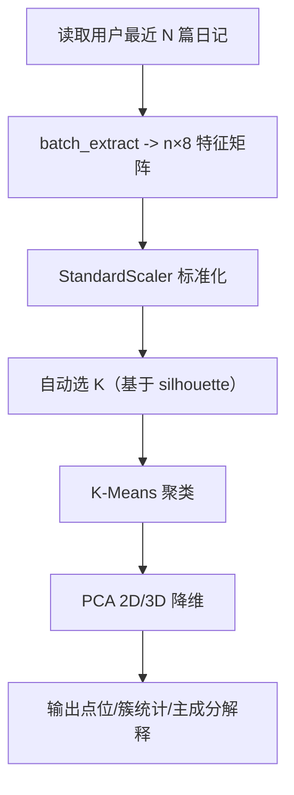

# 情绪特征向量实现评估与流程报告（基于 `emotion_feature_service.py`）

## 1. 总结评价

你现在这套情绪特征向量实现，属于**“规则与心理学先验驱动”的中上水平工程方案**：

1. 优点：可解释性强、成本低、无需大模型即可稳定运行。  
2. 缺点：词典覆盖与规则上限明显，对隐喻、反讽、复杂语境的语义理解能力有限。  
3. 结论：非常适合作为当前产品阶段（MVP/毕业设计/可控成本上线）；若要追求更高准确度，可在后续叠加模型化情绪编码器。

---

## 2. 代码范围与职责

核心文件：

1. `backend/app/services/emotion_feature_service.py`  
2. `backend/app/api/v1/emotion.py`

核心职责：

1. 将单篇日记文本映射为 **8维情绪特征向量**。  
2. 对多篇日记做聚类（K-Means）与降维（PCA）并输出可视化点位。  
3. 提供单篇解释接口（命中词、情绪类别、每维度分值）。

---

## 3. 向量定义（8维）

当前向量维度如下（顺序固定）：

1. `valence`（情绪效价，[-1,1]，消极到积极）  
2. `arousal`（唤醒度，[0,1]，平静到激动）  
3. `dominance`（控制感，[0,1]，无力到掌控）  
4. `self_ref`（自我参照度，[0,1]）  
5. `social`（社交密度，[0,1]）  
6. `cognitive`（认知复杂度，[0,1]）  
7. `temporal`（时间取向，[-1,1]，过去到未来）  
8. `richness`（表达丰富度，[0,1]，词汇多样性）

这组定义兼顾了情绪心理学（VAD）和文本行为学（人称/社交/认知/时间）。

---

## 4. 实现原理（单篇向量）

## 4.1 文本预处理

1. 使用 `jieba` 分词。  
2. 空文本直接返回全零向量。

## 4.2 VAD 计算

1. 内置中文情绪词典 `EMOTION_LEXICON`（词 -> VAD三元组）。  
2. 扫描词序列，命中情绪词后向前看窗口（3词）：
   - 命中否定词：反转并衰减 `valence`，并降低 `dominance`
   - 命中程度副词：按系数放大/缩小强度
3. 对命中结果做加权平均（权重与情绪强度相关）。

## 4.3 其余5维

1. `self_ref`：第一人称词占比放大并截断到 [0,1]。  
2. `social`：社交词占比放大并截断。  
3. `cognitive`：反思/认知词占比放大并截断。  
4. `temporal`：未来词 vs 过去词差异比值。  
5. `richness`：词汇多样性（TTR）并附长度惩罚，避免短文本虚高。

---

## 5. 多篇日记分析流程（聚类与可视化）

调用入口：`GET /api/v1/emotion/cluster`

流程如下：

输出包含：

1. 每篇日记对应的聚类标签与二维坐标。  
2. 每个簇的中心特征、情绪标签（如“活力积极/压力焦虑”）。  
3. 全局统计（平均效价、平均唤醒度、轮廓系数等）。

---

## 6. 当前机制的优劣分析

## 6.1 优点

1. **可解释性强**：每个维度含义清晰，便于做产品文案和可视化。  
2. **部署成本低**：不依赖 GPU 或外部 embedding API。  
3. **稳定可控**：规则可调、行为可复现，便于调试与回归测试。  
4. **面向中文做了适配**：内置中文词典和程度副词机制。

## 6.2 局限

1. **词典上限**：新词、俚语、隐喻表达难覆盖。  
2. **语境理解不足**：反讽、复杂否定、跨句关系处理有限。  
3. **分词敏感**：分词误差会放大到特征值波动。  
4. **聚类稳定性依赖样本量**：日记数量少时簇意义有限（代码已有 `minimal_result` 兜底）。

---

## 7. 与“向量检索”机制的关系

这套 `emotion_feature_service.py` 的向量，主要用于**情绪分析与可视化**，不是你 Qdrant 那套检索向量。

1. 情绪特征向量：8维、强解释性、用于分析/聚类。  
2. 检索向量（另一套）：用于 RAG 召回，不同目标与维度体系。

建议长期保留“双向量体系”：

1. 一套服务“可解释分析”（当前8维很好）。  
2. 一套服务“语义检索召回”（后续可升级为真实 embedding）。

---

## 8. 优化建议（按优先级）

## P0（短期可做）

1. 扩充情绪词典和程度副词库（结合真实用户语料）。  
2. 对否定词规则做双重否定/跨词窗口优化。  
3. 给 8 维输出增加置信度字段（命中词数、有效词密度）。

## P1（中期升级）

1. 引入轻量情绪分类模型作为“校正器”（规则结果 + 模型分数融合）。  
2. 对 `temporal` 与 `richness` 增加更稳健的长度归一化策略。

## P2（长期）

1. 构建带标注的小样本评测集（人工标注 valence/arousal 区间）。  
2. 用离线评测驱动参数调优（而不是只看线上体感）。

---

## 9. 结论

从毕业设计和可上线产品视角看，你当前的 `emotion_feature_service.py` 是一套**思路正确、解释性很强、工程上很实用**的方案。  
若目标是“学术级高精度情绪识别”，则需要在这套规则基座上叠加模型化语义能力。
