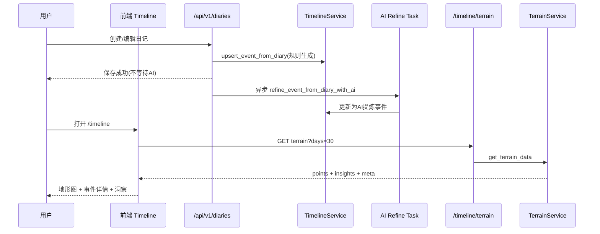

# 时间轴（/timeline）实现原理与流程说明

## 1. 目标与定位
`http://yingjiapp.com/timeline` 当前页面并不是“单一列表”，而是一个三层结构：

1. 事件层（持久化）：`timeline_events` 表
2. 聚合层（实时计算）：`/api/v1/diaries/timeline/terrain`
3. 展示层（前端地形图）：`frontend/src/pages/timeline/Timeline.tsx`

这三层共同构成“可持续更新、可回灌、可解释”的时间轴系统。

---

## 2. 前端页面流程（用户看到的）

### 2.1 页面加载
- 路由：`/timeline`
- 页面文件：`frontend/src/pages/timeline/Timeline.tsx`
- 首次加载默认拉取 `30` 天数据：
  - `diaryService.getTerrainData(30)`
  - 请求：`GET /api/v1/diaries/timeline/terrain?days=30`

### 2.2 交互行为
- 维度切换：`能量水平 / 愉悦程度 / 事件密度`
- 窗口切换：`7 / 30 / 90 天`
- 点击曲线点：展示当天事件详情，可跳转对应日记
- 洞察卡片：展示趋势、峰值、低谷摘要

### 2.3 用户可见的来源标签
为避免技术术语，页面使用中文来源说明：
- `AI提炼事件`
- `日记自动摘要`

对应字段来源：`events[].source_label`

---

## 3. 后端核心接口

### 3.1 地形图数据接口（展示主入口）
- 路由：`GET /api/v1/diaries/timeline/terrain`
- 文件：`backend/app/api/v1/diaries.py`
- 服务：`terrain_service.get_terrain_data(...)`
- 文件：`backend/app/services/terrain_service.py`

返回结构：
- `points[]`：按天聚合后的 `energy/valence/density/events`
- `insights`：峰值、低谷、趋势文本
- `meta`：覆盖范围与统计信息

### 3.2 时间轴重建接口（修复/回灌）
- 路由：`POST /api/v1/diaries/timeline/rebuild?days=180`
- 文件：`backend/app/api/v1/diaries.py`
- 服务：`timeline_service.rebuild_events_for_user(...)`
- 文件：`backend/app/services/diary_service.py`

用途：基于历史日记批量补齐/修复时间轴事件（幂等）。

---

## 4. 时间轴事件是如何产生的

## 4.1 主生产链路（当前默认）
### A. 创建日记
- 接口：`POST /api/v1/diaries/`
- 行为：
  1. 先保存日记到 `diaries`
  2. 同步调用 `upsert_event_from_diary` 生成/更新时间轴事件（规则法，秒级）
  3. 异步调度 `refine_event_from_diary_with_ai`（AI精炼，不阻塞保存）

### B. 编辑日记
- 接口：`PUT /api/v1/diaries/{diary_id}`
- 行为与创建一致：先规则更新，再异步AI精炼。

## 4.2 AI分析链路（增强）
- 接口：`POST /api/v1/ai/analyze`
- 文件：`backend/app/api/v1/ai.py`
- 行为：分析流程中若产出 timeline_event，会写入/更新对应事件，并标记来源为 `AI提炼事件`。

## 4.3 历史回灌链路（运维）
- 接口：`POST /api/v1/diaries/timeline/rebuild`
- 脚本：`backend/scripts/rebuild_timeline_events.py`
- 用于老数据修复、迁移后补齐、批量重算。

---

## 5. 数据生产策略：规则 + AI 混合

## 5.1 规则法（即时）
位置：`TimelineService._build_event_payload_from_diary`

输入：`diary.title/content/emotion_tags/importance_score`
输出：
- `event_summary`（标题+正文截断摘要）
- `emotion_tag`（优先取首个情绪标签）
- `event_type`（关键词匹配：work/relationship/health/achievement/other）
- `related_entities.source = diary_auto`
- `related_entities.source_label = 日记自动摘要`

优势：快、稳定、成本低、可离线。

## 5.2 AI精炼（质量增强）
位置：`TimelineService.refine_event_from_diary_with_ai`

做法：
- 读取单篇日记
- 调用 LLM 输出 JSON（摘要/情绪/类型/重要性）
- 更新同一 `diary_id` 的事件
- 标记来源：
  - `source = ai_analysis`
  - `source_label = AI提炼事件`

优势：摘要更自然，类型更准确。

## 5.3 覆盖保护（关键）
位置：`TimelineService.upsert_event_from_diary`

策略：
- 若现有事件来源是 `ai_analysis`，规则法默认不覆盖AI内容（除必要日期同步）
- 防止 `rebuild` 或日记编辑把高质量AI结果回退成粗粒度规则摘要

---

## 6. 地形聚合算法（/terrain）

位置：`backend/app/services/terrain_service.py`

## 6.1 按天聚合
- 数据源：`timeline_events + diaries`
- 规则：
  - 有时间轴事件时优先使用事件
  - 无事件但有日记时使用日记推断（fallback）
  - 无数据日 `energy/valence = None, density = 0`

## 6.2 三维指标
- `energy`：重要性/强度（1-10）
- `valence`：情绪正负值（由 `emotion_tag -> valence` 映射）
- `density`：当天事件数

## 6.3 洞察生成
- 峰值检测：局部极大 + 阈值
- 低谷检测：连续低值区间
- 趋势检测：前后半段均值差

说明：此处为本地算法，不依赖实时AI调用，响应快且成本稳定。

---

## 7. 用户隔离与数据安全

为了避免“看到他人事件”，系统做了双重隔离：

1. 查询隔离
- `TimelineService.get_timeline/get_events_by_date`
- `TerrainService._fetch_events`
- 条件：
  - `timeline_events.user_id == current_user.id`
  - 且（若有 `diary_id`）该 diary 必须属于当前用户

2. 写入隔离
- `TimelineService.create_event` 会校验 `diary_id` 必须归属当前用户
- `ai.py` 持久化事件时也带 `TimelineEvent.user_id == current_user.id` 条件

3. 历史脏数据修复
- 可通过 `rebuild` 或脚本回灌清洗，确保口径一致。

---

## 8. 典型时序（简化）



---

## 9. 当前能力边界（已知）

1. AI精炼是异步任务，极端情况下可能出现短暂“先规则、后AI”显示差异。  
2. `event_type` 规则关键词仍较基础，但已由异步AI精炼兜底。  
3. 当前未做独立任务队列（如 Celery），使用应用内异步调度；后续可升级为消息队列以提升可观测性与重试能力。

---

## 10. 快速排查清单（线上）

1. 时间轴数据异常：
- 先调用 `POST /api/v1/diaries/timeline/rebuild?days=365`
- 再刷新 `/timeline`

2. 检查后端状态：
- `sudo systemctl status yinji-backend`
- `sudo journalctl -u yinji-backend -f`

3. 强制全量回灌（服务器）：
```bash
cd /home/ubuntu/yinji-smart-diary/backend
PYTHONPATH=. python3 scripts/rebuild_timeline_events.py --all --days 365
```

---

## 11. 代码索引（便于二开）

- 时间轴页面：`frontend/src/pages/timeline/Timeline.tsx`
- 时间轴API客户端：`frontend/src/services/diary.service.ts`
- 时间轴类型：`frontend/src/types/diary.ts`
- 日记与时间轴API：`backend/app/api/v1/diaries.py`
- AI分析持久化：`backend/app/api/v1/ai.py`
- 时间轴服务：`backend/app/services/diary_service.py`
- 地形聚合服务：`backend/app/services/terrain_service.py`
- 回灌脚本：`backend/scripts/rebuild_timeline_events.py`

---

文档版本：v2026-04-01
